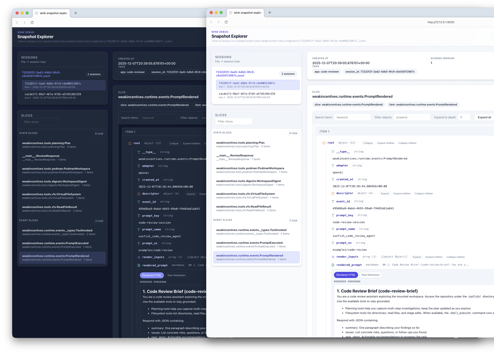

# Weak Incentives (Is All You Need)

WINK is a Python library for building background agents—automated AI systems that
run unattended. It provides typed, composable primitives designed for determinism,
testability, and safe execution without heavy dependencies or hosted services.

> **New to WINK?** Read the [WINK Guide](WINK_GUIDE.md) for a comprehensive
> introduction—philosophy, quickstart, and practical patterns for building agents.

## The Shift

The reasoning loop is moving model-side. Complex nested workflows may work today,
but they won't age well—models will absorb that scaffolding.

What remains: tools, retrieval, and **context engineering**.

Tools and retrieval draw on familiar software skills. Context engineering doesn't.
It's a genuinely new discipline: what's relevant now, what to summarize versus
preserve, how to structure information so models reason over it well. No clean
precedent from traditional engineering. Builders who master it early win.

Some orchestration stays—for auditability, cost control, hard constraints. WINK
focuses there: typed prompts as the primary artifact, observable session state,
sandboxed tools. The framework handles the scaffolding that needs to remain; you
focus on what you're feeding the model.

## What makes WINK different?

Most agent frameworks treat prompts as an afterthought—templates glued to
separately registered tool lists. WINK inverts this: **the prompt _is_ the
agent**. You define an agent as a single hierarchical document where each
section bundles its own instructions and tools together.

### One flexible reasoning loop

A WINK `Prompt` isn't just a template—it's the entire brain of your agent. One
modular object combines instructions, tool registration, and progressive
disclosure into a single reasoning loop that adapts to context.

Most frameworks scatter agent behavior across prompt templates, tool registries,
and routing logic. WINK collapses all of this into a tree of typed `Section`
objects:

```
PromptTemplate[ReviewResponse]
├── MarkdownSection (guidance)
├── WorkspaceDigestSection     ← auto-generated codebase summary
├── MarkdownSection (reference docs, progressive disclosure)
├── PlanningToolsSection       ← contributes planning_* tools
│   └── (nested planning docs)
├── VfsToolsSection            ← contributes ls/read_file/write_file/...
│   └── (nested filesystem docs)
└── MarkdownSection (user request)
```

Each section can render instructions, contribute tools the LLM can invoke, nest
child sections, and enable or disable itself based on runtime state. When a
section disables, its entire subtree—tools included—vanishes from the prompt.

The result: **the prompt fully determines what the agent can think and do**.
There's no separate tool registry to synchronize, no routing layer to maintain,
no configuration that can drift from documentation. You define the agent's
capabilities once, in one place, and the reasoning loop emerges from the
structure itself.

### Why this matters

1. **Co-location.** Instructions and tools live together. The section that
   explains filesystem navigation is the same section that provides the
   `read_file` tool. Documentation can't drift from implementation.

1. **Progressive disclosure.** Nest child sections to reveal advanced
   capabilities only when relevant. The LLM sees numbered, hierarchical headings
   that mirror your code structure.

1. **Dynamic scoping.** Each section has an `enabled` predicate. Disable a
   section and its entire subtree—tools included—disappears from the prompt.
   Swap in a `PodmanSandboxSection` instead of `VfsToolsSection` when a shell
   is available; the prompt adapts automatically.

1. **Typed all the way down.** Sections are parameterized with dataclasses.
   Placeholders are validated at construction time. Tools declare typed params
   and results. The framework catches mismatches before the request reaches
   an LLM.

### Other key features

- **Transactional tool execution.** Tool calls are atomic transactions. When a
  tool fails, WINK automatically rolls back session state and filesystem changes
  to their pre-call state. No more wrestling with partial failures that leave
  your agent's state corrupted or your filesystem in an inconsistent state. This
  happens by default—failed tools simply don't leave traces in mutable state.
  See [Session State](specs/SESSIONS.md).

- **Event-driven state management.** Every state change flows through pure
  functions called "reducers" that process published events. State is immutable;
  changes produce new values rather than mutating in place. This makes state
  predictable and inspectable—you can snapshot at any point and see exactly what
  happened. See [Session State](specs/SESSIONS.md).

- **Hash-based prompt overrides.** Prompt descriptors carry content hashes so
  overrides apply only to the intended version. Teams iterate on prompts via
  version-controlled JSON without risking stale edits.
  See [Prompt Optimization](specs/PROMPT_OPTIMIZATION.md).

- **Sandboxed virtual filesystem.** Agents get an in-memory VFS tracked as session
  state. Mount host directories read-only when needed; the sandbox prevents
  accidental writes to the host. See [Workspace Tools](specs/WORKSPACE.md).

- **Provider-agnostic adapters.** Swap between OpenAI, LiteLLM, Claude Agent SDK,
  or other providers without touching agent logic. Adapters handle tool
  negotiation, structured output schemas, and response normalization. The Claude
  Agent SDK adapter provides full agentic capabilities with hermetic isolation.
  See [Adapters](specs/ADAPTERS.md) and [Claude Agent SDK](specs/CLAUDE_AGENT_SDK.md).

- **Minimal dependencies.** No Pydantic, no heavyweight stacks. Custom serde
  modules provide validation without sprawling dependency trees.

## Requirements

- Python 3.12+
- [`uv`](https://github.com/astral-sh/uv) CLI

## Install

```bash
uv add weakincentives
# optional extras
uv add "weakincentives[asteval]"          # safe Python evaluation
uv add "weakincentives[openai]"           # OpenAI adapter
uv add "weakincentives[litellm]"          # LiteLLM adapter
uv add "weakincentives[claude-agent-sdk]" # Claude Agent SDK adapter
uv add "weakincentives[podman]"           # Podman sandbox
uv add "weakincentives[wink]"             # debug UI
```

### Debug UI

The `wink debug` command serves a FastAPI UI for exploring session snapshots:

```bash
uv run --extra wink wink debug snapshots/session.jsonl --port 8000
```

Features: slice browser with JSON viewer, session selector for multi-entry files,
live reload, raw download. Exit codes: `2` for invalid input, `3` for server
failures.



## Tutorial: Code Review Agent

Build a code review assistant that browses files, answers questions, and creates
review plans—all in a structured, observable, sandboxed way.

Full source: [`code_reviewer_example.py`](code_reviewer_example.py)

### 1. Define structured output

Dataclasses enforce the shape of agent responses:

```python
from dataclasses import dataclass

@dataclass(slots=True, frozen=True)
class ReviewResponse:
    summary: str
    issues: list[str]
    next_steps: list[str]
```

### 2. Compose the prompt

Prompts assemble from typed sections—guidance, planning tools, filesystem tools,
and user input. Create a reusable `PromptTemplate`, then bind runtime parameters
via `Prompt`:

```python
from weakincentives.prompt import MarkdownSection, Prompt, PromptTemplate
from weakincentives.contrib.tools import PlanningToolsSection, VfsToolsSection, WorkspaceDigestSection

template = PromptTemplate[ReviewResponse](
    ns="examples/code-review",
    key="code-review-session",
    name="code_review_agent",
    sections=(
        MarkdownSection(...),                          # guidance
        WorkspaceDigestSection(session=session),       # auto-generated summary
        PlanningToolsSection(session=session),         # planning tools
        VfsToolsSection(session=session, mounts=...),  # sandboxed files
        MarkdownSection[ReviewTurnParams](...),        # user input
    ),
)

# Bind runtime parameters to create the final prompt
prompt = Prompt(template).bind(ReviewTurnParams(request="Review main.py"))
```

### 3. Mount files safely

Give agents file access without host risk:

```python
from weakincentives.contrib.tools import HostMount, VfsPath, VfsToolsSection

mounts = (
    HostMount(
        host_path="repo",
        mount_path=VfsPath(("repo",)),
        include_glob=("*.py", "*.md", "*.toml"),  # whitelist patterns
        exclude_glob=("**/*.pickle",),            # blacklist patterns
        max_bytes=600_000,                        # size limit
    ),
)
vfs_section = VfsToolsSection(
    session=session,
    mounts=mounts,
    allowed_host_roots=(SAFE_ROOT,),
)
```

Agents use `ls` and `read_file` inside the sandbox.

### 4. Run and get typed results

Use `MainLoop` for production agents—it manages sessions, handles tool
invocations, and supports deadlines:

```python
from dataclasses import dataclass
from typing import Any
from weakincentives.runtime import MainLoop, Session
from weakincentives.runtime.events import InProcessDispatcher
from weakincentives.adapters.openai import OpenAIAdapter
from weakincentives.prompt import Prompt, PromptTemplate

# Type stubs for example (defined in your application)
@dataclass(frozen=True)
class ReviewTurnParams:
    request: str

@dataclass(frozen=True)
class ReviewResponse:
    summary: str

def build_task_prompt(*, session: Session) -> PromptTemplate[ReviewResponse]:  # type: ignore[type-arg]
    ...  # type: ignore[empty-body]

class ReviewLoop(MainLoop[ReviewTurnParams, ReviewResponse]):
    def __init__(self, adapter: Any, bus: Any) -> None:
        super().__init__(adapter=adapter, bus=bus)
        self._session = Session(bus=bus)
        self._template = build_task_prompt(session=self._session)

    def prepare(self, request: ReviewTurnParams) -> tuple[Prompt[ReviewResponse], Session]:
        prompt = Prompt(self._template).bind(request)
        return prompt, self._session

bus = InProcessDispatcher()
adapter = OpenAIAdapter(model="gpt-5.2")
loop = ReviewLoop(adapter, bus)

response, _ = loop.execute(ReviewTurnParams(request="Find bugs in main.py"))
if response.output is not None:
    review: ReviewResponse = response.output  # typed, validated
```

### 5. Inspect agent state

Every action is recorded. Query the session for plans, tool calls, or any slice:

```python
from weakincentives.contrib.tools.planning import Plan

plan = session[Plan].latest()
if plan:
    for step in plan.steps:
        print(f"[{step.status}] {step.title}")
```

### 6. Iterate prompts without code changes

Override prompt sections via version-controlled JSON:

```python
from weakincentives.prompt.overrides import LocalPromptOverridesStore

prompt = Prompt(
    template,
    overrides_store=LocalPromptOverridesStore(),
    overrides_tag="assertive-feedback",
).bind(ReviewTurnParams(request="..."))
rendered = prompt.render()
```

Overrides live in `.weakincentives/prompts/overrides/` and match by namespace,
key, and tag.

### Result

A code review agent with structured output, sandboxed file access, observable
state, and tunable prompts—built as regular software, not ad-hoc scripts.

### Using the Claude Agent SDK

The code reviewer also supports running with the Claude Agent SDK adapter,
which provides Claude's full agentic capabilities through native tools
(Read, Write, Bash, Glob, Grep) rather than the VFS sandbox. This mode offers
hermetic isolation with network restrictions while letting Claude use its
native tooling.

```bash
# Run with Claude Agent SDK (requires ANTHROPIC_API_KEY)
python code_reviewer_example.py --claude-agent
```

Key differences in Claude Agent SDK mode:

- **Native tools**: Uses Claude Code's built-in tools instead of VFS
- **Hermetic isolation**: Ephemeral home directory prevents access to host config
- **Network policy**: Restricted to specific documentation domains (PEPs, Python docs)
- **MCP bridging**: Custom WINK tools (planning, workspace digest) bridged via MCP
- **Sandbox**: OS-level sandboxing (bubblewrap on Linux, seatbelt on macOS)

```python
from weakincentives.adapters.claude_agent_sdk import (
    ClaudeAgentSDKAdapter,
    ClaudeAgentSDKClientConfig,
    ClaudeAgentWorkspaceSection,
    HostMount,
    IsolationConfig,
    NetworkPolicy,
    SandboxConfig,
)

# Create workspace with code mounted
workspace = ClaudeAgentWorkspaceSection(
    session=session,
    mounts=(HostMount(host_path="src", mount_path="src"),),
    allowed_host_roots=("/path/to/project",),
)

# Configure hermetic isolation
adapter = ClaudeAgentSDKAdapter(
    model="claude-sonnet-4-5-20250929",
    client_config=ClaudeAgentSDKClientConfig(
        permission_mode="bypassPermissions",
        cwd=str(workspace.temp_dir),
        isolation=IsolationConfig(
            network_policy=NetworkPolicy(allowed_domains=("docs.python.org",)),
            sandbox=SandboxConfig(enabled=True),
        ),
    ),
)

response = adapter.evaluate(prompt, session=session)
workspace.cleanup()  # Clean up temp directory
```

See [Claude Agent SDK Adapter](specs/CLAUDE_AGENT_SDK.md) for full configuration
reference and isolation guarantees.

## Logging

WINK provides structured logging with contextual metadata:

```python
from weakincentives.runtime.logging import configure_logging, get_logger

configure_logging(json_mode=True)
logger = get_logger("demo").bind(component="cli")
logger.info("boot", event="demo.start", context={"attempt": 1})
```

Use `force=True` to replace existing handlers. Each record includes `event` and
`context` fields for downstream routing.

## Development

```bash
uv sync && ./install-hooks.sh
```

Key targets:

- `make format` / `make lint` / `make typecheck`
- `make test` (100% coverage enforced)
- `make check` (all of the above plus Bandit, Deptry, pip-audit)

### Approach to code quality

WINK applies strict quality gates to keep the codebase predictable and safe:

- **Strict type checking.** Pyright strict mode enforced; type annotations are the
  source of truth.
- **Design-by-contract.** Public APIs use `@require`, `@ensure`, and `@invariant`
  decorators from `weakincentives.dbc`.
- **100% test coverage.** Every line in `src/weakincentives/` must be covered.
- **Security scanning.** Bandit, Deptry, and pip-audit run on every CI build.

Run `make check` before committing to verify all gates pass.

### Integration tests

```bash
export OPENAI_API_KEY="sk-..."
make integration-tests  # skipped without credentials
```

## Documentation

- `AGENTS.md` — contributor workflow
- `llms.md` — agent-friendly API overview (also the PyPI README)
- `specs/` — design documents
- `ROADMAP.md` — upcoming features

## License

Apache 2.0 • Status: Alpha (APIs may change)
