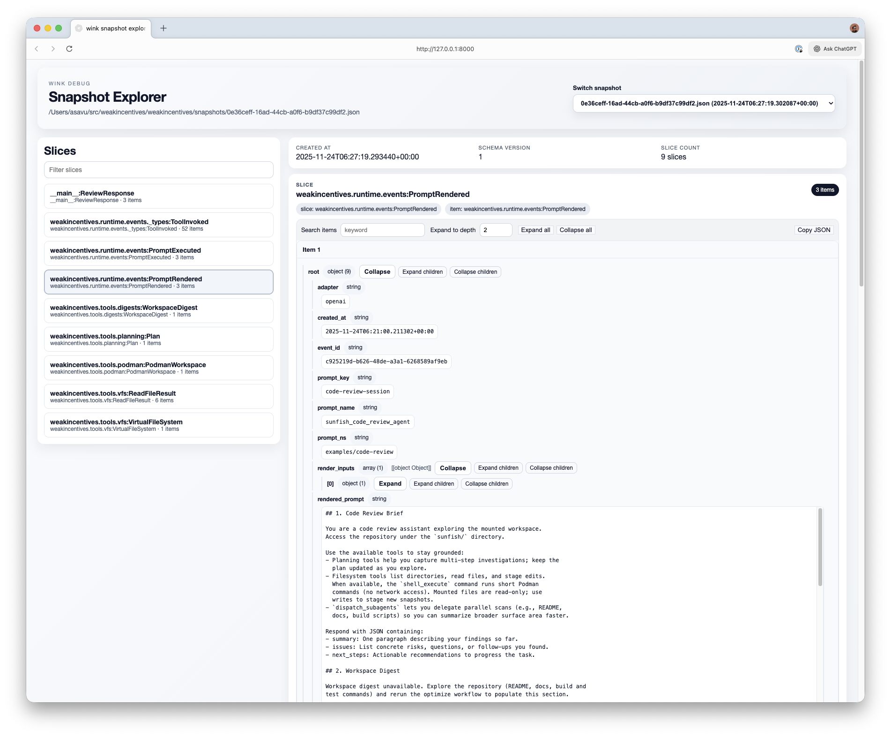

# Weak Incentives (Is All You Need)

WINK is a Python library for building background agents—automated AI systems that
run unattended. It provides typed, composable primitives designed for determinism,
testability, and safe execution without heavy dependencies or hosted services.

## What makes WINK different?

Most agent frameworks offer loose toolkits. WINK provides an opinionated chassis
that treats agent development as structured engineering:

- **Redux-style state management.** Every state change flows through pure reducers
  processing published events. Tool calls, prompt evaluations, and internal
  decisions become a replayable ledger—not scattered mutations in free-form dicts.
  See [Session State](specs/SESSIONS.md) and [Events](specs/EVENTS.md).

- **Typed prompt composition.** Prompts assemble from dataclass-backed sections
  that compose like regular code. No string concatenation, no template soup—just
  validated Markdown with automatic tool contract generation.
  See [Prompts](specs/PROMPTS.md) and [Composition](specs/PROMPTS_COMPOSITION.md).

- **Hash-based prompt overrides.** Prompt descriptors carry content hashes so
  overrides apply only to the intended version. Teams iterate on prompts via
  version-controlled JSON without risking stale edits.
  See [Prompt Overrides](specs/PROMPT_OVERRIDES.md).

- **Sandboxed virtual filesystem.** Agents get an in-memory VFS tracked as session
  state. Mount host directories read-only when needed; the sandbox prevents
  accidental writes to the host. See [VFS Tools](specs/VFS_TOOLS.md).

- **Provider-agnostic adapters.** Swap between OpenAI, LiteLLM, or other providers
  without touching agent logic. Adapters handle tool negotiation, structured
  output schemas, and response normalization.
  See [Adapters](specs/ADAPTERS.md) and [LiteLLM](specs/LITE_LLM_ADAPTER.md).

- **Minimal dependencies.** No Pydantic, no heavyweight stacks. Custom serde
  modules provide validation without sprawling dependency trees.

## Requirements

- Python 3.12+
- [`uv`](https://github.com/astral-sh/uv) CLI

## Install

```bash
uv add weakincentives
# optional extras
uv add "weakincentives[asteval]"      # safe Python evaluation
uv add "weakincentives[openai]"       # OpenAI adapter
uv add "weakincentives[litellm]"      # LiteLLM adapter
uv add "weakincentives[wink]"         # debug UI
```

### Debug UI

The `wink debug` command serves a FastAPI UI for exploring session snapshots:

```bash
uv run --extra wink wink debug snapshots/session.jsonl --port 8000
```

Features: slice browser with JSON viewer, session selector for multi-entry files,
live reload, raw download. Exit codes: `2` for invalid input, `3` for server
failures.



## Tutorial: Code Review Agent

Build a code review assistant that browses files, answers questions, and creates
review plans—all in a structured, observable, sandboxed way.

Full source: [`code_reviewer_example.py`](code_reviewer_example.py) •
Architecture: [`specs/code_reviewer_example.md`](specs/code_reviewer_example.md)

### 1. Define structured output

Dataclasses enforce the shape of agent responses:

```python
from dataclasses import dataclass

@dataclass(slots=True, frozen=True)
class ReviewResponse:
    summary: str
    issues: list[str]
    next_steps: list[str]
```

### 2. Compose the prompt

Prompts assemble from typed sections—guidance, planning tools, filesystem tools,
and user input:

```python
from weakincentives import MarkdownSection, Prompt
from weakincentives.tools.planning import PlanningToolsSection
from weakincentives.tools.vfs import VfsToolsSection

review_prompt = Prompt[ReviewResponse](
    ns="examples/code-review",
    key="code-review-session",
    name="code_review_agent",
    sections=(
        MarkdownSection(...),                          # guidance
        PlanningToolsSection(session=session),         # planning tools
        VfsToolsSection(session=session, mounts=...),  # sandboxed files
        MarkdownSection[ReviewTurnParams](...),        # user input
    ),
)
```

### 3. Mount files safely

Give agents file access without host risk:

```python
from weakincentives.tools.vfs import HostMount, VfsPath

mounts = (HostMount(host_path="repo", mount_path=VfsPath(("repo",))),)
vfs_section = VfsToolsSection(
    session=session,
    mounts=mounts,
    allowed_host_roots=(SAFE_ROOT,),
)
```

Agents use `vfs_list_files` and `vfs_read_file` inside the sandbox.

### 4. Run and get typed results

```python
from weakincentives.runtime.session import Session
from weakincentives.runtime.events import InProcessEventBus
from weakincentives.adapters.openai import OpenAIAdapter

bus = InProcessEventBus()
session = Session(bus=bus)
adapter = OpenAIAdapter(model="gpt-5.1")

response = adapter.evaluate(
    review_prompt,
    ReviewTurnParams(request="Find bugs in main.py"),
    bus=bus,
    session=session,
)

review: ReviewResponse = response.output  # typed, validated
```

### 5. Inspect agent state

Every action is recorded. Query the session for plans, tool calls, or any slice:

```python
from weakincentives.runtime.session import select_latest
from weakincentives.tools.planning import Plan

plan = select_latest(session, Plan)
if plan:
    for step in plan.steps:
        print(f"[{step.status}] {step.title}")
```

### 6. Iterate prompts without code changes

Override prompt sections via version-controlled JSON:

```python
rendered = review_prompt.render(
    ...,
    overrides_store=LocalPromptOverridesStore(),
    tag="assertive-feedback",
)
```

Overrides live in `.weakincentives/prompts/overrides/` and match by namespace,
key, and tag.

### Result

A code review agent with structured output, sandboxed file access, observable
state, and tunable prompts—built as regular software, not ad-hoc scripts.

## Logging

WINK provides structured logging with contextual metadata:

```python
from weakincentives.runtime.logging import configure_logging, get_logger

configure_logging(json_mode=True)
logger = get_logger("demo").bind(component="cli")
logger.info("boot", event="demo.start", context={"attempt": 1})
```

Use `force=True` to replace existing handlers. Each record includes `event` and
`context` fields for downstream routing.

## Development

```bash
uv sync && ./install-hooks.sh
```

Key targets:
- `make format` / `make lint` / `make typecheck`
- `make test` (100% coverage enforced)
- `make mutation-test` (mutmut, 80% score gate)
- `make check` (all of the above plus Bandit, Deptry, pip-audit)

### Integration tests

```bash
export OPENAI_API_KEY="sk-..."
make integration-tests  # skipped without credentials
```

## Documentation

- `AGENTS.md` — contributor workflow
- `specs/` — design documents
- `ROADMAP.md` — upcoming features
- `docs/api/` — API reference

## License

Apache 2.0 • Status: Alpha (APIs may change)
