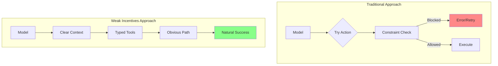
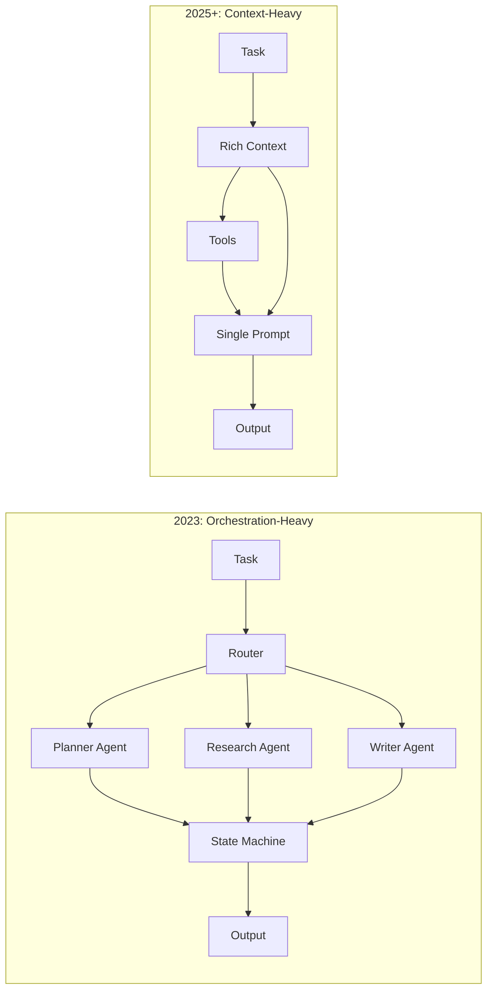
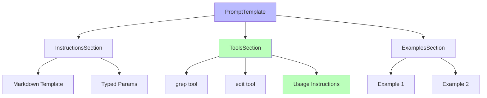

# Chapter 1: Philosophy

This chapter introduces the core philosophy behind WINK (Weak Incentives) and
explains the fundamental design principles that shape the library. You'll learn
why the project is called "weak incentives," how modern agent development
differs from traditional frameworks, and what makes WINK's approach to
prompts-as-programs distinctive.

Understanding these philosophical foundations will help you make better decisions
as you design agents, choose which abstractions to use, and debug systems when
things go wrong.

## The Weak Incentives Philosophy

"Weak incentives" is an engineering stance borrowed from mechanism design:

> Build agent systems where well-constructed prompts and tools create weak
> incentives for the model to do the right thing and stay on task.

In mechanism design, a system with the right incentives is one where participants
naturally gravitate toward intended behavior. Applied to language models, this
means shaping the prompt, tools, and context so the model's easiest path is also
the correct one.

This isn't about constraining the model or managing downside risk. It's about
_encouraging_ correct behavior through structure:

- **Clear instructions co-located with tools** make the right action obvious
- **Typed contracts** guide the model toward valid outputs
- **Progressive disclosure** keeps the model focused on what matters now
- **Explicit state** gives the model the context it needs to make good decisions

The optimization process strengthens these incentives. When you refine a prompt
override or add a tool example, you're making the correct path even more
natural. Over iterations, the system becomes increasingly well-tuned—not through
constraints, but through clarity.

### How WINK Encourages Good Behavior

Concretely, WINK pushes you toward several practices that create these weak
incentives:

#### Explicit Side Effects

Side effects live in tool handlers. Everything else—prompt rendering, state
transitions, reducers—is deterministic and pure. When something goes wrong, you
know exactly where to look: the tool handler that executed.

#### Typed Contracts Everywhere

Params, tool calls, tool results, structured outputs, session state—all typed
with dataclasses. Type mismatches surface at construction time, not at runtime
when the model is mid-response. Pyright strict mode is enforced; the type
checker is your first line of defense.

See [Chapter 3](03-prompts.md) for details on how typed contracts shape prompt
design.

#### Inspectability

If a run went wrong, you can inspect exactly what was rendered and what tools
ran. Sessions record every event as an immutable ledger. Snapshots let you
capture state at any point and restore it later.

Session inspection is covered in depth in [Chapter 5](05-sessions.md).

#### Controlled Context Growth

Progressive disclosure lets you default to summaries and expand on demand.
Instead of stuffing everything into the prompt upfront, you let the model
request what it needs. This keeps token counts manageable and models focused.

Progressive disclosure patterns are detailed in [Chapter 10](10-progressive-disclosure.md).

#### Safe Iteration

Hash-validated prompt overrides prevent accidental drift between "tested" and
"running" versions. When you override a section's text, the system validates
that you're overriding the version you think you're overriding.

The override system is explained in [Chapter 11](11-prompt-overrides.md).

### The Goal: Clarity, Not Constraint

The goal isn't to constrain the model—it's to give it the best possible starting
point. When prompts are clear, tools are well-documented, and state is explicit,
the model has strong signals about what to do. When something goes wrong, you
can see exactly what happened and refine the incentives for next time.

## From Orchestration to Context Engineering

Many early "agent frameworks" assumed the hard part would be workflow logic:
routers, planners, branching graphs, and elaborate loops. These frameworks spent
their complexity budget on orchestration—deciding which prompts to run when,
routing between specialized agents, managing elaborate state machines.

WINK makes a different bet.

### Models Are Absorbing the Reasoning Loop

What required explicit multi-step orchestration yesterday often works in a
single prompt today. The frontier models are increasingly capable of planning,
reasoning, and self-correction within a single context window. Elaborate routing
graphs often just get in the way.

### The Durable Primitives

**The durable part of agent systems is tools, retrieval, and context engineering.**

- **Tools** define what the agent can do
- **Retrieval** determines what information is available
- **Context engineering** decides what to include, what to summarize, and how to
  structure information so the model reasons well

Context engineering is the tricky part. It's a genuinely new discipline: what's
relevant now, what to summarize versus preserve, how to shape information so
models reason over it well. There's no clean precedent from traditional
engineering. Builders who master it early win.

### WINK's Core Abstractions

WINK's core abstractions exist to make context engineering a real engineering
discipline:

- **Prompts** are structured, typed objects that you can inspect and test
- **Tools** are explicit contracts that surface what the model can do
- **State** is inspectable so you can debug failures
- **Safety** is enforced at tool boundaries where side effects happen

For the formal specification of these behaviors, see:
- [specs/PROMPTS.md](../specs/PROMPTS.md)
- [specs/TOOLS.md](../specs/TOOLS.md)
- [specs/SESSIONS.md](../specs/SESSIONS.md)
- [specs/MAIN_LOOP.md](../specs/MAIN_LOOP.md)

## Prompts as First-Class, Typed Programs

Most systems treat prompts as strings and hope conventions keep everything
aligned:

- Prompt text in one place
- Tool definitions in another
- Schema expectations in another
- Memory in another

Teams add layers: prompt registries, tool catalogs, schema validators. Each
layer is separately maintained. They drift. When something breaks, you're
hunting across files to understand what was actually sent to the model.

WINK inverts this approach entirely.

### The Prompt-as-Program Paradigm

In WINK, **a `PromptTemplate` is an immutable object graph**—a tree of sections
that form a coherent program.

Each section can:

- Render markdown instructions
- Declare placeholders backed by typed dataclasses
- Register tools next to the instructions that describe how to use them
- Optionally render as a summary to save tokens

The section that explains "here's how to search files" is the _same section_
that provides the `grep` tool. Documentation and capability live together. They
can't drift.

### The Complete Picture

**A `Prompt` binds runtime configuration:**

- Parameter dataclasses that fill template placeholders
- Prompt overrides store and tag for safe iteration
- Optionally a session for dynamic visibility and scoping

**A `ProviderAdapter` evaluates the prompt:**

- Renders markdown from the section tree
- Executes tool calls synchronously
- Returns text and/or parsed structured output

**A `Session` captures everything as an event-driven, reducer-managed state log:**

Every prompt render, every tool invocation, every state change is recorded. You
can query the session, snapshot it, restore it.

In other words: **your agent is a typed prompt + tools + state.**

### Novel Properties

Two "novel" properties fall out of this structure:

1. **Deterministic inspection**: Render, snapshot, and diff prompts. The same
   inputs produce the same outputs. You can write tests that assert on exact
   prompt text.

2. **Safe iteration**: Apply prompt tweaks via overrides that are validated
   against hashes. When you change a section in code, existing overrides stop
   applying until you explicitly update them. No silent drift.

These properties make prompt development feel more like traditional software
engineering: you can version control prompts, write tests, and iterate safely.

## What WINK Is (and Is Not)

Understanding WINK's scope helps you decide when to use it and how to integrate
it with other tools.

### WINK Is

**A Python library** for building prompts-as-agents. The core package is
`weakincentives`, designed to be composable and minimal.

**A small runtime** for state (`Session`) and orchestration (`MainLoop`). These
primitives handle the deterministic parts of agent execution.

**Provider adapters** that execute tools and parse outputs consistently across
different LLM providers (`OpenAI`, `LiteLLM`, `Claude Agent SDK`). See
[Chapter 6](06-adapters.md) for adapter details.

**Contributed tool suites** for background agents: planning tools, virtual
filesystem, sandboxes, workspace digests. These are in `weakincentives.contrib`
and covered in [Chapter 12](12-workspace-tools.md).

### WINK Is Not

**A distributed workflow engine.** If you need to coordinate across machines or
manage long-running jobs, use something built for that (Temporal, Prefect,
Airflow).

**A framework that tries to "own" your application architecture.** WINK is a
library. Use it for the pieces that benefit from determinism and composability.

**A multi-agent coordination system.** WINK focuses on single-agent patterns
done well. Multi-agent coordination is possible but not the primary design
target.

**An async-first streaming framework.** Today the adapter contract is
synchronous. Streaming may come later, but it's not a core design goal.

### Playing Well With Others

If you need a graph engine or multi-agent coordination, you can still use WINK
for the pieces that benefit from determinism—prompt design, tool contracts,
state snapshots—and let something else coordinate the rest.

WINK is designed to be composable. You can use `PromptTemplate` and `Session`
without using `MainLoop`. You can use the adapters without the contrib tools.
Pick the pieces that solve your problems.

---

**In the next chapter**, we'll dive into a practical quickstart that shows you
how to build your first WINK agent in under 100 lines of code.
