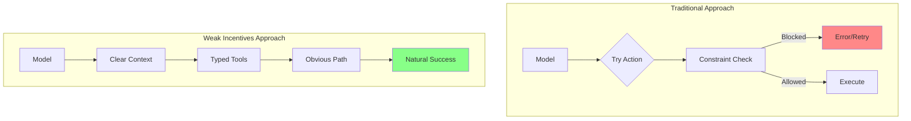
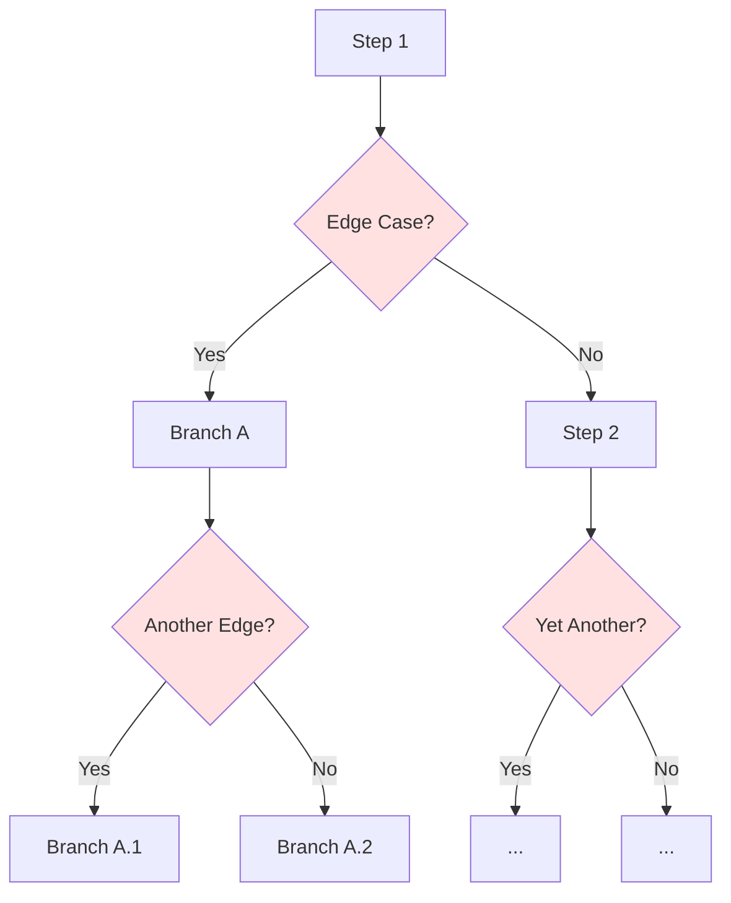
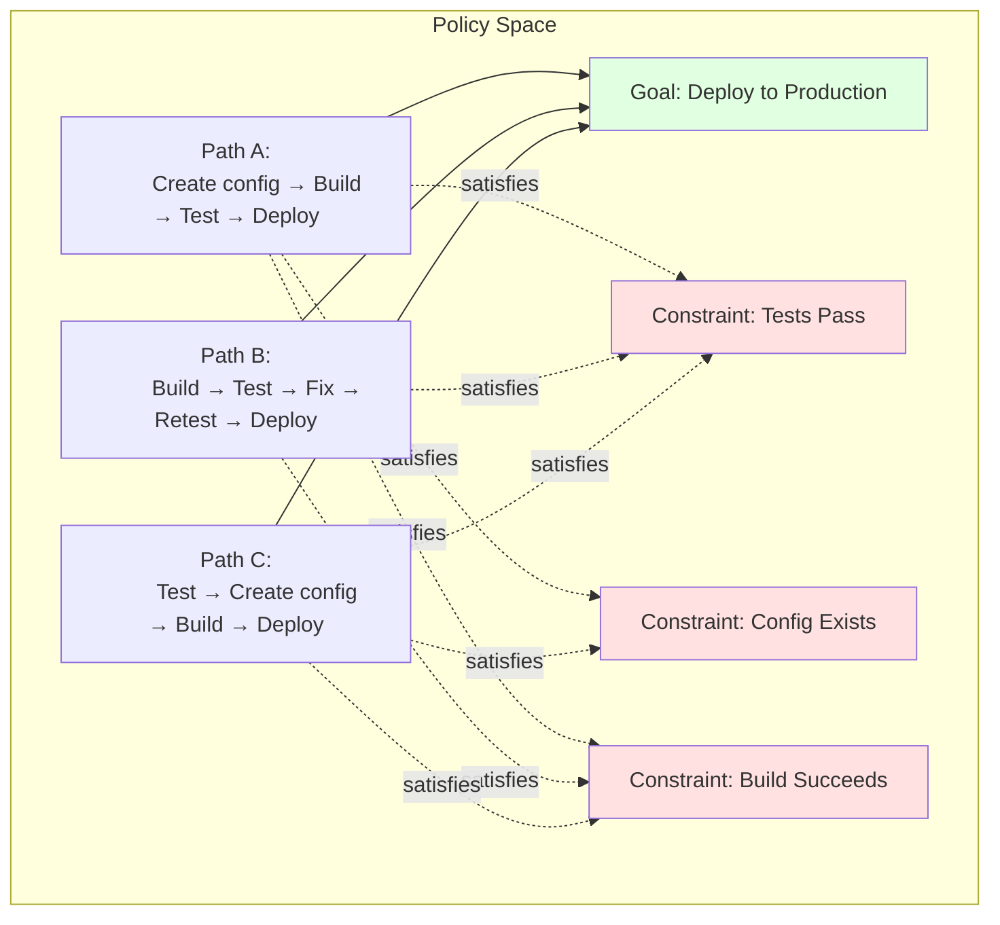
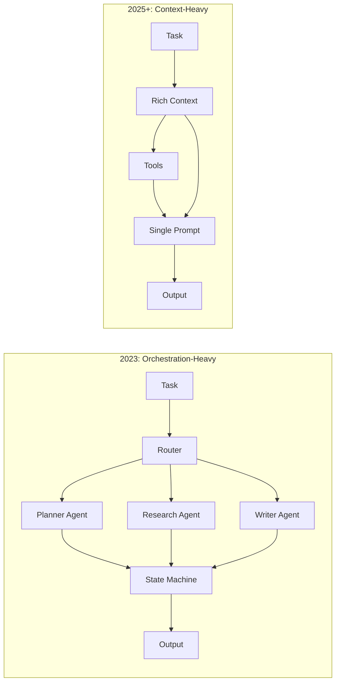
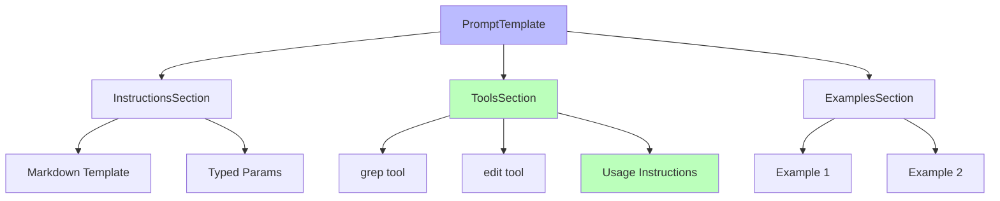

# Chapter 1: Philosophy

This chapter introduces the core philosophy behind WINK (Weak Incentives) and
explains the fundamental design principles that shape the library. You'll learn
why the project is called "weak incentives," how this philosophy manifests as
policies over workflows, why modern agent development focuses on context over
orchestration, and what makes WINK's approach to prompts-as-programs
distinctive.

Understanding these philosophical foundations will help you make better decisions
as you design agents, choose which abstractions to use, and debug systems when
things go wrong.

## 1. The Weak Incentives Philosophy

"Weak incentives" is an engineering stance borrowed from mechanism design:

> Build agent systems where well-constructed prompts and tools create weak
> incentives for the model to do the right thing and stay on task.

In mechanism design, a system with the right incentives is one where participants
naturally gravitate toward intended behavior. Applied to language models, this
means shaping the prompt, tools, and context so the model's easiest path is also
the correct one.

This isn't about constraining the model or managing downside risk. It's about
_encouraging_ correct behavior through structure:

- **Clear instructions co-located with tools** make the right action obvious
- **Typed contracts** guide the model toward valid outputs
- **Progressive disclosure** keeps the model focused on what matters now
- **Explicit state** gives the model the context it needs to make good decisions



The optimization process strengthens these incentives. When you refine a prompt
override or add a tool example, you're making the correct path even more
natural. Over iterations, the system becomes increasingly well-tuned—not through
constraints, but through clarity.

### How WINK Encourages Good Behavior

Concretely, WINK pushes you toward several practices that create these weak
incentives:

#### Explicit Side Effects

Side effects live in tool handlers. Everything else—prompt rendering, state
transitions, reducers—is deterministic and pure. When something goes wrong, you
know exactly where to look: the tool handler that executed.

#### Typed Contracts Everywhere

Params, tool calls, tool results, structured outputs, session state—all typed
with dataclasses. Type mismatches surface at construction time, not at runtime
when the model is mid-response. Pyright strict mode is enforced; the type
checker is your first line of defense.

See [Chapter 3](03-prompts.md) for details on how typed contracts shape prompt
design.

#### Inspectability

If a run went wrong, you can inspect exactly what was rendered and what tools
ran. Sessions record every event as an immutable ledger. Snapshots let you
capture state at any point and restore it later.

Session inspection is covered in depth in [Chapter 5](05-sessions.md).

#### Controlled Context Growth

Progressive disclosure lets you default to summaries and expand on demand.
Instead of stuffing everything into the prompt upfront, you let the model
request what it needs. This keeps token counts manageable and models focused.

Progressive disclosure patterns are detailed in [Chapter 10](10-progressive-disclosure.md).

#### Safe Iteration

Hash-validated prompt overrides prevent accidental drift between "tested" and
"running" versions. When you override a section's text, the system validates
that you're overriding the version you think you're overriding.

The override system is explained in [Chapter 11](11-prompt-optimization.md).

### The Goal: Clarity, Not Constraint

The goal isn't to constrain the model—it's to give it the best possible starting
point. When prompts are clear, tools are well-documented, and state is explicit,
the model has strong signals about what to do. When something goes wrong, you
can see exactly what happened and refine the incentives for next time.

**The most important application of this philosophy is choosing policies over
workflows**—letting agents reason within constraints rather than scripting their
actions. We'll explore this in depth next.

## 2. Policies Over Workflows

> **Canonical Reference**: See [specs/POLICIES_OVER_WORKFLOWS.md](../specs/POLICIES_OVER_WORKFLOWS.md) for the complete specification.

The weak incentives philosophy has a direct, practical implication for how you
design agents: **prefer declarative policies over prescriptive workflows**.

Traditional agent frameworks often use **workflows**—predetermined sequences of
steps that guide agent behavior:

```
1. Read the file
2. Parse the AST
3. Generate the patch
4. Write the file
5. Run tests
```

This works for the happy path. But unattended agents encounter situations
workflow authors can't anticipate: files that don't exist yet, parsers that fail
on malformed syntax, tests that require environment setup, patches that reveal
deeper design issues.

When workflows meet the unexpected, they fail, skip, or branch into sprawling
decision trees. WINK takes a different approach: **policies, not workflows**.

### The Problem with Workflows

A workflow encodes **how** to accomplish a goal:

```python
def deploy_workflow():
    """Rigid sequence of steps."""
    read_config()
    run_tests()
    build_artifacts()
    push_to_production()
```

This breaks down when reality diverges from expectations:

- **The config doesn't exist** → Should we create it? Use defaults? Abort?
- **Tests fail** → Skip deployment? Fix tests first? Deploy anyway?
- **Build errors** → Retry? Notify? Rollback?

Each edge case demands a branch:

```python
def deploy_workflow_v2():
    """Now with edge cases."""
    if not config_exists():
        if can_create_config():
            create_default_config()
        else:
            return abort("No config")

    test_result = run_tests()
    if test_result.failed:
        if test_result.flaky:
            retry_tests()
        else:
            return abort("Tests failed")

    # ... more branches
```

The workflow transforms into a program—and a brittle one. Each branch encodes
domain knowledge in control flow. When new edge cases emerge, the workflow
fractures further.



**The fundamental issue**: Workflows encode procedures, not requirements. When
the procedure breaks, the agent has no recourse—it can't reason about what
matters, only what the workflow says to do next.

### Policies Preserve Agency

A **policy** is a declarative constraint:

- "A file must be read before it can be overwritten"
- "Tests must pass before deployment"
- "Tool X cannot be called after tool Y"

Policies describe **what must be true**, not **how to make it true**. The agent
remains free to find any path satisfying the constraints.



When the agent encounters an unexpected situation, it:

1. **Reasons** about which constraints apply
1. **Discovers** alternative approaches that satisfy them
1. **Adapts** its strategy without violating invariants

This is the difference between giving directions ("turn left, then right") and
giving a map with constraints ("stay on paved roads, avoid tolls"). Directions
fail when the road is closed. Maps enable rerouting.

### Why Unattended Agents Need Policies

**Attended agents** have a human in the loop. When a workflow breaks, the human
intervenes—provides context, adjusts the approach, takes over entirely. The
workflow's brittleness is masked by human adaptability.

**Unattended agents** operate without this safety net. Every edge case the
workflow doesn't handle becomes a failure. And the long tail of edge cases is
effectively infinite—**no workflow can be complete**.

Policies offer a different contract:

| Aspect | Workflow | Policy |
|--------|----------|--------|
| **Specifies** | Steps to execute | Constraints to satisfy |
| **On unexpected input** | Fails or branches | Agent reasons about constraints |
| **Composability** | Sequential coupling | Independent conjunction |
| **Completeness** | Requires enumeration | Permits discovery |
| **Agent role** | Executor | Reasoner |

Language models are general-purpose reasoners. Workflows deliberately bypass this
capability, treating agents as script runners. Policies leverage it, treating
agents as problem-solvers that happen to be constrained.

### Characteristics of Good Policies

#### 1. Declarative, Not Procedural

Policies state **what must be true**, not **how to make it true**:

```python
# ❌ Procedural (workflow fragment)
def deploy():
    run_tests()
    build()
    push()

# ✅ Declarative (policy)
from weakincentives.contrib.tools.policies import SequentialDependencyPolicy

policy = SequentialDependencyPolicy(
    dependencies={"deploy": frozenset({"test", "build"})}
)
```

The procedural version locks in execution order. The declarative version expresses
that deployment requires testing and building, but permits the agent to determine
when and how to satisfy prerequisites.

#### 2. Independently Composable

Each policy evaluates in isolation. Policies compose through conjunction: all
must allow, any may deny:

```python nocheck
from weakincentives.contrib.tools.policies import (
    ReadBeforeWritePolicy,
    BudgetLimitPolicy,
)

policies = [
    ReadBeforeWritePolicy(),        # Filesystem safety
    BudgetLimitPolicy(max=10000),   # Resource bounds
]

# Each policy checks independently; all must pass
for policy in policies:
    decision = policy.check(tool, params, context=context)
    if not decision.allowed:
        return deny(decision.reason)
```

Avoid policies that depend on each other's internal state. If policy A needs to
know what policy B decided, refactor into a single policy or share state through
the session.

#### 3. Fail-Closed by Default

When a policy cannot determine whether to allow an action, it should **deny**.
This preserves safety at the cost of capability:

```python
def check(self, tool, params, *, context):
    if not self._can_evaluate(context):
        return PolicyDecision.deny(
            "Insufficient context to evaluate safety"
        )
    # ...
```

The agent can then reason about why denial occurred and adjust its approach
(e.g., gather more context, try a different tool).

#### 4. Observable and Debuggable

Policies should expose their reasoning. When a policy denies an action, the agent
and human reviewers should understand why:

```python nocheck
return PolicyDecision.deny(
    f"File '{path}' must be read before overwriting. "
    f"Read {', '.join(read_paths)} so far."
)
```

This feedback enables the agent to self-correct rather than simply retry.

### Policies in WINK

WINK implements policy-driven design through several mechanisms:

#### Tool Policies

Gate individual tool invocations based on session state. See [Chapter 4.5: Tool Policies](04.5-tool-policies.md) for comprehensive coverage.

```python
from weakincentives.contrib.tools.policies import (
    ReadBeforeWritePolicy,
    SequentialDependencyPolicy,
)

# Prevent blind file overwrites
read_before_write = ReadBeforeWritePolicy()

# Enforce prerequisite ordering
dependencies = SequentialDependencyPolicy(
    dependencies={"deploy": frozenset({"test", "build"})}
)

# Attach to tools or sections
section = MarkdownSection(
    title="Deployment",
    tools=(deploy_tool,),
    tool_policies=(read_before_write, dependencies),
)
```

Policies are checked before tool execution. If any policy denies, the tool is
blocked and the agent receives feedback explaining why.

#### Budget Constraints

Hard limits on resource consumption. See [Chapter 5: Sessions](05-sessions.md).

```python
from weakincentives.runtime.session import Budget, Deadline
from datetime import datetime, timedelta, UTC

budget = Budget(
    deadline=Deadline(expires_at=datetime.now(UTC) + timedelta(minutes=10)),
    max_total_tokens=50000,
)

session = Session(bus=bus, budget=budget)
```

Budgets are policies at the resource level: the agent is free to allocate tokens
however it chooses, but cannot exceed the total.

#### Task Completion Checking

Verify **goal achievement** without prescribing how to achieve it. See
[Chapter 4.6: Task Completion Verification](04.6-task-monitoring.md).

```python
from weakincentives.adapters.claude_agent_sdk import PlanBasedChecker

checker = PlanBasedChecker()

# Checks if all plan steps are complete
# Doesn't care HOW the agent completed them
is_complete = checker.check(session=session)
```

The checker assesses whether the task is complete based on current state, not
whether specific steps were followed.

### Anti-Patterns

#### Workflow Masquerading as Policy

```python
# ❌ Anti-pattern: sequential workflow encoded as dependencies
policy = SequentialDependencyPolicy(
    dependencies={
        "step_2": frozenset({"step_1"}),
        "step_3": frozenset({"step_2"}),
        "step_4": frozenset({"step_3"}),
        "step_5": frozenset({"step_4"}),
    }
)
```

This is a workflow in policy clothing. If the sequence is truly invariant,
consider whether the agent needs individual tools at all—or whether a single
composite operation is more appropriate.

#### Over-Constraining the Solution Space

```python
# ❌ Anti-pattern: leaves only one valid path
policies = [
    MustUseToolX(),
    MustNotUseToolY(),
    MustCallInOrderABC(),
    MustCompleteInUnderNSeconds(),
]
```

If policies eliminate all flexibility, you've rebuilt a workflow. Step back and
identify which constraints are truly invariants versus preferences.

#### Policies That Require Orchestration

```python
# ❌ Anti-pattern: policy depends on external state machine
class StateMachinePolicy:
    def check(self, tool, params, *, context):
        current_state = self.state_machine.current
        if current_state == "INIT" and tool.name == "read":
            self.state_machine.transition("READING")
            return allow()
        # ...
```

This conflates policy enforcement with workflow execution. Policies should be
stateless with respect to their evaluation logic; state lives in the session.

### When Workflows Are Appropriate

Policies are not universally superior. Workflows are appropriate when:

1. **The sequence is truly invariant** — Not just common, but required by
   external systems (e.g., protocol handshakes, database transactions)

1. **Failure is preferable to adaptation** — Some contexts require strict
   reproducibility over resilience

1. **The agent lacks reasoning capability** — Rule-based systems or simple state
   machines don't benefit from flexible policies

1. **Human oversight is continuous** — Attended operation can course-correct
   workflow failures in real-time

For unattended agents with language model reasoning, **policies are almost always
the better default**.

### Example: Code Deployment

#### Workflow Approach

```python
def deploy_code():
    """Rigid workflow with branching for edge cases."""
    if not file_exists("config.yaml"):
        if env_var_exists("DEFAULT_CONFIG"):
            create_config_from_env()
        else:
            raise DeploymentError("No config")

    result = run_tests()
    if result.failed:
        if result.flaky_test_count > 0:
            retry_flaky_tests()
        else:
            raise DeploymentError("Tests failed")

    build_result = build_artifacts()
    if build_result.warnings:
        log_warnings(build_result.warnings)

    push_to_production()
```

**Problems**:

- Rigid sequence: config → tests → build → deploy
- Edge cases branched explicitly
- New edge cases require code changes
- Agent can't adapt when assumptions break

#### Policy Approach

```python
from weakincentives.contrib.tools.policies import SequentialDependencyPolicy

# Declarative constraints
policy = SequentialDependencyPolicy(
    dependencies={
        "deploy": frozenset({"test_pass", "build_success"}),
        "test_pass": frozenset({"config_exists"}),
    }
)

# Agent receives tools with policy attached
tools = (
    Tool(name="create_config"),
    Tool(name="run_tests"),
    Tool(name="build"),
    Tool(name="deploy"),
)

# Agent can:
# - Create config if missing
# - Run tests in any order after config exists
# - Retry tests if flaky
# - Build before or after tests
# - Deploy once prerequisites satisfied
```

**Benefits**:

- Agent reasons about constraints
- Can adapt to unexpected situations (missing config, flaky tests)
- New edge cases don't require policy changes
- Multiple valid paths to deployment

The policy says "tests must pass and build must succeed before deployment," but
doesn't prescribe the order or method. The agent discovers a valid approach.

### Summary: Policies as Weak Incentives

| Principle | Implication |
|-----------|-------------|
| **Preserve agency** | Let the agent reason; don't script actions |
| **Declare constraints** | State invariants, not procedures |
| **Compose independently** | Policies are conjunction-friendly |
| **Fail closed** | Deny when uncertain; let agent adapt |
| **Surface reasoning** | Explain denials to enable self-correction |
| **Avoid pseudo-workflows** | If only one path satisfies constraints, reconsider |

Policies are the practical manifestation of weak incentives. Instead of
constraining the model with rigid workflows, policies provide structure that
works **with** the agent's reasoning. Policies define the boundaries; the agent
finds the path.

For attended agents or simple automation, workflows may suffice. For unattended
agents facing novel situations, policies are essential—they preserve the agent's
ability to reason while ensuring safety and correctness.

## 3. From Orchestration to Context Engineering

Many early "agent frameworks" assumed the hard part would be workflow logic:
routers, planners, branching graphs, and elaborate loops. These frameworks spent
their complexity budget on orchestration—deciding which prompts to run when,
routing between specialized agents, managing elaborate state machines.

WINK makes a different bet.

### Models Are Absorbing the Reasoning Loop

What required explicit multi-step orchestration yesterday often works in a
single prompt today. The frontier models are increasingly capable of planning,
reasoning, and self-correction within a single context window. Elaborate routing
graphs often just get in the way.



### The Durable Primitives

**The durable part of agent systems is tools, retrieval, and context engineering.**

- **Tools** define what the agent can do
- **Retrieval** determines what information is available
- **Context engineering** decides what to include, what to summarize, and how to
  structure information so the model reasons well

Context engineering is the tricky part. It's a genuinely new discipline: what's
relevant now, what to summarize versus preserve, how to shape information so
models reason over it well. There's no clean precedent from traditional
engineering. Builders who master it early win.

### WINK's Core Abstractions

WINK's core abstractions exist to make context engineering a real engineering
discipline:

- **Prompts** are structured, typed objects that you can inspect and test
- **Tools** are explicit contracts that surface what the model can do
- **State** is inspectable so you can debug failures
- **Safety** is enforced at tool boundaries where side effects happen

For the formal specification of these behaviors, see:

- [specs/PROMPTS.md](../specs/PROMPTS.md)
- [specs/TOOLS.md](../specs/TOOLS.md)
- [specs/SESSIONS.md](../specs/SESSIONS.md)
- [specs/MAIN_LOOP.md](../specs/MAIN_LOOP.md)

## 4. Prompts as First-Class, Typed Programs

Most systems treat prompts as strings and hope conventions keep everything
aligned:

- Prompt text in one place
- Tool definitions in another
- Schema expectations in another
- Memory in another

Teams add layers: prompt registries, tool catalogs, schema validators. Each
layer is separately maintained. They drift. When something breaks, you're
hunting across files to understand what was actually sent to the model.

WINK inverts this approach entirely.

### The Prompt-as-Program Paradigm

In WINK, **a `PromptTemplate` is an immutable object graph**—a tree of sections
that form a coherent program.



Each section can:

- Render markdown instructions
- Declare placeholders backed by typed dataclasses
- Register tools next to the instructions that describe how to use them
- Optionally render as a summary to save tokens

The section that explains "here's how to search files" is the _same section_
that provides the `grep` tool. Documentation and capability live together. They
can't drift.

### The Complete Picture

**A `Prompt` binds runtime configuration:**

- Parameter dataclasses that fill template placeholders
- Prompt overrides store and tag for safe iteration
- Optionally a session for dynamic visibility and scoping

**A `ProviderAdapter` evaluates the prompt:**

- Renders markdown from the section tree
- Executes tool calls synchronously
- Returns text and/or parsed structured output

**A `Session` captures everything as an event-driven, reducer-managed state log:**

Every prompt render, every tool invocation, every state change is recorded. You
can query the session, snapshot it, restore it.

In other words: **your agent is a typed prompt + tools + state.**

### Novel Properties

Two "novel" properties fall out of this structure:

1. **Deterministic inspection**: Render, snapshot, and diff prompts. The same
   inputs produce the same outputs. You can write tests that assert on exact
   prompt text.

1. **Safe iteration**: Apply prompt tweaks via overrides that are validated
   against hashes. When you change a section in code, existing overrides stop
   applying until you explicitly update them. No silent drift.

These properties make prompt development feel more like traditional software
engineering: you can version control prompts, write tests, and iterate safely.

## 5. What WINK Is (and Is Not)

Understanding WINK's scope helps you decide when to use it and how to integrate
it with other tools.

### WINK Is

**A Python library** for building prompts-as-agents. The core package is
`weakincentives`, designed to be composable and minimal.

**A small runtime** for state (`Session`) and orchestration (`MainLoop`). These
primitives handle the deterministic parts of agent execution.

**Provider adapters** that execute tools and parse outputs consistently across
different LLM providers (`OpenAI`, `LiteLLM`, `Claude Agent SDK`). See
[Chapter 6](06-adapters.md) for adapter details.

**Contributed tool suites** for background agents: planning tools, virtual
filesystem, sandboxes, workspace digests. These are in `weakincentives.contrib`
and covered in [Chapter 12](12-workspace-tools.md).

### WINK Is Not

**A distributed workflow engine.** If you need to coordinate across machines or
manage long-running jobs, use something built for that (Temporal, Prefect,
Airflow).

**A framework that tries to "own" your application architecture.** WINK is a
library. Use it for the pieces that benefit from determinism and composability.

**A multi-agent coordination system.** WINK focuses on single-agent patterns
done well. Multi-agent coordination is possible but not the primary design
target.

**An async-first streaming framework.** Today the adapter contract is
synchronous. Streaming may come later, but it's not a core design goal.

### Playing Well With Others

If you need a graph engine or multi-agent coordination, you can still use WINK
for the pieces that benefit from determinism—prompt design, tool contracts,
state snapshots—and let something else coordinate the rest.

WINK is designed to be composable. You can use `PromptTemplate` and `Session`
without using `MainLoop`. You can use the adapters without the contrib tools.
Pick the pieces that solve your problems.

______________________________________________________________________

**In the next chapter**, we'll dive into a practical quickstart that shows you
how to build your first WINK agent in under 100 lines of code.
