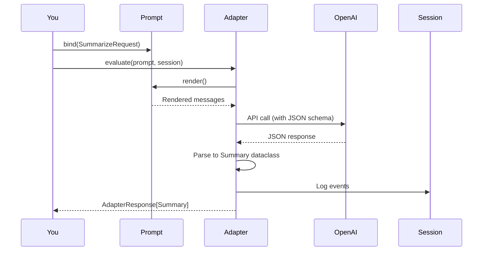
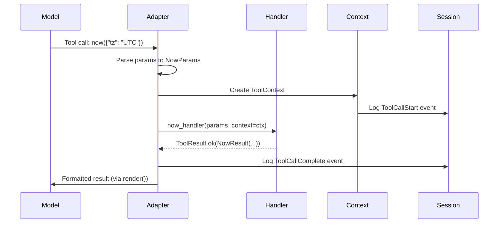
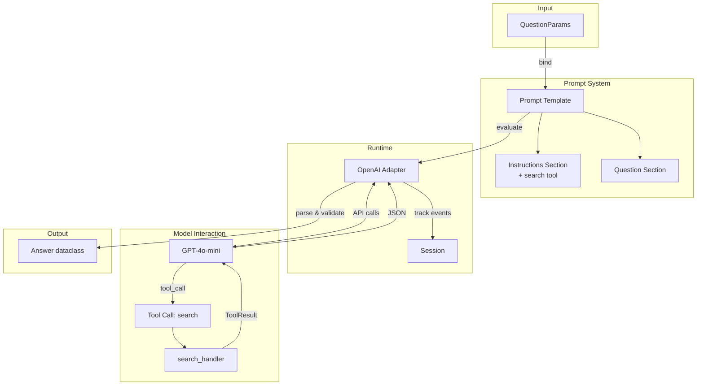

# Chapter 2: Quickstart

**Get your first WINK agent running in 10 minutes**

______________________________________________________________________

## Introduction

This chapter will guide you from installation to running your first complete agent. You'll learn the essential building blocks: structured prompts, typed outputs, tools, and sessions. By the end, you'll have a working agent that you can extend and adapt to your needs.

WINK's philosophy is to make agent behavior predictable and auditable through typed interfaces and immutable state. Every example here demonstrates this principle in practice.

______________________________________________________________________

## Installation

The core WINK package has no mandatory third-party dependencies. This is intentional—you should be able to use WINK's prompt and session primitives without pulling in OpenAI or any other provider SDK.

Install the base library:

```bash
pip install weakincentives
```

**Python requirement**: Python 3.12 or higher. WINK uses modern Python features liberally and doesn't maintain compatibility with older versions.

### Provider and Tool Extras

Choose the extras you need based on your integration requirements:

```bash
# Provider adapters
pip install "weakincentives[openai]"           # OpenAI adapter
pip install "weakincentives[litellm]"          # LiteLLM adapter
pip install "weakincentives[claude-agent-sdk]" # Claude Agent SDK adapter

# Tool capabilities
pip install "weakincentives[asteval]"          # Safe Python expression eval tool
pip install "weakincentives[podman]"           # Podman sandbox tools
pip install "weakincentives[wink]"             # Debug UI (wink CLI)
```

For this quickstart, we'll use the OpenAI adapter. Install it with:

```bash
pip install "weakincentives[openai]"
```

Make sure you have an `OPENAI_API_KEY` environment variable set:

```bash
export OPENAI_API_KEY="sk-..."
```

______________________________________________________________________

## Choose an Execution Harness

WINK separates the **agent definition** (prompt + tools + policies) from the
**execution harness** (how tool calls are driven, sandboxed, retried, and
monitored).

- If you just want to run a prompt with tools, a standard adapter is enough.
- If you need a hardened unattended runtime (sandbox + richer tool
  orchestration), prefer a provider runtime adapter when available (e.g. Claude
  Agent SDK).

This quickstart uses `OpenAIAdapter` to keep the first example minimal. The
prompt and tools you build here are designed to be portable across harnesses.

______________________________________________________________________

## Your First Agent: Structured Summarization

Let's build a tiny but complete agent that demonstrates WINK's core principles:

- **Typed parameters** for input validation
- **Structured output** with dataclass schemas
- **Deterministic prompt structure** with `PromptTemplate`
- **Session tracking** for telemetry and state

Here's the complete example:

```python
from dataclasses import dataclass

from weakincentives.prompt import Prompt, PromptTemplate, MarkdownSection
from weakincentives.runtime import InProcessDispatcher, Session
from weakincentives.adapters.openai import OpenAIAdapter

# Define input parameters as a frozen dataclass
@dataclass(slots=True, frozen=True)
class SummarizeRequest:
    text: str

# Define structured output schema
@dataclass(slots=True, frozen=True)
class Summary:
    title: str
    bullets: tuple[str, ...]

# Create a prompt template with typed output
template = PromptTemplate[Summary](
    ns="docs",
    key="summarize",
    name="Doc summarizer",
    sections=(
        MarkdownSection(
            title="Task",
            key="task",
            template=(
                "Summarize the input.\n\n"
                "Return JSON with:\n"
                "- title: short title\n"
                "- bullets: 3-7 bullet points\n"
            ),
        ),
        MarkdownSection(
            title="Input",
            key="input",
            template="${text}",
        ),
    ),
)

# Bind parameters to the template
prompt = Prompt(template).bind(SummarizeRequest(
    text="WINK is a Python library for building agents. It treats prompts as "
         "typed programs. Tools are explicit. State is inspectable."
))

# Create a session to track execution
bus = InProcessDispatcher()
session = Session(bus=bus)

# Evaluate the prompt using an adapter
adapter = OpenAIAdapter(model="gpt-4o-mini")
response = adapter.evaluate(prompt, session=session)

# Access the typed output
print(response.output)
# -> Summary(title='WINK Overview', bullets=('Python library...', ...))
```

### Understanding the Flow

Here's what happens when you run this agent:



### Key Concepts

Let's break down what makes this work:

**1. Binding Parameters**

```python
prompt = Prompt(template).bind(SummarizeRequest(text="..."))
```

Binding is by dataclass type. When you bind a `SummarizeRequest`, WINK automatically makes `${text}` available in the template. This is type-safe—the binding system knows what parameters each template expects.

**2. Structured Output**

```python
template = PromptTemplate[Summary](...)
```

The generic parameter `[Summary]` tells WINK that this prompt must return a `Summary` dataclass. The adapter automatically:

- Generates a JSON schema from the dataclass
- Includes it in the API request
- Parses and validates the response
- Returns a typed `Summary` instance

**3. Immutable Dataclasses**

```python
@dataclass(slots=True, frozen=True)
class Summary:
    title: str
    bullets: tuple[str, ...]
```

The `slots=True, frozen=True` pattern is used throughout WINK. This makes instances:

- **Immutable**: Can't be accidentally modified
- **Memory efficient**: No instance dictionary overhead
- **Session-friendly**: Work perfectly with event-driven state management

You'll see this pattern in every WINK example.

**4. Sessions Track Everything**

```python
session = Session(bus=bus)
```

The session receives events for every significant operation: prompt rendering, tool calls, adapter responses. This creates an auditable trace of agent behavior. We'll explore sessions in depth in [Chapter 5: Sessions](05-sessions.md).

______________________________________________________________________

## Adding Tools: Making Agents Interactive

Real agents need to interact with the world. In WINK, tools are registered alongside the prompt sections that use them, keeping documentation and implementation together.

Let's add a simple tool that returns the current time:

```python
from dataclasses import dataclass
from datetime import UTC, datetime

from weakincentives.prompt import Tool, ToolContext, ToolResult, ToolExample

# Define tool input parameters
@dataclass(slots=True, frozen=True)
class NowParams:
    tz: str = "UTC"

# Define tool output
@dataclass(slots=True, frozen=True)
class NowResult:
    iso: str

    def render(self) -> str:
        """Format the result for display in the prompt."""
        return self.iso

# Implement the tool handler
def now_handler(params: NowParams, *, context: ToolContext) -> ToolResult[NowResult]:
    """Return the current UTC time."""
    del context  # not used in this simple example

    if params.tz != "UTC":
        return ToolResult.error("Only UTC supported in this demo.")

    return ToolResult.ok(
        NowResult(iso=datetime.now(UTC).isoformat()),
        message="Current time.",
    )

# Create the tool definition
now_tool = Tool[NowParams, NowResult](
    name="now",
    description="Return the current time (UTC).",
    handler=now_handler,
    examples=(
        ToolExample(
            description="Get UTC time",
            input=NowParams(tz="UTC"),
            output=NowResult(iso="2025-01-01T00:00:00+00:00"),
        ),
    ),
)

# Add the tool to a section
tools_section = MarkdownSection(
    title="Tools",
    key="tools",
    template="You may call tools when needed.",
    tools=(now_tool,),
)
```

### Tool Execution Flow

When the model calls a tool, here's what happens:



### Tool Design Principles

Notice the patterns in the tool definition:

**1. Typed Parameters and Results**

Every tool has explicit input and output types. This makes tools self-documenting and enables static type checking.

**2. Immutable ToolContext**

The `ToolContext` provides access to:

- The current session (for reading state)
- The resource registry (for accessing filesystem, HTTP clients, etc.)
- The tool call metadata

It's immutable, preventing tools from corrupting shared state.

**3. Explicit Error Handling**

```python nocheck
return ToolResult.error("Only UTC supported in this demo.")
```

Tools return `ToolResult.ok()` for success or `ToolResult.error()` for failures. The adapter formats these for the model, keeping error handling consistent.

**4. Documentation Lives With Code**

```python
examples=(
    ToolExample(
        description="Get UTC time",
        input=NowParams(tz="UTC"),
        output=NowResult(iso="2025-01-01T00:00:00+00:00"),
    ),
),
```

Tool examples are first-class metadata. They can be included in prompts to show the model how to use tools effectively.

For a deep dive into tool design, see [Chapter 4: Tools](04-tools.md).

______________________________________________________________________

## Your First Complete Agent

Let's put everything together into a runnable agent. This example implements a simple Q&A bot that uses a search tool to find information before answering.

Save this as `qa_agent.py`:

```python
"""Minimal WINK agent: a topic Q&A bot with a mock search tool."""
import os
from dataclasses import dataclass
from weakincentives.prompt import (
    Prompt, PromptTemplate, MarkdownSection, Tool, ToolContext, ToolResult
)
from weakincentives.runtime import Session
from weakincentives.adapters.openai import OpenAIAdapter

# 1. Define structured output
@dataclass(slots=True, frozen=True)
class Answer:
    summary: str
    sources: tuple[str, ...]

# 2. Define a search tool
@dataclass(slots=True, frozen=True)
class SearchParams:
    query: str

@dataclass(slots=True, frozen=True)
class SearchResult:
    snippets: tuple[str, ...]

    def render(self) -> str:
        return "\n".join(f"- {s}" for s in self.snippets)

def search_handler(params: SearchParams, *, context: ToolContext) -> ToolResult[SearchResult]:
    """Mock search handler. In production, this would call a real search API."""
    del context
    return ToolResult.ok(
        SearchResult(snippets=(
            f"Result 1 about {params.query}",
            f"Result 2 about {params.query}",
        )),
        message=f"Found results for: {params.query}",
    )

search_tool = Tool[SearchParams, SearchResult](
    name="search",
    description="Search for information about a topic.",
    handler=search_handler,
)

# 3. Define input parameters
@dataclass(slots=True, frozen=True)
class QuestionParams:
    question: str

# 4. Build the prompt template
template = PromptTemplate[Answer](
    ns="demo",
    key="qa-agent",
    name="Q&A Agent",
    sections=(
        MarkdownSection(
            title="Instructions",
            key="instructions",
            template=(
                "You are a helpful research assistant.\n\n"
                "Use the search tool to find information, then answer the "
                "question with a summary and list of sources."
            ),
            tools=(search_tool,),
        ),
        MarkdownSection(
            title="Question",
            key="question",
            template="${question}",
        ),
    ),
)

# 5. Run the agent
def main():
    session = Session()
    adapter = OpenAIAdapter(model="gpt-4o-mini")

    prompt = Prompt(template).bind(QuestionParams(
        question="What is the capital of France?"
    ))

    response = adapter.evaluate(prompt, session=session)

    if response.output is not None:
        print(f"Summary: {response.output.summary}")
        print(f"Sources: {response.output.sources}")

if __name__ == "__main__":
    if not os.environ.get("OPENAI_API_KEY"):
        print("Set OPENAI_API_KEY to run this example")
    else:
        main()
```

Run it:

```bash
python qa_agent.py
```

You should see output like:

```
Summary: The capital of France is Paris.
Sources: ('Result 1 about capital of France', 'Result 2 about capital of France')
```

### Complete Agent Architecture

Here's the full data flow in this agent:



### What's Happening

Let's trace the execution step by step:

**1. Parameter Binding**

```python
prompt = Prompt(template).bind(QuestionParams(
    question="What is the capital of France?"
))
```

The question is bound to the prompt, making `${question}` available for expansion.

**2. Prompt Rendering**

When `adapter.evaluate()` is called, the prompt renders to something like:

```markdown
# Instructions

You are a helpful research assistant.

Use the search tool to find information, then answer the question with a summary and list of sources.

## Available Tools

- **search**: Search for information about a topic.

# Question

What is the capital of France?
```

Plus the tool definitions in the API's tool-calling format.

**3. Model Invocation**

The adapter sends:

- The rendered prompt
- Tool definitions for `search`
- A JSON schema for the `Answer` output type

**4. Tool Execution**

The model decides to call `search(query="capital of France")`. The adapter:

- Parses the call into `SearchParams`
- Creates a `ToolContext` with session access
- Invokes `search_handler(params, context=ctx)`
- Logs the call to the session
- Returns the formatted result to the model

**5. Structured Output**

The model returns JSON matching the `Answer` schema:

```json
{
  "summary": "The capital of France is Paris.",
  "sources": ["Result 1 about capital of France", ...]
}
```

The adapter parses and validates this into an `Answer` dataclass.

**6. Result Delivery**

You get back a typed `AdapterResponse[Answer]` with the parsed output.

______________________________________________________________________

## What You've Learned

You now understand WINK's core building blocks:

### Prompts Are Programs

Prompts are not strings—they're typed templates with:

- **Sections** for organization
- **Parameter bindings** for inputs
- **Output schemas** for structured results
- **Tool registrations** alongside instructions

See [Chapter 3: Prompts](03-prompts.md) for advanced composition patterns.

### Tools Are Explicit

Tools are not magic decorators. They're explicit registrations with:

- Typed input parameters
- Typed output results
- Handlers that receive immutable context
- Examples for documentation

Explore tool policies and sandboxing in [Chapter 4: Tools](04-tools.md).

### Sessions Track Everything

Sessions create an auditable event log:

- Prompt renderings
- Tool calls and results
- Adapter requests and responses
- State mutations

Learn how to query and manipulate session state in [Chapter 5: Sessions](05-sessions.md).

### Adapters Are Bridges

Adapters translate between WINK's abstractions and provider APIs:

- Render prompts to API formats
- Execute tool calls synchronously
- Parse responses into typed outputs
- Handle retries and throttling

See [Chapter 6: Adapters](06-adapters.md) for provider-specific features.

______________________________________________________________________

## Next Steps

You have a working foundation. Here's where to go from here:

### Build Something Real

Replace the mock search tool with a real API:

- Use `httpx` or `requests` in your handler
- Add the HTTP client to a resource registry
- Access it via `context.resources.get(HTTPClient)`

Resource management is covered in [Chapter 5: Sessions](05-sessions.md).

### Add More Tools

Agents become powerful with the right tools:

- **Filesystem tools**: Read and write files (with sandboxing)
- **Code execution**: Run Python safely via `asteval`
- **Container orchestration**: Spin up isolated environments with Podman

WINK's contrib tools are documented in [Chapter 12: Workspace Tools](12-workspace-tools.md).

### Make It Production-Ready

Real agents need:

- **Evaluation loops**: Test against real execution traces
- **Lifecycle management**: Graceful shutdown and health checks
- **Prompt optimization**: Version control and A/B testing

These topics are covered in Part III (Integration & Orchestration) and Part IV (Advanced Features).

### Explore the Examples

The `code_reviewer_example.py` in the repository shows a complete production agent with:

- Multi-turn conversations
- Stateful session management
- Real filesystem tools
- Comprehensive testing

It's a great reference for building your own agents.

______________________________________________________________________

## Troubleshooting

### "No OPENAI_API_KEY found"

Make sure you've exported the environment variable:

```bash
export OPENAI_API_KEY="sk-..."
```

Or pass it directly to the adapter:

```python
adapter = OpenAIAdapter(model="gpt-4o-mini", api_key="sk-...")
```

### "Module 'weakincentives.adapters.openai' not found"

Install the OpenAI extra:

```bash
pip install "weakincentives[openai]"
```

### Type checker errors about slots or frozen

Make sure you're using Python 3.12+:

```bash
python --version  # Should be 3.12 or higher
```

### "Expected Summary, got dict"

The model returned JSON that doesn't match your output schema. Check:

- Are all fields in your dataclass present in the prompt instructions?
- Did you include the JSON schema in the API call? (Adapters do this automatically)
- Is the model capable of structured output? (GPT-4 and later, Claude 3+)

______________________________________________________________________

**You're now ready to build with WINK.** The next chapters dive deep into each abstraction, showing you how to compose complex prompts, manage session state, and deploy agents to production.

Let's keep building.
