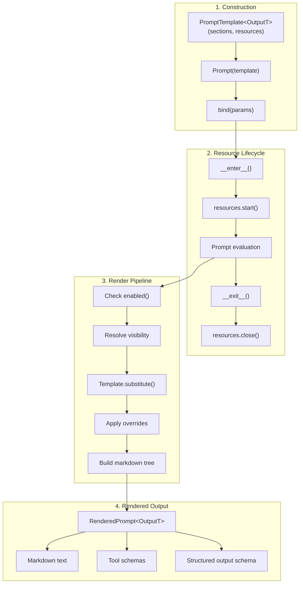
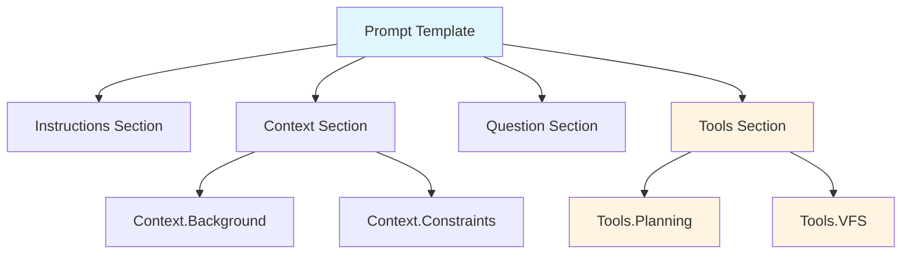
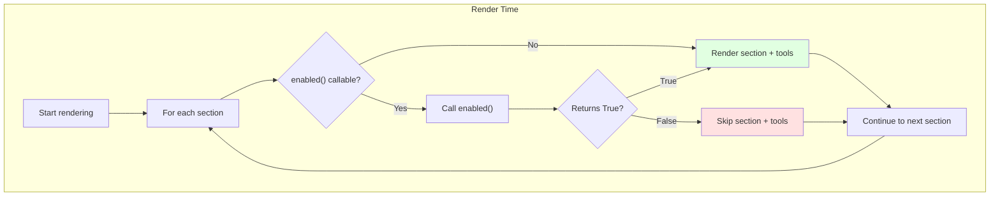
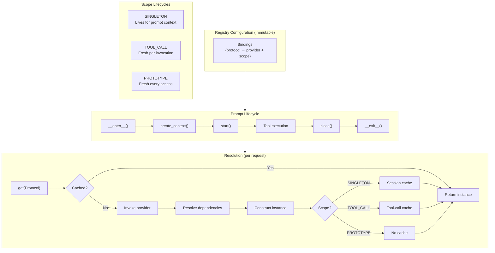
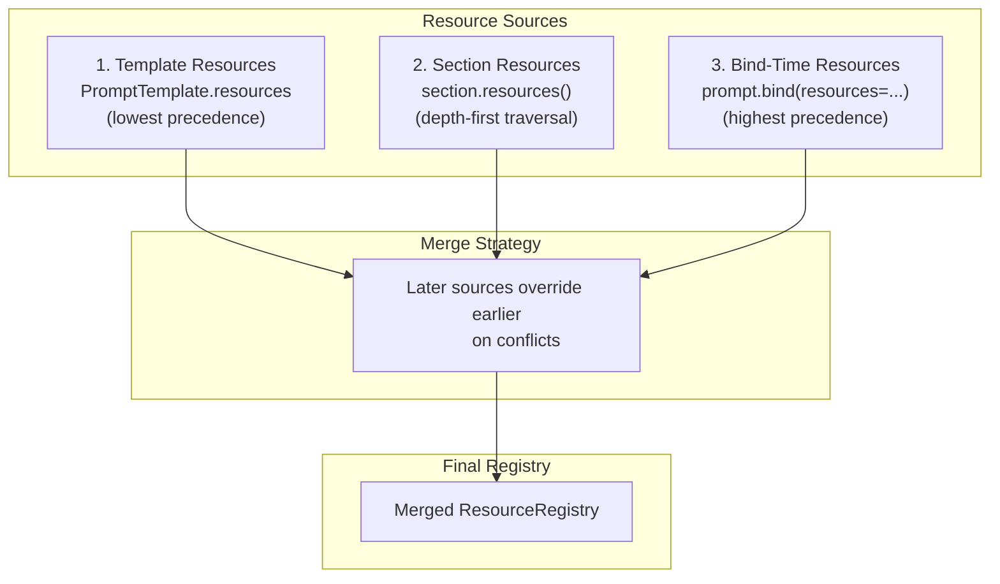

# Chapter 3: Prompts

> **Canonical Reference**: See [specs/PROMPTS.md](/specs/PROMPTS.md) for the complete specification.

## Introduction

The prompt system is the heart of WINK. It's not a generic templating engine—it's a **type-safe, composable, deterministic framework for building LLM prompts as first-class programs**. Every string template that flows to an LLM is centralized, inspectable, and versioned.

The design prioritizes predictability over flexibility:

- **Deterministic rendering**: Same inputs always produce identical output
- **Early validation**: Placeholder errors surface at construction time, not runtime
- **Explicit composition**: No magic string concatenation
- **Safe overrides**: Hash-validated version management
- **Resource co-location**: Prompts own their runtime dependencies

If you've been frustrated by prompt "spaghetti" in other frameworks—where templates are scattered across files, placeholders fail silently, and runtime behavior is unpredictable—WINK's prompt system will feel like a breath of fresh air.

## Overview: The Prompt Lifecycle



The lifecycle has four distinct phases:

1. **Construction**: Define your prompt template with sections, tools, and resources
2. **Binding**: Attach runtime parameters (dataclass instances) to the prompt
3. **Rendering**: Walk the section tree, apply overrides, and build markdown
4. **Resource Management**: Initialize and cleanup resources via context manager

This separation ensures that templates are reusable, parameters are validated early, and resources are properly managed.

## PromptTemplate: The Blueprint

`PromptTemplate[OutputT]` is the immutable blueprint for your prompt. Think of it as the "class" definition—it describes structure, not runtime state.

### Core Properties

```python
from dataclasses import dataclass
from weakincentives.prompt import PromptTemplate, MarkdownSection

@dataclass(slots=True, frozen=True)
class SupportParams:
    question: str
    context: str

template = PromptTemplate(
    ns="support",           # Namespace for grouping related prompts
    key="faq",              # Unique key within namespace
    name="faq_assistant",   # Human-readable name for logging
    sections=(              # Tree of Section objects
        MarkdownSection(
            title="Instructions",
            key="instructions",
            template="Answer customer questions clearly and concisely.",
        ),
        MarkdownSection(
            title="Context",
            key="context",
            template="Background: ${context}",
        ),
        MarkdownSection(
            title="Question",
            key="question",
            template="Customer question: ${question}",
        ),
    ),
)
```

### Structured Output Declaration

Declare typed outputs using generic specialization:

```python
@dataclass(slots=True, frozen=True)
class Answer:
    summary: str
    details: list[str]
    confidence: float

# Object output
template = PromptTemplate[Answer](
    ns="support",
    key="faq",
    sections=(...),
)

# Array output
template = PromptTemplate[list[Answer]](
    ns="support",
    key="faq-batch",
    sections=(...),
)
```

When you declare structured output:

- The adapter instructs the model to return JSON matching your schema
- `parse_structured_output()` validates and deserializes the response
- Non-dataclass types raise `PromptValidationError` at construction time

### Validation Rules

WINK validates your template **at construction time** to catch errors early:

- **Namespace and key**: Required, non-empty strings
- **Section keys**: Must match `^[a-z0-9][a-z0-9._-]{0,63}$`
- **Placeholders**: Must correspond to fields on bound dataclasses
- **Output types**: Must be dataclasses (not primitives, dicts, or arbitrary objects)

A typo in a placeholder name fails **immediately**, not when the model is mid-response.

### Namespaces and Keys

The `(ns, key)` pair uniquely identifies a prompt family for:

- **Versioning**: Track prompt evolution over time
- **Overrides**: Apply tested optimizations ([Chapter 11](11-prompt-optimization.md))
- **Debugging**: Inspect which prompt generated which response ([Chapter 13](13-debugging.md))

Choose namespaces that reflect your agent's domain (e.g., `"code-review"`, `"research"`, `"planning"`), and keys that describe the specific task (e.g., `"analyze-diff"`, `"summarize-papers"`, `"create-plan"`).

## Prompt: The Runtime Binding

`Prompt[OutputT]` is the runtime instance—it binds parameters, manages resources, and renders output.

### Basic Usage

```python
from weakincentives.prompt import Prompt

# Create and bind parameters
prompt = Prompt(template).bind(
    SupportParams(
        question="How do I reset my password?",
        context="User account created 2023-01-15",
    )
)

# Render within resource context
with prompt.resources:
    rendered = prompt.render()
    print(rendered.text)
    print([t.name for t in rendered.tools])
```

### Binding Multiple Parameter Types

You can bind multiple dataclass types to a single prompt:

```python
@dataclass(slots=True, frozen=True)
class UserInfo:
    name: str
    plan: str

@dataclass(slots=True, frozen=True)
class QuestionInfo:
    text: str
    category: str

prompt = Prompt(template).bind(
    UserInfo(name="Alice", plan="Enterprise"),
    QuestionInfo(text="How do I export data?", category="data"),
)
```

**Key rule**: You can bind **at most one instance per dataclass type**. Binding the same type twice replaces the previous value. Providing duplicate types in a single `bind()` call raises `PromptValidationError`.

### RenderedPrompt

Rendering returns a `RenderedPrompt[OutputT]` with:

```python
@dataclass(frozen=True)
class RenderedPrompt:
    text: str                                    # Final markdown
    tools: tuple[Tool, ...]                      # Tools from enabled sections
    structured_output: StructuredOutputConfig    # Schema config (if declared)
    descriptor: PromptDescriptor                 # Hash for overrides system
```

The rendered prompt is immutable and serializable—perfect for logging, debugging, and version control.

## Sections: Composable Prompt Components

A `Section[ParamsT]` is a node in your prompt's tree structure. Sections compose hierarchically to build complex prompts from reusable pieces.



### Section Anatomy

Every section has:

```python
class Section(ABC, Generic[ParamsT]):
    title: str                              # Renders as markdown heading
    key: str                                # Stable identifier
    children: tuple[Section, ...] = ()      # Nested subsections
    tools: tuple[Tool, ...] = ()            # Tools exposed by this section
    enabled: Callable[..., bool] | None     # Dynamic enable/disable
    summary: str | None = None              # For progressive disclosure
    visibility: SectionVisibility = FULL    # FULL or SUMMARY
    accepts_overrides: bool = True          # Allow override system
    default_params: ParamsT | None = None   # Fallback parameters

    @abstractmethod
    def render_body(self, params: ParamsT, session: Session) -> str:
        """Render the section's body content."""
        ...

    def resources(self) -> ResourceRegistry:
        """Resources required by this section."""
        return ResourceRegistry()
```

### Heading Levels and Numbering

WINK generates markdown headings with deterministic numbering:

- Root sections: `## 1. Title`, `## 2. Title`
- Depth 1 children: `### 1.1. Subtitle`, `### 1.2. Subtitle`
- Depth 2 children: `#### 1.1.1. Sub-subtitle`

This ensures consistent formatting and makes prompts readable in markdown viewers.

### Tools and Sections

Sections can contribute tools to the prompt. When a section is disabled, **its tools disappear too**. This is powerful: you can build a comprehensive toolset and enable only what's relevant for the current context.

```python
from weakincentives.prompt import Tool

search_tool = Tool(
    name="search_docs",
    description="Search documentation",
    parameters_type=SearchParams,
    handler=search_handler,
)

docs_section = MarkdownSection(
    title="Documentation",
    key="docs",
    template="You have access to the documentation search tool.",
    tools=(search_tool,),
    enabled=lambda params: params.has_docs_access,
)
```

When `has_docs_access` is `False`, both the section text **and** the `search_docs` tool are excluded from the rendered prompt.

## MarkdownSection: The Workhorse

`MarkdownSection` is the concrete implementation you'll use most often. It renders a `string.Template` with `${name}` placeholders.

### Basic Usage

```python
from dataclasses import dataclass
from weakincentives.prompt import MarkdownSection

@dataclass(slots=True, frozen=True)
class UserProfile:
    name: str
    plan: str
    joined: str

profile_section = MarkdownSection(
    title="User Profile",
    key="profile",
    template="""
    Name: ${name}
    Plan: ${plan}
    Member since: ${joined}
    """,
)
```

### Why string.Template?

WINK deliberately uses Python's `string.Template`, which supports **only simple placeholder substitution**:

- ✅ `${name}` - Simple substitution
- ❌ `${name.upper()}` - No expressions
- ❌ `${for x in items}` - No loops
- ❌ `${if condition}` - No conditionals

**Why this limitation?** Complex formatting belongs in your Python code, where it can be tested, type-checked, and debugged. If you need loops or conditionals, compute the string in Python and pass it as a parameter:

```python
@dataclass(slots=True, frozen=True)
class ReportParams:
    summary: str
    items_formatted: str  # Pre-formatted in Python

# In your code:
items_text = "\n".join(f"- {item.name}: {item.value}" for item in items)
params = ReportParams(
    summary="Analysis complete",
    items_formatted=items_text,
)
```

This keeps templates simple, predictable, and easy to override.

## Structured Output: Type-Safe Responses

WINK prompts can declare structured output, turning raw LLM responses into typed Python objects.

```mermaid
flowchart LR
    subgraph Declaration["Declaration"]
        Template["PromptTemplate&lt;OutputT&gt;"]
        Schema["JSON Schema Generation"]
    end

    subgraph Execution["Execution"]
        Adapter["Adapter.evaluate()"]
        Model["LLM (JSON mode)"]
        Response["Raw JSON response"]
    end

    subgraph Parsing["Parsing"]
        Extract["Extract JSON block"]
        Validate["Validate schema"]
        Deserialize["Deserialize to OutputT"]
        Result["Typed result: OutputT"]
    end

    Template --> Schema
    Schema --> Adapter
    Adapter --> Model
    Model --> Response
    Response --> Extract
    Extract --> Validate
    Validate --> Deserialize
    Deserialize --> Result

    style Template fill:#e1f5ff
    style Result fill:#e1ffe1
```



### Declaring Output Types

```python
from dataclasses import dataclass
from weakincentives.prompt import PromptTemplate

@dataclass(slots=True, frozen=True)
class CodeReview:
    summary: str
    issues: list[str]
    suggestions: list[str]
    approved: bool

template = PromptTemplate[CodeReview](
    ns="code-review",
    key="analyze-pr",
    sections=(...),
)
```

### Adapter Integration

Adapters automatically handle structured output:

```python
from weakincentives.adapters.openai import OpenAIAdapter

adapter = OpenAIAdapter(model="gpt-4")
prompt = Prompt(template).bind(params)

with prompt.resources:
    response = adapter.evaluate(prompt, session=session)
    result: CodeReview = response.output  # Typed and validated
```

The adapter:

1. Generates a JSON schema from your dataclass
2. Instructs the model to use JSON mode
3. Parses and validates the response
4. Returns a typed instance

### Manual Parsing

If you need to parse output yourself (e.g., when using a custom adapter):

```python
from weakincentives.prompt import parse_structured_output

rendered = prompt.render()
raw_response = custom_adapter.generate(rendered.text)
output: CodeReview = parse_structured_output(raw_response, rendered)
```

### Array Outputs

For array outputs, the parser accepts two formats:

```python
template = PromptTemplate[list[CodeReview]](...)

# Format 1: Direct array
# [{"summary": "...", "issues": [...]}, {"summary": "...", "issues": [...]}]

# Format 2: Object wrapper
# {"items": [{"summary": "...", "issues": [...]}, {"summary": "...", "issues": [...]}]}
```

The wrapper key is `"items"` (see `ARRAY_WRAPPER_KEY` in the source).

### Validation Rules

`parse_structured_output()` performs strict validation:

- **Container type**: Object vs. array must match declaration
- **Required fields**: All non-optional dataclass fields must be present
- **Type coercion**: Conservative (string to int, but not arbitrary conversions)
- **Extra keys**: Rejected by default (unless `allow_extra_keys=True`)

Failures raise `OutputParseError` with the raw response attached for debugging.

## Dynamic Scoping with enabled()

One of WINK's most powerful features is **dynamic section enabling**. You can build a large, comprehensive prompt template, then render only the sections relevant to the current context.



### Supported Signatures

The `enabled` callable supports multiple signatures:

```python
# 1. No arguments
enabled=lambda: should_enable()

# 2. Session only
enabled=lambda *, session: session[DebugMode].enabled

# 3. Params only
enabled=lambda params: params.debug_enabled

# 4. Params and session
enabled=lambda params, *, session: params.level == "expert" and session[State].ready
```

WINK inspects the signature and provides the appropriate arguments at render time.

### Example: Debug Instructions

```python
from dataclasses import dataclass
from weakincentives.prompt import MarkdownSection
from weakincentives.runtime import Session

@dataclass(slots=True, frozen=True)
class DebugFlag:
    enabled: bool

def is_debug_enabled(flag: DebugFlag, *, session: Session) -> bool:
    # Could also check session state here
    del session
    return flag.enabled

debug_section = MarkdownSection(
    title="Debug Instructions",
    key="debug",
    template="""
    When debugging:
    - Include full stack traces
    - Show intermediate values
    - Explain your reasoning step-by-step
    """,
    enabled=is_debug_enabled,
)

template = PromptTemplate(
    ns="agent",
    key="task",
    sections=(
        MarkdownSection(title="Instructions", key="instructions", template="..."),
        debug_section,  # Only included when DebugFlag.enabled=True
    ),
)

# Render with debug enabled
prompt = Prompt(template).bind(DebugFlag(enabled=True))
rendered = prompt.render()  # Includes debug section

# Render with debug disabled
prompt = Prompt(template).bind(DebugFlag(enabled=False))
rendered = prompt.render()  # Excludes debug section
```

### Tools and Dynamic Enabling

**Critical**: When a section is disabled, its tools are also excluded. This lets you build comprehensive toolsets and expose only what's needed:

```python
admin_tools_section = MarkdownSection(
    title="Admin Tools",
    key="admin-tools",
    template="You have access to administrative tools.",
    tools=(delete_user_tool, modify_permissions_tool),
    enabled=lambda user: user.is_admin,
)
```

If `user.is_admin` is `False`, the section text **and** both tools disappear from the rendered prompt. The model never knows they exist.

## Session-Bound Sections and Cloning

Some sections are **pure**: they depend only on parameters and render the same text every time. These can safely live in module-level `PromptTemplate` instances.

Other sections are **session-bound**: they capture runtime resources like sessions, filesystems, or sandbox connections. Examples:

- `PlanningToolsSection(session=...)` - Planning tools ([Chapter 4](04-tools.md))
- `VfsToolsSection(session=...)` - Virtual filesystem ([Chapter 12](12-workspace-tools.md))
- `WorkspaceDigestSection(session=...)` - Workspace summaries ([Chapter 10](10-progressive-disclosure.md))
- `PodmanSandboxSection(session=...)` - Sandboxed execution ([Chapter 12](12-workspace-tools.md))

### Pattern A: Build Template Per Session

The safest approach is to build your template fresh for each session:

```python
from typing import Any
from weakincentives.contrib.tools import PlanningToolsSection, VfsToolsSection
from weakincentives.prompt import PromptTemplate, MarkdownSection
from weakincentives.runtime import Session


def build_prompt_template(*, session: Session) -> PromptTemplate[Any]:
    return PromptTemplate(
        ns="agent",
        key="task",
        sections=(
            MarkdownSection(
                title="Instructions",
                key="instructions",
                template="Complete the task step by step.",
            ),
            PlanningToolsSection(session=session),  # Fresh per session
            VfsToolsSection(session=session),        # Fresh per session
        ),
    )


# Usage:
session = Session(bus=dispatcher)
template = build_prompt_template(session=session)
prompt = Prompt(template).bind(params)
```

### Pattern B: Clone Session-Bound Sections

For templates with mostly static content, you can clone just the session-bound parts:

```python
from weakincentives.prompt import PromptTemplate, MarkdownSection
from weakincentives.contrib.tools import PlanningToolsSection

# Base template with placeholder section
base_planning_section = PlanningToolsSection(session=None)  # Placeholder

BASE_TEMPLATE = PromptTemplate(
    ns="agent",
    key="task",
    sections=(
        MarkdownSection(title="Instructions", key="instructions", template="..."),
        base_planning_section,
    ),
)

# Clone for each session
def prepare_prompt(session: Session) -> Prompt:
    # Clone the planning section with the real session
    planning_section = base_planning_section.clone(session=session)

    # Build template with cloned section
    template = PromptTemplate(
        ns=BASE_TEMPLATE.ns,
        key=BASE_TEMPLATE.key,
        sections=(
            BASE_TEMPLATE.sections[0],  # Static section
            planning_section,            # Cloned section
        ),
    )

    return Prompt(template)
```

Sections support `clone(**overrides)` to create new instances with updated fields. This is especially useful for tool-backed sections that need to rewire reducers and handlers to new session instances.

### Why This Matters

Accidentally sharing a tool section (and its internal state) across multiple sessions is a common bug. Each session should get its own tool sections to ensure isolation and avoid cross-session contamination.

## Few-Shot Examples with TaskExamplesSection

WINK supports few-shot examples as first-class sections via `TaskExamplesSection`. Examples are often more effective than "more instructions," and keeping them as typed objects makes them easier to maintain and override.

### Why Few-Shot Examples?

Models often generalize better from concrete examples than from abstract instructions. For complex tasks (especially tool usage), showing the model **one correct execution** can be more valuable than paragraphs of documentation.

### TaskExample Structure

A `TaskExample` can include:

```python
from dataclasses import dataclass
from weakincentives.prompt import TaskExample

@dataclass(frozen=True)
class SearchParams:
    query: str

@dataclass(frozen=True)
class SearchResult:
    title: str
    url: str

example = TaskExample(
    input_params=(SearchParams(query="Python async patterns"),),
    output=SearchResult(
        title="Async/Await in Python",
        url="https://docs.python.org/3/library/asyncio.html",
    ),
    tool_calls=[
        ToolCallExample(
            tool_name="search_docs",
            params=SearchParams(query="Python async patterns"),
            result="Found 3 results...",
        ),
    ],
)
```

### Using TaskExamplesSection

```python
from weakincentives.prompt import TaskExamplesSection

examples_section = TaskExamplesSection(
    title="Examples",
    key="examples",
    examples=(example1, example2),
)

template = PromptTemplate(
    ns="search",
    key="query",
    sections=(
        MarkdownSection(title="Instructions", key="instructions", template="..."),
        examples_section,
    ),
)
```

The section renders examples in a structured format that models can learn from. For details on the format and available options, see `weakincentives.prompt.task_examples`.

## Resource Lifecycle Management

Prompts own their resource dependencies and manage lifecycle via the context manager protocol. This ensures resources are properly initialized and cleaned up.

### Resource Sources

When you enter a prompt's context (`with prompt.resources:`), it collects resources from three sources:

1. **Template resources** - Declared on `PromptTemplate.resources`
2. **Section resources** - Collected from all sections via `section.resources()`
3. **Bind-time resources** - Passed to `bind(resources=...)`

Resources merge in order; later sources override earlier ones on conflict.

```python
from weakincentives.resources import ResourceRegistry, Binding
from weakincentives.filesystem import Filesystem
from weakincentives.contrib.tools.vfs import VirtualFilesystem

# Template resources
template = PromptTemplate(
    ns="agent",
    key="task",
    sections=(...),
    resources=ResourceRegistry.of(
        Binding(HTTPClient, lambda r: HTTPClient(timeout=30)),
    ),
)

# Bind-time resources (override template)
prompt = Prompt(template).bind(
    params,
    resources=ResourceRegistry.of(
        Binding(Filesystem, lambda r: VirtualFilesystem()),
    ),
)

# Access within context
with prompt.resources:
    fs = prompt.resources.get(Filesystem)       # From bind-time
    http = prompt.resources.get(HTTPClient)     # From template
```

### Context Manager Protocol

```python
# Resource lifecycle
prompt = Prompt(template).bind(params)

with prompt.resources:
    # Resources are initialized and available
    fs = prompt.resources.get(Filesystem)
    clock = prompt.resources.get(Clock)

    # Render and evaluate
    rendered = prompt.render()
    response = adapter.evaluate(prompt, session=session)

# Resources are automatically cleaned up
```

**Key rule**: Resources are **only available within the context**. Accessing `prompt.resources.get()` outside the `with` block raises `RuntimeError`.

### Section Resource Contribution

Sections can contribute resources by overriding `resources()`:

```python
from weakincentives.prompt import Section
from weakincentives.resources import ResourceRegistry, Binding
from weakincentives.filesystem import Filesystem

class WorkspaceSection(Section):
    def __init__(self, filesystem: Filesystem):
        self._filesystem = filesystem
        super().__init__(title="Workspace", key="workspace")

    def resources(self) -> ResourceRegistry:
        # Contribute filesystem to prompt resources
        return ResourceRegistry.of(
            Binding(Filesystem, lambda r: self._filesystem),
        )

    def render_body(self, params, session):
        return f"Workspace available with {len(self._filesystem.list('/'))} files."
```

The prompt automatically collects resources from all sections, including children. See [Chapter 5](05-sessions.md) for more on the resource registry and dependency injection.

## Progressive Disclosure

Sections support **progressive disclosure** to reduce token usage by initially hiding detailed content. The model can request expansion when needed.

### Section Visibility

```python
from weakincentives.prompt import MarkdownSection, SectionVisibility

context_section = MarkdownSection(
    title="Project Context",
    key="context",
    template="""
    # Project structure
    - 42 files
    - 12,345 lines of code
    - Last updated: 2024-01-15
    [... detailed file listings ...]
    """,
    summary="Project context available (42 files, 12K lines).",
    visibility=SectionVisibility.SUMMARY,
)
```

When rendered with `SUMMARY` visibility:

```markdown
## 1. Project Context

Project context available (42 files, 12K lines).

---
[This section is summarized. To view full content, call `read_section` with key "context".]
```

### Disclosure Tools

WINK automatically injects disclosure tools based on whether summarized sections have tools:

- **Sections WITHOUT tools**: `read_section` - Returns content without changing state
- **Sections WITH tools**: `open_sections` - Permanently expands sections and enables tools

```python
# Without tools: read_section is injected
context_section = MarkdownSection(
    title="Context",
    key="context",
    template="...",
    summary="Context available.",
    visibility=SUMMARY,
    # No tools
)

# With tools: open_sections is injected
docs_section = MarkdownSection(
    title="Documentation",
    key="docs",
    template="...",
    summary="Documentation search available.",
    visibility=SUMMARY,
    tools=(search_docs_tool,),  # Has tools
)
```

### Handling open_sections

The `open_sections` tool raises `VisibilityExpansionRequired` rather than returning a result:

```python
from weakincentives.prompt import VisibilityExpansionRequired

prompt = Prompt(template).bind(params)

with prompt.resources:
    while True:
        try:
            response = adapter.evaluate(prompt, session=session)
            break
        except VisibilityExpansionRequired as e:
            # Permanently expand requested sections
            for path, visibility in e.requested_overrides.items():
                session[VisibilityOverrides].apply(
                    SetVisibilityOverride(path=path, visibility=visibility)
                )
            # Loop back to re-render with expanded sections
```

See [Chapter 10](10-progressive-disclosure.md) for complete details on progressive disclosure patterns and optimization strategies.

## Error Handling

WINK uses a clear exception hierarchy for prompt errors:

### Exception Types

```python
from weakincentives.prompt import (
    PromptValidationError,  # Construction failures
    PromptRenderError,      # Rendering failures
    OutputParseError,       # Structured output validation failures
    VisibilityExpansionRequired,  # Progressive disclosure expansion request
)
```

### Validation Errors (Construction Time)

Raised when building `PromptTemplate` or `Prompt`:

```python nocheck
# Empty namespace
PromptValidationError: "Namespace cannot be empty"

# Invalid section key
PromptValidationError: "Section key 'My Section!' is invalid (must match ^[a-z0-9][a-z0-9._-]{0,63}$)"

# Non-dataclass output type
PromptValidationError: "Output type must be a dataclass, got <class 'dict'>"

# Duplicate parameter types in single bind()
PromptValidationError: "Duplicate parameter type UserParams provided to bind()"
```

### Render Errors (Render Time)

Raised when calling `prompt.render()`:

```python nocheck
# Missing placeholder in dataclass
PromptRenderError: "Template references ${unknown}, but UserParams has no such field"

# Missing required field at render
PromptRenderError: "Required field 'name' missing on UserParams"

# Template substitution failure
PromptRenderError: "Failed to substitute template: ..."
```

### Output Parse Errors (Post-Response)

Raised when calling `parse_structured_output()`:

```python nocheck
# Wrong container type
OutputParseError: "Expected object output, got array"

# Missing required fields
OutputParseError: "Required field 'summary' missing in output"

# Extra keys (when not allowed)
OutputParseError: "Unexpected key 'extra_field' in output"

# Type mismatch
OutputParseError: "Field 'count' expected int, got str"
```

### Best Practices

1. **Catch validation errors early**: Run `make check` before committing
2. **Add fallback handling**: Wrap `parse_structured_output()` in try/except for production
3. **Log raw responses**: On `OutputParseError`, log the raw response for debugging
4. **Use strict types**: Leverage pyright to catch type errors before runtime

## Best Practices

### 1. Keep Templates Pure

Prefer stateless, parameter-only sections when possible:

```python
# Good: Pure section
greeting = MarkdownSection(
    title="Greeting",
    key="greeting",
    template="Hello, ${name}!",
)

# Acceptable: Session-bound section (when necessary)
planning = PlanningToolsSection(session=session)
```

### 2. Validate Placeholders Early

Run your tests with complete parameter coverage to catch missing placeholders:

```python
# Test that all placeholders resolve
def test_prompt_renders():
    prompt = Prompt(template).bind(complete_params)
    with prompt.resources:
        rendered = prompt.render()
        assert rendered.text  # Should not raise
```

### 3. Use Hierarchical Keys

Organize section keys hierarchically for clarity:

```python
sections=(
    MarkdownSection(title="Instructions", key="instructions"),
    MarkdownSection(title="Context", key="context"),
    MarkdownSection(title="Background", key="context.background"),  # Nested
    MarkdownSection(title="Constraints", key="context.constraints"),  # Nested
)
```

This makes override paths and debugging much clearer.

### 4. Leverage enabled() for Context

Use dynamic enabling to build one comprehensive template that adapts to context:

```python
template = PromptTemplate(
    ns="agent",
    key="task",
    sections=(
        MarkdownSection(title="Instructions", key="instructions", template="..."),
        MarkdownSection(
            title="Expert Mode",
            key="expert",
            template="...",
            enabled=lambda level: level.value >= ExpertLevel.ADVANCED,
        ),
        MarkdownSection(
            title="Safety Guidelines",
            key="safety",
            template="...",
            enabled=lambda level: level.value <= ExpertLevel.BEGINNER,
        ),
    ),
)
```

### 5. Format Complex Content in Python

Don't try to do loops or conditionals in templates. Compute the string in Python:

```python
# Bad: Trying to loop in template
template = "Tasks: ${tasks}"  # Expects pre-formatted string

# Good: Format in Python
tasks_text = "\n".join(f"{i+1}. {task.name}" for i, task in enumerate(tasks))
params = TaskParams(tasks=tasks_text)
```

### 6. Use Structured Output for Reliability

When you need structured data, declare it explicitly:

```python
# Good: Declared structured output
template = PromptTemplate[TaskResult](...)
response = adapter.evaluate(prompt, session=session)
result: TaskResult = response.output  # Typed and validated

# Bad: Parsing output yourself
template = PromptTemplate(...)  # No output type
response = adapter.evaluate(prompt, session=session)
result = json.loads(response.output)  # Untyped, error-prone
```

### 7. Test with Progressive Disclosure

If you use progressive disclosure, test both the summary and expanded states:

```python
def test_summary_rendering():
    prompt = Prompt(template).bind(params)
    with prompt.resources:
        rendered = prompt.render()
        assert "This section is summarized" in rendered.text

def test_expanded_rendering():
    session[VisibilityOverrides].apply(SetVisibilityOverride(("context",), FULL))
    prompt = Prompt(template).bind(params)
    with prompt.resources:
        rendered = prompt.render()
        assert "This section is summarized" not in rendered.text
```

## 3.13 Advanced Resource Management

> **Canonical Reference**: See [specs/RESOURCE_REGISTRY.md](/specs/RESOURCE_REGISTRY.md) for the complete specification.

The resource registry provides dependency injection with scope-aware lifecycle management for complex agent architectures. Resources can depend on each other, have different lifetimes, and support transactional rollback—all through a clean, immutable API.

This section expands on the basics covered earlier, diving deep into dependency injection patterns, scope lifecycle details, and transactional snapshot/restore semantics.

### Architecture Overview



The resource registry separates **immutable configuration** (`ResourceRegistry`) from **mutable resolution** (`ScopedResourceContext`). This enables:

- **Shared configuration** across multiple contexts
- **Snapshot/restore** for transactional tool execution
- **Lazy construction** with dependency resolution
- **Automatic cleanup** in reverse instantiation order

### Scope Lifecycles in Detail

Resources declare their lifetime via `Scope`:

```python
from weakincentives.resources import Scope

class Scope(Enum):
    """Determines instance lifetime and caching behavior."""

    SINGLETON = "singleton"
    """One instance per prompt context. Created on first access, reused thereafter."""

    TOOL_CALL = "tool_call"
    """Fresh instance per tool invocation. Disposed after tool completes."""

    PROTOTYPE = "prototype"
    """Fresh instance on every access. Never cached."""
```

#### SINGLETON: Session-Scoped Resources

**Use when:** Expensive to create, stateless or thread-safe, shared across tool calls.

**Examples:** HTTP clients, connection pools, configuration, caches.

```python
from weakincentives.resources import Binding, ResourceRegistry, Scope
import httpx

registry = ResourceRegistry.of(
    Binding(
        httpx.Client,
        lambda r: httpx.Client(timeout=30.0),
        scope=Scope.SINGLETON,  # Default
    ),
)

with registry.open() as ctx:
    # First access: constructs the client
    client1 = ctx.get(httpx.Client)

    # Second access: returns cached instance
    client2 = ctx.get(httpx.Client)

    assert client1 is client2  # Same instance
# Client closed on context exit
```

**Lifecycle:**

1. **Construction**: On first `get()` call
2. **Caching**: Stored in `singleton_cache`
3. **Cleanup**: `close()` called on context exit (if `Closeable`)

**Key characteristics:**

- Survives across multiple tool calls
- Included in snapshot/restore operations
- Disposed in reverse instantiation order

#### TOOL_CALL: Per-Invocation Resources

**Use when:** Needs fresh state per tool, or tracks tool-specific context.

**Examples:** Request tracers, tool-scoped transactions, per-call rate limiters.

```python
from uuid import uuid4
from weakincentives.resources import Binding, Scope

class RequestTracer:
    def __init__(self, request_id: str):
        self.request_id = request_id
        self.events: list[str] = []

    def log(self, event: str) -> None:
        self.events.append(event)

registry = ResourceRegistry.of(
    Binding(
        RequestTracer,
        lambda r: RequestTracer(request_id=str(uuid4())),
        scope=Scope.TOOL_CALL,  # Fresh per tool call
    ),
)

with registry.open() as ctx:
    # Each tool scope gets a fresh tracer
    with ctx.tool_scope() as resolver1:
        tracer1 = resolver1.get(RequestTracer)
        tracer1.log("event A")

    with ctx.tool_scope() as resolver2:
        tracer2 = resolver2.get(RequestTracer)
        tracer2.log("event B")

    assert tracer1 is not tracer2  # Different instances
    assert tracer1.request_id != tracer2.request_id
```

**Lifecycle:**

1. **Construction**: On first `get()` within a tool scope
2. **Caching**: Stored in tool-call cache (scoped to `with ctx.tool_scope()`)
3. **Cleanup**: `close()` called on tool scope exit (if `Closeable`)

**Key characteristics:**

- Fresh instance per `with ctx.tool_scope()` block
- NOT included in snapshot/restore (ephemeral)
- Disposed when tool scope exits

#### PROTOTYPE: Always Fresh

**Use when:** Cheap to create, each caller needs independent instance.

**Examples:** Builders, temporary buffers, one-off computations.

```python
from weakincentives.resources import Binding, Scope

class QueryBuilder:
    def __init__(self):
        self.filters: list[str] = []

    def add_filter(self, f: str) -> "QueryBuilder":
        self.filters.append(f)
        return self

registry = ResourceRegistry.of(
    Binding(
        QueryBuilder,
        lambda r: QueryBuilder(),
        scope=Scope.PROTOTYPE,  # Always fresh
    ),
)

with registry.open() as ctx:
    builder1 = ctx.get(QueryBuilder)
    builder2 = ctx.get(QueryBuilder)

    assert builder1 is not builder2  # Different instances every time
```

**Lifecycle:**

1. **Construction**: On every `get()` call
2. **Caching**: Not cached
3. **Cleanup**: Not tracked (caller responsible)

**Key characteristics:**

- New instance on every access
- NOT included in snapshot/restore (transient)
- No automatic cleanup

### Dependency Injection Patterns

#### Basic Dependency Resolution

Providers receive a `ResourceResolver` to access dependencies:

```python
from weakincentives.resources import Binding, ResourceRegistry
from dataclasses import dataclass

@dataclass
class Config:
    api_url: str
    timeout: float

@dataclass
class APIClient:
    config: Config

registry = ResourceRegistry.of(
    Binding(Config, lambda r: Config(api_url="https://api.example.com", timeout=30.0)),
    Binding(APIClient, lambda r: APIClient(config=r.get(Config))),
)

with registry.open() as ctx:
    # Resolves Config first, then APIClient
    client = ctx.get(APIClient)
    assert client.config.api_url == "https://api.example.com"
```

**Resolution order:**

1. `ctx.get(APIClient)` invokes the provider
2. Provider calls `r.get(Config)`
3. Config provider invokes and caches result
4. APIClient provider constructs with resolved Config
5. APIClient cached and returned

#### Multi-Level Dependencies

Dependencies can form deep graphs:

```python
from weakincentives.resources import Binding, ResourceRegistry

@dataclass
class Database:
    connection_string: str

@dataclass
class UserRepository:
    db: Database

@dataclass
class UserService:
    repo: UserRepository

registry = ResourceRegistry.of(
    Binding(Database, lambda r: Database(connection_string="postgres://...")),
    Binding(UserRepository, lambda r: UserRepository(db=r.get(Database))),
    Binding(UserService, lambda r: UserService(repo=r.get(UserRepository))),
)

with registry.open() as ctx:
    # Resolves: Database → UserRepository → UserService
    service = ctx.get(UserService)
```

**Lazy construction:** The entire graph is constructed on first access, not upfront.

#### Cycle Detection

Circular dependencies fail fast:

```python
from weakincentives.resources import Binding, ResourceRegistry, CircularDependencyError

@dataclass
class A:
    b: "B"

@dataclass
class B:
    a: A

registry = ResourceRegistry.of(
    Binding(A, lambda r: A(b=r.get(B))),
    Binding(B, lambda r: B(a=r.get(A))),
)

with registry.open() as ctx:
    try:
        ctx.get(A)
    except CircularDependencyError as e:
        print(f"Cycle detected: {e.cycle}")
        # Cycle detected: (<class 'A'>, <class 'B'>, <class 'A'>)
```

**Error diagnostics:**

- `CircularDependencyError.cycle` contains the full dependency path
- Error raised during resolution, before any instances are cached

#### Optional Dependencies

Use `get_optional()` for conditional dependencies:

```python
from weakincentives.resources import Binding, ResourceRegistry

@dataclass
class Service:
    logger: "Logger | None"

registry = ResourceRegistry.of(
    Binding(Service, lambda r: Service(logger=r.get_optional(Logger))),
)

with registry.open() as ctx:
    service = ctx.get(Service)
    assert service.logger is None  # Logger not bound
```

**Use cases:**

- Feature flags (optional integrations)
- Testing (mock dependencies conditionally)
- Graceful degradation

### Registry Composition

Registries are immutable, enabling safe composition:

#### Merging Registries

```python
from weakincentives.resources import ResourceRegistry, Binding

# Base configuration
base = ResourceRegistry.of(
    Binding(Config, lambda r: Config(env="prod")),
    Binding(Logger, lambda r: Logger(level="INFO")),
)

# Test overrides
test_overrides = ResourceRegistry.of(
    Binding(Config, lambda r: Config(env="test")),  # Override Config
)

# Merge: test_overrides wins on conflicts
merged = base.merge(test_overrides)

with merged.open() as ctx:
    config = ctx.get(Config)
    assert config.env == "test"  # Override applied

    logger = ctx.get(Logger)
    assert logger.level == "INFO"  # Base preserved
```

**Merge behavior:**

- Later registry wins on conflicts (override semantics)
- No mutation (returns new registry)
- Efficient (shares binding references)

#### Detecting Conflicts

Use `conflicts()` to inspect overlaps:

```python
base = ResourceRegistry.of(
    Binding(Config, ...),
    Binding(Logger, ...),
)

overrides = ResourceRegistry.of(
    Binding(Config, ...),  # Conflicts with base
)

conflicts = base.conflicts(overrides)
assert Config in conflicts
assert Logger not in conflicts
```

**Use cases:**

- Warn on unexpected overrides
- Validate test fixtures
- Debug configuration issues

#### Strict Merging

Raise on conflicts with `strict=True`:

```python
from weakincentives.resources import DuplicateBindingError

try:
    merged = base.merge(overrides, strict=True)
except DuplicateBindingError as e:
    print(f"Conflict on {e.protocol}")
```

**Use cases:**

- Enforce single source of truth
- Detect accidental duplicates
- Strict test environments

### Lifecycle Protocols

Resources can implement lifecycle protocols for initialization and cleanup.

#### PostConstruct: Post-Construction Initialization

```python
from weakincentives.resources import Binding, ResourceRegistry
from typing import Protocol, runtime_checkable

@runtime_checkable
class PostConstruct(Protocol):
    def post_construct(self) -> None:
        """Called after construction, before caching."""
        ...

class DatabasePool:
    def __init__(self, connection_string: str):
        self.connection_string = connection_string
        self.pool: list[Connection] = []

    def post_construct(self) -> None:
        """Initialize connection pool."""
        for _ in range(5):
            self.pool.append(Connection(self.connection_string))

registry = ResourceRegistry.of(
    Binding(DatabasePool, lambda r: DatabasePool("postgres://..."))
)

with registry.open() as ctx:
    # Construction → post_construct() → caching
    pool = ctx.get(DatabasePool)
    assert len(pool.pool) == 5
```

**Behavior:**

- Called after provider returns instance
- Called before instance is cached
- Failures prevent caching and are wrapped in `ProviderError`

#### Closeable: Resource Cleanup

```python
from weakincentives.resources import Binding, ResourceRegistry
from typing import Protocol, runtime_checkable

@runtime_checkable
class Closeable(Protocol):
    def close(self) -> None:
        """Release resources. Called when scope ends."""
        ...

class FileHandle:
    def __init__(self, path: str):
        self.file = open(path, "r")

    def close(self) -> None:
        self.file.close()

registry = ResourceRegistry.of(
    Binding(FileHandle, lambda r: FileHandle("/tmp/data.txt"))
)

with registry.open() as ctx:
    handle = ctx.get(FileHandle)
    assert not handle.file.closed
# Automatic cleanup: handle.close() called on exit
assert handle.file.closed
```

**Cleanup behavior:**

- `close()` called on context exit (SINGLETON) or tool scope exit (TOOL_CALL)
- Reverse instantiation order (dependencies closed before dependents)
- Exceptions suppressed (logged but don't propagate)

#### Reverse Order Cleanup

Dependencies are closed in reverse instantiation order:

```python
closed_order: list[str] = []

class ResourceA:
    def close(self) -> None:
        closed_order.append("A")

class ResourceB:
    def __init__(self, a: ResourceA):
        self.a = a

    def close(self) -> None:
        closed_order.append("B")

registry = ResourceRegistry.of(
    Binding(ResourceA, lambda r: ResourceA()),
    Binding(ResourceB, lambda r: ResourceB(a=r.get(ResourceA))),
)

with registry.open() as ctx:
    _ = ctx.get(ResourceB)  # Constructs A, then B
# Cleanup order: B closed first, then A
assert closed_order == ["B", "A"]
```

**Why reverse order?**

Ensures resources are closed in dependency order (dependents before dependencies).

### Eager Initialization

By default, resources are lazy (constructed on first access). Use `eager=True` to construct during `start()`:

```python
from weakincentives.resources import Binding, ResourceRegistry

class Config:
    def __init__(self):
        # May raise on invalid configuration
        self.api_key = os.environ["API_KEY"]

registry = ResourceRegistry.of(
    Binding(
        Config,
        lambda r: Config(),
        eager=True,  # Construct during start()
    ),
)

# Raises immediately if API_KEY missing
with registry.open() as ctx:
    # Config already validated at this point
    pass
```

**Use cases:**

- Validate configuration at startup
- Fail fast on missing dependencies
- Warm up expensive resources

**Restrictions:**

- Only available for SINGLETON scope
- `ProviderError` raised if construction fails

### Transactional Snapshot and Restore

Resources can participate in transactional rollback via the `Snapshotable` protocol. The `runtime.transactions` module provides snapshot/restore operations that work with both sessions and resources.

#### Snapshotable Protocol

```python
from typing import Protocol

class Snapshotable[SnapshotT](Protocol):
    """Protocol for state containers that support snapshot and restore."""

    def snapshot(self, *, tag: str | None = None) -> SnapshotT:
        """Capture current state as an immutable snapshot."""
        ...

    def restore(self, snapshot: SnapshotT) -> None:
        """Restore state from a snapshot."""
        ...
```

**Implementations in WINK:**

| Component | Snapshot Type | Storage Strategy |
|-----------|---------------|------------------|
| `InMemoryFilesystem` | `FilesystemSnapshot` | Structural sharing of file dicts |
| `HostFilesystem` | `FilesystemSnapshot` | Git commits |
| `Session` | `SessionSnapshot` | Slice state tuples |

#### Creating Snapshots

Use `runtime.transactions.create_snapshot()` to capture both session and resource state:

```python
from weakincentives.runtime.transactions import create_snapshot
from weakincentives.contrib.tools import InMemoryFilesystem
from weakincentives.filesystem import Filesystem
from weakincentives.resources import ResourceRegistry

fs = InMemoryFilesystem()
registry = ResourceRegistry.build({Filesystem: fs})
prompt = Prompt(template).bind(resources=registry)

with prompt.resources:
    # Write initial state
    fs.write("config.json", '{"version": 1}')

    # Capture snapshot
    snapshot = create_snapshot(session, prompt.resources.context, tag="before_tool")

    # Mutate state
    fs.write("config.json", '{"version": 2}')
    session[Plan].append(Plan(steps=("new_step",)))

    assert fs.read("config.json").content == '{"version": 2}'
```

**What's captured:**

- **Session state**: All slice contents (via `session.snapshot()`)
- **Resource state**: SINGLETON resources implementing `Snapshotable`
- **Metadata**: Tag, timestamp

**What's NOT captured:**

- TOOL_CALL resources (ephemeral)
- PROTOTYPE resources (transient)
- Resources not implementing `Snapshotable`

#### Restoring Snapshots

Use `runtime.transactions.restore_snapshot()` to rollback:

```python
from weakincentives.runtime.transactions import restore_snapshot

# Restore from snapshot
restore_snapshot(session, prompt.resources.context, snapshot)

# State rolled back
assert fs.read("config.json").content == '{"version": 1}'
assert session[Plan].latest() is None  # Plan cleared
```

**Restore behavior:**

- Session slices restored via `session.restore(snapshot.session_snapshot)`
- Resources restored via `resource.restore(snapshot.resource_snapshots[Protocol])`
- Restoration is atomic (all-or-nothing within each component)

#### Tool Transaction Context Manager

The recommended pattern for transactional tool execution:

```python
from weakincentives.runtime.transactions import tool_transaction

with prompt.resources:
    with tool_transaction(session, prompt.resources.context, tag="my_tool") as snapshot:
        # Tool execution
        result = execute_tool(...)

        if not result.success:
            # Automatic rollback on error
            restore_snapshot(session, prompt.resources.context, snapshot)
```

**Automatic rollback pattern:**

```python
with prompt.resources:
    snapshot = create_snapshot(session, prompt.resources.context, tag="tool")
    try:
        result = execute_tool(...)
        if not result.success:
            restore_snapshot(session, prompt.resources.context, snapshot)
    except Exception:
        restore_snapshot(session, prompt.resources.context, snapshot)
        raise
```

**Use cases:**

- Rollback on tool failures
- Speculative execution (try, rollback if unsatisfactory)
- Multi-step transactions (commit or rollback entire sequence)

### Pre-Constructed Instances

Often you have pre-constructed instances to inject:

```python
from weakincentives.resources import Binding, ResourceRegistry
from weakincentives.contrib.tools import InMemoryFilesystem
from weakincentives.filesystem import Filesystem

# Pre-constructed filesystem
fs = InMemoryFilesystem()
fs.write("readme.txt", "Welcome!")

# Bind instance
registry = ResourceRegistry.of(
    Binding.instance(Filesystem, fs),  # Eager singleton binding
)

with registry.open() as ctx:
    filesystem = ctx.get(Filesystem)
    assert filesystem is fs  # Same instance
```

**`Binding.instance()` behavior:**

- Creates an eager SINGLETON binding
- Provider returns the given instance (no construction)
- Instance used as-is (no `PostConstruct` called)

#### Convenience Builder

For multiple pre-constructed instances:

```python
from weakincentives.resources import ResourceRegistry
from weakincentives.runtime import BudgetTracker, Budget

fs = InMemoryFilesystem()
tracker = BudgetTracker(budget=Budget(max_tokens=1000))

# Build from mapping
registry = ResourceRegistry.build({
    Filesystem: fs,
    BudgetTracker: tracker,
})

# Equivalent to:
# ResourceRegistry.of(
#     Binding.instance(Filesystem, fs),
#     Binding.instance(BudgetTracker, tracker),
# )
```

**Key behaviors:**

- `None` values are filtered out (allows conditional bindings)
- Returns empty registry if mapping is empty

### Resource Collection in Prompts

Prompts collect resources from multiple sources in precedence order:



**Collection order:**

1. **Template resources** - Defined at template construction
2. **Section resources** - Each section's `resources()` method (depth-first)
3. **Bind-time resources** - Passed to `prompt.bind(resources=...)`

**Example:**

```python
from weakincentives.resources import ResourceRegistry, Binding
from weakincentives import PromptTemplate, MarkdownSection

# 1. Template-level resources
template = PromptTemplate(
    ns="agent",
    key="task",
    sections=(...),
    resources=ResourceRegistry.of(
        Binding(Config, lambda r: Config(env="prod")),
    ),
)

# 2. Section resources (contributed via section.resources())
# WorkspaceSection contributes Filesystem binding

# 3. Bind-time override
prompt = Prompt(template).bind(
    params,
    resources=ResourceRegistry.of(
        Binding(Config, lambda r: Config(env="test")),  # Overrides template
    ),
)

# Final registry: test Config + section Filesystem
```

**Conflict detection:**

Use `registry.conflicts(other)` to detect overlaps during development:

```python
template_registry = template.resources
bind_registry = ResourceRegistry.of(...)

conflicts = template_registry.conflicts(bind_registry)
if conflicts:
    print(f"Warning: {len(conflicts)} bindings will be overridden")
```

**Strict mode:**

Use `merge(strict=True)` to raise on duplicates:

```python
try:
    merged = template_registry.merge(bind_registry, strict=True)
except DuplicateBindingError as e:
    print(f"Conflict on {e.protocol}")
```

### Error Hierarchy

Resource resolution errors are explicit and actionable:

```python
from weakincentives.resources import (
    ResourceError,  # Base class
    UnboundResourceError,  # No binding exists
    CircularDependencyError,  # Dependency cycle
    DuplicateBindingError,  # Same protocol bound twice
    ProviderError,  # Provider raised exception
)
```

**Error examples:**

```python
# UnboundResourceError
with registry.open() as ctx:
    ctx.get(MissingProtocol)
# UnboundResourceError: No binding for <class 'MissingProtocol'>

# CircularDependencyError
registry = ResourceRegistry.of(
    Binding(A, lambda r: A(b=r.get(B))),
    Binding(B, lambda r: B(a=r.get(A))),
)
with registry.open() as ctx:
    ctx.get(A)
# CircularDependencyError: Circular dependency: A → B → A

# ProviderError
def failing_provider(r):
    raise ValueError("Config missing")

registry = ResourceRegistry.of(Binding(Config, failing_provider))
with registry.open() as ctx:
    ctx.get(Config)
# ProviderError: Provider for <class 'Config'> raised ValueError: Config missing
```

**Error metadata:**

- `UnboundResourceError.protocol` - The requested protocol type
- `CircularDependencyError.cycle` - Full dependency path
- `DuplicateBindingError.protocol` - Conflicting protocol
- `ProviderError.protocol` - Provider that failed
- `ProviderError.cause` - Original exception

### Context Manager Lifecycle

The resource context lifecycle:

```python
with registry.open() as ctx:
    # 1. create_context() - Creates ScopedResourceContext
    # 2. start() - Instantiates eager singletons, calls post_construct()
    # 3. Body executes
    pass
# 4. close() - Disposes all Closeable resources in reverse order
```

**Manual lifecycle (advanced):**

```python
ctx = registry.create_context()
try:
    ctx.start()  # Initialize eager singletons
    # Use ctx...
finally:
    ctx.close()  # Cleanup
```

**Why context manager is preferred:**

- Automatic cleanup on exceptions
- Clear resource boundaries
- Prevents resource leaks

### Limitations

**Synchronous only:**

Resolution is single-threaded; async providers not supported.

```python
# Not supported
Binding(Service, async lambda r: await fetch_service())
```

**No conditional bindings:**

Cannot bind different implementations based on runtime conditions:

```python
# Not supported
if env == "prod":
    Binding(Database, prod_factory)
else:
    Binding(Database, test_factory)

# Workaround: construct registry conditionally
registry = (
    prod_registry if env == "prod" else test_registry
)
```

**No interception:**

No AOP-style interceptors on resource access:

```python
# Not supported
@intercept_access(Protocol)
def log_access(...): ...
```

**No named bindings:**

Use wrapper types if you need multiple implementations of the same protocol:

```python
# Not supported: distinguish multiple Config instances

# Workaround: wrapper types
@dataclass
class ProdConfig:
    config: Config

@dataclass
class TestConfig:
    config: Config

registry = ResourceRegistry.of(
    Binding(ProdConfig, lambda r: ProdConfig(Config(env="prod"))),
    Binding(TestConfig, lambda r: TestConfig(Config(env="test"))),
)
```

**Snapshot scope:**

Only SINGLETON resources are snapshotted; TOOL_CALL and PROTOTYPE resources are not tracked.

### Practical Patterns

#### Multi-Environment Configuration

```python
from weakincentives.resources import ResourceRegistry, Binding

def create_registry(env: str) -> ResourceRegistry:
    base = ResourceRegistry.of(
        Binding(Logger, lambda r: Logger(level="INFO")),
    )

    if env == "prod":
        overrides = ResourceRegistry.of(
            Binding(Config, lambda r: Config(api_url="https://api.prod.com")),
        )
    else:
        overrides = ResourceRegistry.of(
            Binding(Config, lambda r: Config(api_url="http://localhost:8000")),
        )

    return base.merge(overrides)

registry = create_registry(os.getenv("ENV", "dev"))
```

#### Test Fixtures with Overrides

```python
import pytest
from weakincentives.resources import ResourceRegistry

@pytest.fixture
def prod_registry():
    return ResourceRegistry.of(
        Binding(Database, lambda r: Database("postgres://...")),
    )

@pytest.fixture
def test_registry(prod_registry):
    overrides = ResourceRegistry.of(
        Binding(Database, lambda r: InMemoryDatabase()),
    )
    return prod_registry.merge(overrides)

def test_with_memory_db(test_registry):
    with test_registry.open() as ctx:
        db = ctx.get(Database)
        assert isinstance(db, InMemoryDatabase)
```

#### Tool-Scoped Tracing

```python
from weakincentives.resources import Binding, Scope
from uuid import uuid4

class ToolTracer:
    def __init__(self, tool_id: str):
        self.tool_id = tool_id
        self.events: list[str] = []

    def log(self, event: str) -> None:
        self.events.append(event)

registry = ResourceRegistry.of(
    Binding(
        ToolTracer,
        lambda r: ToolTracer(tool_id=str(uuid4())),
        scope=Scope.TOOL_CALL,
    ),
)

# In tool handler
def my_tool_handler(params: dict, *, context: ToolContext) -> ToolResult:
    tracer = context.resources.get(ToolTracer)
    tracer.log("Started")
    # Tool logic...
    tracer.log("Completed")
    return ToolResult.ok(result)
```

#### Filesystem with Transactional Rollback

```python
from weakincentives.contrib.tools import InMemoryFilesystem
from weakincentives.filesystem import Filesystem
from weakincentives.resources import ResourceRegistry
from weakincentives.runtime.transactions import create_snapshot, restore_snapshot

fs = InMemoryFilesystem()
registry = ResourceRegistry.build({Filesystem: fs})
prompt = Prompt(template).bind(resources=registry)

with prompt.resources:
    # Initial state
    fs.write("counter.txt", "0")

    # Snapshot before tool
    snapshot = create_snapshot(session, prompt.resources.context, tag="before")

    # Tool modifies filesystem
    fs.write("counter.txt", "1")

    # Tool fails - rollback
    restore_snapshot(session, prompt.resources.context, snapshot)

    # Filesystem restored
    assert fs.read("counter.txt").content == "0"
```

### Summary

Advanced resource management in WINK provides:

1. **Scope-aware lifecycles** - SINGLETON, TOOL_CALL, PROTOTYPE
2. **Dependency injection** - Lazy, explicit, cycle-detected
3. **Registry composition** - Immutable, mergeable, conflict-aware
4. **Lifecycle protocols** - PostConstruct, Closeable, Snapshotable
5. **Transactional rollback** - Snapshot/restore for session + resources
6. **Prompt-owned lifecycle** - Context manager with automatic cleanup

**Key principles:**

- **Lazy by default**: Resources constructed on first access
- **Explicit scopes**: Every binding declares lifetime
- **Immutable configuration**: Registry is immutable, only caches are mutable
- **Automatic cleanup**: Reverse instantiation order, exception-safe
- **Transactional**: Snapshot/restore for rollback semantics

### Cross-References

- [Chapter 3: Prompts](03-prompts.md) - Resource collection in prompts
- [Chapter 4: Tools](04-tools.md) - ToolContext resource access
- [Chapter 5: Sessions](05-sessions.md) - Session snapshot/restore
- [Chapter 12: Workspace Tools](12-workspace-tools.md) - Filesystem snapshots
- [specs/RESOURCE_REGISTRY.md](/specs/RESOURCE_REGISTRY.md) - Complete specification
- [specs/SESSIONS.md](/specs/SESSIONS.md) - Session lifecycle and snapshots
- [specs/FILESYSTEM.md](/specs/FILESYSTEM.md) - Filesystem snapshot protocol

## Summary

WINK's prompt system provides:

- **Type-safe construction**: Placeholders validated at construction time
- **Composable structure**: Hierarchical sections with deterministic rendering
- **Dynamic scoping**: Enable/disable sections based on runtime context
- **Structured output**: Type-safe parsing with schema validation
- **Resource management**: Co-located dependencies with automatic lifecycle
- **Progressive disclosure**: Minimize tokens while preserving access to detail
- **Override support**: Version and optimize prompts safely ([Chapter 11](11-prompt-optimization.md))

The prompt system is intentionally constrained—simple templating, explicit composition, strict validation. These constraints catch errors early and make prompts predictable, debuggable, and maintainable.

## Next Steps

- **[Chapter 4: Tools](04-tools.md)** - Learn about WINK's sandboxed, deterministic tool execution
- **[Chapter 5: Sessions](05-sessions.md)** - Understand event-driven state management
- **[Chapter 10: Progressive Disclosure](10-progressive-disclosure.md)** - Master cost optimization techniques
- **[Chapter 11: Prompt Optimization](11-prompt-optimization.md)** - Version and A/B test your prompts
- **[Chapter 13: Debugging](13-debugging.md)** - Inspect and troubleshoot prompt rendering

---

**Canonical Reference**: See [specs/PROMPTS.md](/specs/PROMPTS.md) for the complete specification, including resource lifecycle details, transactional tool execution, and advanced patterns.
