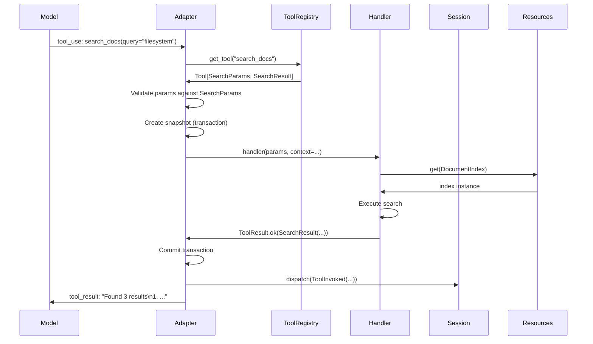
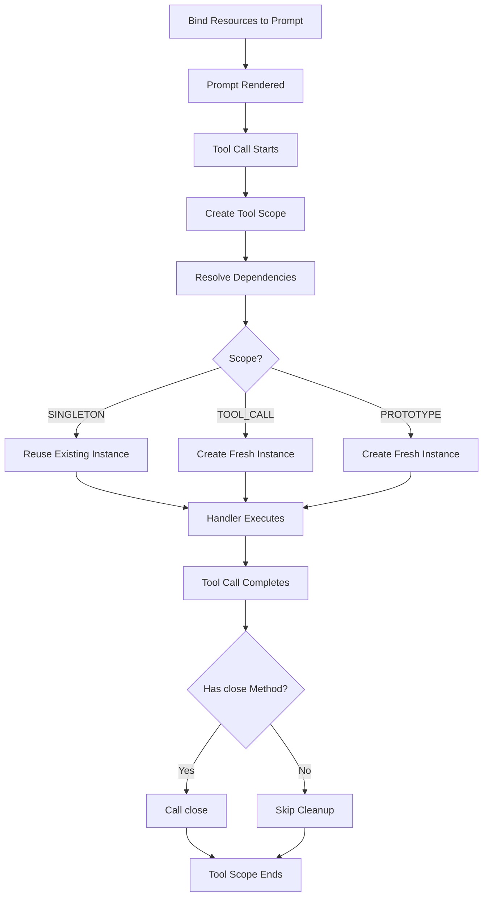
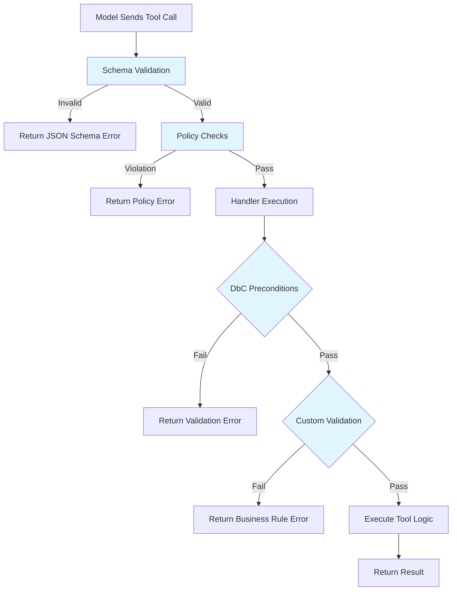
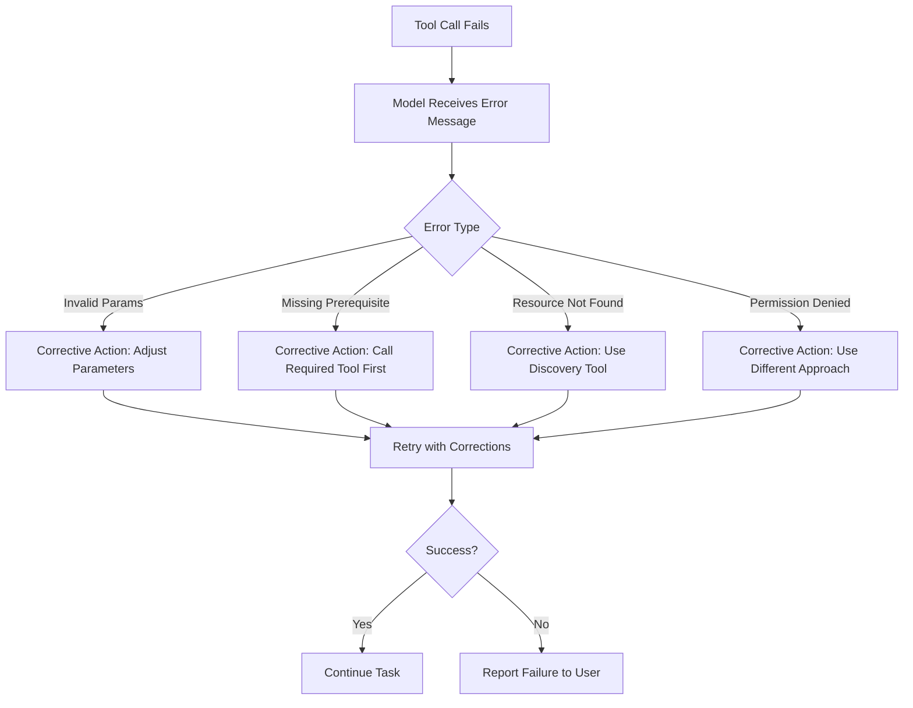
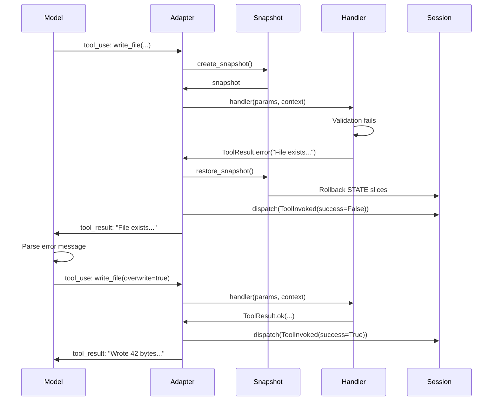
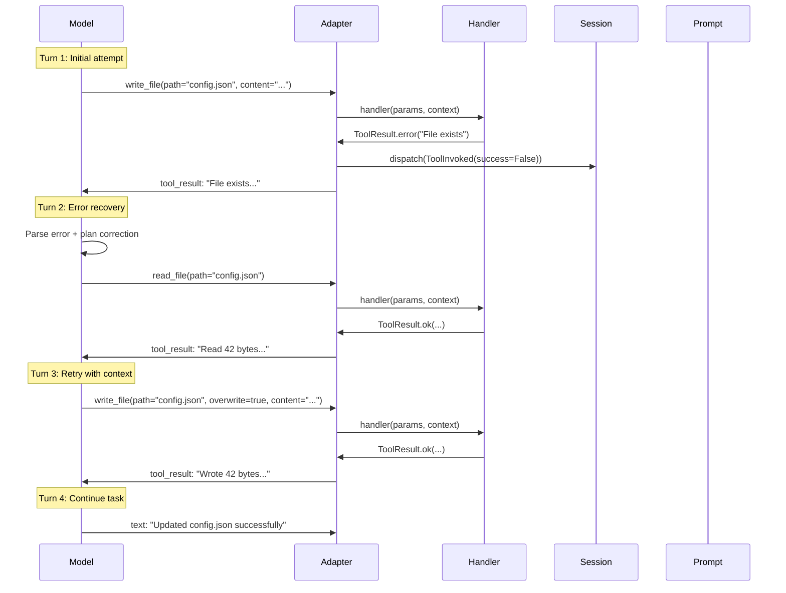
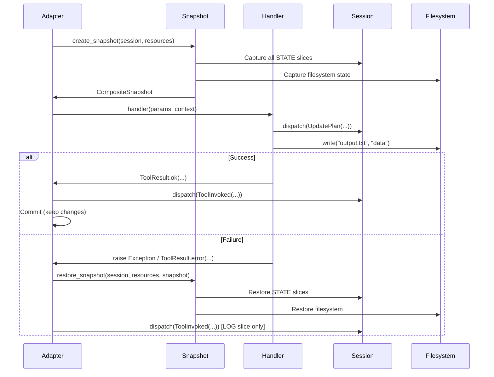
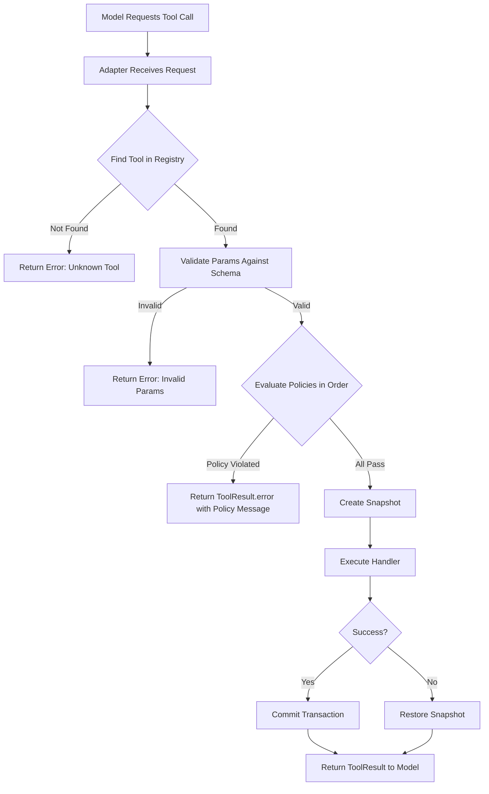

# Chapter 4: Tools

**Sandboxed, deterministic tool execution**

---

## Overview

In WINK, tools are the **only place where side effects happen**. Everything else—prompt rendering, state transitions, reducers—is pure and deterministic. This constraint is deliberate: when something goes wrong, you know exactly where to look.

The tool system provides:

- **Type-safe contracts** with validated parameters and structured results
- **Execution contexts** providing access to sessions, resources, and filesystems
- **Automatic transactions** that roll back state on failure
- **Declarative policies** that enforce cross-cutting constraints
- **Tool suites** that bundle guidance with capabilities

This chapter covers the complete tool lifecycle, from defining simple handlers to building transactional, policy-governed tool suites.

> **Canonical spec**: [specs/TOOLS.md](../specs/TOOLS.md)

---

## Table of Contents

1. [Tool Contracts](#tool-contracts)
2. [ToolContext and Resources](#toolcontext-and-resources)
3. [ToolResult Semantics](#toolresult-semantics)
4. [Tool Examples](#tool-examples)
5. [Validation and Error Handling](#validation-and-error-handling)
6. [Tool Suites as Sections](#tool-suites-as-sections)
7. [Transactional Tool Execution](#transactional-tool-execution)
8. [Tool Policies](#tool-policies)
9. [Best Practices](#best-practices)

---

## Tool Contracts

A tool is defined by a **contract** consisting of:

- **Name**: `^[a-z0-9_-]{1,64}$` (validated at construction time)
- **Description**: Short model-facing explanation of what the tool does
- **Parameters type**: A dataclass type (or `None` for parameterless tools)
- **Result type**: A dataclass type (or `None` for tools with no structured output)
- **Handler**: `handler(params, *, context) -> ToolResult[result_type]`

### Basic Tool Definition

```python
from dataclasses import dataclass
from weakincentives.prompt import Tool, ToolContext, ToolResult

@dataclass(slots=True, frozen=True)
class SearchParams:
    """Parameters for searching documentation."""
    query: str
    limit: int = 10

@dataclass(slots=True, frozen=True)
class SearchResult:
    """Search results with matching documents."""
    matches: tuple[str, ...]
    total_count: int

    def render(self) -> str:
        """Format results for model consumption."""
        if not self.matches:
            return "No matches found."

        lines = [f"Found {self.total_count} total matches:"]
        for i, match in enumerate(self.matches, 1):
            lines.append(f"{i}. {match}")
        return "\n".join(lines)

def search_handler(
    params: SearchParams,
    *,
    context: ToolContext
) -> ToolResult[SearchResult]:
    """Search the documentation index."""
    # Access resources through context
    index = context.resources.get(DocumentIndex)

    # Perform the search
    matches = index.search(params.query, limit=params.limit)

    return ToolResult.ok(
        SearchResult(
            matches=tuple(matches),
            total_count=len(matches)
        ),
        message=f"Found {len(matches)} results"
    )

# Create the tool with type parameters
search_tool = Tool[SearchParams, SearchResult](
    name="search_docs",
    description="Search the documentation index for relevant content.",
    handler=search_handler,
)
```

### Why Type Parameters Matter

The type parameters `Tool[SearchParams, SearchResult]` tell WINK:

1. **How to serialize** parameters for the model's tool schema
2. **How to validate** parameters when the model makes a tool call
3. **What structure** to expect in the result for type checking
4. **How to render** the result for context (via the `render()` method)

Type mismatches are caught at construction time, not at runtime.

### Tool Execution Flow



---

## ToolContext and Resources

`ToolContext` provides tool handlers with access to execution-time state without polluting the handler signature with dozens of parameters.

### ToolContext Fields

```python
@dataclass(slots=True, frozen=True)
class ToolContext:
    """Immutable container exposing prompt execution state to handlers."""

    prompt: PromptProtocol
    """The prompt being executed"""

    rendered_prompt: RenderedPromptProtocol | None
    """The rendered prompt with all sections expanded"""

    adapter: ProviderAdapterProtocol
    """The adapter executing the tool (OpenAI, LiteLLM, Claude Agent SDK)"""

    session: SessionProtocol
    """The current session containing all state slices"""

    deadline: Deadline | None
    """Optional wall-clock deadline for terminating execution"""

    budget_tracker: BudgetTracker | None
    """Optional token budget tracker"""

    resources: PromptResources
    """Typed resource registry for dependency injection"""
```

### Resource Management

Resources are the backbone of WINK's dependency injection system. They provide:

- **Lazy construction** with dependency resolution
- **Scoped lifecycles** (singleton, tool-call, prototype)
- **Automatic cleanup** via lifecycle protocols
- **Type-safe access** through protocol types

### Resource Lifecycle



### Binding Resources to Prompts

There are two ways to bind resources: simple instances or lazy bindings with dependencies.

**Option 1: Pre-constructed instances**

```python
from weakincentives.prompt import Prompt
from myapp.http import HTTPClient

# Simple case: pass instances directly
http_client = HTTPClient(base_url="https://api.example.com")
prompt = Prompt(template).bind(
    params,
    resources={HTTPClient: http_client}
)

# Use with context manager for lifecycle
with prompt.resources:
    response = adapter.evaluate(prompt, session=session)
```

**Option 2: Lazy construction with dependencies**

```python
from weakincentives.resources import Binding, Scope

prompt = Prompt(template).bind(params, resources={
    # Config constructed first (no dependencies)
    Config: Binding(Config, lambda r: Config.from_env()),

    # HTTPClient depends on Config
    HTTPClient: Binding(
        HTTPClient,
        lambda r: HTTPClient(r.get(Config).url)
    ),

    # Tracer is fresh per tool call
    Tracer: Binding(
        Tracer,
        lambda r: Tracer(),
        scope=Scope.TOOL_CALL
    ),
})
```

### Resource Scopes

Scopes control instance lifetime:

| Scope | Lifetime | Use Case |
|-------|----------|----------|
| `SINGLETON` | One instance per session (default) | HTTP clients, database connections, config |
| `TOOL_CALL` | Fresh instance per tool invocation | Tracers, per-call metrics, transaction handles |
| `PROTOTYPE` | Fresh instance on every access | Stateful builders, mutable collectors |

### Using MainLoop (Recommended)

`MainLoop.execute()` handles resource binding and lifecycle automatically:

```python
from weakincentives.runtime import MainLoopConfig
from weakincentives.resources import Binding, Scope

# Configure resources at the loop level
config = MainLoopConfig(
    resources={
        Config: Binding(Config, lambda r: Config.from_env()),
        HTTPClient: Binding(
            HTTPClient,
            lambda r: HTTPClient(r.get(Config).url)
        ),
    }
)
loop = MyLoop(adapter=adapter, bus=bus, config=config)

# Resources bound automatically
response, session = loop.execute(request)

# Override per-request
response, session = loop.execute(
    request,
    resources={Tracer: tracer}
)
```

### Dependency Injection Example

```python
from weakincentives.resources import Binding, ResourceRegistry, Scope

# Define your dependencies
@dataclass(slots=True, frozen=True)
class Config:
    api_key: str
    base_url: str

    @staticmethod
    def from_env() -> Config:
        return Config(
            api_key=os.environ["API_KEY"],
            base_url=os.environ["BASE_URL"]
        )

class HTTPClient:
    def __init__(self, config: Config):
        self.base_url = config.base_url
        self.headers = {"Authorization": f"Bearer {config.api_key}"}

    def close(self) -> None:
        """Cleanup connections (called automatically)."""
        pass

class Tracer:
    def __init__(self):
        self.spans: list[str] = []

    def record(self, operation: str) -> None:
        self.spans.append(operation)

# Create registry with dependency graph
registry = ResourceRegistry.of(
    # Config has no dependencies
    Binding(Config, lambda r: Config.from_env()),

    # HTTPClient depends on Config
    Binding(HTTPClient, lambda r: HTTPClient(r.get(Config))),

    # Tracer is fresh per tool call
    Binding(Tracer, lambda r: Tracer(), scope=Scope.TOOL_CALL),
)

# Use with lifecycle management
with registry.open() as ctx:
    # Lazy resolution walks dependency graph
    http = ctx.get(HTTPClient)  # Also resolves Config

    # Tool-scoped resources
    with ctx.tool_scope() as tool_resolver:
        tracer = tool_resolver.get(Tracer)  # Fresh instance
        tracer.record("search_started")

    # Tracer cleaned up here
# HTTPClient.close() called automatically here
```

### Lifecycle Protocols

Resources can implement lifecycle protocols for automatic management:

```python
from typing import Protocol

class Closeable(Protocol):
    """Resource that needs explicit cleanup."""
    def close(self) -> None: ...

class PostConstruct(Protocol):
    """Resource that needs initialization after construction."""
    def post_construct(self) -> None: ...

# Example resource using both protocols
class DatabaseConnection:
    def __init__(self, config: Config):
        self.config = config
        self.conn = None  # type: ignore

    def post_construct(self) -> None:
        """Called automatically after construction."""
        self.conn = connect(self.config.db_url)

    def close(self) -> None:
        """Called automatically when context ends."""
        if self.conn:
            self.conn.close()
```

### Resource Management in Tool Handlers

Tool handlers access resources through the context:

```python
def handler(params: MyParams, *, context: ToolContext) -> ToolResult[MyResult]:
    # Get resources from context
    http = context.resources.get(HTTPClient)
    tracer = context.resources.get(Tracer)
    fs = context.resources.get(Filesystem)

    # Use resources
    tracer.record(f"fetching {params.url}")
    response = http.get(params.url)

    # Filesystem is the most common resource for workspace agents
    fs.write("output.json", response.text)

    return ToolResult.ok(
        MyResult(status="success"),
        message="Fetched and saved"
    )
```

### Filesystem Resource

For workspace agents, the most common resource is a `Filesystem` implementation. Many contributed tool suites install one automatically:

```python
from weakincentives.contrib.tools import VfsToolsSection
from weakincentives.filesystem import Filesystem

# VFS installs a Filesystem resource automatically
vfs = VfsToolsSection(session=session, config=vfs_config)

# Tools in this section can access it via context
def read_file_handler(
    params: ReadFileParams,
    *,
    context: ToolContext
) -> ToolResult[ReadFileResult]:
    fs = context.resources.get(Filesystem)
    content = fs.read(params.path)
    return ToolResult.ok(ReadFileResult(content=content))
```

See [Chapter 12: Workspace Tools](12-workspace-tools.md) for details on VFS, Podman, and other workspace abstractions.

---

## ToolResult Semantics

Tool handlers return `ToolResult` to communicate both **what happened** (the structured value) and **what to tell the model** (the message).

### ToolResult Structure

```python
@dataclass(slots=True)
class ToolResult[ResultValueT]:
    """Structured response emitted by a tool handler."""

    message: str
    """Human-readable status for the model."""

    value: ResultValueT | None
    """Typed payload (dataclass, mapping, sequence, string, or None)."""

    success: bool = True
    """Whether the operation succeeded (affects adapter behavior)."""

    exclude_value_from_context: bool = False
    """Hide large payloads from model context while preserving in session."""
```

### Convenience Constructors

```python
# Success with typed value (most common)
ToolResult.ok(
    SearchResult(matches=("doc1", "doc2"), total_count=2),
    message="Found 2 results"
)

# Failure with no value
ToolResult.error("File not found: config.json")

# Full form (when exclude_value_from_context is needed)
ToolResult(
    message="Read 1.2MB from large_file.csv",
    value=FileContents(content=large_string),
    success=True,
    exclude_value_from_context=True,  # Hide from model, keep in session
)
```

### Rendering Results

WINK uses the `render()` method to convert structured values into text for the model:

1. **If value is a dataclass with `render()`**: Use that method
2. **If value is a dataclass without `render()`**: Serialize to JSON (with a warning)
3. **If value is a mapping**: Serialize to JSON
4. **If value is a sequence**: Format as newline-separated items
5. **If value is a string**: Use as-is
6. **If value is None**: Return empty string

**Example with custom rendering:**

```python
@dataclass(slots=True, frozen=True)
class FileSearchResult:
    matches: tuple[str, ...]
    total_count: int
    truncated: bool

    def render(self) -> str:
        """Control exactly what the model sees."""
        if not self.matches:
            return "No matching files found."

        lines = [f"Found {len(self.matches)} files"]
        if self.truncated:
            lines.append(f"(showing first {len(self.matches)} of {self.total_count} total)")

        for path in self.matches:
            lines.append(f"  - {path}")

        return "\n".join(lines)
```

### Success vs. Failure

The `success` field affects adapter behavior:

- **`success=True`**: Adapter treats this as a successful tool call
- **`success=False`**: Adapter may retry or report an error to the model

**When to use `success=False`:**

- File not found
- Invalid parameters (that passed schema validation but failed business logic)
- External API returned an error
- Resource exhaustion (quota exceeded, timeout, etc.)

**When to use `success=True` with an informative message:**

- Empty search results (not an error, just no matches)
- Partial success (some items processed, others skipped)
- No-op operations (file already exists, task already complete)

### Exception Handling

Exceptions raised by handlers are automatically caught and converted to `ToolResult.error()`:

```python
def risky_handler(params: MyParams, *, context: ToolContext) -> ToolResult[MyResult]:
    # This exception will be caught
    if not params.path.startswith("/safe/"):
        raise ValueError("Path must start with /safe/")

    # This will be converted to ToolResult.error("Path must start with /safe/")
    # ... and the transaction will be rolled back
```

**Safety exceptions** that propagate unchanged:

- `KeyboardInterrupt`
- `SystemExit`
- `asyncio.CancelledError`
- `DeadlineExceededError` (from WINK's deadline enforcement)

All other exceptions are caught, logged, and converted to failures.

### Excluding Large Values from Context

The `exclude_value_from_context` flag is useful for tools that return large payloads:

```python
def read_large_file_handler(
    params: ReadFileParams,
    *,
    context: ToolContext
) -> ToolResult[FileContents]:
    fs = context.resources.get(Filesystem)
    content = fs.read(params.path)

    # Value is recorded in session for debugging
    # But model only sees the summary message
    return ToolResult(
        message=f"Read {len(content)} bytes from {params.path}",
        value=FileContents(content=content),
        success=True,
        exclude_value_from_context=True,  # Don't send full content to model
    )
```

This is critical for cost control: reading a 10MB file should not consume 10MB of context tokens.

---

## Tool Examples

Tool examples improve model performance and debugging by showing representative invocations.

### Defining Examples

```python
from weakincentives.prompt import ToolExample

now_tool = Tool[NowParams, NowResult](
    name="now",
    description="Return current UTC time in ISO 8601 format.",
    handler=now_handler,
    examples=(
        ToolExample(
            description="Get current UTC time",
            input=NowParams(tz="UTC"),
            output=NowResult(iso="2025-01-01T00:00:00+00:00"),
        ),
        ToolExample(
            description="Get time in specific timezone",
            input=NowParams(tz="America/New_York"),
            output=NowResult(iso="2025-01-01T05:00:00-05:00"),
        ),
    ),
)
```

### Why Examples Matter

**Without examples**, models often:

- Use the wrong parameter name (`query` vs. `q` vs. `search_term`)
- Pass the wrong type (`"10"` string instead of `10` integer)
- Misunderstand format requirements (ISO 8601 vs. Unix timestamp)
- Skip optional parameters that significantly affect results

**With examples**, models:

- See the exact format you expect
- Learn parameter naming conventions
- Understand edge cases (empty results, errors, etc.)
- Improve first-call success rates dramatically

**Rule of thumb**: If you've ever seen a model "almost" call your tool correctly, add an example.

### Examples in Tool Schemas

Adapters may include examples in the tool schema sent to the model (depending on provider support):

```json
{
  "name": "now",
  "description": "Return current UTC time in ISO 8601 format.",
  "parameters": {
    "type": "object",
    "properties": {
      "tz": {
        "type": "string",
        "description": "Timezone name (e.g., 'UTC', 'America/New_York')"
      }
    }
  },
  "examples": [
    {
      "description": "Get current UTC time",
      "input": {"tz": "UTC"},
      "output": {"iso": "2025-01-01T00:00:00+00:00"}
    }
  ]
}
```

---

## Validation and Error Handling

Validation and error handling are critical to agent reliability. A tool that accepts invalid inputs or returns unclear errors leads to:

- **Wasted turns** as the model retries with incorrect parameters
- **Confusing conversations** where the model doesn't understand what went wrong
- **Silent failures** where errors are ignored or misinterpreted
- **Token waste** from repeated failed attempts

WINK's validation and error handling system provides multiple layers of protection, from automatic schema validation to custom business rules, with clear error messages that guide the model toward successful recovery.

> **Key specs**: [specs/TOOLS.md](../specs/TOOLS.md), [specs/DBC.md](../specs/DBC.md)

---

### Input Validation

Input validation happens in **multiple stages**, each catching a different class of problems:



#### Stage 1: Automatic Schema Validation

WINK automatically validates parameters against the dataclass schema **before** the handler is called. The adapter converts the tool's parameter type into a JSON schema and validates the model's input.

**Example parameter type:**

```python
from dataclasses import dataclass

@dataclass(slots=True, frozen=True)
class SearchParams:
    """Parameters for searching files."""
    query: str
    """Search query (required)."""

    limit: int = 10
    """Maximum results to return (1-100)."""

    case_sensitive: bool = False
    """Whether search is case-sensitive."""

    file_types: tuple[str, ...] = ()
    """File extensions to filter (e.g., ('py', 'md'))."""
```

**What gets validated automatically:**

- `query` must be a string (not null, not a number)
- `limit` must be an integer (not a string, not a float)
- `case_sensitive` must be a boolean (not `"true"` string)
- `file_types` must be a tuple/array of strings

**Schema validation errors:**

```json
{
  "error": "Invalid parameters for tool 'search_files'",
  "details": {
    "limit": "Expected type integer, got string '10'"
  }
}
```

The model receives this error and can retry with corrected parameters.

#### Stage 2: Value Validation with DbC

Schema validation catches **type errors**, but not **value errors**. Use Design-by-Contract decorators to enforce value constraints:

```python
from weakincentives.dbc import require
from weakincentives.prompt import Tool, ToolContext, ToolResult

@dataclass(slots=True, frozen=True)
class SearchParams:
    query: str
    limit: int = 10
    case_sensitive: bool = False

@require(lambda params: 1 <= params.limit <= 100, "limit must be between 1 and 100")
@require(lambda params: len(params.query.strip()) > 0, "query cannot be empty")
def search_handler(
    params: SearchParams,
    *,
    context: ToolContext
) -> ToolResult[SearchResult]:
    """Search files with validated parameters."""
    # Preconditions guaranteed by @require decorators
    fs = context.resources.get(Filesystem)
    results = fs.search(params.query, limit=params.limit)

    return ToolResult.ok(
        SearchResult(matches=tuple(results)),
        message=f"Found {len(results)} matches"
    )
```

**When preconditions fail:**

```python
# Model calls: search_files(query="", limit=10)
# Result: ToolResult.error("Precondition failed: query cannot be empty")

# Model calls: search_files(query="test", limit=500)
# Result: ToolResult.error("Precondition failed: limit must be between 1 and 100")
```

The model sees a **clear, actionable error message** explaining what went wrong.

#### Stage 3: Custom Business Rule Validation

Some validation requires context beyond the parameters themselves:

```python
def write_file_handler(
    params: WriteFileParams,
    *,
    context: ToolContext
) -> ToolResult[WriteFileResult]:
    """Write content to a file with business rule validation."""
    fs = context.resources.get(Filesystem)

    # Custom validation: Check if path is safe
    if not params.path.startswith("/workspace/"):
        return ToolResult.error(
            f"Cannot write outside workspace: {params.path}\n"
            f"All paths must start with /workspace/"
        )

    # Custom validation: Check if file is too large
    if len(params.content) > 10 * 1024 * 1024:  # 10MB
        return ToolResult.error(
            f"File too large: {len(params.content)} bytes\n"
            f"Maximum size is 10MB (10,485,760 bytes)"
        )

    # Custom validation: Check if overwriting without confirmation
    if fs.exists(params.path) and not params.overwrite:
        return ToolResult.error(
            f"File already exists: {params.path}\n"
            f"Set overwrite=true to replace existing file"
        )

    # All validations passed - execute write
    fs.write(params.path, params.content)

    return ToolResult.ok(
        WriteFileResult(path=params.path, size=len(params.content)),
        message=f"Wrote {len(params.content)} bytes to {params.path}"
    )
```

#### Validation Error Message Design

Error messages should be **model-facing**, not developer-facing. The model needs:

1. **What went wrong** (specific violation)
2. **Why it matters** (context if non-obvious)
3. **How to fix it** (actionable next steps)

**Bad error messages:**

```python
return ToolResult.error("Invalid path")  # Too vague
return ToolResult.error("ValueError: path validation failed")  # Internal details
return ToolResult.error("Error code 42")  # Requires lookup
```

**Good error messages:**

```python
return ToolResult.error(
    f"Cannot write to {params.path} - path must start with /workspace/\n"
    f"Example valid paths: /workspace/output.txt, /workspace/data/results.json"
)

return ToolResult.error(
    f"File {params.path} already exists ({existing_size} bytes)\n"
    f"To overwrite, call write_file again with overwrite=true"
)

return ToolResult.error(
    f"Query '{params.query}' returned no results\n"
    f"Try a broader search term or check spelling"
)
```

#### Enum Validation

For parameters with limited valid values, use `Literal` types or explicit validation:

```python
from typing import Literal

@dataclass(slots=True, frozen=True)
class DeployParams:
    """Parameters for deployment."""
    environment: Literal["development", "staging", "production"]
    """Target environment."""

    strategy: Literal["rolling", "blue-green", "canary"] = "rolling"
    """Deployment strategy."""

# Schema validation automatically rejects invalid values
# Model sends: deploy(environment="prod")
# Error: "environment must be one of: development, staging, production"
```

#### Validation with External Systems

When validation requires external checks (database lookups, API calls), do it **inside the handler**:

```python
def delete_file_handler(
    params: DeleteFileParams,
    *,
    context: ToolContext
) -> ToolResult[DeleteFileResult]:
    """Delete a file with external validation."""
    fs = context.resources.get(Filesystem)

    # Check if file exists (external filesystem check)
    if not fs.exists(params.path):
        return ToolResult.error(
            f"Cannot delete {params.path} - file does not exist\n"
            f"Use list_directory to see available files"
        )

    # Check if file is protected (external metadata check)
    if fs.is_readonly(params.path):
        return ToolResult.error(
            f"Cannot delete {params.path} - file is read-only\n"
            f"This file is managed externally and cannot be modified"
        )

    # Validation passed - execute deletion
    fs.delete(params.path)

    return ToolResult.ok(
        DeleteFileResult(path=params.path),
        message=f"Deleted {params.path}"
    )
```

**Key principle**: Validate as early as possible, but not earlier. Schema validation happens before the handler, business rules happen inside.

---

### Output Validation

Output validation ensures the tool handler returns **well-formed, consistent results** that the model can understand and use.

#### ToolResult Structure Review

```python
@dataclass(slots=True)
class ToolResult[ResultValueT]:
    """Structured response from a tool handler."""

    message: str
    """Human-readable summary for the model (always required)."""

    value: ResultValueT | None
    """Typed payload (dataclass, mapping, sequence, string, or None)."""

    success: bool = True
    """Whether the operation succeeded (affects adapter behavior)."""

    exclude_value_from_context: bool = False
    """Hide large payloads from model while preserving in session."""
```

#### When to Use ToolResult.ok() vs ToolResult.error()

The distinction between success and failure affects how the model interprets results:

**Use `ToolResult.ok()` (success=True) when:**

- Operation completed as intended
- Partial success (some items processed, some skipped)
- Empty results (search with no matches)
- No-op operations (file already in desired state)

**Use `ToolResult.error()` (success=False) when:**

- Operation could not complete
- Parameters were invalid (passed schema but failed business rules)
- External system returned an error
- Preconditions not met
- Resource exhaustion (quota exceeded, timeout)

#### Success with No Results

Empty results are **not errors**:

```python
def search_handler(
    params: SearchParams,
    *,
    context: ToolContext
) -> ToolResult[SearchResult]:
    """Search with proper empty result handling."""
    fs = context.resources.get(Filesystem)
    matches = fs.search(params.query)

    # No matches is not an error - it's information
    if not matches:
        return ToolResult.ok(
            SearchResult(matches=(), total_count=0),
            message=f"No files match '{params.query}'"
        )

    return ToolResult.ok(
        SearchResult(matches=tuple(matches), total_count=len(matches)),
        message=f"Found {len(matches)} files matching '{params.query}'"
    )
```

The model can distinguish "no results found" (success) from "search failed" (error).

#### Validating Output Values

Output dataclasses can include their own validation:

```python
from dataclasses import dataclass, field

@dataclass(slots=True, frozen=True)
class SearchResult:
    """Search results with built-in validation."""
    matches: tuple[str, ...]
    total_count: int

    def __post_init__(self) -> None:
        """Validate result consistency."""
        if len(self.matches) > self.total_count:
            raise ValueError(
                f"Invalid result: {len(self.matches)} matches "
                f"but total_count={self.total_count}"
            )

        if self.total_count < 0:
            raise ValueError(f"total_count cannot be negative: {self.total_count}")

    def render(self) -> str:
        """Format for model consumption."""
        if not self.matches:
            return "No matches found."

        lines = [f"Found {self.total_count} total matches:"]
        for i, match in enumerate(self.matches, 1):
            lines.append(f"{i}. {match}")
        return "\n".join(lines)
```

If a handler tries to return an invalid result, the exception is caught and converted to `ToolResult.error()`.

#### Output Transformation and Normalization

Normalize output to ensure consistency:

```python
def read_file_handler(
    params: ReadFileParams,
    *,
    context: ToolContext
) -> ToolResult[FileContents]:
    """Read file with normalized line endings."""
    fs = context.resources.get(Filesystem)
    raw_content = fs.read(params.path)

    # Normalize line endings for consistent processing
    normalized = raw_content.replace('\r\n', '\n').replace('\r', '\n')

    # Normalize path separators
    canonical_path = params.path.replace('\\', '/')

    return ToolResult.ok(
        FileContents(
            path=canonical_path,
            content=normalized,
            size=len(raw_content)
        ),
        message=f"Read {len(raw_content)} bytes from {canonical_path}"
    )
```

#### Structured Output Constraints

Use `@ensure` decorators to enforce output contracts:

```python
from weakincentives.dbc import ensure

@ensure(lambda result: result.success or result.value is None,
        "Failed results must have value=None")
@ensure(lambda result: len(result.message) > 0,
        "Result must include a message")
def validated_handler(
    params: MyParams,
    *,
    context: ToolContext
) -> ToolResult[MyResult]:
    """Handler with validated output contract."""
    # Implementation guaranteed to satisfy postconditions
    return ToolResult.ok(MyResult(...), message="Done")
```

If the handler violates the postcondition, the DbC decorator catches it and returns an error.

---

### Error Handling Semantics

Error handling in WINK follows a clear philosophy: **expected failures return ToolResult.error(), unexpected failures raise exceptions**.

#### ToolResult.error() for Expected Failures

Expected failures are **part of normal operation**. The model needs to know about them and potentially take corrective action.

```python
def git_push_handler(
    params: GitPushParams,
    *,
    context: ToolContext
) -> ToolResult[GitPushResult]:
    """Push with expected failure handling."""
    git = context.resources.get(GitClient)

    try:
        result = git.push(params.remote, params.branch)
        return ToolResult.ok(
            GitPushResult(sha=result.sha, remote=params.remote),
            message=f"Pushed {result.sha} to {params.remote}/{params.branch}"
        )
    except GitAuthError as e:
        # Expected failure: credentials missing or invalid
        return ToolResult.error(
            f"Authentication failed for {params.remote}\n"
            f"Configure credentials with: git_configure_auth tool"
        )
    except GitConflictError as e:
        # Expected failure: remote has changes
        return ToolResult.error(
            f"Push rejected - remote has new commits\n"
            f"Pull latest changes with: git_pull tool, then retry push"
        )
    except GitNetworkError as e:
        # Expected failure: network unavailable
        return ToolResult.error(
            f"Network error: {e.message}\n"
            f"Check connectivity and retry"
        )
```

**Characteristics of expected failures:**

- Part of the documented tool behavior
- Can happen during normal usage
- Model can take corrective action
- Should not be logged as errors (info level is appropriate)

#### Exceptions for Unexpected Failures

Unexpected failures indicate **programming errors** or **system-level problems**:

```python
def process_data_handler(
    params: ProcessDataParams,
    *,
    context: ToolContext
) -> ToolResult[ProcessDataResult]:
    """Process data with exception handling."""
    fs = context.resources.get(Filesystem)

    # Expected failure: file not found
    if not fs.exists(params.input_path):
        return ToolResult.error(
            f"Input file not found: {params.input_path}\n"
            f"Use list_directory to see available files"
        )

    raw_data = fs.read(params.input_path)

    # Unexpected failure: data structure invariant violated
    # Let exception propagate - this indicates a bug
    assert len(raw_data) > 0, "read() returned empty data for existing file"

    # Unexpected failure: resource exhausted
    # Let exception propagate - this needs human intervention
    if len(raw_data) > 1024 * 1024 * 1024:  # 1GB
        raise RuntimeError(f"File too large: {len(raw_data)} bytes")

    processed = process(raw_data)
    fs.write(params.output_path, processed)

    return ToolResult.ok(
        ProcessDataResult(
            input_path=params.input_path,
            output_path=params.output_path,
            bytes_processed=len(raw_data)
        ),
        message=f"Processed {len(raw_data)} bytes to {params.output_path}"
    )
```

**When exceptions are caught:**

All exceptions (except safety exceptions) are caught by the adapter and converted to:

```python
ToolResult(
    message=f"Internal error: {exception_message}",
    value=None,
    success=False
)
```

The transaction is rolled back, and the error is logged.

#### Error Message Design for Model Recovery

Error messages should **guide the model toward successful resolution**:



**Pattern: Include actionable next steps**

```python
# Bad: Vague error
return ToolResult.error("Permission denied")

# Good: Actionable error
return ToolResult.error(
    f"Permission denied: cannot write to {params.path}\n"
    f"This file is read-only. To modify it:\n"
    f"1. Copy to a new location with copy_file\n"
    f"2. Make changes to the copy\n"
    f"3. Use the copy as your working file"
)
```

**Pattern: Suggest alternative tools**

```python
# Bad: Dead end
return ToolResult.error("Cannot search by content")

# Good: Alternative approach
return ToolResult.error(
    f"search_files searches by filename only\n"
    f"To search by content, use grep_files tool:\n"
    f"  grep_files(pattern='{params.query}', path='/workspace')"
)
```

**Pattern: Provide examples**

```python
# Bad: Format unclear
return ToolResult.error("Invalid date format")

# Good: Show valid format
return ToolResult.error(
    f"Invalid date: '{params.date}'\n"
    f"Expected format: YYYY-MM-DD\n"
    f"Examples:\n"
    f"  - 2025-01-15\n"
    f"  - 2025-12-31"
)
```

#### How Errors Propagate Through Adapters



**Key behaviors:**

1. **Errors trigger rollback**: Session state reverts to pre-call snapshot
2. **ToolInvoked always recorded**: Both successes and failures appear in LOG slice
3. **Error message sent to model**: Model receives the `message` field verbatim
4. **Conversation continues**: Model can retry or take alternative action

#### Transaction Rollback on Errors

When a tool fails, the transaction automatically rolls back:

```python
def multi_step_handler(
    params: MultiStepParams,
    *,
    context: ToolContext
) -> ToolResult[MultiStepResult]:
    """Handler with multiple state changes."""
    fs = context.resources.get(Filesystem)
    session = context.session

    # Step 1: Update session state
    session.dispatch(UpdateProgress(step=1, total=3))

    # Step 2: Write intermediate file
    fs.write("/workspace/temp.txt", "intermediate data")

    # Step 3: Validate and fail
    if not validate_intermediate():
        # This error triggers AUTOMATIC ROLLBACK of:
        # - UpdateProgress dispatch (session state reverts)
        # - temp.txt write (file disappears)
        return ToolResult.error(
            "Validation failed at step 3\n"
            "Intermediate changes rolled back"
        )

    # If we reach here, all changes are committed
    return ToolResult.ok(
        MultiStepResult(steps_completed=3),
        message="All steps completed successfully"
    )
```

**What gets rolled back:**

- All session dispatches to `STATE` slices
- All filesystem changes (VFS memory or git commits)
- All resource state changes (if resources support snapshotting)

**What does NOT get rolled back:**

- `LOG` slices (historical record is immutable)
- External API calls (use idempotency)
- Side effects outside WINK's control (logs, metrics, etc.)

#### Retry vs No-Retry Situations

Some errors are **retryable** (the model can take corrective action), others are **terminal** (require human intervention).

**Retryable errors:**

```python
# Wrong parameters - model can correct
return ToolResult.error(
    f"limit must be between 1 and 100 (got {params.limit})"
)

# Missing prerequisite - model can call required tool
return ToolResult.error(
    f"Cannot deploy - tests have not run\n"
    f"Call run_tests first, then retry deploy"
)

# Resource not found - model can use discovery
return ToolResult.error(
    f"File not found: {params.path}\n"
    f"Use list_directory to see available files"
)
```

**Terminal errors:**

```python
# System resource exhausted
return ToolResult.error(
    f"Out of memory: cannot process {size} MB file\n"
    f"Maximum supported size is 100 MB\n"
    f"This file requires human intervention"
)

# Authentication missing
return ToolResult.error(
    f"No credentials configured for {params.service}\n"
    f"Administrator must configure API key\n"
    f"Cannot proceed without credentials"
)

# Hard business rule violation
return ToolResult.error(
    f"Cannot delete production database\n"
    f"This operation is permanently blocked\n"
    f"Contact administrator if this is required"
)
```

**Hint for retry**: Use the word "retry" in retryable errors, and "cannot" or "requires human intervention" in terminal errors.

---

### Impact on Prompt Processing

Error handling affects the entire **conversation flow**. Understanding this helps design better tools and prompts.

#### What Happens When a Tool Call Fails



**Key observations:**

- Each failed tool call consumes a turn
- Model must parse error message and adjust strategy
- Well-designed errors enable **single-turn recovery** (turn 2 fixes turn 1)
- Poorly-designed errors require **multiple retries** (wasting tokens)

#### How Adapters Present Errors to the Model

Different adapters format tool errors differently, but WINK normalizes this:

**OpenAI format:**

```json
{
  "role": "tool",
  "tool_call_id": "call_abc123",
  "content": "File not found: config.json\nUse list_directory to see available files"
}
```

**Claude Agent SDK format:**

```json
{
  "type": "tool_result",
  "tool_use_id": "toolu_abc123",
  "is_error": false,
  "content": "File not found: config.json\nUse list_directory to see available files"
}
```

**Note**: Claude treats `ToolResult.error()` as **`is_error: false`** with an error message in the content. This is intentional—expected failures are not protocol-level errors, they're informational messages to the model.

#### Model Recovery Strategies

The model employs several recovery strategies based on error type:

**Strategy 1: Parameter correction**

```
# Error: "limit must be between 1 and 100 (got 500)"
# Recovery: Adjust parameter and retry immediately
search_files(query="test", limit=100)  # Was limit=500
```

**Strategy 2: Prerequisite fulfillment**

```
# Error: "Cannot deploy - tests have not run"
# Recovery: Call prerequisite tool first
run_tests()
# Wait for success
deploy()
```

**Strategy 3: Discovery and retry**

```
# Error: "File not found: config.json"
# Recovery: Use discovery tool to find correct path
list_directory(path="/workspace")
# Observe output: files include "app-config.json"
read_file(path="/workspace/app-config.json")
```

**Strategy 4: Alternative approach**

```
# Error: "Cannot write to read-only file: system.conf"
# Recovery: Use different approach
copy_file(src="system.conf", dst="system-modified.conf")
write_file(path="system-modified.conf", content="...")
```

#### Error-Correction Patterns in Prompts

Guide the model's recovery strategy in your prompt:

```python
section = MarkdownSection(
    title="File Operations",
    key="files",
    template="""
# File Operations

You have access to file manipulation tools. Follow these patterns:

## Error Recovery

If a tool call fails:

1. **Read the error message carefully** - it contains specific guidance
2. **Check for suggested alternatives** - error messages often suggest other tools
3. **Don't retry immediately** - fix the underlying issue first
4. **Use discovery tools** if paths are wrong (list_directory)

## Common Error Patterns

- **"File not found"** → Use list_directory to find correct path
- **"File exists"** → Use read_file first to check contents, then write with overwrite=true
- **"Permission denied"** → File may be read-only; copy it first
- **"Invalid path"** → Paths must start with /workspace/

## Example Recovery Flow

````
# Initial attempt
write_file(path="output.txt", content="data")
# Error: "File exists - use overwrite=true to replace"

# Recovery: Read first to understand contents
read_file(path="output.txt")
# Output: Shows existing file has 10 bytes

# Retry with overwrite
write_file(path="output.txt", content="data", overwrite=true)
# Success: "Wrote 4 bytes to output.txt"
````
    """.strip(),
    tools=(read_file, write_file, list_directory),
)
```

#### Conversation Flow After Errors

The adapter maintains conversation state across errors:

```python
# Conversation state after error:
# - All previous successful tool calls remain in history
# - Failed tool call appears in history with error message
# - Session state rolled back (as if failed call never happened)
# - Model can access full context to inform retry

# Example conversation:
# Turn 1: read_file("config.json") → Success
# Turn 2: write_file("config.json", ...) → Error: "Use overwrite=true"
# Turn 3: write_file("config.json", overwrite=true, ...) → Success

# At Turn 3, model has context from:
# - Turn 1 (what was in config.json)
# - Turn 2 (why write failed)
# This enables intelligent retry
```

#### Best Practices for Error Messages That Enable Recovery

1. **Be specific about what failed:**
   - Bad: `"Invalid input"`
   - Good: `"Invalid date format: expected YYYY-MM-DD, got '01/15/2025'"`

2. **Explain why it failed:**
   - Bad: `"Operation not allowed"`
   - Good: `"Cannot deploy to production without successful tests (policy violation)"`

3. **Suggest corrective action:**
   - Bad: `"File not found"`
   - Good: `"File not found: config.json\nUse list_directory('/workspace') to see available files"`

4. **Provide examples when format is unclear:**
   - Bad: `"Invalid regex"`
   - Good: `"Invalid regex: unclosed group\nExample valid patterns: '\\d+', '[a-z]+', '(foo|bar)'"`

5. **Reference related tools:**
   - Bad: `"No search results"`
   - Good: `"No files match '*.txt'\nTry glob_files for pattern matching or search_content for text search"`

---

### Validation Patterns

Common validation patterns that improve tool reliability and model experience.

#### Fail-Fast Validation

Validate **everything** before executing side effects:

```python
def complex_operation_handler(
    params: ComplexParams,
    *,
    context: ToolContext
) -> ToolResult[ComplexResult]:
    """Handler with fail-fast validation."""
    fs = context.resources.get(Filesystem)
    session = context.session

    # Validate ALL inputs before ANY side effects
    errors = []

    if not params.input_path.startswith("/workspace/"):
        errors.append(f"input_path must start with /workspace/ (got {params.input_path})")

    if not params.output_path.startswith("/workspace/"):
        errors.append(f"output_path must start with /workspace/ (got {params.output_path})")

    if not fs.exists(params.input_path):
        errors.append(f"input_path does not exist: {params.input_path}")

    if fs.exists(params.output_path) and not params.overwrite:
        errors.append(f"output_path exists: {params.output_path} (set overwrite=true)")

    if params.max_size < 1024:
        errors.append(f"max_size too small: {params.max_size} (minimum 1024 bytes)")

    # Return ALL errors at once (better than failing on first issue)
    if errors:
        return ToolResult.error(
            "Validation failed:\n" + "\n".join(f"  - {e}" for e in errors)
        )

    # NOW execute side effects (all validations passed)
    data = fs.read(params.input_path)
    processed = process(data, max_size=params.max_size)
    fs.write(params.output_path, processed)

    return ToolResult.ok(
        ComplexResult(bytes_processed=len(data)),
        message=f"Processed {len(data)} bytes"
    )
```

**Benefits:**

- Model sees ALL problems at once (not drip-fed)
- Reduces wasted turns
- No partial side effects from mid-validation failures

#### Multi-Stage Validation

For complex operations, validate in stages:

```python
def deploy_handler(
    params: DeployParams,
    *,
    context: ToolContext
) -> ToolResult[DeployResult]:
    """Handler with multi-stage validation."""
    deployer = context.resources.get(Deployer)
    session = context.session

    # Stage 1: Parameter validation (fast, no I/O)
    if params.environment not in ("development", "staging", "production"):
        return ToolResult.error(
            f"Invalid environment: {params.environment}\n"
            f"Must be one of: development, staging, production"
        )

    # Stage 2: Business rule validation (requires session state)
    tool_history = list(session[ToolInvoked].all())
    has_tests = any(t.tool_name == "run_tests" and t.success for t in tool_history)
    if not has_tests:
        return ToolResult.error(
            "Cannot deploy without running tests\n"
            "Call run_tests first, then retry deploy"
        )

    # Stage 3: External system validation (requires I/O)
    try:
        status = deployer.check_environment(params.environment)
    except NetworkError:
        return ToolResult.error(
            f"Cannot reach {params.environment} environment\n"
            "Check network connectivity and retry"
        )

    if not status.healthy:
        return ToolResult.error(
            f"{params.environment} environment is unhealthy: {status.reason}\n"
            "Wait for health checks to pass, then retry"
        )

    # All stages passed - execute deployment
    result = deployer.deploy(params.environment, params.version)

    return ToolResult.ok(
        DeployResult(environment=params.environment, version=params.version),
        message=f"Deployed {params.version} to {params.environment}"
    )
```

#### Validation with External Systems

When validation requires external calls, handle failures gracefully:

```python
def validate_credentials_handler(
    params: ValidateCredentialsParams,
    *,
    context: ToolContext
) -> ToolResult[ValidateCredentialsResult]:
    """Validate credentials with external API."""
    api = context.resources.get(APIClient)

    try:
        # External validation call
        result = api.validate_token(params.token)

        if result.valid:
            return ToolResult.ok(
                ValidateCredentialsResult(
                    valid=True,
                    expires_at=result.expires_at
                ),
                message=f"Token valid until {result.expires_at}"
            )
        else:
            return ToolResult.error(
                f"Token invalid: {result.reason}\n"
                f"Generate a new token with: create_token tool"
            )

    except APITimeoutError:
        # Transient failure - encourage retry
        return ToolResult.error(
            "Validation service timeout\n"
            "This is likely temporary - retry in a few seconds"
        )
    except APIError as e:
        # Permanent failure - different guidance
        return ToolResult.error(
            f"Validation service error: {e.message}\n"
            f"Cannot validate credentials at this time\n"
            f"Contact administrator if this persists"
        )
```

#### Idempotency Checks

For tools that may be called multiple times, validate idempotency:

```python
def initialize_workspace_handler(
    params: InitializeWorkspaceParams,
    *,
    context: ToolContext
) -> ToolResult[InitializeWorkspaceResult]:
    """Initialize workspace (idempotent)."""
    fs = context.resources.get(Filesystem)
    session = context.session

    # Check if already initialized
    if fs.exists("/workspace/.initialized"):
        config = fs.read("/workspace/.initialized")
        return ToolResult.ok(
            InitializeWorkspaceResult(
                already_initialized=True,
                config=config
            ),
            message="Workspace already initialized (no changes made)"
        )

    # Not initialized - proceed with initialization
    fs.mkdir("/workspace/src")
    fs.mkdir("/workspace/tests")
    fs.write("/workspace/.initialized", params.config)

    return ToolResult.ok(
        InitializeWorkspaceResult(
            already_initialized=False,
            config=params.config
        ),
        message="Workspace initialized successfully"
    )
```

**Pattern**: Idempotent operations return success whether they did work or not, but communicate the actual outcome.

#### Rate Limiting and Quotas

Validate against usage limits:

```python
class RateLimitPolicy:
    """Policy enforcing rate limits."""

    def __init__(self, max_calls_per_minute: int):
        self.max_calls_per_minute = max_calls_per_minute

    def check(
        self,
        tool_name: str,
        params: object,
        context: ToolContext
    ) -> str | None:
        """Check if rate limit exceeded."""
        session = context.session
        now = time.time()
        one_minute_ago = now - 60

        # Count recent calls
        recent_calls = [
            event for event in session[ToolInvoked].all()
            if event.tool_name == tool_name
            and event.timestamp >= one_minute_ago
        ]

        if len(recent_calls) >= self.max_calls_per_minute:
            return (
                f"Rate limit exceeded: {len(recent_calls)} calls to {tool_name} in last minute\n"
                f"Maximum: {self.max_calls_per_minute} calls per minute\n"
                f"Wait 60 seconds before retrying"
            )

        return None  # Allow

# Attach to section
section = MarkdownSection(
    title="External API",
    key="api",
    template="...",
    tools=(api_call_tool,),
    policies=(RateLimitPolicy(max_calls_per_minute=10),),
)
```

---

### Testing Validation and Errors

Validation and error handling are **critical paths** that deserve comprehensive testing.

#### Testing Happy Paths vs Error Paths

**Anti-pattern: Only testing success**

```python
def test_search_handler_only_success():
    """Incomplete test - only validates happy path."""
    params = SearchParams(query="test", limit=10)
    context = make_context()

    result = search_handler(params, context=context)

    assert result.success
    assert len(result.value.matches) > 0
```

**Pattern: Test both success and failure**

```python
def test_search_handler_success():
    """Test successful search."""
    params = SearchParams(query="test", limit=10)
    context = make_context_with_files(["test.py", "test_helper.py"])

    result = search_handler(params, context=context)

    assert result.success
    assert result.value.matches == ("test.py", "test_helper.py")
    assert "Found 2" in result.message

def test_search_handler_no_results():
    """Test search with no matches."""
    params = SearchParams(query="nonexistent", limit=10)
    context = make_context_with_files(["other.py"])

    result = search_handler(params, context=context)

    assert result.success  # No results is not an error
    assert result.value.matches == ()
    assert "No files match" in result.message

def test_search_handler_invalid_limit():
    """Test validation error for invalid limit."""
    params = SearchParams(query="test", limit=500)
    context = make_context()

    result = search_handler(params, context=context)

    assert not result.success
    assert "limit must be between 1 and 100" in result.message
    assert result.value is None
```

#### Parameterized Tests for Validation Rules

Use pytest parameterization to test all validation rules:

```python
import pytest

@pytest.mark.parametrize("limit,expected_error", [
    (0, "limit must be between 1 and 100"),
    (-1, "limit must be between 1 and 100"),
    (101, "limit must be between 1 and 100"),
    (500, "limit must be between 1 and 100"),
])
def test_search_handler_invalid_limits(limit, expected_error):
    """Test all invalid limit values."""
    params = SearchParams(query="test", limit=limit)
    context = make_context()

    result = search_handler(params, context=context)

    assert not result.success
    assert expected_error in result.message

@pytest.mark.parametrize("query,expected_error", [
    ("", "query cannot be empty"),
    ("   ", "query cannot be empty"),
    ("\t\n", "query cannot be empty"),
])
def test_search_handler_invalid_queries(query, expected_error):
    """Test all invalid query values."""
    params = SearchParams(query=query, limit=10)
    context = make_context()

    result = search_handler(params, context=context)

    assert not result.success
    assert expected_error in result.message
```

#### Testing Error Message Quality

Error messages are part of the **tool interface**—test them:

```python
def test_write_file_error_message_quality():
    """Test that error messages are actionable."""
    params = WriteFileParams(path="config.json", content="data")
    context = make_context_with_files(["config.json"])

    result = write_file_handler(params, context=context)

    # Verify error message contains:
    # 1. What went wrong
    assert "already exists" in result.message.lower()

    # 2. How to fix it
    assert "overwrite=true" in result.message

    # 3. The specific file involved
    assert "config.json" in result.message

    # Anti-pattern: vague errors
    assert result.message != "Error"
    assert result.message != "File operation failed"
    assert "error code" not in result.message.lower()
```

#### Testing Transaction Rollback

Verify that failed operations don't leave inconsistent state:

```python
def test_handler_rollback_on_error():
    """Test that validation errors trigger rollback."""
    session = make_session()
    fs = make_vfs()
    context = make_context(session=session, fs=fs)

    # Initial state
    initial_plan = Plan(steps=("step1",))
    session[Plan].seed(initial_plan)

    # Call handler that will fail validation
    params = ProcessParams(invalid_field=True)
    result = process_handler(params, context=context)

    # Verify error returned
    assert not result.success

    # Verify state rolled back
    assert session[Plan].latest() == initial_plan

    # Verify filesystem rolled back
    assert not fs.exists("/workspace/temp.txt")

    # Verify ToolInvoked recorded failure
    invocations = list(session[ToolInvoked].all())
    assert len(invocations) == 1
    assert invocations[0].success == False

def test_handler_commit_on_success():
    """Test that successful operations commit changes."""
    session = make_session()
    fs = make_vfs()
    context = make_context(session=session, fs=fs)

    # Initial state
    session[Plan].seed(Plan(steps=("step1",)))

    # Call handler that will succeed
    params = ProcessParams(valid_field=True)
    result = process_handler(params, context=context)

    # Verify success returned
    assert result.success

    # Verify state committed
    plan = session[Plan].latest()
    assert len(plan.steps) == 2  # Added new step

    # Verify filesystem committed
    assert fs.exists("/workspace/output.txt")

    # Verify ToolInvoked recorded success
    invocations = list(session[ToolInvoked].all())
    assert len(invocations) == 1
    assert invocations[0].success == True
```

#### Integration Tests with Model Behavior

Test how validation affects actual model interactions:

```python
def test_model_recovery_from_validation_error(adapter, session):
    """Test that model can recover from validation error."""
    prompt = make_prompt_with_write_file_tool()

    # Model's first attempt (will fail)
    response1 = adapter.evaluate(prompt, session=session)
    assert response1.stop_reason == "tool_use"
    assert response1.tool_calls[0].name == "write_file"

    # Execute tool (will fail validation)
    tool_result = execute_tool(response1.tool_calls[0], session=session)
    assert not tool_result.success
    assert "already exists" in tool_result.message
    assert "overwrite=true" in tool_result.message

    # Model's recovery attempt
    response2 = adapter.evaluate(
        prompt,
        session=session,
        tool_results=[tool_result]
    )

    # Verify model parsed error and adjusted
    assert response2.stop_reason == "tool_use"
    assert response2.tool_calls[0].name == "write_file"
    assert response2.tool_calls[0].params["overwrite"] == True

    # Execute corrected tool call
    tool_result2 = execute_tool(response2.tool_calls[0], session=session)
    assert tool_result2.success
```

#### Fuzzing Validation Logic

Use property-based testing to find edge cases:

```python
from hypothesis import given, strategies as st

@given(
    limit=st.integers(),
    query=st.text(),
)
def test_search_handler_never_crashes(limit, query):
    """Fuzz test: handler should never raise exceptions."""
    params = SearchParams(query=query, limit=limit)
    context = make_context()

    # Should never raise - always returns ToolResult
    result = search_handler(params, context=context)

    # Result should always have a message
    assert isinstance(result.message, str)
    assert len(result.message) > 0

    # If failed, value should be None
    if not result.success:
        assert result.value is None
```

---

### Summary

Validation and error handling are **first-class concerns** in WINK's tool system:

1. **Multi-stage validation**: Schema → Policies → DbC → Business rules
2. **Clear semantics**: `ToolResult.error()` for expected failures, exceptions for unexpected
3. **Model-facing errors**: Messages guide the model toward successful recovery
4. **Automatic rollback**: Failed operations never leave inconsistent state
5. **Testable contracts**: Validation logic is pure and easy to test

**Key principles:**

- Validate as early as possible (fail-fast)
- Return ALL validation errors at once (not one at a time)
- Make error messages actionable (what + why + how to fix)
- Trust transactions (don't manually rollback)
- Test error paths as thoroughly as success paths

**Next steps:**

- [Tool Suites as Sections](#tool-suites-as-sections) - Bundle tools with guidance
- [Transactional Tool Execution](#transactional-tool-execution) - Deep dive on transactions
- [Tool Policies](#tool-policies) - Declarative constraints
- [Chapter 5: Sessions](05-sessions.md) - Session state and snapshots
- [specs/DBC.md](../specs/DBC.md) - Design-by-contract patterns

---

## Tool Suites as Sections

In WINK, "a tool suite" is usually a **section** that bundles:

1. **Instructions** explaining when and how to use the tools
2. **Tool contracts** (the actual tool definitions)
3. **Session slices** (if the tools need persistent state)

This co-location is intentional: **tools without guidance are unreliable, and guidance without tools is toothless**.

### Why Bundle Tools with Sections?

Consider a `deploy` tool. Without context:

- When should the model call it?
- What must happen first (tests? builds?)?
- What parameters are required vs. optional?
- What does success look like?

With a section:

```python
from weakincentives.prompt import MarkdownSection, Tool

deployment_section = MarkdownSection(
    title="Deployment",
    key="deployment",
    template="""
# Deployment Instructions

You have access to deployment tools. Follow this workflow:

1. **Always run tests first** (`run_tests` tool)
2. **Build artifacts** (`build` tool)
3. **Deploy to staging** (`deploy` tool with `environment="staging"`)
4. **Verify staging** (manual check or `health_check` tool)
5. **Deploy to production** (`deploy` tool with `environment="production"`)

Never deploy without testing. Never deploy directly to production.
    """.strip(),
    tools=(run_tests_tool, build_tool, deploy_tool, health_check_tool),
)
```

Now the model has both **capability** (the tools) and **policy** (the instructions).

### Contributed Tool Suites

WINK provides several batteries-included tool suites in `weakincentives.contrib.tools`:

| Suite | Purpose | Session Slices |
|-------|---------|----------------|
| `PlanningToolsSection` | Multi-step task planning | `Plan` |
| `VfsToolsSection` | In-memory filesystem | None (uses resource) |
| `PodmanSandboxSection` | Containerized execution | None (uses resource) |
| `AstevalSection` | Safe Python eval | None |
| `WorkspaceDigestSection` | Progressive file discovery | `WorkspaceDigest` |

See [Chapter 12: Workspace Tools](12-workspace-tools.md) for details.

### Example: VFS Tool Suite

```python
from weakincentives.contrib.tools import VfsToolsSection, VfsConfig

# Create the section with configuration
vfs = VfsToolsSection(
    session=session,
    config=VfsConfig(root="/tmp/workspace"),
)

# Add to prompt
prompt = Prompt(template).bind(params, sections=[vfs])

# Tools in the section automatically get Filesystem resource
# read_file, write_file, list_directory, etc.
```

The section provides:

- **Instructions**: "Use these tools to read and write files..."
- **Tools**: `read_file`, `write_file`, `list_directory`, `delete_file`, etc.
- **Resource**: `Filesystem` implementation (in-memory VFS)
- **Policies**: `ReadBeforeWritePolicy` (prevents accidental overwrites)

---

## Transactional Tool Execution

One of the hardest problems in building agents is handling partial failures. When a tool call fails halfway through, you're left with:

- Corrupted session state
- Inconsistent filesystem changes
- No clear way to recover

WINK solves this with **transactional tool execution**. Every tool call is wrapped in a transaction that automatically rolls back state on failure.

### How Transactions Work



### Transaction Lifecycle

1. **Snapshot**: Before the tool runs, WINK captures:
   - Session slices marked as `STATE` (working state like plans, visibility)
   - Filesystem state (VFS memory or git commits for disk-backed)

2. **Execute**: The tool handler runs with full access to mutable state

3. **Commit or rollback**:
   - **Success**: Changes are kept, `ToolInvoked` event recorded
   - **Failure**: Snapshot restored, `ToolInvoked` event recorded (in LOG slice)

### What Gets Rolled Back

| State Type | Rollback Behavior |
|------------|-------------------|
| `STATE` slices | Restored to pre-call snapshot |
| `LOG` slices | Never rolled back (historical record) |
| Filesystem (VFS) | Restored to pre-call snapshot |
| Filesystem (disk) | Restored via git reset (if snapshotable) |
| External APIs | **Not rolled back** (use idempotency) |

### Example: Automatic Rollback

```python
def risky_handler(params: MyParams, *, context: ToolContext) -> ToolResult[MyResult]:
    fs = context.resources.get(Filesystem)
    session = context.session

    # Update session state
    session.dispatch(UpdatePlan(status="in-progress"))

    # Write to filesystem
    fs.write("output.txt", "partial results")

    # Simulate failure
    if params.force_error:
        raise ValueError("Simulated failure")

    return ToolResult.ok(MyResult(status="done"))

# When called with force_error=True:
# - UpdatePlan event is rolled back (plan status reverts)
# - output.txt write is undone
# - Model sees clean error message
# - No inconsistent state to debug
```

### Why This Matters

**Without transactions:**

```python
# Traditional approach - manual cleanup required
def traditional_handler(params, context):
    original_plan = context.session[Plan].latest()

    try:
        context.session.dispatch(UpdatePlan(status="in-progress"))
        fs.write("output.txt", data)
        result = external_api_call()
        return ToolResult.ok(result)
    except Exception as e:
        # Manual rollback - easy to get wrong
        context.session.dispatch(UpdatePlan(status=original_plan.status))
        fs.delete("output.txt")  # What if this also fails?
        return ToolResult.error(str(e))
```

**With transactions:**

```python
# WINK approach - automatic cleanup
def wink_handler(params, context):
    context.session.dispatch(UpdatePlan(status="in-progress"))
    fs.write("output.txt", data)
    result = external_api_call()
    return ToolResult.ok(result)
    # Exceptions automatically trigger rollback
```

### Benefits

- **Simpler error handling**: No defensive rollback code needed
- **Consistent state**: Failed operations never leave inconsistent state
- **Easier debugging**: State always matches the last successful operation
- **Adapter parity**: OpenAI, LiteLLM, and Claude Agent SDK use same semantics

### Manual Transaction Control

For advanced use cases, use the transaction API directly:

```python
from weakincentives.runtime import (
    tool_transaction,
    create_snapshot,
    restore_snapshot,
    PendingToolTracker,
)

# Option 1: Context manager (auto-rollback on exception)
with tool_transaction(session, resources, tag="my_operation") as snapshot:
    do_work()
    if not should_commit():
        restore_snapshot(session, resources, snapshot)  # Manual rollback

# Option 2: Manual snapshot/restore
snapshot = create_snapshot(session, resources, tag="checkpoint")
try:
    do_work()
except Exception:
    restore_snapshot(session, resources, snapshot)
    raise

# Option 3: Hook-based tracking (for Claude Agent SDK)
tracker = PendingToolTracker(session=session, resources=resources)
tracker.begin_tool_execution(tool_use_id="abc", tool_name="write_file")
# ... native tool executes ...
tracker.end_tool_execution(tool_use_id="abc", success=False)  # Auto-rollback
```

See [Chapter 5: Sessions](05-sessions.md) for more on snapshots and transactions.

---

## Tool Policies

Tool policies provide **declarative constraints** that govern when tools can be invoked. Rather than embedding validation logic in each handler, policies express cross-cutting concerns as composable rules.

### Why Policies Exist

Without constraints, models can call tools in problematic orders:

- Deploying code that was never tested
- Overwriting files they haven't read
- Skipping required validation steps
- Running expensive operations before cheap checks

Policies catch these issues **before** the tool executes.

### Policy Enforcement Flow



### Built-in Policies

#### SequentialDependencyPolicy

Requires certain tools to be called before others:

```python
from weakincentives.prompt import SequentialDependencyPolicy

# Require 'test' and 'build' before 'deploy'
deploy_policy = SequentialDependencyPolicy(
    dependencies={
        "deploy": frozenset({"test", "build"}),
        "release": frozenset({"deploy"}),  # Can chain
    }
)
```

The policy checks the session's `ToolInvoked` events. If `deploy` is called before both `test` and `build` have completed successfully, the call is rejected:

```
Error: Cannot call 'deploy' - missing required tools: test, build
Call these tools first, then retry deploy.
```

#### ReadBeforeWritePolicy

Requires reading a file before overwriting it (new files are allowed):

```python
from weakincentives.prompt import ReadBeforeWritePolicy

read_first = ReadBeforeWritePolicy()
```

The policy tracks `read_file` calls and allows writes only to:

- Paths that were previously read in this session
- New files (paths that don't exist yet)

**Example flow:**

```python
# This fails - didn't read config.json first
write_file(path="config.json", content="new content")
# Error: Cannot write to config.json without reading it first

# This works - read before write
read_file(path="config.json")
write_file(path="config.json", content="updated content")
# Success

# This works - new file
write_file(path="new_file.txt", content="content")
# Success
```

### Attaching Policies to Sections

Policies are attached at the section level:

```python
from weakincentives.prompt import MarkdownSection

section = MarkdownSection(
    title="Deployment",
    key="deployment",
    template="Deploy the application after testing.",
    tools=(deploy_tool, test_tool, build_tool),
    policies=(deploy_policy,),  # Attach policies here
)
```

### Default Policies on Contrib Sections

Some contributed sections apply policies by default:

```python
from weakincentives.contrib.tools import VfsToolsSection

# ReadBeforeWritePolicy is applied automatically
vfs = VfsToolsSection(session=session, config=vfs_config)
```

This prevents accidental overwrites without reading existing content first.

### Custom Policies

Implement the `ToolPolicy` protocol:

```python
from typing import Protocol
from weakincentives.prompt import ToolContext

class ToolPolicy(Protocol):
    """Protocol for tool execution policies."""

    def check(
        self,
        tool_name: str,
        params: object,
        context: ToolContext
    ) -> str | None:
        """
        Check if tool call is allowed.

        Returns:
            None if allowed, error message string if rejected.
        """
        ...

# Example: Quota policy
class QuotaPolicy:
    def __init__(self, max_calls: int):
        self.max_calls = max_calls

    def check(
        self,
        tool_name: str,
        params: object,
        context: ToolContext
    ) -> str | None:
        session = context.session
        calls = len(list(session[ToolInvoked].all()))

        if calls >= self.max_calls:
            return f"Quota exceeded: {calls}/{self.max_calls} calls used"

        return None  # Allow
```

### Policy Composition

Policies are evaluated in order; the first violation stops execution:

```python
section = MarkdownSection(
    title="Production Ops",
    key="ops",
    template="...",
    tools=(deploy_tool,),
    policies=(
        quota_policy,           # Check quota first
        deploy_policy,          # Then check dependencies
        read_before_write,      # Then check file safety
    ),
)
```

### Key Behaviors

- Policies are evaluated **before** the handler executes
- First policy violation returns `ToolResult.error()` immediately
- `SequentialDependencyPolicy` checks `ToolInvoked` events for completions
- `ReadBeforeWritePolicy` maintains a set of "safe" paths per session
- Custom policies can access session state via `context.session`
- Policies are composable and order-dependent

See [specs/TOOL_POLICIES.md](../specs/TOOL_POLICIES.md) for full details.

---

## Best Practices

### 1. Always Implement `render()` on Result Types

```python
@dataclass(slots=True, frozen=True)
class MyResult:
    data: dict[str, object]
    count: int

    def render(self) -> str:
        """Control what the model sees."""
        return f"Processed {self.count} items successfully"
```

Without `render()`, WINK will serialize the entire dataclass to JSON, which:

- Wastes tokens
- May expose internal structure
- Is harder to read

### 2. Use `exclude_value_from_context` for Large Payloads

```python
def read_large_file_handler(params, *, context):
    content = fs.read(params.path)

    return ToolResult(
        message=f"Read {len(content)} bytes from {params.path}",
        value=FileContents(content=content),
        exclude_value_from_context=True,  # Save tokens
    )
```

### 3. Prefer Declarative Policies Over Imperative Checks

**Bad:**

```python
def deploy_handler(params, *, context):
    # Manual validation in every handler
    tools = context.session[ToolInvoked].all()
    if not any(t.tool_name == "test" for t in tools):
        return ToolResult.error("Must run tests first")

    # ... actual logic
```

**Good:**

```python nocheck
deploy_policy = SequentialDependencyPolicy(
    dependencies={"deploy": frozenset({"test"})}
)

section = MarkdownSection(
    ...,
    policies=(deploy_policy,),
)

def deploy_handler(params, *, context):
    # Policy already checked - focus on logic
    # ... actual logic
```

### 4. Use Tool Examples for Complex Parameters

If your tool has ever been called incorrectly by a model, add examples:

```python
tool = Tool[SearchParams, SearchResult](
    name="search",
    description="...",
    handler=handler,
    examples=(
        ToolExample(
            description="Basic search",
            input=SearchParams(query="filesystem", limit=10),
            output=SearchResult(matches=("doc1", "doc2"), total_count=2),
        ),
    ),
)
```

### 5. Keep Tool Names Short and Descriptive

- **Good**: `read_file`, `run_tests`, `deploy`
- **Bad**: `read_file_from_filesystem_with_encoding`, `execute_test_suite_runner`

Model context is precious. Names like `read_file` are self-documenting and cheap.

### 6. Bundle Tools with Guidance in Sections

Don't scatter tools across a prompt. Bundle them with instructions:

```python
# Good
section = MarkdownSection(
    title="File Operations",
    template="Use these tools to read and write files. Always read before writing.",
    tools=(read_file, write_file, list_directory),
    policies=(ReadBeforeWritePolicy(),),
)

# Bad - tools without context
prompt.bind(params, extra_tools=[read_file, write_file, list_directory])
```

### 7. Use MainLoop for Resource Management

Don't manage resource lifecycles manually:

```python
# Good
loop = MyLoop(
    adapter=adapter,
    bus=bus,
    config=MainLoopConfig(resources={HTTPClient: http_client})
)
response, session = loop.execute(request)

# Bad - manual lifecycle
with prompt.resources:
    response = adapter.evaluate(prompt, session)
```

### 8. Trust Transactions, Don't Reinvent Rollback

Transactions are automatic. Don't write manual cleanup:

```python
# Good - let transactions handle it
def handler(params, *, context):
    context.session.dispatch(UpdateState(...))
    fs.write("output.txt", data)
    return ToolResult.ok(...)

# Bad - manual rollback
def handler(params, *, context):
    original = context.session[State].latest()
    try:
        context.session.dispatch(UpdateState(...))
        fs.write("output.txt", data)
        return ToolResult.ok(...)
    except Exception:
        context.session.dispatch(UpdateState(original))
        fs.delete("output.txt")
        raise
```

### 9. Use Scopes Appropriately

| Resource Type | Recommended Scope |
|---------------|-------------------|
| Config | `SINGLETON` (default) |
| HTTP clients | `SINGLETON` |
| Database connections | `SINGLETON` |
| Tracers | `TOOL_CALL` |
| Per-call metrics | `TOOL_CALL` |
| Stateful builders | `PROTOTYPE` |

### 10. Test Tools in Isolation

Tools are pure functions (modulo side effects). Test them directly:

```python
def test_search_handler():
    params = SearchParams(query="filesystem", limit=5)
    context = ToolContext(
        session=session,
        resources=registry,
        # ... other fields
    )

    result = search_handler(params, context=context)

    assert result.success
    assert result.value.total_count == 2
```

No need for full adapter integration in unit tests.

---

## Summary

The WINK tool system provides:

1. **Type-safe contracts** that validate parameters and structure results
2. **Execution contexts** providing access to sessions, resources, and filesystems
3. **Resource management** with dependency injection, scoped lifecycles, and automatic cleanup
4. **Automatic transactions** that roll back state on failure
5. **Declarative policies** that enforce cross-cutting constraints
6. **Tool suites** that bundle guidance with capabilities

Together, these features make tools the **only place where side effects happen**—and the only place you need to look when debugging agent behavior.

**Next steps:**

- [Chapter 5: Sessions](05-sessions.md) - Event-driven state management
- [Chapter 12: Workspace Tools](12-workspace-tools.md) - Planning, VFS, sandboxing, and more
- [specs/TOOLS.md](../specs/TOOLS.md) - Complete tool specification
- [specs/TOOL_POLICIES.md](../specs/TOOL_POLICIES.md) - Policy design and implementation
