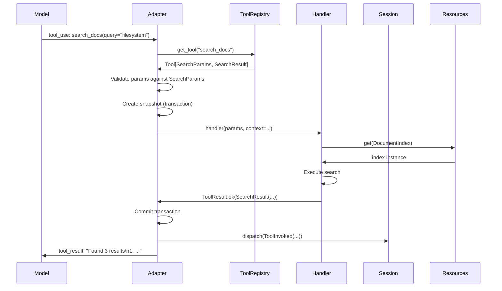
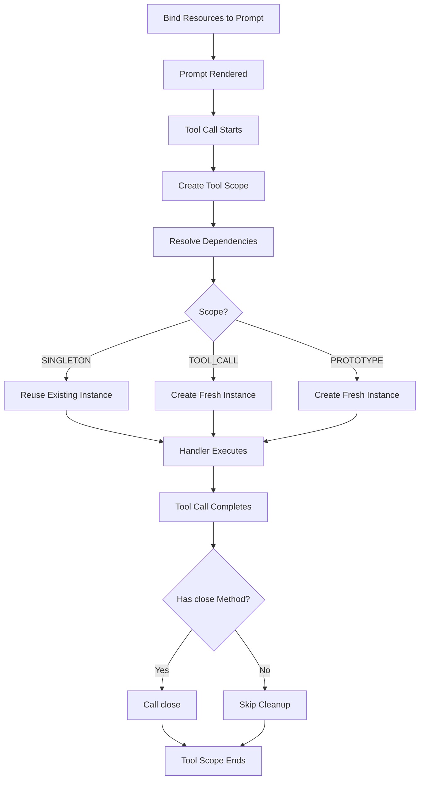
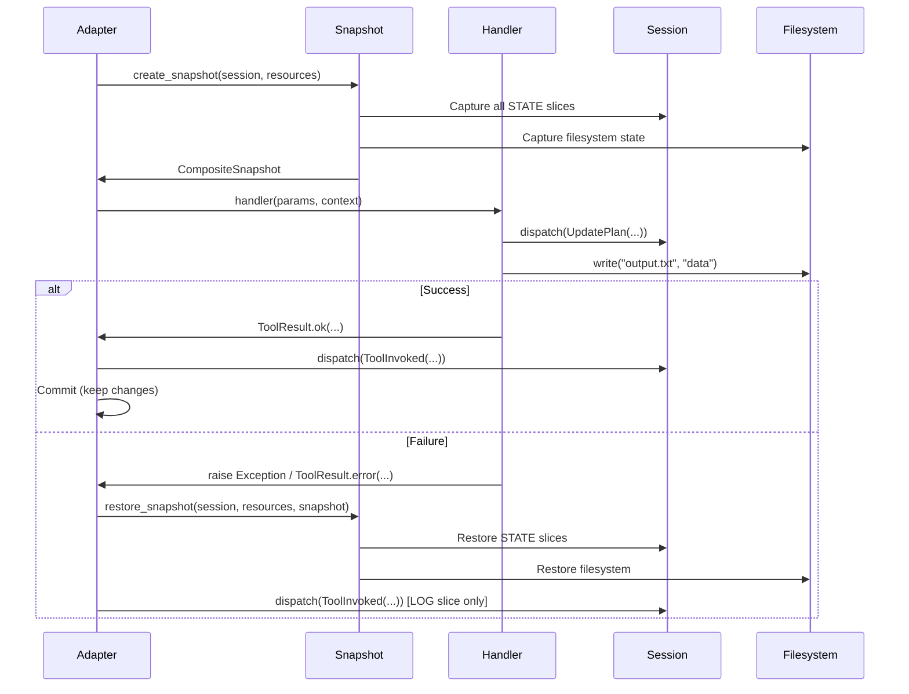
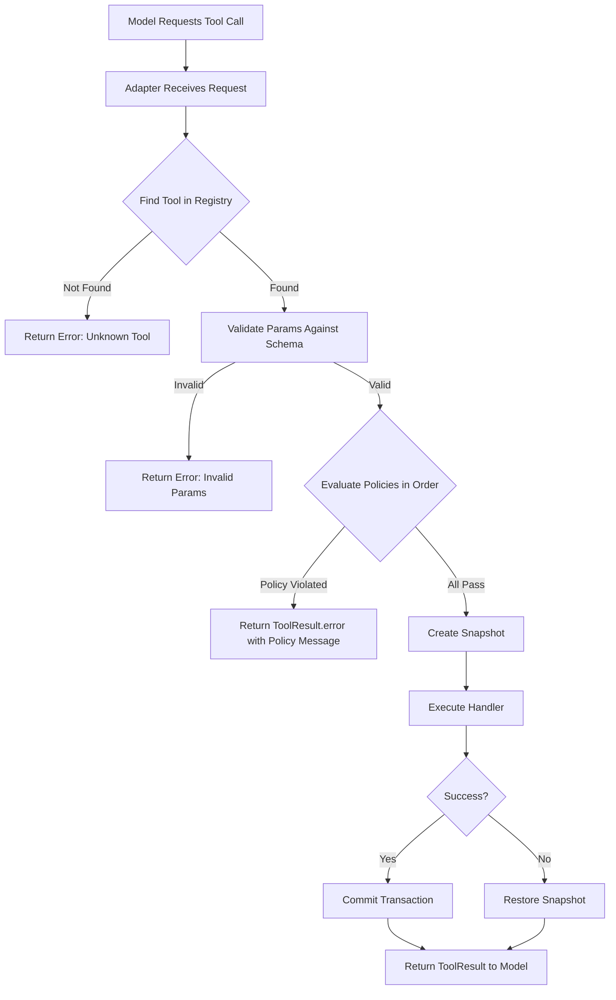

# Chapter 4: Tools

**Sandboxed, deterministic tool execution**

---

## Overview

In WINK, tools are the **only place where side effects happen**. Everything else—prompt rendering, state transitions, reducers—is pure and deterministic. This constraint is deliberate: when something goes wrong, you know exactly where to look.

The tool system provides:

- **Type-safe contracts** with validated parameters and structured results
- **Execution contexts** providing access to sessions, resources, and filesystems
- **Automatic transactions** that roll back state on failure
- **Declarative policies** that enforce cross-cutting constraints
- **Tool suites** that bundle guidance with capabilities

This chapter covers the complete tool lifecycle, from defining simple handlers to building transactional, policy-governed tool suites.

> **Canonical spec**: [specs/TOOLS.md](../specs/TOOLS.md)

---

## Table of Contents

1. [Tool Contracts](#tool-contracts)
2. [ToolContext and Resources](#toolcontext-and-resources)
3. [ToolResult Semantics](#toolresult-semantics)
4. [Tool Examples](#tool-examples)
5. [Tool Suites as Sections](#tool-suites-as-sections)
6. [Transactional Tool Execution](#transactional-tool-execution)
7. [Tool Policies](#tool-policies)
8. [Best Practices](#best-practices)

---

## Tool Contracts

A tool is defined by a **contract** consisting of:

- **Name**: `^[a-z0-9_-]{1,64}$` (validated at construction time)
- **Description**: Short model-facing explanation of what the tool does
- **Parameters type**: A dataclass type (or `None` for parameterless tools)
- **Result type**: A dataclass type (or `None` for tools with no structured output)
- **Handler**: `handler(params, *, context) -> ToolResult[result_type]`

### Basic Tool Definition

```python
from dataclasses import dataclass
from weakincentives.prompt import Tool, ToolContext, ToolResult

@dataclass(slots=True, frozen=True)
class SearchParams:
    """Parameters for searching documentation."""
    query: str
    limit: int = 10

@dataclass(slots=True, frozen=True)
class SearchResult:
    """Search results with matching documents."""
    matches: tuple[str, ...]
    total_count: int

    def render(self) -> str:
        """Format results for model consumption."""
        if not self.matches:
            return "No matches found."

        lines = [f"Found {self.total_count} total matches:"]
        for i, match in enumerate(self.matches, 1):
            lines.append(f"{i}. {match}")
        return "\n".join(lines)

def search_handler(
    params: SearchParams,
    *,
    context: ToolContext
) -> ToolResult[SearchResult]:
    """Search the documentation index."""
    # Access resources through context
    index = context.resources.get(DocumentIndex)

    # Perform the search
    matches = index.search(params.query, limit=params.limit)

    return ToolResult.ok(
        SearchResult(
            matches=tuple(matches),
            total_count=len(matches)
        ),
        message=f"Found {len(matches)} results"
    )

# Create the tool with type parameters
search_tool = Tool[SearchParams, SearchResult](
    name="search_docs",
    description="Search the documentation index for relevant content.",
    handler=search_handler,
)
```

### Why Type Parameters Matter

The type parameters `Tool[SearchParams, SearchResult]` tell WINK:

1. **How to serialize** parameters for the model's tool schema
2. **How to validate** parameters when the model makes a tool call
3. **What structure** to expect in the result for type checking
4. **How to render** the result for context (via the `render()` method)

Type mismatches are caught at construction time, not at runtime.

### Tool Execution Flow



---

## ToolContext and Resources

`ToolContext` provides tool handlers with access to execution-time state without polluting the handler signature with dozens of parameters.

### ToolContext Fields

```python
@dataclass(slots=True, frozen=True)
class ToolContext:
    """Immutable container exposing prompt execution state to handlers."""

    prompt: PromptProtocol
    """The prompt being executed"""

    rendered_prompt: RenderedPromptProtocol | None
    """The rendered prompt with all sections expanded"""

    adapter: ProviderAdapterProtocol
    """The adapter executing the tool (OpenAI, LiteLLM, Claude Agent SDK)"""

    session: SessionProtocol
    """The current session containing all state slices"""

    deadline: Deadline | None
    """Optional wall-clock deadline for terminating execution"""

    budget_tracker: BudgetTracker | None
    """Optional token budget tracker"""

    resources: PromptResources
    """Typed resource registry for dependency injection"""
```

### Resource Management

Resources are the backbone of WINK's dependency injection system. They provide:

- **Lazy construction** with dependency resolution
- **Scoped lifecycles** (singleton, tool-call, prototype)
- **Automatic cleanup** via lifecycle protocols
- **Type-safe access** through protocol types

### Resource Lifecycle



### Binding Resources to Prompts

There are two ways to bind resources: simple instances or lazy bindings with dependencies.

**Option 1: Pre-constructed instances**

```python
from weakincentives.prompt import Prompt
from myapp.http import HTTPClient

# Simple case: pass instances directly
http_client = HTTPClient(base_url="https://api.example.com")
prompt = Prompt(template).bind(
    params,
    resources={HTTPClient: http_client}
)

# Use with context manager for lifecycle
with prompt.resources:
    response = adapter.evaluate(prompt, session=session)
```

**Option 2: Lazy construction with dependencies**

```python
from weakincentives.resources import Binding, Scope

prompt = Prompt(template).bind(params, resources={
    # Config constructed first (no dependencies)
    Config: Binding(Config, lambda r: Config.from_env()),

    # HTTPClient depends on Config
    HTTPClient: Binding(
        HTTPClient,
        lambda r: HTTPClient(r.get(Config).url)
    ),

    # Tracer is fresh per tool call
    Tracer: Binding(
        Tracer,
        lambda r: Tracer(),
        scope=Scope.TOOL_CALL
    ),
})
```

### Resource Scopes

Scopes control instance lifetime:

| Scope | Lifetime | Use Case |
|-------|----------|----------|
| `SINGLETON` | One instance per session (default) | HTTP clients, database connections, config |
| `TOOL_CALL` | Fresh instance per tool invocation | Tracers, per-call metrics, transaction handles |
| `PROTOTYPE` | Fresh instance on every access | Stateful builders, mutable collectors |

### Using MainLoop (Recommended)

`MainLoop.execute()` handles resource binding and lifecycle automatically:

```python
from weakincentives.runtime import MainLoopConfig
from weakincentives.resources import Binding, Scope

# Configure resources at the loop level
config = MainLoopConfig(
    resources={
        Config: Binding(Config, lambda r: Config.from_env()),
        HTTPClient: Binding(
            HTTPClient,
            lambda r: HTTPClient(r.get(Config).url)
        ),
    }
)
loop = MyLoop(adapter=adapter, bus=bus, config=config)

# Resources bound automatically
response, session = loop.execute(request)

# Override per-request
response, session = loop.execute(
    request,
    resources={Tracer: tracer}
)
```

### Dependency Injection Example

```python
from weakincentives.resources import Binding, ResourceRegistry, Scope

# Define your dependencies
@dataclass(slots=True, frozen=True)
class Config:
    api_key: str
    base_url: str

    @staticmethod
    def from_env() -> Config:
        return Config(
            api_key=os.environ["API_KEY"],
            base_url=os.environ["BASE_URL"]
        )

class HTTPClient:
    def __init__(self, config: Config):
        self.base_url = config.base_url
        self.headers = {"Authorization": f"Bearer {config.api_key}"}

    def close(self) -> None:
        """Cleanup connections (called automatically)."""
        pass

class Tracer:
    def __init__(self):
        self.spans: list[str] = []

    def record(self, operation: str) -> None:
        self.spans.append(operation)

# Create registry with dependency graph
registry = ResourceRegistry.of(
    # Config has no dependencies
    Binding(Config, lambda r: Config.from_env()),

    # HTTPClient depends on Config
    Binding(HTTPClient, lambda r: HTTPClient(r.get(Config))),

    # Tracer is fresh per tool call
    Binding(Tracer, lambda r: Tracer(), scope=Scope.TOOL_CALL),
)

# Use with lifecycle management
with registry.open() as ctx:
    # Lazy resolution walks dependency graph
    http = ctx.get(HTTPClient)  # Also resolves Config

    # Tool-scoped resources
    with ctx.tool_scope() as tool_resolver:
        tracer = tool_resolver.get(Tracer)  # Fresh instance
        tracer.record("search_started")

    # Tracer cleaned up here
# HTTPClient.close() called automatically here
```

### Lifecycle Protocols

Resources can implement lifecycle protocols for automatic management:

```python
from typing import Protocol

class Closeable(Protocol):
    """Resource that needs explicit cleanup."""
    def close(self) -> None: ...

class PostConstruct(Protocol):
    """Resource that needs initialization after construction."""
    def post_construct(self) -> None: ...

# Example resource using both protocols
class DatabaseConnection:
    def __init__(self, config: Config):
        self.config = config
        self.conn = None  # type: ignore

    def post_construct(self) -> None:
        """Called automatically after construction."""
        self.conn = connect(self.config.db_url)

    def close(self) -> None:
        """Called automatically when context ends."""
        if self.conn:
            self.conn.close()
```

### Resource Management in Tool Handlers

Tool handlers access resources through the context:

```python
def handler(params: MyParams, *, context: ToolContext) -> ToolResult[MyResult]:
    # Get resources from context
    http = context.resources.get(HTTPClient)
    tracer = context.resources.get(Tracer)
    fs = context.resources.get(Filesystem)

    # Use resources
    tracer.record(f"fetching {params.url}")
    response = http.get(params.url)

    # Filesystem is the most common resource for workspace agents
    fs.write("output.json", response.text)

    return ToolResult.ok(
        MyResult(status="success"),
        message="Fetched and saved"
    )
```

### Filesystem Resource

For workspace agents, the most common resource is a `Filesystem` implementation. Many contributed tool suites install one automatically:

```python
from weakincentives.contrib.tools import VfsToolsSection
from weakincentives.filesystem import Filesystem

# VFS installs a Filesystem resource automatically
vfs = VfsToolsSection(session=session, config=vfs_config)

# Tools in this section can access it via context
def read_file_handler(
    params: ReadFileParams,
    *,
    context: ToolContext
) -> ToolResult[ReadFileResult]:
    fs = context.resources.get(Filesystem)
    content = fs.read(params.path)
    return ToolResult.ok(ReadFileResult(content=content))
```

See [Chapter 12: Workspace Tools](12-workspace-tools.md) for details on VFS, Podman, and other workspace abstractions.

---

## ToolResult Semantics

Tool handlers return `ToolResult` to communicate both **what happened** (the structured value) and **what to tell the model** (the message).

### ToolResult Structure

```python
@dataclass(slots=True)
class ToolResult[ResultValueT]:
    """Structured response emitted by a tool handler."""

    message: str
    """Human-readable status for the model."""

    value: ResultValueT | None
    """Typed payload (dataclass, mapping, sequence, string, or None)."""

    success: bool = True
    """Whether the operation succeeded (affects adapter behavior)."""

    exclude_value_from_context: bool = False
    """Hide large payloads from model context while preserving in session."""
```

### Convenience Constructors

```python
# Success with typed value (most common)
ToolResult.ok(
    SearchResult(matches=("doc1", "doc2"), total_count=2),
    message="Found 2 results"
)

# Failure with no value
ToolResult.error("File not found: config.json")

# Full form (when exclude_value_from_context is needed)
ToolResult(
    message="Read 1.2MB from large_file.csv",
    value=FileContents(content=large_string),
    success=True,
    exclude_value_from_context=True,  # Hide from model, keep in session
)
```

### Rendering Results

WINK uses the `render()` method to convert structured values into text for the model:

1. **If value is a dataclass with `render()`**: Use that method
2. **If value is a dataclass without `render()`**: Serialize to JSON (with a warning)
3. **If value is a mapping**: Serialize to JSON
4. **If value is a sequence**: Format as newline-separated items
5. **If value is a string**: Use as-is
6. **If value is None**: Return empty string

**Example with custom rendering:**

```python
@dataclass(slots=True, frozen=True)
class FileSearchResult:
    matches: tuple[str, ...]
    total_count: int
    truncated: bool

    def render(self) -> str:
        """Control exactly what the model sees."""
        if not self.matches:
            return "No matching files found."

        lines = [f"Found {len(self.matches)} files"]
        if self.truncated:
            lines.append(f"(showing first {len(self.matches)} of {self.total_count} total)")

        for path in self.matches:
            lines.append(f"  - {path}")

        return "\n".join(lines)
```

### Success vs. Failure

The `success` field affects adapter behavior:

- **`success=True`**: Adapter treats this as a successful tool call
- **`success=False`**: Adapter may retry or report an error to the model

**When to use `success=False`:**

- File not found
- Invalid parameters (that passed schema validation but failed business logic)
- External API returned an error
- Resource exhaustion (quota exceeded, timeout, etc.)

**When to use `success=True` with an informative message:**

- Empty search results (not an error, just no matches)
- Partial success (some items processed, others skipped)
- No-op operations (file already exists, task already complete)

### Exception Handling

Exceptions raised by handlers are automatically caught and converted to `ToolResult.error()`:

```python
def risky_handler(params: MyParams, *, context: ToolContext) -> ToolResult[MyResult]:
    # This exception will be caught
    if not params.path.startswith("/safe/"):
        raise ValueError("Path must start with /safe/")

    # This will be converted to ToolResult.error("Path must start with /safe/")
    # ... and the transaction will be rolled back
```

**Safety exceptions** that propagate unchanged:

- `KeyboardInterrupt`
- `SystemExit`
- `asyncio.CancelledError`
- `DeadlineExceededError` (from WINK's deadline enforcement)

All other exceptions are caught, logged, and converted to failures.

### Excluding Large Values from Context

The `exclude_value_from_context` flag is useful for tools that return large payloads:

```python
def read_large_file_handler(
    params: ReadFileParams,
    *,
    context: ToolContext
) -> ToolResult[FileContents]:
    fs = context.resources.get(Filesystem)
    content = fs.read(params.path)

    # Value is recorded in session for debugging
    # But model only sees the summary message
    return ToolResult(
        message=f"Read {len(content)} bytes from {params.path}",
        value=FileContents(content=content),
        success=True,
        exclude_value_from_context=True,  # Don't send full content to model
    )
```

This is critical for cost control: reading a 10MB file should not consume 10MB of context tokens.

---

## Tool Examples

Tool examples improve model performance and debugging by showing representative invocations.

### Defining Examples

```python
from weakincentives.prompt import ToolExample

now_tool = Tool[NowParams, NowResult](
    name="now",
    description="Return current UTC time in ISO 8601 format.",
    handler=now_handler,
    examples=(
        ToolExample(
            description="Get current UTC time",
            input=NowParams(tz="UTC"),
            output=NowResult(iso="2025-01-01T00:00:00+00:00"),
        ),
        ToolExample(
            description="Get time in specific timezone",
            input=NowParams(tz="America/New_York"),
            output=NowResult(iso="2025-01-01T05:00:00-05:00"),
        ),
    ),
)
```

### Why Examples Matter

**Without examples**, models often:

- Use the wrong parameter name (`query` vs. `q` vs. `search_term`)
- Pass the wrong type (`"10"` string instead of `10` integer)
- Misunderstand format requirements (ISO 8601 vs. Unix timestamp)
- Skip optional parameters that significantly affect results

**With examples**, models:

- See the exact format you expect
- Learn parameter naming conventions
- Understand edge cases (empty results, errors, etc.)
- Improve first-call success rates dramatically

**Rule of thumb**: If you've ever seen a model "almost" call your tool correctly, add an example.

### Examples in Tool Schemas

Adapters may include examples in the tool schema sent to the model (depending on provider support):

```json
{
  "name": "now",
  "description": "Return current UTC time in ISO 8601 format.",
  "parameters": {
    "type": "object",
    "properties": {
      "tz": {
        "type": "string",
        "description": "Timezone name (e.g., 'UTC', 'America/New_York')"
      }
    }
  },
  "examples": [
    {
      "description": "Get current UTC time",
      "input": {"tz": "UTC"},
      "output": {"iso": "2025-01-01T00:00:00+00:00"}
    }
  ]
}
```

---

## Tool Suites as Sections

In WINK, "a tool suite" is usually a **section** that bundles:

1. **Instructions** explaining when and how to use the tools
2. **Tool contracts** (the actual tool definitions)
3. **Session slices** (if the tools need persistent state)

This co-location is intentional: **tools without guidance are unreliable, and guidance without tools is toothless**.

### Why Bundle Tools with Sections?

Consider a `deploy` tool. Without context:

- When should the model call it?
- What must happen first (tests? builds?)?
- What parameters are required vs. optional?
- What does success look like?

With a section:

```python
from weakincentives.prompt import MarkdownSection, Tool

deployment_section = MarkdownSection(
    title="Deployment",
    key="deployment",
    template="""
# Deployment Instructions

You have access to deployment tools. Follow this workflow:

1. **Always run tests first** (`run_tests` tool)
2. **Build artifacts** (`build` tool)
3. **Deploy to staging** (`deploy` tool with `environment="staging"`)
4. **Verify staging** (manual check or `health_check` tool)
5. **Deploy to production** (`deploy` tool with `environment="production"`)

Never deploy without testing. Never deploy directly to production.
    """.strip(),
    tools=(run_tests_tool, build_tool, deploy_tool, health_check_tool),
)
```

Now the model has both **capability** (the tools) and **policy** (the instructions).

### Contributed Tool Suites

WINK provides several batteries-included tool suites in `weakincentives.contrib.tools`:

| Suite | Purpose | Session Slices |
|-------|---------|----------------|
| `PlanningToolsSection` | Multi-step task planning | `Plan` |
| `VfsToolsSection` | In-memory filesystem | None (uses resource) |
| `PodmanSandboxSection` | Containerized execution | None (uses resource) |
| `AstevalSection` | Safe Python eval | None |
| `WorkspaceDigestSection` | Progressive file discovery | `WorkspaceDigest` |

See [Chapter 12: Workspace Tools](12-workspace-tools.md) for details.

### Example: VFS Tool Suite

```python
from weakincentives.contrib.tools import VfsToolsSection, VfsConfig

# Create the section with configuration
vfs = VfsToolsSection(
    session=session,
    config=VfsConfig(root="/tmp/workspace"),
)

# Add to prompt
prompt = Prompt(template).bind(params, sections=[vfs])

# Tools in the section automatically get Filesystem resource
# read_file, write_file, list_directory, etc.
```

The section provides:

- **Instructions**: "Use these tools to read and write files..."
- **Tools**: `read_file`, `write_file`, `list_directory`, `delete_file`, etc.
- **Resource**: `Filesystem` implementation (in-memory VFS)
- **Policies**: `ReadBeforeWritePolicy` (prevents accidental overwrites)

---

## Transactional Tool Execution

One of the hardest problems in building agents is handling partial failures. When a tool call fails halfway through, you're left with:

- Corrupted session state
- Inconsistent filesystem changes
- No clear way to recover

WINK solves this with **transactional tool execution**. Every tool call is wrapped in a transaction that automatically rolls back state on failure.

### How Transactions Work



### Transaction Lifecycle

1. **Snapshot**: Before the tool runs, WINK captures:
   - Session slices marked as `STATE` (working state like plans, visibility)
   - Filesystem state (VFS memory or git commits for disk-backed)

2. **Execute**: The tool handler runs with full access to mutable state

3. **Commit or rollback**:
   - **Success**: Changes are kept, `ToolInvoked` event recorded
   - **Failure**: Snapshot restored, `ToolInvoked` event recorded (in LOG slice)

### What Gets Rolled Back

| State Type | Rollback Behavior |
|------------|-------------------|
| `STATE` slices | Restored to pre-call snapshot |
| `LOG` slices | Never rolled back (historical record) |
| Filesystem (VFS) | Restored to pre-call snapshot |
| Filesystem (disk) | Restored via git reset (if snapshotable) |
| External APIs | **Not rolled back** (use idempotency) |

### Example: Automatic Rollback

```python
def risky_handler(params: MyParams, *, context: ToolContext) -> ToolResult[MyResult]:
    fs = context.resources.get(Filesystem)
    session = context.session

    # Update session state
    session.dispatch(UpdatePlan(status="in-progress"))

    # Write to filesystem
    fs.write("output.txt", "partial results")

    # Simulate failure
    if params.force_error:
        raise ValueError("Simulated failure")

    return ToolResult.ok(MyResult(status="done"))

# When called with force_error=True:
# - UpdatePlan event is rolled back (plan status reverts)
# - output.txt write is undone
# - Model sees clean error message
# - No inconsistent state to debug
```

### Why This Matters

**Without transactions:**

```python
# Traditional approach - manual cleanup required
def traditional_handler(params, context):
    original_plan = context.session[Plan].latest()

    try:
        context.session.dispatch(UpdatePlan(status="in-progress"))
        fs.write("output.txt", data)
        result = external_api_call()
        return ToolResult.ok(result)
    except Exception as e:
        # Manual rollback - easy to get wrong
        context.session.dispatch(UpdatePlan(status=original_plan.status))
        fs.delete("output.txt")  # What if this also fails?
        return ToolResult.error(str(e))
```

**With transactions:**

```python
# WINK approach - automatic cleanup
def wink_handler(params, context):
    context.session.dispatch(UpdatePlan(status="in-progress"))
    fs.write("output.txt", data)
    result = external_api_call()
    return ToolResult.ok(result)
    # Exceptions automatically trigger rollback
```

### Benefits

- **Simpler error handling**: No defensive rollback code needed
- **Consistent state**: Failed operations never leave inconsistent state
- **Easier debugging**: State always matches the last successful operation
- **Adapter parity**: OpenAI, LiteLLM, and Claude Agent SDK use same semantics

### Manual Transaction Control

For advanced use cases, use the transaction API directly:

```python
from weakincentives.runtime import (
    tool_transaction,
    create_snapshot,
    restore_snapshot,
    PendingToolTracker,
)

# Option 1: Context manager (auto-rollback on exception)
with tool_transaction(session, resources, tag="my_operation") as snapshot:
    do_work()
    if not should_commit():
        restore_snapshot(session, resources, snapshot)  # Manual rollback

# Option 2: Manual snapshot/restore
snapshot = create_snapshot(session, resources, tag="checkpoint")
try:
    do_work()
except Exception:
    restore_snapshot(session, resources, snapshot)
    raise

# Option 3: Hook-based tracking (for Claude Agent SDK)
tracker = PendingToolTracker(session=session, resources=resources)
tracker.begin_tool_execution(tool_use_id="abc", tool_name="write_file")
# ... native tool executes ...
tracker.end_tool_execution(tool_use_id="abc", success=False)  # Auto-rollback
```

See [Chapter 5: Sessions](05-sessions.md) for more on snapshots and transactions.

---

## Tool Policies

Tool policies provide **declarative constraints** that govern when tools can be invoked. Rather than embedding validation logic in each handler, policies express cross-cutting concerns as composable rules.

### Why Policies Exist

Without constraints, models can call tools in problematic orders:

- Deploying code that was never tested
- Overwriting files they haven't read
- Skipping required validation steps
- Running expensive operations before cheap checks

Policies catch these issues **before** the tool executes.

### Policy Enforcement Flow



### Built-in Policies

#### SequentialDependencyPolicy

Requires certain tools to be called before others:

```python
from weakincentives.prompt import SequentialDependencyPolicy

# Require 'test' and 'build' before 'deploy'
deploy_policy = SequentialDependencyPolicy(
    dependencies={
        "deploy": frozenset({"test", "build"}),
        "release": frozenset({"deploy"}),  # Can chain
    }
)
```

The policy checks the session's `ToolInvoked` events. If `deploy` is called before both `test` and `build` have completed successfully, the call is rejected:

```
Error: Cannot call 'deploy' - missing required tools: test, build
Call these tools first, then retry deploy.
```

#### ReadBeforeWritePolicy

Requires reading a file before overwriting it (new files are allowed):

```python
from weakincentives.prompt import ReadBeforeWritePolicy

read_first = ReadBeforeWritePolicy()
```

The policy tracks `read_file` calls and allows writes only to:

- Paths that were previously read in this session
- New files (paths that don't exist yet)

**Example flow:**

```python
# This fails - didn't read config.json first
write_file(path="config.json", content="new content")
# Error: Cannot write to config.json without reading it first

# This works - read before write
read_file(path="config.json")
write_file(path="config.json", content="updated content")
# Success

# This works - new file
write_file(path="new_file.txt", content="content")
# Success
```

### Attaching Policies to Sections

Policies are attached at the section level:

```python
from weakincentives.prompt import MarkdownSection

section = MarkdownSection(
    title="Deployment",
    key="deployment",
    template="Deploy the application after testing.",
    tools=(deploy_tool, test_tool, build_tool),
    policies=(deploy_policy,),  # Attach policies here
)
```

### Default Policies on Contrib Sections

Some contributed sections apply policies by default:

```python
from weakincentives.contrib.tools import VfsToolsSection

# ReadBeforeWritePolicy is applied automatically
vfs = VfsToolsSection(session=session, config=vfs_config)
```

This prevents accidental overwrites without reading existing content first.

### Custom Policies

Implement the `ToolPolicy` protocol:

```python
from typing import Protocol
from weakincentives.prompt import ToolContext

class ToolPolicy(Protocol):
    """Protocol for tool execution policies."""

    def check(
        self,
        tool_name: str,
        params: object,
        context: ToolContext
    ) -> str | None:
        """
        Check if tool call is allowed.

        Returns:
            None if allowed, error message string if rejected.
        """
        ...

# Example: Quota policy
class QuotaPolicy:
    def __init__(self, max_calls: int):
        self.max_calls = max_calls

    def check(
        self,
        tool_name: str,
        params: object,
        context: ToolContext
    ) -> str | None:
        session = context.session
        calls = len(list(session[ToolInvoked].all()))

        if calls >= self.max_calls:
            return f"Quota exceeded: {calls}/{self.max_calls} calls used"

        return None  # Allow
```

### Policy Composition

Policies are evaluated in order; the first violation stops execution:

```python
section = MarkdownSection(
    title="Production Ops",
    key="ops",
    template="...",
    tools=(deploy_tool,),
    policies=(
        quota_policy,           # Check quota first
        deploy_policy,          # Then check dependencies
        read_before_write,      # Then check file safety
    ),
)
```

### Key Behaviors

- Policies are evaluated **before** the handler executes
- First policy violation returns `ToolResult.error()` immediately
- `SequentialDependencyPolicy` checks `ToolInvoked` events for completions
- `ReadBeforeWritePolicy` maintains a set of "safe" paths per session
- Custom policies can access session state via `context.session`
- Policies are composable and order-dependent

See [specs/TOOL_POLICIES.md](../specs/TOOL_POLICIES.md) for full details.

---

## Best Practices

### 1. Always Implement `render()` on Result Types

```python
@dataclass(slots=True, frozen=True)
class MyResult:
    data: dict[str, object]
    count: int

    def render(self) -> str:
        """Control what the model sees."""
        return f"Processed {self.count} items successfully"
```

Without `render()`, WINK will serialize the entire dataclass to JSON, which:

- Wastes tokens
- May expose internal structure
- Is harder to read

### 2. Use `exclude_value_from_context` for Large Payloads

```python
def read_large_file_handler(params, *, context):
    content = fs.read(params.path)

    return ToolResult(
        message=f"Read {len(content)} bytes from {params.path}",
        value=FileContents(content=content),
        exclude_value_from_context=True,  # Save tokens
    )
```

### 3. Prefer Declarative Policies Over Imperative Checks

**Bad:**

```python
def deploy_handler(params, *, context):
    # Manual validation in every handler
    tools = context.session[ToolInvoked].all()
    if not any(t.tool_name == "test" for t in tools):
        return ToolResult.error("Must run tests first")

    # ... actual logic
```

**Good:**

```python nocheck
deploy_policy = SequentialDependencyPolicy(
    dependencies={"deploy": frozenset({"test"})}
)

section = MarkdownSection(
    ...,
    policies=(deploy_policy,),
)

def deploy_handler(params, *, context):
    # Policy already checked - focus on logic
    # ... actual logic
```

### 4. Use Tool Examples for Complex Parameters

If your tool has ever been called incorrectly by a model, add examples:

```python
tool = Tool[SearchParams, SearchResult](
    name="search",
    description="...",
    handler=handler,
    examples=(
        ToolExample(
            description="Basic search",
            input=SearchParams(query="filesystem", limit=10),
            output=SearchResult(matches=("doc1", "doc2"), total_count=2),
        ),
    ),
)
```

### 5. Keep Tool Names Short and Descriptive

- **Good**: `read_file`, `run_tests`, `deploy`
- **Bad**: `read_file_from_filesystem_with_encoding`, `execute_test_suite_runner`

Model context is precious. Names like `read_file` are self-documenting and cheap.

### 6. Bundle Tools with Guidance in Sections

Don't scatter tools across a prompt. Bundle them with instructions:

```python
# Good
section = MarkdownSection(
    title="File Operations",
    template="Use these tools to read and write files. Always read before writing.",
    tools=(read_file, write_file, list_directory),
    policies=(ReadBeforeWritePolicy(),),
)

# Bad - tools without context
prompt.bind(params, extra_tools=[read_file, write_file, list_directory])
```

### 7. Use MainLoop for Resource Management

Don't manage resource lifecycles manually:

```python
# Good
loop = MyLoop(
    adapter=adapter,
    bus=bus,
    config=MainLoopConfig(resources={HTTPClient: http_client})
)
response, session = loop.execute(request)

# Bad - manual lifecycle
with prompt.resources:
    response = adapter.evaluate(prompt, session)
```

### 8. Trust Transactions, Don't Reinvent Rollback

Transactions are automatic. Don't write manual cleanup:

```python
# Good - let transactions handle it
def handler(params, *, context):
    context.session.dispatch(UpdateState(...))
    fs.write("output.txt", data)
    return ToolResult.ok(...)

# Bad - manual rollback
def handler(params, *, context):
    original = context.session[State].latest()
    try:
        context.session.dispatch(UpdateState(...))
        fs.write("output.txt", data)
        return ToolResult.ok(...)
    except Exception:
        context.session.dispatch(UpdateState(original))
        fs.delete("output.txt")
        raise
```

### 9. Use Scopes Appropriately

| Resource Type | Recommended Scope |
|---------------|-------------------|
| Config | `SINGLETON` (default) |
| HTTP clients | `SINGLETON` |
| Database connections | `SINGLETON` |
| Tracers | `TOOL_CALL` |
| Per-call metrics | `TOOL_CALL` |
| Stateful builders | `PROTOTYPE` |

### 10. Test Tools in Isolation

Tools are pure functions (modulo side effects). Test them directly:

```python
def test_search_handler():
    params = SearchParams(query="filesystem", limit=5)
    context = ToolContext(
        session=session,
        resources=registry,
        # ... other fields
    )

    result = search_handler(params, context=context)

    assert result.success
    assert result.value.total_count == 2
```

No need for full adapter integration in unit tests.

---

## Summary

The WINK tool system provides:

1. **Type-safe contracts** that validate parameters and structure results
2. **Execution contexts** providing access to sessions, resources, and filesystems
3. **Resource management** with dependency injection, scoped lifecycles, and automatic cleanup
4. **Automatic transactions** that roll back state on failure
5. **Declarative policies** that enforce cross-cutting constraints
6. **Tool suites** that bundle guidance with capabilities

Together, these features make tools the **only place where side effects happen**—and the only place you need to look when debugging agent behavior.

**Next steps:**

- [Chapter 5: Sessions](05-sessions.md) - Event-driven state management
- [Chapter 12: Workspace Tools](12-workspace-tools.md) - Planning, VFS, sandboxing, and more
- [specs/TOOLS.md](../specs/TOOLS.md) - Complete tool specification
- [specs/TOOL_POLICIES.md](../specs/TOOL_POLICIES.md) - Policy design and implementation
