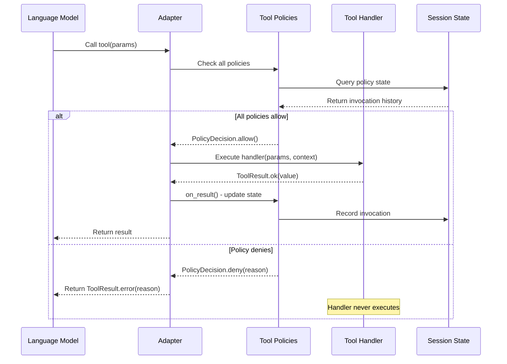
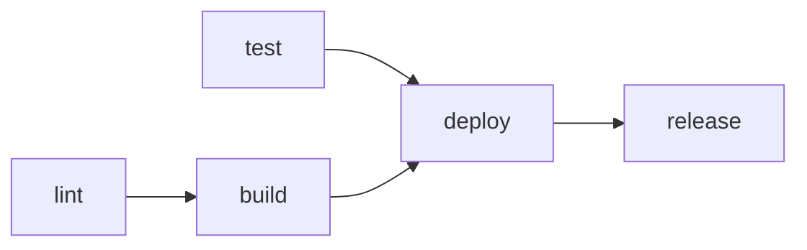
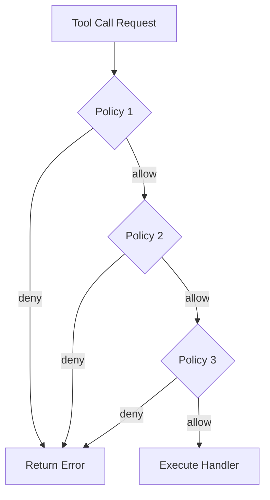

# Chapter 4.5: Tool Policies

> **Canonical Reference**: See [specs/TOOL_POLICIES.md](../specs/TOOL_POLICIES.md) for the complete specification.

## Introduction

Tool policies are **declarative constraints** that govern when and how tools can be invoked. Rather than embedding validation logic inside each tool handler, policies express cross-cutting concerns as composable, reusable rules that enforce ordering dependencies, safety constraints, and business logic.

### Why Policies Matter

Without policies, LLMs can invoke tools in problematic sequences:

- **Deploy code that was never tested** - bypassing quality gates
- **Overwrite files without reading them first** - losing important context
- **Skip required validation steps** - violating compliance requirements
- **Run expensive operations before cheap checks** - wasting resources
- **Call privileged operations without authorization** - security vulnerabilities

Policies catch these issues **before** the tool executes, returning clear error messages that guide the model toward correct behavior.

### Philosophy: Weak Incentives Through Structure

Policies embody WINK's "weak incentives" philosophy:

- **Guide, don't block**: Error messages explain *what* to do, not just *what failed*
- **Declarative over imperative**: Express intent as data structures, not control flow
- **Composable**: Multiple policies can govern the same tool
- **Fail-closed**: Denied calls return errors without side effects
- **Session-aware**: Policy state lives in the session, enabling snapshot/restore

This chapter teaches you how to leverage policies to build safer, more predictable agents.

---

## Mental Model

Think of policies as **runtime guards** that sit between the LLM's tool requests and your handler code:



**Key Insight**: Policies evaluate *before* handlers execute. State updates happen *after* successful execution. This ensures atomicity and enables transactional rollback.

---

## The ToolPolicy Protocol

All policies implement the `ToolPolicy` protocol:

```python
from weakincentives.prompt import ToolPolicy, PolicyDecision, ToolContext

class ToolPolicy(Protocol):
    """Sequential dependency constraint on tool invocations."""

    @property
    def name(self) -> str:
        """Unique identifier for this policy.

        Used to namespace state in the session.
        """
        ...

    def check(
        self,
        tool: Tool[Any, Any],
        params: SupportsDataclass | None,
        *,
        context: ToolContext,
    ) -> PolicyDecision:
        """Evaluate whether the tool call should proceed.

        Args:
            tool: The tool being invoked
            params: Parsed tool parameters (or None for parameterless tools)
            context: Access to session, prompt, resources, filesystem

        Returns:
            PolicyDecision.allow() if permitted, PolicyDecision.deny(reason) otherwise
        """
        ...

    def on_result(
        self,
        tool: Tool[Any, Any],
        params: SupportsDataclass | None,
        result: ToolResult[Any],
        *,
        context: ToolContext,
    ) -> None:
        """Update session state after successful execution.

        Called only if result.success is True. Use this to record that
        a tool was invoked, enabling future checks to see the history.

        Args:
            tool: The tool that was invoked
            params: Parameters it was called with
            result: The successful result
            context: Session context for state updates
        """
        ...
```

### PolicyDecision

Policies return a `PolicyDecision`:

```python
from dataclasses import dataclass

@dataclass(slots=True, frozen=True)
class PolicyDecision:
    """Result of a policy check."""

    allowed: bool
    reason: str | None = None

    @classmethod
    def allow(cls) -> PolicyDecision:
        """Permit the tool call."""
        return cls(allowed=True)

    @classmethod
    def deny(cls, reason: str) -> PolicyDecision:
        """Reject with an explanation."""
        return cls(allowed=False, reason=reason)
```

**Best Practice**: Always provide a clear, actionable `reason` when denying. The model sees this message and adjusts its strategy.

### PolicyState (Session Slice)

Policies store state in the `PolicyState` session slice:

```python
from weakincentives.dataclasses import FrozenDataclass

@FrozenDataclass()
class PolicyState:
    """Tracks which tools/keys have been invoked for a policy."""

    policy_name: str  # Matches policy.name
    invoked_tools: frozenset[str] = frozenset()  # Tool names
    invoked_keys: frozenset[tuple[str, str]] = frozenset()  # (tool, key) pairs
```

- **`invoked_tools`**: Records tool names (for unconditional dependencies)
- **`invoked_keys`**: Records (tool, parameter_value) pairs (for keyed dependencies)

Policies read and write this slice via `context.session[PolicyState]`.

---

## Built-in Policies

WINK provides two essential policies out of the box.

### SequentialDependencyPolicy

**Purpose**: Enforce tool invocation order (e.g., test before deploy).

```python
from weakincentives.prompt import SequentialDependencyPolicy

policy = SequentialDependencyPolicy(
    dependencies={
        "deploy": frozenset({"test", "build"}),  # deploy requires test AND build
        "build": frozenset({"lint"}),            # build requires lint
        "release": frozenset({"deploy"}),        # release requires deploy
    }
)
```

**Behavior**:



- Calling `deploy` before both `test` and `build` → **DENIED**
- Calling `build` before `lint` → **DENIED**
- Calling tools in order (`lint → build → test → deploy`) → **ALLOWED**

**Error Message Example**:

```
Tool 'deploy' requires: build, test
Call these tools first, then retry deploy.
```

**Implementation Sketch**:

```python
def check(self, tool, params, *, context):
    required = self.dependencies.get(tool.name, frozenset())
    if not required:
        return PolicyDecision.allow()

    state = context.session[PolicyState].latest()
    invoked = state.invoked_tools if state else frozenset()
    missing = required - invoked

    if missing:
        return PolicyDecision.deny(
            f"Tool '{tool.name}' requires: {', '.join(sorted(missing))}\n"
            f"Call these tools first, then retry {tool.name}."
        )
    return PolicyDecision.allow()

def on_result(self, tool, params, result, *, context):
    if not result.success:
        return  # Only record successful calls

    state = context.session[PolicyState].latest()
    if state is None:
        state = PolicyState(policy_name=self.name)

    new_state = PolicyState(
        policy_name=self.name,
        invoked_tools=state.invoked_tools | {tool.name},
        invoked_keys=state.invoked_keys,
    )
    context.session[PolicyState].seed(new_state)
```

### ReadBeforeWritePolicy

**Purpose**: Require reading a file before overwriting it (prevents blind overwrites).

```python
from weakincentives.prompt import ReadBeforeWritePolicy

policy = ReadBeforeWritePolicy(
    read_tools=frozenset({"read_file"}),  # Tools that count as "reading"
    write_tools=frozenset({"write_file", "edit_file"}),  # Tools that write
)
```

**Behavior**:

```python
# Attempt 1: write without reading
write_file(path="config.yaml", content="new: value")
# → DENIED: "File 'config.yaml' must be read before overwriting."

# Attempt 2: read first
read_file(path="config.yaml")  # OK - records path
# → Records ("read_file", "config.yaml") in PolicyState.invoked_keys

# Attempt 3: now write
write_file(path="config.yaml", content="new: value")
# → ALLOWED (path was read)

# Attempt 4: create new file
write_file(path="new_file.txt", content="hello")
# → ALLOWED (file doesn't exist yet)
```

**Key Features**:

- **Keyed by file path**: Each file is tracked independently
- **New files allowed**: Only *existing* files require reading first
- **Filesystem-aware**: Checks `context.filesystem.exists()` to determine if file is new

**Implementation Highlights**:

```python
def check(self, tool, params, *, context):
    if tool.name not in self.write_tools:
        return PolicyDecision.allow()  # Not a write tool

    path = _extract_path(params)  # Get path from params.path or params.file_path
    if path is None:
        return PolicyDecision.allow()  # No path specified

    fs = context.filesystem
    if fs is None or not fs.exists(path):
        return PolicyDecision.allow()  # New file - OK to create

    # Existing file - check if read
    state = context.session[PolicyState].latest()
    read_paths = {k for t, k in (state.invoked_keys if state else set())
                  if t in self.read_tools}

    if path not in read_paths:
        return PolicyDecision.deny(
            f"File '{path}' must be read before overwriting.\n"
            f"Use read_file(path='{path}') first."
        )
    return PolicyDecision.allow()

def on_result(self, tool, params, result, *, context):
    if not result.success or tool.name not in self.read_tools:
        return  # Only record successful reads

    path = _extract_path(params)
    if path is None:
        return

    state = context.session[PolicyState].latest()
    if state is None:
        state = PolicyState(policy_name=self.name)

    new_state = PolicyState(
        policy_name=self.name,
        invoked_tools=state.invoked_tools,
        invoked_keys=state.invoked_keys | {(tool.name, path)},
    )
    context.session[PolicyState].seed(new_state)
```

---

## Creating Custom Policies: Step-by-Step

Let's build a custom policy from scratch: **`BudgetCheckPolicy`** that requires running a cost estimate before expensive operations.

### Step 1: Define Requirements

**Goal**: Prevent running expensive tools (e.g., `train_model`, `run_simulation`) without first checking the cost estimate.

**Rules**:
- `estimate_cost` must be called before any expensive tool
- Once estimated, expensive tools are allowed for the rest of the session

### Step 2: Implement the Policy Class

```python
from dataclasses import dataclass
from weakincentives.prompt import ToolPolicy, PolicyDecision, ToolContext
from weakincentives.runtime.session import PolicyState

@dataclass(frozen=True)
class BudgetCheckPolicy:
    """Require cost estimation before expensive operations."""

    expensive_tools: frozenset[str] = frozenset({
        "train_model",
        "run_simulation",
        "process_dataset",
    })
    estimate_tool: str = "estimate_cost"

    @property
    def name(self) -> str:
        return "budget_check"

    def check(
        self,
        tool: Tool[Any, Any],
        params: SupportsDataclass | None,
        *,
        context: ToolContext,
    ) -> PolicyDecision:
        # Non-expensive tools always allowed
        if tool.name not in self.expensive_tools:
            return PolicyDecision.allow()

        # Check if cost was estimated
        state = context.session[PolicyState].latest()
        invoked = state.invoked_tools if state else frozenset()

        if self.estimate_tool not in invoked:
            return PolicyDecision.deny(
                f"Expensive operation '{tool.name}' requires cost estimation.\n"
                f"Run '{self.estimate_tool}' first to check the budget."
            )

        return PolicyDecision.allow()

    def on_result(
        self,
        tool: Tool[Any, Any],
        params: SupportsDataclass | None,
        result: ToolResult[Any],
        *,
        context: ToolContext,
    ) -> None:
        if not result.success:
            return

        # Record estimate_tool invocation
        if tool.name == self.estimate_tool:
            state = context.session[PolicyState].latest()
            if state is None:
                state = PolicyState(policy_name=self.name)

            new_state = PolicyState(
                policy_name=self.name,
                invoked_tools=state.invoked_tools | {tool.name},
                invoked_keys=state.invoked_keys,
            )
            context.session[PolicyState].seed(new_state)
```

### Step 3: Wire Into Prompt

```python
from weakincentives import PromptTemplate, MarkdownSection

template = PromptTemplate(
    ns="ml-agent",
    key="trainer",
    sections=[
        MarkdownSection(
            title="ML Operations",
            key="ml-ops",
            template="Train models and run simulations.",
            tools=[estimate_cost, train_model, run_simulation, process_dataset],
            policies=[BudgetCheckPolicy()],  # Apply to all tools in section
        ),
    ],
)
```

### Step 4: Test the Policy

```python
def test_budget_check_policy():
    from weakincentives.runtime import Session, InProcessDispatcher

    bus = InProcessDispatcher()
    session = Session(bus=bus)
    context = ToolContext(session=session, prompt=prompt, resources=None)

    policy = BudgetCheckPolicy()

    # Attempt expensive operation without estimate
    decision = policy.check(train_model, params=None, context=context)
    assert not decision.allowed
    assert "estimate_cost" in decision.reason

    # Simulate estimate_cost call
    estimate_result = ToolResult.ok({"estimated_cost": 50.0})
    policy.on_result(estimate_cost, params=None, result=estimate_result, context=context)

    # Now expensive operation should be allowed
    decision = policy.check(train_model, params=None, context=context)
    assert decision.allowed
```

---

## Advanced Example: Resource Limits Policy

This policy enforces **per-resource quotas** (e.g., max 10 files created, max 5 API calls).

```python
from dataclasses import dataclass, field

@dataclass(frozen=True)
class ResourceLimitsPolicy:
    """Enforce per-resource usage quotas."""

    limits: dict[str, int] = field(default_factory=lambda: {
        "create_file": 10,
        "call_api": 5,
        "send_email": 3,
    })

    @property
    def name(self) -> str:
        return "resource_limits"

    def check(
        self,
        tool: Tool[Any, Any],
        params: SupportsDataclass | None,
        *,
        context: ToolContext,
    ) -> PolicyDecision:
        limit = self.limits.get(tool.name)
        if limit is None:
            return PolicyDecision.allow()  # No limit for this tool

        # Count how many times this tool was called
        state = context.session[PolicyState].latest()
        # We'll use invoked_keys to store (tool_name, call_count) pairs
        count = 0
        if state:
            for t, c in state.invoked_keys:
                if t == tool.name:
                    count = int(c)
                    break

        if count >= limit:
            return PolicyDecision.deny(
                f"Resource limit exceeded: '{tool.name}' called {count}/{limit} times.\n"
                f"Cannot exceed quota of {limit} calls per session."
            )

        return PolicyDecision.allow()

    def on_result(
        self,
        tool: Tool[Any, Any],
        params: SupportsDataclass | None,
        result: ToolResult[Any],
        *,
        context: ToolContext,
    ) -> None:
        if not result.success or tool.name not in self.limits:
            return

        state = context.session[PolicyState].latest()
        if state is None:
            state = PolicyState(policy_name=self.name)

        # Find current count
        count = 0
        updated_keys = set()
        for t, c in state.invoked_keys:
            if t == tool.name:
                count = int(c)
            else:
                updated_keys.add((t, c))

        # Increment count
        updated_keys.add((tool.name, str(count + 1)))

        new_state = PolicyState(
            policy_name=self.name,
            invoked_tools=state.invoked_tools,
            invoked_keys=frozenset(updated_keys),
        )
        context.session[PolicyState].seed(new_state)
```

**Usage**:

```python
policy = ResourceLimitsPolicy(limits={
    "create_file": 10,
    "call_api": 5,
})

# After 5 API calls:
# call_api() → DENIED: "Resource limit exceeded: 'call_api' called 5/5 times."
```

---

## Advanced Example: Time-Based Policy

Prevent tools from running outside business hours:

```python
import datetime
from dataclasses import dataclass

@dataclass(frozen=True)
class BusinessHoursPolicy:
    """Restrict tool execution to business hours."""

    restricted_tools: frozenset[str] = frozenset({"send_email", "call_api"})
    start_hour: int = 9   # 9 AM
    end_hour: int = 17    # 5 PM

    @property
    def name(self) -> str:
        return "business_hours"

    def check(
        self,
        tool: Tool[Any, Any],
        params: SupportsDataclass | None,
        *,
        context: ToolContext,
    ) -> PolicyDecision:
        if tool.name not in self.restricted_tools:
            return PolicyDecision.allow()

        now = datetime.datetime.now()
        current_hour = now.hour

        if not (self.start_hour <= current_hour < self.end_hour):
            return PolicyDecision.deny(
                f"Tool '{tool.name}' can only run during business hours "
                f"({self.start_hour}:00-{self.end_hour}:00).\n"
                f"Current time: {now.strftime('%H:%M')}"
            )

        return PolicyDecision.allow()

    def on_result(self, tool, params, result, *, context):
        pass  # No state to track
```

---

## Advanced Example: Approval Required Policy

Require human approval for sensitive operations:

```python
@dataclass(frozen=True)
class ApprovalRequiredPolicy:
    """Require human approval for sensitive tools."""

    sensitive_tools: frozenset[str] = frozenset({"delete_database", "deploy_prod"})
    approval_tool: str = "request_approval"

    @property
    def name(self) -> str:
        return "approval_required"

    def check(
        self,
        tool: Tool[Any, Any],
        params: SupportsDataclass | None,
        *,
        context: ToolContext,
    ) -> PolicyDecision:
        if tool.name not in self.sensitive_tools:
            return PolicyDecision.allow()

        # Check if approval was granted for this specific tool
        state = context.session[PolicyState].latest()
        approved = {k for t, k in (state.invoked_keys if state else set())
                    if t == self.approval_tool}

        if tool.name not in approved:
            return PolicyDecision.deny(
                f"Sensitive operation '{tool.name}' requires approval.\n"
                f"Call '{self.approval_tool}(operation=\"{tool.name}\")' first."
            )

        return PolicyDecision.allow()

    def on_result(self, tool, params, result, *, context):
        if not result.success or tool.name != self.approval_tool:
            return

        # Record approval for specific operation
        approved_op = getattr(params, "operation", None)
        if not approved_op:
            return

        state = context.session[PolicyState].latest()
        if state is None:
            state = PolicyState(policy_name=self.name)

        new_state = PolicyState(
            policy_name=self.name,
            invoked_tools=state.invoked_tools,
            invoked_keys=state.invoked_keys | {(self.approval_tool, approved_op)},
        )
        context.session[PolicyState].seed(new_state)
```

---

## Policy Composition

Multiple policies can govern the same tool. **All must allow** for execution to proceed.



**Example**: Combining policies for defense-in-depth:

```python
template = PromptTemplate(
    ns="production",
    key="deployment",
    sections=[
        MarkdownSection(
            title="Deployment",
            key="deploy",
            template="Deploy code to production.",
            tools=[test, build, deploy],
            policies=[
                SequentialDependencyPolicy(dependencies={
                    "deploy": frozenset({"test", "build"}),
                }),
                BusinessHoursPolicy(restricted_tools=frozenset({"deploy"})),
                ApprovalRequiredPolicy(sensitive_tools=frozenset({"deploy"})),
            ],
        ),
    ],
)
```

**Result**: `deploy` can only run if:
1. Both `test` and `build` succeeded (SequentialDependencyPolicy)
2. Current time is during business hours (BusinessHoursPolicy)
3. Human approval was granted (ApprovalRequiredPolicy)

---

## Testing Policies

### Unit Testing

Test policies in isolation with a mock session:

```python
import pytest
from weakincentives.runtime import Session, InProcessDispatcher
from weakincentives.prompt import ToolContext

def test_budget_check_policy_denies_without_estimate():
    policy = BudgetCheckPolicy()
    bus = InProcessDispatcher()
    session = Session(bus=bus)
    context = ToolContext(session=session, prompt=None, resources=None)

    # Attempt expensive operation
    decision = policy.check(
        tool=train_model,
        params=None,
        context=context,
    )

    assert not decision.allowed
    assert "estimate_cost" in decision.reason

def test_budget_check_policy_allows_after_estimate():
    policy = BudgetCheckPolicy()
    bus = InProcessDispatcher()
    session = Session(bus=bus)
    context = ToolContext(session=session, prompt=None, resources=None)

    # Simulate estimate_cost call
    estimate_result = ToolResult.ok({"cost": 50.0})
    policy.on_result(
        tool=estimate_cost,
        params=None,
        result=estimate_result,
        context=context,
    )

    # Now should allow
    decision = policy.check(tool=train_model, params=None, context=context)
    assert decision.allowed
```

### Integration Testing

Test policies within a full prompt execution:

```python
def test_policy_enforcement_in_prompt():
    from weakincentives.adapters.openai import OpenAIAdapter

    template = PromptTemplate(
        ns="test",
        key="policy-test",
        sections=[
            MarkdownSection(
                title="Tools",
                key="tools",
                template="You can train models.",
                tools=[estimate_cost, train_model],
                policies=[BudgetCheckPolicy()],
            ),
        ],
    )

    prompt = Prompt(template)
    bus = InProcessDispatcher()
    session = Session(bus=bus)
    adapter = OpenAIAdapter(model="gpt-4o-mini")

    # Model will try to call train_model directly
    # Policy should deny and guide model to estimate_cost first
    response = adapter.evaluate(prompt, session=session)

    # Check that policy guided model correctly
    # (In practice, model should see the error and call estimate_cost next)
```

### Snapshot Testing

Verify policy state is captured in snapshots:

```python
def test_policy_state_in_snapshot():
    policy = BudgetCheckPolicy()
    bus = InProcessDispatcher()
    session = Session(bus=bus)
    context = ToolContext(session=session, prompt=None, resources=None)

    # Record some state
    policy.on_result(
        tool=estimate_cost,
        params=None,
        result=ToolResult.ok({}),
        context=context,
    )

    # Capture snapshot
    snapshot = session.snapshot()

    # Verify PolicyState is in snapshot
    policy_states = [s for s in snapshot if isinstance(s, PolicyState)]
    assert len(policy_states) == 1
    assert "estimate_cost" in policy_states[0].invoked_tools
```

---

## Best Practices

### 1. Provide Actionable Error Messages

**Bad**:
```python
return PolicyDecision.deny("Access denied")
```

**Good**:
```python
return PolicyDecision.deny(
    f"Tool '{tool.name}' requires approval.\n"
    f"Call 'request_approval(operation=\"{tool.name}\")' first."
)
```

The model sees the error message and adjusts its strategy. Clear guidance → fewer retries.

### 2. Use Frozen Dataclasses

Policies should be immutable:

```python
@dataclass(frozen=True)  # ✅ Immutable
class MyPolicy:
    max_calls: int = 10
```

Avoid:
```python
@dataclass  # ❌ Mutable
class MyPolicy:
    max_calls: int = 10
```

### 3. Keep Policies Stateless

All state should live in `PolicyState` slice, not in the policy instance:

**Bad**:
```python
class BadPolicy:
    def __init__(self):
        self.call_count = 0  # ❌ Instance state

    def check(self, tool, params, *, context):
        self.call_count += 1  # ❌ Mutating instance
```

**Good**:
```python
class GoodPolicy:
    def check(self, tool, params, *, context):
        state = context.session[PolicyState].latest()  # ✅ Session state
        count = len(state.invoked_tools) if state else 0
```

### 4. Only Record Successful Calls

Always check `result.success` before updating state:

```python
def on_result(self, tool, params, result, *, context):
    if not result.success:
        return  # ✅ Don't record failures

    # Update state...
```

### 5. Use Descriptive Policy Names

Policy names namespace state in the session:

```python
@property
def name(self) -> str:
    return "sequential_dependency"  # ✅ Clear and unique
```

Avoid:
```python
@property
def name(self) -> str:
    return "policy1"  # ❌ Generic
```

### 6. Test Policy Composition

If you have multiple policies, test them together:

```python
def test_multiple_policies():
    policies = [
        SequentialDependencyPolicy(dependencies={"deploy": frozenset({"test"})}),
        ApprovalRequiredPolicy(sensitive_tools=frozenset({"deploy"})),
    ]

    # Both must allow for deploy to succeed
    # Test that violations of either policy are caught
```

### 7. Document Policy Behavior

Add docstrings explaining what the policy enforces:

```python
@dataclass(frozen=True)
class BudgetCheckPolicy:
    """Require cost estimation before expensive operations.

    Enforces that `estimate_cost` is called before any tool in
    `expensive_tools`. Once estimated, expensive tools are allowed
    for the remainder of the session.

    Example:
        >>> policy = BudgetCheckPolicy(expensive_tools=frozenset({"train_model"}))
        >>> # train_model() → DENIED
        >>> # estimate_cost() → OK (records invocation)
        >>> # train_model() → ALLOWED
    """
```

---

## Common Patterns

### Pattern: Workflow Gates

Require specific checkpoints before proceeding:

```python
# CI/CD pipeline gates
SequentialDependencyPolicy(dependencies={
    "build": frozenset({"lint"}),
    "test": frozenset({"build"}),
    "deploy": frozenset({"test"}),
})
```

### Pattern: Safety Rails

Prevent destructive operations without confirmation:

```python
ApprovalRequiredPolicy(
    sensitive_tools=frozenset({"delete_database", "drop_table", "rm_rf"}),
)
```

### Pattern: Resource Quotas

Limit expensive operations per session:

```python
ResourceLimitsPolicy(limits={
    "call_api": 100,
    "create_file": 50,
    "send_email": 10,
})
```

### Pattern: Parameter Validation

Enforce constraints on specific parameter values:

```python
@dataclass(frozen=True)
class EnvironmentPolicy:
    """Only allow production tools in production environment."""

    def check(self, tool, params, *, context):
        if tool.name.startswith("prod_"):
            env = getattr(params, "environment", None)
            if env != "production":
                return PolicyDecision.deny(
                    f"Tool '{tool.name}' can only run in production environment.\n"
                    f"Current: {env}"
                )
        return PolicyDecision.allow()
```

---

## Troubleshooting

### Policy Not Enforced

**Symptom**: Tool executes despite policy violations.

**Cause**: Policy not registered on section or prompt.

**Fix**: Verify policy is in `policies` list:

```python
section = MarkdownSection(
    ...,
    policies=[MyPolicy()],  # ✅ Must be here
)
```

### State Not Persisting

**Symptom**: Policy state resets unexpectedly.

**Cause**: Not calling `session[PolicyState].seed()` correctly.

**Fix**: Ensure `on_result()` updates session:

```python
def on_result(self, tool, params, result, *, context):
    if not result.success:
        return

    state = context.session[PolicyState].latest()
    if state is None:
        state = PolicyState(policy_name=self.name)

    # Create new state (immutable)
    new_state = PolicyState(
        policy_name=self.name,
        invoked_tools=state.invoked_tools | {tool.name},  # Add new tool
        invoked_keys=state.invoked_keys,
    )

    # Seed into session
    context.session[PolicyState].seed(new_state)  # ✅
```

### Multiple Policies Conflicting

**Symptom**: Tool never executes because policies contradict.

**Cause**: Policies have incompatible requirements.

**Fix**: Review policy logic for conflicts. Example:

```python
# Policy A requires estimate_cost before train_model
# Policy B forbids estimate_cost entirely
# → train_model can never run!
```

Resolve by adjusting policy rules or removing conflicting policies.

---

## Integration with Prompts

### Section-Level Policies

Apply to all tools in a section:

```python
MarkdownSection(
    title="Filesystem",
    key="filesystem",
    template="Read and write files.",
    tools=[read_file, write_file],
    policies=[ReadBeforeWritePolicy()],  # Applies to all tools
)
```

### Prompt-Level Policies

Apply to all tools across all sections:

```python
template = PromptTemplate(
    ns="agent",
    key="main",
    sections=[section1, section2],
    policies=[
        ResourceLimitsPolicy(limits={"call_api": 50}),  # Global limit
    ],
)
```

### Overriding Default Policies

Some contrib sections have default policies. Override by providing your own:

```python
from weakincentives.contrib.tools import VfsToolsSection

# VfsToolsSection has ReadBeforeWritePolicy by default
# Override with empty tuple to disable
vfs = VfsToolsSection(
    filesystem=fs,
    policies=(),  # ✅ Disable default
)

# Or replace with custom policy
vfs = VfsToolsSection(
    filesystem=fs,
    policies=[CustomFilesystemPolicy()],  # ✅ Custom policy
)
```

---

## Summary

Tool policies are **declarative constraints** that guide LLMs toward correct behavior:

- **ToolPolicy protocol**: Implement `check()` and `on_result()` to enforce rules
- **PolicyState slice**: Session-backed state enables snapshot/restore
- **Built-in policies**: `SequentialDependencyPolicy` (ordering) and `ReadBeforeWritePolicy` (safety)
- **Custom policies**: Create domain-specific constraints with clear error messages
- **Composition**: Multiple policies can govern the same tool (all must allow)
- **Testing**: Unit test policies in isolation, integration test in prompts

Policies embody WINK's "weak incentives" philosophy: structure the environment so the model's easiest path is the correct one. With well-designed policies, you guide models toward safe, predictable behavior without rigid orchestration.

---

## Next Steps

- **[Chapter 5: Sessions](05-sessions.md)** - Deep dive into session state and `PolicyState` slice
- **[Chapter 12: Workspace Tools](12-workspace-tools.md)** - Policies in VFS and Podman sections
- **[specs/TOOL_POLICIES.md](../specs/TOOL_POLICIES.md)** - Complete specification with advanced patterns
