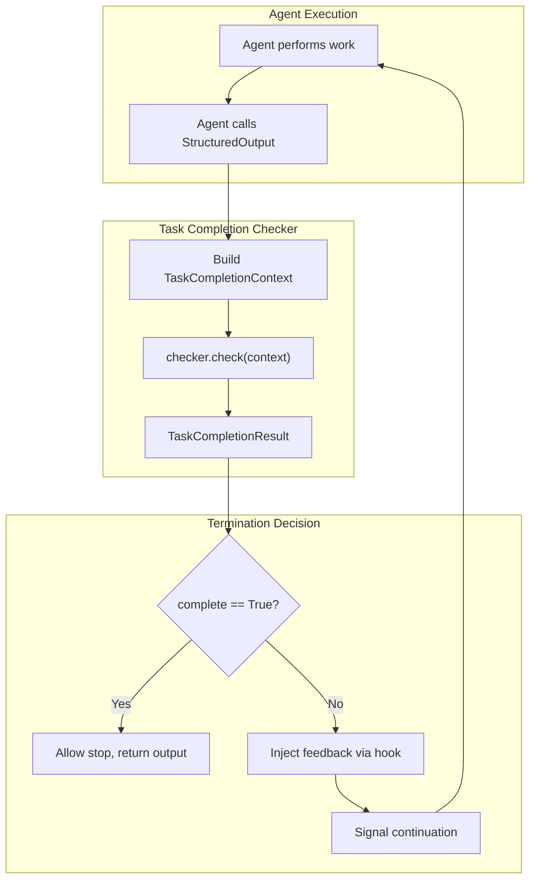
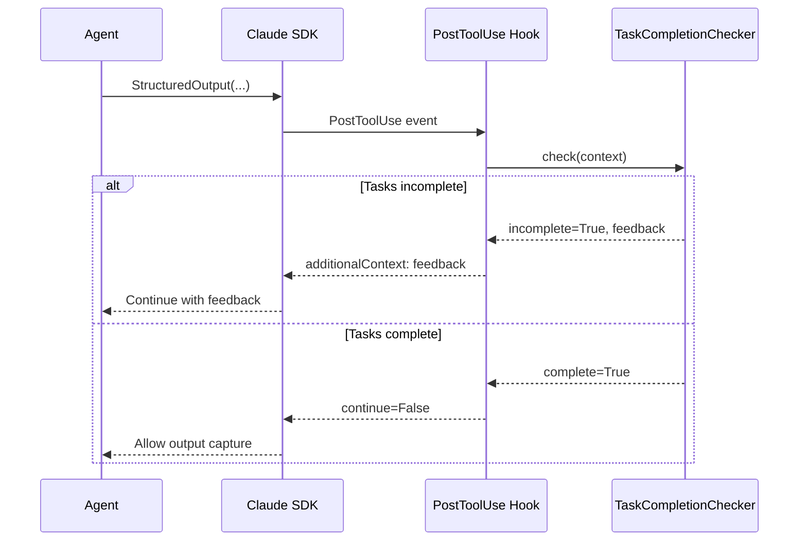
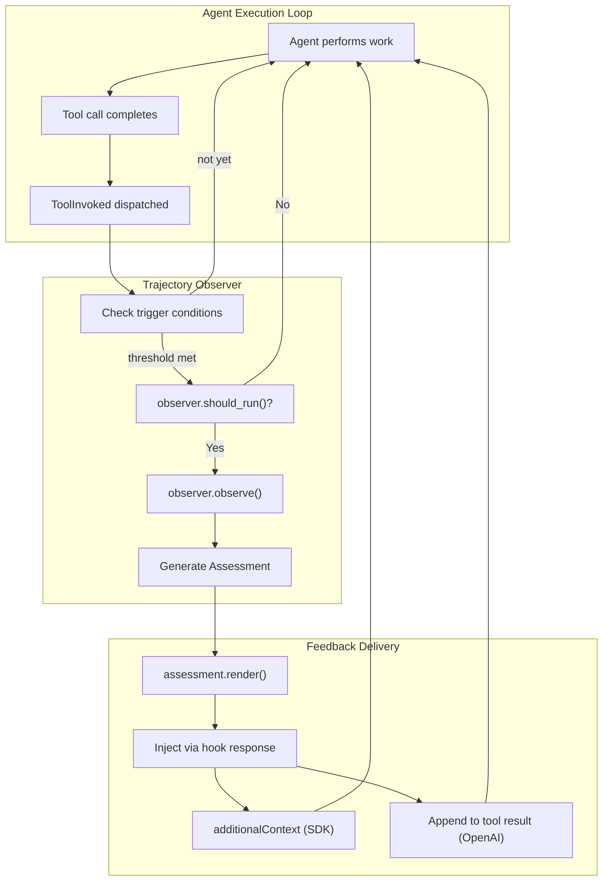
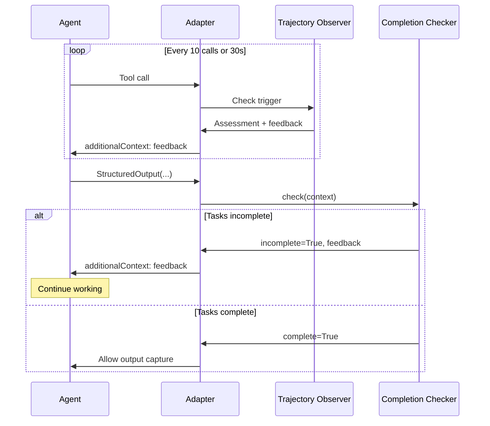

# Chapter 4.6 - Task Monitoring and Completion

## Introduction

When agents run unattended, two critical questions emerge: **Is the agent making progress?** and **Has it actually finished the work?** Without answers, you risk agents that stall indefinitely or prematurely declare victory with incomplete deliverables.

WINK provides two complementary mechanisms for managing task execution:

- **Task Completion Checking**: Verifies all assigned tasks are complete before allowing the agent to stop
- **Trajectory Observers**: Monitors ongoing progress and injects real-time feedback to guide course-correction

Together, these tools enable reliable unattended execution with built-in safeguards against common failure modes like premature termination, infinite loops, and drift from objectives.

This chapter covers both systems in depth, showing how to:

- Implement completion verification using built-in and custom checkers
- Monitor agent progress with trajectory observers
- Detect stalls, drift, and deadline pressure
- Test monitoring logic in isolation
- Deploy monitoring dashboards for production agents

## Task Completion Verification

### The Problem: Premature Termination

Consider an agent tasked with "refactoring the authentication module, updating tests, and running the full test suite." Without completion verification, the agent might:

1. Refactor the code
2. Update a few tests
3. Call `StructuredOutput` with a summary
4. Stop before running the test suite

The work appears complete from the agent's perspective, but critical steps remain unfinished.

Task completion checking solves this by **verifying task state before allowing termination**. If tasks remain incomplete, the agent receives explicit feedback and continues working.

### Architecture Overview



The checker runs at three points in the Claude Agent SDK adapter:

1. **PostToolUse Hook**: After `StructuredOutput` executes, verify completion before allowing the output to be captured
2. **Stop Hook**: Before allowing the agent to stop for other reasons (e.g., `end_turn`), verify completion
3. **Final Verification**: After SDK completes, verify completion before returning structured output to the caller

### The CompletionChecker Protocol

Task completion checkers implement a simple protocol:

```python
from typing import Protocol, runtime_checkable, Any
from dataclasses import dataclass

@dataclass(slots=True)
class TaskCompletionContext:
    """Context provided to checkers for evaluation.

    Attributes:
        session: Session containing state slices for verification
        tentative_output: Output being produced (StructuredOutput payload)
        filesystem: Optional filesystem access for file verification
        adapter: Optional adapter for LLM-based verification
        stop_reason: Why the agent is attempting to stop
    """
    session: Session
    tentative_output: Any = None
    filesystem: Filesystem | None = None
    adapter: ProviderAdapter | None = None
    stop_reason: str | None = None


@dataclass(frozen=True)
class TaskCompletionResult:
    """Result of completion verification.

    Attributes:
        complete: Whether all tasks are complete
        feedback: Natural language explanation of incompleteness
    """
    complete: bool
    feedback: str | None = None

    @classmethod
    def ok(cls, feedback: str | None = None) -> "TaskCompletionResult":
        """Tasks are complete."""
        return cls(complete=True, feedback=feedback)

    @classmethod
    def incomplete(cls, feedback: str) -> "TaskCompletionResult":
        """Tasks remain incomplete."""
        return cls(complete=False, feedback=feedback)


@runtime_checkable
class TaskCompletionChecker(Protocol):
    """Protocol for task completion verification."""

    def check(self, context: TaskCompletionContext) -> TaskCompletionResult:
        """Verify task completion.

        Args:
            context: Context with session state, output, and resources

        Returns:
            Result indicating completion status with feedback
        """
        ...
```

The protocol is deliberately minimal. Any object with a `check` method satisfies the interface.

### PlanBasedChecker: Verifying Plan State

The most common completion pattern is **plan-based verification**: the agent creates a plan with explicit tasks, then marks tasks complete as work progresses. `PlanBasedChecker` enforces that all plan steps reach `status == "done"` before allowing termination.

```python
from weakincentives.adapters.claude_agent_sdk import (
    ClaudeAgentSDKAdapter,
    ClaudeAgentSDKClientConfig,
    PlanBasedChecker,
)
from weakincentives.contrib.tools.planning import Plan
from weakincentives.contrib.tools import PlanningToolsSection
from weakincentives.prompt import Prompt, PromptTemplate, MarkdownSection
from weakincentives.runtime import Session, InProcessDispatcher

# Create session with planning tools
session = Session(bus=InProcessDispatcher())

template = PromptTemplate[None](
    ns="code-review",
    key="main",
    name="code_review_prompt",
    sections=[
        MarkdownSection(
            title="Task",
            template="""
You are a code reviewer. Create a plan with these steps:
1. Read the changed files
2. Analyze for issues (bugs, style, performance)
3. Write review comments
4. Run linter and tests
5. Produce final review report

Mark each step as "done" when complete.
            """,
            key="task",
        ),
        PlanningToolsSection(session=session),
    ],
)

# Configure adapter with plan-based completion checking
adapter = ClaudeAgentSDKAdapter(
    client_config=ClaudeAgentSDKClientConfig(
        task_completion_checker=PlanBasedChecker(plan_type=Plan),
    ),
)

# Agent will not terminate until all plan steps are marked "done"
response = adapter.evaluate(Prompt(template), session=session)
```

**Behavior:**

- Returns `ok()` if `Plan` slice is not registered (no plan configured)
- Returns `ok()` if no plan has been created yet (nothing to enforce)
- Returns `ok()` if all plan steps have `status == "done"`
- Returns `incomplete()` with detailed feedback listing incomplete tasks otherwise

**Feedback Example:**

```
You have 2 incomplete task(s) out of 5. Please either complete all remaining
tasks or update the plan to remove tasks that are no longer needed before
producing output: Run linter and tests, Produce final review report...
```

The feedback explicitly guides the agent: either finish the work or update the plan to remove tasks that are no longer relevant.

### CompositeChecker: Multi-Strategy Verification

`CompositeChecker` combines multiple verification strategies with configurable logic:

```python
from weakincentives.adapters.claude_agent_sdk import CompositeChecker

# All checkers must pass (AND logic)
checker = CompositeChecker(
    checkers=(
        PlanBasedChecker(plan_type=Plan),
        TestPassingChecker(),  # Custom checker (see below)
    ),
    all_must_pass=True,  # Default behavior
)

# Any checker can pass (OR logic)
checker = CompositeChecker(
    checkers=(
        PlanBasedChecker(plan_type=Plan),
        FileExistsChecker(required_files=("output.json",)),
    ),
    all_must_pass=False,
)
```

**AND Logic** (`all_must_pass=True`):
- Short-circuits on first failure, returning that result
- If all pass, combines feedback from all checkers
- Use for **required conditions**: plan complete AND tests passing AND files exist

**OR Logic** (`all_must_pass=False`):
- Short-circuits on first success, returning that result
- If all fail, combines feedback from all failing checkers
- Use for **alternative success criteria**: plan complete OR output file exists

### Custom Completion Checkers

Implement custom verification logic by creating a class with a `check` method:

```python
from dataclasses import dataclass

@dataclass(frozen=True)
class TestResult:
    """Session state tracking test execution."""
    passed: int
    failed: int
    total: int


class TestPassingChecker:
    """Verify all tests pass before allowing completion."""

    def check(self, context: TaskCompletionContext) -> TaskCompletionResult:
        # Query session state
        test_results = context.session[TestResult].latest()

        if test_results is None:
            return TaskCompletionResult.incomplete(
                "No test results found. Please run the test suite before "
                "marking tasks complete."
            )

        if test_results.failed > 0:
            return TaskCompletionResult.incomplete(
                f"{test_results.failed} test(s) failing. Fix failures before "
                f"completing. ({test_results.passed} passing)"
            )

        return TaskCompletionResult.ok(
            f"All {test_results.passed} tests passing."
        )
```

**File-Based Verification:**

```python
class FileExistsChecker:
    """Verify required files exist before completion."""

    def __init__(self, required_files: tuple[str, ...]) -> None:
        self._required = required_files

    def check(self, context: TaskCompletionContext) -> TaskCompletionResult:
        if context.filesystem is None:
            return TaskCompletionResult.ok(
                "No filesystem configured; skipping file checks."
            )

        missing = [
            f for f in self._required
            if not context.filesystem.exists(f)
        ]

        if missing:
            return TaskCompletionResult.incomplete(
                f"Missing required output files: {', '.join(missing)}. "
                f"Please generate all required outputs before completing."
            )

        return TaskCompletionResult.ok(
            f"All {len(self._required)} required files present."
        )
```

### Integration with Claude Agent SDK

Task completion checking is **disabled by default**. Enable it by configuring a checker via `ClaudeAgentSDKClientConfig`:

```python
from weakincentives.adapters.claude_agent_sdk import (
    ClaudeAgentSDKAdapter,
    ClaudeAgentSDKClientConfig,
    PlanBasedChecker,
)

adapter = ClaudeAgentSDKAdapter(
    client_config=ClaudeAgentSDKClientConfig(
        task_completion_checker=PlanBasedChecker(plan_type=Plan),
    ),
)
```

**Hook Integration Points:**



**Three Verification Points:**

1. **PostToolUse Hook (StructuredOutput)**: When the agent calls `StructuredOutput`, the hook checks completion. If incomplete, adds `additionalContext` with feedback encouraging continuation.

2. **Stop Hook**: When the agent attempts to stop for other reasons (e.g., `end_turn`), the hook checks completion. If incomplete, returns `{"needsMoreTurns": True, "decision": "continue"}`.

3. **Final Verification**: After the SDK completes, the adapter performs a final completion check before returning output. If incomplete, raises `PromptEvaluationError`. This catches edge cases where the SDK captured output before hooks could intervene.

**Budget and Deadline Bypass:**

When the budget is exhausted or the deadline has expired, completion checking is **skipped**. The agent cannot do more work, so forcing continuation would cause an infinite loop.

## Trajectory Observers

### The Problem: Silent Stalls and Drift

Task completion checking verifies the **final state** but provides no visibility into **ongoing progress**. Without trajectory observation, you encounter:

- **Silent stalls**: Agent gets stuck in a loop, burning budget without progress
- **Drift**: Agent works on unrelated files or tangential issues
- **Deadline blindness**: Agent unaware of time pressure, fails to prioritize
- **Error cascades**: Repeated failures go unnoticed until budget exhaustion

Trajectory observers provide **real-time progress assessment** by analyzing patterns over time and injecting feedback directly into the agent's context.

### Architecture Overview



**Key Characteristics:**

- **Non-blocking**: Observers produce feedback, not gates. The agent decides how to respond.
- **Immediate delivery**: Assessment is injected immediately after tool execution via hook response.
- **Session-aware**: Observers have full access to session state and prompt resources.
- **Trigger-based**: Observers run based on call count or elapsed time thresholds.

### The TrajectoryObserver Protocol

```python
from typing import Protocol, Literal
from dataclasses import dataclass, field
from datetime import datetime

@dataclass(frozen=True)
class Observation:
    """Single observation about agent trajectory."""
    category: str
    description: str
    evidence: str | None = None


@dataclass(frozen=True)
class Assessment:
    """Structured output from trajectory observation."""
    observer_name: str
    summary: str
    observations: tuple[Observation, ...] = ()
    suggestions: tuple[str, ...] = ()
    severity: Literal["info", "caution", "warning"] = "info"
    timestamp: datetime = field(default_factory=datetime.utcnow)
    call_index: int = 0

    def render(self) -> str:
        """Render as concise text for context injection."""
        lines = [
            f"[Trajectory Assessment - {self.observer_name}]",
            "",
            self.summary,
        ]

        if self.observations:
            lines.append("")
            for obs in self.observations:
                lines.append(f"• {obs.category}: {obs.description}")

        if self.suggestions:
            lines.append("")
            for suggestion in self.suggestions:
                lines.append(f"→ {suggestion}")

        return "\n".join(lines)


class TrajectoryObserver(Protocol):
    """Protocol for programmatic trajectory assessment."""

    @property
    def name(self) -> str:
        """Unique identifier for this observer."""
        ...

    def should_run(
        self,
        session: Session,
        *,
        context: ObserverContext,
    ) -> bool:
        """Determine if observer should produce an assessment."""
        ...

    def observe(
        self,
        session: Session,
        *,
        context: ObserverContext,
    ) -> Assessment:
        """Analyze trajectory and produce feedback."""
        ...
```

### ObserverContext: Resource Access

Observers receive `ObserverContext`, mirroring `ToolContext` for consistency:

```python
@dataclass(frozen=True)
class ObserverContext:
    """Context provided to observers during assessment."""

    session: Session
    prompt: PromptProtocol[Any]
    deadline: Deadline | None = None

    @property
    def resources(self) -> PromptResources:
        """Access resources from prompt's resource context."""
        return self.prompt.resources

    @property
    def filesystem(self) -> Filesystem | None:
        """Return the filesystem resource, if available."""
        return self.resources.get_optional(Filesystem)

    @property
    def last_assessment(self) -> Assessment | None:
        """Most recent assessment, if any."""
        return self.session[Assessment].latest()

    @property
    def tool_call_count(self) -> int:
        """Total tool calls in session."""
        return len(self.session[ToolInvoked].all())

    def tool_calls_since_last_assessment(self) -> int:
        """Number of tool calls since last assessment."""
        last = self.last_assessment
        if last is None:
            return self.tool_call_count
        return self.tool_call_count - last.call_index

    def recent_tool_calls(self, n: int) -> Sequence[ToolInvoked]:
        """Retrieve the N most recent tool invocations."""
        records = self.session[ToolInvoked].all()
        return records[-n:] if len(records) >= n else records
```

This provides observers with:
- Session state for pattern analysis
- Filesystem access for content inspection
- Tool call history for stall detection
- Deadline information for time pressure assessment

### Trigger Configuration

Observers run based on **trigger conditions**:

```python
@dataclass(frozen=True)
class ObserverTrigger:
    """Conditions that trigger observer execution."""

    every_n_calls: int | None = None       # Trigger every N tool calls
    every_n_seconds: float | None = None   # Trigger every N seconds
```

Triggers are **OR'd together**: if either condition is met, the observer runs.

```python
# Run every 10 tool calls
trigger = ObserverTrigger(every_n_calls=10)

# Run every 30 seconds
trigger = ObserverTrigger(every_n_seconds=30)

# Run every 20 calls OR every 60 seconds (whichever comes first)
trigger = ObserverTrigger(every_n_calls=20, every_n_seconds=60)
```

### Configuring Observers on Prompts

Observers are declared on the prompt template, alongside policies:

```python
from weakincentives.prompt import PromptTemplate, ObserverConfig, ObserverTrigger

template = PromptTemplate[OutputType](
    ns="my-agent",
    key="main",
    name="main_prompt",
    sections=[...],
    policies=[ReadBeforeWritePolicy()],
    observers=[
        ObserverConfig(
            observer=DeadlineObserver(),
            trigger=ObserverTrigger(every_n_seconds=30),
        ),
        ObserverConfig(
            observer=StallDetector(),
            trigger=ObserverTrigger(every_n_calls=10),
        ),
    ],
)
```

Adapters access observers from `prompt.observers`, keeping configuration centralized.

### Built-in Observer: DeadlineObserver

`DeadlineObserver` reports remaining time until deadline, escalating severity as time runs out:

```python
from weakincentives.runtime import DeadlineObserver

@dataclass(frozen=True)
class DeadlineObserver:
    """Report remaining time until deadline."""

    warning_threshold_seconds: float = 120  # 2 minutes

    @property
    def name(self) -> str:
        return "Deadline"

    def should_run(self, session: Session, *, context: ObserverContext) -> bool:
        return context.deadline is not None

    def observe(self, session: Session, *, context: ObserverContext) -> Assessment:
        assert context.deadline is not None
        remaining = context.deadline.remaining().total_seconds()

        if remaining <= 0:
            return Assessment(
                observer_name=self.name,
                summary="You have reached the time deadline.",
                suggestions=("Wrap up immediately and produce output.",),
                severity="warning",
            )

        summary = f"You have {self._format_duration(remaining)} remaining."
        suggestions: tuple[str, ...] = ()
        severity: Literal["info", "caution", "warning"] = "info"

        if remaining <= self.warning_threshold_seconds:
            severity = "warning"
            suggestions = (
                "Prioritize completing critical remaining work.",
                "Consider summarizing progress and remaining tasks.",
            )

        return Assessment(
            observer_name=self.name,
            summary=summary,
            suggestions=suggestions,
            severity=severity,
        )

    def _format_duration(self, seconds: float) -> str:
        if seconds < 60:
            return f"{int(seconds)} seconds"
        elif seconds < 3600:
            minutes = int(seconds / 60)
            return f"{minutes} minute{'s' if minutes != 1 else ''}"
        else:
            return f"{seconds / 3600:.1f} hours"
```

**Example Output (injected via `additionalContext`):**

```
[Trajectory Assessment - Deadline]

You have 8 minutes remaining.
```

**Warning Mode (< 2 minutes):**

```
[Trajectory Assessment - Deadline]

You have 90 seconds remaining.

→ Prioritize completing critical remaining work.
→ Consider summarizing progress and remaining tasks.
```

### Custom Observer: Stall Detection

Detect when the agent repeatedly calls the same tool without making progress:

```python
from collections import Counter

class StallDetector:
    """Detect repeated tool calls suggesting stalled progress."""

    def __init__(
        self,
        *,
        lookback_window: int = 10,
        repetition_threshold: float = 0.6,  # 60% repetition
    ) -> None:
        self._lookback = lookback_window
        self._threshold = repetition_threshold

    @property
    def name(self) -> str:
        return "StallDetector"

    def should_run(self, session: Session, *, context: ObserverContext) -> bool:
        # Run only if we have enough calls to analyze
        return context.tool_call_count >= self._lookback

    def observe(self, session: Session, *, context: ObserverContext) -> Assessment:
        recent_calls = context.recent_tool_calls(self._lookback)
        tool_names = [call.tool_name for call in recent_calls]

        # Count tool occurrences
        counts = Counter(tool_names)
        most_common_tool, count = counts.most_common(1)[0]
        repetition_rate = count / len(tool_names)

        if repetition_rate >= self._threshold:
            return Assessment(
                observer_name=self.name,
                summary=f"Potential stall detected: '{most_common_tool}' called "
                        f"{count} times in last {self._lookback} calls.",
                observations=(
                    Observation(
                        category="Repetition",
                        description=f"{int(repetition_rate * 100)}% of recent "
                                    f"calls are '{most_common_tool}'",
                        evidence=", ".join(tool_names[-5:]),
                    ),
                ),
                suggestions=(
                    "Consider changing your approach if repeated calls aren't "
                    "making progress.",
                    "Review recent outputs to identify issues.",
                ),
                severity="caution",
            )

        return Assessment(
            observer_name=self.name,
            summary=f"Tool usage appears varied ({len(counts)} unique tools).",
            severity="info",
        )
```

**Usage:**

```python
template = PromptTemplate[None](
    ns="my-agent",
    key="main",
    observers=[
        ObserverConfig(
            observer=StallDetector(lookback_window=15, repetition_threshold=0.5),
            trigger=ObserverTrigger(every_n_calls=10),
        ),
    ],
)
```

### Custom Observer: Drift Detection

Detect when the agent works on files unrelated to the stated objectives:

```python
class DriftDetector:
    """Detect when agent drifts away from relevant files."""

    def __init__(self, *, relevant_paths: tuple[str, ...]) -> None:
        self._relevant = set(relevant_paths)

    @property
    def name(self) -> str:
        return "DriftDetector"

    def should_run(self, session: Session, *, context: ObserverContext) -> bool:
        return context.filesystem is not None

    def observe(self, session: Session, *, context: ObserverContext) -> Assessment:
        assert context.filesystem is not None

        recent_calls = context.recent_tool_calls(10)

        # Extract file paths from tool calls (simplified)
        accessed_files = set()
        for call in recent_calls:
            if call.tool_name in ("Read", "Write", "Edit"):
                # Extract file_path from params (actual implementation would parse)
                if "file_path" in str(call.params):
                    accessed_files.add("...")  # Simplified

        # Check for drift
        irrelevant = accessed_files - self._relevant

        if irrelevant:
            return Assessment(
                observer_name=self.name,
                summary=f"Detected work on {len(irrelevant)} file(s) outside "
                        f"the relevant set.",
                observations=(
                    Observation(
                        category="Drift",
                        description=f"Files accessed: {', '.join(list(irrelevant)[:3])}",
                    ),
                ),
                suggestions=(
                    "Refocus on the original objectives.",
                    "If these files are necessary, explain why.",
                ),
                severity="caution",
            )

        return Assessment(
            observer_name=self.name,
            summary="Work focused on relevant files.",
            severity="info",
        )
```

## Combining Completion and Observation

Use both mechanisms together for comprehensive monitoring:

```python
from weakincentives.adapters.claude_agent_sdk import (
    ClaudeAgentSDKAdapter,
    ClaudeAgentSDKClientConfig,
    CompositeChecker,
    PlanBasedChecker,
)
from weakincentives.prompt import PromptTemplate, ObserverConfig, ObserverTrigger
from weakincentives.contrib.tools.planning import Plan

# Task completion: verify plan and test results
completion_checker = CompositeChecker(
    checkers=(
        PlanBasedChecker(plan_type=Plan),
        TestPassingChecker(),
    ),
    all_must_pass=True,
)

# Trajectory monitoring: deadline + stall detection
observers = [
    ObserverConfig(
        observer=DeadlineObserver(warning_threshold_seconds=180),
        trigger=ObserverTrigger(every_n_seconds=30),
    ),
    ObserverConfig(
        observer=StallDetector(lookback_window=15, repetition_threshold=0.5),
        trigger=ObserverTrigger(every_n_calls=10),
    ),
]

# Configure template with observers
template = PromptTemplate[CodeReviewOutput](
    ns="code-review",
    key="main",
    sections=[...],
    observers=observers,
)

# Configure adapter with completion checker
adapter = ClaudeAgentSDKAdapter(
    client_config=ClaudeAgentSDKClientConfig(
        task_completion_checker=completion_checker,
    ),
)

# Run with both mechanisms active
response = adapter.evaluate(Prompt(template), session=session)
```

**Combined Flow:**



## Testing Strategies

### Unit Testing Checkers

Test checkers in isolation with mock contexts:

```python
from weakincentives.runtime import Session, InProcessDispatcher
from weakincentives.filesystem import InMemoryFilesystem
from weakincentives.adapters.claude_agent_sdk import (
    TaskCompletionContext,
    TaskCompletionResult,
)

def test_file_checker_detects_missing_files():
    """FileExistsChecker returns incomplete when files missing."""
    session = Session(bus=InProcessDispatcher())
    fs = InMemoryFilesystem()

    context = TaskCompletionContext(
        session=session,
        filesystem=fs,
    )

    checker = FileExistsChecker(required_files=("output.json", "summary.txt"))
    result = checker.check(context)

    assert result.complete is False
    assert "output.json" in result.feedback
    assert "summary.txt" in result.feedback


def test_file_checker_passes_when_files_exist():
    """FileExistsChecker returns ok when all files exist."""
    session = Session(bus=InProcessDispatcher())
    fs = InMemoryFilesystem()
    fs.write("output.json", "{}")
    fs.write("summary.txt", "Done")

    context = TaskCompletionContext(
        session=session,
        filesystem=fs,
    )

    checker = FileExistsChecker(required_files=("output.json", "summary.txt"))
    result = checker.check(context)

    assert result.complete is True
```

### Unit Testing Observers

Test observers with controlled session state:

```python
from weakincentives.runtime import ObserverContext, Assessment
from weakincentives.prompt import Prompt, PromptTemplate
from datetime import datetime, timedelta

def test_deadline_observer_warns_near_deadline():
    """DeadlineObserver escalates severity near deadline."""
    session = Session(bus=InProcessDispatcher())

    # Create deadline with 90 seconds remaining
    deadline = Deadline(expires_at=datetime.utcnow() + timedelta(seconds=90))

    template = PromptTemplate[None](ns="test", key="test", sections=[])
    prompt = Prompt(template)

    context = ObserverContext(
        session=session,
        prompt=prompt,
        deadline=deadline,
    )

    observer = DeadlineObserver(warning_threshold_seconds=120)
    assessment = observer.observe(session, context=context)

    assert assessment.severity == "warning"
    assert len(assessment.suggestions) > 0
    assert "90 seconds" in assessment.summary


def test_stall_detector_identifies_repetition():
    """StallDetector identifies repeated tool calls."""
    session = Session(bus=InProcessDispatcher())

    # Simulate 10 tool calls with heavy repetition
    for i in range(7):
        session.dispatch(ToolInvoked(
            tool_name="Read",
            params={"file_path": f"/file{i}.py"},
            call_id=f"call_{i}",
        ))
    for i in range(3):
        session.dispatch(ToolInvoked(
            tool_name="Write",
            params={"file_path": f"/out{i}.py"},
            call_id=f"call_{7+i}",
        ))

    template = PromptTemplate[None](ns="test", key="test", sections=[])
    context = ObserverContext(session=session, prompt=Prompt(template))

    detector = StallDetector(lookback_window=10, repetition_threshold=0.6)
    assessment = detector.observe(session, context=context)

    assert assessment.severity == "caution"
    assert "Read" in assessment.summary
    assert "7 times" in assessment.summary
```

### Integration Testing

Test the full flow with real adapters:

```python
import pytest
from weakincentives.adapters.claude_agent_sdk import ClaudeAgentSDKAdapter

@pytest.mark.integration
def test_incomplete_plan_prevents_termination():
    """Agent continues when plan is incomplete."""
    session = Session(bus=InProcessDispatcher())

    # Seed incomplete plan
    plan = Plan(steps=(
        Step(id="1", title="Task 1", status="done"),
        Step(id="2", title="Task 2", status="pending"),
    ))
    session[Plan].seed(plan)

    template = PromptTemplate[None](
        ns="test",
        key="test",
        sections=[
            MarkdownSection(
                title="Task",
                template="Complete all tasks, then call StructuredOutput.",
                key="task",
            ),
        ],
    )

    adapter = ClaudeAgentSDKAdapter(
        client_config=ClaudeAgentSDKClientConfig(
            task_completion_checker=PlanBasedChecker(plan_type=Plan),
        ),
    )

    # This should raise if tasks incomplete (depending on final verification)
    # or should result in additional turns
    with pytest.raises(PromptEvaluationError, match="incomplete"):
        adapter.evaluate(Prompt(template), session=session)
```

## Production Deployment Patterns

### Real-time Monitoring Dashboard

Expose assessment history via REST API for real-time dashboards:

```python
from flask import Flask, jsonify
from weakincentives.runtime import Session

app = Flask(__name__)

@app.route("/api/sessions/<session_id>/assessments")
def get_assessments(session_id: str):
    """Return assessment history for a session."""
    session = session_registry.get(session_id)
    assessments = session[Assessment].all()

    return jsonify({
        "session_id": session_id,
        "assessments": [
            {
                "observer": a.observer_name,
                "summary": a.summary,
                "severity": a.severity,
                "timestamp": a.timestamp.isoformat(),
                "call_index": a.call_index,
            }
            for a in assessments
        ],
    })


@app.route("/api/sessions/<session_id>/status")
def get_status(session_id: str):
    """Return current session status."""
    session = session_registry.get(session_id)

    # Check plan completion
    plan = session[Plan].latest()
    plan_status = {
        "total_steps": len(plan.steps) if plan else 0,
        "completed_steps": len([s for s in plan.steps if s.status == "done"]) if plan else 0,
    }

    # Latest assessment
    latest = session[Assessment].latest()

    return jsonify({
        "session_id": session_id,
        "tool_calls": len(session[ToolInvoked].all()),
        "plan": plan_status,
        "latest_assessment": {
            "observer": latest.observer_name,
            "severity": latest.severity,
            "summary": latest.summary,
        } if latest else None,
    })
```

### Structured Logging for Observability

Log assessments to structured logs for aggregation:

```python
import structlog

logger = structlog.get_logger()

def log_assessment(assessment: Assessment, session_id: str) -> None:
    """Log assessment for external monitoring."""
    logger.info(
        "trajectory_assessment",
        session_id=session_id,
        observer=assessment.observer_name,
        severity=assessment.severity,
        summary=assessment.summary,
        call_index=assessment.call_index,
        timestamp=assessment.timestamp.isoformat(),
    )
```

Integrate into observer runner:

```python
def run_observers(
    *,
    observers: Sequence[ObserverConfig],
    context: ObserverContext,
    session: Session,
    session_id: str,  # Add session ID parameter
) -> str | None:
    """Run observers and log assessments."""

    for config in observers:
        if _should_trigger(config.trigger, context):
            if config.observer.should_run(session, context=context):
                assessment = config.observer.observe(session, context=context)
                assessment = replace(assessment, call_index=context.tool_call_count)

                # Log before dispatching
                log_assessment(assessment, session_id=session_id)

                session.dispatch(RecordAssessment(assessment))
                return assessment.render()

    return None
```

### Alerting on Critical Assessments

Trigger alerts when critical assessments occur:

```python
def alert_on_critical_assessment(assessment: Assessment, session_id: str) -> None:
    """Send alert for critical assessments."""
    if assessment.severity == "warning":
        # Send to PagerDuty, Slack, etc.
        slack_client.post_message(
            channel="#agent-alerts",
            text=f"⚠️ Critical assessment in session {session_id}\n"
                 f"Observer: {assessment.observer_name}\n"
                 f"Summary: {assessment.summary}",
        )
```

### Multi-Observer Orchestration

Coordinate multiple observers with different priorities:

```python
observers = [
    # Critical: Deadline pressure
    ObserverConfig(
        observer=DeadlineObserver(warning_threshold_seconds=300),
        trigger=ObserverTrigger(every_n_seconds=30),
    ),

    # High: Stall detection
    ObserverConfig(
        observer=StallDetector(lookback_window=20, repetition_threshold=0.5),
        trigger=ObserverTrigger(every_n_calls=15),
    ),

    # Medium: Drift detection
    ObserverConfig(
        observer=DriftDetector(relevant_paths=("src/", "tests/")),
        trigger=ObserverTrigger(every_n_calls=20),
    ),

    # Low: Progress summary
    ObserverConfig(
        observer=ProgressSummarizer(),
        trigger=ObserverTrigger(every_n_calls=50),
    ),
]
```

## Best Practices

### Completion Checking

1. **Enable by default for unattended agents**: Don't rely on the agent to self-terminate correctly.

2. **Use CompositeChecker for multi-faceted verification**: Combine plan completion with domain-specific checks (tests passing, files generated, etc.).

3. **Provide actionable feedback**: Guide the agent on how to complete remaining work or update the plan.

4. **Bypass on budget exhaustion**: Task completion checking automatically skips when the budget is exhausted to avoid infinite loops.

5. **Test checkers in isolation**: Mock the `TaskCompletionContext` to test verification logic without running full agent sessions.

### Trajectory Observation

1. **Start with DeadlineObserver**: Always include deadline monitoring for time-bounded agents.

2. **Tune trigger thresholds**: Balance feedback frequency with context pollution. Start conservative (every 20 calls, every 60 seconds) and adjust based on observed behavior.

3. **Keep assessments concise**: Rendered assessments inject into context. Avoid verbose summaries.

4. **Use severity levels appropriately**:
   - `info`: Routine progress updates
   - `caution`: Potential issues worth noting
   - `warning`: Critical issues requiring immediate attention

5. **Log all assessments**: Store assessment history for post-execution analysis and debugging.

6. **Custom observers for domain-specific patterns**: Build observers that understand your domain (e.g., "test failures increasing", "database connection failing").

### Combined Usage

1. **Observers guide, checkers enforce**: Use observers for soft course-correction during execution, checkers for hard gates at completion.

2. **Share state via session slices**: Both systems query the same session state, ensuring consistency.

3. **Monitor checker feedback in production**: Track how often agents hit completion checks to identify workflow issues.

4. **Test end-to-end**: Verify that observers + checkers work together without creating feedback loops.

## Advanced: LLM-as-Judge Verification (Future)

A future enhancement would enable **LLM-based completion verification** for subjective criteria:

```python
# Future API - not yet implemented
class LLMJudgeChecker:
    """Use LLM to evaluate task completion against criteria."""

    def __init__(
        self,
        *,
        criteria: str,
        adapter: ProviderAdapter,
    ) -> None:
        self._criteria = criteria
        self._adapter = adapter

    def check(self, context: TaskCompletionContext) -> TaskCompletionResult:
        # Build verification prompt
        verification_prompt = f"""
Review the following output against these criteria:

{self._criteria}

Output to evaluate:
{context.tentative_output}

Session state:
{self._serialize_session(context.session)}

Respond with:
- "COMPLETE" if all criteria are met
- "INCOMPLETE: <reason>" if criteria are not met
"""

        # Call LLM for judgment
        response = self._adapter.evaluate(verification_prompt)

        if response.startswith("COMPLETE"):
            return TaskCompletionResult.ok("LLM verified completion")
        else:
            reason = response.replace("INCOMPLETE:", "").strip()
            return TaskCompletionResult.incomplete(reason)
```

This is deferred until the use case is validated in production scenarios.

## Conclusion

Task monitoring and completion verification are essential for reliable unattended agent execution. By combining **task completion checkers** (hard gates) with **trajectory observers** (soft guidance), you create agents that:

- **Complete all assigned work** before terminating
- **Self-correct** when stalling or drifting
- **Respond to deadline pressure** appropriately
- **Provide visibility** into ongoing progress

Start with `PlanBasedChecker` and `DeadlineObserver`, then expand with custom verification and observation logic tailored to your domain. Test monitoring logic in isolation, deploy with structured logging and dashboards, and iterate based on observed agent behavior in production.
