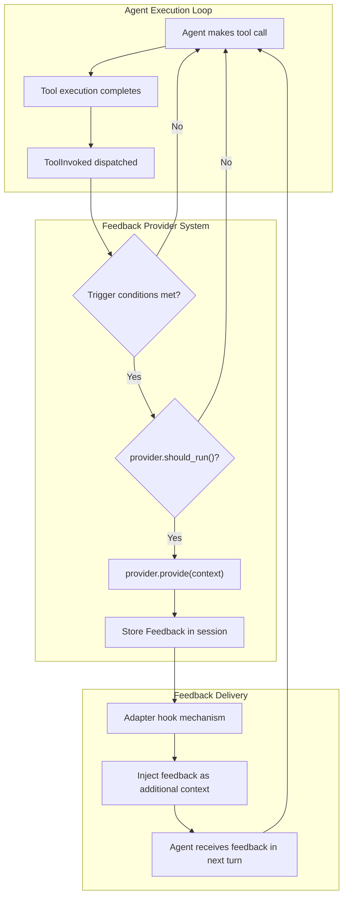
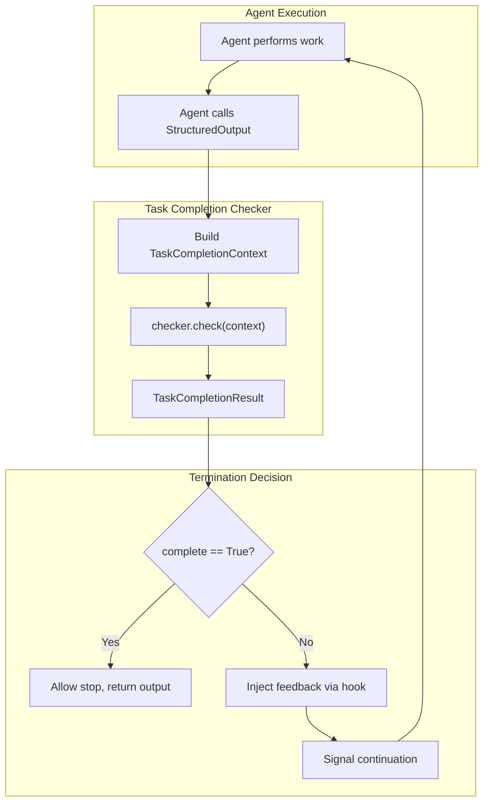
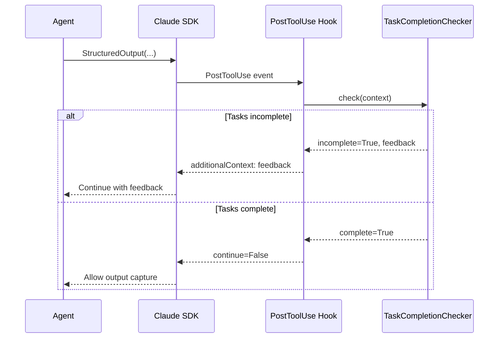

# Chapter 4.6 - Task Completion Verification

## Introduction

When agents run unattended, a critical question emerges: **Has it actually finished the work?** Without verification, you risk agents that prematurely declare victory with incomplete deliverables.

WINK provides **Task Completion Checking**: a mechanism that verifies all assigned tasks are complete before allowing the agent to stop. This enables reliable unattended execution with built-in safeguards against premature termination.

**This is the ownership boundary in practice**: the execution harness can drive
tool calls and enforce budgets, but it cannot know your real definition of
"done". Trajectory feedback is how you make unattended agents reliable: you
define completion criteria, and the harness refuses to terminate until those
criteria are satisfied.

This chapter covers task completion verification in depth, showing how to:

- Implement completion verification using built-in and custom checkers
- Combine multiple verification strategies
- Test completion logic in isolation
- Deploy completion checking for production agents

## Feedback Providers: Ongoing Trajectory Guidance

While task completion verification provides a hard gate at termination, **feedback providers** deliver ongoing guidance during execution. They observe the agent's trajectory in real-time and inject context-aware feedback, enabling soft course-correction without blocking progress.

### The Problem: Agents Drift Without Mid-Flight Guidance

Consider an agent working on a complex refactoring task with a 30-minute deadline. Without ongoing feedback, the agent might:

- Spend 25 minutes on low-priority file cleanup
- Realize too late that critical work remains
- Run out of time before completing essential tasks

Feedback providers solve this by **monitoring execution patterns and injecting timely reminders**:

- "You have 8 minutes remaining."
- "You've made 20 tool calls—review progress toward the goal."
- "Current file changes don't address the primary objective."

This guidance helps agents self-correct before it's too late.

### How Feedback Providers Work

Feedback providers are **trigger-based observers** that:

1. **Monitor session state**: Track tool calls, elapsed time, state changes
2. **Trigger on conditions**: Run when configured thresholds are met (every N calls, every N seconds)
3. **Produce feedback**: Generate natural language guidance based on observed patterns
4. **Inject immediately**: Deliver feedback via adapter hooks (e.g., `PostToolUse` in Claude Agent SDK)

Unlike policies that block tool execution, feedback providers are **non-blocking**—they provide guidance, and the agent decides how to respond.

### Architecture



### Configuration

Declare feedback providers on the prompt template:

```python
from weakincentives.prompt import (
    DeadlineFeedback,
    FeedbackProviderConfig,
    FeedbackTrigger,
    PromptTemplate,
)

template = PromptTemplate[OutputType](
    ns="refactoring-agent",
    key="main",
    sections=[...],
    feedback_providers=(
        FeedbackProviderConfig(
            provider=DeadlineFeedback(warning_threshold_seconds=120),
            trigger=FeedbackTrigger(every_n_seconds=30),
        ),
    ),
)
```

**Trigger Conditions:**

Triggers control when a provider is evaluated. Conditions are OR'd together:

```python
@dataclass(frozen=True)
class FeedbackTrigger:
    every_n_calls: int | None = None      # Run after N tool calls
    every_n_seconds: float | None = None  # Run after N seconds elapsed
```

Examples:

- `FeedbackTrigger(every_n_calls=10)`: Run after every 10 tool calls
- `FeedbackTrigger(every_n_seconds=30)`: Run every 30 seconds
- `FeedbackTrigger(every_n_calls=10, every_n_seconds=30)`: Run after 10 calls OR 30 seconds (whichever comes first)

### Built-in Provider: DeadlineFeedback

The `DeadlineFeedback` provider reports remaining time until deadline expiry:

```python
from weakincentives.prompt import (
    DeadlineFeedback,
    FeedbackProviderConfig,
    FeedbackTrigger,
)
from weakincentives.adapters.claude_agent_sdk import ClaudeAgentSDKAdapter

config = FeedbackProviderConfig(
    provider=DeadlineFeedback(warning_threshold_seconds=120),
    trigger=FeedbackTrigger(every_n_seconds=30),
)

template = PromptTemplate[OutputType](
    ns="my-agent",
    key="main",
    sections=[...],
    feedback_providers=(config,),
)

# Adapter with deadline
adapter = ClaudeAgentSDKAdapter()
response = adapter.evaluate(
    Prompt(template),
    session=session,
    deadline=Deadline.after_seconds(600),  # 10-minute deadline
)
```

**Normal Feedback (plenty of time remaining):**

```
[Feedback - Deadline]

You have 8 minutes remaining.
```

**Warning Feedback (below threshold):**

```
[Feedback - Deadline]

You have 90 seconds remaining.

→ Prioritize completing critical remaining work.
→ Consider summarizing progress and remaining tasks.
```

The warning threshold triggers more urgent messaging and actionable suggestions.

### Writing Custom Providers

Implement the `FeedbackProvider` protocol:

```python
from dataclasses import dataclass
from weakincentives.prompt import (
    Feedback,
    FeedbackContext,
    FeedbackProvider,
)


@dataclass(frozen=True)
class ToolUsageMonitor:
    """Warn when tool usage is high without apparent progress."""

    max_calls_without_progress: int = 20

    @property
    def name(self) -> str:
        return "ToolUsageMonitor"

    def should_run(self, *, context: FeedbackContext) -> bool:
        # Always run when triggered
        return True

    def provide(self, *, context: FeedbackContext) -> Feedback:
        count = context.tool_call_count

        if count > self.max_calls_without_progress:
            return Feedback(
                provider_name=self.name,
                summary=f"You have made {count} tool calls.",
                suggestions=(
                    "Review what you've accomplished so far.",
                    "Check if you're making progress toward the goal.",
                ),
                severity="caution",
            )

        return Feedback(
            provider_name=self.name,
            summary=f"Progress check: {count} tool calls made.",
            severity="info",
        )
```

**FeedbackProvider Protocol:**

```python
class FeedbackProvider(Protocol):
    @property
    def name(self) -> str:
        """Unique identifier for this provider."""
        ...

    def should_run(self, *, context: FeedbackContext) -> bool:
        """Additional filtering beyond trigger conditions."""
        ...

    def provide(self, *, context: FeedbackContext) -> Feedback:
        """Produce feedback for context injection."""
        ...
```

The `should_run` method provides additional filtering after trigger conditions are met. For example, `DeadlineFeedback.should_run` returns `False` when no deadline is configured.

### FeedbackContext: Access to Session State

The `FeedbackContext` provides access to session state and prompt resources:

```python
@dataclass(frozen=True)
class FeedbackContext:
    session: SessionProtocol
    prompt: PromptProtocol[Any]
    deadline: Deadline | None = None

    @property
    def prompt_name(self) -> str: ...
    @property
    def resources(self) -> PromptResources: ...
    @property
    def filesystem(self) -> Filesystem | None: ...
    @property
    def last_feedback(self) -> Feedback | None: ...
    @property
    def tool_call_count(self) -> int: ...

    def tool_calls_since_last_feedback(self) -> int: ...
    def recent_tool_calls(self, n: int) -> Sequence[ToolInvoked]: ...
```

**Key properties:**

- **`session`**: Query session slices (e.g., `context.session[Plan].latest()`)
- **`prompt`**: Access prompt resources
- **`deadline`**: Check remaining time
- **`last_feedback`**: Most recent feedback for this prompt
- **`tool_call_count`**: Total tool calls for this prompt
- **`tool_calls_since_last_feedback()`**: Calls since last feedback
- **`recent_tool_calls(n)`**: Last N tool invocations

All metrics are **scoped to the current prompt** to ensure consistent behavior when sessions are reused across prompts.

### Feedback Dataclass

The `Feedback` dataclass represents the guidance produced:

```python
@dataclass(frozen=True)
class Feedback:
    provider_name: str
    summary: str
    observations: tuple[Observation, ...] = ()
    suggestions: tuple[str, ...] = ()
    severity: Literal["info", "caution", "warning"] = "info"
    timestamp: datetime = field(default_factory=_utcnow)
    call_index: int = 0        # Set by runner
    prompt_name: str = ""      # Set by runner
```

The `render()` method produces text for injection:

```
[Feedback - ToolUsageMonitor]

You have made 25 tool calls.

→ Review what you've accomplished so far.
→ Check if you're making progress toward the goal.
```

### Execution Flow

```
Tool call completes
        │
        ▼
ToolInvoked dispatched to session
        │
        ▼
For each FeedbackProviderConfig:
    ├─ Check trigger conditions (every_n_calls, every_n_seconds)
    │   └─ If not met → skip
    ├─ Call provider.should_run()
    │   └─ If False → skip
    ├─ Call provider.provide()
    ├─ Store Feedback in session slice
    └─ Return rendered text (first match wins)
        │
        ▼
Inject feedback via adapter mechanism
```

**First-match-wins:** Once a provider produces feedback, subsequent providers are not evaluated. Order providers by priority in the configuration.

### Adapter Integration

#### Claude Agent SDK

Feedback is delivered via the `PostToolUse` hook using `additionalContext`:

```python
return {
    "hookSpecificOutput": {
        "hookEventName": "PostToolUse",
        "additionalContext": feedback_text,
    }
}
```

This injects feedback immediately after tool execution, allowing the agent to see it in the current turn.

#### OpenAI Adapter

Feedback is appended to the tool result message:

```python
tool_result = replace(
    tool_result,
    message=f"{tool_result.message}\n\n{feedback_text}",
)
```

The agent sees the feedback along with the tool's return value.

### State Management

Feedback is stored in the `Feedback` session slice:

```python
# Query all feedback
all_feedback = session[Feedback].all()

# Get most recent feedback
latest = session[Feedback].latest()

# Filter by provider
deadline_feedback = [
    f for f in session[Feedback].all()
    if f.provider_name == "DeadlineFeedback"
]
```

Feedback storage enables:

- **Trigger calculations**: Determine when last feedback occurred
- **Debugging**: Inspect feedback history to understand agent guidance
- **Observability**: Track feedback patterns over time

### Example: Plan Progress Monitoring

Monitor plan completion progress and remind the agent to finish remaining tasks:

```python
from dataclasses import dataclass
from weakincentives.prompt import Feedback, FeedbackContext, FeedbackProvider
from weakincentives.contrib.tools.planning import Plan


@dataclass(frozen=True)
class PlanProgressMonitor:
    """Remind agent about incomplete plan tasks."""

    @property
    def name(self) -> str:
        return "PlanProgressMonitor"

    def should_run(self, *, context: FeedbackContext) -> bool:
        # Only run if a plan exists
        plan = context.session[Plan].latest()
        return plan is not None

    def provide(self, *, context: FeedbackContext) -> Feedback:
        plan = context.session[Plan].latest()

        if plan is None:
            return Feedback(
                provider_name=self.name,
                summary="No plan found.",
                severity="info",
            )

        total = len(plan.steps)
        done = len([s for s in plan.steps if s.status == "done"])
        pending = total - done

        if pending == 0:
            return Feedback(
                provider_name=self.name,
                summary=f"All {total} plan tasks completed!",
                severity="info",
            )

        incomplete_titles = [
            s.title for s in plan.steps if s.status != "done"
        ]

        return Feedback(
            provider_name=self.name,
            summary=f"{pending} of {total} tasks remain incomplete.",
            observations=(
                Observation(
                    label="Incomplete tasks",
                    value=", ".join(incomplete_titles[:3]),  # Show first 3
                ),
            ),
            suggestions=(
                "Focus on completing remaining tasks before wrapping up.",
            ),
            severity="caution" if pending > total // 2 else "info",
        )


# Configure with trigger
config = FeedbackProviderConfig(
    provider=PlanProgressMonitor(),
    trigger=FeedbackTrigger(every_n_calls=10),  # Check every 10 calls
)
```

### Combining Multiple Providers

Configure multiple providers with different triggers:

```python
template = PromptTemplate[OutputType](
    ns="complex-agent",
    key="main",
    sections=[...],
    feedback_providers=(
        # Deadline warnings every 30 seconds
        FeedbackProviderConfig(
            provider=DeadlineFeedback(warning_threshold_seconds=120),
            trigger=FeedbackTrigger(every_n_seconds=30),
        ),
        # Plan progress every 10 calls
        FeedbackProviderConfig(
            provider=PlanProgressMonitor(),
            trigger=FeedbackTrigger(every_n_calls=10),
        ),
        # Tool usage monitoring every 5 calls
        FeedbackProviderConfig(
            provider=ToolUsageMonitor(max_calls_without_progress=20),
            trigger=FeedbackTrigger(every_n_calls=5),
        ),
    ),
)
```

**Evaluation order:**

Providers are evaluated in the order declared. First provider whose trigger and `should_run` conditions are met produces feedback, and evaluation stops.

**Best practice:** Order providers by priority—most critical feedback first.

### Testing Feedback Providers

Test providers in isolation by constructing `FeedbackContext`:

```python
from weakincentives.prompt import FeedbackContext
from weakincentives.runtime import Session, InProcessDispatcher, Deadline

def test_deadline_feedback_warns_when_time_low():
    """DeadlineFeedback produces warning when deadline near."""
    session = Session(dispatcher=InProcessDispatcher())
    prompt = Prompt(template)  # Your test prompt

    # Create deadline expiring soon
    deadline = Deadline.after_seconds(60)  # 1 minute

    context = FeedbackContext(
        session=session,
        prompt=prompt,
        deadline=deadline,
    )

    provider = DeadlineFeedback(warning_threshold_seconds=120)

    # Should run when deadline configured
    assert provider.should_run(context=context) is True

    # Should produce warning feedback
    feedback = provider.provide(context=context)
    assert feedback.severity == "warning"
    assert "remaining" in feedback.summary.lower()
    assert len(feedback.suggestions) > 0
```

### Best Practices

1. **Use specific triggers**: Match trigger frequency to feedback urgency
   - Deadline warnings: `every_n_seconds=30` (frequent)
   - Plan progress: `every_n_calls=10` (moderate)
   - High-level guidance: `every_n_calls=20` (infrequent)

2. **Provide actionable suggestions**: Don't just describe the problem—guide the agent toward solutions
   - ❌ "Time is running out."
   - ✅ "You have 2 minutes remaining. Prioritize completing critical remaining work."

3. **Use appropriate severity levels**:
   - `info`: Routine progress updates
   - `caution`: Important reminders
   - `warning`: Urgent issues requiring immediate attention

4. **Keep feedback concise**: Agents receive feedback mid-execution—verbose guidance may be ignored

5. **Order providers by priority**: Place critical feedback providers first in the configuration

6. **Test providers independently**: Unit test provider logic with mock contexts before integration

7. **Monitor feedback frequency**: Track how often feedback is produced to tune trigger thresholds

8. **Scope to current prompt**: Feedback metrics are automatically scoped to the current prompt when sessions are reused

### Limitations

- **Single provider per trigger**: First matching provider wins; subsequent providers skip
- **Synchronous execution**: Providers block tool completion briefly (keep logic fast)
- **Text-based delivery**: Agents interpret natural language guidance; effectiveness varies

### When to Use Feedback Providers vs. Task Completion Verification

| Mechanism | Purpose | When to Use |
|-----------|---------|-------------|
| **Feedback Providers** | Ongoing soft guidance during execution | Nudge agents toward better patterns mid-flight |
| **Task Completion Verification** | Hard gate before termination | Ensure all work is complete before allowing agent to stop |

Use both together:

- **Feedback providers** guide the agent during execution ("8 minutes remaining", "20 tool calls made")
- **Task completion verification** validates completeness at the end ("All 5 plan tasks must be done")

## Task Completion Verification

### The Problem: Premature Termination

Consider an agent tasked with "refactoring the authentication module, updating tests, and running the full test suite." Without completion verification, the agent might:

1. Refactor the code
1. Update a few tests
1. Call `StructuredOutput` with a summary
1. Stop before running the test suite

The work appears complete from the agent's perspective, but critical steps remain unfinished.

Task completion checking solves this by **verifying task state before allowing termination**. If tasks remain incomplete, the agent receives explicit feedback and continues working.

### Architecture Overview



The checker runs at three points in the Claude Agent SDK adapter:

1. **PostToolUse Hook**: After `StructuredOutput` executes, verify completion before allowing the output to be captured
1. **Stop Hook**: Before allowing the agent to stop for other reasons (e.g., `end_turn`), verify completion
1. **Final Verification**: After SDK completes, verify completion before returning structured output to the caller

### The CompletionChecker Protocol

Task completion checkers implement a simple protocol:

```python
from typing import Protocol, runtime_checkable, Any
from dataclasses import dataclass

@dataclass(slots=True)
class TaskCompletionContext:
    """Context provided to checkers for evaluation.

    Attributes:
        session: Session containing state slices for verification
        tentative_output: Output being produced (StructuredOutput payload)
        filesystem: Optional filesystem access for file verification
        adapter: Optional adapter for LLM-based verification
        stop_reason: Why the agent is attempting to stop
    """
    session: Session
    tentative_output: Any = None
    filesystem: Filesystem | None = None
    adapter: ProviderAdapter | None = None
    stop_reason: str | None = None


@dataclass(frozen=True)
class TaskCompletionResult:
    """Result of completion verification.

    Attributes:
        complete: Whether all tasks are complete
        feedback: Natural language explanation of incompleteness
    """
    complete: bool
    feedback: str | None = None

    @classmethod
    def ok(cls, feedback: str | None = None) -> "TaskCompletionResult":
        """Tasks are complete."""
        return cls(complete=True, feedback=feedback)

    @classmethod
    def incomplete(cls, feedback: str) -> "TaskCompletionResult":
        """Tasks remain incomplete."""
        return cls(complete=False, feedback=feedback)


@runtime_checkable
class TaskCompletionChecker(Protocol):
    """Protocol for task completion verification."""

    def check(self, context: TaskCompletionContext) -> TaskCompletionResult:
        """Verify task completion.

        Args:
            context: Context with session state, output, and resources

        Returns:
            Result indicating completion status with feedback
        """
        ...
```

The protocol is deliberately minimal. Any object with a `check` method satisfies the interface.

### PlanBasedChecker: Verifying Plan State

The most common completion pattern is **plan-based verification**: the agent creates a plan with explicit tasks, then marks tasks complete as work progresses. `PlanBasedChecker` enforces that all plan steps reach `status == "done"` before allowing termination.

```python
from weakincentives.adapters.claude_agent_sdk import (
    ClaudeAgentSDKAdapter,
    ClaudeAgentSDKClientConfig,
    PlanBasedChecker,
)
from weakincentives.contrib.tools.planning import Plan
from weakincentives.contrib.tools import PlanningToolsSection
from weakincentives.prompt import Prompt, PromptTemplate, MarkdownSection
from weakincentives.runtime import Session, InProcessDispatcher

# Create session with planning tools
session = Session(dispatcher=InProcessDispatcher())

template = PromptTemplate[None](
    ns="code-review",
    key="main",
    name="code_review_prompt",
    sections=[
        MarkdownSection(
            title="Task",
            template="""
You are a code reviewer. Create a plan with these steps:
1. Read the changed files
2. Analyze for issues (bugs, style, performance)
3. Write review comments
4. Run linter and tests
5. Produce final review report

Mark each step as "done" when complete.
            """,
            key="task",
        ),
        PlanningToolsSection(session=session),
    ],
)

# Configure adapter with plan-based completion checking
adapter = ClaudeAgentSDKAdapter(
    client_config=ClaudeAgentSDKClientConfig(
        task_completion_checker=PlanBasedChecker(plan_type=Plan),
    ),
)

# Agent will not terminate until all plan steps are marked "done"
response = adapter.evaluate(Prompt(template), session=session)
```

**Behavior:**

- Returns `ok()` if `Plan` slice is not registered (no plan configured)
- Returns `ok()` if no plan has been created yet (nothing to enforce)
- Returns `ok()` if all plan steps have `status == "done"`
- Returns `incomplete()` with detailed feedback listing incomplete tasks otherwise

**Feedback Example:**

```
You have 2 incomplete task(s) out of 5. Please either complete all remaining
tasks or update the plan to remove tasks that are no longer needed before
producing output: Run linter and tests, Produce final review report...
```

The feedback explicitly guides the agent: either finish the work or update the plan to remove tasks that are no longer relevant.

### CompositeChecker: Multi-Strategy Verification

`CompositeChecker` combines multiple verification strategies with configurable logic:

```python
from weakincentives.adapters.claude_agent_sdk import CompositeChecker

# All checkers must pass (AND logic)
checker = CompositeChecker(
    checkers=(
        PlanBasedChecker(plan_type=Plan),
        TestPassingChecker(),  # Custom checker (see below)
    ),
    all_must_pass=True,  # Default behavior
)

# Any checker can pass (OR logic)
checker = CompositeChecker(
    checkers=(
        PlanBasedChecker(plan_type=Plan),
        FileExistsChecker(required_files=("output.json",)),
    ),
    all_must_pass=False,
)
```

**AND Logic** (`all_must_pass=True`):

- Short-circuits on first failure, returning that result
- If all pass, combines feedback from all checkers
- Use for **required conditions**: plan complete AND tests passing AND files exist

**OR Logic** (`all_must_pass=False`):

- Short-circuits on first success, returning that result
- If all fail, combines feedback from all failing checkers
- Use for **alternative success criteria**: plan complete OR output file exists

### Custom Completion Checkers

Implement custom verification logic by creating a class with a `check` method:

```python
from dataclasses import dataclass

@dataclass(frozen=True)
class TestResult:
    """Session state tracking test execution."""
    passed: int
    failed: int
    total: int


class TestPassingChecker:
    """Verify all tests pass before allowing completion."""

    def check(self, context: TaskCompletionContext) -> TaskCompletionResult:
        # Query session state
        test_results = context.session[TestResult].latest()

        if test_results is None:
            return TaskCompletionResult.incomplete(
                "No test results found. Please run the test suite before "
                "marking tasks complete."
            )

        if test_results.failed > 0:
            return TaskCompletionResult.incomplete(
                f"{test_results.failed} test(s) failing. Fix failures before "
                f"completing. ({test_results.passed} passing)"
            )

        return TaskCompletionResult.ok(
            f"All {test_results.passed} tests passing."
        )
```

**File-Based Verification:**

```python
class FileExistsChecker:
    """Verify required files exist before completion."""

    def __init__(self, required_files: tuple[str, ...]) -> None:
        self._required = required_files

    def check(self, context: TaskCompletionContext) -> TaskCompletionResult:
        if context.filesystem is None:
            return TaskCompletionResult.ok(
                "No filesystem configured; skipping file checks."
            )

        missing = [
            f for f in self._required
            if not context.filesystem.exists(f)
        ]

        if missing:
            return TaskCompletionResult.incomplete(
                f"Missing required output files: {', '.join(missing)}. "
                f"Please generate all required outputs before completing."
            )

        return TaskCompletionResult.ok(
            f"All {len(self._required)} required files present."
        )
```

### Integration with Claude Agent SDK

Task completion checking is **disabled by default**. Enable it by configuring a checker via `ClaudeAgentSDKClientConfig`:

```python
from weakincentives.adapters.claude_agent_sdk import (
    ClaudeAgentSDKAdapter,
    ClaudeAgentSDKClientConfig,
    PlanBasedChecker,
)

adapter = ClaudeAgentSDKAdapter(
    client_config=ClaudeAgentSDKClientConfig(
        task_completion_checker=PlanBasedChecker(plan_type=Plan),
    ),
)
```

**Hook Integration Points:**



**Three Verification Points:**

1. **PostToolUse Hook (StructuredOutput)**: When the agent calls `StructuredOutput`, the hook checks completion. If incomplete, adds `additionalContext` with feedback encouraging continuation.

1. **Stop Hook**: When the agent attempts to stop for other reasons (e.g., `end_turn`), the hook checks completion. If incomplete, returns `{"needsMoreTurns": True, "decision": "continue"}`.

1. **Final Verification**: After the SDK completes, the adapter performs a final completion check before returning output. If incomplete, raises `PromptEvaluationError`. This catches edge cases where the SDK captured output before hooks could intervene.

**Budget and Deadline Bypass:**

When the budget is exhausted or the deadline has expired, completion checking is **skipped**. The agent cannot do more work, so forcing continuation would cause an infinite loop.

## Testing Strategies

### Unit Testing Checkers

Test checkers in isolation with mock contexts:

```python
from weakincentives.runtime import Session, InProcessDispatcher
from weakincentives.filesystem import InMemoryFilesystem
from weakincentives.adapters.claude_agent_sdk import (
    TaskCompletionContext,
    TaskCompletionResult,
)

def test_file_checker_detects_missing_files():
    """FileExistsChecker returns incomplete when files missing."""
    session = Session(dispatcher=InProcessDispatcher())
    fs = InMemoryFilesystem()

    context = TaskCompletionContext(
        session=session,
        filesystem=fs,
    )

    checker = FileExistsChecker(required_files=("output.json", "summary.txt"))
    result = checker.check(context)

    assert result.complete is False
    assert "output.json" in result.feedback
    assert "summary.txt" in result.feedback


def test_file_checker_passes_when_files_exist():
    """FileExistsChecker returns ok when all files exist."""
    session = Session(dispatcher=InProcessDispatcher())
    fs = InMemoryFilesystem()
    fs.write("output.json", "{}")
    fs.write("summary.txt", "Done")

    context = TaskCompletionContext(
        session=session,
        filesystem=fs,
    )

    checker = FileExistsChecker(required_files=("output.json", "summary.txt"))
    result = checker.check(context)

    assert result.complete is True
```

### Integration Testing

Test the full flow with real adapters:

```python
import pytest
from weakincentives.adapters.claude_agent_sdk import ClaudeAgentSDKAdapter

@pytest.mark.integration
def test_incomplete_plan_prevents_termination():
    """Agent continues when plan is incomplete."""
    session = Session(dispatcher=InProcessDispatcher())

    # Seed incomplete plan
    plan = Plan(steps=(
        Step(id="1", title="Task 1", status="done"),
        Step(id="2", title="Task 2", status="pending"),
    ))
    session[Plan].seed(plan)

    template = PromptTemplate[None](
        ns="test",
        key="test",
        sections=[
            MarkdownSection(
                title="Task",
                template="Complete all tasks, then call StructuredOutput.",
                key="task",
            ),
        ],
    )

    adapter = ClaudeAgentSDKAdapter(
        client_config=ClaudeAgentSDKClientConfig(
            task_completion_checker=PlanBasedChecker(plan_type=Plan),
        ),
    )

    # This should raise if tasks incomplete (depending on final verification)
    # or should result in additional turns
    with pytest.raises(PromptEvaluationError, match="incomplete"):
        adapter.evaluate(Prompt(template), session=session)
```

## Production Deployment Patterns

### Monitoring Completion Checks

Track how often agents hit completion checks to identify workflow issues:

```python
import structlog

logger = structlog.get_logger()

def log_completion_check(
    result: TaskCompletionResult,
    session_id: str,
    call_count: int,
) -> None:
    """Log completion check for monitoring."""
    logger.info(
        "task_completion_check",
        session_id=session_id,
        complete=result.complete,
        feedback=result.feedback,
        tool_calls=call_count,
    )
```

### Real-time Status Dashboard

Expose completion status via REST API:

```python
from flask import Flask, jsonify
from weakincentives.runtime import Session

app = Flask(__name__)

@app.route("/api/sessions/<session_id>/status")
def get_status(session_id: str):
    """Return current session status."""
    session = session_registry.get(session_id)

    # Check plan completion
    plan = session[Plan].latest()
    plan_status = {
        "total_steps": len(plan.steps) if plan else 0,
        "completed_steps": len([s for s in plan.steps if s.status == "done"]) if plan else 0,
    }

    return jsonify({
        "session_id": session_id,
        "tool_calls": len(session[ToolInvoked].all()),
        "plan": plan_status,
    })
```

### Alerting on Repeated Failures

Alert when agents repeatedly fail completion checks:

```python
def alert_on_repeated_failures(session: Session, session_id: str) -> None:
    """Alert if agent is stuck at completion check."""
    tool_calls = len(session[ToolInvoked].all())

    # If agent has made many calls but still incomplete, alert
    if tool_calls > 100:
        slack_client.post_message(
            channel="#agent-alerts",
            text=f"⚠️ Agent {session_id} has made {tool_calls} tool calls "
                 f"but tasks remain incomplete. May be stuck.",
        )
```

## Best Practices

### Completion Checking

1. **Enable by default for unattended agents**: Don't rely on the agent to self-terminate correctly.

1. **Use CompositeChecker for multi-faceted verification**: Combine plan completion with domain-specific checks (tests passing, files generated, etc.).

1. **Provide actionable feedback**: Guide the agent on how to complete remaining work or update the plan.

1. **Bypass on budget exhaustion**: Task completion checking automatically skips when the budget is exhausted to avoid infinite loops.

1. **Test checkers in isolation**: Mock the `TaskCompletionContext` to test verification logic without running full agent sessions.

1. **Log completion checks**: Track completion check frequency and failure patterns to identify workflow issues.

1. **Monitor for stuck agents**: Alert when agents make many tool calls without completing tasks.

### Combining Multiple Checkers

1. **Use AND logic for required conditions**: All conditions must be satisfied (plan complete AND tests passing AND files exist).

1. **Use OR logic for alternative success criteria**: Any condition can satisfy completion (plan complete OR output file exists).

1. **Order checkers by cost**: In CompositeChecker with AND logic, put cheapest checks first to fail fast.

1. **Share state via session slices**: All checkers query the same session state, ensuring consistency.

## Advanced: LLM-as-Judge Verification (Future)

A future enhancement would enable **LLM-based completion verification** for subjective criteria:

```python
# Future API - not yet implemented
class LLMJudgeChecker:
    """Use LLM to evaluate task completion against criteria."""

    def __init__(
        self,
        *,
        criteria: str,
        adapter: ProviderAdapter,
    ) -> None:
        self._criteria = criteria
        self._adapter = adapter

    def check(self, context: TaskCompletionContext) -> TaskCompletionResult:
        # Build verification prompt
        verification_prompt = f"""
Review the following output against these criteria:

{self._criteria}

Output to evaluate:
{context.tentative_output}

Session state:
{self._serialize_session(context.session)}

Respond with:
- "COMPLETE" if all criteria are met
- "INCOMPLETE: <reason>" if criteria are not met
"""

        # Call LLM for judgment
        response = self._adapter.evaluate(verification_prompt)

        if response.startswith("COMPLETE"):
            return TaskCompletionResult.ok("LLM verified completion")
        else:
            reason = response.replace("INCOMPLETE:", "").strip()
            return TaskCompletionResult.incomplete(reason)
```

This is deferred until the use case is validated in production scenarios.

## Conclusion

Task completion verification is essential for reliable unattended agent execution. By implementing **task completion checkers** as hard gates before termination, you create agents that:

- **Complete all assigned work** before terminating
- **Receive actionable feedback** when tasks remain incomplete
- **Avoid premature termination** that leaves work unfinished
- **Provide visibility** into completion status

Start with `PlanBasedChecker` for plan-based agents, then expand with custom verification logic tailored to your domain. Use `CompositeChecker` to combine multiple verification strategies with AND/OR logic. Test completion logic in isolation, deploy with structured logging and monitoring, and iterate based on observed agent behavior in production.
