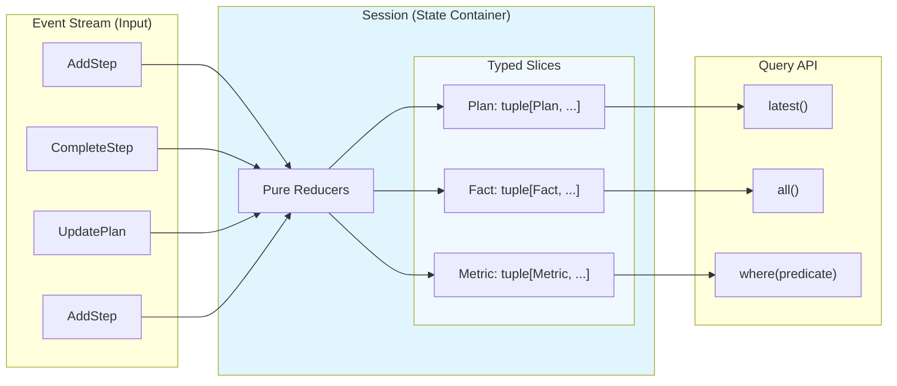
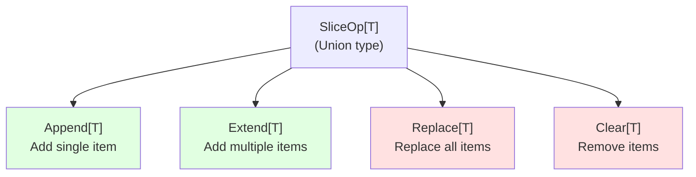
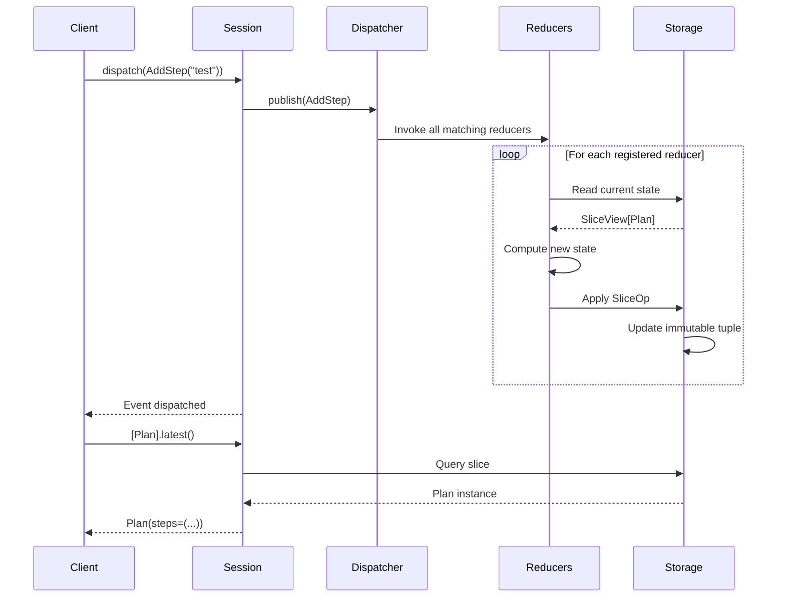
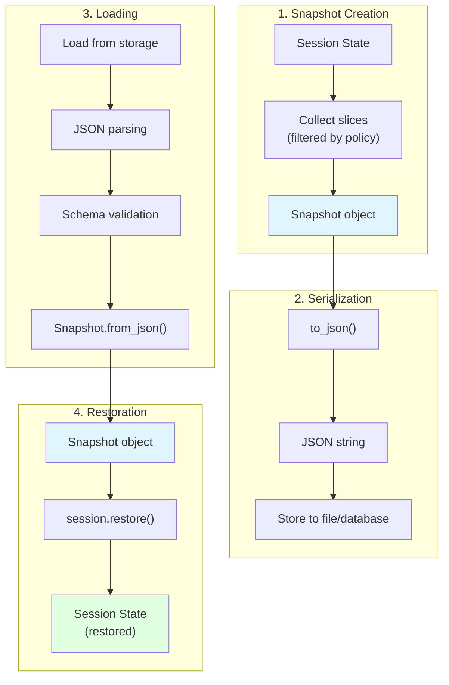
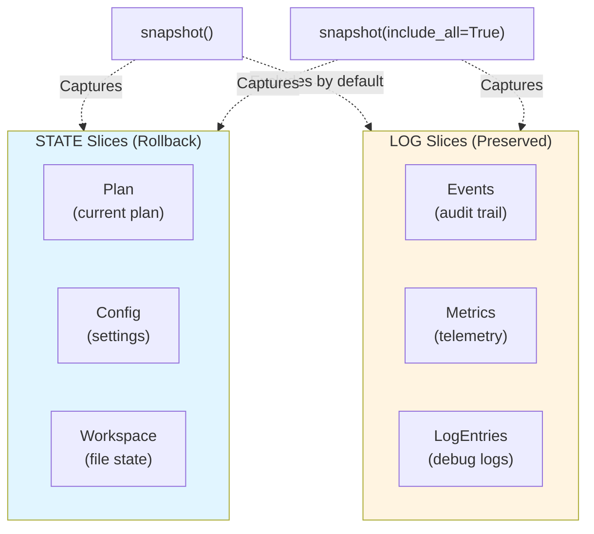
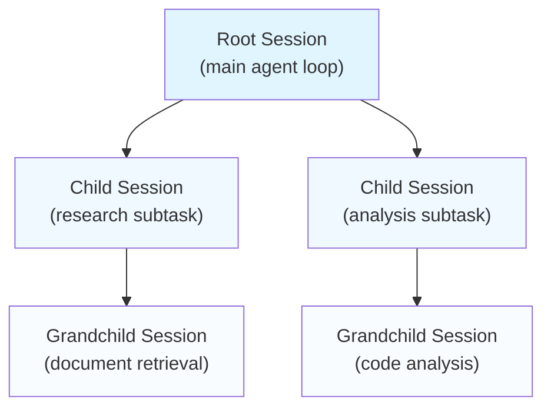

# Chapter 5: Sessions

> **Canonical Reference**: See [specs/SESSIONS.md](/specs/SESSIONS.md) for the complete specification.

## Introduction

A `Session` is WINK's answer to "agent memory"—but with a critical constraint:

> **Memory must be deterministic and inspectable.**

Most agent frameworks give you a mutable dictionary or database you modify directly. This works initially, but creates problems at scale:

- **Non-deterministic replays**: Can't reproduce bugs from production
- **Hidden side effects**: State changes scattered throughout the codebase
- **Poor observability**: No audit trail of what changed when
- **Difficult testing**: Hard to assert on state transitions

WINK takes a different approach inspired by Redux and event sourcing: **every state change flows through a pure reducer, and every mutation is recorded as an event**.

Sessions provide:

- **Typed memory slices** - Each dataclass type gets its own slice (`tuple[T, ...]`)
- **Pure reducers** - State transitions are deterministic, side-effect-free functions
- **Event-driven updates** - All mutations go through `dispatch()` for auditability
- **Snapshotting** - Capture and restore entire session state as JSON
- **Query API** - Read state with `latest()`, `all()`, and `where()` filters
- **Hierarchical organization** - Sessions form trees for nested orchestration

This chapter covers WINK's session system from fundamentals to advanced patterns.

## The Mental Model

Think of a session as a **time-series database for agent memory**:



**Key concepts:**

1. **Events** are dispatched through `session.dispatch(event)`
2. **Reducers** transform events into new slice values
3. **Slices** are immutable tuples stored by type
4. **Queries** read slice contents without mutation

The session never mutates state in place. Reducers return new tuples. This makes snapshots trivial (just serialize the current tuples) and restoration straightforward.

## Creating a Session

The minimal setup requires an event dispatcher:

```python
from weakincentives.runtime import Session, InProcessDispatcher

# Create event bus
bus = InProcessDispatcher()

# Create session
session = Session(bus=bus)
```

### Session Parameters

```python
from datetime import datetime, UTC
from uuid import uuid4

session = Session(
    bus=bus,                          # Event dispatcher (required)
    parent=parent_session,            # Parent session for hierarchies
    session_id=uuid4(),               # Unique ID (generated if omitted)
    created_at=datetime.now(UTC),     # Creation timestamp
    tags={"user": "alice", "env": "prod"},  # Metadata tags
)
```

### Session Properties

```python
# Access session metadata
session.dispatcher        # Event bus for telemetry
session.parent           # Parent session (or None)
session.children         # Tuple of child sessions
session.tags             # Metadata dictionary
session.session_id       # UUID identifier
session.created_at       # Creation timestamp
```

## Query API: Reading State

Access slice contents using the slice accessor `session[Type]`:

```python
from dataclasses import dataclass

@dataclass(slots=True, frozen=True)
class Fact:
    key: str
    value: str

# Get all items in the slice
facts: tuple[Fact, ...] = session[Fact].all()

# Get the most recent item (or None)
latest_fact: Fact | None = session[Fact].latest()

# Filter items with a predicate
recent_facts = session[Fact].where(lambda f: f.key.startswith("repo_"))

# Check if slice is empty
has_facts = session[Fact].exists()
```

### Query Methods

| Method | Return Type | Description |
|--------|-------------|-------------|
| `all()` | `tuple[T, ...]` | All items in the slice, in order |
| `latest()` | `T \| None` | Most recent item, or `None` if empty |
| `where(predicate)` | `tuple[T, ...]` | Items matching the predicate |
| `exists()` | `bool` | `True` if slice has any items |

All queries are read-only. They never mutate the session.

### Query Examples

```python
from dataclasses import dataclass

@dataclass(slots=True, frozen=True)
class Issue:
    id: int
    severity: str
    resolved: bool

# Find all high-severity unresolved issues
critical = session[Issue].where(
    lambda i: i.severity == "high" and not i.resolved
)

# Get the most recent issue
latest = session[Issue].latest()
if latest and latest.severity == "critical":
    print(f"Critical issue: {latest.id}")

# Count issues
all_issues = session[Issue].all()
print(f"Total issues: {len(all_issues)}")
```

## Reducers: Pure State Transitions

A **reducer** is a pure function that takes current state and an event, returning a new state:

```
new_state = reducer(current_state, event)
```

This pattern comes from functional programming (popularized by Redux). The core insight: **given the same inputs, you always get the same output**. This makes state changes predictable and debuggable—you can log every event and trace the exact sequence that led to any state.

### Reducer Signature

In WINK, reducers receive a `SliceView[S]` (read-only access to current values) and return a `SliceOp[S]` (describing the mutation to apply):

```python
from weakincentives.runtime.session import SliceView, SliceOp, Append

def my_reducer(state: SliceView[Plan], event: AddStep) -> SliceOp[Plan]:
    return Append(Plan(steps=(event.step,)))
```

### SliceOp Types

Reducers must return one of four operation types:



#### Append[T]

Add a single value to the slice. Most efficient for file-backed slices (append-only).

```python
from weakincentives.runtime.session import Append

@dataclass(slots=True, frozen=True)
class LogEntry:
    message: str
    timestamp: datetime

def log_reducer(state: SliceView[LogEntry], event: LogEntry) -> Append[LogEntry]:
    return Append(event)
```

#### Extend[T]

Add multiple values at once.

```python
from weakincentives.runtime.session import Extend

def batch_add_reducer(
    state: SliceView[Fact],
    event: BatchAddFacts,
) -> Extend[Fact]:
    return Extend(tuple(event.facts))
```

#### Replace[T]

Replace the entire slice with new values. Required when transforming existing state.

```python
from weakincentives.runtime.session import Replace

def replace_latest_reducer(
    state: SliceView[Plan],
    event: UpdatePlan,
) -> Replace[Plan]:
    # Keep only the new plan
    return Replace((event.new_plan,))
```

#### Clear[T]

Remove items from the slice. Optionally filter by predicate.

```python
from weakincentives.runtime.session import Clear

def clear_completed_reducer(
    state: SliceView[Task],
    event: ClearCompleted,
) -> Clear[Task]:
    # Remove only completed tasks
    return Clear(predicate=lambda t: t.completed)
```

### Registering Reducers

Register reducers for specific event types on a slice:

```python
from dataclasses import dataclass
from weakincentives.runtime.session import SliceView, Append

@dataclass(slots=True, frozen=True)
class Plan:
    steps: tuple[str, ...]

@dataclass(slots=True, frozen=True)
class AddStep:
    step: str

def add_step_reducer(state: SliceView[Plan], event: AddStep) -> Append[Plan]:
    current = state.latest()
    if current is None:
        return Append(Plan(steps=(event.step,)))

    # Create new plan with additional step
    new_plan = Plan(steps=(*current.steps, event.step))
    return Append(new_plan)

# Register the reducer
session[Plan].register(AddStep, add_step_reducer)

# Now dispatch events
session.dispatch(AddStep(step="Read README"))
session.dispatch(AddStep(step="Run tests"))

# Query the result
plan = session[Plan].latest()
assert plan is not None
assert plan.steps == ("Read README", "Run tests")
```

### Built-in Reducers

WINK provides common reducer patterns:

```python
from weakincentives.runtime.session import (
    append_all,
    replace_latest,
    replace_latest_by,
    upsert_by,
)

# Ledger semantics: always append (default for all slices)
session[Event].register(Event, append_all)

# Keep only the most recent value
session[Config].register(Config, replace_latest)

# Replace by key function
session[User].register(
    UserUpdate,
    replace_latest_by(key=lambda u: u.user_id)
)

# Insert or update by key
session[Document].register(
    DocumentUpdate,
    upsert_by(key=lambda d: d.doc_id)
)
```

### Reducer Flow



**Key points:**

1. Events are dispatched to **all registered reducers** for that event type
2. Reducers run synchronously on the dispatcher thread (keep them lightweight)
3. Each reducer receives a read-only view of current state
4. Reducer results are applied immediately to the slice
5. Queries see the updated state after dispatch completes

## Declarative Reducers with @reducer

For complex state slices with many event types, manually registering reducers becomes tedious:

```python
# Imperative style (verbose)
session[Plan].register(AddStep, add_step_reducer)
session[Plan].register(CompleteStep, complete_step_reducer)
session[Plan].register(UpdateStep, update_step_reducer)
session[Plan].register(RemoveStep, remove_step_reducer)
```

The `@reducer` decorator provides a cleaner, declarative style by co-locating reducers as methods on the dataclass:

```python
from dataclasses import dataclass, replace
from weakincentives.runtime.session import reducer, Replace

# Event types
@dataclass(slots=True, frozen=True)
class AddStep:
    step: str

@dataclass(slots=True, frozen=True)
class CompleteStep:
    pass

# Declarative state slice
@dataclass(slots=True, frozen=True)
class AgentPlan:
    steps: tuple[str, ...]
    current_step: int = 0

    @reducer(on=AddStep)
    def add_step(self, event: AddStep) -> Replace["AgentPlan"]:
        """Add a new step to the plan."""
        return Replace((
            replace(self, steps=(*self.steps, event.step)),
        ))

    @reducer(on=CompleteStep)
    def complete_step(self, event: CompleteStep) -> Replace["AgentPlan"]:
        """Mark current step as complete and advance."""
        return Replace((
            replace(self, current_step=self.current_step + 1),
        ))
```

### Installing Declarative Slices

Use `session.install()` to auto-register all `@reducer` methods:

```python
# Install the slice (registers all @reducer methods)
session.install(AgentPlan)

# Seed initial state
session[AgentPlan].seed(AgentPlan(steps=("Research", "Implement")))

# Dispatch events - reducers are automatically invoked
session.dispatch(CompleteStep())

# Query result
plan = session[AgentPlan].latest()
assert plan is not None
assert plan.current_step == 1  # Advanced to next step
```

### Initial State Factory

Provide an `initial` factory to auto-initialize empty slices:

```python
@dataclass(slots=True, frozen=True)
class Counters:
    count: int = 0

    @reducer(on=Increment)
    def increment(self, event: Increment) -> Replace["Counters"]:
        return Replace((
            replace(self, count=self.count + event.amount),
        ))

# Install with initial factory
session.install(Counters, initial=lambda: Counters(count=0))

# Can now dispatch without seeding
session.dispatch(Increment(amount=5))
assert session[Counters].latest().count == 5
```

### Reducer Method Signature

Reducer methods must follow this pattern:

```python
@reducer(on=EventType)
def method_name(self, event: EventType) -> Replace[SelfType]:
    """
    self: Current state (most recent value in slice)
    event: Dispatched event instance
    Returns: Replace[T] with new state tuple
    """
    return Replace((new_instance,))
```

**Important constraints:**

- The class must be a **frozen dataclass**
- Event types must be **defined before** the slice class
- Methods receive **only** `self` and `event` (no `context` parameter)
- Methods must return **`Replace[T]`** wrapping a tuple of new state
- Each event type may have **at most one** reducer method per slice

### When to Use Declarative Reducers

**Use `@reducer` methods when:**

- **Multiple event types** - The slice handles several distinct events with custom logic
- **Complex transformations** - Reducers need access to slice state to compute updates
- **Domain modeling** - The slice represents a domain concept with defined behaviors
- **Co-location** - You want reducer logic close to the data it operates on

**Use built-in reducers when:**

- **Event ledgers** - Recording every event unconditionally (`append_all`)
- **Latest-wins semantics** - Only the most recent value matters (`replace_latest`)
- **Key-based updates** - Upserting by a derived key (`upsert_by`, `replace_latest_by`)
- **Simple patterns** - The logic is generic and doesn't need custom code

### Example: Task Management

```python
from dataclasses import dataclass, replace
from weakincentives.runtime.session import reducer, Replace

# Events
@dataclass(slots=True, frozen=True)
class CreateTask:
    task_id: str
    description: str

@dataclass(slots=True, frozen=True)
class MarkComplete:
    task_id: str

@dataclass(slots=True, frozen=True)
class AddNote:
    task_id: str
    note: str

# State slice with declarative reducers
@dataclass(slots=True, frozen=True)
class Task:
    task_id: str
    description: str
    completed: bool = False
    notes: tuple[str, ...] = ()

    @reducer(on=MarkComplete)
    def mark_complete(self, event: MarkComplete) -> Replace["Task"]:
        if self.task_id == event.task_id:
            return Replace((replace(self, completed=True),))
        return Replace((self,))  # No change

    @reducer(on=AddNote)
    def add_note(self, event: AddNote) -> Replace["Task"]:
        if self.task_id == event.task_id:
            return Replace((replace(self, notes=(*self.notes, event.note)),))
        return Replace((self,))  # No change

# Usage
session.install(Task, initial=lambda: Task(task_id="", description=""))

session.dispatch(CreateTask(task_id="1", description="Write docs"))
session.dispatch(AddNote(task_id="1", note="Started draft"))
session.dispatch(MarkComplete(task_id="1"))

task = session[Task].latest()
assert task is not None
assert task.completed
assert len(task.notes) == 1
```

## Dispatch: The Unified Mutation Surface

All session mutations go through `dispatch()` for auditability and consistency:

```python
# Dispatch custom events
session.dispatch(AddStep(step="Implement feature"))
session.dispatch(UpdateConfig(setting="debug", value=True))

# System events (handled specially by the session)
session.dispatch(InitializeSlice(Plan, (initial_plan,)))
session.dispatch(ClearSlice(Task, predicate=lambda t: t.completed))
```

### Broadcast Semantics

When you dispatch an event, **all registered reducers** for that event type are invoked:

```python
# Register multiple reducers for the same event
session[Plan].register(TaskAssigned, update_plan_reducer)
session[Metrics].register(TaskAssigned, update_metrics_reducer)
session[Audit].register(TaskAssigned, log_audit_reducer)

# Dispatch - all three reducers run
session.dispatch(TaskAssigned(task_id="123", assignee="alice"))
```

This enables clean separation of concerns: different slices can react to the same events independently.

### System Mutation Events

WINK provides system events for common operations:

#### InitializeSlice

Replace all values in a slice:

```python
from weakincentives.runtime.session import InitializeSlice

# Replace entire slice with new values
session.dispatch(InitializeSlice(Plan, (initial_plan,)))

# Convenience method (equivalent)
session[Plan].seed(initial_plan)
```

#### ClearSlice

Remove items from a slice:

```python
from weakincentives.runtime.session import ClearSlice

# Clear all items
session.dispatch(ClearSlice(Task))

# Clear items matching predicate
session.dispatch(ClearSlice(
    Task,
    predicate=lambda t: t.completed
))

# Convenience methods (equivalent)
session[Task].clear()
session[Task].clear(lambda t: t.completed)
```

### Slice Accessor Methods

For convenience, slice accessors provide methods that dispatch events internally:

| Method | Dispatches | Description |
|--------|-----------|-------------|
| `seed(values)` | `InitializeSlice` | Initialize or replace the slice |
| `clear()` | `ClearSlice` | Remove all items |
| `clear(predicate)` | `ClearSlice` | Remove matching items |
| `append(value)` | Custom event | Shorthand for dispatching |
| `register(type, reducer)` | _(none)_ | Register a reducer |

```python
# These are equivalent:
session[Plan].seed(initial_plan)
session.dispatch(InitializeSlice(Plan, (initial_plan,)))

# These are equivalent:
session[Task].clear(lambda t: t.completed)
session.dispatch(ClearSlice(Task, predicate=lambda t: t.completed))
```

### Session-Wide Mutations

Some operations affect the entire session:

```python
# Clear all slices (preserves reducer registrations)
session.reset()

# Restore from snapshot (replaces all slices)
session.restore(snapshot)
```

## Snapshots: Capture and Restore

Sessions can be snapshotted and restored, enabling powerful debugging and fault-tolerance patterns.

### Creating Snapshots

```python
# Capture current state
snapshot = session.snapshot()

# Serialize to JSON string
json_str = snapshot.to_json()

# Save to file
from pathlib import Path
Path("session.json").write_text(json_str)
```

### Restoring Snapshots

```python
# Load from JSON
from weakincentives.runtime.session import Snapshot

json_str = Path("session.json").read_text()
snapshot = Snapshot.from_json(json_str)

# Restore session state
session.restore(snapshot)

# Query restored state
plan = session[Plan].latest()
```

### Snapshot Lifecycle



### Use Cases

**Flight recorder for debugging:**

```python
from pathlib import Path

# Save snapshot after each major operation
snapshot_dir = Path("debug/snapshots")
snapshot_dir.mkdir(exist_ok=True)

counter = 0
def save_debug_snapshot():
    global counter
    counter += 1
    snapshot = session.snapshot()
    path = snapshot_dir / f"step-{counter:03d}.json"
    path.write_text(snapshot.to_json())

# Use during development
session.dispatch(SetupEnvironment())
save_debug_snapshot()  # step-001.json

session.dispatch(RunAnalysis())
save_debug_snapshot()  # step-002.json

session.dispatch(GenerateReport())
save_debug_snapshot()  # step-003.json
```

**Rollback on errors:**

```python
# Save checkpoint before risky operation
checkpoint = session.snapshot()

try:
    # Attempt complex operation
    session.dispatch(StartTransaction())
    session.dispatch(ModifyState())
    session.dispatch(CommitChanges())
except Exception as e:
    # Rollback on failure
    logging.error(f"Operation failed: {e}")
    session.restore(checkpoint)
```

**Attach to bug reports:**

```python
def report_bug(error: Exception):
    # Include snapshot in bug report
    snapshot = session.snapshot()

    bug_report = {
        "error": str(error),
        "timestamp": datetime.now(UTC).isoformat(),
        "session_snapshot": snapshot.to_json(),
    }

    # Send to error tracking service
    send_to_bugtracker(bug_report)
```

### Serialization Format

Snapshots serialize to JSON with the following structure:

```json
{
  "version": "1.0",
  "session_id": "550e8400-e29b-41d4-a716-446655440000",
  "created_at": "2024-01-15T10:30:00Z",
  "slices": [
    {
      "type": "myapp.models:Plan",
      "policy": "STATE",
      "items": [
        {
          "steps": ["Research", "Implement", "Test"],
          "current_step": 1
        }
      ]
    },
    {
      "type": "myapp.models:LogEntry",
      "policy": "LOG",
      "items": [
        {"message": "Started", "timestamp": "2024-01-15T10:25:00Z"},
        {"message": "Analysis complete", "timestamp": "2024-01-15T10:28:00Z"}
      ]
    }
  ]
}
```

**Key properties:**

- **version** - Schema version for compatibility checking
- **session_id** - UUID of the session
- **created_at** - Snapshot creation timestamp (ISO 8601)
- **slices** - Array of typed slices with their items
- **type** - Fully qualified type name (`"module:Class"`)
- **policy** - Slice policy (`"STATE"` or `"LOG"`)

### Error Handling

```python
from weakincentives.runtime.session import (
    SnapshotSerializationError,
    SnapshotRestoreError,
)

# Serialization errors
try:
    snapshot.to_json()
except SnapshotSerializationError as e:
    # Unsupported types or unserializable payloads
    logging.error(f"Cannot serialize: {e}")

# Restore errors
try:
    session.restore(snapshot)
except SnapshotRestoreError as e:
    # Incompatible schema or missing types
    logging.error(f"Cannot restore: {e}")
```

## SlicePolicy: State vs. Logs

Not all slices should roll back the same way. WINK distinguishes between:

- **`SlicePolicy.STATE`** - Working state that should be restored on rollback
- **`SlicePolicy.LOG`** - Append-only history that should be preserved



### Default Behavior

By default, `session.snapshot()` captures **only `STATE` slices**:

```python
# Captures only STATE slices (default)
snapshot = session.snapshot()

# Excludes LOG slices by default
# - Event history preserved in session
# - Only working state captured
```

### Including All Slices

To capture everything (including logs):

```python
# Capture STATE + LOG slices
snapshot = session.snapshot(include_all=True)
```

### Setting Slice Policy

Configure policy when registering reducers:

```python
from weakincentives.runtime.session import SlicePolicy

# STATE slice (default) - included in snapshots
session[Plan].set_policy(SlicePolicy.STATE)
session[Plan].register(Plan, replace_latest)

# LOG slice - excluded by default
session[AuditEvent].set_policy(SlicePolicy.LOG)
session[AuditEvent].register(AuditEvent, append_all)
```

### Why This Matters

When debugging, you often want to:

1. **Preserve the full event log** even when rolling back working state
2. **Restore working state** to a known-good checkpoint
3. **Keep audit trails intact** for compliance and debugging

Example:

```python
# Setup slices
session[Plan].set_policy(SlicePolicy.STATE)      # Working state
session[Event].set_policy(SlicePolicy.LOG)       # Audit log

# Do work
session.dispatch(CreatePlan())
session.dispatch(AuditEvent("plan_created"))
checkpoint = session.snapshot()  # Saves Plan, not Event

session.dispatch(ModifyPlan())
session.dispatch(AuditEvent("plan_modified"))

# Error occurs - rollback working state
session.restore(checkpoint)

# Result:
# - Plan is restored to checkpoint
# - Event log still has both audit events
```

### Best Practices

**Use `STATE` policy for:**
- Plans and task lists
- Configuration settings
- File system state
- Model outputs and intermediate results

**Use `LOG` policy for:**
- Audit events
- Telemetry metrics
- Debug log entries
- Tool invocation history

## Session Hierarchy

Sessions form a tree structure for nested orchestration:



### Creating Child Sessions

```python
# Create parent session
parent_session = Session(bus=bus)

# Create child session
child_session = Session(bus=bus, parent=parent_session)

# Access relationship
assert child_session.parent is parent_session
assert child_session in parent_session.children
```

### Traversing the Hierarchy

```python
from weakincentives.runtime.session import iter_sessions_bottom_up

# Traverse from leaves up to root
for session in iter_sessions_bottom_up(root_session):
    snapshot = session.snapshot()
    print(f"Session {session.session_id}: {len(snapshot.slices)} slices")
```

### Use Cases

**Nested task decomposition:**

```python
def execute_subtask(parent: Session, task: Task) -> Result:
    # Create isolated session for subtask
    child = Session(bus=parent.dispatcher, parent=parent)

    # Execute subtask in child session
    child.dispatch(SetupTask(task))
    result = run_subtask_loop(child)

    # Bubble up results to parent
    parent.dispatch(SubtaskComplete(task_id=task.id, result=result))

    return result
```

**Hierarchical snapshots:**

```python
def save_full_tree(root: Session):
    snapshots = []
    for session in iter_sessions_bottom_up(root):
        snapshots.append(session.snapshot())

    # Save all snapshots
    return {"root": snapshots[-1], "children": snapshots[:-1]}
```

## Integration with Prompts and Adapters

Sessions integrate seamlessly with WINK's prompt and adapter systems (see [Chapter 3: Prompts](03-prompts.md) and [Chapter 6: Adapters](06-adapters.md)).

### Passing Sessions to Adapters

```python
from weakincentives.adapters.openai import OpenAIAdapter

adapter = OpenAIAdapter(model="gpt-4")
session = Session(bus=bus)

# Session receives telemetry events
prompt = Prompt(template).bind(params)

with prompt.resources:
    response = adapter.evaluate(prompt, session=session)

# Query session for telemetry
from weakincentives.runtime.events import ToolInvoked, PromptExecuted

tool_calls = session[ToolInvoked].all()
executions = session[PromptExecuted].all()

print(f"Tools invoked: {len(tool_calls)}")
print(f"Prompts executed: {len(executions)}")
```

### Session-Aware Sections

Some sections require session access (see [Chapter 3: Session-Bound Sections](03-prompts.md#session-bound-sections-and-cloning)):

```python
from weakincentives.contrib.tools import PlanningToolsSection, VfsToolsSection

def build_prompt_template(*, session: Session) -> PromptTemplate[Any]:
    return PromptTemplate(
        ns="agent",
        key="task",
        sections=(
            MarkdownSection(
                title="Instructions",
                key="instructions",
                template="Complete the task step by step.",
            ),
            PlanningToolsSection(session=session),  # Requires session
            VfsToolsSection(session=session),        # Requires session
        ),
    )
```

### Tool Handlers and Session Access

Tool handlers receive sessions via `ToolContext`:

```python
from weakincentives.prompt import Tool, ToolContext, ToolResult

def my_handler(params: MyParams, *, context: ToolContext) -> ToolResult[str]:
    # Access session from context
    session = context.session

    # Query session state
    plan = session[Plan].latest()
    if plan is None:
        return ToolResult.error("No plan found")

    # Dispatch events
    session.dispatch(ToolInvoked(name="my_tool", params=params))

    return ToolResult.ok("Success")
```

## Best Practices

### 1. Keep Reducers Pure and Lightweight

Reducers run synchronously on the dispatcher thread. Avoid:

- ❌ Network calls
- ❌ File I/O
- ❌ Heavy computation
- ❌ Mutable state

Prefer:

- ✅ Simple data transformations
- ✅ Immutable operations
- ✅ Fast, deterministic logic

```python
# Bad: Side effects in reducer
def bad_reducer(state: SliceView[Plan], event: AddStep) -> Append[Plan]:
    # DON'T DO THIS
    requests.post("https://api.example.com/log", json={"step": event.step})
    return Append(Plan(steps=(event.step,)))

# Good: Pure transformation
def good_reducer(state: SliceView[Plan], event: AddStep) -> Append[Plan]:
    return Append(Plan(steps=(event.step,)))
```

### 2. Use Meaningful Slice Policies

Be intentional about `STATE` vs. `LOG`:

```python
# State that should rollback
session[Plan].set_policy(SlicePolicy.STATE)
session[Config].set_policy(SlicePolicy.STATE)
session[Workspace].set_policy(SlicePolicy.STATE)

# Logs that should persist
session[AuditEvent].set_policy(SlicePolicy.LOG)
session[Metric].set_policy(SlicePolicy.LOG)
session[ToolInvoked].set_policy(SlicePolicy.LOG)
```

### 3. Snapshot Regularly During Development

Save snapshots at key milestones:

```python
def checkpoint(name: str):
    snapshot = session.snapshot()
    Path(f"debug/{name}.json").write_text(snapshot.to_json())

# Use during development
session.dispatch(SetupEnvironment())
checkpoint("01-setup")

session.dispatch(RunAnalysis())
checkpoint("02-analysis")

session.dispatch(GenerateReport())
checkpoint("03-report")
```

### 4. Use Declarative Reducers for Domain Models

When a slice has complex behavior, co-locate logic with data:

```python
# Good: Domain model with co-located reducers
@dataclass(slots=True, frozen=True)
class PullRequest:
    pr_id: str
    status: str
    approvals: tuple[str, ...] = ()

    @reducer(on=Approve)
    def approve(self, event: Approve) -> Replace["PullRequest"]:
        if event.pr_id == self.pr_id:
            new_approvals = (*self.approvals, event.reviewer)
            new_status = "approved" if len(new_approvals) >= 2 else self.status
            return Replace((replace(
                self,
                approvals=new_approvals,
                status=new_status,
            ),))
        return Replace((self,))
```

### 5. Query Before Dispatch

Check state before dispatching to avoid invalid transitions:

```python
# Bad: Dispatch blindly
session.dispatch(CompleteTask(task_id="123"))

# Good: Check state first
task = session[Task].latest()
if task and not task.completed:
    session.dispatch(CompleteTask(task_id=task.task_id))
```

### 6. Use Session Hierarchies for Isolation

Create child sessions for subtasks to maintain isolation:

```python
def execute_risky_operation(parent: Session) -> Result:
    # Create isolated session
    child = Session(bus=parent.dispatcher, parent=parent)

    try:
        # Execute in isolation
        result = run_operation(child)

        # Success - bubble up results
        parent.dispatch(OperationComplete(result=result))
        return result
    except Exception as e:
        # Failure - child state is discarded
        parent.dispatch(OperationFailed(error=str(e)))
        raise
```

### 7. Test Reducer Behavior

Write tests for reducer logic:

```python
def test_add_step_reducer():
    # Create test session
    session = Session(bus=InProcessDispatcher())
    session[Plan].register(AddStep, add_step_reducer)

    # Dispatch events
    session.dispatch(AddStep(step="First"))
    session.dispatch(AddStep(step="Second"))

    # Assert final state
    plan = session[Plan].latest()
    assert plan is not None
    assert plan.steps == ("First", "Second")
```

### 8. Handle Missing State Gracefully

Always check for `None` when querying:

```python
# Bad: Assumes state exists
plan = session[Plan].latest()
print(plan.steps)  # TypeError if None

# Good: Handle missing state
plan = session[Plan].latest()
if plan is None:
    print("No plan found")
else:
    print(f"Plan has {len(plan.steps)} steps")
```

## Common Patterns

### Pattern: Latest-Wins Singleton

Keep only the most recent value:

```python
from weakincentives.runtime.session import replace_latest

@dataclass(slots=True, frozen=True)
class Config:
    debug: bool
    timeout: int

session[Config].register(Config, replace_latest)

session.dispatch(Config(debug=False, timeout=30))
session.dispatch(Config(debug=True, timeout=60))

# Only the latest remains
assert session[Config].all() == (Config(debug=True, timeout=60),)
```

### Pattern: Append-Only Event Log

Record every event:

```python
from weakincentives.runtime.session import append_all

@dataclass(slots=True, frozen=True)
class AuditEvent:
    action: str
    timestamp: datetime

session[AuditEvent].set_policy(SlicePolicy.LOG)
session[AuditEvent].register(AuditEvent, append_all)

# All events are preserved
session.dispatch(AuditEvent("login", datetime.now(UTC)))
session.dispatch(AuditEvent("query", datetime.now(UTC)))
session.dispatch(AuditEvent("logout", datetime.now(UTC)))

assert len(session[AuditEvent].all()) == 3
```

### Pattern: Key-Based Upsert

Maintain a collection keyed by ID:

```python
from weakincentives.runtime.session import upsert_by

@dataclass(slots=True, frozen=True)
class User:
    user_id: str
    name: str
    email: str

session[User].register(
    User,
    upsert_by(key=lambda u: u.user_id)
)

session.dispatch(User("1", "Alice", "alice@example.com"))
session.dispatch(User("2", "Bob", "bob@example.com"))
session.dispatch(User("1", "Alice Updated", "newemail@example.com"))

# User 1 was updated, User 2 remains
users = session[User].all()
assert len(users) == 2
assert users[0].name == "Alice Updated"
```

### Pattern: Conditional Updates

Only update if certain conditions are met:

```python
@dataclass(slots=True, frozen=True)
class Counter:
    count: int
    max_count: int

    @reducer(on=Increment)
    def increment(self, event: Increment) -> Replace["Counter"]:
        if self.count < self.max_count:
            return Replace((replace(self, count=self.count + 1),))
        return Replace((self,))  # No change - at max
```

### Pattern: Filtered Clear

Remove items matching a condition:

```python
# Clear completed tasks
session[Task].clear(lambda t: t.completed)

# Clear old entries
cutoff = datetime.now(UTC) - timedelta(days=7)
session[LogEntry].clear(lambda e: e.timestamp < cutoff)
```

## Summary

WINK's session system provides:

- **Deterministic memory** - Pure reducers ensure reproducible state transitions
- **Event-driven updates** - All mutations flow through `dispatch()` for auditability
- **Typed slices** - Each dataclass type gets its own immutable tuple
- **Rich query API** - Access state with `latest()`, `all()`, and `where()`
- **SliceOp types** - `Append`, `Extend`, `Replace`, `Clear` for precise control
- **Declarative reducers** - Co-locate logic with data using `@reducer`
- **Snapshotting** - Capture and restore entire session state as JSON
- **Slice policies** - Distinguish working state (`STATE`) from logs (`LOG`)
- **Hierarchical organization** - Sessions form trees for nested orchestration

The session is the foundation of WINK's deterministic architecture. Every state change is explicit, auditable, and reproducible—making agent behavior predictable and debuggable at scale.

## Next Steps

- **[Chapter 4: Tools](04-tools.md)** - Learn about sandboxed, deterministic tool execution
- **[Chapter 6: Adapters](06-adapters.md)** - Integrate with OpenAI, Anthropic, and other providers
- **[Chapter 7: Main Loop](07-main-loop.md)** - Orchestrate long-running agent execution
- **[Chapter 11: Prompt Optimization](11-prompt-optimization.md)** - Use sessions for A/B testing prompts
- **[Chapter 13: Debugging](13-debugging.md)** - Inspect snapshots in the debug UI

---

**Canonical Reference**: See [specs/SESSIONS.md](/specs/SESSIONS.md) for the complete specification, including event system details, deadline enforcement, budget tracking, and snapshot serialization format.
