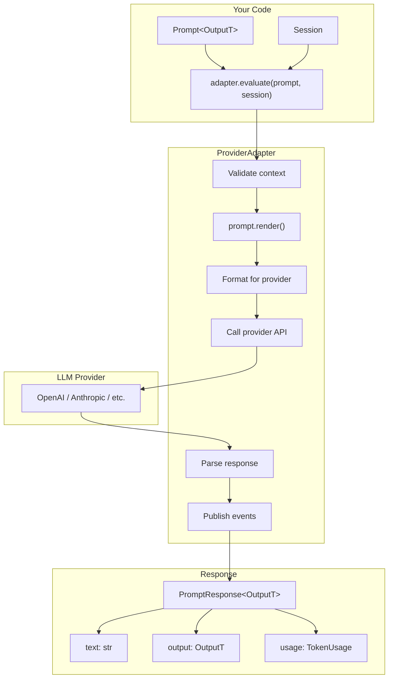
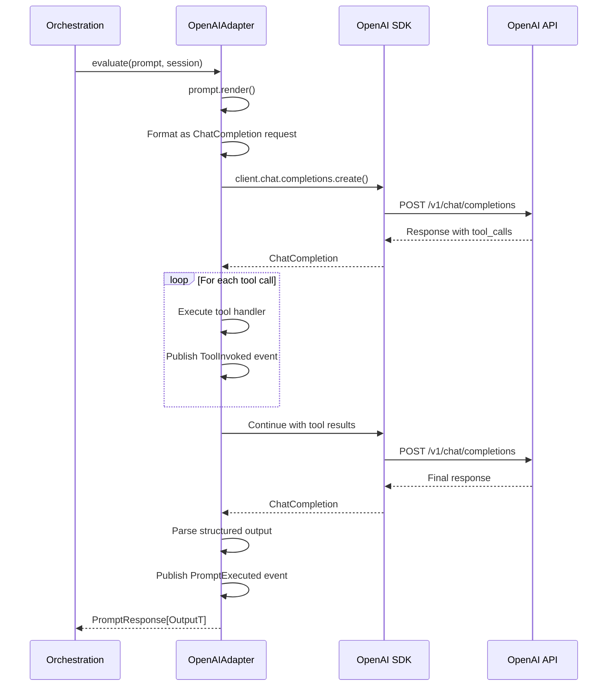
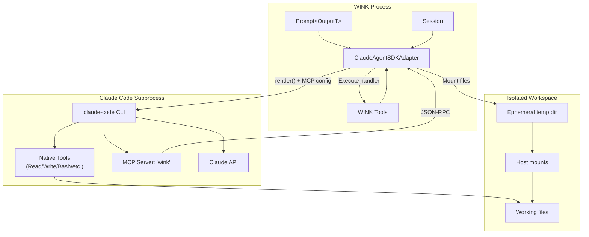
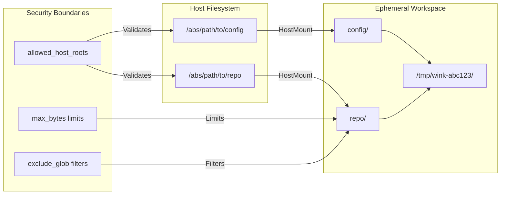
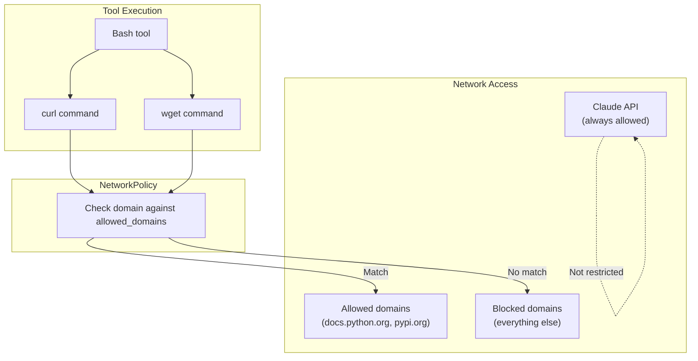
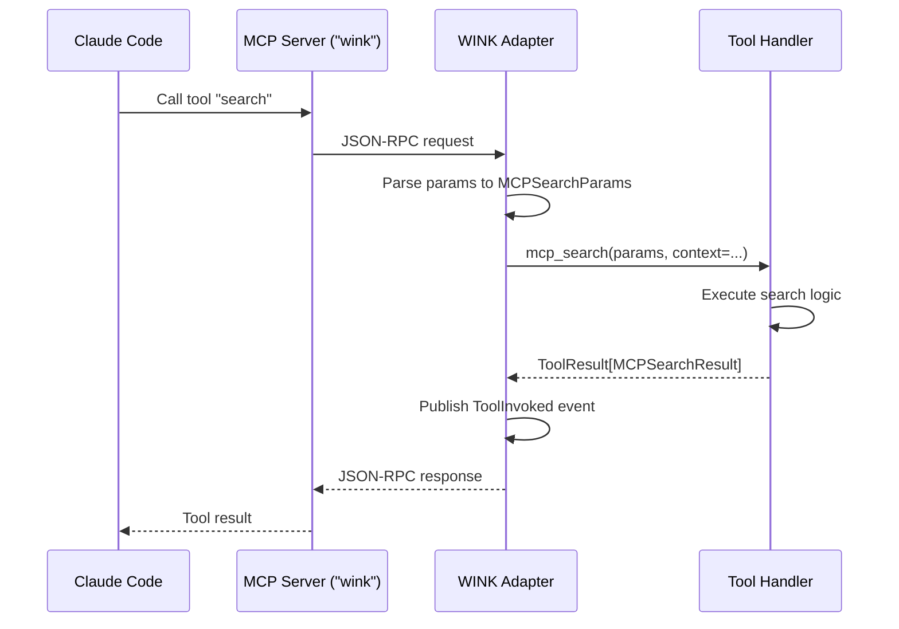
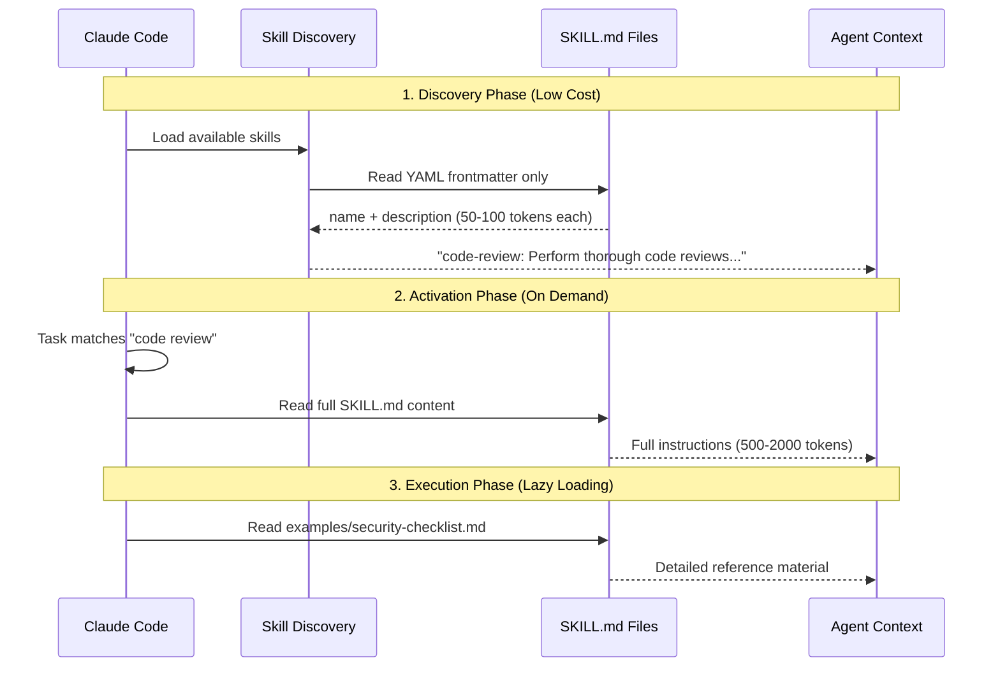
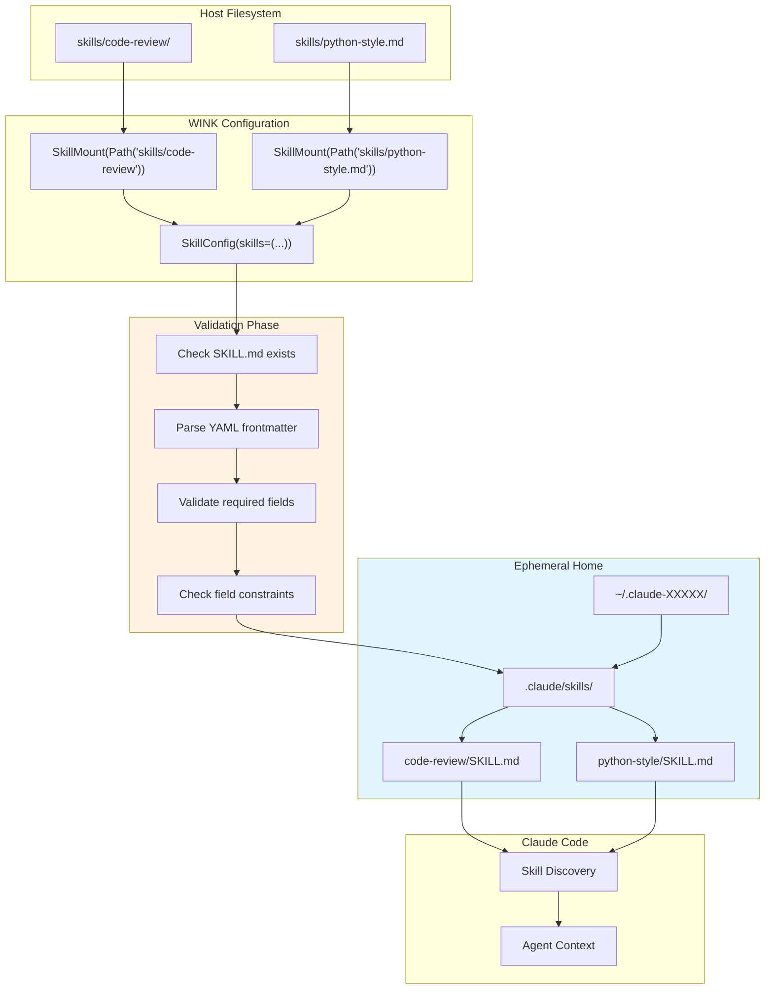
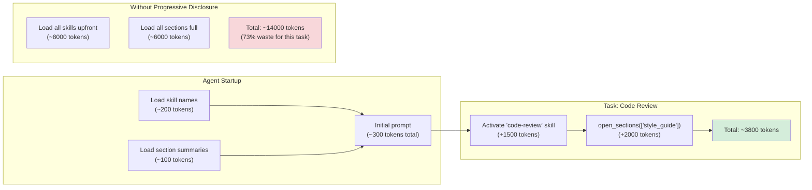

# Chapter 6: Adapters

> **Canonical Reference**: See [specs/ADAPTERS.md](../specs/ADAPTERS.md) and [specs/CLAUDE_AGENT_SDK.md](../specs/CLAUDE_AGENT_SDK.md) for the complete specifications.

## Introduction

Provider adapters are the bridge between WINK's type-safe prompt abstraction and external LLM services. They transform your high-level prompts into provider-specific API calls while keeping your orchestration code completely provider-agnostic.

The adapter layer handles everything you don't want to think about:

- **Request formatting**: Converting prompts to provider wire formats
- **Tool schema translation**: Exposing WINK tools in provider-native schemas
- **Response parsing**: Extracting structured output and tool calls
- **Error recovery**: Retry logic, rate limiting, and deadline enforcement
- **Observability**: Publishing telemetry events for monitoring and debugging

Most importantly, adapters enforce **consistent semantics across providers**. Whether you're using OpenAI, LiteLLM, or Claude Code, the same prompt produces the same logical behavior. Provider differences—API quirks, schema formats, tool execution models—stay encapsulated in the adapter.

### Why Adapters Matter

Without adapters, you'd write code like this:

```python
# Brittle: tightly coupled to OpenAI's API
response = openai.ChatCompletion.create(
    model="gpt-4o",
    messages=[{"role": "user", "content": "..."}],
    tools=[...],  # Manual schema conversion
)
# Parse response, handle tool calls, extract structured output...
```

With adapters, you write this:

```python
# Clean: provider-agnostic orchestration
response = adapter.evaluate(prompt, session=session)
output = response.output  # Typed dataclass
```

The adapter handles all the messy details. Your orchestration code stays focused on **what** the agent should do, not **how** to call the API.

## Architecture Overview



The adapter lifecycle has six distinct phases:

1. **Validate context**: Ensure the prompt is within its resource context manager
2. **Render**: Call `prompt.render()` to produce markdown, tools, and output schema
3. **Format**: Convert the rendered prompt to the provider's wire format
4. **Execute**: Make the API call with deadline and budget enforcement
5. **Parse**: Extract assistant text, tool calls, and structured output
6. **Emit**: Publish telemetry events (`PromptRendered`, `ToolInvoked`, `PromptExecuted`)

This separation ensures that adapters are **composable**—you can swap providers without changing orchestration logic—and **observable**—every adapter decision is logged to the session dispatcher.

## The ProviderAdapter Protocol

All adapters implement the `ProviderAdapter` protocol:

```python
from weakincentives.adapters import ProviderAdapter
from weakincentives.prompt import Prompt
from weakincentives.runtime import Session
from weakincentives.runtime.session import Deadline, Budget, BudgetTracker

# Generic adapter interface
response = adapter.evaluate(
    prompt,                    # Prompt[OutputT] (must be in context manager)
    session=session,           # Session for state management
    deadline=...,              # Optional wall-clock deadline
    budget=...,                # Optional token/time budget limits
    budget_tracker=...,        # Optional shared budget tracker
)
```

### Return Value: PromptResponse[OutputT]

Every adapter returns a `PromptResponse[OutputT]` with:

- **`prompt_name: str`** - The template's fully qualified name (`ns.key`)
- **`text: str`** - Raw assistant response text
- **`output: OutputT | None`** - Parsed structured output (if declared)
- **`usage: TokenUsage`** - Token consumption stats (input/output/total)

The `OutputT` type parameter matches your `PromptTemplate[OutputT]`, giving you **compile-time type safety** for structured output.

```python
from dataclasses import dataclass
from weakincentives.prompt import PromptTemplate, MarkdownSection, Prompt

@dataclass(frozen=True)
class Summary:
    title: str
    key_points: list[str]

template = PromptTemplate[Summary](
    ns="review",
    key="summarize",
    sections=[...],
)

response = adapter.evaluate(Prompt(template), session=session)
# response.output is Summary | None (type-checked!)
if response.output:
    print(response.output.title)        # str
    print(response.output.key_points)   # list[str]
```

### Parameters Explained

#### `deadline: Deadline | None`

Enforces a wall-clock deadline for the entire evaluation. The adapter checks the deadline before each API call and raises `DeadlineExceededError` if time has run out.

```python
from weakincentives.runtime.session import Deadline
import datetime

# Give the evaluation 30 seconds
deadline = Deadline(
    expires_at=datetime.datetime.now(datetime.UTC) + datetime.timedelta(seconds=30)
)

response = adapter.evaluate(prompt, session=session, deadline=deadline)
```

#### `budget: Budget | None`

Limits token consumption or cost for this evaluation. The adapter tracks usage and raises `BudgetExceededError` when limits are hit.

```python
from weakincentives.runtime.session import Budget

# Limit to 1000 tokens total
budget = Budget(max_tokens=1000)

response = adapter.evaluate(prompt, session=session, budget=budget)
```

#### `budget_tracker: BudgetTracker | None`

Shares budget tracking across multiple evaluations. This is essential for multi-turn agents or evaluation loops.

```python
from weakincentives.runtime.session import BudgetTracker, Budget

tracker = BudgetTracker(budget=Budget(max_tokens=5000))

# Each call deducts from the shared budget
for prompt in prompts:
    response = adapter.evaluate(prompt, session=session, budget_tracker=tracker)
    print(f"Used {tracker.total_tokens} / {tracker.budget.max_tokens} tokens")
```

### Resource Access

Adapters access resources **through the prompt's resource context**, not via a separate parameter. This enforces lifecycle discipline: resources are only available when the prompt is active.

```python
# Correct: prompt is within context manager
with prompt.resources:
    response = adapter.evaluate(prompt, session=session)
    # Adapter can access prompt.resources.get(Filesystem), etc.

# Incorrect: raises RuntimeError
response = adapter.evaluate(prompt, session=session)  # Prompt not in context!
```

See [Chapter 3: Prompts](03-prompts.md) for details on resource lifecycle management.

## OpenAI and LiteLLM Adapters

### OpenAIAdapter

The `OpenAIAdapter` targets the OpenAI Responses API using the official SDK. It handles tool calls synchronously—calling each tool and feeding results back to the model—and uses OpenAI's native JSON schema response format for structured output.

#### Installation

```bash
pip install "weakincentives[openai]"
```

#### Basic Usage

```python
from weakincentives.adapters.openai import OpenAIAdapter
from weakincentives.adapters import OpenAIClientConfig, OpenAIModelConfig

adapter = OpenAIAdapter(
    model="gpt-4.1-mini",
    client_config=OpenAIClientConfig(
        api_key="sk-...",        # Or set OPENAI_API_KEY env var
        timeout=30.0,
        max_retries=3,
    ),
    model_config=OpenAIModelConfig(
        temperature=0.7,
        max_tokens=800,
        top_p=0.95,
    ),
)

response = adapter.evaluate(prompt, session=session)
```

#### Configuration Reference

**OpenAIClientConfig** (connection settings):

| Field | Type | Default | Description |
|---------------|-----------------|---------|----------------------------------|
| `api_key` | `str \| None` | `None` | API key (falls back to env) |
| `base_url` | `str \| None` | `None` | Custom API endpoint |
| `organization` | `str \| None` | `None` | Organization ID |
| `timeout` | `float \| None` | `None` | Request timeout seconds |
| `max_retries` | `int \| None` | `None` | SDK-level retries |

**OpenAIModelConfig** (model parameters):

| Field | Type | Default | Description |
|--------------------|------------------|---------|----------------------------------|
| `temperature` | `float \| None` | `None` | Sampling temperature (0-2) |
| `max_tokens` | `int \| None` | `None` | Maximum tokens to generate |
| `top_p` | `float \| None` | `None` | Nucleus sampling threshold |
| `presence_penalty` | `float \| None` | `None` | Penalize new tokens (-2 to 2) |
| `frequency_penalty` | `float \| None` | `None` | Penalize repeated tokens (-2 to 2)|
| `stop` | `tuple[str, ...]`| `None` | Stop sequences |
| `seed` | `int \| None` | `None` | Deterministic sampling seed |

#### Request Flow



### LiteLLMAdapter

The `LiteLLMAdapter` uses [LiteLLM](https://docs.litellm.ai/) to provide a unified interface to many providers (OpenAI, Anthropic, Cohere, Bedrock, etc.). Use this when you want provider flexibility without changing code.

#### Installation

```bash
pip install "weakincentives[litellm]"
```

#### Basic Usage

```python
from weakincentives.adapters.litellm import LiteLLMAdapter
from weakincentives.adapters import LiteLLMClientConfig, LiteLLMModelConfig

adapter = LiteLLMAdapter(
    model="openai/gpt-4.1-mini",  # Provider prefix + model name
    completion_config=LiteLLMClientConfig(
        timeout=30.0,
        max_retries=3,
    ),
    model_config=LiteLLMModelConfig(
        temperature=0.7,
        max_tokens=800,
    ),
)

response = adapter.evaluate(prompt, session=session)
```

#### Switching Providers

LiteLLM's power is its provider abstraction. Switch providers by changing the model string:

```python
# OpenAI
adapter = LiteLLMAdapter(model="openai/gpt-4o")

# Anthropic
adapter = LiteLLMAdapter(model="anthropic/claude-3-5-sonnet-20241022")

# AWS Bedrock
adapter = LiteLLMAdapter(model="bedrock/anthropic.claude-3-5-sonnet-20241022-v2:0")

# Azure OpenAI
adapter = LiteLLMAdapter(model="azure/my-deployment")
```

See the [LiteLLM docs](https://docs.litellm.ai/docs/providers) for the full provider list.

#### Configuration Reference

**LiteLLMClientConfig** (connection settings):

| Field | Type | Default | Description |
|---------------|-----------------|---------|----------------------------------|
| `timeout` | `float \| None` | `None` | Request timeout seconds |
| `max_retries` | `int \| None` | `None` | Retry attempts |
| `api_base` | `str \| None` | `None` | Custom API endpoint |
| `api_key` | `str \| None` | `None` | API key (provider-specific) |

**LiteLLMModelConfig** (model parameters):

Same fields as `OpenAIModelConfig` (temperature, max_tokens, top_p, etc.). Not all providers support all parameters—LiteLLM handles translation and omits unsupported fields.

## Claude Agent SDK Adapter

The `ClaudeAgentSDKAdapter` is fundamentally different from OpenAI/LiteLLM adapters. Instead of WINK executing tools itself, **it delegates to Claude Code's native tool execution**. This gives you:

- **Claude's native tools**: Read, Write, Edit, Glob, Grep, Bash operate with full Claude Code intelligence
- **Workspace isolation**: Mount host files into ephemeral directories with security boundaries
- **MCP tool bridging**: Expose WINK tools to Claude Code as MCP tools
- **Hermetic execution**: Reproducible behavior independent of host `~/.claude` configuration

Think of it as **running Claude Code as a subprocess** while keeping prompt composition and session management in WINK.

### Architecture



Key differences from other adapters:

1. **Tool execution**: Claude Code executes tools (via Bash, etc.), WINK just bridges custom tools
2. **Workspace management**: WINK creates isolated temp directories and mounts host files
3. **Subprocess lifecycle**: Each evaluation spawns a fresh Claude Code subprocess
4. **Hermetic isolation**: Environment is controlled via `IsolationConfig`, not host state

### Installation

```bash
# Python package
pip install "weakincentives[claude-agent-sdk]"

# Claude Code CLI
npm install -g @anthropic-ai/claude-code

# Linux sandboxing (required for bubblewrap sandbox enforcement)
# Ubuntu/Debian: sudo apt install bubblewrap
# Fedora: sudo dnf install bubblewrap
```

### Basic Usage

The simplest usage requires minimal configuration:

```python
from dataclasses import dataclass
from weakincentives.adapters.claude_agent_sdk import ClaudeAgentSDKAdapter
from weakincentives.prompt import MarkdownSection, Prompt, PromptTemplate
from weakincentives.runtime import InProcessDispatcher, Session


@dataclass(frozen=True)
class Hello:
    message: str


session = Session(bus=InProcessDispatcher())

template = PromptTemplate[Hello](
    ns="demo",
    key="hello",
    sections=[
        MarkdownSection(
            title="Task",
            key="task",
            template="Say hello. Return JSON with a single field: message.",
        ),
    ],
)

response = ClaudeAgentSDKAdapter().evaluate(Prompt(template), session=session)
print(response.output)  # Hello(message="...")
```

This spawns a Claude Code subprocess with default settings:

- Model: `claude-sonnet-4-5-20250929`
- Permission mode: `bypassPermissions` (no interactive approvals)
- Isolation: Hermetic environment with no tool network access
- Working directory: Current directory

### Configuration

The adapter supports two configuration dataclasses: **ClaudeAgentSDKClientConfig** (SDK behavior) and **ClaudeAgentSDKModelConfig** (model parameters).

#### ClaudeAgentSDKClientConfig

Controls how the SDK subprocess operates:

```python
from weakincentives.adapters.claude_agent_sdk import (
    ClaudeAgentSDKAdapter,
    ClaudeAgentSDKClientConfig,
)

config = ClaudeAgentSDKClientConfig(
    permission_mode="bypassPermissions",  # "default", "acceptEdits", "plan", "bypassPermissions"
    cwd="/path/to/workspace",             # Working directory for SDK
    max_turns=10,                         # Limit conversation turns
    max_budget_usd=1.0,                   # Budget cap in USD
    suppress_stderr=True,                 # Hide CLI noise
    stop_on_structured_output=True,       # Stop after structured output
    betas=("feature-x",),                 # Enable beta features
)

adapter = ClaudeAgentSDKAdapter(client_config=config)
```

| Field | Default | Description |
|--------------------------|----------------------|---------------------------------------------------|
| `permission_mode` | `"bypassPermissions"` | Tool permission handling mode |
| `cwd` | `None` | Working directory (None = current directory) |
| `max_turns` | `None` | Max conversation turns (None = unlimited) |
| `max_budget_usd` | `None` | Budget cap in USD (None = unlimited) |
| `suppress_stderr` | `True` | Hide stderr from Claude Code CLI |
| `stop_on_structured_output` | `True` | Stop immediately after structured output |
| `isolation` | `None` | Custom isolation config (isolation always enabled) |
| `betas` | `None` | Beta feature identifiers to enable |

#### ClaudeAgentSDKModelConfig

Controls model-specific parameters:

```python
from weakincentives.adapters.claude_agent_sdk import (
    ClaudeAgentSDKAdapter,
    ClaudeAgentSDKModelConfig,
)

model_config = ClaudeAgentSDKModelConfig(
    model="claude-sonnet-4-5-20250929",
    max_thinking_tokens=4096,  # Extended thinking mode
)

adapter = ClaudeAgentSDKAdapter(model_config=model_config)
```

| Field | Default | Description |
|--------------------|----------------------------|--------------------------------------------------|
| `model` | `"claude-sonnet-4-5-20250929"` | Claude model identifier |
| `max_thinking_tokens` | `None` | Tokens for extended thinking (None = disabled) |

**Note**: The SDK does not support `seed`, `stop`, `presence_penalty`, or `frequency_penalty`. Providing these raises `ValueError`.

### Workspace Management

The `ClaudeAgentWorkspaceSection` creates an isolated workspace with host files mounted in. Claude Code's native tools (Read, Write, Edit, Glob, Grep, Bash) operate on this workspace.



#### Basic Workspace Example

```python
from weakincentives.adapters.claude_agent_sdk import (
    ClaudeAgentWorkspaceSection,
    HostMount,
)
from weakincentives.runtime import InProcessDispatcher, Session

session = Session(bus=InProcessDispatcher())

workspace = ClaudeAgentWorkspaceSection(
    session=session,
    mounts=(
        HostMount(
            host_path="/abs/path/to/repo",
            mount_path="repo",                           # Appears as "repo/" in workspace
            exclude_glob=(".git/*", "*.pyc", "__pycache__/*"),
            max_bytes=5_000_000,                         # 5MB limit
        ),
    ),
    allowed_host_roots=("/abs/path/to",),  # Security boundary
)

# workspace.temp_dir is the path to pass as cwd
# workspace.cleanup() removes the temp directory when done
```

#### HostMount Configuration

**HostMount** attributes:

| Field | Default | Description |
|-----------------|---------|--------------------------------------------------|
| `host_path` | required | Absolute or relative path to host file/directory |
| `mount_path` | `None` | Relative path in temp dir (default: basename) |
| `include_glob` | `()` | Patterns to include (empty = all) |
| `exclude_glob` | `()` | Patterns to exclude |
| `max_bytes` | `None` | Maximum bytes to copy (None = unlimited) |
| `follow_symlinks` | `False` | Whether to follow symlinks when copying |

#### Security Guarantees

The workspace system enforces three security boundaries:

1. **allowed_host_roots**: Only paths within these roots can be mounted. Paths outside raise `WorkspaceSecurityError`.
2. **max_bytes**: Limits per-mount copy size. Exceeding raises `WorkspaceBudgetExceededError`.
3. **Ephemeral lifecycle**: The temp directory is created fresh for each evaluation and cleaned up afterward.

```python
# Security enforcement example
workspace = ClaudeAgentWorkspaceSection(
    session=session,
    mounts=(
        HostMount(
            host_path="/home/user/projects/repo",  # OK: within allowed root
            mount_path="repo",
        ),
        # HostMount(
        #     host_path="/etc/passwd",            # ERROR: outside allowed root!
        # ),
    ),
    allowed_host_roots=("/home/user/projects",),
)
```

#### Resource Integration

The workspace section automatically contributes a `Filesystem` resource that tools can access via `context.resources.get(Filesystem)`. This filesystem points to the ephemeral temp directory, keeping tools isolated from the host.

See [Chapter 4: Tools](04-tools.md) for details on tool resource access.

### Isolation Configuration

The adapter **always runs in hermetic isolation by default**. This prevents the SDK from accessing the host's `~/.claude` configuration, credentials, and session state—ensuring reproducible behavior regardless of the host environment.

The adapter automatically:

1. Creates an ephemeral `HOME` directory containing `.claude/settings.json`
2. Disables alternative providers (AWS Bedrock, etc.) to ensure Anthropic API usage
3. Passes the controlled environment to the SDK subprocess
4. Cleans up the ephemeral directory after execution

#### Why Isolation Matters

Without isolation, Claude Code reads settings from the host's `~/.claude/settings.json`. This can cause:

- **Non-reproducible behavior**: Different results on different machines
- **Credential leakage**: Tools accessing host credentials
- **Provider conflicts**: Unexpected provider routing (Bedrock, Azure, etc.)

Isolation guarantees that the SDK environment is **completely controlled by your code**.

#### Customizing Isolation

Use `IsolationConfig` to customize isolation behavior:

```python
from weakincentives.adapters.claude_agent_sdk import (
    ClaudeAgentSDKAdapter,
    ClaudeAgentSDKClientConfig,
    IsolationConfig,
    NetworkPolicy,
    SandboxConfig,
)

isolation = IsolationConfig(
    network_policy=NetworkPolicy.no_network(),  # Block tool network access
    sandbox=SandboxConfig(enabled=True),        # Enable OS-level sandboxing
    api_key="sk-ant-...",                       # Explicit API key
    include_host_env=False,                     # Don't inherit host env vars
)

adapter = ClaudeAgentSDKAdapter(
    client_config=ClaudeAgentSDKClientConfig(isolation=isolation),
)
```

**IsolationConfig** attributes:

| Field | Default | Description |
|-------------------|---------|------------------------------------------------------|
| `network_policy` | `None` | Network access constraints (None = no network) |
| `sandbox` | `None` | Sandbox configuration (None = secure defaults) |
| `env` | `None` | Additional env vars for SDK subprocess |
| `api_key` | `None` | API key (None = uses ANTHROPIC_API_KEY from env) |
| `include_host_env` | `False` | Inherit non-sensitive host env vars |
| `skills` | `None` | Skills to mount in hermetic environment |

### Network Policy

`NetworkPolicy` controls which network resources **tools** can access. This affects tools making outbound connections (curl, wget, etc.) but **not** the Claude API connection.



#### Network Policy Examples

```python
from weakincentives.adapters.claude_agent_sdk import NetworkPolicy

# Block all tool network access (default)
policy = NetworkPolicy.no_network()

# Allow specific domains
policy = NetworkPolicy.with_domains("docs.python.org", "pypi.org")

# Unrestricted (not recommended for production)
policy = NetworkPolicy(allowed_domains=("*",))
```

#### Use Cases

**Security-sensitive workloads** (code review, data analysis):

```python
# No tool network access prevents exfiltration
isolation = IsolationConfig(
    network_policy=NetworkPolicy.no_network(),
)
```

**Documentation agents** (fetch docs, search PyPI):

```python
# Allow specific domains
isolation = IsolationConfig(
    network_policy=NetworkPolicy.with_domains(
        "docs.python.org",
        "pypi.org",
        "github.com",
    ),
)
```

### Sandbox Configuration

`SandboxConfig` provides programmatic control over OS-level sandboxing (bubblewrap on Linux, seatbelt on macOS).

```python
from weakincentives.adapters.claude_agent_sdk import SandboxConfig

sandbox = SandboxConfig(
    enabled=True,                          # Enable OS-level sandboxing
    writable_paths=("/tmp/output",),       # Additional writable paths
    readable_paths=("/etc/ssl/certs",),    # Additional readable paths
    excluded_commands=("docker",),         # Commands that bypass sandbox
    allow_unsandboxed_commands=False,      # Require sandbox for all commands
    bash_auto_allow=True,                  # Auto-approve bash in sandbox mode
)
```

**SandboxConfig** attributes:

| Field | Default | Description |
|--------------------------|---------|--------------------------------------------------|
| `enabled` | `True` | Enable OS-level sandboxing |
| `writable_paths` | `()` | Paths the SDK can write beyond workspace |
| `readable_paths` | `()` | Additional readable paths beyond workspace |
| `excluded_commands` | `()` | Commands that bypass sandbox (use sparingly) |
| `allow_unsandboxed_commands` | `False` | Allow commands outside sandbox |
| `bash_auto_allow` | `True` | Auto-approve Bash when sandboxed |

### Skill Configuration

Mount skills into the hermetic environment. Skills are markdown files (`SKILL.md`) or directories containing a `SKILL.md` that provide domain-specific instructions to Claude Code.

Skills are copied to `~/.claude/skills/` in the ephemeral home before Claude Code starts, making them available for the entire session.

```python
from pathlib import Path
from weakincentives.adapters.claude_agent_sdk import (
    ClaudeAgentSDKAdapter,
    ClaudeAgentSDKClientConfig,
    IsolationConfig,
)
from weakincentives.skills import SkillConfig, SkillMount

# Mount a single skill from a file
isolation = IsolationConfig(
    skills=SkillConfig(
        skills=(
            SkillMount(source=Path("skills/code-review.md")),
        ),
    ),
)

# Mount multiple skills from directories
isolation = IsolationConfig(
    skills=SkillConfig(
        skills=(
            SkillMount(source=Path("demo-skills/code-review")),
            SkillMount(source=Path("demo-skills/ascii-art")),
            # Override the skill name
            SkillMount(source=Path("my-skill.md"), name="custom-name"),
            # Disable a skill without removing from config
            SkillMount(source=Path("experimental"), enabled=False),
        ),
        validate_on_mount=True,  # Default: validate SKILL.md presence
    ),
)

adapter = ClaudeAgentSDKAdapter(
    client_config=ClaudeAgentSDKClientConfig(isolation=isolation),
)
```

#### SkillMount Attributes

| Field | Default | Description |
|----------|---------|----------------------------------------------------------|
| `source` | — | Path to skill file (`.md`) or directory with `SKILL.md` |
| `name` | `None` | Override skill name (default: derived from source path) |
| `enabled` | `True` | Whether to mount this skill |

#### SkillConfig Attributes

| Field | Default | Description |
|---------------------|---------|----------------------------------------------|
| `skills` | `()` | Tuple of `SkillMount` instances |
| `validate_on_mount` | `True` | Validate skill structure before copying |

#### Skill Structure

A skill can be either:

1. **A markdown file** (e.g., `code-review.md`): Copied as `SKILL.md` into a directory named after the file (without extension)
2. **A directory** (e.g., `code-review/`): Must contain a `SKILL.md` file. The entire directory is copied, preserving structure.

**Validation** (when `validate_on_mount=True`):

- Directory skills must contain `SKILL.md`
- File skills must have `.md` extension
- Individual files limited to 1 MiB
- Total skill size limited to 10 MiB

#### Auto-Discovering Skills

```python
from pathlib import Path
from weakincentives.adapters.claude_agent_sdk import IsolationConfig
from weakincentives.skills import SkillConfig, SkillMount

SKILLS_ROOT = Path("demo-skills")

# Find all valid skill directories
skill_mounts = tuple(
    SkillMount(source=skill_dir)
    for skill_dir in SKILLS_ROOT.iterdir()
    if skill_dir.is_dir() and (skill_dir / "SKILL.md").exists()
)

isolation = IsolationConfig(
    skills=SkillConfig(skills=skill_mounts),
)
```

#### Creating a Skill

Create a `SKILL.md` file with instructions for Claude Code:

```markdown
# Code Review Skill

You are a thorough code reviewer. When reviewing code:

## Review Checklist

- [ ] Check for security vulnerabilities
- [ ] Verify error handling covers edge cases
- [ ] Ensure tests cover new functionality

## Output Format

1. **Summary**: One-paragraph overview
2. **Issues**: Problems found (severity: high/medium/low)
3. **Suggestions**: Non-blocking improvements
```

See `demo-skills/` in the repository for example skills. For more information about Claude Code skills, see [What are Skills?](https://agentskills.io/what-are-skills).

### Tool Bridging via MCP

WINK tools attached to prompt sections are automatically exposed to Claude Code as MCP tools under the server key `"wink"`. This lets you keep side effects and validation in Python while Claude uses the tools natively.



#### MCP Tool Example

```python
from dataclasses import dataclass
from weakincentives.adapters.claude_agent_sdk import ClaudeAgentSDKAdapter
from weakincentives.prompt import (
    MarkdownSection,
    Prompt,
    PromptTemplate,
    Tool,
    ToolContext,
    ToolResult,
)
from weakincentives.runtime import InProcessDispatcher, Session


@dataclass(frozen=True)
class MCPSearchParams:
    query: str


@dataclass(frozen=True)
class MCPSearchResult:
    matches: int

    def render(self) -> str:
        return f"Found {self.matches} matches"


def mcp_search(params: MCPSearchParams, *, context: ToolContext) -> ToolResult[MCPSearchResult]:
    # Your search logic here (database, API, etc.)
    # Access resources: fs = context.resources.get(Filesystem)
    # Access session: context.session[MySlice].latest()
    return ToolResult(message="ok", value=MCPSearchResult(matches=3))


mcp_search_tool = Tool[MCPSearchParams, MCPSearchResult](
    name="search",
    description="Search the internal index",
    handler=mcp_search,
)

session = Session(bus=InProcessDispatcher())

template = PromptTemplate[None](
    ns="demo",
    key="mcp-tool",
    sections=[
        MarkdownSection(
            title="Task",
            key="task",
            template="Use the search tool for query: weakincentives.",
            tools=(mcp_search_tool,),  # Tool attached here
        ),
    ],
)

response = ClaudeAgentSDKAdapter().evaluate(Prompt(template), session=session)
```

#### What Happens During Tool Calls

Each bridged tool call:

1. **Publishes a `ToolInvoked` event** to the session dispatcher for observability
2. **Executes within a transaction**: State changes roll back on failure (see [Chapter 5: Sessions](05-sessions.md))
3. **Has access to full `ToolContext`**: Including session, resources, deadline, budget tracker

Native Claude Code tools (Read, Write, Bash, etc.) are tracked via SDK hooks and also publish `ToolInvoked` events, giving you unified observability.

### Events

The adapter publishes these events to the session's dispatcher:

| Event | When | Fields |
|-----------------|----------------------------------|---------------------------------------|
| `PromptRendered` | After prompt render, before SDK | `rendered_prompt`, `adapter`, etc. |
| `ToolInvoked` | Each native + bridged tool call | `tool_name`, `params`, `result`, etc. |
| `PromptExecuted` | After completion | `result`, `usage` (TokenUsage) |

See [Chapter 5: Sessions](05-sessions.md) for details on event-driven state management.

### Complete Example: Secure Code Review

This example combines workspace management, isolation, and structured output for a secure code review agent:

```python
from dataclasses import dataclass
from weakincentives.adapters.claude_agent_sdk import (
    ClaudeAgentSDKAdapter,
    ClaudeAgentSDKClientConfig,
    ClaudeAgentWorkspaceSection,
    HostMount,
    IsolationConfig,
    NetworkPolicy,
    SandboxConfig,
)
from weakincentives.prompt import MarkdownSection, Prompt, PromptTemplate
from weakincentives.runtime import InProcessDispatcher, Session


@dataclass(frozen=True)
class Review:
    summary: str
    findings: list[str]


session = Session(bus=InProcessDispatcher())

# Create workspace with mounted repository
workspace = ClaudeAgentWorkspaceSection(
    session=session,
    mounts=(
        HostMount(
            host_path="/abs/path/to/repo",
            mount_path="repo",
            exclude_glob=(".git/*", "*.pyc", "__pycache__/*"),
            max_bytes=5_000_000,
        ),
    ),
    allowed_host_roots=("/abs/path/to",),
)

try:
    # Configure adapter with isolation (no tool network access)
    adapter = ClaudeAgentSDKAdapter(
        client_config=ClaudeAgentSDKClientConfig(
            permission_mode="bypassPermissions",
            cwd=str(workspace.temp_dir),
            isolation=IsolationConfig(
                network_policy=NetworkPolicy.no_network(),
                sandbox=SandboxConfig(
                    enabled=True,
                    readable_paths=(str(workspace.temp_dir),),
                ),
            ),
        ),
    )

    template = PromptTemplate[Review](
        ns="review",
        key="security",
        sections=[
            MarkdownSection(
                title="Task",
                key="task",
                template=(
                    "Review the code in repo/ for security issues. "
                    "Return JSON with: summary (string), findings (list of strings)."
                ),
            ),
            workspace,
        ],
    )

    response = adapter.evaluate(Prompt(template), session=session)
    print(response.output)  # Review(summary="...", findings=["...", ...])
finally:
    workspace.cleanup()
```

This example demonstrates:

- **Workspace isolation**: Repository mounted into ephemeral temp directory
- **Network policy**: Tools cannot access the network (prevents exfiltration)
- **Sandboxing**: OS-level sandbox restricts filesystem access
- **Structured output**: Type-safe `Review` dataclass
- **Resource cleanup**: `workspace.cleanup()` in finally block

### Example: Docs Assistant with Domain Allowlist

For agents that need controlled network access:

```python
from weakincentives.adapters.claude_agent_sdk import (
    ClaudeAgentSDKAdapter,
    ClaudeAgentSDKClientConfig,
    IsolationConfig,
    NetworkPolicy,
    SandboxConfig,
)

adapter = ClaudeAgentSDKAdapter(
    client_config=ClaudeAgentSDKClientConfig(
        permission_mode="bypassPermissions",
        isolation=IsolationConfig(
            network_policy=NetworkPolicy.with_domains(
                "docs.python.org",
                "pypi.org",
            ),
            sandbox=SandboxConfig(enabled=True),
        ),
    ),
)
```

Tools can now access `docs.python.org` and `pypi.org` but no other domains. This is useful for documentation assistants, package search agents, or any workflow that needs limited external access.

### Operational Notes

#### Token Tracking

Pass a `BudgetTracker` to `evaluate(..., budget_tracker=...)` to track usage across multiple evaluations:

```python
from weakincentives.runtime.session import BudgetTracker, Budget

tracker = BudgetTracker(budget=Budget(max_tokens=10000))

for prompt in prompts:
    response = adapter.evaluate(prompt, session=session, budget_tracker=tracker)
    print(f"Used {tracker.total_tokens} / {tracker.budget.max_tokens} tokens")
```

#### Structured Output Termination

`stop_on_structured_output=True` (default) stops the agent immediately after the StructuredOutput tool runs. This ensures clean turn termination and prevents unnecessary tool calls after the output is generated.

Set to `False` if you want Claude Code to continue after structured output (rare):

```python
adapter = ClaudeAgentSDKAdapter(
    client_config=ClaudeAgentSDKClientConfig(
        stop_on_structured_output=False,
    ),
)
```

#### Extended Thinking

Set `max_thinking_tokens` in `ClaudeAgentSDKModelConfig` to enable Claude's extended thinking mode:

```python
from weakincentives.adapters.claude_agent_sdk import (
    ClaudeAgentSDKAdapter,
    ClaudeAgentSDKModelConfig,
)

adapter = ClaudeAgentSDKAdapter(
    model_config=ClaudeAgentSDKModelConfig(
        max_thinking_tokens=4096,  # Requires minimum ~1024 tokens
    ),
)
```

Extended thinking gives Claude more "scratch space" for complex reasoning before generating output.

#### Platform Notes

- **Linux**: Full sandbox support via bubblewrap
- **macOS**: Sandbox settings may not be fully enforced; HOME redirection still applies
- **Windows**: Sandbox settings may not be enforced; HOME redirection still applies

The hermetic isolation (HOME redirection, `.claude/settings.json` generation) works on all platforms.

## 6.5 Agent Skills Integration

Agent Skills are a lightweight, open standard for extending AI agents with specialized knowledge and workflows. Originally developed by Anthropic and released as an [open specification](https://agentskills.io), skills provide a declarative way to add domain expertise to agents without modifying prompts or code.

In WINK, skills integrate seamlessly with the Claude Agent SDK adapter, giving you **progressive disclosure of domain knowledge**, **reproducible skill composition**, and **version-controlled agent capabilities**.

This section covers:

- **What skills are** and how they differ from prompts
- **Skill structure** and manifest validation
- **Mounting skills** in Claude Agent SDK adapter
- **Progressive disclosure** patterns with skills
- **Testing and validation** workflows
- **Best practices** for skill design

By the end, you'll understand how to package reusable agent knowledge as skills and compose them into production agents.

### What Are Agent Skills?

At its core, a **skill** is a directory containing a `SKILL.md` file. This file includes YAML frontmatter (metadata) and Markdown instructions that tell an agent how to perform a specific task.

```
code-review/
├── SKILL.md          # Required: instructions + metadata
├── examples/         # Optional: example code
├── references/       # Optional: detailed docs
└── templates/        # Optional: templates, configs
```

Skills can also be single markdown files—WINK automatically wraps them in a directory structure when mounting.

**Skills vs Prompts**:

| Aspect | Skills | WINK Prompts |
|--------|--------|--------------|
| **Scope** | Domain knowledge, workflows | Task-specific instructions |
| **Discovery** | Progressive disclosure (name + description first) | Always fully loaded |
| **Activation** | Agent chooses when to load | Defined by orchestration |
| **Format** | Markdown with YAML frontmatter | Python dataclasses |
| **Lifecycle** | Mounted at adapter creation | Created per evaluation |
| **Reusability** | Shared across agents | Composed in templates |

Think of skills as **libraries of domain knowledge** that agents discover and use when relevant, while prompts are **task-specific orchestration** that you control explicitly.

### Progressive Disclosure Model

Skills use **progressive disclosure** to manage context efficiently:



**Key insight**: At startup, Claude Code loads only the `name` and `description` of each skill—just enough to know when a skill might be relevant. When a task matches, the full instructions are loaded. This keeps initial context lean while maintaining access to comprehensive knowledge.

**Comparison to WINK's Section Visibility**:

Skills and WINK's progressive disclosure (see [Chapter 10: Progressive Disclosure](10-progressive-disclosure.md)) serve complementary purposes:

- **Section visibility**: Progressive disclosure within a single prompt (WINK controls expansion)
- **Skills**: Progressive disclosure across the agent's lifetime (Claude Code controls activation)

You can combine both—mount skills for domain knowledge, use section visibility for task-specific context.

### Skill Structure and Manifest Format

Every skill follows the [Agent Skills specification](https://agentskills.io). The `SKILL.md` file must contain **YAML frontmatter** and **Markdown instructions**.

#### Required Frontmatter Fields

```yaml
---
name: code-review
description: Perform thorough code reviews checking for security vulnerabilities, error handling, test coverage, performance issues, and proper logging.
---
```

**Field constraints**:

| Field | Type | Constraints | Description |
|-------|------|-------------|-------------|
| `name` | `str` | 1-64 chars, lowercase letters/numbers/hyphens only, no consecutive hyphens, cannot start/end with hyphen | Skill identifier, must match directory name |
| `description` | `str` | 1-1024 chars, non-empty | What the skill does and when to use it |

**Name validation**:

The `name` field must:

- Be 1-64 characters long
- Contain only lowercase letters (`a-z`), numbers (`0-9`), and hyphens (`-`)
- Not start or end with a hyphen
- Not contain consecutive hyphens (`--`)
- Match the parent directory name (for directory skills)

**Valid examples**:
- `code-review`
- `python-style`
- `api-v2-testing`

**Invalid examples**:
- `Code-Review` (uppercase)
- `-review` (starts with hyphen)
- `code--review` (consecutive hyphens)
- `code_review` (underscores not allowed)

**Description best practices**:

Write descriptions that help agents identify relevant tasks:

```yaml
# Good: Specific keywords and use cases
description: Extracts text and tables from PDF files, fills PDF forms, and merges multiple PDFs. Use when working with PDF documents or when the user mentions PDFs, forms, or document extraction.

# Poor: Too generic
description: Helps with PDFs.
```

#### Optional Frontmatter Fields

```yaml
---
name: code-review
description: Perform thorough code reviews...
license: Apache-2.0
compatibility: Requires pyright and ruff for Python analysis
metadata:
  author: myteam
  version: "2.1"
  category: code-quality
allowed-tools: Bash(python:*) Read Write Grep
---
```

| Field | Type | Constraints | Description |
|-------|------|-------------|-------------|
| `license` | `str` | Any string | License name or reference to LICENSE file |
| `compatibility` | `str` | Max 500 chars | Environment requirements |
| `metadata` | `dict[str, str]` | String keys/values only | Arbitrary key-value metadata |
| `allowed-tools` | `str` | Space-delimited | Pre-approved tools (experimental) |

#### Body Content

The Markdown body after the frontmatter contains the skill instructions. There are no format restrictions—write whatever helps agents perform the task effectively.

**Recommended sections**:

- **When to use this skill**: Help agents identify relevant tasks
- **Step-by-step instructions**: Clear workflow
- **Examples**: Input/output samples
- **Common edge cases**: Pitfalls to avoid
- **References**: Links to external resources or bundled files

**Example structure**:

```markdown
---
name: code-review
description: Perform thorough code reviews...
---

# Code Review Skill

You are a thorough code reviewer. When reviewing code:

## When to Use This Skill

Use this skill when:
- The user asks for code review or PR review
- You need to assess code quality, security, or performance
- The task involves providing feedback on existing code

## Review Checklist

- [ ] Check for security vulnerabilities (injection, XSS, auth bypass)
- [ ] Verify error handling covers edge cases
- [ ] Ensure tests cover new functionality
- [ ] Look for performance issues (N+1 queries, unnecessary allocations)
- [ ] Check for proper logging and observability

## Output Format

Structure your review as:

1. **Summary**: One-paragraph overview
2. **Issues**: Concrete problems found (severity: high/medium/low)
3. **Suggestions**: Improvements that aren't blocking
4. **Questions**: Clarifications needed from the author

## Common Pitfalls

- Don't just list style violations—focus on correctness and maintainability
- Provide specific code suggestions, not just "fix this"
- Balance criticism with positive feedback

## References

For security patterns, see [references/security-checklist.md](references/security-checklist.md).
```

**Keep it concise**: The full `SKILL.md` is loaded when the skill activates. Keep the main file under 500 lines and move detailed reference material to separate files in `references/` or `examples/`.

### Mounting Skills in WINK

WINK provides skill mounting through the `ClaudeAgentSDKAdapter` via `IsolationConfig`. Skills are copied to `~/.claude/skills/` in the ephemeral home directory before Claude Code starts.

#### Skill Mounting Flow



**Step-by-step process**:

1. **Configuration**: Define `SkillMount` instances pointing to host paths
2. **Validation**: WINK validates skill structure and frontmatter (if `validate_on_mount=True`)
3. **Copy**: Skills are copied to ephemeral `~/.claude/skills/{skill_name}/`
4. **Discovery**: Claude Code discovers skills natively at startup
5. **Activation**: Claude Code loads full instructions when tasks match

#### Basic Example

```python
from pathlib import Path
from weakincentives.adapters.claude_agent_sdk import (
    ClaudeAgentSDKAdapter,
    ClaudeAgentSDKClientConfig,
    IsolationConfig,
)
from weakincentives.skills import SkillConfig, SkillMount

# Mount two skills
adapter = ClaudeAgentSDKAdapter(
    client_config=ClaudeAgentSDKClientConfig(
        permission_mode="bypassPermissions",
        isolation=IsolationConfig(
            skills=SkillConfig(
                skills=(
                    SkillMount(Path("./skills/code-review")),
                    SkillMount(Path("./skills/python-style.md")),
                )
            ),
        ),
    ),
)

# Skills are now available to Claude Code for the entire session
```

#### Auto-Discovering Skills

Scan a directory for all valid skills:

```python
from pathlib import Path
from weakincentives.skills import SkillConfig, SkillMount

SKILLS_ROOT = Path("./demo-skills")

# Auto-discover all directory skills with SKILL.md
skill_mounts = tuple(
    SkillMount(source=skill_dir)
    for skill_dir in SKILLS_ROOT.iterdir()
    if skill_dir.is_dir() and (skill_dir / "SKILL.md").exists()
)

skills = SkillConfig(skills=skill_mounts)
```

#### Custom Skill Names

Override the skill name (useful for versioning or aliasing):

```python
from weakincentives.skills import SkillConfig, SkillMount

skills = SkillConfig(
    skills=(
        # Use custom name instead of directory name
        SkillMount(
            source=Path("./internal/review-v2"),
            name="code-review",
        ),
        # Single-file skill with explicit name
        SkillMount(
            source=Path("./prompts/test-helper.md"),
            name="testing",
        ),
    )
)
```

#### Conditional Skills

Enable/disable skills dynamically:

```python
from weakincentives.skills import SkillConfig, SkillMount

def get_skills(enable_experimental: bool) -> SkillConfig:
    """Build skill config based on feature flags."""
    return SkillConfig(
        skills=(
            SkillMount(Path("./skills/core")),
            SkillMount(
                source=Path("./skills/experimental"),
                enabled=enable_experimental,  # Conditionally enable
            ),
        )
    )
```

#### Validation Settings

By default, WINK validates skills at mount time. Disable for rapid iteration:

```python
from weakincentives.skills import SkillConfig, SkillMount

# Skip validation during development
skills = SkillConfig(
    skills=(SkillMount(Path("./wip-skill")),),
    validate_on_mount=False,  # Disable validation
)
```

**Validation checks** (when enabled):

- Directory skills contain `SKILL.md` at root
- File skills have `.md` extension
- YAML frontmatter is present and valid
- Required fields (`name`, `description`) are present
- Optional fields meet type and length constraints
- For directory skills, `name` matches directory name
- Individual files ≤ 1 MiB
- Total skill size ≤ 10 MiB

**Validation errors**:

| Error Type | Condition |
|------------|-----------|
| `SkillNotFoundError` | Source path does not exist |
| `SkillValidationError` | Missing SKILL.md, invalid YAML, field constraints violated |
| `SkillMountError` | Invalid skill name format, duplicate names, I/O error during copy |

### Skills and Progressive Disclosure Integration

Skills integrate naturally with WINK's progressive disclosure system (see [Chapter 10: Progressive Disclosure](10-progressive-disclosure.md)). Both reduce token consumption by loading context on demand, but they operate at different levels:

**Skill progressive disclosure** (Claude Code-managed):

1. **Discovery**: Claude Code loads `name` + `description` for all skills (~50-100 tokens each)
2. **Activation**: When a task matches, Claude Code loads the full `SKILL.md` (~500-2000 tokens)
3. **Reference loading**: Claude Code may read additional files from the skill directory as needed

**Section progressive disclosure** (WINK-managed):

1. **Summary rendering**: Sections start as one-sentence summaries (~10-30 tokens each)
2. **Expansion**: Model calls `open_sections()` to permanently expand sections
3. **Temporary access**: Model calls `read_section()` for one-time content access

**Combined optimization flow**:



**Cost savings**: Progressive disclosure (skills + sections) can reduce token consumption by **60-80%** for agents with extensive domain knowledge.

### Complete Example: Custom Testing Skill

Let's create a complete skill for Python testing best practices.

#### 1. Create Skill Directory

```bash
mkdir -p skills/python-testing/{examples,references}
```

#### 2. Write SKILL.md

**File: `skills/python-testing/SKILL.md`**

```markdown
---
name: python-testing
description: Write comprehensive Python tests using pytest, including fixtures, parametrization, mocks, and coverage best practices. Use when writing or reviewing test code.
license: MIT
metadata:
  author: platform-team
  version: "1.2"
  category: testing
---

# Python Testing Skill

You are an expert at writing comprehensive, maintainable Python tests.

## When to Use This Skill

Use this skill when:
- Writing new test cases
- Reviewing test coverage
- Debugging failing tests
- Setting up test infrastructure

## Testing Principles

1. **Arrange-Act-Assert**: Structure tests clearly
2. **One assertion per test**: Keep tests focused (or use subtests)
3. **Test behavior, not implementation**: Focus on contracts
4. **Fixture composition**: Reuse setup code via fixtures
5. **Parametrize exhaustively**: Cover edge cases with `@pytest.mark.parametrize`

## Common Patterns

### Basic Test Structure

```python
def test_user_creation():
    # Arrange
    name = "Alice"
    email = "alice@example.com"

    # Act
    user = User.create(name=name, email=email)

    # Assert
    assert user.name == name
    assert user.email == email
    assert user.id is not None
```

### Using Fixtures

```python
@pytest.fixture
def db_session():
    """Provide a database session with rollback."""
    session = create_session()
    yield session
    session.rollback()
    session.close()

def test_user_persistence(db_session):
    user = User(name="Bob")
    db_session.add(user)
    db_session.commit()

    assert db_session.query(User).filter_by(name="Bob").first() is not None
```

### Parametrized Tests

```python
@pytest.mark.parametrize("input,expected", [
    ("", 0),
    ("hello", 5),
    ("hello world", 11),
])
def test_string_length(input, expected):
    assert len(input) == expected
```

### Mocking External Services

```python
from unittest.mock import patch, MagicMock

def test_api_client_success():
    with patch("requests.get") as mock_get:
        mock_get.return_value = MagicMock(
            status_code=200,
            json=lambda: {"status": "ok"}
        )

        client = APIClient()
        response = client.fetch_status()

        assert response["status"] == "ok"
        mock_get.assert_called_once_with("https://api.example.com/status")
```

## Coverage Guidelines

- **Minimum**: 80% line coverage for new code
- **Focus**: Critical paths, error handling, edge cases
- **Exclude**: Generated code, third-party integrations (use integration tests)

Run coverage with:
```bash
pytest --cov=mypackage --cov-report=html
```

## Common Mistakes to Avoid

- **Brittle tests**: Avoid testing implementation details (e.g., internal method calls)
- **Flaky tests**: Avoid time-dependent or order-dependent tests
- **Over-mocking**: Mock only external dependencies, not your own code
- **Missing teardown**: Always clean up resources (use fixtures or context managers)

## References

For advanced patterns, see:
- [examples/test_fixtures.py](examples/test_fixtures.py) - Fixture composition examples
- [examples/test_async.py](examples/test_async.py) - Async/await testing patterns
- [references/pytest-best-practices.md](references/pytest-best-practices.md) - Detailed guide
```

#### 3. Add Supporting Files

**File: `skills/python-testing/examples/test_fixtures.py`**

```python
"""Fixture composition examples."""
import pytest

@pytest.fixture
def database():
    """Provide an in-memory database."""
    db = InMemoryDB()
    yield db
    db.close()

@pytest.fixture
def user_repository(database):
    """Provide a user repository backed by the database."""
    return UserRepository(database)

@pytest.fixture
def authenticated_user(user_repository):
    """Provide an authenticated user."""
    user = user_repository.create(name="Test User", email="test@example.com")
    user.authenticate()
    return user

def test_user_can_create_post(authenticated_user, user_repository):
    """Demonstrates fixture composition."""
    post = authenticated_user.create_post(title="Hello", body="World")
    assert post.author == authenticated_user
    assert user_repository.find_post(post.id) == post
```

**File: `skills/python-testing/references/pytest-best-practices.md`**

```markdown
# Pytest Best Practices

## Fixture Scopes

- `function`: Default, new instance per test
- `class`: Shared across test class
- `module`: Shared across module
- `session`: Shared across entire test suite

## Marks

Use marks to organize tests:

```python
@pytest.mark.slow
def test_expensive_computation():
    ...

@pytest.mark.integration
def test_api_endpoint():
    ...
```

Run specific marks:
```bash
pytest -m "not slow"  # Skip slow tests
pytest -m integration # Only integration tests
```

## Temporary Files

Use `tmp_path` fixture:

```python
def test_file_processing(tmp_path):
    test_file = tmp_path / "data.txt"
    test_file.write_text("Hello, World!")

    result = process_file(test_file)

    assert result == "HELLO, WORLD!"
```

## Plugins

Essential plugins:
- `pytest-cov`: Coverage reporting
- `pytest-asyncio`: Async test support
- `pytest-mock`: Mocking utilities
- `pytest-xdist`: Parallel test execution
```

#### 4. Mount the Skill

```python
from pathlib import Path
from weakincentives.adapters.claude_agent_sdk import (
    ClaudeAgentSDKAdapter,
    ClaudeAgentSDKClientConfig,
    IsolationConfig,
)
from weakincentives.skills import SkillConfig, SkillMount

adapter = ClaudeAgentSDKAdapter(
    client_config=ClaudeAgentSDKClientConfig(
        permission_mode="bypassPermissions",
        isolation=IsolationConfig(
            skills=SkillConfig(
                skills=(
                    SkillMount(Path("./skills/python-testing")),
                )
            ),
        ),
    ),
)
```

Now when Claude Code encounters a testing task, it will:

1. Recognize the match via the `description` field
2. Load the full `SKILL.md` instructions
3. Optionally read `examples/` or `references/` files as needed

### Testing Skills

Test skills the same way you test prompts—by evaluating agent behavior with and without the skill mounted.

#### Testing Skill Discovery

Verify that skills are correctly validated and mounted:

```python
from pathlib import Path
import pytest
from weakincentives.skills import SkillConfig, SkillMount, validate_skill

def test_skill_validation_success():
    """Valid skill passes validation."""
    skill_path = Path("./skills/code-review")
    validate_skill(skill_path)  # Should not raise

def test_skill_validation_missing_frontmatter():
    """Skill without frontmatter fails validation."""
    skill_path = Path("./skills/invalid-skill")
    with pytest.raises(SkillValidationError, match="frontmatter"):
        validate_skill(skill_path)

def test_skill_mount_duplicate_names():
    """Mounting duplicate skill names raises error."""
    with pytest.raises(SkillMountError, match="Duplicate skill"):
        SkillConfig(
            skills=(
                SkillMount(Path("./skills/code-review")),
                SkillMount(Path("./skills/code-review"), name="code-review"),
            )
        )
```

#### Testing Skill Impact on Agent Behavior

Use session evaluators (see [Chapter 8: Evaluation](08-evaluation.md)) to measure skill effectiveness:

```python
from dataclasses import dataclass
from weakincentives.adapters.claude_agent_sdk import (
    ClaudeAgentSDKAdapter,
    ClaudeAgentSDKClientConfig,
    IsolationConfig,
)
from weakincentives.evals import EvalLoop, SessionEvaluator, EvalResult
from weakincentives.skills import SkillConfig, SkillMount
from weakincentives.runtime import Session, InProcessDispatcher

@dataclass(frozen=True)
class CodeReviewQuality(SessionEvaluator):
    """Evaluator for code review completeness."""

    def evaluate(self, session: Session) -> EvalResult:
        # Check if review covered security, performance, tests
        events = session.bus.events
        review_text = "".join(e.text for e in events if hasattr(e, "text"))

        security_check = "security" in review_text.lower()
        performance_check = "performance" in review_text.lower()
        test_check = "test" in review_text.lower()

        score = sum([security_check, performance_check, test_check]) / 3.0

        return EvalResult(
            passed=score >= 0.8,
            score=score,
            context={"security": security_check, "performance": performance_check, "tests": test_check}
        )

def test_code_review_skill_improves_coverage():
    """Skill-equipped agent produces more comprehensive reviews."""
    # Adapter WITHOUT skill
    baseline_adapter = ClaudeAgentSDKAdapter()

    # Adapter WITH skill
    skilled_adapter = ClaudeAgentSDKAdapter(
        client_config=ClaudeAgentSDKClientConfig(
            isolation=IsolationConfig(
                skills=SkillConfig(
                    skills=(SkillMount(Path("./skills/code-review")),)
                )
            )
        )
    )

    # Evaluate both on the same task
    dataset = [...]  # Code review examples

    baseline_score = EvalLoop(baseline_adapter).run(dataset, [CodeReviewQuality()])
    skilled_score = EvalLoop(skilled_adapter).run(dataset, [CodeReviewQuality()])

    # Skilled agent should score higher
    assert skilled_score.mean_score > baseline_score.mean_score
```

### Best Practices

#### 1. Skill Granularity

**One skill per domain or workflow**:

- ✅ Good: `code-review`, `python-testing`, `api-design`
- ❌ Bad: `engineering` (too broad), `check-imports` (too narrow)

Skills should be **cohesive** (single domain) but **comprehensive** (cover the domain well).

#### 2. Description Quality

Help Claude Code identify relevant tasks:

```yaml
# Good: Specific keywords and use cases
description: Write comprehensive Python tests using pytest, including fixtures, parametrization, mocks, and coverage best practices. Use when writing or reviewing test code.

# Bad: Too generic
description: Helps with testing.
```

Include **trigger words** the agent might encounter ("pytest", "fixtures", "coverage").

#### 3. Instruction Structure

**Clear sections** help the agent navigate:

```markdown
## When to Use This Skill
- Task identification

## Core Concepts
- Domain fundamentals

## Common Patterns
- Copy-paste examples

## Common Mistakes
- What to avoid

## References
- Links to detailed docs
```

#### 4. Size and Scope

**Keep SKILL.md under 500 lines**:

- If instructions exceed 500 lines, split into multiple skills or move details to `references/`
- Remember: Full `SKILL.md` loads when activated—keep it focused

**Example refactoring**:

```
Before:
python-style/
└── SKILL.md (1200 lines: PEP 8, type hints, docstrings, async, decorators...)

After:
python-style/
├── SKILL.md (300 lines: core style + links to references)
└── references/
    ├── type-annotations.md
    ├── async-patterns.md
    └── decorator-best-practices.md
```

#### 5. Testing and Validation

**Always validate skills before production**:

```python
from weakincentives.skills import validate_skill

# Validate during CI
validate_skill(Path("./skills/code-review"))
```

**Test skill impact with evaluators**:

- Measure agent performance with/without the skill
- Track token usage (skills should reduce trial-and-error)
- Verify the agent activates skills appropriately

#### 6. Versioning

Use `metadata.version` for tracking:

```yaml
metadata:
  version: "2.1"
  changelog: "Added async testing patterns"
```

For breaking changes, create a new skill with a different name:

```
skills/
├── code-review/       # v1
└── code-review-v2/    # v2 (mount as "code-review" via name override)
```

#### 7. Security

**Never include secrets in skills**:

- ❌ API keys, credentials, tokens
- ✅ Placeholders and references to environment variables

**Example**:

```markdown
## Authentication

To authenticate, set the API key in your environment:

```bash
export API_KEY="your-key-here"
```

Then use it in requests:
```python
headers = {"Authorization": f"Bearer {os.environ['API_KEY']}"}
```
```

#### 8. Composability

Design skills to work together:

- **Layered skills**: `python-style` + `python-testing` + `code-review`
- **Complementary skills**: `api-design` + `openapi-validation`
- **Avoid overlap**: Each skill should add unique value

Test skill combinations to ensure they don't conflict or duplicate instructions.

### Cross-References

- [Chapter 3: Prompts](03-prompts.md) - Prompt composition and resource lifecycle (skills are complementary to prompts)
- [Chapter 6.4: Claude Agent SDK Adapter](06-adapters.md#claude-agent-sdk-adapter) - Adapter configuration and isolation
- [Chapter 8: Evaluation](08-evaluation.md) - Testing skill effectiveness with session evaluators
- [Chapter 10: Progressive Disclosure](10-progressive-disclosure.md) - Section visibility patterns (WINK's progressive disclosure)

### Summary

Agent Skills provide a declarative, version-controlled way to package domain knowledge for AI agents. Key takeaways:

- **Skills are directories** containing `SKILL.md` with YAML frontmatter and Markdown instructions
- **Progressive disclosure** loads only `name` + `description` initially, full content on activation
- **WINK validates and mounts** skills into ephemeral `~/.claude/skills/` via `IsolationConfig`
- **Combine with WINK's section visibility** for two-level progressive disclosure (skills + sections)
- **Test skill impact** with session evaluators to measure effectiveness
- **Best practices**: Keep skills focused, write clear descriptions, validate before production

Skills excel at **reusable domain knowledge** while prompts excel at **task-specific orchestration**. Use both to build agents that are efficient, capable, and maintainable.

## Choosing an Adapter

| Adapter | Use When | Pros | Cons |
|---------|----------|------|------|
| **OpenAIAdapter** | Using OpenAI models exclusively | Native JSON schema, reliable tool execution | OpenAI-specific |
| **LiteLLMAdapter** | Need provider flexibility | Unified interface to many providers | Extra abstraction layer |
| **ClaudeAgentSDKAdapter** | Need Claude Code's native tools, workspace isolation, or MCP bridging | Native Read/Write/Bash, workspace management, hermetic execution | Claude-specific, subprocess overhead |

### General Guidelines

- **Start with OpenAI or LiteLLM** if you don't need filesystem tools or workspace isolation
- **Use Claude Agent SDK** if you need:
  - Native file operations (Read, Write, Edit)
  - Workspace mounting and isolation
  - Hermetic execution independent of host configuration
  - MCP tool bridging for custom tools
  - OS-level sandboxing

All adapters provide the same `evaluate()` interface, so switching is straightforward—just change the adapter instance, not your orchestration code.

## Cross-References

- [Chapter 3: Prompts](03-prompts.md) - Prompt composition and resource lifecycle
- [Chapter 4: Tools](04-tools.md) - Tool design and ToolContext
- [Chapter 5: Sessions](05-sessions.md) - Event-driven state management
- [Chapter 7: Main Loop](07-main-loop.md) - Using adapters in production orchestration
- [Chapter 8: Evaluation](08-evaluation.md) - Testing adapter behavior with session evaluators

## Summary

Adapters bridge WINK's prompt abstraction and LLM providers, enforcing consistent semantics and keeping orchestration code provider-agnostic. Key takeaways:

- **ProviderAdapter protocol**: Uniform `evaluate()` interface across all adapters
- **OpenAI/LiteLLM**: Standard adapters for API-based providers
- **Claude Agent SDK**: Subprocess-based adapter with native tools, workspace isolation, and MCP bridging
- **Resource access**: Via prompt's resource context, enforcing lifecycle discipline
- **Observability**: All adapters publish telemetry events (PromptRendered, ToolInvoked, PromptExecuted)

With adapters, your orchestration logic stays clean and portable while provider-specific complexity stays encapsulated. Change providers by swapping the adapter—nothing else needs to change.
