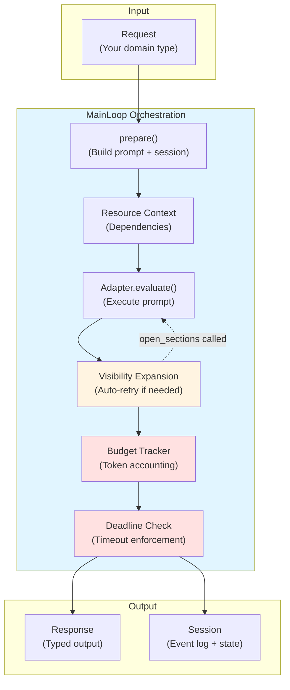
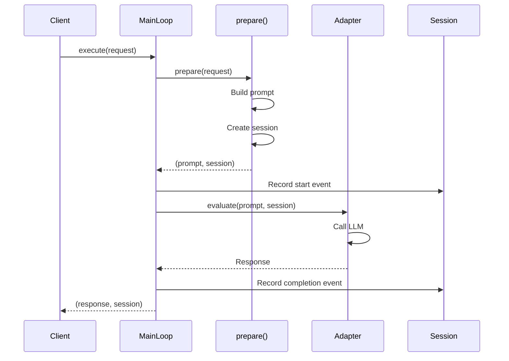
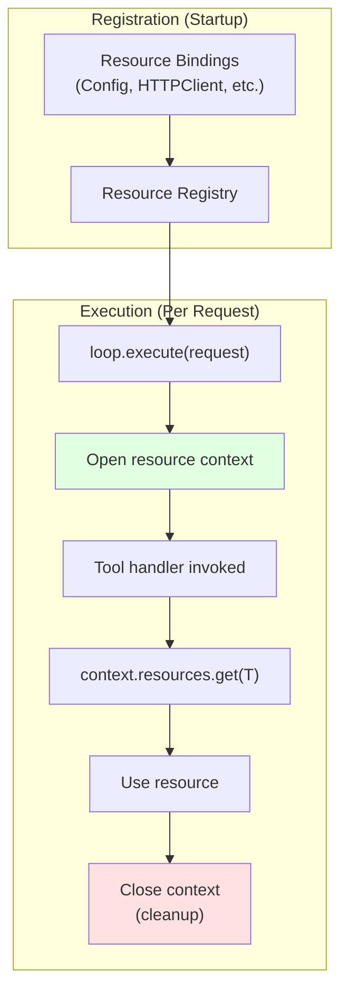
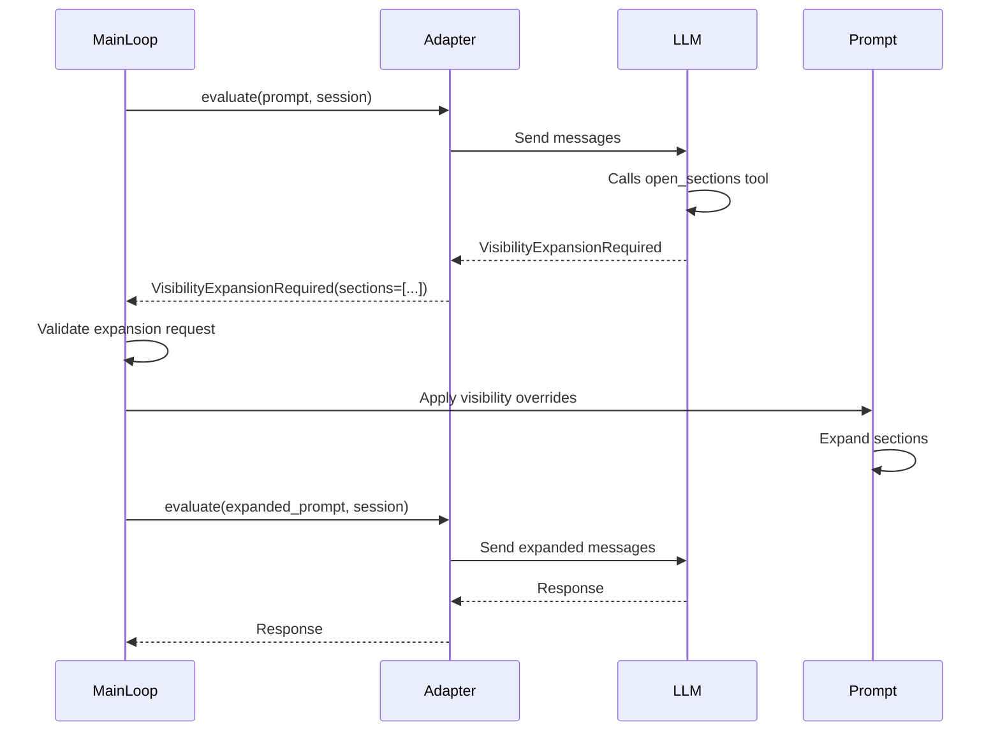
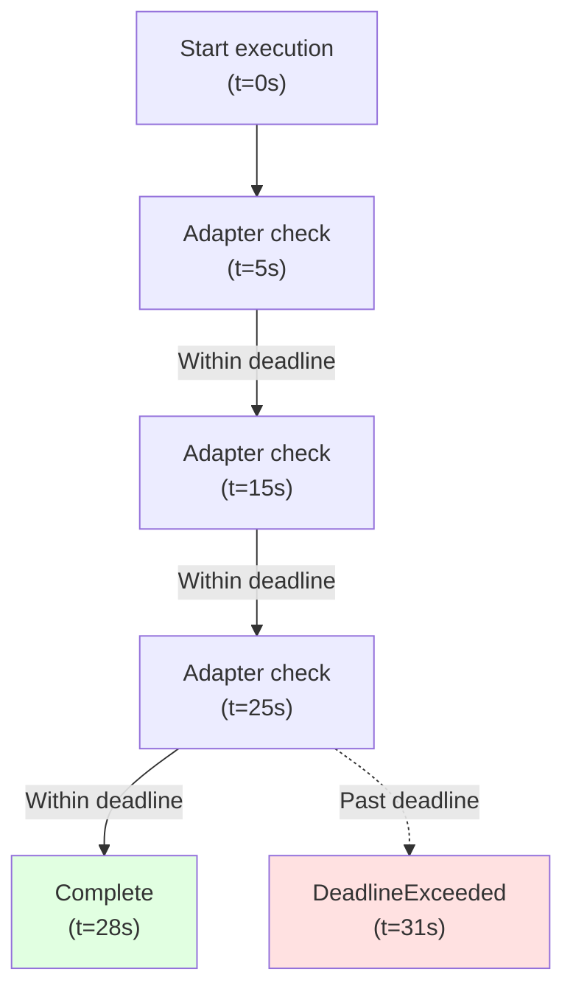
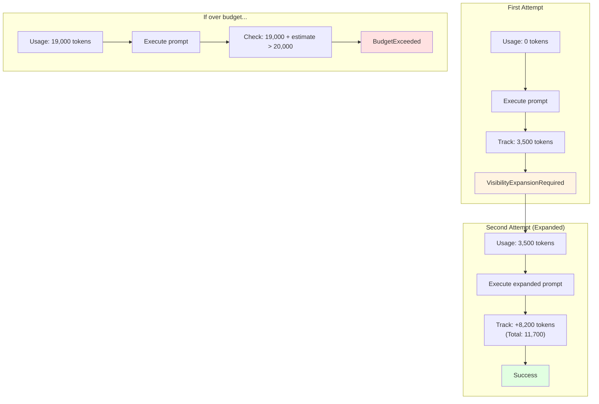

# Chapter 7: Main Loop Orchestration

> **Canonical Reference**: See [specs/MAIN_LOOP.md](../specs/MAIN_LOOP.md) for the complete specification.

## Introduction

`MainLoop` exists for one reason:

> **Make progressive disclosure and budgets/deadlines easy to handle correctly.**

You could write the loop yourself. `MainLoop` just does it in a tested, consistent way—handling the complexity of deadline enforcement, budget tracking, visibility expansion, and resource management so you can focus on your agent's logic.

In this chapter, you'll learn:

- **Minimal MainLoop** - The essential pattern for orchestrating agent execution
- **Resource injection** - How to provide dependencies at the loop level
- **Deadlines and budgets** - Preventing runaway agents and controlling costs
- **Visibility expansion** - Automatic handling of progressive disclosure
- **Error handling** - Built-in retry logic and failure modes

## The Mental Model

Think of `MainLoop` as the **runtime that coordinates your agent's execution**:



**Key responsibilities:**

1. **Preparation** - Convert your request into a `Prompt` and `Session`
1. **Execution** - Evaluate the prompt through the adapter
1. **Visibility** - Detect and handle `VisibilityExpansionRequired` exceptions
1. **Budgets** - Track token usage and enforce limits
1. **Deadlines** - Ensure execution completes within time bounds
1. **Resources** - Manage dependency lifecycle for tool handlers

## The Minimal MainLoop

The simplest possible `MainLoop` requires just one method: `prepare()`.

### Basic Implementation

```python
from weakincentives.runtime import MainLoop, Session
from weakincentives.prompt import Prompt

class MyLoop(MainLoop[RequestType, OutputType]):
    def prepare(self, request: RequestType) -> tuple[Prompt[OutputType], Session]:
        # Build the prompt
        prompt = Prompt(self._template).bind(request)

        # Create a session
        session = Session(tags={"loop": "my-loop"})

        return prompt, session
```

### Execution

```python
from weakincentives.adapters.openai import OpenAIAdapter
from weakincentives.runtime import InProcessDispatcher

# Create dependencies
adapter = OpenAIAdapter(model="gpt-4o")
bus = InProcessDispatcher()

# Instantiate the loop
loop = MyLoop(adapter=adapter, bus=bus)

# Execute
response, session = loop.execute(request)
```

### What Happens During Execution



**Execution flow:**

1. **Client calls `execute(request)`** - Passes domain-specific request
1. **`prepare()` is invoked** - Your implementation builds prompt and session
1. **Prompt is evaluated** - Through the configured adapter
1. **Events are recorded** - Session captures telemetry automatically
1. **Response is returned** - Along with the final session state

## Configuring MainLoop with Resources

Tool handlers often need external dependencies—HTTP clients, databases, configuration objects. `MainLoop` supports dependency injection through the resource registry.

### Providing Resources

```python nocheck
from weakincentives.resources import Binding, ResourceRegistry, Scope
from weakincentives.runtime import MainLoopConfig

# Simple case: pre-constructed instances
http_client = HTTPClient(base_url="https://api.example.com")
resources = ResourceRegistry.of(
    Binding.instance(HTTPClient, http_client)
)

# Or with lazy construction and scopes
resources = ResourceRegistry.of(
    Binding(Config, lambda r: Config.from_env()),
    Binding(HTTPClient, lambda r: HTTPClient(r.get(Config).url)),
)

# Configure MainLoop
config = MainLoopConfig(resources=resources)
loop = MyLoop(adapter=adapter, bus=bus, config=config)
```

### Resource Lifecycle



**Lifecycle stages:**

1. **Registration** - Define bindings at startup
1. **Context opening** - Resources become available during execution
1. **Lazy construction** - Resources are created on first access
1. **Tool access** - Handlers retrieve resources via `context.resources.get(T)`
1. **Cleanup** - Resources are released after execution

### Per-Request Resource Overrides

You can also pass resources directly to `execute()` for per-request customization:

```python
# Default resources from config
response1, session1 = loop.execute(request)

# Override for specific request
custom_resources = ResourceRegistry.of(
    Binding.instance(HTTPClient, test_http_client)
)
response2, session2 = loop.execute(request, resources=custom_resources)
```

This is useful for:

- **Testing** - Inject mock dependencies
- **Multi-tenancy** - Different configs per customer
- **A/B testing** - Different feature flags per experiment

## Automatic Visibility Expansion

`MainLoop` automatically catches `VisibilityExpansionRequired` exceptions and retries. When the model calls `open_sections`, MainLoop applies the visibility overrides and re-evaluates the prompt—**you don't have to handle this yourself**.

### How Visibility Expansion Works



**Expansion flow:**

1. **Model calls `open_sections`** - Requests more context for specific sections
1. **Adapter throws exception** - `VisibilityExpansionRequired` with section IDs
1. **MainLoop catches exception** - Validates the request
1. **Prompt is expanded** - Visibility overrides are applied
1. **Retry** - Prompt is re-evaluated with expanded context
1. **Completion** - Model receives additional context and continues

For more details on progressive disclosure, see [Chapter 10: Progressive Disclosure](10-progressive-disclosure.md).

## Deadlines and Budgets

Deadlines prevent runaway agents. Budgets prevent runaway costs. Both are enforced at the adapter level, so they work consistently across providers.

### Deadlines: Wall-Clock Timeouts

A `Deadline` is a wall-clock deadline—an absolute point in time when execution must complete:

```python
from datetime import timedelta
from weakincentives.runtime.session import Deadline

# Create deadline from timeout
deadline = Deadline.from_timeout(timedelta(seconds=30))

# Execute with deadline
response, session = loop.execute(request, deadline=deadline)
```

### Deadline Enforcement



**Enforcement points:**

- **Before each adapter call** - Check if deadline has passed
- **During streaming** - Check between chunks
- **After retries** - Validate remaining time
- **On completion** - Record actual duration

If the deadline is exceeded, `DeadlineExceeded` is raised and execution halts immediately.

### Budgets: Token Limits

A `Budget` can include token limits and/or a deadline. `BudgetTracker` accumulates usage across retries:

```python
from weakincentives.runtime.session import Budget

# Token-only budget
budget = Budget(max_total_tokens=20_000)

# Token budget with deadline
budget = Budget(
    max_total_tokens=20_000,
    max_prompt_tokens=15_000,
    max_completion_tokens=5_000,
    deadline=Deadline.from_timeout(timedelta(seconds=60)),
)

# Execute with budget
response, session = loop.execute(request, budget=budget)
```

### Budget Tracking



**Tracking across retries:**

1. **Initial request** - Tokens consumed are recorded
1. **Visibility expansion** - Additional tokens are added to total
1. **Budget check** - Before each retry, validate remaining budget
1. **Enforcement** - Raise `BudgetExceeded` if limit would be exceeded

### Combining Deadlines and Budgets

```python
from datetime import timedelta
from weakincentives.runtime.session import Deadline, Budget

# Create both constraints
deadline = Deadline.from_timeout(timedelta(seconds=30))
budget = Budget(max_total_tokens=20_000)

# Execute with both
response, session = loop.execute(
    request,
    deadline=deadline,
    budget=budget,
)
```

**Which constraint fires first wins:**

- If time runs out → `DeadlineExceeded`
- If tokens run out → `BudgetExceeded`

Both constraints are checked at every adapter call, ensuring execution never exceeds either limit.

## Error Handling

`MainLoop` provides built-in error handling for common failure modes.

### Automatic Retries for Visibility Expansion

As discussed above, `VisibilityExpansionRequired` is caught and retried automatically. This means progressive disclosure "just works"—no custom retry logic needed.

### Deadline and Budget Exceptions

```python
from weakincentives.runtime.session import DeadlineExceededError, BudgetExceededError

try:
    response, session = loop.execute(request, deadline=deadline, budget=budget)
except DeadlineExceededError as e:
    # Execution took too long
    logging.error(f"Deadline exceeded: {e}")
except BudgetExceededError as e:
    # Token limit reached
    logging.error(f"Budget exceeded: {e}")
```

### Adapter Errors

```python
from weakincentives.adapters import PromptEvaluationError

try:
    response, session = loop.execute(request)
except PromptEvaluationError as e:
    # Provider error (rate limit, invalid API key, etc.)
    logging.error(f"Adapter failed: {e}")
```

### Custom Error Handling in prepare()

```python
class RobustLoop(MainLoop[RequestType, OutputType]):
    def prepare(self, request: RequestType) -> tuple[Prompt[OutputType], Session]:
        # Validate request
        if not request.valid:
            raise ValueError(f"Invalid request: {request}")

        # Build prompt with error handling
        try:
            prompt = Prompt(self._template).bind(request)
        except Exception as e:
            logging.error(f"Failed to build prompt: {e}")
            raise

        session = Session(tags={"request_id": request.id})
        return prompt, session
```

## Integration with Sessions and Prompts

`MainLoop` integrates seamlessly with WINK's session and prompt systems (see [Chapter 5: Sessions](05-sessions.md) and [Chapter 3: Prompts](03-prompts.md)).

### Session Integration

The session passed to `prepare()` receives telemetry events automatically:

```python
from weakincentives.runtime.events import ToolInvoked, PromptExecuted

# After execution
response, session = loop.execute(request)

# Query telemetry
tool_calls = session[ToolInvoked].all()
executions = session[PromptExecuted].all()

print(f"Tools invoked: {len(tool_calls)}")
print(f"Prompts executed: {len(executions)}")
```

### Prompt Integration

Prompts created in `prepare()` can include session-bound sections:

```python
from weakincentives.contrib.tools import PlanningToolsSection, VfsToolsSection

class AgentLoop(MainLoop[str, str]):
    def prepare(self, request: str) -> tuple[Prompt[str], Session]:
        session = Session(bus=self._bus, tags={"query": request})

        # Build template with session-bound sections
        template = PromptTemplate(
            ns="agent",
            key="task",
            sections=(
                MarkdownSection(
                    title="Instructions",
                    key="instructions",
                    template=f"Complete this task: {request}",
                ),
                PlanningToolsSection(session=session),  # Requires session
                VfsToolsSection(session=session),        # Requires session
            ),
        )

        prompt = Prompt(template)
        return prompt, session
```

## Best Practices

### 1. Keep prepare() Lightweight

`prepare()` runs on every request. Keep it fast:

```python nocheck
# Bad: Heavy I/O in prepare()
def prepare(self, request: RequestType) -> tuple[Prompt[OutputType], Session]:
    data = requests.get(f"https://api.example.com/data/{request.id}").json()  # Slow!
    prompt = Prompt(self._template).bind(data)
    return prompt, Session(bus=self._bus)

# Good: Load data in tool handler or before execute()
def prepare(self, request: RequestType) -> tuple[Prompt[OutputType], Session]:
    prompt = Prompt(self._template).bind(request)
    return prompt, Session(bus=self._bus)
```

### 2. Use Session Tags for Tracking

Add metadata to sessions for observability:

```python
def prepare(self, request: RequestType) -> tuple[Prompt[OutputType], Session]:
    session = Session(
        bus=self._bus,
        tags={
            "request_id": request.id,
            "user": request.user,
            "env": "production",
            "version": "1.2.3",
        },
    )
    prompt = Prompt(self._template).bind(request)
    return prompt, session
```

### 3. Always Set Deadlines in Production

Prevent runaway agents:

```python
# Development: generous deadline for debugging
deadline = Deadline.from_timeout(timedelta(minutes=5))

# Production: strict deadline for reliability
deadline = Deadline.from_timeout(timedelta(seconds=30))

response, session = loop.execute(request, deadline=deadline)
```

### 4. Set Budgets for Cost Control

Especially important for expensive models:

```python
# For expensive models
budget = Budget(max_total_tokens=50_000)  # ~$0.50 at typical pricing

# For cheaper models
budget = Budget(max_total_tokens=200_000)  # Still reasonable

response, session = loop.execute(request, budget=budget)
```

### 5. Use Resource Overrides for Testing

Inject test doubles during tests:

```python
# Production
loop = MyLoop(adapter=adapter, bus=bus, config=config)

# Testing
test_resources = ResourceRegistry.of(
    Binding.instance(HTTPClient, MockHTTPClient()),
    Binding.instance(Database, InMemoryDatabase()),
)
response, session = loop.execute(request, resources=test_resources)
```

### 6. Log Execution Metrics

Track performance over time:

```python
import logging
from datetime import datetime, UTC

def execute_with_logging(loop: MainLoop, request: Any) -> tuple[Any, Session]:
    start = datetime.now(UTC)
    try:
        response, session = loop.execute(request)
        duration = (datetime.now(UTC) - start).total_seconds()

        logging.info(
            "MainLoop execution succeeded",
            extra={
                "duration_seconds": duration,
                "session_id": str(session.session_id),
                "tags": session.tags,
            },
        )
        return response, session
    except Exception as e:
        duration = (datetime.now(UTC) - start).total_seconds()
        logging.error(
            "MainLoop execution failed",
            extra={
                "duration_seconds": duration,
                "error": str(e),
            },
        )
        raise
```

## Common Patterns

### Pattern: Multi-Step Agent

Execute multiple prompts in sequence:

```python
class MultiStepLoop(MainLoop[Request, FinalOutput]):
    def prepare(self, request: Request) -> tuple[Prompt[FinalOutput], Session]:
        session = Session(bus=self._bus)

        # Step 1: Research
        research_prompt = Prompt(self._research_template).bind(request)
        with research_prompt.resources:
            research_result, _ = self._adapter.evaluate(research_prompt, session=session)

        # Step 2: Analysis
        analysis_prompt = Prompt(self._analysis_template).bind(research_result)
        with analysis_prompt.resources:
            analysis_result, _ = self._adapter.evaluate(analysis_prompt, session=session)

        # Step 3: Final output
        final_prompt = Prompt(self._final_template).bind(analysis_result)
        return final_prompt, session
```

### Pattern: Conditional Prompts

Choose prompts based on request:

```python
class ConditionalLoop(MainLoop[Request, Output]):
    def prepare(self, request: Request) -> tuple[Prompt[Output], Session]:
        session = Session(bus=self._bus)

        # Select template based on request type
        if request.type == "bug_fix":
            template = self._bug_fix_template
        elif request.type == "feature":
            template = self._feature_template
        else:
            template = self._default_template

        prompt = Prompt(template).bind(request)
        return prompt, session
```

### Pattern: Retry with Fallback

Use different models on failure:

```python
def execute_with_fallback(loop: MainLoop, request: Any) -> tuple[Any, Session]:
    try:
        # Try primary model
        return loop.execute(request, deadline=Deadline.from_timeout(timedelta(seconds=30)))
    except DeadlineExceeded:
        # Fallback to faster model
        logging.warning("Primary model timed out, using fallback")
        fallback_loop = MyLoop(adapter=fast_adapter, bus=loop._bus, config=loop._config)
        return fallback_loop.execute(request, deadline=Deadline.from_timeout(timedelta(seconds=10)))
```

## Summary

`MainLoop` provides:

- **Minimal abstraction** - Just implement `prepare()` to get started
- **Automatic visibility expansion** - Progressive disclosure handled transparently
- **Deadline enforcement** - Wall-clock timeouts prevent runaway execution
- **Budget tracking** - Token limits control costs across retries
- **Resource injection** - Dependency management for tool handlers
- **Error handling** - Built-in retry logic and clear failure modes

The main loop is the orchestration layer that connects your prompts, sessions, and adapters into a unified execution flow. It handles the operational complexity—deadlines, budgets, visibility—so you can focus on your agent's logic.

## Next Steps

- **[Chapter 8: Evaluation](08-evaluation.md)** - Learn how to test and evaluate your agents
- **[Chapter 9: Lifecycle Management](09-lifecycle.md)** - Production deployment with `LoopGroup`
- **[Chapter 10: Progressive Disclosure](10-progressive-disclosure.md)** - Cost optimization through selective context
- **[Chapter 5: Sessions](05-sessions.md)** - Deep dive into session state management
- **[Chapter 3: Prompts](03-prompts.md)** - Prompt composition and resource lifecycle

______________________________________________________________________

**Canonical Reference**: See [specs/MAIN_LOOP.md](../specs/MAIN_LOOP.md) for the complete specification, including visibility handling semantics, deadline checking algorithm, budget tracker implementation, and resource lifecycle details.
