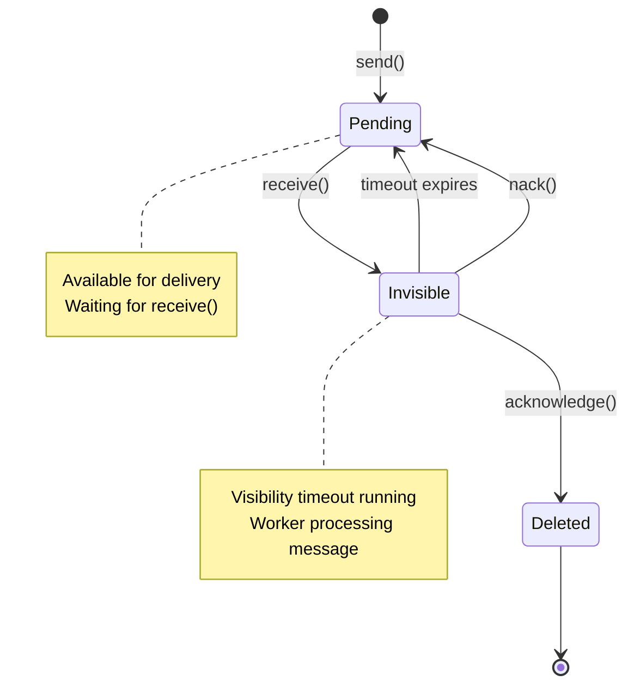
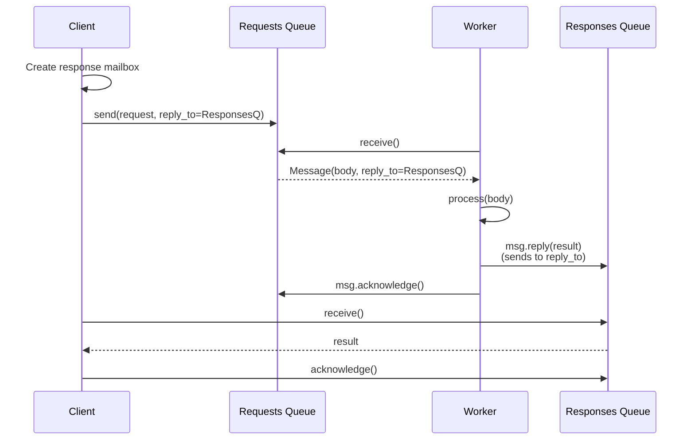

# Chapter 7.5: Distributed Orchestration

> **Canonical Reference**: See [specs/MAILBOX.md](../specs/MAILBOX.md), [specs/MAILBOX_RESOLVER.md](../specs/MAILBOX_RESOLVER.md), and [specs/VERIFICATION.md](../specs/VERIFICATION.md) for complete specifications.

## Introduction

When a single agent process isn't enough—when you need horizontal scaling, fault tolerance, or geographical distribution—WINK's mailbox abstraction provides the foundation for distributed orchestration.

Unlike many agent frameworks that tightly couple execution to a single process, WINK separates **request queueing** from **request processing**. This separation enables:

- **Horizontal scaling** - Run multiple workers consuming from shared queues
- **Fault tolerance** - Messages survive worker crashes and restarts
- **Distributed evaluation** - Parallelize eval runs across worker pools
- **Multi-region deployment** - Route requests to geographically distributed workers
- **Canary deployments** - Route traffic to new workers while keeping old ones running

The mailbox abstraction is intentionally simple: **typed message queues with SQS-compatible semantics**. This means you get familiar patterns—visibility timeout, explicit acknowledgment, at-least-once delivery—without vendor lock-in.

**Multi-agent coordination is a harness concern**: message routing, retries,
backpressure, and failure isolation. WINK provides mailbox-based primitives so
you can build this when you need to own the harness. If your execution
environment provides a stronger harness, keep the same agent definition and swap
the runtime around it.

In this chapter, you'll learn:

- **Mailbox abstraction** - The core protocol for durable message passing
- **Message lifecycle** - Visibility timeout, acknowledgment, and redelivery
- **Reply-to pattern** - Dynamic response routing for distributed workers
- **Backend implementations** - InMemory and Redis mailboxes (SQS planned for future release)
- **Mailbox resolution** - Service discovery for distributed backends
- **Production patterns** - Worker pools, fanout/gather, distributed evaluation
- **Reliability guarantees** - At-least-once delivery, retry semantics, failure handling
- **Testing strategies** - Unit testing mailboxes and integration testing distributed systems

## The Distributed Orchestration Model

WINK's mailbox-based architecture decouples request submission from request processing:

```mermaid
flowchart TB
    subgraph Clients["Clients (Request Producers)"]
        Client1["Web Service"]
        Client2["CI/CD Pipeline"]
        Client3["Batch Job"]
    end

    subgraph Queues["Durable Message Queues"]
        RequestQ["Requests Queue<br/>(Redis)"]
        ResultsQ["Results Queue<br/>(Redis)"]
    end

    subgraph Workers["Worker Pool (Request Consumers)"]
        Worker1["Worker 1<br/>(MainLoop)"]
        Worker2["Worker 2<br/>(MainLoop)"]
        Worker3["Worker 3<br/>(MainLoop)"]
    end

    Client1 -->|send(request)| RequestQ
    Client2 -->|send(request)| RequestQ
    Client3 -->|send(request)| RequestQ

    RequestQ -->|receive()| Worker1
    RequestQ -->|receive()| Worker2
    RequestQ -->|receive()| Worker3

    Worker1 -->|reply(result)| ResultsQ
    Worker2 -->|reply(result)| ResultsQ
    Worker3 -->|reply(result)| ResultsQ

    ResultsQ --> Client1
    ResultsQ --> Client2
    ResultsQ --> Client3

    style Queues fill:#e1f5ff
    style Workers fill:#fff4e1
```

**Key properties:**

1. **Decoupled submission** - Clients send requests without knowing which worker will process them
1. **Durable queues** - Messages survive process restarts and crashes
1. **Competing consumers** - Multiple workers consume from the same queue for parallelism
1. **Dynamic routing** - Reply-to pattern enables flexible result delivery
1. **At-least-once delivery** - Messages are guaranteed to be delivered, potentially multiple times

This architecture enables horizontal scaling: add more workers to increase throughput, remove workers during low load, or upgrade workers without downtime.

## The Mailbox Abstraction

### Core Protocol

`Mailbox[T, R]` is a typed message queue with two type parameters:

- `T`: Message body type (what you send)
- `R`: Reply type (what workers send back, or `None` if no replies expected)

```python
from weakincentives.runtime.mailbox import Mailbox

# Request mailbox: receives MainLoopRequest, workers reply with MainLoopResult
requests: Mailbox[MainLoopRequest, MainLoopResult]

# Response mailbox: receives MainLoopResult, no replies expected
responses: Mailbox[MainLoopResult, None]
```

**When to use Mailbox vs Dispatcher:**

| Use Case | Use Mailbox | Use Dispatcher |
|----------|-------------|----------------|
| Durable request processing | ✅ | ❌ |
| Cross-process communication | ✅ | ❌ |
| Explicit acknowledgment required | ✅ | ❌ |
| Work distribution across workers | ✅ | ❌ |
| In-process events/telemetry | ❌ | ✅ |
| Fire-and-forget broadcasts | ❌ | ✅ |

### Message Lifecycle

Messages follow a well-defined lifecycle with three states:



**State transitions:**

1. **send()** - Message becomes **Pending**, available for delivery
1. **receive()** - Message becomes **Invisible** for `visibility_timeout` seconds
1. **acknowledge()** - Message becomes **Deleted**, permanently removed
1. **timeout expires** - Message returns to **Pending** for redelivery
1. **nack()** - Message returns to **Pending** (optionally after delay)

**At-least-once delivery guarantee:** Messages may be delivered multiple times if:

- Worker crashes before acknowledging
- Visibility timeout expires during processing
- Consumer explicitly nacks the message

This means **consumers must be idempotent**—processing the same message twice should be safe.

### Basic Operations

```python
from weakincentives.runtime.mailbox import InMemoryMailbox

# Create a mailbox
requests: InMemoryMailbox[str, str] = InMemoryMailbox(name="requests")

# Send a message
msg_id = requests.send("process this task")
print(f"Sent message: {msg_id}")

# Receive messages
messages = requests.receive(
    max_messages=1,           # Receive up to 1 message
    visibility_timeout=30,    # Invisible for 30 seconds
    wait_time_seconds=0,      # Return immediately if empty
)

# Process and acknowledge
for msg in messages:
    print(f"Received: {msg.body}")
    print(f"Delivery count: {msg.delivery_count}")

    # Process the message
    result = process(msg.body)

    # Acknowledge to delete
    msg.acknowledge()
```

### Message Structure

```python
from dataclasses import dataclass
from datetime import datetime

@dataclass(slots=True)
class Message[T, R]:
    """Received message with lifecycle methods."""

    id: str                              # Unique message ID
    body: T                              # Message payload
    receipt_handle: str                  # Handle for ack/nack operations
    delivery_count: int                  # Number of times delivered
    enqueued_at: datetime                # When message was sent
    reply_to: Mailbox[R, None] | None   # Where to send replies

    def reply(self, body: R) -> str:
        """Send reply to reply_to mailbox."""
        ...

    def acknowledge(self) -> None:
        """Delete message (finalizes - no further replies)."""
        ...

    def nack(self, *, visibility_timeout: int = 0) -> None:
        """Return to queue (finalizes - no further replies)."""
        ...

    def extend_visibility(self, timeout: int) -> None:
        """Extend visibility for long-running processing."""
        ...
```

**Important lifecycle constraints:**

- **acknowledge()** and **nack()** are **finalizing operations** - they mark the message as complete
- Once finalized, **reply()** raises `MessageFinalizedError`
- Multiple replies are allowed **before** finalization
- Receipt handles expire after visibility timeout—old handles are rejected

## Reply-to Pattern

The reply-to pattern enables dynamic response routing without coupling clients to specific workers.

### How Reply-to Works



**Key insight:** The `reply_to` mailbox reference is stored in the message, so the worker doesn't need to know where to send results—it just calls `msg.reply()`.

### Basic Reply-to Example

```python
from weakincentives.runtime.mailbox import InMemoryMailbox

# Create request and response mailboxes
requests: InMemoryMailbox[str, str] = InMemoryMailbox(name="requests")
responses: InMemoryMailbox[str, None] = InMemoryMailbox(name="responses")

# Client: Send request with reply_to
requests.send("analyze this", reply_to=responses)

# Worker: Process and reply
for msg in requests.receive(visibility_timeout=300):
    result = f"Analysis: {msg.body}"
    msg.reply(result)  # Sends to the responses mailbox
    msg.acknowledge()

# Client: Collect response
for msg in responses.receive():
    print(f"Got result: {msg.body}")
    msg.acknowledge()
```

### Multiple Replies (Progress Streaming)

Workers can send multiple replies before acknowledging:

```python
from dataclasses import dataclass

@dataclass(frozen=True)
class Progress:
    step: int
    total: int
    status: str

@dataclass(frozen=True)
class Complete:
    result: str

# Worker: Stream progress updates
for msg in requests.receive(visibility_timeout=600):
    # Send progress updates
    msg.reply(Progress(step=1, total=3, status="Analyzing..."))
    # ... do work ...

    msg.reply(Progress(step=2, total=3, status="Generating response..."))
    # ... more work ...

    msg.reply(Progress(step=3, total=3, status="Finalizing..."))
    # ... final work ...

    # Send final result
    msg.reply(Complete(result="Done"))

    # Finalize (no more replies allowed after this)
    msg.acknowledge()
```

### Reply After Finalization Error

```python
msg = requests.receive()[0]

msg.reply("First reply")   # OK
msg.reply("Second reply")  # OK

msg.acknowledge()          # Finalize

msg.reply("Third reply")   # Raises MessageFinalizedError!
```

This prevents:

- Sending replies to a deleted message (after ack)
- Sending replies that race with redelivery (after nack)

## Mailbox Implementations

WINK provides two mailbox backends for different deployment scenarios:

### InMemoryMailbox

**Use for:** Testing, single-process agents, development

```python
from weakincentives.runtime.mailbox import InMemoryMailbox

mailbox: InMemoryMailbox[str, None] = InMemoryMailbox(name="test-queue")
```

**Properties:**

- ✅ Fast and simple
- ✅ FIFO ordering guaranteed
- ✅ Exact count tracking
- ❌ No persistence (messages lost on process exit)
- ❌ Single process only

**When to use:**

- Unit tests and integration tests
- Single-process development
- Prototyping distributed patterns locally

### RedisMailbox

**Use for:** Self-hosted deployments, Kubernetes, strict FIFO ordering

```python
from weakincentives.contrib.mailbox import RedisMailbox
from redis import Redis

redis_client = Redis(host="redis.example.com", port=6379)

mailbox: RedisMailbox[str, None] = RedisMailbox(
    name="my-queue",
    client=redis_client,
    reaper_interval=1.0,  # Background thread checks for expired messages every 1s
)
```

**Properties:**

- ✅ Strict FIFO ordering (Redis LIST)
- ✅ Exact count tracking
- ✅ No max visibility timeout
- ✅ Unlimited long polling
- ✅ Self-hosted control
- ⚠️ Requires Redis infrastructure
- ⚠️ Durability depends on Redis persistence config
- ⚠️ Background reaper thread for visibility timeout

**When to use:**

- Kubernetes/self-hosted deployments
- Strict ordering requirements
- Long-running tasks (>12 hour visibility timeout)
- Infrastructure control preference

### Backend Comparison

| Feature | InMemoryMailbox | RedisMailbox |
|---------|----------------|--------------|
| **Ordering** | Strict FIFO | Strict FIFO |
| **Long poll max** | Unlimited | Unlimited |
| **Visibility max** | Unlimited | Unlimited |
| **Count accuracy** | Exact | Exact |
| **Durability** | None | Configurable |
| **Infrastructure** | None | Self-hosted |
| **Cost** | Free | Redis hosting |

**Note:** SQS backend is planned for a future release and will provide managed infrastructure with multi-region support.

## Mailbox Resolution

When using distributed backends like Redis, the `reply_to` mailbox reference cannot be serialized directly—only the mailbox **name** is stored. The `MailboxResolver` reconstructs mailbox instances from names on the worker side.

### Why Resolution is Needed

```python
# InMemory: Direct reference works
responses = InMemoryMailbox(name="responses")
requests.send("task", reply_to=responses)  # Stores actual mailbox instance

# Redis: Can't serialize mailbox instance to Redis!
redis_responses = RedisMailbox(name="responses", client=redis_client)
redis_requests.send("task", reply_to=redis_responses)  # Stores "responses" string

# Worker receives message with reply_to="responses" (string)
# Resolver reconstructs: "responses" -> RedisMailbox instance
```

### MailboxResolver Protocol

```python
from typing import Protocol
from weakincentives.runtime.mailbox import Mailbox

class MailboxResolver[R](Protocol):
    """Resolves string identifiers to Mailbox instances."""

    def resolve(self, identifier: str) -> Mailbox[R, None]:
        """Resolve identifier to mailbox. Raises MailboxResolutionError if not found."""
        ...

    def resolve_optional(self, identifier: str) -> Mailbox[R, None] | None:
        """Resolve if possible, return None otherwise."""
        ...
```

### CompositeResolver

The most common resolver combines a static registry with a dynamic factory:

```python
from weakincentives.runtime.mailbox import CompositeResolver
from weakincentives.contrib.mailbox import RedisMailbox, RedisMailboxFactory
from redis import Redis

redis_client = Redis(host="redis.example.com", port=6379)

# Factory creates mailboxes on demand
factory = RedisMailboxFactory(client=redis_client)

# Registry holds pre-configured mailboxes
registry = {
    "critical-alerts": RedisMailbox(name="critical-alerts", client=redis_client),
}

# Resolver tries registry first, then factory
resolver = CompositeResolver(registry=registry, factory=factory)

# Resolves from registry
alerts_mailbox = resolver.resolve("critical-alerts")

# Resolves via factory
dynamic_mailbox = resolver.resolve("client-12345")  # Factory creates on demand
```

**Resolution order:**

1. Check registry for pre-registered mailbox
1. Fall back to factory for dynamic creation
1. Raise `MailboxResolutionError` if neither succeeds

### Using Resolver with RedisMailbox

```python
from weakincentives.contrib.mailbox import RedisMailbox, RedisMailboxFactory
from weakincentives.runtime.mailbox import CompositeResolver
from redis import Redis

redis_client = Redis(host="redis.example.com", port=6379)

# Create factory and resolver
factory = RedisMailboxFactory(client=redis_client)
resolver = CompositeResolver(registry={}, factory=factory)

# Requests mailbox needs resolver for reply_to reconstruction
requests = RedisMailbox(
    name="requests",
    client=redis_client,
    reply_resolver=resolver,  # Resolver for reply_to mailboxes
)

# Create response mailbox
responses = RedisMailbox(name="responses", client=redis_client)

# Client: Send with reply_to (stores "responses" name in Redis)
requests.send("task", reply_to=responses)

# Worker: Resolver reconstructs "responses" -> RedisMailbox instance
for msg in requests.receive():
    msg.reply("result")  # Resolver creates RedisMailbox("responses") under the hood
    msg.acknowledge()
```

### Dynamic Reply Queues

For per-client response isolation, use unique mailbox names:

```python
from uuid import uuid4
from weakincentives.contrib.mailbox import RedisMailbox, RedisMailboxFactory
from weakincentives.runtime.mailbox import CompositeResolver

# Factory creates mailboxes for unique client IDs
factory = RedisMailboxFactory(client=redis_client)
resolver = CompositeResolver(registry={}, factory=factory)

requests = RedisMailbox(name="requests", client=redis_client, reply_resolver=resolver)

# Client creates unique response mailbox
client_id = uuid4()
client_responses = RedisMailbox(name=f"client-{client_id}", client=redis_client)

# Send request
requests.send("task", reply_to=client_responses)

# Worker processes (factory creates RedisMailbox(f"client-{client_id}") on demand)
for msg in requests.receive():
    msg.reply("result")  # Factory reconstructs client-specific mailbox
    msg.acknowledge()

# Client collects from unique mailbox
for msg in client_responses.receive():
    print(f"Got: {msg.body}")
    msg.acknowledge()
```

## Configuration with MainLoop and EvalLoop

### MainLoop with Mailboxes

`MainLoop` can consume requests from a mailbox instead of processing single requests:

```python
from weakincentives.runtime import MainLoop
from weakincentives.contrib.mailbox import RedisMailbox
from redis import Redis

redis_client = Redis(host="redis.example.com", port=6379)

# Mailbox for requests
requests: RedisMailbox[MainLoopRequest, MainLoopResult] = RedisMailbox(
    name="agent-requests",
    client=redis_client,
)

# Create MainLoop
main_loop = MainLoop(
    adapter=adapter,
    requests=requests,
    resources=resources,
)

# Run the loop (processes messages from mailbox)
main_loop.run()
```

**MainLoop mailbox integration:**

- MainLoop calls `requests.receive(visibility_timeout=...)` in a loop
- Each received message is processed via `execute()`
- Result is sent via `msg.reply()` to the `reply_to` mailbox
- Message is acknowledged after successful processing
- Message is nacked with exponential backoff on failure

See [Chapter 7: Main Loop Orchestration](07-main-loop.md) for detailed MainLoop configuration.

### EvalLoop with Mailboxes

`EvalLoop` processes evaluation requests from a mailbox:

```python
from weakincentives.evals import EvalLoop, EvalRequest, EvalResult
from weakincentives.contrib.mailbox import RedisMailbox
from redis import Redis

redis_client = Redis(host="redis.example.com", port=6379)

# Mailbox for eval requests
eval_requests: RedisMailbox[EvalRequest, EvalResult] = RedisMailbox(
    name="eval-requests",
    client=redis_client,
)

# Create EvalLoop
eval_loop = EvalLoop(
    loop=main_loop,
    evaluator=evaluator,
    requests=eval_requests,
)

# Run the loop
eval_loop.run()
```

**EvalLoop mailbox integration:**

- EvalLoop receives `EvalRequest` messages
- Each request is processed via MainLoop
- Output is scored by evaluator
- `EvalResult` is sent via `msg.reply()` to `reply_to` mailbox
- Message is acknowledged after evaluation completes

See [Chapter 8: Evaluation](08-evaluation.md) for detailed EvalLoop configuration.

### Distributed Evaluation Pattern

Run evaluation across multiple workers with a shared request queue and unique result queue:

```python
from weakincentives.evals import submit_dataset, collect_results, Dataset
from weakincentives.contrib.mailbox import RedisMailbox
from uuid import uuid4

# Create shared request queue
eval_requests = RedisMailbox(name="eval-requests", client=redis_client)

# Create run-specific result queue
run_id = f"eval-run-{uuid4()}"
eval_results = RedisMailbox(name=run_id, client=redis_client)

# Submit dataset (all samples go to shared queue with same reply_to)
dataset = Dataset.load(Path("qa.jsonl"), str, str)
submit_dataset(dataset, eval_requests, reply_to=eval_results)

# Start 3 workers (all consuming from eval_requests)
# Worker 1: eval_loop.run()
# Worker 2: eval_loop.run()
# Worker 3: eval_loop.run()

# Collect results from unique mailbox
report = collect_results(eval_results, expected_count=len(dataset))
print(f"Pass rate: {report.pass_rate:.1%}")
```

**How it works:**

1. All samples submitted to shared `eval_requests` queue
1. Each sample includes `reply_to=eval_results`
1. Multiple workers consume from `eval_requests` in parallel
1. Each worker processes a subset of samples
1. All workers send results to the same `eval_results` mailbox
1. Client collects all results from single mailbox

```mermaid
flowchart TB
    subgraph Submission["1. Submit Dataset"]
        Dataset["100 samples"]
        Submit["submit_dataset()"]
    end

    subgraph Queue["2. Shared Request Queue"]
        Requests["eval-requests<br/>(100 messages,<br/>reply_to=eval-run-XYZ)"]
    end

    subgraph Workers["3. Worker Pool"]
        W1["Worker 1<br/>(30 samples)"]
        W2["Worker 2<br/>(40 samples)"]
        W3["Worker 3<br/>(30 samples)"]
    end

    subgraph Collection["4. Collect Results"]
        Results["eval-run-XYZ<br/>(100 results)"]
        Report["EvalReport"]
    end

    Dataset --> Submit
    Submit --> Requests

    Requests --> W1
    Requests --> W2
    Requests --> W3

    W1 -->|reply()| Results
    W2 -->|reply()| Results
    W3 -->|reply()| Results

    Results --> Report

    style Requests fill:#e1f5ff
    style Results fill:#e1ffe1
```

## Production Patterns

### Pattern: Horizontal Scaling

Scale workers independently of clients:

```python
# Clients submit requests (scales independently)
for i in range(1000):
    requests.send(f"task-{i}", reply_to=responses)

# Workers process requests (scale by adding more worker processes)
# Process 1: main_loop.run()
# Process 2: main_loop.run()
# Process 3: main_loop.run()
# ... add more as needed ...
```

**Scaling strategy:**

- Monitor queue depth: `requests.approximate_count()`
- Add workers when queue depth exceeds threshold
- Remove workers during low load
- No coordination needed—workers compete for messages

### Pattern: Fanout/Gather

Distribute work across multiple queues, gather results:

```python
from typing import Any

# Fanout: Distribute tasks to specialized queues
for task in tasks:
    if task.type == "analysis":
        analysis_queue.send(task, reply_to=results)
    elif task.type == "generation":
        generation_queue.send(task, reply_to=results)
    else:
        default_queue.send(task, reply_to=results)

# Workers specialize
# Analysis workers: consume from analysis_queue
# Generation workers: consume from generation_queue
# Default workers: consume from default_queue

# Gather: Collect all results from single mailbox
collected: list[Any] = []
while len(collected) < len(tasks):
    for msg in results.receive(wait_time_seconds=5):
        collected.append(msg.body)
        msg.acknowledge()
```

### Pattern: Priority Queues

Use separate mailboxes for different priorities:

```python
# High-priority queue (more workers)
high_priority = RedisMailbox(name="high-priority", client=redis_client)

# Low-priority queue (fewer workers)
low_priority = RedisMailbox(name="low-priority", client=redis_client)

# Route by priority
if request.priority == "high":
    high_priority.send(request, reply_to=responses)
else:
    low_priority.send(request, reply_to=responses)

# Assign 80% of workers to high-priority
# Process 1-8: consume from high_priority
# Process 9-10: consume from low_priority
```

### Pattern: Dead-Letter Queue

Handle repeatedly failing messages:

```python
from weakincentives.contrib.mailbox import RedisMailbox

requests = RedisMailbox(name="requests", client=redis_client)
dead_letter = RedisMailbox(name="dead-letter", client=redis_client)

# Worker with retry limit
for msg in requests.receive(visibility_timeout=300):
    if msg.delivery_count > 5:
        # Exceeded retry limit, move to DLQ
        dead_letter.send(msg.body)
        msg.acknowledge()
        continue

    try:
        result = process(msg.body)
        msg.reply(result)
        msg.acknowledge()
    except Exception as e:
        # Exponential backoff: 60s, 120s, 240s, 480s, 960s
        backoff = min(60 * (2 ** (msg.delivery_count - 1)), 900)
        msg.nack(visibility_timeout=backoff)
```

### Pattern: Multi-Region Deployment

Route requests to regional workers:

```python
# US East workers
us_east_requests = RedisMailbox(
    name="requests-us-east",
    client=Redis(host="redis-us-east.example.com"),
)

# EU West workers
eu_west_requests = RedisMailbox(
    name="requests-eu-west",
    client=Redis(host="redis-eu-west.example.com"),
)

# Route by client region
if client.region == "us-east":
    us_east_requests.send(request, reply_to=responses)
elif client.region == "eu-west":
    eu_west_requests.send(request, reply_to=responses)
```

### Pattern: Canary Deployment

Route percentage of traffic to new version:

```python
import random

# Stable workers
stable_requests = RedisMailbox(name="requests-stable", client=redis_client)

# Canary workers (new version)
canary_requests = RedisMailbox(name="requests-canary", client=redis_client)

# Route 10% to canary
for request in incoming_requests:
    if random.random() < 0.10:
        canary_requests.send(request, reply_to=responses)
    else:
        stable_requests.send(request, reply_to=responses)
```

## Reliability and Failure Handling

### At-Least-Once Delivery

Messages are guaranteed to be delivered at least once, but may be delivered multiple times:

**Redelivery scenarios:**

1. Worker crashes before acknowledging
1. Visibility timeout expires during processing
1. Worker calls `nack()`

**Idempotency requirement:** Consumers must handle duplicate processing safely.

```python
# Bad: Non-idempotent processing
def process_payment(msg: Message) -> None:
    charge_credit_card(msg.body.amount)  # Duplicate charges on redelivery!
    msg.acknowledge()

# Good: Idempotent processing with deduplication
processed_ids: set[str] = set()

def process_payment(msg: Message) -> None:
    if msg.id in processed_ids:
        msg.acknowledge()  # Already processed, skip
        return

    charge_credit_card(msg.body.amount)
    processed_ids.add(msg.id)
    msg.acknowledge()
```

### Visibility Timeout and Heartbeats

For long-running tasks, extend visibility timeout to prevent redelivery:

```python
for msg in requests.receive(visibility_timeout=300):  # Initial 5 minutes
    try:
        # Long-running task
        for i in range(10):
            process_chunk(i)

            # Extend visibility every 2 minutes
            if i % 2 == 0:
                msg.extend_visibility(300)  # Extend by another 5 minutes

        msg.reply(result)
        msg.acknowledge()
    except Exception as e:
        msg.nack(visibility_timeout=60)  # Retry after 1 minute
```

**Visibility timeout guidelines:**

- Set initial timeout > expected processing time
- Extend for tasks that may exceed initial timeout
- Use exponential backoff on nack for transient failures

### Error Handling and Retry

```python
from weakincentives.runtime.mailbox import (
    ReceiptHandleExpiredError,
    MessageFinalizedError,
)

for msg in requests.receive(visibility_timeout=300):
    try:
        result = process(msg.body)
        msg.reply(result)
        msg.acknowledge()

    except ReceiptHandleExpiredError:
        # Visibility timeout expired, message already redelivered
        # Log and move on (another worker is processing it)
        print(f"Message {msg.id} timed out, already redelivered")

    except MessageFinalizedError:
        # Tried to reply after ack/nack
        print(f"Message {msg.id} already finalized")

    except Exception as e:
        # Transient error, nack with backoff
        backoff = min(60 * msg.delivery_count, 900)
        print(f"Error processing {msg.id}, retry in {backoff}s: {e}")
        msg.nack(visibility_timeout=backoff)
```

### Connection Failures

Handle mailbox connection failures with retry logic:

```python
from weakincentives.runtime.mailbox import MailboxConnectionError
import time

while True:
    try:
        for msg in requests.receive(visibility_timeout=300, wait_time_seconds=20):
            process_message(msg)

    except MailboxConnectionError as e:
        print(f"Mailbox connection failed: {e}")
        time.sleep(5)  # Wait before retry
        # Loop will retry receive()
```

### Delivery Count Limits

Prevent infinite retries with delivery count limits:

```python
MAX_DELIVERIES = 5

for msg in requests.receive(visibility_timeout=300):
    if msg.delivery_count > MAX_DELIVERIES:
        # Too many retries, give up
        print(f"Message {msg.id} exceeded max deliveries ({MAX_DELIVERIES})")

        # Log to dead-letter queue
        dead_letter_queue.send(msg.body)
        msg.acknowledge()
        continue

    # Normal processing
    try:
        result = process(msg.body)
        msg.reply(result)
        msg.acknowledge()
    except Exception as e:
        msg.nack(visibility_timeout=60 * msg.delivery_count)
```

## Redis Mailbox Details

### Data Structures

RedisMailbox uses four Redis keys per queue:

```
{queue:name}:pending    # LIST - messages awaiting delivery
{queue:name}:invisible  # ZSET - in-flight messages, scored by expiry timestamp
{queue:name}:data       # HASH - message ID → payload
{queue:name}:meta       # HASH - message ID → metadata (delivery count, handle)
```

**Hash tags** (`{queue:name}`) ensure all keys co-locate on the same Redis Cluster shard.

### Atomic Operations

All state transitions use Lua scripts for atomicity:

**Send:**

```lua
-- Atomically: store data + add to pending
redis.call('HSET', data_key, msg_id, payload)
redis.call('LPUSH', pending_key, msg_id)
```

**Receive:**

```lua
-- Atomically: pop from pending + add to invisible + update metadata
local msg_id = redis.call('RPOP', pending_key)
redis.call('ZADD', invisible_key, expiry_timestamp, msg_id)
redis.call('HINCRBY', meta_key, msg_id .. ':count', 1)
redis.call('HSET', meta_key, msg_id .. ':handle', new_handle)
```

**Acknowledge:**

```lua
-- Atomically: remove from invisible + delete data + delete metadata
redis.call('ZREM', invisible_key, msg_id)
redis.call('HDEL', data_key, msg_id)
redis.call('HDEL', meta_key, msg_id .. ':count', msg_id .. ':handle')
```

### Background Reaper

RedisMailbox runs a background thread that moves expired messages from invisible back to pending:

```python
def _reaper_loop(self) -> None:
    while not self._shutdown_event.is_set():
        # Find expired messages
        now = time.time()
        expired = redis.call('ZRANGEBYSCORE', invisible_key, 0, now)

        for msg_id in expired:
            # Atomically: remove from invisible + add to pending + delete handle
            redis.call('ZREM', invisible_key, msg_id)
            redis.call('LPUSH', pending_key, msg_id)
            redis.call('HDEL', meta_key, msg_id .. ':handle')

        time.sleep(reaper_interval)
```

**Reaper interval:** Defaults to 1 second. Lower values mean faster redelivery after timeout, but higher CPU usage.

### Invariants

The Redis implementation maintains critical invariants (verified via formal methods):

1. **Message State Exclusivity (INV-1):** A message is in exactly one state (pending, invisible, or deleted)
1. **Receipt Handle Freshness (INV-2):** Each delivery generates a unique receipt handle
1. **Stale Handle Rejection (INV-3):** Operations with old handles fail
1. **Delivery Count Monotonicity (INV-4):** Delivery count never decreases
1. **No Message Loss (INV-5):** Messages are never lost during transitions
1. **Visibility Timeout Correctness (INV-6):** Expired messages eventually return to pending
1. **Handle Uniqueness (INV-7):** Each delivery gets a unique handle
1. **Pending No Duplicates (INV-8):** Pending queue contains no duplicate IDs
1. **Data Integrity (INV-9):** Every queued message has associated data

See [specs/VERIFICATION.md](../specs/VERIFICATION.md) for the complete formal verification specification including TLA+ model and property-based tests.

### Redis Cluster Considerations

For Redis Cluster deployments:

1. **Hash tags required:** All keys must use `{queue:name}` prefix to co-locate on same shard
1. **Cross-queue operations not atomic:** Moving messages between queues on different shards is not atomic
1. **Replication lag:** During failover, recently written data may be lost if not yet replicated

**Durability configuration:**

```
# redis.conf
appendonly yes
appendfsync everysec
min-replicas-to-write 1  # Require at least 1 replica to accept writes
```

## Testing Distributed Systems

### Unit Testing Mailboxes

Test mailbox operations in isolation using `InMemoryMailbox`:

```python
import pytest
from weakincentives.runtime.mailbox import InMemoryMailbox

def test_send_receive_acknowledge():
    mailbox = InMemoryMailbox(name="test")

    # Send
    msg_id = mailbox.send("hello")
    assert mailbox.approximate_count() == 1

    # Receive
    messages = mailbox.receive()
    assert len(messages) == 1
    assert messages[0].body == "hello"
    assert messages[0].id == msg_id

    # Acknowledge
    messages[0].acknowledge()
    assert mailbox.approximate_count() == 0

def test_visibility_timeout():
    mailbox = InMemoryMailbox(name="test")
    mailbox.send("task")

    # First receive
    msg1 = mailbox.receive(visibility_timeout=1)[0]

    # Immediate second receive returns nothing
    assert mailbox.receive(wait_time_seconds=0) == []

    # Wait for visibility timeout
    import time
    time.sleep(1.5)

    # Third receive gets the message again (redelivery)
    msg2 = mailbox.receive()[0]
    assert msg2.id == msg1.id
    assert msg2.delivery_count == 2

def test_reply_to():
    requests = InMemoryMailbox(name="requests")
    responses = InMemoryMailbox(name="responses")

    # Send with reply_to
    requests.send("task", reply_to=responses)

    # Worker processes and replies
    msg = requests.receive()[0]
    msg.reply("result")
    msg.acknowledge()

    # Client receives reply
    reply = responses.receive()[0]
    assert reply.body == "result"
    reply.acknowledge()
```

### Integration Testing with Redis

Test Redis-specific behavior with a real Redis instance:

```python
import pytest
from redis import Redis
from weakincentives.contrib.mailbox import RedisMailbox

@pytest.fixture
def redis_client():
    client = Redis(host="localhost", port=6379, db=15)
    yield client
    client.flushdb()
    client.close()

def test_redis_delivery_count_persists(redis_client):
    """Delivery count persists across redelivery."""
    mailbox = RedisMailbox(name="test", client=redis_client, reaper_interval=0.1)

    try:
        mailbox.send("task")

        # First delivery
        msg1 = mailbox.receive(visibility_timeout=1)[0]
        assert msg1.delivery_count == 1

        # Wait for timeout
        import time
        time.sleep(1.5)

        # Second delivery - count should increment
        msg2 = mailbox.receive()[0]
        assert msg2.delivery_count == 2

        msg2.acknowledge()
    finally:
        mailbox.close()

def test_redis_concurrent_consumers(redis_client):
    """Multiple consumers don't receive same message."""
    mailbox = RedisMailbox(name="test", client=redis_client)

    try:
        # Send 100 messages
        for i in range(100):
            mailbox.send(f"task-{i}")

        # Two consumers receive
        received1 = [msg.id for msg in mailbox.receive(max_messages=10)]
        received2 = [msg.id for msg in mailbox.receive(max_messages=10)]

        # No overlap
        assert set(received1).isdisjoint(set(received2))
    finally:
        mailbox.close()
```

### Test Utilities

WINK provides test utilities for controlled testing:

```python
from weakincentives.contrib.mailbox.testing import (
    CollectingMailbox,
    NullMailbox,
    FakeMailbox,
)

def test_with_collecting_mailbox():
    """CollectingMailbox stores sent messages for inspection."""
    mailbox = CollectingMailbox()

    mailbox.send("message1")
    mailbox.send("message2")

    assert mailbox.sent == ["message1", "message2"]

def test_with_null_mailbox():
    """NullMailbox drops all messages."""
    mailbox = NullMailbox()

    mailbox.send("ignored")
    assert mailbox.approximate_count() == 0
    assert mailbox.receive() == []

def test_with_fake_mailbox():
    """FakeMailbox simulates edge cases."""
    mailbox = FakeMailbox()

    mailbox.send("task")
    msg = mailbox.receive()[0]

    # Simulate handle expiration
    mailbox.expire_handle(msg.receipt_handle)

    with pytest.raises(ReceiptHandleExpiredError):
        msg.acknowledge()
```

### Integration Testing Distributed Evaluation

Test distributed evaluation end-to-end:

```python
from weakincentives.evals import (
    Dataset,
    Sample,
    submit_dataset,
    collect_results,
    EvalLoop,
)
from weakincentives.runtime.mailbox import InMemoryMailbox
from threading import Thread

def test_distributed_evaluation():
    """Test parallel evaluation across workers."""
    # Create dataset
    dataset = Dataset(samples=(
        Sample(id="1", input="2+2", expected="4"),
        Sample(id="2", input="3+3", expected="6"),
        Sample(id="3", input="5+5", expected="10"),
    ))

    # Create mailboxes
    eval_requests = InMemoryMailbox(name="eval-requests")
    eval_results = InMemoryMailbox(name="eval-results")

    # Submit dataset
    submit_dataset(dataset, eval_requests, reply_to=eval_results)

    # Start 2 workers in threads
    eval_loop = EvalLoop(loop=main_loop, evaluator=evaluator, requests=eval_requests)

    def worker():
        eval_loop.run(max_iterations=2)

    threads = [Thread(target=worker) for _ in range(2)]
    for t in threads:
        t.start()
    for t in threads:
        t.join()

    # Collect results
    report = collect_results(eval_results, expected_count=len(dataset))

    assert report.total_samples == 3
    assert report.pass_rate > 0.0
```

## Best Practices

### 1. Set Visibility Timeout > Processing Time

```python
# Bad: Timeout too short, causes premature redelivery
for msg in requests.receive(visibility_timeout=10):  # Task takes 30s!
    process(msg.body)  # Takes 30 seconds
    msg.acknowledge()  # Too late, already redelivered!

# Good: Timeout exceeds max processing time
for msg in requests.receive(visibility_timeout=60):  # Covers 30s + buffer
    process(msg.body)
    msg.acknowledge()
```

### 2. Acknowledge After Sending Replies

```python
# Bad: Ack before reply (crash loses reply)
msg.acknowledge()
msg.reply(result)  # Raises MessageFinalizedError!

# Good: Reply before ack (crash-safe)
msg.reply(result)
msg.acknowledge()
```

### 3. Use Exponential Backoff on Nack

```python
# Bad: Fixed retry interval
msg.nack(visibility_timeout=60)  # Always 60s

# Good: Exponential backoff based on delivery count
backoff = min(60 * (2 ** (msg.delivery_count - 1)), 900)
msg.nack(visibility_timeout=backoff)
# Retry schedule: 60s, 120s, 240s, 480s, 900s, 900s, ...
```

### 4. Implement Idempotent Consumers

```python
# Use message ID for deduplication
processed_ids: set[str] = set()

for msg in requests.receive():
    if msg.id in processed_ids:
        msg.acknowledge()  # Already processed
        continue

    result = process(msg.body)
    processed_ids.add(msg.id)
    msg.reply(result)
    msg.acknowledge()
```

### 5. Handle Receipt Expiration Gracefully

```python
from weakincentives.runtime.mailbox import ReceiptHandleExpiredError

for msg in requests.receive(visibility_timeout=300):
    try:
        result = process(msg.body)
        msg.reply(result)
        msg.acknowledge()
    except ReceiptHandleExpiredError:
        # Timeout expired, message already redelivered
        # Log and move on (another worker is processing it)
        logger.warning(f"Message {msg.id} handle expired")
```

### 6. Use Unique Mailbox Names for Eval Runs

```python
# Bad: Shared results mailbox across runs
results = RedisMailbox(name="eval-results", client=redis_client)

# Good: Unique results mailbox per run
run_id = uuid4()
results = RedisMailbox(name=f"eval-run-{run_id}", client=redis_client)
```

### 7. Set Dead-Letter Thresholds

```python
MAX_DELIVERIES = 5
dead_letter = RedisMailbox(name="dead-letter", client=redis_client)

for msg in requests.receive():
    if msg.delivery_count > MAX_DELIVERIES:
        dead_letter.send(msg.body)
        msg.acknowledge()
        continue

    # Normal processing
```

### 8. Monitor Queue Depth

```python
import time

while True:
    depth = requests.approximate_count()

    if depth > 1000:
        logger.warning(f"Queue depth high: {depth}")
        # Alert to scale up workers

    # Process messages
    for msg in requests.receive(wait_time_seconds=20):
        process_message(msg)
```

### 9. Use Long Polling to Reduce CPU

```python
# Bad: Tight loop with no wait
while True:
    messages = requests.receive(wait_time_seconds=0)  # Returns immediately
    if not messages:
        time.sleep(0.1)  # Wastes CPU

# Good: Long polling blocks until messages arrive
while True:
    messages = requests.receive(wait_time_seconds=20)  # Blocks up to 20s
    for msg in messages:
        process_message(msg)
```

### 10. Close Mailboxes on Shutdown

```python
from weakincentives.runtime import ShutdownCoordinator

coordinator = ShutdownCoordinator.install()

def cleanup():
    mailbox.close()

coordinator.register(cleanup)
```

## Common Anti-Patterns

### ❌ Anti-Pattern: Ignoring Delivery Count

```python
# Bad: Infinite retry loop
for msg in requests.receive():
    try:
        process(msg.body)
        msg.acknowledge()
    except Exception:
        msg.nack(visibility_timeout=60)  # Will retry forever!
```

**Solution:** Limit retries with delivery count threshold.

### ❌ Anti-Pattern: Shared Response Mailbox

```python
# Bad: All clients share one response mailbox
responses = RedisMailbox(name="responses", client=redis_client)

client1.send(request1, reply_to=responses)
client2.send(request2, reply_to=responses)

# Client 1 might receive Client 2's response!
```

**Solution:** Use unique response mailboxes per client or per eval run.

### ❌ Anti-Pattern: Blocking Forever on Receive

```python
# Bad: No timeout, blocks forever if queue is empty
while True:
    messages = requests.receive(wait_time_seconds=None)  # Blocks forever!
```

**Solution:** Use reasonable wait timeout (e.g., 20 seconds) and check for shutdown signals.

### ❌ Anti-Pattern: Not Extending Visibility for Long Tasks

```python
# Bad: Long task with short visibility timeout
for msg in requests.receive(visibility_timeout=60):
    long_running_task()  # Takes 10 minutes!
    msg.acknowledge()  # Too late, already redelivered
```

**Solution:** Extend visibility periodically or set initial timeout > task duration.

## Troubleshooting

### Issue: Duplicate Processing

**Symptom:** Same message processed multiple times by different workers.

**Causes:**

1. Visibility timeout too short
1. Worker not acknowledging before timeout
1. Worker crash before acknowledge

**Solutions:**

- Increase visibility timeout to exceed processing time
- Extend visibility for long-running tasks
- Implement idempotent processing with deduplication

### Issue: Messages Not Being Delivered

**Symptom:** `receive()` returns empty even though `approximate_count()` shows messages.

**Causes:**

1. All messages currently invisible (being processed)
1. Redis reaper hasn't moved expired messages back to pending yet

**Solutions:**

- Wait for visibility timeout to expire
- Check reaper is running (`RedisMailbox` reaper_interval)
- Verify workers are acknowledging messages

### Issue: High Latency on Redis Operations

**Symptom:** `send()` and `receive()` are slow.

**Causes:**

1. Redis instance under high load
1. Network latency to Redis
1. Large message payloads

**Solutions:**

- Monitor Redis CPU and memory usage
- Use Redis in same region as workers
- Compress large payloads before sending
- Use pipelining for batch operations

### Issue: Messages Lost During Failover

**Symptom:** Messages sent before failover don't appear in queue after failover.

**Causes:**

1. Redis AOF not enabled
1. Replication lag during failover
1. `min-replicas-to-write` not configured

**Solutions:**

```
# redis.conf
appendonly yes
appendfsync everysec
min-replicas-to-write 1
```

### Issue: Queue Depth Growing

**Symptom:** `approximate_count()` keeps increasing.

**Causes:**

1. Workers processing slower than submission rate
1. Workers failing and nacking messages
1. Messages exceeding delivery limit and not being removed

**Solutions:**

- Scale up worker count
- Investigate processing failures
- Implement dead-letter queue for failed messages
- Monitor worker throughput metrics

## Summary

Distributed orchestration in WINK is built on three core primitives:

1. **Mailbox abstraction** - Typed message queues with SQS-compatible semantics
1. **Reply-to pattern** - Dynamic response routing without coupling
1. **Mailbox resolution** - Service discovery for distributed backends

**Key properties:**

- **At-least-once delivery** - Messages guaranteed to be delivered, potentially multiple times
- **Visibility timeout** - Messages become invisible during processing, return to queue if not acknowledged
- **Explicit acknowledgment** - Consumers explicitly ack/nack messages
- **Backend flexibility** - InMemory and Redis implementations (SQS planned for future release)
- **Horizontal scaling** - Add workers to increase throughput

**Best practices:**

1. Set visibility timeout > processing time
1. Acknowledge after sending replies
1. Use exponential backoff on nack
1. Implement idempotent consumers
1. Handle receipt expiration gracefully
1. Use unique mailbox names for eval runs
1. Set dead-letter thresholds
1. Monitor queue depth
1. Use long polling to reduce CPU
1. Close mailboxes on shutdown

**Production patterns:**

- Horizontal scaling - Add workers to handle load
- Fanout/gather - Distribute to specialized queues
- Priority queues - Separate high/low priority
- Dead-letter queues - Handle failed messages
- Multi-region deployment - Route to regional workers
- Canary deployment - Route percentage to new version

Distributed orchestration enables WINK agents to scale from single-process development to multi-region production deployments—all using the same mailbox protocol and message lifecycle semantics.

## Next Steps

- **[Chapter 7: Main Loop Orchestration](07-main-loop.md)** - Learn how MainLoop integrates with mailboxes
- **[Chapter 8: Evaluation](08-evaluation.md)** - Distributed evaluation with EvalLoop
- **[Chapter 9: Lifecycle Management](09-lifecycle.md)** - Production deployment with LoopGroup
- **[Chapter 13: Debugging & Observability](13-debugging.md)** - Monitoring distributed systems
- **[Appendix C: Formal Verification](appendix-c-formal-verification.md)** - RedisMailbox formal verification details

______________________________________________________________________

**Canonical References**:

- [specs/MAILBOX.md](../specs/MAILBOX.md) - Core mailbox protocol and semantics
- [specs/MAILBOX_RESOLVER.md](../specs/MAILBOX_RESOLVER.md) - Service discovery and resolution
- [specs/VERIFICATION.md](../specs/VERIFICATION.md) - Redis mailbox formal verification
