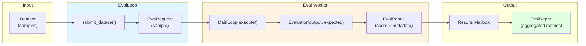
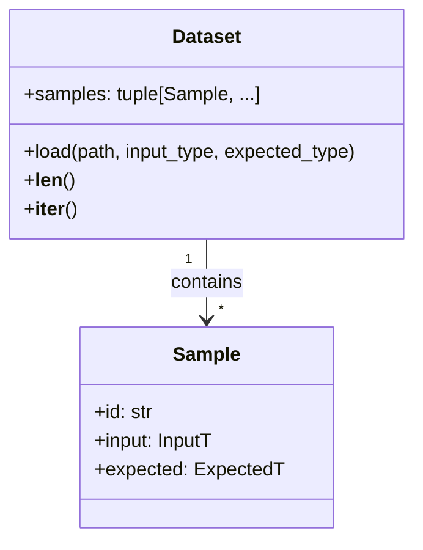
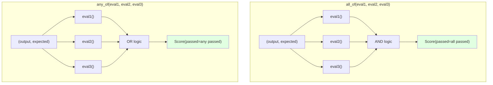
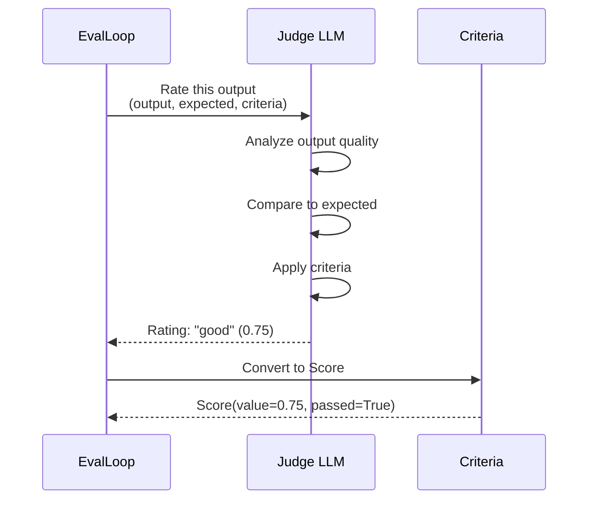
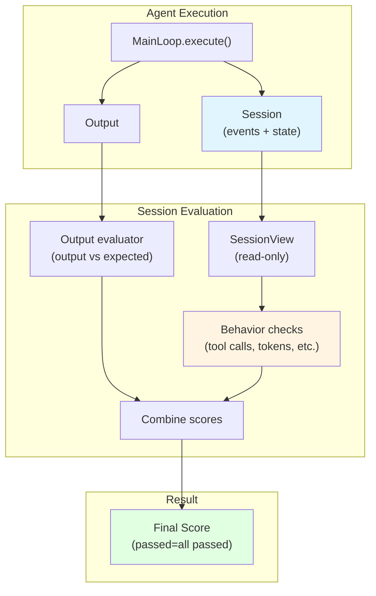
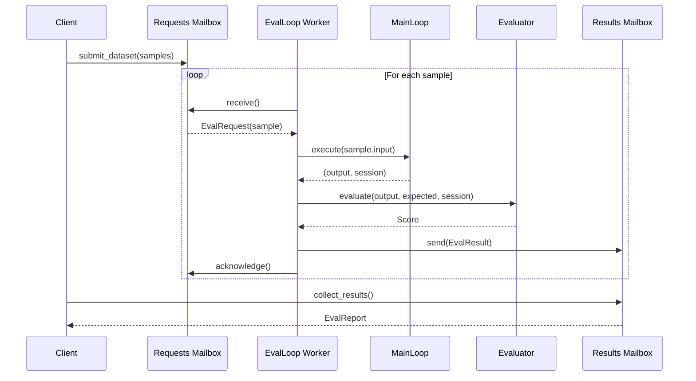
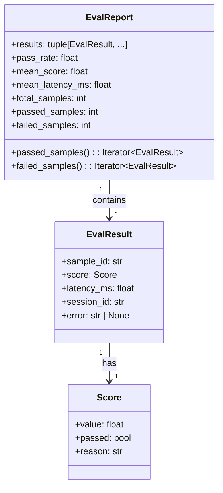
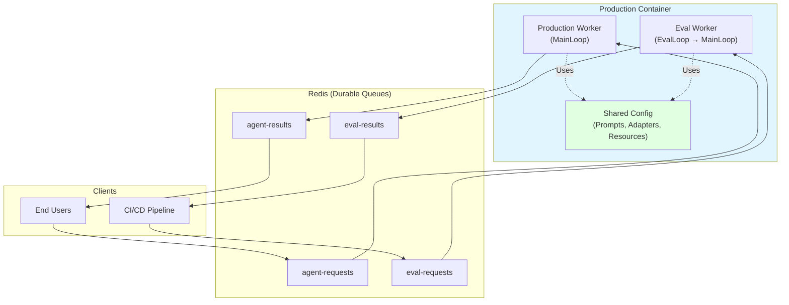
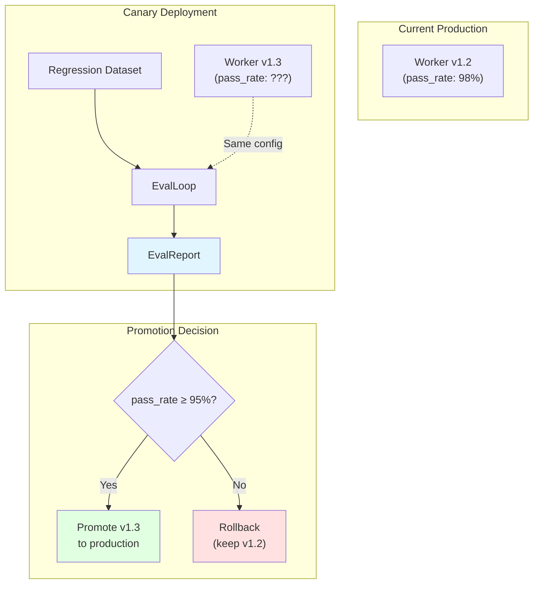
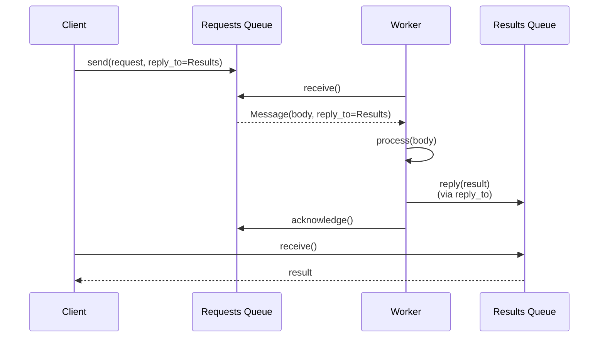

# Chapter 8: Evaluation

> **Canonical Reference**: See [specs/EVALS.md](../specs/EVALS.md) for the complete specification.

## Introduction

Evaluation is built on the same composition pattern as everything else in WINK:

> **EvalLoop wraps MainLoop.**

Rather than a separate evaluation framework, evals are just another way to drive your existing `MainLoop` with datasets and scoring. This means a worker in production can run both your regular agent logic (`MainLoop`) and your evaluation suite (`EvalLoop`) side by side—same prompt templates, same tools, same adapters.

Canary deployments become natural: run evals against your production configuration before rolling out changes.

In this chapter, you'll learn:

- **The composition philosophy** - How EvalLoop wraps MainLoop
- **Core types** - Samples, datasets, evaluators, and scores
- **LLM-as-judge** - Using models to score subjective criteria
- **Session evaluators** - Asserting on behavioral patterns, not just outputs
- **Running evaluations** - Submit datasets, collect results, generate reports
- **Production patterns** - Deploy eval workers alongside production agents
- **Reply-to routing** - Flexible result delivery using mailboxes

## The Composition Philosophy



**Key insight:** `EvalLoop` orchestrates evaluation by:

1. **Iterating over samples** - Each sample becomes an `EvalRequest`
2. **Executing through MainLoop** - Your existing agent logic handles the request
3. **Scoring outputs** - Evaluator functions compare output to expected
4. **Aggregating results** - Reports summarize pass rates, latencies, and failures

You already have a `MainLoop`—evals just add datasets and scoring.

## Core Types

### Sample and Dataset

A **sample** pairs input with expected output:

```python
from weakincentives.evals import Sample, Dataset

# Create a sample
sample = Sample(
    id="math-1",
    input="What is 2 + 2?",
    expected="4",
)

# Create a dataset from samples
dataset = Dataset(samples=(sample,))
```

**Loading from JSONL:**

```python
from pathlib import Path

# qa.jsonl format:
# {"id": "q1", "input": "What is the capital of France?", "expected": "Paris"}
# {"id": "q2", "input": "What is 10 + 5?", "expected": "15"}

dataset = Dataset.load(Path("qa.jsonl"), str, str)
```

**Dataset structure:**



### Score and Evaluator

**Score** represents the result of evaluating a single sample:

```python
from weakincentives.evals import Score

score = Score(
    value=1.0,           # Numeric score (0.0-1.0 typical)
    passed=True,         # Binary pass/fail
    reason="Correct answer found",  # Human-readable explanation
)
```

**Evaluator** is a pure function—no side effects, no state:

```python nocheck
from weakincentives.evals import Evaluator

def my_evaluator(output: str, expected: str) -> Score:
    passed = expected.lower() in output.lower()
    return Score(
        value=1.0 if passed else 0.0,
        passed=passed,
        reason="Found expected answer" if passed else "Missing expected answer",
    )
```

**Type signature:**

```python
from typing import Protocol

class Evaluator(Protocol):
    def __call__(self, output: object, expected: object) -> Score:
        ...
```

### Built-in Evaluators

```python
from weakincentives.evals import exact_match, contains, all_of, any_of

# Strict equality
score = exact_match("hello", "hello")  # passed=True
score = exact_match("hello", "Hello")  # passed=False

# Substring presence
score = contains("The answer is 42.", "42")  # passed=True
score = contains("The answer is 42.", "43")  # passed=False

# Combine evaluators
def my_custom_check(output: object, expected: object) -> Score:
    return Score(value=1.0, passed=True)

def fuzzy_match(output: object, expected: object) -> Score:
    return Score(value=0.9, passed=True)

# All must pass
evaluator = all_of(contains, my_custom_check)

# At least one must pass
evaluator = any_of(exact_match, fuzzy_match)
```

**Combinator semantics:**



## LLM-as-Judge

For subjective criteria, use an LLM to score outputs. The judge selects from a fixed set of rating labels that map to values:

```python nocheck
from typing import cast
from weakincentives.evals import llm_judge, all_of, Evaluator, contains
from weakincentives.adapters.openai import OpenAIAdapter

# Use a smaller model for judging
judge_adapter = OpenAIAdapter(model="gpt-4o-mini")

# Combine objective and subjective checks
evaluator = all_of(
    cast(Evaluator, contains),  # Cast for strict type compatibility
    llm_judge(judge_adapter, "Response is helpful"),  # type: ignore[arg-type]
    llm_judge(judge_adapter, "No hallucinated info"),  # type: ignore[arg-type]
)
```

### Rating Scale

The `llm_judge` factory creates an evaluator that prompts the model to rate outputs using these labels:

| Label | Value | Meaning |
|-------|-------|---------|
| `excellent` | 1.0 | Perfect response |
| `good` | 0.75 | Acceptable with minor issues |
| `fair` | 0.5 | Partially correct |
| `poor` | 0.25 | Mostly incorrect |
| `wrong` | 0.0 | Completely wrong |

### LLM-as-Judge Flow



**When to use LLM-as-judge:**

- ✅ Evaluating tone, style, or helpfulness
- ✅ Checking for hallucinations or factual accuracy
- ✅ Assessing creative outputs (summaries, rewrites)
- ✅ Multi-dimensional quality (coherence + relevance + clarity)

**When to avoid:**

- ❌ Objective criteria (use `exact_match`, `contains`)
- ❌ High-volume evaluations (slower and more expensive)
- ❌ When repeatability is critical (LLMs can be inconsistent)

## Session Evaluators

Sometimes you need to evaluate not just **what** the agent produced, but **how** it got there. Session evaluators receive a read-only `SessionView` and can assert on tool usage patterns, token budgets, and custom state invariants.

### Built-in Session Evaluators

```python
from weakincentives.evals import (
    tool_called,
    tool_not_called,
    tool_call_count,
    all_tools_succeeded,
    token_usage_under,
    slice_contains,
    adapt,
    exact_match,
)

# Combine output evaluation with behavioral assertions
evaluator = all_of(
    adapt(exact_match),                    # Output must match expected
    tool_called("search"),                 # Agent must have used search
    tool_not_called("fallback"),           # Should not have used fallback
    all_tools_succeeded(),                 # No tool failures
    token_usage_under(max_tokens=5000),    # Stay within budget
)
```

### Available Session Evaluators

| Evaluator | Description |
|-----------|-------------|
| `tool_called(name)` | Assert a specific tool was invoked |
| `tool_not_called(name)` | Assert a tool was never invoked |
| `tool_call_count(name, min_count, max_count)` | Assert call count within bounds |
| `all_tools_succeeded()` | Assert no tool failures occurred |
| `token_usage_under(max_tokens)` | Assert total token usage under limit |
| `slice_contains(T, predicate)` | Assert session slice contains matching value |

### Converting Standard Evaluators

Standard evaluators (that only see output and expected) can be converted to session-aware evaluators using `adapt()`:

```python
from weakincentives.evals import adapt, exact_match, all_of, tool_called

# adapt() wraps a standard evaluator to ignore the session
evaluator = all_of(
    adapt(exact_match),    # Now works with session evaluators
    tool_called("search"),
)
```

### Session Evaluator Flow



### Custom Session Evaluators

```python
from weakincentives.evals import Score, SessionEvaluator
from weakincentives.runtime.session import SessionView
from weakincentives.runtime import ToolInvoked

def custom_session_check(
    output: str,
    expected: str,
    session: SessionView,
) -> Score:
    # Check how many tools were called
    tool_events = session[ToolInvoked].all()

    if len(tool_events) > 10:
        return Score(
            value=0.0,
            passed=False,
            reason=f"Too many tool calls: {len(tool_events)} (max 10)",
        )

    # Check for specific patterns
    plan = session[Plan].latest()
    if plan and len(plan.steps) < 3:
        return Score(
            value=0.5,
            passed=False,
            reason="Plan too simple (fewer than 3 steps)",
        )

    return Score(value=1.0, passed=True, reason="Behavioral checks passed")
```

### Example: Multi-Criteria Evaluation

```python
from weakincentives.evals import all_of, adapt, contains

# Combine output, tool usage, and efficiency checks
evaluator = all_of(
    # Output must contain expected answer
    adapt(contains),

    # Must use the research tool
    tool_called("research"),

    # Should not need the fallback tool
    tool_not_called("fallback"),

    # All tools should succeed (no errors)
    all_tools_succeeded(),

    # Stay under token budget
    token_usage_under(max_tokens=10_000),

    # Call research at most 3 times
    tool_call_count("research", min_count=1, max_count=3),
)
```

## Running Evaluations

### EvalLoop Setup

`EvalLoop` wraps your `MainLoop`:

```python nocheck
from typing import Any, cast
from weakincentives.evals import EvalLoop, EvalRequest, EvalResult, exact_match, Evaluator
from weakincentives.runtime import InMemoryMailbox, MainLoop

# Your existing MainLoop (defined elsewhere in your application)
main_loop: MainLoop[Any, str] = ...  # type: ignore[assignment]

# Create mailbox for evaluation requests
eval_requests: InMemoryMailbox[EvalRequest[str, str], EvalResult] = InMemoryMailbox(
    name="eval-requests"
)

# Create EvalLoop wrapping your MainLoop
eval_loop = EvalLoop(
    loop=main_loop,
    evaluator=cast(Evaluator, exact_match),  # Cast for strict type compatibility
    requests=eval_requests,  # type: ignore[arg-type]
)
```

### Submit Samples and Collect Results

```python
from typing import Any
from weakincentives.evals import submit_dataset, collect_results, Dataset, EvalResult
from weakincentives.runtime.mailbox import InMemoryMailbox

# Dataset defined in your application
eval_dataset: Dataset[str, str] = ...  # type: ignore[assignment]

# Create mailboxes
eval_requests_mailbox: InMemoryMailbox[Any, Any] = InMemoryMailbox(name="eval-requests")
eval_results_mailbox: InMemoryMailbox[EvalResult, None] = InMemoryMailbox(
    name="eval-results"
)

# Submit all samples to the requests mailbox
submit_dataset(
    eval_dataset,
    eval_requests_mailbox,
    reply_to=eval_results_mailbox,  # Results go here
)  # type: ignore[arg-type]

# Run the evaluation worker
eval_loop.run(max_iterations=1)

# Collect results into a report
report = collect_results(eval_results_mailbox, expected_count=len(eval_dataset))

# Inspect the report
print(f"Pass rate: {report.pass_rate:.1%}")
print(f"Mean score: {report.mean_score:.2f}")
print(f"Mean latency: {report.mean_latency_ms:.0f}ms")

# Review failures
for result in report.failed_samples():
    print(f"Failed: {result.sample_id} - {result.score.reason}")
```

### Evaluation Flow



### EvalReport

```python nocheck
from weakincentives.evals import EvalReport

report: EvalReport = collect_results(results_mailbox, expected_count=len(dataset))

# Aggregate metrics
report.pass_rate           # Fraction of samples that passed (0.0-1.0)
report.mean_score          # Average score across all samples
report.mean_latency_ms     # Average execution time in milliseconds
report.total_samples       # Total number of samples evaluated
report.passed_samples      # Count of passing samples
report.failed_samples      # Count of failing samples

# Iterate over results
for result in report.results:
    print(f"{result.sample_id}: {result.score.value} ({result.score.reason})")

# Filter failures
for result in report.failed_samples():
    print(f"Failed: {result.sample_id} - {result.score.reason}")

# Filter passes
for result in report.passed_samples():
    print(f"Passed: {result.sample_id}")
```

### Report Structure



## Production Deployment Pattern

In production, run both `MainLoop` and `EvalLoop` workers from the same process or container. This ensures your evaluation suite runs against the exact same configuration as your production agent.

### Production Worker Setup

```python nocheck
from threading import Thread
from typing import Any, cast
from weakincentives.contrib.mailbox import RedisMailbox
from weakincentives.evals import EvalLoop, exact_match, Evaluator
from weakincentives.runtime import MainLoop

# Type stubs for external dependencies
prod_redis_client: Any = ...  # type: ignore[assignment]
prod_main_loop: MainLoop[Any, str] = ...  # type: ignore[assignment]

# Production mailboxes (Redis-backed for durability)
prod_requests: RedisMailbox[Any, Any] = RedisMailbox(
    name="agent-requests",
    client=prod_redis_client,
)
prod_results: RedisMailbox[Any, None] = RedisMailbox(
    name="agent-results",
    client=prod_redis_client,
)

prod_eval_requests: RedisMailbox[Any, Any] = RedisMailbox(
    name="eval-requests",
    client=prod_redis_client,
)

# Production worker
def run_production() -> None:
    while True:
        for msg in prod_requests.receive():
            response, _session = prod_main_loop.execute(msg.body)
            prod_results.send(response)
            msg.acknowledge()

# Eval worker (wraps the same MainLoop)
prod_eval_loop = EvalLoop(
    loop=prod_main_loop,
    evaluator=cast(Evaluator, exact_match),
    requests=prod_eval_requests,
)

# Run both in parallel
Thread(target=run_production, daemon=True).start()
prod_eval_loop.run()  # Blocks, processing eval requests
```

### Production Deployment Topology



**Benefits of co-located workers:**

1. **Same configuration** - Evals use identical prompts, tools, and adapters
2. **Same environment** - Network, database, and file system state
3. **Same deployment** - One container, one image, one rollout
4. **Same metrics** - Unified observability and logging

### Canary Deployment

Before rolling out prompt or configuration changes, submit your eval dataset to the new worker and verify the pass rate meets your threshold:

```python
from weakincentives.evals import submit_dataset, collect_results

# Submit eval dataset to canary worker
submit_dataset(regression_dataset, canary_eval_requests, reply_to=canary_results)

# Collect and check results
report = collect_results(canary_eval_results, expected_count=len(regression_dataset))

if report.pass_rate < 0.95:
    raise RollbackError(f"Canary failed: {report.pass_rate:.1%} pass rate")

# Pass rate acceptable - promote canary to production
promote_canary_to_production()
```

### Canary Flow



**This is the control plane for safe model upgrades:** verify behavior programmatically before promoting changes.

## Reply-to Routing

When workers need to send results to dynamic destinations (not a fixed result mailbox), use the `reply_to` pattern. The worker derives the response destination from the incoming message.

### Basic Reply-to Pattern

```python
from dataclasses import dataclass
from typing import Any
from weakincentives.runtime.mailbox import InMemoryMailbox

@dataclass(frozen=True)
class AnalysisRequest:
    query: str

def process(body: Any) -> Any:
    ...  # type: ignore[empty-body]

# Setup: resolver maps identifiers to mailboxes
requests: InMemoryMailbox[Any, Any] = InMemoryMailbox(name="requests")
client_responses: InMemoryMailbox[Any, None] = InMemoryMailbox(name="client-123")

# Client sends request with reply_to mailbox reference
requests.send(
    body=AnalysisRequest(query="Find all bugs"),  # type: ignore[arg-type]
    reply_to=client_responses,  # Mailbox to send the result to
)

# Worker processes and replies
for msg in requests.receive():
    result = process(msg.body)
    msg.reply(result)       # Sends directly to client_responses mailbox
    msg.acknowledge()
```

### Reply-to Flow



### Eval Run Collection with Reply-to

All samples specify the same `reply_to`, and results collect into one mailbox regardless of which worker processes each sample:

```python
from typing import Any
from uuid import uuid4
from weakincentives.contrib.mailbox import RedisMailbox, RedisMailboxFactory
from weakincentives.evals import EvalRequest, Sample
from weakincentives.runtime.mailbox import CompositeResolver

# External dependencies
redis_client: Any = ...  # type: ignore[assignment]
eval_samples: list[Sample[str, str]] = []

# Factory creates mailboxes on demand
factory: RedisMailboxFactory[Any] = RedisMailboxFactory(client=redis_client)
redis_resolver: CompositeResolver[Any] = CompositeResolver(registry={}, factory=factory)

redis_requests: RedisMailbox[Any, Any] = RedisMailbox(
    name="eval-requests",
    client=redis_client,
    reply_resolver=redis_resolver,
)

# Create run-specific results mailbox
run_id = f"eval-run-{uuid4()}"
results_mailbox: RedisMailbox[Any, None] = RedisMailbox(
    name=run_id,
    client=redis_client,
)

# Submit all samples with mailbox reference
for sample in eval_samples:
    redis_requests.send(
        body=EvalRequest(sample=sample),  # type: ignore[arg-type]
        reply_to=results_mailbox,  # All results go to same mailbox
    )

# Collect results from the results mailbox
collected: list[Any] = []
while len(collected) < len(eval_samples):
    for msg in results_mailbox.receive(wait_time_seconds=5):
        collected.append(msg.body)
        msg.acknowledge()
```

### Multiple Replies

Workers can send progress updates before the final result:

```python
from dataclasses import dataclass

@dataclass(frozen=True)
class Progress:
    step: int
    status: str

@dataclass(frozen=True)
class Complete:
    result: str

# Worker sends multiple replies
for msg in requests.receive():
    msg.reply(Progress(step=1, status="Analyzing..."))
    # ... do work ...

    msg.reply(Progress(step=2, status="Generating fix..."))
    # ... more work ...

    msg.reply(Complete(result=fix))
    msg.acknowledge()
```

### Reply-to with Distributed Workers

```mermaid
flowchart TB
    subgraph Submission["1. Submit Samples"]
        Client["Client"]
        Samples["100 samples"]
        ResultsBox["results-mailbox-ABC"]
    end

    subgraph Queue["2. Shared Queue"]
        Requests["eval-requests<br/>(100 messages)"]
    end

    subgraph Workers["3. Distributed Workers"]
        Worker1["Worker 1<br/>(30 samples)"]
        Worker2["Worker 2<br/>(40 samples)"]
        Worker3["Worker 3<br/>(30 samples)"]
    end

    subgraph Collection["4. Collect Results"]
        Results["results-mailbox-ABC<br/>(100 results)"]
        Report["EvalReport"]
    end

    Client --> Samples
    Samples -->|reply_to=ResultsBox| Requests

    Requests --> Worker1
    Requests --> Worker2
    Requests --> Worker3

    Worker1 -->|reply()| Results
    Worker2 -->|reply()| Results
    Worker3 -->|reply()| Results

    Results --> Report

    style Requests fill:#e1f5ff
    style Results fill:#e1ffe1
```

**Key properties:**

- **Dynamic routing** - Each request specifies where results should go
- **Worker-agnostic** - Any worker can process any request
- **Run isolation** - Each eval run gets its own results mailbox
- **Parallel execution** - Multiple workers process samples concurrently

## Best Practices

### 1. Use Exact Match for Objective Criteria

```python
# Good: Fast and deterministic
evaluator = exact_match

# Avoid: Slow and non-deterministic for simple checks
evaluator = llm_judge(adapter, "Output matches expected")
```

### 2. Combine Evaluators for Multi-Criteria Assessment

```python
# Test multiple dimensions
evaluator = all_of(
    adapt(contains),           # Output correctness
    tool_called("research"),   # Required tool usage
    all_tools_succeeded(),     # No failures
    token_usage_under(10_000), # Efficiency
)
```

### 3. Use Session Evaluators for Behavioral Regression

```python
# Detect behavior changes even if output is correct
evaluator = all_of(
    adapt(exact_match),
    tool_call_count("expensive_api", min_count=0, max_count=2),  # Limit API calls
)
```

### 4. Set Up Canary Deployments

```python
# Run evals before promoting
if canary_report.pass_rate < baseline_report.pass_rate * 0.95:
    raise RollbackError("Canary performance degraded")
```

### 5. Track Eval Metrics Over Time

```python
# Log metrics for monitoring
logging.info(
    "Eval run complete",
    extra={
        "pass_rate": report.pass_rate,
        "mean_score": report.mean_score,
        "mean_latency_ms": report.mean_latency_ms,
        "version": deployment_version,
    },
)
```

### 6. Use Unique Run IDs for Isolation

```python
# Avoid result collisions
run_id = f"eval-run-{uuid4()}"
results_mailbox = RedisMailbox(name=run_id, client=redis_client)
```

### 7. Review Failures Regularly

```python
# Triage failures
for result in report.failed_samples():
    print(f"Sample: {result.sample_id}")
    print(f"Reason: {result.score.reason}")
    print(f"Latency: {result.latency_ms}ms")
    print("---")
```

## Common Patterns

### Pattern: Regression Testing

Run evals on every deployment:

```python
def run_regression_tests() -> None:
    dataset = Dataset.load(Path("regression.jsonl"), str, str)
    submit_dataset(dataset, eval_requests, reply_to=results_mailbox)

    eval_loop.run(max_iterations=1)

    report = collect_results(results_mailbox, expected_count=len(dataset))

    if report.pass_rate < 0.95:
        raise RegressionError(f"Regression detected: {report.pass_rate:.1%}")
```

### Pattern: A/B Testing

Compare two configurations:

```python
# Baseline
baseline_loop = MyLoop(adapter=adapter_v1, bus=bus)
baseline_eval = EvalLoop(loop=baseline_loop, evaluator=evaluator, requests=baseline_requests)

# Variant
variant_loop = MyLoop(adapter=adapter_v2, bus=bus)
variant_eval = EvalLoop(loop=variant_loop, evaluator=evaluator, requests=variant_requests)

# Run both
submit_dataset(dataset, baseline_requests, reply_to=baseline_results)
submit_dataset(dataset, variant_requests, reply_to=variant_results)

baseline_report = collect_results(baseline_results, expected_count=len(dataset))
variant_report = collect_results(variant_results, expected_count=len(dataset))

# Compare
if variant_report.pass_rate > baseline_report.pass_rate:
    print("Variant wins!")
```

### Pattern: Progressive Eval Runs

Start with a small sample, expand if promising:

```python nocheck
# Phase 1: Quick smoke test (10 samples)
smoke_test = Dataset(samples=dataset.samples[:10])
submit_dataset(smoke_test, eval_requests, reply_to=results)
smoke_report = collect_results(results, expected_count=len(smoke_test))

if smoke_report.pass_rate < 0.8:
    print("Smoke test failed, skipping full eval")
    return

# Phase 2: Full regression (all samples)
submit_dataset(dataset, eval_requests, reply_to=results)
full_report = collect_results(results, expected_count=len(dataset))
```

## Summary

WINK's evaluation system provides:

- **Composition over frameworks** - `EvalLoop` wraps `MainLoop`, reusing all your existing logic
- **Typed datasets** - Type-safe samples with input and expected output
- **Pure evaluators** - Deterministic scoring functions with no side effects
- **LLM-as-judge** - Leverage models for subjective evaluation criteria
- **Session evaluators** - Assert on behavioral patterns, not just outputs
- **Production patterns** - Co-locate eval workers with production for canary deployments
- **Reply-to routing** - Flexible result delivery using mailbox references
- **Aggregated reports** - Pass rates, mean scores, latencies, and failure details

Evaluation is not a separate framework—it's a natural extension of your agent's execution loop. This means evals always test your real implementation, with real prompts and real tools.

## Next Steps

- **[Chapter 5: Sessions](05-sessions.md)** - Understand session state for behavioral assertions
- **[Chapter 7: Main Loop](07-main-loop.md)** - Learn how MainLoop orchestrates execution
- **[Chapter 9: Lifecycle Management](09-lifecycle.md)** - Deploy eval workers with LoopGroup
- **[Chapter 11: Prompt Optimization](11-prompt-optimization.md)** - Use evals to drive prompt improvements
- **[Chapter 16: Recipes](16-recipes.md)** - See complete evaluation examples

---

**Canonical Reference**: See [specs/EVALS.md](../specs/EVALS.md) for the complete specification, including evaluator composition semantics, session evaluator protocols, report aggregation algorithms, and mailbox routing details.
