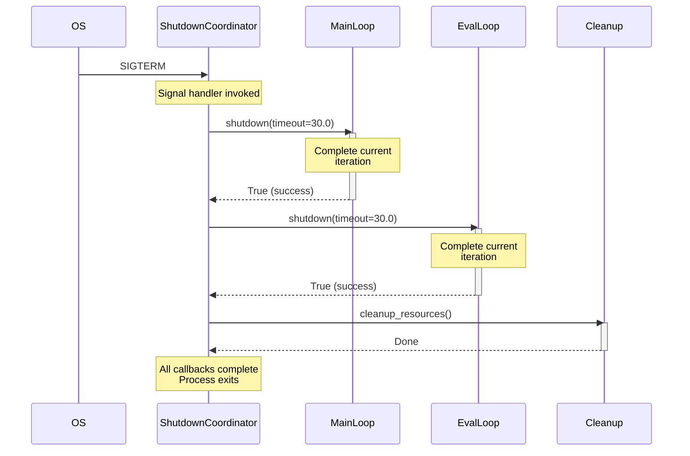

# Chapter 9: Lifecycle Management

> **Canonical Reference**: See [specs/HEALTH.md](/specs/HEALTH.md) and [specs/LIFECYCLE.md](/specs/LIFECYCLE.md) for complete specifications.

## Introduction

Production agent systems require careful orchestration of startup, shutdown, and health monitoring. Whether you're deploying to Kubernetes, running background workers, or managing long-running evaluation loops, you need:

- **Coordinated shutdown** when receiving SIGTERM or SIGINT
- **Health endpoints** for liveness and readiness probes
- **Watchdog protection** to detect and terminate stuck workers
- **Multi-loop orchestration** to run MainLoop and EvalLoop together

WINK's lifecycle primitives solve these problems with minimal configuration. This chapter covers the `LoopGroup` abstraction, manual shutdown coordination, the `Runnable` protocol, and production health monitoring patterns.

By the end of this chapter, you'll understand how to deploy WINK agents safely in containerized environments and handle graceful degradation when things go wrong.

## The Lifecycle Management Model

WINK's lifecycle system coordinates multiple concurrent loops with centralized health monitoring:

```mermaid
flowchart TB
    subgraph LoopGroup["LoopGroup (Main Thread)"]
        Coordinator["ShutdownCoordinator"]
        Health["Health Server\n(HTTP :8080)"]
        Watchdog["Watchdog Monitor"]
    end

    subgraph Loops["Worker Threads"]
        MainLoop["MainLoop Thread"]
        EvalLoop["EvalLoop Thread"]
    end

    subgraph Signals["OS Signals"]
        SIGTERM["SIGTERM"]
        SIGINT["SIGINT"]
    end

    subgraph K8s["Kubernetes"]
        Liveness["/health/live probe"]
        Readiness["/health/ready probe"]
    end

    SIGTERM --> Coordinator
    SIGINT --> Coordinator

    Coordinator -->|shutdown()| MainLoop
    Coordinator -->|shutdown()| EvalLoop

    MainLoop -.->|heartbeat| Watchdog
    EvalLoop -.->|heartbeat| Watchdog

    Watchdog -->|stalled?| Kill["SIGKILL process"]

    Liveness --> Health
    Readiness --> Health

    Health -.->|check| MainLoop
    Health -.->|check| EvalLoop

    style LoopGroup fill:#e1f5ff
    style Loops fill:#fff4e1
    style Kill fill:#ffe1e1
```

**Key components:**

1. **LoopGroup** manages multiple loops in separate threads
2. **ShutdownCoordinator** installs signal handlers and triggers graceful shutdown
3. **Health Server** exposes HTTP endpoints for Kubernetes probes
4. **Watchdog Monitor** detects stuck workers via heartbeat timeout

## 9.1 LoopGroup: Running Multiple Loops

`LoopGroup` runs multiple loops (MainLoop, EvalLoop, or custom implementations) in separate threads with coordinated shutdown.

### Basic Usage

The simplest configuration runs loops without health monitoring:

```python
from weakincentives.runtime import LoopGroup

# Run MainLoop and EvalLoop together
group = LoopGroup(loops=[main_loop, eval_loop])
group.run()  # Blocks until SIGTERM or SIGINT
```

When the process receives SIGTERM or SIGINT:

1. ShutdownCoordinator invokes `shutdown()` on each loop
2. Each loop completes its current iteration
3. Threads join within the configured timeout
4. Process exits gracefully

### Production Configuration

For Kubernetes deployments, enable health endpoints and watchdog monitoring:

```python
from weakincentives.runtime import LoopGroup

group = LoopGroup(
    loops=[main_loop, eval_loop],
    health_port=8080,           # Exposes /health/live and /health/ready
    health_host="0.0.0.0",      # Bind to all interfaces
    watchdog_threshold=720.0,   # Terminate if worker stalls for 12 minutes
    watchdog_interval=60.0,     # Check heartbeats every minute
)
group.run()
```

**Configuration parameters:**

- `loops`: Sequence of `Runnable` instances (required)
- `health_port`: Port for health endpoints (default: None, disabled)
- `health_host`: Bind address (default: `"127.0.0.1"`)
- `watchdog_threshold`: Maximum seconds without heartbeat before SIGKILL (default: None, disabled)
- `watchdog_interval`: Seconds between watchdog checks (default: 60.0)

### Health Endpoints

When `health_port` is set, LoopGroup starts an HTTP server with two endpoints:

#### `/health/live` (Liveness Probe)

Returns 200 OK if the process is running. Kubernetes restarts pods that fail liveness checks.

```bash
$ curl http://localhost:8080/health/live
{"status": "alive"}
```

#### `/health/ready` (Readiness Probe)

Returns 200 OK if all loops report readiness. Kubernetes removes pods from service load balancers when readiness fails.

```bash
$ curl http://localhost:8080/health/ready
{"status": "ready", "loops": {"MainLoop": "ready", "EvalLoop": "ready"}}
```

A loop is "ready" when:
- Its `running` property is True
- Its `heartbeat` was updated within the threshold

See [Chapter 7](07-main-loop.md) for MainLoop configuration and [Chapter 8](08-evaluation.md) for EvalLoop details.

### Watchdog Behavior

The watchdog monitors each loop's heartbeat timestamp. If any loop exceeds `watchdog_threshold` without updating its heartbeat:

1. Watchdog logs a fatal error
2. Watchdog sends SIGKILL to the current process
3. The container orchestrator restarts the pod

```mermaid
sequenceDiagram
    participant Loop as MainLoop
    participant Watchdog
    participant Process

    Loop->>Watchdog: heartbeat (t=0s)
    Loop->>Watchdog: heartbeat (t=60s)
    Loop->>Watchdog: heartbeat (t=120s)

    Note over Loop: Loop hangs!

    loop Every 60s
        Watchdog->>Watchdog: Check heartbeats
    end

    Note over Watchdog: t=840s: Last heartbeat at 120s<br/>Threshold: 720s<br/>Δ = 720s exceeded

    Watchdog->>Process: SIGKILL

    Note over Process: Container orchestrator<br/>restarts pod
```

This prevents "stuck worker" scenarios where a loop hangs indefinitely (e.g., deadlock, infinite loop, unresponsive LLM provider).

**Important**: Set `watchdog_threshold` higher than your maximum expected prompt evaluation time. If a single prompt can take 10 minutes, use at least 720 seconds (12 minutes).

## 9.2 ShutdownCoordinator: Manual Signal Handling

For finer control over shutdown behavior, use `ShutdownCoordinator` directly:

```python
from weakincentives.runtime import ShutdownCoordinator

# Install signal handlers for SIGTERM and SIGINT
coordinator = ShutdownCoordinator.install()

# Register shutdown callbacks (called in registration order)
coordinator.register(loop.shutdown)
coordinator.register(lambda: cleanup_resources())

# Run your loop
loop.run()
```

The coordinator installs signal handlers that invoke all registered callbacks when SIGTERM or SIGINT arrives. Callbacks are invoked synchronously in registration order.

### Shutdown Sequence



### Use Cases

Use `ShutdownCoordinator` directly when:

- You're managing loops manually (not using LoopGroup)
- You need custom cleanup logic beyond loop shutdown
- You want explicit control over callback ordering

Use `LoopGroup` when:
- You want automatic thread management
- You need health endpoints and watchdog monitoring
- You're deploying to Kubernetes

See [specs/LIFECYCLE.md](/specs/LIFECYCLE.md) for detailed shutdown semantics.

## 9.3 The Runnable Protocol

Both `MainLoop` and `EvalLoop` implement the `Runnable` protocol, which defines the interface LoopGroup requires:

```python
from typing import Protocol
from weakincentives.runtime import Heartbeat


class Runnable(Protocol):
    """Protocol for loops managed by LoopGroup."""

    def run(self, *, max_iterations: int | None = None) -> None:
        """Run the loop until shutdown or max_iterations reached."""
        ...

    def shutdown(self, *, timeout: float = 30.0) -> bool:
        """Request graceful shutdown. Returns True if successful."""
        ...

    @property
    def running(self) -> bool:
        """True if the loop is currently running."""
        ...

    @property
    def heartbeat(self) -> Heartbeat | None:
        """Heartbeat tracker for watchdog monitoring (or None)."""
        ...
```

### Heartbeat Protocol

The `Heartbeat` class tracks the last update timestamp:

```python
from dataclasses import dataclass
from datetime import datetime


@dataclass
class Heartbeat:
    """Tracks loop liveness for watchdog monitoring."""
    last_update: datetime

    def update(self) -> None:
        """Update timestamp to current time."""
        self.last_update = datetime.now()
```

MainLoop and EvalLoop update their heartbeats after processing each message or evaluation. The watchdog reads `heartbeat.last_update` to detect stalls.

### Implementing Custom Runnables

You can create custom loop implementations that work with LoopGroup:

```python
from dataclasses import dataclass
from datetime import datetime
from threading import Event
from weakincentives.runtime import Heartbeat


@dataclass
class CustomLoop:
    """Custom loop implementation."""
    _running: bool = False
    _shutdown_event: Event = None
    _heartbeat: Heartbeat | None = None

    def __post_init__(self) -> None:
        self._shutdown_event = Event()
        self._heartbeat = Heartbeat(last_update=datetime.now())

    def run(self, *, max_iterations: int | None = None) -> None:
        self._running = True
        iteration = 0

        while not self._shutdown_event.is_set():
            # Do work
            process_item()

            # Update heartbeat
            if self._heartbeat:
                self._heartbeat.update()

            iteration += 1
            if max_iterations and iteration >= max_iterations:
                break

        self._running = False

    def shutdown(self, *, timeout: float = 30.0) -> bool:
        self._shutdown_event.set()
        # Wait for current iteration to complete
        return True

    @property
    def running(self) -> bool:
        return self._running

    @property
    def heartbeat(self) -> Heartbeat | None:
        return self._heartbeat
```

This enables LoopGroup to manage any compliant loop implementation alongside WINK's built-in loops.

## 9.4 Health and Watchdog Configuration

### Timeout Calibration

The most common configuration mistake is misaligned timeouts. Follow these guidelines:

1. **Prompt evaluation timeout**: Maximum time a single prompt evaluation can take (e.g., 600 seconds for complex prompts)
2. **Watchdog threshold**: Must exceed prompt timeout plus buffer (e.g., 720 seconds = 600s + 120s buffer)
3. **Visibility timeout**: SQS/Redis message visibility must exceed watchdog threshold (e.g., 900 seconds)

```python
# Correct configuration
group = LoopGroup(
    loops=[main_loop],
    watchdog_threshold=720.0,  # 12 minutes (exceeds 10-min prompts)
)

# MainLoop configuration
main_loop.run(
    visibility_timeout=900,    # 15 minutes (exceeds watchdog)
)
```

**Why this matters:**

- If `watchdog_threshold` < prompt timeout: Watchdog kills the process during legitimate long evaluations
- If `visibility_timeout` < `watchdog_threshold`: Messages become visible to other workers before the watchdog can kill stuck workers, causing duplicate processing

```mermaid
gantt
    title Timeout Relationship
    dateFormat X
    axisFormat %S

    section Prompt
    Evaluation: 0, 600s

    section Watchdog
    Threshold: 0, 720s

    section SQS
    Visibility Timeout: 0, 900s
```



### Health Check Tuning

Kubernetes probe configuration should account for loop responsiveness:

```yaml
# deployment.yaml
apiVersion: apps/v1
kind: Deployment
spec:
  template:
    spec:
      containers:
      - name: agent
        image: my-agent:latest
        ports:
        - containerPort: 8080
          name: health
        livenessProbe:
          httpGet:
            path: /health/live
            port: health
          initialDelaySeconds: 30
          periodSeconds: 10
          timeoutSeconds: 5
          failureThreshold: 3
        readinessProbe:
          httpGet:
            path: /health/ready
            port: health
          initialDelaySeconds: 10
          periodSeconds: 5
          timeoutSeconds: 3
          failureThreshold: 2
```

**Configuration notes:**

- **Liveness**: Conservative thresholds (3 failures × 10s = 30s grace period) prevent spurious restarts during load spikes
- **Readiness**: Aggressive thresholds (2 failures × 5s = 10s) quickly remove unhealthy pods from load balancers
- **initialDelaySeconds**: Longer for liveness (allow time for initialization) than readiness

### Watchdog Interval

The `watchdog_interval` controls how often the watchdog checks heartbeats:

```python
group = LoopGroup(
    loops=[main_loop],
    watchdog_threshold=720.0,    # 12 minutes
    watchdog_interval=60.0,      # Check every minute
)
```

- **Lower interval** (e.g., 30s): Faster detection of stuck workers, higher CPU overhead
- **Higher interval** (e.g., 120s): Lower overhead, slower detection

The default of 60 seconds balances detection speed with resource usage. For critical workloads where fast failure detection matters, use 30 seconds. For batch processing where 2-minute detection latency is acceptable, use 120 seconds.

## Integration with MainLoop

MainLoop automatically updates its heartbeat after processing each message. No configuration needed:

```python
from weakincentives.runtime import MainLoop

# Heartbeat is created and updated automatically
main_loop = MainLoop(
    mailbox=mailbox,
    adapter=adapter,
    prompt=prompt,
)

# LoopGroup can monitor the heartbeat
group = LoopGroup(
    loops=[main_loop],
    watchdog_threshold=720.0,
)
group.run()
```

See [Chapter 7](07-main-loop.md) for MainLoop details.

## Integration with EvalLoop

EvalLoop also updates its heartbeat automatically after each evaluation:

```python
from weakincentives.evals import EvalLoop

# Heartbeat is created and updated automatically
eval_loop = EvalLoop(
    evaluator=evaluator,
    dataset=dataset,
    adapter=adapter,
)

# LoopGroup can monitor both loops
group = LoopGroup(
    loops=[main_loop, eval_loop],
    watchdog_threshold=720.0,
)
group.run()
```

See [Chapter 8](08-evaluation.md) for EvalLoop details.

## Testing Lifecycle Behavior

### Testing Shutdown

Test graceful shutdown with max_iterations:

```python
from weakincentives.runtime import LoopGroup

def test_graceful_shutdown() -> None:
    """Test that loops shutdown cleanly."""
    group = LoopGroup(loops=[main_loop])

    # Run for 5 iterations then shutdown
    group.run(max_iterations=5)

    # Verify clean shutdown
    assert not main_loop.running
    assert main_loop.heartbeat is not None
```

### Testing Health Endpoints

Test health endpoints with requests:

```python
import requests
from weakincentives.runtime import LoopGroup
from threading import Thread

def test_health_endpoints() -> None:
    """Test that health endpoints respond correctly."""
    group = LoopGroup(
        loops=[main_loop],
        health_port=8080,
    )

    # Run in background thread
    thread = Thread(target=lambda: group.run(max_iterations=10))
    thread.start()

    # Wait for server to start
    time.sleep(1)

    # Check liveness
    response = requests.get("http://localhost:8080/health/live")
    assert response.status_code == 200
    assert response.json()["status"] == "alive"

    # Check readiness
    response = requests.get("http://localhost:8080/health/ready")
    assert response.status_code == 200
    assert response.json()["status"] == "ready"

    thread.join()
```

### Testing Watchdog

Testing watchdog behavior requires simulating a stuck loop. See [specs/HEALTH.md](/specs/HEALTH.md) for detailed testing strategies.

## Common Patterns

### Pattern: Single Loop Deployment

For simple agents with only MainLoop:

```python
from weakincentives.runtime import LoopGroup, MainLoop

main_loop = MainLoop(
    mailbox=mailbox,
    adapter=adapter,
    prompt=prompt,
)

group = LoopGroup(
    loops=[main_loop],
    health_port=8080,
    watchdog_threshold=720.0,
)
group.run()
```

### Pattern: Main + Eval Deployment

For agents with continuous evaluation:

```python
from weakincentives.runtime import LoopGroup, MainLoop
from weakincentives.evals import EvalLoop

main_loop = MainLoop(...)
eval_loop = EvalLoop(...)

group = LoopGroup(
    loops=[main_loop, eval_loop],
    health_port=8080,
    watchdog_threshold=720.0,
)
group.run()
```

### Pattern: Custom Cleanup

For agents that need cleanup beyond loop shutdown:

```python
from weakincentives.runtime import ShutdownCoordinator, LoopGroup

def cleanup_resources() -> None:
    """Clean up external resources."""
    close_database_connections()
    flush_metrics()

coordinator = ShutdownCoordinator.install()
coordinator.register(cleanup_resources)

group = LoopGroup(loops=[main_loop])
group.run()
```

### Pattern: Staged Shutdown

For agents that need ordered shutdown:

```python
coordinator = ShutdownCoordinator.install()

# Shutdown order: stop accepting new work, finish current work, cleanup
coordinator.register(main_loop.shutdown)
coordinator.register(worker_pool.drain)
coordinator.register(cleanup_resources)
```

## Troubleshooting

### Issue: Watchdog Kills Healthy Workers

**Symptom**: Logs show "Watchdog threshold exceeded" followed by SIGKILL, but the loop was processing a legitimate request.

**Solution**: Increase `watchdog_threshold` to exceed your maximum prompt evaluation time:

```python
group = LoopGroup(
    loops=[main_loop],
    watchdog_threshold=900.0,  # Increase from 720s to 900s
)
```

### Issue: Duplicate Message Processing

**Symptom**: Same message processed by multiple workers.

**Solution**: Ensure `visibility_timeout` exceeds `watchdog_threshold`:

```python
main_loop.run(
    visibility_timeout=1200,  # Must exceed watchdog_threshold
)
```

### Issue: Health Probes Failing During Load

**Symptom**: Kubernetes restarts healthy pods during high load.

**Solution**: Increase `failureThreshold` and `periodSeconds` in liveness probe:

```yaml
livenessProbe:
  failureThreshold: 5        # Increase from 3
  periodSeconds: 15          # Increase from 10
```

### Issue: Graceful Shutdown Timeout

**Symptom**: Process receives SIGKILL because shutdown took too long.

**Solution**: Increase shutdown timeout and ensure loops complete quickly:

```python
# In custom loop implementation
def shutdown(self, *, timeout: float = 60.0) -> bool:  # Increase from 30.0
    self._shutdown_event.set()
    return wait_for_completion(timeout=timeout)
```

## Summary

This chapter covered WINK's lifecycle management system:

- **LoopGroup** orchestrates multiple loops with health monitoring and watchdog protection
- **ShutdownCoordinator** provides manual control over graceful shutdown
- **Runnable protocol** enables custom loop implementations
- **Health endpoints** integrate with Kubernetes liveness and readiness probes
- **Watchdog monitoring** detects and terminates stuck workers

Key takeaways:

1. Use `LoopGroup` for production deployments to Kubernetes
2. Configure `watchdog_threshold` > prompt timeout
3. Configure `visibility_timeout` > `watchdog_threshold`
4. Test graceful shutdown with `max_iterations`
5. Implement `Runnable` protocol for custom loops

**Next**: [Chapter 10](10-progressive-disclosure.md) covers progressive disclosure for cost optimization through selective context expansion.

**Related chapters:**
- [Chapter 7: Main Loop](07-main-loop.md) - MainLoop configuration and message processing
- [Chapter 8: Evaluation](08-evaluation.md) - EvalLoop and continuous evaluation
- [Chapter 13: Debugging & Observability](13-debugging.md) - Instrumentation and troubleshooting
