# Chapter 10: Progressive Disclosure

> **Canonical Reference**: See [specs/PROMPTS.md](../specs/PROMPTS.md) (Progressive Disclosure section) for the complete specification.

## Introduction

Long prompts are expensive—both in terms of API costs and latency. A comprehensive agent prompt might include:

- Detailed API documentation (5,000 tokens)
- Code style guidelines (2,000 tokens)
- Error handling patterns (1,500 tokens)
- Domain-specific knowledge (3,000 tokens)

That's 11,500 tokens before you even describe the task. If the agent only needs the API docs for a specific request, you're wasting 6,500 tokens (and the associated cost and latency).

**Progressive disclosure** is WINK's first-class solution: sections can render as summaries by default, and the model can request full expansion when needed. This keeps initial prompts lean while giving the model access to comprehensive context on demand.

This chapter covers:

- **SectionVisibility**: Controlling FULL vs SUMMARY rendering
- **Builtin tools**: `open_sections` and `read_section` for expansion
- **Visibility overrides**: How MainLoop manages expansion state
- **Cost optimization**: Measuring and improving token efficiency

By the end, you'll understand how to design prompts that minimize cost while maintaining comprehensive context when needed.

## The Progressive Disclosure Model

Progressive disclosure treats prompt sections as **lazily-loaded resources**:

```mermaid
flowchart LR
    subgraph Initial["Initial Prompt (Lean)"]
        Task["Task: Review PR #123"]
        Summary1["📋 Style guide available"]
        Summary2["📋 API docs available"]
        Summary3["📋 Error patterns available"]
    end

    subgraph Tools["Builtin Tools"]
        OpenSections["open_sections()"]
        ReadSection["read_section()"]
    end

    subgraph Expanded["Expanded Prompt (Detailed)"]
        Task2["Task: Review PR #123"]
        Full1["📖 Style Guide (2000 tokens)"]
        Summary2b["📋 API docs available"]
        Summary3b["📋 Error patterns available"]
    end

    Initial --> OpenSections
    OpenSections -->|"open_sections(['style_guide'])"| Expanded

    Initial --> ReadSection
    ReadSection -->|"read_section('api_docs')"| Response["Return full content<br/>(no state change)"]

    style Initial fill:#e1f5ff
    style Expanded fill:#fff4e1
    style Tools fill:#f0f9ff
```



**Key concepts:**

1. **Summaries** provide one-sentence descriptions of available context
2. **open_sections** expands sections permanently (for the session)
3. **read_section** returns content temporarily (no state change)
4. **Visibility overrides** persist expansion state in session slices

This approach achieves **cost efficiency** without sacrificing model capability.

## 10.1 SectionVisibility: FULL vs SUMMARY

A section can specify both full content and a summary:

```python
from weakincentives.prompt import MarkdownSection, SectionVisibility

section = MarkdownSection(
    title="API Documentation",
    key="api_docs",
    template="""
# API Documentation

## Authentication
POST /auth/token with client_id and client_secret...

## Endpoints
GET /users - List all users...
POST /users - Create a user...

[... 5000 tokens of detailed API docs ...]
""",
    summary="API documentation for authentication and user management endpoints.",
    visibility=SectionVisibility.SUMMARY,
)
```

**How visibility works:**

- `visibility=SectionVisibility.FULL`: Always render `template`
- `visibility=SectionVisibility.SUMMARY`: Render `summary` if present, else `template`
- `visibility=callable`: Call function to determine visibility at render time

### Static Visibility

For sections that should always summarize initially:

```python
section = MarkdownSection(
    title="Code Style Guide",
    key="style_guide",
    template=load_style_guide(),  # 2000 tokens
    summary="Code style guide covering naming, formatting, and best practices.",
    visibility=SectionVisibility.SUMMARY,
)
```

### Dynamic Visibility

For sections whose visibility depends on runtime context:

```python
def should_show_errors(context: RenderContext) -> SectionVisibility:
    """Show error patterns only if previous attempts failed."""
    session = context.session
    attempts = session[Attempt].all()
    if any(a.failed for a in attempts):
        return SectionVisibility.FULL
    return SectionVisibility.SUMMARY

section = MarkdownSection(
    title="Error Patterns",
    key="error_patterns",
    template=load_error_patterns(),
    summary="Common error patterns and solutions available.",
    visibility=should_show_errors,
)
```

The callable receives a `RenderContext` with access to the session, allowing visibility decisions based on current state.

### Rendering Behavior

When a section with `visibility=SUMMARY` renders:

1. Check for visibility override in `session[VisibilityOverrides]`
2. If override exists and is `FULL`, render `template`
3. Otherwise, if `summary` exists, render `summary`
4. Otherwise, render `template` (fallback)


This ensures sections always render something, even if misconfigured.

## 10.2 open_sections and read_section

When summarized sections exist, WINK automatically injects two builtin tools to the prompt.

### open_sections: Permanent Expansion

`open_sections` expands sections and raises `VisibilityExpansionRequired`, signaling MainLoop to retry with expanded sections:

```python
def open_sections(
    section_keys: list[str],
    reason: str,
) -> None:
    """
    Request expansion of summarized sections.

    Args:
        section_keys: List of section keys to expand (e.g., ["api_docs", "style_guide"])
        reason: Explanation of why expansion is needed

    Raises:
        VisibilityExpansionRequired: Always raised to trigger expansion and retry
    """
    ...
```

**Model usage:**

```python
# Model's tool call
{
    "name": "open_sections",
    "arguments": {
        "section_keys": ["api_docs"],
        "reason": "Need authentication details to complete the task"
    }
}
```

**MainLoop behavior:**

1. Tool raises `VisibilityExpansionRequired`
2. MainLoop catches the exception
3. MainLoop dispatches `SetVisibilityOverride` for each section
4. MainLoop re-renders the prompt with expanded sections
5. MainLoop retries the evaluation


The expansion is **permanent** for the session—once opened, sections remain expanded for all subsequent evaluations.

### read_section: Temporary Access

`read_section` returns the full content of a section without changing visibility state:

```python
def read_section(section_key: str) -> str:
    """
    Read the full content of a section without expanding it.

    Args:
        section_key: Key of the section to read

    Returns:
        Full rendered markdown content of the section
    """
    ...
```

**Model usage:**

```python
# Model's tool call
{
    "name": "read_section",
    "arguments": {
        "section_key": "api_docs"
    }
}
```

**Tool result:**

```json
{
    "content": "# API Documentation\n\n## Authentication\nPOST /auth/token with...",
    "is_error": false
}
```

The section remains summarized in the next turn—use this for reference material the model only needs temporarily.

```mermaid
flowchart LR
    subgraph Turn1["Turn 1"]
        Summary1["📋 API docs available"]
    end

    subgraph Action["Model Action"]
        Read["read_section('api_docs')"]
    end

    subgraph Result["Tool Result"]
        Content["Full docs returned"]
    end

    subgraph Turn2["Turn 2 (Next Evaluation)"]
        Summary2["📋 API docs available"]
    end

    Turn1 --> Read
    Read --> Content
    Content --> Turn2

    Note over Turn2: Section remains summarized

    style Summary1 fill:#e1f5ff
    style Summary2 fill:#e1f5ff
    style Content fill:#fff4e1
```

### When to Use Each

| Scenario | Tool | Rationale |
|----------|------|-----------|
| Frequent reference needed | `open_sections` | Avoid repeated expansions across turns |
| One-time lookup | `read_section` | Keep prompt lean for subsequent turns |
| Multi-step task requiring docs | `open_sections` | Model needs sustained access |
| Checking a specific detail | `read_section` | Temporary need, no ongoing relevance |

The model learns these patterns through tool descriptions and usage examples.

## 10.3 Visibility Overrides in Session State

Visibility overrides live in the `VisibilityOverrides` session slice—a mapping from section paths to `SectionVisibility` values.

### VisibilityOverrides Slice

```python
from dataclasses import dataclass
from weakincentives.prompt import SectionVisibility

@dataclass(frozen=True)
class VisibilityOverrides:
    """Mapping of section paths to visibility overrides."""
    overrides: dict[tuple[str, ...], SectionVisibility]
```

**Section paths** are tuples of keys representing the hierarchy:

- Top-level section: `("api_docs",)`
- Nested section: `("reference", "api_docs")`

### Setting Overrides

Dispatch `SetVisibilityOverride` to update visibility:

```python
from weakincentives.runtime.session import SetVisibilityOverride
from weakincentives.prompt import SectionVisibility

# Expand api_docs section
session.dispatch(
    SetVisibilityOverride(
        path=("api_docs",),
        visibility=SectionVisibility.FULL,
    )
)
```

MainLoop does this automatically when handling `open_sections`, but you can dispatch manually for testing or custom logic.

### Querying Overrides

Read current overrides from the session:

```python
# Get all overrides
overrides = session[VisibilityOverrides].latest()
if overrides:
    expanded = [
        path for path, vis in overrides.overrides.items()
        if vis == SectionVisibility.FULL
    ]
    print(f"Expanded sections: {expanded}")
```

### Clearing Overrides

Reset visibility state by clearing the slice:

```python
from weakincentives.runtime.session import ClearSlice

# Clear all visibility overrides
session.dispatch(ClearSlice(VisibilityOverrides))
```

Or dispatch a new `SetVisibilityOverride` with `SUMMARY`:

```python
# Collapse api_docs section
session.dispatch(
    SetVisibilityOverride(
        path=("api_docs",),
        visibility=SectionVisibility.SUMMARY,
    )
)
```

### Override Lifecycle


Overrides persist until explicitly cleared or the session ends.

## Cost Optimization Patterns

### Pattern: Tiered Documentation

Organize documentation in tiers by frequency of use:

```python
sections = [
    # Tier 1: Always visible (high frequency)
    MarkdownSection(
        title="Common Tasks",
        key="common_tasks",
        template=load_common_tasks(),
        visibility=SectionVisibility.FULL,  # Always expanded
    ),

    # Tier 2: Summarized by default (medium frequency)
    MarkdownSection(
        title="API Reference",
        key="api_reference",
        template=load_api_reference(),  # 5000 tokens
        summary="API reference for authentication, users, and resources.",
        visibility=SectionVisibility.SUMMARY,
    ),

    # Tier 3: Summarized by default (low frequency)
    MarkdownSection(
        title="Advanced Patterns",
        key="advanced_patterns",
        template=load_advanced_patterns(),  # 3000 tokens
        summary="Advanced patterns for error handling, retries, and caching.",
        visibility=SectionVisibility.SUMMARY,
    ),
]
```

This keeps common cases lean while making comprehensive docs accessible.

### Pattern: Conditional Visibility

Show details only when relevant:

```python
def should_show_auth_details(context: RenderContext) -> SectionVisibility:
    """Show auth details only if authentication is required."""
    session = context.session
    task = session[Task].latest()
    if task and "auth" in task.description.lower():
        return SectionVisibility.FULL
    return SectionVisibility.SUMMARY

section = MarkdownSection(
    title="Authentication",
    key="authentication",
    template=load_auth_docs(),
    summary="Authentication documentation available.",
    visibility=should_show_auth_details,
)
```

### Pattern: Progressive Examples

Start with minimal examples, expand for complex cases:

```python
basic_examples = """
# Basic Examples

## Create User
````python
client.create_user(name="Alice", email="alice@example.com")
````
"""

advanced_examples = """
# Advanced Examples

## Batch Operations
````python
with client.batch() as batch:
    for user in users:
        batch.create_user(**user)
````

## Error Handling
````python
try:
    client.create_user(...)
except ValidationError as e:
    handle_validation_error(e)
````

[... 2000 tokens of advanced examples ...]
"""

sections = [
    MarkdownSection(
        title="Examples",
        key="examples_basic",
        template=basic_examples,
        visibility=SectionVisibility.FULL,  # Always show basics
    ),
    MarkdownSection(
        title="Advanced Examples",
        key="examples_advanced",
        template=advanced_examples,
        summary="Advanced examples for batch operations, error handling, and edge cases.",
        visibility=SectionVisibility.SUMMARY,
    ),
]
```

### Pattern: Measuring Token Savings

Track token usage before and after progressive disclosure:

```python
from weakincentives.adapters.openai import OpenAIAdapter

adapter = OpenAIAdapter(model="gpt-4o")

# Before: full prompt
full_response = adapter.evaluate(full_prompt, session=session)
full_tokens = full_response.usage.prompt_tokens

# After: progressive disclosure
lean_response = adapter.evaluate(lean_prompt, session=session)
lean_tokens = lean_response.usage.prompt_tokens

savings = full_tokens - lean_tokens
print(f"Token savings: {savings} ({100 * savings / full_tokens:.1f}%)")
```

Measure across multiple evaluations to quantify impact.

## Integration with MainLoop

MainLoop handles `VisibilityExpansionRequired` automatically:

```python
from weakincentives.runtime import MainLoop

# MainLoop configuration
main_loop = MainLoop(
    mailbox=mailbox,
    adapter=adapter,
    prompt=prompt,
)

# When model calls open_sections:
# 1. MainLoop catches VisibilityExpansionRequired
# 2. MainLoop updates session[VisibilityOverrides]
# 3. MainLoop re-renders prompt with expanded sections
# 4. MainLoop retries evaluation
# 5. Model sees full content in next turn
```

No additional configuration needed—progressive disclosure works out of the box.

See [Chapter 7](07-main-loop.md) for MainLoop details.

## Testing Progressive Disclosure

### Testing Section Rendering

Verify that sections render summaries correctly:

```python nocheck
from weakincentives.prompt import Prompt, MarkdownSection, SectionVisibility
from weakincentives.runtime import Session, InProcessDispatcher

def test_summary_rendering() -> None:
    """Test that sections render summaries by default."""
    section = MarkdownSection(
        title="Docs",
        key="docs",
        template="Very long documentation...",
        summary="Documentation available.",
        visibility=SectionVisibility.SUMMARY,
    )

    template = PromptTemplate[None](
        ns="test",
        key="test",
        name="test",
        sections=[section],
    )
    prompt = Prompt(template)

    bus = InProcessDispatcher()
    session = Session(bus=bus)

    rendered = prompt.render(session=session, params=None)

    # Should render summary, not full template
    assert "Documentation available." in rendered
    assert "Very long documentation" not in rendered
```

### Testing Expansion

Verify that `SetVisibilityOverride` expands sections:

```python nocheck
from weakincentives.runtime.session import SetVisibilityOverride

def test_visibility_expansion() -> None:
    """Test that visibility overrides expand sections."""
    # Start with summary
    rendered = prompt.render(session=session, params=None)
    assert "Documentation available." in rendered

    # Expand section
    session.dispatch(
        SetVisibilityOverride(
            path=("docs",),
            visibility=SectionVisibility.FULL,
        )
    )

    # Re-render with expansion
    rendered = prompt.render(session=session, params=None)
    assert "Very long documentation" in rendered
    assert "Documentation available." not in rendered
```

### Testing open_sections

Test the builtin tool integration:

```python nocheck
from weakincentives.prompt.visibility import VisibilityExpansionRequired

def test_open_sections_tool() -> None:
    """Test that open_sections raises expansion exception."""
    # Get the builtin tool
    tools = prompt.list_tools()
    open_sections = next(t for t in tools if t.name == "open_sections")

    # Call the tool
    with pytest.raises(VisibilityExpansionRequired) as exc_info:
        open_sections.handler(
            {"section_keys": ["docs"], "reason": "Need details"},
            context=tool_context,
        )

    # Verify exception contains section keys
    assert "docs" in exc_info.value.section_keys
```

### Testing read_section

Test temporary access without state change:

```python nocheck
def test_read_section_tool() -> None:
    """Test that read_section returns content without expansion."""
    # Get the builtin tool
    tools = prompt.list_tools()
    read_section = next(t for t in tools if t.name == "read_section")

    # Call the tool
    result = read_section.handler(
        {"section_key": "docs"},
        context=tool_context,
    )

    # Verify content returned
    assert "Very long documentation" in result.content

    # Verify no state change
    rendered = prompt.render(session=session, params=None)
    assert "Documentation available." in rendered  # Still summarized
```

## Common Patterns

### Pattern: All Sections Summarized

For large prompt libraries:

```python
sections = [
    MarkdownSection(
        title="Section 1",
        key="section_1",
        template=load_section_1(),
        summary=f"Section 1 summary.",
        visibility=SectionVisibility.SUMMARY,
    )
    for i in range(1, 11)
]
```

### Pattern: Mixed Visibility

Some sections always visible, others summarized:

```python
sections = [
    # Critical instructions: always visible
    MarkdownSection(
        title="Task",
        key="task",
        template="Review the pull request...",
        visibility=SectionVisibility.FULL,
    ),

    # Reference material: summarized
    MarkdownSection(
        title="Style Guide",
        key="style_guide",
        template=load_style_guide(),
        summary="Code style guide available.",
        visibility=SectionVisibility.SUMMARY,
    ),
]
```

### Pattern: Expansion Hints

Guide the model with summaries:

```python nocheck
section = MarkdownSection(
    title="API Documentation",
    key="api_docs",
    template=load_api_docs(),
    summary="""
API documentation available. Call open_sections(["api_docs"]) to view:
- Authentication endpoints
- User management
- Resource operations
- Error codes
""",
    visibility=SectionVisibility.SUMMARY,
)
```

## Troubleshooting

### Issue: Model Never Expands Sections

**Symptom**: Model completes tasks without calling `open_sections`, but quality is poor.

**Solution**: Make summaries more descriptive and add expansion hints:

```python nocheck
summary="""
API documentation available. If you need details on authentication,
endpoints, or error codes, call open_sections(["api_docs"]).
"""
```

### Issue: Model Expands Too Aggressively

**Symptom**: Model calls `open_sections` for every summarized section, negating cost benefits.

**Solution**: Improve summaries to include key information:

```python nocheck
# Before: vague summary
summary="Documentation available."

# After: informative summary
summary="""
API documentation for /users, /posts, and /comments endpoints.
Authentication uses JWT tokens. Rate limit: 1000 req/hour.
"""
```

### Issue: Expansion Not Persisting

**Symptom**: Model calls `open_sections` repeatedly for the same section.

**Solution**: Verify MainLoop is handling `VisibilityExpansionRequired` correctly. Check logs for "Expanding sections" messages.

### Issue: Nested Sections Not Expanding

**Symptom**: Top-level section expands, but nested section remains summarized.

**Solution**: Specify the full path when expanding nested sections:

```python
# For nested section structure:
# reference
#   └── api_docs

session.dispatch(
    SetVisibilityOverride(
        path=("reference", "api_docs"),  # Full path to nested section
        visibility=SectionVisibility.FULL,
    )
)
```

## Summary

This chapter covered WINK's progressive disclosure system:

- **SectionVisibility** controls whether sections render as summaries or full content
- **open_sections** expands sections permanently for the session
- **read_section** provides temporary access without state changes
- **Visibility overrides** persist expansion state in session slices
- **Cost optimization** through tiered documentation and conditional visibility

Key takeaways:

1. Use `visibility=SUMMARY` for infrequently-needed content
2. Provide informative summaries that guide expansion decisions
3. Use `open_sections` for sustained access, `read_section` for one-time lookups
4. Measure token savings to quantify cost impact
5. Test rendering behavior with and without overrides

**Next**: [Chapter 11](11-prompt-optimization.md) covers prompt optimization through version management and override systems.

**Related chapters:**
- [Chapter 3: Prompts](03-prompts.md) - Prompt composition and section basics
- [Chapter 7: Main Loop](07-main-loop.md) - MainLoop's automatic handling of expansion
- [Chapter 11: Prompt Optimization](11-prompt-optimization.md) - Optimizing prompts over time
