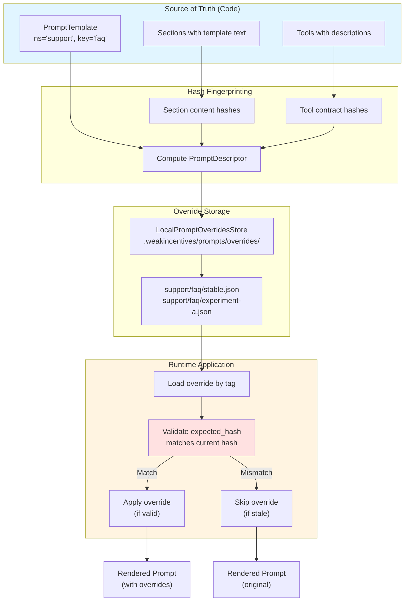
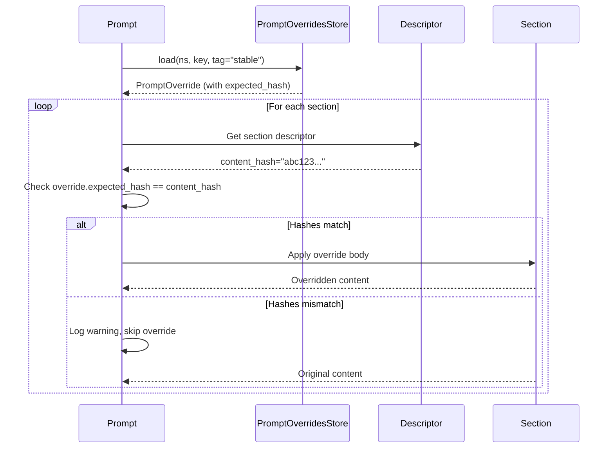
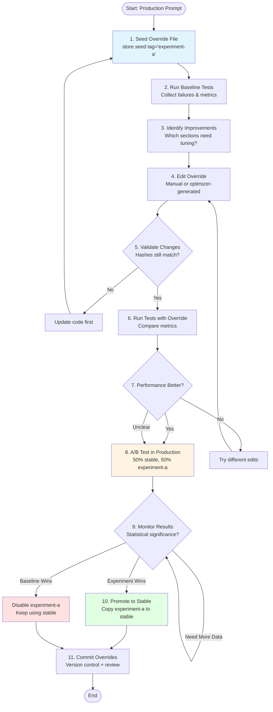

# Chapter 11: Prompt Optimization

> **Canonical Reference**: See [specs/PROMPT_OPTIMIZATION.md](../specs/PROMPT_OPTIMIZATION.md) for the complete specification.

## Introduction

Prompt optimization is one of the hardest problems in production LLM systems. You iterate on prompts constantly, A/B test variants, and need to roll back when experiments fail. But most frameworks force you to choose between two bad options:

1. **Edit code directly** - Requires deploys, breaks A/B testing, couples iteration to release cycles
2. **Use external config** - No validation, silent failures when prompts change, version drift between code and config

WINK's override system gives you a third path: **configuration-driven iteration with code-level safety guarantees**.

The core idea is simple but powerful:

- **Prompt templates live in code** - They're tested, reviewed, versioned alongside your logic
- **Overrides live in files** - Fast iteration, easy A/B testing, no deploys needed
- **Hashes enforce consistency** - Overrides only apply when they match the current prompt version

This separation matters because your templates are **code** (tested, reviewed, versioned), while overrides are **configuration** (easy to tweak without a deploy). The hash validation prevents a common failure mode: you edit a section in code, but an old override still applies, and you're running something different than you tested.

## The Mental Model

Think of overrides as **type-safe patches** to your prompt's string content:



**Key concepts:**

1. **PromptDescriptor** - A complete manifest of all overridable content with hashes
2. **PromptOverride** - Tagged variants stored as JSON files with expected hashes
3. **Hash validation** - Overrides only apply when hashes match (fail closed)
4. **Tag-based routing** - Multiple override variants can coexist (A/B testing)

See [Chapter 3: Prompts](/book/03-prompts.md) for the underlying prompt system.

## 11.1 Hash-Based Safety: Override Only What You Intended

Every piece of overridable content gets a deterministic hash:

```python
from weakincentives.prompt import PromptTemplate, MarkdownSection
from weakincentives.prompt.overrides import PromptDescriptor

template = PromptTemplate(
    ns="support",
    key="faq",
    sections=(
        MarkdownSection(
            title="Instructions",
            key="instructions",
            template="Answer questions clearly.",
        ),
    ),
)

# Generate descriptor with hashes
descriptor = PromptDescriptor.from_template(template)

print(descriptor.sections[0].content_hash)
# Output: "a4f2e9b8c1d3... (SHA-256 of 'Answer questions clearly.')"
```

### Hash Computation

Different content types use different hash strategies:

| Content Type | Hash Basis | Example |
|--------------|------------|---------|
| Section body | Template text | `hash_text("Answer ${question}")` |
| Tool description | Contract (desc + schema) | `hash_text(desc :: params :: result)` |
| Tool parameter | Contract hash | Same as tool description |
| Tool example | Example content | `hash_json({desc, input, output})` |
| Task example | Full example | `hash_json({objective, steps, outcome})` |

### Validation Flow

When you render a prompt with overrides:



This prevents the catastrophic case where:

1. You edit a section in code (`"Answer briefly"` → `"Answer in detail"`)
2. An old override expects `"Answer briefly"` and patches it
3. The override applies to different content than you tested
4. **Result**: Silent corruption, unpredictable behavior

With hash validation, step 3 fails loudly instead of silently corrupting output.

### Hardening Sensitive Content

For security-critical sections, disable overrides entirely:

```python
MarkdownSection(
    title="Security Policy",
    key="security",
    template="Never share credentials or API keys.",
    accepts_overrides=False,  # Cannot be overridden
)
```

This is especially important for:
- Authorization policies
- Rate limiting instructions
- PII handling rules
- Safety guardrails

See [Chapter 4: Tools](/book/04-tools.md) for tool-specific override patterns.

## 11.2 LocalPromptOverridesStore

The default store implementation writes JSON files under `.weakincentives/prompts/overrides/`:

```
.weakincentives/
└── prompts/
    └── overrides/
        └── {namespace}/
            └── {prompt_key}/
                ├── stable.json
                ├── experiment-a.json
                └── experiment-b.json
```

### Basic Setup

```python
from weakincentives.prompt import Prompt, PromptTemplate
from weakincentives.prompt.overrides import LocalPromptOverridesStore

# Create store (defaults to .weakincentives/ in cwd)
store = LocalPromptOverridesStore()

# Bind store to prompt with a tag
prompt = Prompt(
    template,
    overrides_store=store,
    overrides_tag="stable",  # Load stable.json variant
)
```

### Custom Storage Root

For multi-environment setups:

```python
store = LocalPromptOverridesStore(
    root="/path/to/overrides",  # Custom root directory
)

# Results in: /path/to/overrides/{ns}/{key}/{tag}.json
```

### Store API

```python
# Seed new override file from current prompt
store.seed(prompt, tag="stable")

# Load existing override
override = store.load(ns="support", key="faq", tag="stable")

# Save modified override
store.save(override)

# List available tags for a prompt
tags = store.list_tags(ns="support", key="faq")
# Returns: ["stable", "experiment-a", "experiment-b"]
```

### Integration with Resource Registry

Prompts can share override stores via the resource registry:

```python
from weakincentives.resources import Binding, ResourceRegistry, Scope
from weakincentives.prompt.overrides import PromptOverridesStore

registry = ResourceRegistry.of(
    Binding(
        PromptOverridesStore,
        lambda r: LocalPromptOverridesStore(),
        scope=Scope.GLOBAL,  # Singleton across all prompts
    ),
)

with registry.open() as ctx:
    store = ctx.get(PromptOverridesStore)
    prompt = Prompt(template, overrides_store=store, overrides_tag="stable")
```

See [Chapter 3: Prompts](/book/03-prompts.md#resource-lifecycle) for resource management patterns.

## 11.3 Override File Format

The override JSON format is intentionally simple and human-editable:

```json
{
  "version": 1,
  "ns": "support",
  "prompt_key": "faq",
  "tag": "stable",
  "sections": {
    "instructions": {
      "expected_hash": "a4f2e9b8c1d3e5f7a9b1c3d5e7f9a1b3c5d7e9f1a3b5c7d9e1f3a5b7c9d1e3f5",
      "body": "Answer customer questions clearly and concisely. Focus on accuracy."
    },
    "examples.0": {
      "expected_hash": "b5c7d9e1f3a5b7c9d1e3f5a7b9c1d3e5f7a9b1c3d5e7f9a1b3c5d7e9f1a3b5c7",
      "body": "Q: What is your return policy?\nA: 30-day money-back guarantee."
    }
  },
  "tools": {
    "search_kb": {
      "expected_contract_hash": "c6d8e0f2a4b6c8d0e2f4a6b8c0d2e4f6a8b0c2d4e6f8a0b2c4d6e8f0a2b4c6d8",
      "description": "Search the knowledge base for relevant articles.",
      "param_descriptions": {
        "query": "Search keywords or natural language question",
        "limit": "Maximum number of results to return"
      }
    }
  }
}
```

### Field Breakdown

**Top-level metadata:**
- `version` - Override format version (always `1`)
- `ns`, `prompt_key` - Identifies the target prompt
- `tag` - Variant name for A/B testing

**Section overrides (`sections`):**
- Keys are section paths (dot-encoded for nested sections)
- `expected_hash` - SHA-256 of original template text
- `body` - Replacement template text

**Tool overrides (`tools`):**
- Keys are tool names
- `expected_contract_hash` - Hash of tool contract (description + schema)
- `description` - Replacement tool description (1-200 chars)
- `param_descriptions` - Per-parameter description overrides

### Section Path Encoding

```python
# Flat section
# "instructions" -> "instructions"

# Nested section (one level)
# "examples" -> section with key "examples"
#   child section 0 -> "examples.0"

# Deeply nested
# "context.user.profile" -> ["context", "user", "profile"]
```

### What You Can Override

✅ **Allowed:**
- Section template bodies
- Section summaries
- Tool descriptions
- Tool parameter descriptions
- Tool examples (add/modify/remove)
- Task examples (add/modify/remove)

❌ **Not Allowed:**
- Tool names (breaks schema contracts)
- Tool parameter types (breaks type safety)
- Section structure (add/remove sections)
- Tool availability (add/remove tools)
- Sections/tools with `accepts_overrides=False`

### Manual Editing Tips

1. **Get hashes first** - Run `store.seed()` to generate a file with correct hashes
2. **Edit bodies only** - Don't modify `expected_hash` fields
3. **Validate JSON** - Use a linter to catch syntax errors
4. **Test incrementally** - Change one section at a time
5. **Version control** - Commit override files alongside code

## 11.4 A Practical Override Workflow

Here's a workflow that works well for teams iterating on production prompts:



### Step-by-Step Guide

#### 1. Seed Baseline Override

```python
from weakincentives.prompt.overrides import LocalPromptOverridesStore

store = LocalPromptOverridesStore()

# Create initial override file with current hashes
store.seed(prompt, tag="experiment-a")

# File created at:
# .weakincentives/prompts/overrides/support/faq/experiment-a.json
```

#### 2. Run Baseline Tests

```python
from weakincentives.evals import EvalLoop, Dataset

# Run with original prompt (no overrides)
baseline_prompt = Prompt(template)  # No override tag

eval_loop = EvalLoop(
    dataset=test_dataset,
    evaluator=quality_evaluator,
    # ...
)

baseline_metrics = eval_loop.run(baseline_prompt)
```

See [Chapter 8: Evaluation](/book/08-evaluation.md) for eval loop patterns.

#### 3. Edit Override Content

**Manual editing:**

```json
{
  "sections": {
    "instructions": {
      "expected_hash": "...",
      "body": "Answer questions clearly and concisely.\n\nProvide specific examples when helpful.\n\nIf uncertain, say so explicitly."
    }
  }
}
```

**Optimizer-generated:**

```python
from weakincentives.contrib.optimizers import WorkspaceDigestOptimizer

optimizer = WorkspaceDigestOptimizer(
    session=session,
    adapter=adapter,
)

optimized_override = optimizer.optimize(
    original_prompt=prompt,
    dataset=dataset,
    quality_evaluator=evaluator,
)

store.save(optimized_override)
```

#### 4. Test with Override

```python
# Load override variant
experiment_prompt = Prompt(
    template,
    overrides_store=store,
    overrides_tag="experiment-a",
)

# Run same eval
experiment_metrics = experiment_loop.run(experiment_prompt)

# Compare
print(f"Baseline accuracy: {baseline_metrics['accuracy']:.2%}")
print(f"Experiment accuracy: {experiment_metrics['accuracy']:.2%}")
```

#### 5. A/B Test in Production

```python nocheck
import random
from weakincentives.prompt import Prompt

def get_prompt_for_request(request_id: str) -> Prompt:
    """Route 50% of traffic to experiment."""
    tag = "experiment-a" if hash(request_id) % 2 == 0 else "stable"

    return Prompt(
        template,
        overrides_store=store,
        overrides_tag=tag,
    )

# In your handler
prompt = get_prompt_for_request(request.id)
response = adapter.evaluate(prompt, session=session)
```

Track metrics by tag:

```python
from weakincentives.runtime import get_logger

logger = get_logger(__name__)

logger.info(
    "prompt_evaluated",
    event="agent.prompt.evaluated",
    context={
        "override_tag": prompt.overrides_tag,
        "accuracy": score,
        "latency_ms": latency,
    },
)
```

#### 6. Promote or Rollback

**Promote experiment to stable:**

```bash
# Copy winning variant
cp .weakincentives/prompts/overrides/support/faq/experiment-a.json \
   .weakincentives/prompts/overrides/support/faq/stable.json

# Commit both files
git add .weakincentives/prompts/overrides/support/faq/*.json
git commit -m "Promote experiment-a to stable (improved accuracy by 3.2%)"
```

**Rollback failed experiment:**

```bash
# Delete experiment file
rm .weakincentives/prompts/overrides/support/faq/experiment-a.json

# Or keep it for reference
git add .weakincentives/prompts/overrides/support/faq/experiment-a.json
git commit -m "Archive experiment-a (no improvement over baseline)"
```

### Production Best Practices

1. **Version control overrides** - Commit override files alongside code
2. **Document changes** - Include metrics in commit messages
3. **Tag conventions** - Use semantic names (`stable`, `experiment-{name}`, `rollback-{date}`)
4. **Hash validation** - Never edit `expected_hash` fields manually
5. **Gradual rollout** - Start with 5% traffic, scale to 50% if metrics look good
6. **Rollback plan** - Always have a known-good `stable` variant
7. **Review process** - Treat override changes like code changes (PR review)
8. **Monitoring** - Track metrics by override tag in production

### Multi-Environment Setup

Different override sets per environment:

```python
import os

environment = os.environ.get("ENV", "development")

store = LocalPromptOverridesStore(
    root=f".weakincentives/{environment}/prompts/overrides"
)

# Development: .weakincentives/development/prompts/overrides/
# Staging:     .weakincentives/staging/prompts/overrides/
# Production:  .weakincentives/production/prompts/overrides/
```

Keep each environment's overrides in version control:

```
.weakincentives/
├── development/
│   └── prompts/
│       └── overrides/
│           └── support/
│               └── faq/
│                   └── stable.json
├── staging/
│   └── prompts/
│       └── overrides/
│           └── support/
│               └── faq/
│                   ├── stable.json
│                   └── experiment-a.json
└── production/
    └── prompts/
        └── overrides/
            └── support/
                └── faq/
                    └── stable.json
```

## Integration with Optimizers

WINK's optimizer framework can generate override patches automatically:

```python
from weakincentives.contrib.optimizers import WorkspaceDigestOptimizer
from weakincentives.optimizers import OptimizerConfig

config = OptimizerConfig(
    max_iterations=5,
    improvement_threshold=0.02,  # 2% improvement required
    early_stop=True,
)

optimizer = WorkspaceDigestOptimizer(
    session=session,
    adapter=adapter,
    config=config,
)

# Optimize based on eval dataset
result = optimizer.optimize(
    original_prompt=prompt,
    dataset=dataset,
    evaluator=evaluator,
)

if result.improved:
    # Save optimized override
    store.save(result.override)
    print(f"Improved accuracy from {result.baseline:.2%} to {result.final:.2%}")
else:
    print("No improvement found")
```

The optimizer:
1. Runs baseline eval with original prompt
2. Generates candidate override patches
3. Tests each candidate against the dataset
4. Keeps the best-performing variant
5. Returns a `PromptOverride` ready to save

See [specs/PROMPT_OPTIMIZATION.md](../specs/PROMPT_OPTIMIZATION.md#optimizer-integration) for optimizer API details.

## Summary

Prompt optimization in WINK gives you:

- **Safe iteration** - Hash validation prevents silent corruption
- **Fast experiments** - No deploys needed for override changes
- **A/B testing** - Multiple tagged variants coexist naturally
- **Team workflows** - Override files live in git, reviewed like code
- **Automation-friendly** - Optimizers generate patches, you review and promote

The key insight: **prompts are code, overrides are configuration**. Keep the source of truth in versioned templates, but enable rapid iteration via validated patches.

Next, explore workspace tools for file operations and sandboxed execution in [Chapter 12: Workspace Tools](/book/12-workspace-tools.md).

## Further Reading

- [specs/PROMPT_OPTIMIZATION.md](/specs/PROMPT_OPTIMIZATION.md) - Complete override specification
- [Chapter 3: Prompts](/book/03-prompts.md) - Prompt system fundamentals
- [Chapter 4: Tools](/book/04-tools.md) - Tool override patterns
- [Chapter 8: Evaluation](/book/08-evaluation.md) - Eval loop for testing overrides
