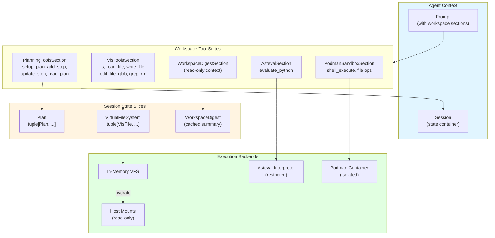
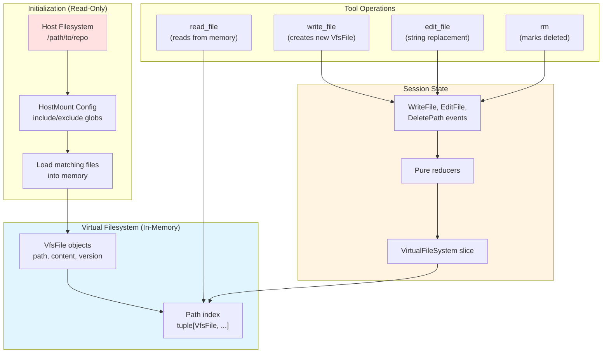
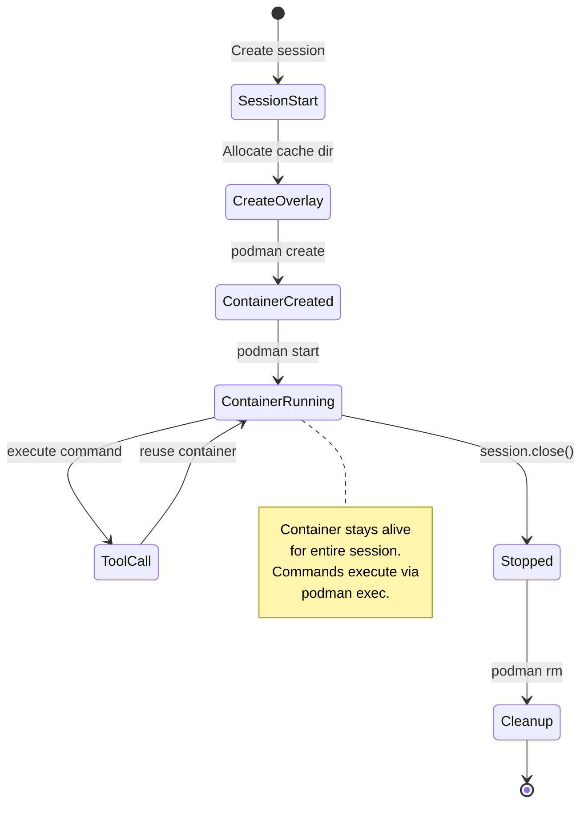
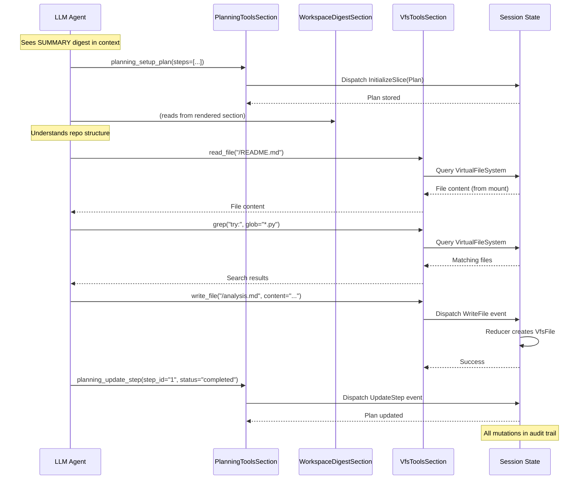

# Chapter 12: Workspace Tools

> **Canonical Reference**: See [specs/WORKSPACE.md](../specs/WORKSPACE.md) for the complete specification.

## Introduction

Background agents need to inspect and manipulate code, files, and execution environments. But giving agents unrestricted filesystem or shell access is dangerous—they can corrupt production code, leak credentials, or accidentally delete critical files.

WINK's workspace tools solve this with a **sandbox-first** design:

- **Virtual Filesystem (VFS)** - Copy-on-write in-memory filesystem for safe file operations
- **Planning Tools** - Explicit plan management in session state
- **Workspace Digest** - Cached repository summaries for efficient context
- **Asteval** - Safe Python expression evaluation without imports or IO
- **Podman Sandbox** - Full Linux container isolation for arbitrary code execution

These tools share common patterns:

1. **Session-scoped** - Each tool suite is bound to a specific session
1. **Pure handlers** - All mutations go through reducers, handlers remain side-effect-free
1. **Sandbox isolation** - Host writes disabled by default
1. **Progressive disclosure** - Start with summaries, expand on demand

The result: agents can safely explore and modify code without risking production systems.

**Own the definition; rent the harness.** These workspace tools are part of the
agent definition—they define what capabilities your agent has. Whether you run
on WINK's `MainLoop` or delegate to a provider runtime, the same tools work the
same way.

## Architecture Overview



**Key concepts:**

1. **Tool sections** expose tools to the model and manage state
1. **Session slices** store typed, immutable state (plans, files, digests)
1. **Backends** provide actual execution (in-memory, containers, interpreters)
1. **Host mounts** hydrate VFS from disk but remain read-only

See [Chapter 4: Tools](04-tools.md) for tool fundamentals and [Chapter 5: Sessions](05-sessions.md) for state management.

## 12.1 PlanningToolsSection

Many models perform better when they can externalize their plan into structured memory. `PlanningToolsSection` provides tools for explicit plan management stored in session state.

### Tools Provided

| Tool | Parameters | Description |
|------|------------|-------------|
| `planning_setup_plan` | `steps: list[dict]` | Initialize plan with steps |
| `planning_add_step` | `title, details, after_step_id` | Add new step to plan |
| `planning_update_step` | `step_id, status, details` | Update existing step |
| `planning_read_plan` | - | Read current plan state |

### Data Model

```python
from dataclasses import dataclass

@dataclass(slots=True, frozen=True)
class PlanStep:
    id: str
    title: str
    details: str
    status: Literal["pending", "in_progress", "completed", "skipped"]

@dataclass(slots=True, frozen=True)
class Plan:
    steps: tuple[PlanStep, ...] = ()
```

### Usage Example

```python
from weakincentives.contrib.tools import PlanningToolsSection, PlanningStrategy
from weakincentives.runtime import Session, InProcessDispatcher

bus = InProcessDispatcher()
session = Session(bus=bus)

# Add planning tools to prompt
planning = PlanningToolsSection(
    session=session,
    strategy=PlanningStrategy.REACT,  # or CHAIN_OF_THOUGHT
    key="planning",
)

template = PromptTemplate(
    ns="demo",
    key="task-solver",
    sections=(
        MarkdownSection(
            title="Task",
            key="task",
            template="Solve: ${objective}",
        ),
        planning,  # Planning tools available
    ),
)
```

When the model calls `planning_setup_plan`:

```json
{
  "name": "planning_setup_plan",
  "parameters": {
    "steps": [
      {"title": "Analyze requirements", "details": "Review user input"},
      {"title": "Implement solution", "details": "Write code"},
      {"title": "Test solution", "details": "Run tests"}
    ]
  }
}
```

The plan is stored in session state:

```python
from weakincentives.contrib.tools import Plan

# Query current plan
current_plan = session[Plan].latest()

print(current_plan.steps[0].title)
# Output: "Analyze requirements"

# Check step status
for step in current_plan.steps:
    print(f"{step.title}: {step.status}")
```

### Planning Strategies

**REACT** - Model plans incrementally as it works:

- Setup initial plan
- Execute step
- Update step status
- Add new steps as needed
- Repeat

**CHAIN_OF_THOUGHT** - Model plans everything upfront:

- Setup complete plan
- Execute steps sequentially
- Mark each complete when done

Choose REACT for exploratory tasks where the solution path isn't clear. Choose CHAIN_OF_THOUGHT for well-defined tasks with known steps.

## 12.2 VfsToolsSection

The Virtual Filesystem (VFS) provides copy-on-write file operations without touching the host disk. It's the default workspace for "repo agent" patterns.

### Core Design



**Key properties:**

- **Copy-on-write** - Host files copied to memory at mount time
- **No host writes** - All writes go to in-memory copy
- **Version tracking** - Each file has a version number that increments on edits
- **Event-driven** - All mutations flow through reducers

### Tools Provided

| Tool | Parameters | Description |
|------|------------|-------------|
| `ls` | `path: str` | List directory entries |
| `read_file` | `file_path, offset, limit` | Read file with pagination |
| `write_file` | `file_path, content` | Create new file |
| `edit_file` | `file_path, old_string, new_string, replace_all` | String replacement editing |
| `glob` | `pattern, path` | Match files by glob pattern |
| `grep` | `pattern, path, glob` | Regex search across files |
| `rm` | `path` | Remove file or directory |

### Configuration

```python
from weakincentives.contrib.tools.vfs import VfsToolsSection, VfsConfig, HostMount

# Define what to mount from host
mounts = (
    HostMount(
        host_path="src",           # Host directory
        mount_path=None,           # Mount at /src (None = preserve path)
        include_glob=("*.py",),    # Only Python files
        exclude_glob=(
            "__pycache__/*",
            "*.pyc",
        ),
        max_bytes=10_000_000,      # 10 MB limit per mount
        follow_symlinks=False,     # Don't follow symlinks
    ),
    HostMount(
        host_path="README.md",
        mount_path=None,
    ),
)

vfs = VfsToolsSection(
    session=session,
    config=VfsConfig(
        mounts=mounts,
        allowed_host_roots=(".",),  # Security: only allow mounting from cwd
    ),
    key="vfs",
)
```

### Host Mount Safety

The `allowed_host_roots` parameter prevents accidental mounting of sensitive directories:

```python
# This is safe
VfsConfig(
    mounts=(HostMount(host_path="./src"),),
    allowed_host_roots=(".",),  # Can only mount from current directory
)

# This will raise an error
VfsConfig(
    mounts=(HostMount(host_path="/etc/passwd"),),
    allowed_host_roots=(".",),  # /etc is not under current directory
)
```

Always set `allowed_host_roots` to the narrowest path that contains your mounts.

### Usage Example

```python
from weakincentives.contrib.tools.vfs import VirtualFilesystem

# Model calls write_file
# → Dispatch WriteFile event
# → Reducer creates new VfsFile
# → Added to VirtualFileSystem slice

# Query VFS state
vfs_state = session[VirtualFileSystem].latest()

# Find specific file
files = vfs_state.files
readme = next((f for f in files if str(f.path) == "/README.md"), None)

if readme:
    print(f"Content: {readme.content}")
    print(f"Version: {readme.version}")
    print(f"Size: {readme.size_bytes} bytes")
```

### Copy-on-Write Semantics

```python
# Initial state: Host file loaded into VFS
# /src/main.py (version 0, content from disk)

# Model calls edit_file
adapter.evaluate(prompt.bind({
    "task": "Add a docstring to main.py"
}))

# Model invokes: edit_file(file_path="/src/main.py", ...)
# → EditFile event dispatched
# → Reducer creates NEW VfsFile with version 1
# → Original host file untouched

# Query updated state
vfs = session[VirtualFileSystem].latest()
main_file = next(f for f in vfs.files if str(f.path) == "/src/main.py")

assert main_file.version == 1  # Version incremented
# Host disk /src/main.py is unchanged
```

This isolation is critical for safety: agents can freely experiment with code changes without risking production files.

### Limits and Constraints

**Content limits:**

- Maximum file size: 48,000 characters per write
- Maximum path depth: 16 segments
- Maximum segment length: 80 characters
- Encoding: UTF-8 text only (no binary files)

**Path normalization:**

- All paths are POSIX-style (`/src/main.py`)
- Relative paths resolved against VFS root (`/`)
- No `..` traversal allowed
- No absolute host paths

See [specs/WORKSPACE.md](../specs/WORKSPACE.md#vfs-limits) for complete limits.

## 12.3 WorkspaceDigestSection

Large repositories can't fit in context windows. `WorkspaceDigestSection` provides a **cached, structured summary** of the repository that models can explore progressively.

### Digest Structure

```python nocheck
from dataclasses import dataclass

@dataclass(slots=True, frozen=True)
class WorkspaceDigest:
    """Structured summary of repository."""
    summary: str                  # High-level overview
    file_tree: str                # Tree structure of files
    key_files: dict[str, str]     # Important files with content
    patterns: list[str]           # Detected patterns (frameworks, tools)
    total_files: int
    total_size_bytes: int
```

### Visibility Modes

The digest section supports progressive disclosure:

```python
from weakincentives.contrib.tools import WorkspaceDigestSection, DigestVisibility

# Summary only (default)
digest = WorkspaceDigestSection(
    session=session,
    visibility=DigestVisibility.SUMMARY,
)

# Full context (file tree + key files)
digest = WorkspaceDigestSection(
    session=session,
    visibility=DigestVisibility.FULL,
)
```

**SUMMARY mode** includes:

- High-level summary (project type, tech stack)
- File count and total size
- Key patterns detected

**FULL mode** adds:

- Complete file tree
- Contents of key files (README, main modules)
- Dependency manifests (package.json, requirements.txt)

### Usage Example

```python
from weakincentives.contrib.tools import WorkspaceDigest

# Pre-compute digest (expensive, do once)
digest = WorkspaceDigest.from_directory(
    path="/path/to/repo",
    include_glob=("*.py", "*.md"),
    exclude_glob=("__pycache__/*", "*.pyc"),
)

# Store in session
session[WorkspaceDigest].seed(digest)

# Add to prompt
template = PromptTemplate(
    ns="repo",
    key="analyzer",
    sections=(
        MarkdownSection(
            title="Task",
            key="task",
            template="Analyze this repository: ${question}",
        ),
        WorkspaceDigestSection(
            session=session,
            visibility=DigestVisibility.SUMMARY,
        ),
        VfsToolsSection(...),  # Model can explore files via VFS
    ),
)
```

The model sees:

```markdown
## Repository Context

**Summary:**
Python library for building background agents. Uses pytest for testing,
ruff for linting, and pyright for type checking.

**Statistics:**
- Total files: 247
- Total size: 1.2 MB
- Primary language: Python

**Key patterns:**
- Testing: pytest
- Linting: ruff
- Type checking: pyright
- Dependencies: managed via uv
```

The model can then use VFS tools to explore specific files:

```json
{
  "name": "read_file",
  "parameters": {
    "file_path": "/src/weakincentives/runtime/session.py"
  }
}
```

### Benefits

- **Reduced token usage** - Show summaries instead of full file contents
- **Faster startup** - Pre-computed digest loads instantly
- **Better comprehension** - Models see structure before details
- **Cache-friendly** - Digest updates only when files change

## 12.4 AstevalSection

`asteval` provides **safe-ish Python expression evaluation** without imports, file IO, or network access. It's useful for small transformations (string formatting, arithmetic) without granting full shell access.

### What's Allowed

- Basic Python expressions
- String operations
- Math operations
- List/dict comprehensions
- Variable assignment

### What's Forbidden

- `import` statements
- File operations (`open`, `read`, `write`)
- Network access (`socket`, `urllib`)
- Subprocess spawning (`os.system`, `subprocess`)
- Dangerous builtins (`eval`, `exec`, `compile`)

### Tools Provided

| Tool | Parameters | Description |
|------|------------|-------------|
| `evaluate_python` | `code: str` | Execute Python code, return result + stdout/stderr |

### Usage Example

```python
from weakincentives.contrib.tools import AstevalSection

# Add to prompt
template = PromptTemplate(
    ns="demo",
    key="calculator",
    sections=(
        MarkdownSection(
            title="Task",
            key="task",
            template="Perform calculation: ${expression}",
        ),
        AstevalSection(session=session),
    ),
)
```

Model can execute safe computations:

```json
{
  "name": "evaluate_python",
  "parameters": {
    "code": "result = sum(range(1, 101))\nprint(f'Sum: {result}')"
  }
}
```

Result:

```json
{
  "success": true,
  "result": 5050,
  "stdout": "Sum: 5050\n",
  "stderr": ""
}
```

### Installation

```bash
pip install "weakincentives[asteval]"
```

### Security Considerations

While `asteval` blocks many dangerous operations, it's not a perfect sandbox:

- **CPU exhaustion** - Infinite loops can hang execution
- **Memory exhaustion** - Large data structures can consume RAM
- **Logic bugs** - New asteval versions may have bypasses

**Use asteval for:**

- String formatting and manipulation
- Arithmetic and data transformations
- Prototype validation logic

**Don't use asteval for:**

- Untrusted user code
- Long-running computations
- Critical security boundaries

For stronger isolation, use `PodmanSandboxSection` instead.

## 12.5 PodmanSandboxSection

For strict isolation and reproducible execution, `PodmanSandboxSection` runs commands inside a Podman container with networking disabled.

### Container Lifecycle



**Key properties:**

- **One container per session** - Container created on first tool call
- **Persistent state** - Files written in container persist across tool calls
- **Isolated execution** - No network, limited CPU/memory
- **Automatic cleanup** - Container removed when session closes

### Configuration

```python
from weakincentives.contrib.tools import PodmanSandboxSection, PodmanConfig

podman = PodmanSandboxSection(
    session=session,
    config=PodmanConfig(
        image="python:3.12-slim",  # Base image
        cpu_limit=1.0,              # 1 CPU core
        memory_limit="1g",          # 1 GB RAM
        network_enabled=False,      # Disable networking
        timeout=30.0,               # 30s command timeout
        workspace_root="/workspace",
    ),
)
```

### Tools Provided

| Tool | Parameters | Description |
|------|------------|-------------|
| `shell_execute` | `command: str` | Run shell command in container |
| `ls` | `path: str` | List directory entries |
| `read_file` | `file_path, offset, limit` | Read file from container |
| `write_file` | `file_path, content` | Write file to container |
| `edit_file` | `file_path, old_string, new_string` | Edit file in container |
| `glob` | `pattern, path` | Match files by pattern |
| `grep` | `pattern, path, glob` | Search files by regex |
| `rm` | `path` | Remove file or directory |

### Usage Example

```python
template = PromptTemplate(
    ns="demo",
    key="test-runner",
    sections=(
        MarkdownSection(
            title="Task",
            key="task",
            template="Run tests in isolated container.",
        ),
        PodmanSandboxSection(session=session),
    ),
)
```

Model can execute shell commands:

```json
{
  "name": "shell_execute",
  "parameters": {
    "command": "pytest tests/ -v"
  }
}
```

Result includes stdout, stderr, and exit code:

```json
{
  "success": true,
  "exit_code": 0,
  "stdout": "===== test session starts =====\ntests/test_foo.py::test_bar PASSED\n",
  "stderr": ""
}
```

### Sandboxing Guarantees

**What's isolated:**

- Filesystem (writes don't touch host)
- Network (disabled by default)
- CPU and memory (cgroup limits)
- Process table (container PID namespace)

**What's NOT isolated:**

- Host kernel (containers share kernel)
- Side channels (timing, CPU cache)
- Container escape vulnerabilities

**Use Podman for:**

- Running tests in clean environment
- Executing linters and formatters
- Building code without affecting host
- Reproducible command execution

**Don't use Podman for:**

- Untrusted adversarial code
- Critical security boundaries
- Performance-sensitive workloads (adds latency)

### Installation

```bash
# Install Podman
# macOS: brew install podman
# Linux: apt-get install podman

# Install WINK with Podman support
pip install "weakincentives[podman]"
```

### Performance Considerations

Container creation adds ~1-2 seconds of latency to the first tool call. Subsequent calls reuse the running container and are fast (~100ms).

For better performance:

- Use lightweight base images (`python:3.12-slim` vs `python:3.12`)
- Pre-pull images before session starts
- Keep containers warm across sessions (advanced)

See [specs/WORKSPACE.md](../specs/WORKSPACE.md#podman-performance) for optimization strategies.

## 12.6 Wiring a Workspace into a Prompt

Workspace sections compose naturally. Here's a practical pattern used by production agents:

```python nocheck
from typing import Any
from dataclasses import dataclass
from weakincentives.contrib.tools import (
    PlanningToolsSection,
    PlanningStrategy,
    VfsToolsSection,
    VfsConfig,
    WorkspaceDigestSection,
    DigestVisibility,
    WorkspaceDigest,
)
from weakincentives.contrib.tools.vfs_types import HostMount
from weakincentives.prompt import PromptTemplate, MarkdownSection
from weakincentives.runtime import Session

@dataclass(slots=True, frozen=True)
class RepoAnalysisParams:
    objective: str
    repo_path: str

def build_repo_agent_template(
    *,
    session: Session,
    repo_path: str,
) -> PromptTemplate[Any]:
    """Build prompt for repository analysis agent."""

    # 1. Pre-compute workspace digest (cached summary)
    digest = WorkspaceDigest.from_directory(
        path=repo_path,
        include_glob=("*.py", "*.md", "*.json", "*.toml"),
        exclude_glob=("__pycache__/*", "*.pyc", ".venv/*"),
    )
    session[WorkspaceDigest].seed(digest)

    # 2. Configure VFS mounts
    vfs_mounts = (
        HostMount(
            host_path=f"{repo_path}/src",
            mount_path=None,  # Preserve /src path
            include_glob=("*.py",),
            exclude_glob=("__pycache__/*",),
        ),
        HostMount(
            host_path=f"{repo_path}/README.md",
        ),
        HostMount(
            host_path=f"{repo_path}/pyproject.toml",
        ),
    )

    vfs = VfsToolsSection(
        session=session,
        config=VfsConfig(
            mounts=vfs_mounts,
            allowed_host_roots=(repo_path,),
        ),
        key="vfs",
    )

    # 3. Assemble prompt with all workspace tools
    return PromptTemplate(
        ns="examples",
        key="repo-analyzer",
        name="repo_analyzer",
        sections=(
            MarkdownSection(
                title="Objective",
                key="objective",
                template="Analyze this repository: ${objective}",
            ),
            WorkspaceDigestSection(
                session=session,
                visibility=DigestVisibility.SUMMARY,
                key="context",
            ),
            PlanningToolsSection(
                session=session,
                strategy=PlanningStrategy.REACT,
                key="planning",
            ),
            vfs,  # File operations
            MarkdownSection(
                title="Guidelines",
                key="guidelines",
                template=(
                    "Start by reading the README and main modules. "
                    "Use planning tools to organize your analysis. "
                    "Focus on code quality, architecture, and test coverage."
                ),
            ),
        ),
    )
```

### Usage

```python
from weakincentives.runtime import Session, InProcessDispatcher
from weakincentives.adapters.openai import OpenAIAdapter

bus = InProcessDispatcher()
session = Session(bus=bus)

# Build prompt with workspace tools
template = build_repo_agent_template(
    session=session,
    repo_path="/path/to/repo",
)

# Bind params
prompt = template.bind(RepoAnalysisParams(
    objective="Identify potential bugs in error handling",
    repo_path="/path/to/repo",
))

# Evaluate
adapter = OpenAIAdapter(model="gpt-4o")
response = adapter.evaluate(prompt, session=session)

# Agent can now:
# - Call planning_setup_plan to create analysis plan
# - Call read_file to inspect source code
# - Call grep to find error handling patterns
# - Call write_file to document findings (in VFS, not host)
```

### Execution Flow



### Key Design Patterns

1. **Session-first** - All tool sections receive the same session instance
1. **Pre-seed state** - Digest computed once, before prompt evaluation
1. **Immutable config** - VFS mounts and limits set at construction
1. **Progressive disclosure** - Start with SUMMARY, expand via tools
1. **Pure handlers** - Tool handlers remain side-effect-free (mutations via reducers)

The important idea: **workspace sections are built with the active session**. Each evaluation gets its own session with its own tool sections. This ensures isolation between concurrent agent runs.

## Combining Workspace Backends

You can mix workspace backends for different isolation needs:

```python
template = PromptTemplate(
    ns="advanced",
    key="multi-backend",
    sections=(
        # VFS for safe file exploration
        VfsToolsSection(session=session, config=vfs_config),

        # Asteval for quick calculations
        AstevalSection(session=session),

        # Podman for running tests
        PodmanSandboxSection(session=session, config=podman_config),
    ),
)
```

The agent can choose the appropriate backend:

- **VFS** - Fast, in-memory file operations
- **Asteval** - Safe Python expressions
- **Podman** - Full shell commands with strong isolation

Each backend maintains independent state in the session.

## Best Practices

### 1. Choose the Right Workspace

| Use Case | Recommended Tool | Rationale |
|----------|------------------|-----------|
| Code review | VFS | Fast, safe, no side effects |
| Running tests | Podman | Isolated, reproducible environment |
| Data transformation | Asteval | Quick calculations without overhead |
| Repo analysis | VFS + Digest | Efficient context + file exploration |
| CI/CD tasks | Podman | Full shell access with isolation |

### 2. Limit Host Mounts

Only mount what the agent needs:

```python
# ❌ Bad: Mount entire repo
HostMount(host_path=".", include_glob=("*",))

# ✅ Good: Mount specific directories
mounts = (
    HostMount(host_path="src", include_glob=("*.py",)),
    HostMount(host_path="tests", include_glob=("test_*.py",)),
    HostMount(host_path="README.md"),
)
```

### 3. Use Progressive Disclosure

Start with summaries, expand on demand:

```python
# Initial context: SUMMARY mode
WorkspaceDigestSection(
    session=session,
    visibility=DigestVisibility.SUMMARY,
)

# Agent can explore details via VFS tools
VfsToolsSection(session=session, config=config)
```

### 4. Set Resource Limits

Prevent runaway execution:

```python
# VFS limits
VfsConfig(
    mounts=mounts,
    max_total_bytes=50_000_000,  # 50 MB total
)

# Podman limits
PodmanConfig(
    cpu_limit=1.0,      # 1 CPU core
    memory_limit="1g",  # 1 GB RAM
    timeout=30.0,       # 30s per command
)
```

### 5. Audit Trail via Session Events

All workspace mutations flow through the session:

```python
from weakincentives.runtime import Session

session = Session(bus=bus)

# Agent uses workspace tools
# → Events dispatched
# → Reducers update state
# → Events logged in session timeline

# Review audit trail
for event in session.events:
    if isinstance(event, (WriteFile, EditFile, DeletePath)):
        print(f"File mutation: {event}")
```

This provides:

- **Debugging** - See exactly what the agent changed
- **Testing** - Assert on specific mutations
- **Compliance** - Audit trail for review

### 6. Test Workspace Handlers

Tool handlers are pure functions—easy to test:

```python
from weakincentives.contrib.tools.vfs_handlers import read_file_handler
from weakincentives.contrib.tools.vfs import VirtualFilesystem, VfsFile, VfsPath
from weakincentives.prompt import ToolContext

# Create fake VFS state
vfs = VirtualFilesystem(
    files=(
        VfsFile(
            path=VfsPath.from_string("/test.txt"),
            content="Hello, world!",
            version=0,
        ),
    ),
)

# Create mock session
session[VirtualFileSystem].seed(vfs)

# Call handler directly
result = read_file_handler(
    {"file_path": "/test.txt"},
    context=ToolContext(session=session, resources=resources),
)

assert result.success
assert result.data["content"] == "Hello, world!"
```

No model needed—test business logic in isolation.

## 12.7 Filesystem Protocol and Custom Backends

> **Canonical Reference**: See [specs/FILESYSTEM.md](../specs/FILESYSTEM.md) for the complete filesystem protocol specification.

### Introduction

Agents need to read and write files. But file operations are inherently dangerous:

- **Accidental deletion** of production code
- **Path traversal** attacks escaping sandboxes
- **Credential leaks** from reading sensitive files
- **Corrupted state** from partial writes

WINK solves this through the **`Filesystem` protocol**—a unified abstraction that tools access through `ToolContext`. The protocol decouples tool handlers from storage implementations, enabling:

- **Sandbox isolation**: In-memory VFS, containers, restricted host access
- **Testing**: Mock filesystems for unit tests
- **Progressive complexity**: Start with VFS, graduate to containers
- **Custom backends**: Implement the protocol for specialized storage

This section covers:

1. The Filesystem protocol and its guarantees
1. How tools access filesystems via context
1. Built-in backends (InMemoryFilesystem, HostFilesystem)
1. Implementing custom backends
1. Snapshot and restore capabilities

### The Filesystem Protocol

The `Filesystem` protocol defines a common interface for file operations. Tools use this protocol regardless of the underlying storage:

```python
from typing import Protocol, Literal

class Filesystem(Protocol):
    """Unified filesystem protocol for workspace operations."""

    # Read operations
    def read(
        self,
        path: str,
        *,
        offset: int = 0,
        limit: int | None = None,
        encoding: str = "utf-8",
    ) -> ReadResult: ...

    def read_bytes(
        self,
        path: str,
        *,
        offset: int = 0,
        limit: int | None = None,
    ) -> ReadBytesResult: ...

    def exists(self, path: str) -> bool: ...

    def stat(self, path: str) -> FileStat: ...

    def list(self, path: str = ".") -> Sequence[FileEntry]: ...

    def glob(self, pattern: str, *, path: str = ".") -> Sequence[GlobMatch]: ...

    def grep(
        self,
        pattern: str,
        *,
        path: str = ".",
        glob: str | None = None,
        max_matches: int | None = None,
    ) -> Sequence[GrepMatch]: ...

    # Write operations
    def write(
        self,
        path: str,
        content: str,
        *,
        mode: Literal["create", "overwrite", "append"] = "overwrite",
        create_parents: bool = True,
    ) -> WriteResult: ...

    def write_bytes(
        self,
        path: str,
        content: bytes,
        *,
        mode: Literal["create", "overwrite", "append"] = "overwrite",
        create_parents: bool = True,
    ) -> WriteResult: ...

    def delete(self, path: str, *, recursive: bool = False) -> None: ...

    def mkdir(
        self,
        path: str,
        *,
        parents: bool = True,
        exist_ok: bool = True,
    ) -> None: ...

    # Metadata
    @property
    def root(self) -> str: ...

    @property
    def read_only(self) -> bool: ...
```

#### Result Types

Operations return structured results, not raw strings:

```python
class ReadResult(Protocol):
    """Content returned from text read operations."""

    @property
    def content(self) -> str: ...

    @property
    def path(self) -> str: ...

    @property
    def total_lines(self) -> int: ...

    @property
    def truncated(self) -> bool: ...


class WriteResult(Protocol):
    """Confirmation of write operation."""

    @property
    def path(self) -> str: ...

    @property
    def bytes_written(self) -> int: ...

    @property
    def mode(self) -> Literal["create", "overwrite", "append"]: ...
```

This enables tools to provide rich feedback: "Read 1,234 lines from config.py (truncated to 2,000 chars)."

### Accessing Filesystems in Tools

Tools access filesystems through `ToolContext`:

```python
from weakincentives.prompt import ToolContext, ToolResult

def read_file_handler(
    params: ReadFileParams,
    *,
    context: ToolContext,
) -> ToolResult[ReadFileResult]:
    # Check if filesystem is available
    if context.filesystem is None:
        return ToolResult(
            message="No filesystem available in this context.",
            value=None,
            success=False,
        )

    # Use the protocol
    try:
        result = context.filesystem.read(
            params.path,
            offset=params.offset,
            limit=params.limit,
        )
    except FileNotFoundError:
        return ToolResult(
            message=f"File not found: {params.path}",
            value=None,
            success=False,
        )

    return ToolResult(
        message=f"Read {result.total_lines} lines",
        value=ReadFileResult(
            content=result.content,
            path=result.path,
        ),
    )
```

#### Backend Transparency

The handler works identically regardless of backend:

- **VfsToolsSection**: In-memory VFS
- **PodmanSandboxSection**: Containerized overlay
- **Custom section**: S3, database, etc.

Tools remain portable. Change the section, not the tool.

### Section Ownership

Filesystem instances are owned by **workspace sections** that provide file tools. Sections implementing `WorkspaceSection` expose their filesystem:

```python
from weakincentives.filesystem import Filesystem

class WorkspaceSection(Protocol):
    """Section that provides filesystem access."""

    @property
    def filesystem(self) -> Filesystem: ...
```

#### Example: VfsToolsSection

```python
from weakincentives.contrib.tools import VfsToolsSection, HostMount

section = VfsToolsSection(
    mounts=(
        HostMount(host_path="src/", include_glob=("*.py",)),
        HostMount(host_path="docs/", include_glob=("*.md",)),
    ),
    allowed_host_roots=("/path/to/project",),
)

# Section creates and manages InMemoryFilesystem
fs = section.filesystem
assert fs.exists("src/main.py")  # Hydrated from host mount
```

The section:

1. Creates a filesystem backend (InMemoryFilesystem)
1. Hydrates it from host mounts
1. Exposes it via the `filesystem` property
1. Passes it to tools via `ToolContext`

#### Prompt Integration

Prompts expose a convenience method to locate the filesystem:

```python
from weakincentives.prompt import Prompt

prompt = Prompt(template)

# Delegates to workspace section
fs = prompt.filesystem()

# Pre-populate before evaluation
if fs is not None:
    fs.write("notes.txt", "Working notes...")
```

Adapters propagate the filesystem to `ToolContext`:

```python
context = ToolContext(
    prompt=prompt,
    session=session,
    adapter=adapter,
    filesystem=prompt.filesystem(),  # From workspace section
)
```

### InMemoryFilesystem: Session-Scoped VFS

`InMemoryFilesystem` provides an in-memory copy-on-write filesystem. State is managed internally; writes don't touch the host:

```python
from weakincentives.filesystem import InMemoryFilesystem

fs = InMemoryFilesystem()

# All operations are in-memory
fs.write("config.yaml", "debug: true")
fs.mkdir("logs")
fs.write("logs/app.log", "Starting...")

# Read operations
content = fs.read("config.yaml").content
assert content == "debug: true"

# Directory listing
entries = fs.list(".")
assert any(e.name == "config.yaml" for e in entries)
```

#### Hydration from Host

VFS can be hydrated from host directories using **mounts**:

```python
from weakincentives.contrib.tools import HostMount

fs = InMemoryFilesystem()

# Copy files from host into VFS
mount = HostMount(
    host_path="/path/to/project/src",
    vfs_path="src",
    include_glob=("*.py", "*.txt"),
)

fs.hydrate_from_host(mount, allowed_roots=("/path/to/project",))

# Files now available in VFS
assert fs.exists("src/main.py")
assert fs.exists("src/utils.py")
```

**Key point**: Hydration is a one-time copy. Subsequent writes to VFS don't affect the host. This provides isolation—agents can modify files without risk.

#### Read-Only Mode

Disable writes to enforce read-only access:

```python
fs = InMemoryFilesystem(_read_only=True)

# Reads work
content = fs.read("file.txt").content

# Writes raise PermissionError
fs.write("file.txt", "new content")  # ❌ PermissionError
```

Useful for giving agents read access to sensitive files without modification risk.

#### Performance Characteristics

| Operation | Complexity | Notes |
|-----------|------------|-------|
| `read()` | O(1) | In-memory lookup |
| `write()` | O(1) | Dict insertion |
| `list()` | O(n) | Filter directories by prefix |
| `glob()` | O(n) | Pattern match all paths |
| `grep()` | O(n × m) | Regex match file contents |

Memory usage grows linearly with file count and total content size.

### HostFilesystem: Sandboxed Host Access

`HostFilesystem` provides sandboxed access to a host directory with path restrictions:

```python
from weakincentives.filesystem import HostFilesystem

fs = HostFilesystem(_root="/workspace/project")

# Operations are restricted to root directory
fs.write("config.yaml", "debug: true")  # → /workspace/project/config.yaml

# Path traversal is blocked
fs.read("../etc/passwd")  # ❌ PermissionError: Path escapes root
```

#### Path Resolution

The backend resolves relative paths and validates they stay within the root:

```python
def _resolve_path(self, path: str) -> Path:
    """Resolve path within root, block escapes."""
    root_path = Path(self._root).resolve()
    if not path or path in {".", "/"}:
        return root_path

    candidate = (root_path / path).resolve()
    try:
        _ = candidate.relative_to(root_path)
    except ValueError:
        raise PermissionError(f"Path escapes root: {path}")

    return candidate
```

Symlink attacks and `..` traversals are blocked.

#### Use in PodmanSandboxSection

`PodmanSandboxSection` uses `HostFilesystem` for the overlay directory:

```python
class PodmanSandboxSection:
    def __init__(self, *, session: Session, config: PodmanSandboxConfig):
        # Create overlay directory
        self._overlay_path = Path(f"/tmp/wink-overlay-{session.session_id}")
        self._overlay_path.mkdir(parents=True, exist_ok=True)

        # Use HostFilesystem rooted at overlay
        self._filesystem = HostFilesystem(_root=str(self._overlay_path))

    @property
    def filesystem(self) -> Filesystem:
        return self._filesystem
```

The overlay is bind-mounted into the container at `/workspace`. Filesystem operations work before the container starts and persist across restarts.

### Implementing Custom Backends

To implement a custom backend, satisfy the `Filesystem` protocol:

```python
from weakincentives.filesystem import Filesystem, ReadResult, WriteResult
import boto3

class S3Filesystem:
    """Filesystem backed by AWS S3."""

    def __init__(self, bucket: str, prefix: str = ""):
        self.bucket = bucket
        self.prefix = prefix
        self.s3 = boto3.client("s3")

    def read(self, path: str, **kwargs) -> ReadResult:
        """Read file from S3."""
        key = f"{self.prefix}/{path}".strip("/")
        try:
            response = self.s3.get_object(Bucket=self.bucket, Key=key)
            content = response["Body"].read().decode("utf-8")
        except self.s3.exceptions.NoSuchKey:
            raise FileNotFoundError(path)

        return S3ReadResult(
            content=content,
            path=path,
            total_lines=content.count("\n"),
        )

    def write(self, path: str, content: str, **kwargs) -> WriteResult:
        """Write file to S3."""
        key = f"{self.prefix}/{path}".strip("/")
        self.s3.put_object(
            Bucket=self.bucket,
            Key=key,
            Body=content.encode("utf-8"),
        )
        return S3WriteResult(path=path, bytes_written=len(content))

    def exists(self, path: str) -> bool:
        """Check if object exists."""
        key = f"{self.prefix}/{path}".strip("/")
        try:
            self.s3.head_object(Bucket=self.bucket, Key=key)
            return True
        except:
            return False

    @property
    def root(self) -> str:
        return f"s3://{self.bucket}/{self.prefix}"

    @property
    def read_only(self) -> bool:
        return False

    # Implement remaining protocol methods...
```

#### Expose via Section

Create a section that owns the custom filesystem:

```python
from weakincentives.prompt import MarkdownSection

class S3WorkspaceSection(MarkdownSection):
    """Section providing S3-backed workspace."""

    def __init__(self, bucket: str, prefix: str, **kwargs):
        self._filesystem = S3Filesystem(bucket, prefix)
        tools = self._build_s3_tools()
        super().__init__(tools=tools, **kwargs)

    @property
    def filesystem(self) -> Filesystem:
        return self._filesystem
```

Tools automatically receive the S3 backend via `ToolContext.filesystem`.

### Binary File Support

The protocol supports both text and binary operations:

```python
# Text operations (UTF-8 encoding)
fs.write("config.yaml", "debug: true")
content = fs.read("config.yaml").content  # str

# Binary operations (no encoding)
fs.write_bytes("image.png", png_bytes)
data = fs.read_bytes("image.png").content  # bytes
```

**For file copying**, always use `read_bytes()` / `write_bytes()` to preserve content exactly:

```python
# Copy file between filesystems
source_data = source_fs.read_bytes("archive.tar.gz").content
dest_fs.write_bytes("archive.tar.gz", source_data)
```

This avoids encoding/decoding overhead and potential data loss for binary files.

### Snapshot and Restore

Some backends support **snapshot and restore** for rollback after failed tool invocations:

```python
from weakincentives.filesystem import SnapshotableFilesystem

class SnapshotableFilesystem(Filesystem, Protocol):
    """Filesystem that supports snapshot operations."""

    def snapshot(self, *, tag: str | None = None) -> FilesystemSnapshot: ...

    def restore(self, snapshot: FilesystemSnapshot) -> None: ...
```

#### Git-Based Snapshots (HostFilesystem)

`HostFilesystem` uses git for copy-on-write snapshots:

```python
fs = HostFilesystem(_root="/workspace/project")

# Initial state
fs.write("config.py", "DEBUG = True")
snapshot1 = fs.snapshot(tag="initial")

# Make changes
fs.write("config.py", "DEBUG = False")
fs.write("new_file.py", "...")
snapshot2 = fs.snapshot(tag="modified")

# Rollback to initial
fs.restore(snapshot1)
assert fs.read("config.py").content == "DEBUG = True"
assert not fs.exists("new_file.py")

# Restore modified state
fs.restore(snapshot2)
assert fs.read("config.py").content == "DEBUG = False"
assert fs.exists("new_file.py")
```

**Implementation details**:

- Git repository is stored **outside** the workspace root (e.g., `/tmp/wink-git-abc123`)
- Snapshots are git commits with content-addressed storage
- Unchanged files share blobs between snapshots (efficient)
- `restore()` uses `git reset --hard` + `git clean -xfd` for strict rollback

#### In-Memory Snapshots

`InMemoryFilesystem` uses Python's structural sharing:

```python
fs = InMemoryFilesystem()

fs.write("data.txt", "original")
snapshot = fs.snapshot()

fs.write("data.txt", "modified")
fs.restore(snapshot)

assert fs.read("data.txt").content == "original"
```

File content strings are shared between active filesystem and snapshots (copy-on-write at the Python level).

#### Session Integration

Snapshots are frozen dataclasses that can be stored in session state:

```python
from weakincentives.filesystem import FilesystemSnapshot

# Snapshot filesystem and store in session
fs_snapshot = filesystem.snapshot(tag="before-refactor")
session[FilesystemSnapshot].append(fs_snapshot)

# Later: retrieve and restore
snapshots = session[FilesystemSnapshot].all()
filesystem.restore(snapshots[-1])
```

For coordinated rollback:

```python
def rollback_session_and_filesystem(
    session: Session,
    session_snapshot: Snapshot,
    filesystem: SnapshotableFilesystem,
) -> None:
    """Restore both session state and filesystem."""
    # Find filesystem snapshot from that session state
    fs_snapshots = session_snapshot.slices.get(FilesystemSnapshot, ())
    if fs_snapshots:
        filesystem.restore(fs_snapshots[-1])

    session.restore(session_snapshot)
```

### Error Handling

All backends map errors to standard Python exceptions:

| Backend Error | Python Exception |
|---------------|------------------|
| File not found | `FileNotFoundError` |
| Path is directory | `IsADirectoryError` |
| Path is file | `NotADirectoryError` |
| Access denied | `PermissionError` |
| File exists | `FileExistsError` |
| Invalid content | `ValueError` |

#### Tool Handler Pattern

```python
def my_handler(params: Params, *, context: ToolContext) -> ToolResult:
    fs = context.filesystem
    if fs is None:
        return ToolResult.error("No filesystem available")

    try:
        result = fs.read(params.path)
    except FileNotFoundError:
        return ToolResult.error(f"File not found: {params.path}")
    except PermissionError as e:
        return ToolResult.error(str(e))

    return ToolResult.ok(content=result.content)
```

Consistent error handling across backends simplifies tool logic.

### Testing with Mock Filesystems

For unit tests, use a mock filesystem:

```python
class MockFilesystem:
    """Test double for filesystem operations."""

    def __init__(self, files: dict[str, str] | None = None):
        self._files = files or {}
        self.read_calls: list[str] = []
        self.write_calls: list[tuple[str, str]] = []

    def read(self, path: str, **kwargs) -> ReadResult:
        self.read_calls.append(path)
        if path not in self._files:
            raise FileNotFoundError(path)
        return MockReadResult(content=self._files[path], path=path)

    def write(self, path: str, content: str, **kwargs) -> WriteResult:
        self.write_calls.append((path, content))
        self._files[path] = content
        return MockWriteResult(path=path, bytes_written=len(content))

    # Implement remaining protocol methods...
```

Then inject into context:

```python nocheck
def test_read_file_tool():
    mock_fs = MockFilesystem(files={"config.yaml": "debug: true"})
    context = ToolContext(filesystem=mock_fs, ...)

    result = read_file_handler(
        ReadFileParams(path="config.yaml"),
        context=context,
    )

    assert result.success
    assert "debug: true" in result.value.content
    assert mock_fs.read_calls == ["config.yaml"]
```

No filesystem I/O in tests—fast and isolated.

### Limits and Recommendations

#### Backend Limits

| Limit | Recommended Value | Notes |
|-------|-------------------|-------|
| Max file size | 48,000 chars | Per write operation |
| Max path depth | 16 segments | Prevents deep nesting |
| Max segment length | 80 chars | Per path component |
| Default read limit | 2,000 lines | Pagination default |
| Max grep matches | 1,000 | Prevents runaway searches |

#### When to Use Each Backend

| Scenario | Recommendation |
|----------|----------------|
| Safe experimentation | `InMemoryFilesystem` with mounts |
| Arbitrary code execution | `PodmanSandboxSection` (HostFilesystem + container) |
| Cloud storage | Custom backend (S3, GCS) |
| Debugging | `HostFilesystem` with snapshots |
| Testing | `MockFilesystem` |

#### Limitations

- **No symlinks**: Symbolic links are not followed by default
- **No permissions model**: Beyond read-only flag, no Unix-style permissions
- **Single-threaded**: Backends are not thread-safe
- **No streaming**: Large files are loaded entirely into memory
- **Path normalization**: Original casing may not be preserved

### Section Summary

The `Filesystem` protocol decouples tools from storage implementations:

| Benefit | How It Helps |
|---------|--------------|
| **Portability** | Tools work across backends (VFS, host, S3) |
| **Testability** | Mock filesystems for fast unit tests |
| **Safety** | Sandboxed backends prevent host damage |
| **Flexibility** | Custom backends for specialized storage |
| **Snapshot support** | Rollback after failed operations |

**Core pattern**: Sections own filesystems. Tools access via context. Backends implement the protocol.

Start with `InMemoryFilesystem` for safe exploration. Graduate to `PodmanSandboxSection` when you need arbitrary code execution. Implement custom backends when you need specialized storage (databases, cloud, etc.).

The protocol is the contract. Tools remain agnostic to implementation details.

## Summary

WINK's workspace tools provide:

- **Safe exploration** - VFS copy-on-write prevents host corruption
- **Strong isolation** - Podman containers sandbox arbitrary code
- **Progressive disclosure** - Digest summaries → detailed file reads
- **Explicit planning** - Structured plan management in session state
- **Audit trail** - All mutations recorded as events
- **Composability** - Mix backends for different isolation needs

The key insight: **sandbox first, host writes opt-in**. Default to safe operations (VFS, Asteval), use strong isolation (Podman) when needed, never grant unrestricted host access.

Next, explore debugging and observability in [Chapter 13: Debugging](13-debugging.md).

## Further Reading

- [specs/WORKSPACE.md](../specs/WORKSPACE.md) - Complete workspace specification
- [Chapter 4: Tools](04-tools.md) - Tool fundamentals
- [Chapter 5: Sessions](05-sessions.md) - State management and reducers
- [code_reviewer_example.py](../code_reviewer_example.py) - Production workspace usage
