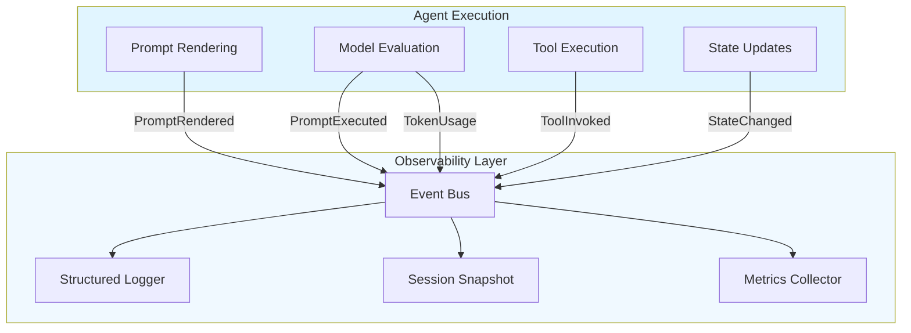
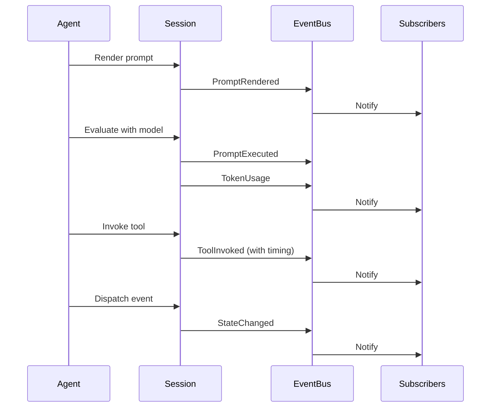
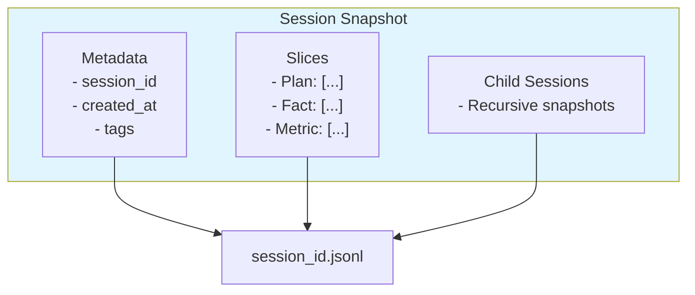
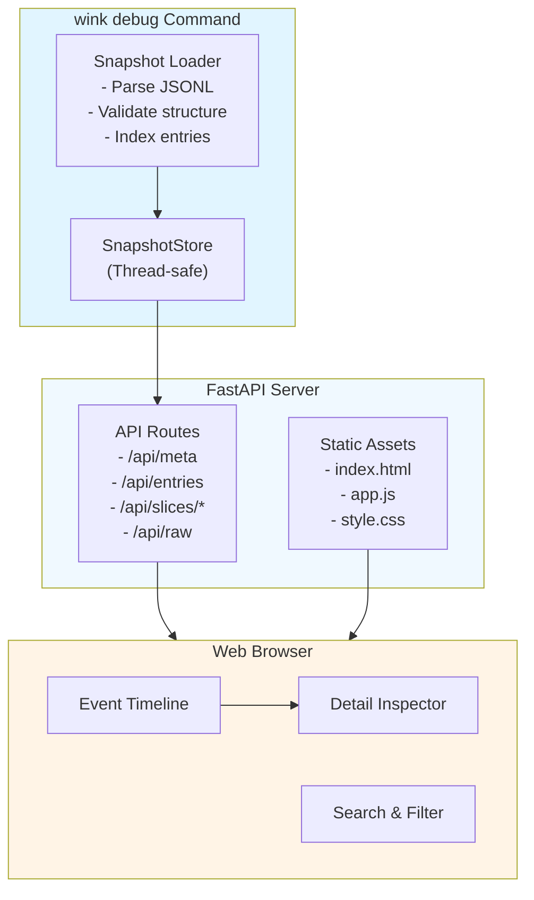
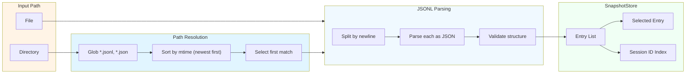

# Chapter 13: Debugging & Observability

> **Canonical References**: See [specs/LOGGING.md](../specs/LOGGING.md) and [specs/WINK_DEBUG.md](../specs/WINK_DEBUG.md) for complete specifications.

## Introduction

Debugging agent systems is fundamentally different from debugging traditional applications. Agent failures are often subtle—the model chose the wrong tool, misinterpreted context, or drifted off task. Traditional stack traces don't help when the "bug" is a semantic issue in how the agent reasoned about its task.

WINK provides observability tools designed for this reality:

- **Structured logging** with event-based routing
- **Session event streams** that capture every model interaction and tool call
- **JSONL snapshots** for complete session serialization
- **Debug UI** for visual inspection of execution timelines

This chapter shows you how to instrument your agents for production observability and how to diagnose issues when things go wrong.

## The Observability Philosophy

WINK's observability is built on three principles:

1. **Event-driven capture**: Everything goes through the event bus. Logging, metrics, and tracing all subscribe to the same stream.

1. **Deterministic replay**: Session snapshots include everything needed to reconstruct what happened—events, state transitions, tool calls, and model responses.

1. **Separation of concerns**: Logging happens at the infrastructure level. Your agent code stays clean and focused on business logic.



Your agent code dispatches events. The observability layer subscribes to them. This inversion of control means adding new monitoring doesn't require touching agent code.

## 13.1 Structured Logging

WINK uses structured logging with JSON output for machine-parseable logs. Configure logging once at application startup:

```python
from weakincentives.runtime import configure_logging, get_logger

# Configure once at startup
configure_logging(level="INFO", json_mode=True)

# Get logger in your modules
logger = get_logger(__name__)

# Log with structured fields
logger.info("hello", event="demo.hello", context={"foo": "bar"})
```

### Log Structure

When `json_mode=True`, logs are emitted as JSON objects:

```json
{
  "timestamp": "2025-01-09T12:34:56.789Z",
  "level": "INFO",
  "logger": "weakincentives.runtime.session",
  "message": "hello",
  "event": "demo.hello",
  "context": {
    "foo": "bar"
  }
}
```

### Key Fields

- **`event`**: A namespaced identifier like `"session.created"` or `"tool.invoked"`. Use dotted notation for hierarchical organization.
- **`context`**: Arbitrary structured data. Keep this JSON-serializable.
- **`level`**: Standard Python logging levels (`DEBUG`, `INFO`, `WARNING`, `ERROR`, `CRITICAL`)

### Routing Logs by Event

Structured events let you route logs to different backends:

```python
import logging
from weakincentives.runtime import get_logger

class EventRouter(logging.Handler):
    def emit(self, record):
        event = getattr(record, "event", None)
        if event and event.startswith("tool."):
            # Route tool events to tool-specific backend
            self.send_to_tool_backend(record)
        elif event and event.startswith("model."):
            # Route model events to LLM observability platform
            self.send_to_llm_platform(record)
        else:
            # Default handler
            self.send_to_default(record)

logger = get_logger(__name__)
logger.addHandler(EventRouter())
```

See [specs/LOGGING.md](../specs/LOGGING.md) for the full logging surface specification.

## 13.2 Log Collection

> **Canonical Reference**: See [specs/DEBUGGING.md](../specs/DEBUGGING.md) for the complete log collection specification.

The `collect_all_logs` context manager captures all log records emitted during prompt evaluation and writes them to a JSONL file for later analysis. This is essential for debugging production failures and analyzing agent behavior over time.

### Basic Usage

```python
from weakincentives.debug import collect_all_logs

with collect_all_logs("./logs/session.log") as collector:
    response = adapter.evaluate(prompt, session=session)

print(f"Logs written to: {collector.path}")
```

### Why Log Collection Matters

Agent debugging often requires understanding the full timeline of events—what tools were called, in what order, with what parameters, and what the model saw at each turn. Console logs scroll past and disappear. Log collection gives you a persistent,  analyzable record.

**Key use cases:**

- **Post-mortem analysis**: When an agent fails, inspect the complete log timeline
- **Performance profiling**: Identify slow operations and bottlenecks
- **Compliance**: Maintain audit trails for regulated environments
- **A/B testing**: Compare behavior across prompt variants
- **Integration testing**: Assert on specific log events during tests

### File Format

Logs are written in JSONL format (one JSON object per line):

```json
{"timestamp": "2025-01-15T10:30:00+00:00", "level": "INFO", "logger": "weakincentives.adapters.openai", "event": "tool.execution.complete", "message": "Tool execution completed", "context": {"tool_name": "read_file", "success": true}}
{"timestamp": "2025-01-15T10:30:01+00:00", "level": "DEBUG", "logger": "weakincentives.prompt", "event": "prompt.render.complete", "message": "Prompt rendered", "context": {"char_count": 1234}}
```

Each line contains:

| Field       | Type     | Description                                                    |
| ----------- | -------- | -------------------------------------------------------------- |
| `timestamp` | `string` | ISO 8601 timestamp (UTC)                                       |
| `level`     | `string` | Log level (`DEBUG`, `INFO`, `WARNING`, `ERROR`, `CRITICAL`)    |
| `logger`    | `string` | Logger name (e.g., `weakincentives.adapters.openai`)           |
| `event`     | `string` | Structured event name (e.g., `tool.execution.complete`)        |
| `message`   | `string` | Human-readable message                                         |
| `context`   | `object` | Structured payload with event-specific data                    |

### Configuration Options

```python
collect_all_logs(
    target: str | Path,
    *,
    level: int = logging.DEBUG,
)
```

**Parameters:**

- `target` (required): Path to output JSONL file
  - Appends if file exists
  - Creates parent directories automatically
- `level` (default: `logging.DEBUG`): Minimum log level to capture

**Example with custom level:**

```python
from weakincentives.debug import collect_all_logs
import logging

# Only capture INFO and above (skip DEBUG logs)
with collect_all_logs("./logs/prod.log", level=logging.INFO):
    response = adapter.evaluate(prompt, session=session)
```

### Per-Session Log Files

A common pattern is one log file per session:

```python
from weakincentives.debug import collect_all_logs

log_path = f"./logs/{session.session_id}.log"
with collect_all_logs(log_path):
    response = adapter.evaluate(prompt, session=session)

# Later: analyze logs by session ID
# ls logs/<session-id>.log
```

This makes it easy to:

- Correlate logs with session snapshots
- Debug specific failed executions
- Organize logs by agent run
- Clean up old logs by session ID

### Error Handling

The log collector guarantees cleanup even when exceptions occur:

```python
from weakincentives.debug import collect_all_logs

log_path = f"./logs/{session.session_id}.log"
with collect_all_logs(log_path):
    try:
        response = adapter.evaluate(prompt, session=session)
    except Exception as e:
        # Logs are already persisted for post-mortem
        print(f"Error occurred. Logs at: {log_path}")
        raise
```

The `try/finally` pattern ensures the log handler is removed from Python's logging system even if the agent crashes mid-execution.

### Analyzing Collected Logs

JSONL format is designed for command-line analysis:

```bash
# Count events by type
cat logs/session.log | jq -r '.event' | sort | uniq -c

# Filter to tool execution events
cat logs/session.log | jq 'select(.event == "tool.execution.complete")'

# Extract all error logs
cat logs/session.log | jq 'select(.level == "ERROR")'

# Timeline of tool calls
cat logs/session.log | jq -r 'select(.event | startswith("tool.")) | "\(.timestamp) \(.event) \(.context.tool_name)"'
```

For Python analysis:

```python
import json
from pathlib import Path

# Load all log entries
logs = [json.loads(line) for line in Path("logs/session.log").read_text().splitlines()]

# Find all tool invocations
tool_calls = [log for log in logs if log["event"] == "tool.execution.complete"]

# Measure tool execution times
for log in tool_calls:
    print(f"{log['context']['tool_name']}: {log['context']['duration_ms']}ms")
```

### Integration with Observability Platforms

The structured JSONL format integrates with log aggregation platforms:

**Datadog:**

```python
import logging
from weakincentives.debug import collect_all_logs

# Collect to file, then ship to Datadog
with collect_all_logs("./logs/session.log"):
    response = adapter.evaluate(prompt, session=session)

# Ship logs (separate process or Lambda)
# datadog-agent tail -f ./logs/session.log
```

**Elastic/Logstash:**

```json
# logstash.conf
input {
  file {
    path => "/app/logs/*.log"
    codec => "json"
  }
}
```

**CloudWatch Logs:**

```python
import boto3
import json
from pathlib import Path

client = boto3.client('logs')

for line in Path("logs/session.log").read_text().splitlines():
    log_entry = json.loads(line)
    client.put_log_events(
        logGroupName='/wink/agents',
        logStreamName=session.session_id.hex,
        logEvents=[{
            'timestamp': int(log_entry['timestamp']),
            'message': json.dumps(log_entry),
        }],
    )
```

### Thread Safety

The collector uses Python's logging infrastructure, which is thread-safe. The handler is attached only for the duration of the context manager and safely removed on exit, even in multi-threaded environments.

### Performance Considerations

Log collection adds minimal overhead:

- Logs are written synchronously (blocking)
- File I/O happens on each log emit (no buffering)
- For high-throughput scenarios, consider buffering or async log shipping

**Tip**: Use `level=logging.INFO` in production to reduce log volume while still capturing important events.

### Combining with Session Dumps

For complete debugging, combine log collection with session snapshots:

```python
from weakincentives.debug import collect_all_logs, dump_session

debug_dir = f"./debug/{session.session_id}"

# Capture logs during evaluation
with collect_all_logs(f"{debug_dir}/prompt.log"):
    response = adapter.evaluate(prompt, session=session)

# Dump session state
dump_session(session, debug_dir)

# Debug directory now contains:
# - prompt.log: detailed log timeline (JSONL)
# - <session_id>.jsonl: session state snapshots
```

This pattern gives you both:

- **Logs**: Timeline of events with timestamps and context
- **State**: Snapshots of session slices at key moments

See [Chapter 13.5](#135-dumping-snapshots-to-jsonl) for session dump details.

## 13.3 Filesystem Archive

When agents use virtual filesystems (VFS) to create, modify, and organize files during execution, capturing the complete state of that filesystem is essential for debugging. The `archive_filesystem` function creates a zip archive of all files in a `Filesystem` instance, preserving the full directory structure and file contents.

### Basic Usage

```python
from weakincentives.debug import archive_filesystem
from weakincentives.contrib.tools import VirtualFilesystem

# After agent execution with VFS
vfs = VirtualFilesystem()
# ... agent writes files to vfs ...

# Archive the filesystem
archive_path = archive_filesystem(vfs, "./snapshots/")
if archive_path:
    print(f"Filesystem archived to: {archive_path}")
else:
    print("No files to archive (empty filesystem)")
```

### Why Filesystem Archives Matter

Virtual filesystems are common in agent workflows:

- **Code generation**: Agent creates multiple source files, tests, configs
- **Data processing**: Agent transforms input files into output artifacts
- **Multi-file edits**: Agent refactors codebases with coordinated changes
- **Build artifacts**: Agent generates compiled outputs, documentation, reports

When these workflows fail or produce unexpected results, you need to inspect exactly what files the agent created. Filesystem archives provide that snapshot.

**Example debugging scenario**:

```python
from weakincentives.debug import archive_filesystem, collect_all_logs

session_id = session.session_id
debug_dir = f"./debug/{session_id}"

with collect_all_logs(f"{debug_dir}/execution.log"):
    try:
        response = adapter.evaluate(code_gen_prompt, session=session)
    except Exception:
        # Capture VFS state at failure
        vfs = code_gen_prompt.resources.get(VirtualFilesystem)
        archive_path = archive_filesystem(vfs, debug_dir)
        print(f"VFS snapshot: {archive_path}")
        print(f"Logs: {debug_dir}/execution.log")
        raise
```

Now you can examine the partial file state that led to the failure.

### Function Signature

```python
archive_filesystem(
    fs: Filesystem,
    target: str | Path,
    *,
    archive_id: UUID | None = None,
) -> Path | None
```

**Parameters**:

| Parameter | Type | Required | Description |
|-----------|------|----------|-------------|
| `fs` | `Filesystem` | Yes | Filesystem instance to archive |
| `target` | `str \| Path` | Yes | Target directory (or file path whose parent is used) |
| `archive_id` | `UUID \| None` | No | UUID for archive filename; auto-generated if not provided |

**Return Value**:

- Returns `Path` to the created `.zip` file: `<target_dir>/<archive_id>.zip`
- Returns `None` if the filesystem is empty (no files to archive)

### Archive Contents

The zip archive preserves the complete directory structure:

```
<archive_id>.zip
├── src/
│   ├── main.py
│   └── utils.py
├── tests/
│   └── test_main.py
└── README.md
```

All relative paths from the VFS are maintained within the archive.

### Error Handling

The function handles errors gracefully:

```python
archive_path = archive_filesystem(vfs, "./snapshots/")
if archive_path is None:
    print("No files in VFS to archive")
else:
    print(f"Archived {archive_path}")
```

**Error cases**:

- **Empty filesystem**: Returns `None` (not an error)
- **Unreadable files**: Skipped with warning log, archive continues
- **Permission denied**: Raises `OSError`, partial archive cleaned up
- **Disk full**: Raises `OSError`, partial archive cleaned up

### Per-Session Archives

Archive VFS state for each session to track agent file output over time:

```python
from weakincentives.debug import archive_filesystem

# Archive pattern: ./vfs-snapshots/<session_id>/<uuid>.zip
archive_dir = f"./vfs-snapshots/{session.session_id}"
archive_path = archive_filesystem(vfs, archive_dir)

print(f"Session {session.session_id} VFS: {archive_path}")
```

This pattern makes it easy to correlate VFS state with session logs and dumps.

### Custom Archive IDs

Provide meaningful archive IDs for easier identification:

```python
from uuid import uuid4

# Use prompt name or task ID
archive_id = uuid4()  # Or derive from task context
archive_path = archive_filesystem(
    vfs,
    "./snapshots/",
    archive_id=archive_id
)

# Archive name: snapshots/<archive_id>.zip
```

### Inspecting Archives

Standard zip tools work with archives:

```bash
# List contents
unzip -l snapshots/abc123.zip

# Extract to directory
unzip snapshots/abc123.zip -d extracted/

# View specific file
unzip -p snapshots/abc123.zip src/main.py
```

Python inspection:

```python
import zipfile

with zipfile.ZipFile("snapshots/abc123.zip") as zf:
    # List all files
    for info in zf.infolist():
        print(f"{info.filename}: {info.file_size} bytes")

    # Read specific file
    content = zf.read("src/main.py")
    print(content.decode("utf-8"))
```

### Thread Safety

The `archive_filesystem` function is thread-safe:

- File reads are atomic per file
- Archive creation uses temporary files with unique names
- Cleanup happens in `try/finally` blocks

You can safely archive multiple VFS instances concurrently:

```python
from concurrent.futures import ThreadPoolExecutor
from weakincentives.debug import archive_filesystem

def archive_session_vfs(session_id: str, vfs: Filesystem) -> Path | None:
    return archive_filesystem(vfs, f"./snapshots/{session_id}/")

with ThreadPoolExecutor(max_workers=4) as executor:
    futures = [
        executor.submit(archive_session_vfs, sid, vfs)
        for sid, vfs in session_vfs_pairs
    ]
    archives = [f.result() for f in futures]
```

### Combining with Log Collection

Capture both logs and VFS state for complete debugging context:

```python
from weakincentives.debug import archive_filesystem, collect_all_logs

session_id = session.session_id
debug_dir = f"./debug/{session_id}"

# Logs + VFS snapshot
with collect_all_logs(f"{debug_dir}/execution.log"):
    response = adapter.evaluate(prompt, session=session)

# Archive VFS after execution
vfs = prompt.resources.get(VirtualFilesystem)
archive_path = archive_filesystem(vfs, debug_dir)

print(f"Debug artifacts for {session_id}:")
print(f"  Logs: {debug_dir}/execution.log")
print(f"  VFS:  {archive_path}")
```

This gives you both the execution timeline (logs) and the file artifacts (VFS).

### Complete Debug Capture Pattern

Combine all three debug utilities—logs, session dumps, and filesystem archives—for comprehensive post-mortem analysis:

```python
from weakincentives.debug import (
    archive_filesystem,
    collect_all_logs,
    dump_session,
)
from weakincentives.contrib.tools import VirtualFilesystem

debug_dir = f"./debug/{session.session_id}"

# Capture logs during evaluation
with collect_all_logs(f"{debug_dir}/prompt.log"):
    response = adapter.evaluate(prompt, session=session)

# Dump session state
dump_session(session, debug_dir)

# Archive VFS contents
vfs = prompt.resources.get(VirtualFilesystem)
if vfs:
    archive_filesystem(vfs, debug_dir)

# Debug directory now contains:
# - prompt.log: detailed log timeline (JSONL)
# - <session_id>.jsonl: session state snapshots
# - <uuid>.zip: complete VFS archive
```

This pattern captures:

- **Logs**: Every structured event with timestamps and context
- **Session state**: All slice data, events, and reducers
- **File artifacts**: Every file the agent created or modified

When debugging fails, you have a complete forensic snapshot.

## 13.4 Session Events

Sessions subscribe to the event bus and capture telemetry events automatically. These events provide fine-grained insight into what happened during execution.

### Core Event Types



#### PromptRendered

Emitted when a prompt is rendered (before being sent to the model):

```python
@dataclass(frozen=True)
class PromptRendered:
    session_id: UUID
    prompt_key: str
    rendered_text: str
    timestamp: datetime
```

#### ToolInvoked

Emitted when a tool is called:

```python
@dataclass(frozen=True)
class ToolInvoked:
    session_id: UUID
    tool_name: str
    params: dict[str, object]
    result: ToolResult[object]
    duration_ms: float
    timestamp: datetime
```

The `duration_ms` field lets you track tool performance. Slow tools show up immediately in your metrics.

#### PromptExecuted

Emitted when a prompt evaluation completes:

```python
@dataclass(frozen=True)
class PromptExecuted:
    session_id: UUID
    prompt_key: str
    output: object  # Structured output
    duration_ms: float
    timestamp: datetime
```

#### TokenUsage

Emitted after model responses:

```python
@dataclass(frozen=True)
class TokenUsage:
    session_id: UUID
    prompt_tokens: int
    completion_tokens: int
    total_tokens: int
    timestamp: datetime
```

### Subscribing to Events

You can subscribe to the event bus to build custom observability:

```python
from weakincentives.runtime import InProcessDispatcher, Session
from weakincentives.runtime.events import ToolInvoked, TokenUsage

dispatcher = InProcessDispatcher()

def log_tool_calls(event: ToolInvoked) -> None:
    print(f"Tool {event.tool_name} took {event.duration_ms}ms")

def track_token_usage(event: TokenUsage) -> None:
    print(f"Used {event.total_tokens} tokens")

# Subscribe to specific event types
bus.subscribe(ToolInvoked, log_tool_calls)
bus.subscribe(TokenUsage, track_token_usage)

session = Session(dispatcher=dispatcher)
```

This pattern lets you route events to external systems (Datadog, Honeycomb, Prometheus, etc.) without modifying agent code.

See [Chapter 5](05-sessions.md) for more on event dispatching and [Chapter 7](07-main-loop.md) for event loop integration.

## 13.5 Dumping Snapshots to JSONL

Session snapshots let you persist complete execution traces to disk. Each snapshot includes:

- All session metadata (ID, tags, timestamps)
- All slice contents (typed state)
- All child sessions (for hierarchical agents)
- Serialized in stable JSONL format

### Creating Snapshots

```python
from weakincentives.runtime.debug import dump_session

# Dump session to JSONL file
path = dump_session(session, target="snapshots/")
# Returns: snapshots/<session_id>.jsonl
```

The `target` parameter can be:

- A directory path (filename will be `<session_id>.jsonl`)
- A file path (used as-is)

### JSONL Format

Each line in the JSONL file is one serialized session:

```jsonl
{"session_id": "123e4567-e89b-12d3-a456-426614174000", "created_at": "2025-01-09T12:00:00Z", "tags": {}, "slices": {...}, "children": [...]}
```

The format is:

1. **Human-readable**: You can inspect snapshots with `jq` or text editors
1. **Stable**: Field order and structure are versioned
1. **Complete**: Everything needed to restore the session

### Snapshot Contents



### Restoring from Snapshots

```python
from weakincentives.runtime.debug import load_session

# Load session from JSONL
session = load_session("snapshots/123e4567-e89b-12d3-a456-426614174000.jsonl")

# Query restored state
plan = session[Plan].latest()
facts = session[Fact].all()
```

Restored sessions are fully functional. You can:

- Continue execution from the snapshot
- Re-run reducers to test changes
- Feed the session to evaluators

See [Chapter 8](08-evaluation.md) for how evaluators use snapshots to test against real execution traces.


## 13.6 The Debug UI

The WINK debug UI is a browser-based snapshot explorer that provides visual inspection of session execution traces. Unlike traditional debuggers that step through code, the debug UI lets you examine what the agent "thought" it was doing—what context it saw, which tools it called, how state evolved over time, and where semantic drift occurred.

### Why Visual Inspection Matters

Agent failures are often semantic rather than syntactic. The model might:

- Call the right tool with subtly wrong parameters
- Misinterpret context and make a reasonable but incorrect decision
- Drift off task after several successful turns
- Get stuck in a loop that passes all unit tests

Reading JSON logs or scanning JSONL files makes these patterns hard to spot. The debug UI provides timeline visualization, interactive filtering, and markdown rendering to help you see the execution flow as the agent experienced it.

### Architecture Overview

The debug server is a local web application that loads session snapshots and exposes them through both a web UI and a REST API:



The server runs entirely on your local machine. No data leaves your environment—snapshots stay on disk, and the browser connects to `localhost`.

### Installation and Startup

The debug UI requires the `wink` CLI with extras:

```bash
pip install "weakincentives[wink]"
```

This installs FastAPI, uvicorn, and markdown-it for rendering.

**Starting the server:**

```bash
# Load a specific snapshot file
wink debug snapshots/session_abc123.jsonl

# Load from a directory (uses most recent .jsonl or .json)
wink debug snapshots/

# Customize host and port
wink debug snapshots/ --host 0.0.0.0 --port 9000

# Disable automatic browser opening
wink debug snapshots/ --no-open-browser

# Control logging
wink debug snapshots/ --log-level DEBUG --json-logs
```

**What happens at startup:**

1. **Path resolution**: If you provide a directory, the server globs for `*.jsonl` and `*.json` files, sorts by modification time (newest first), and loads the most recent one.

1. **JSONL parsing**: Each line is parsed as JSON. Empty lines are skipped. Each non-empty line should be a complete session snapshot.

1. **Validation**: The loader validates the `SnapshotPayload` structure. If full restoration fails (e.g., missing dataclass types), the server logs a warning but continues—you can still inspect the raw payload.

1. **Server binding**: FastAPI binds to the specified host/port (default: `127.0.0.1:8000`).

1. **Browser launch**: After a 0.2-second delay (to avoid blocking server startup), the default browser opens to `http://localhost:8000`.

**Exit codes:**

| Code | Meaning |
|------|---------|
| `0` | Server stopped normally (Ctrl+C) |
| `2` | Snapshot validation failed at startup |
| `3` | Server failed to start (port in use, file not found) |

### Snapshot Loading Flow

Understanding how snapshots load helps you organize your debug workflow:



**Multi-entry snapshots:**

Each line in a JSONL file is a separate snapshot entry. You might have:

- Multiple sessions in one file (batch processing outputs)
- Checkpoints from a long-running session
- Before/after comparisons for A/B testing

The UI lets you switch between entries using the `/api/select` endpoint or the entry dropdown in the web interface.

### Web Interface Components

When you open the debug UI in your browser, you see three main areas:

**Screenshot description:**

> The UI has a dark header with "WINK Debug" on the left and session metadata (ID, created_at, tags) on the right. Below is a three-column layout: a narrow left sidebar with filters, a wide center timeline showing events chronologically, and a right detail pane that expands when you click an event.

#### Event Timeline (Center Pane)

The timeline shows every event in chronological order:

1. **Prompt renders** (`PromptRendered`):

   - Full prompt text with syntax-highlighted markdown
   - Tool definitions and schemas
   - Timestamp and prompt key

1. **Tool invocations** (`ToolInvoked`):

   - Tool name and call ID
   - Input parameters (JSON-formatted)
   - Output result (success/error)
   - Execution duration in milliseconds

1. **State changes** (`StateChanged`):

   - Which reducer fired
   - Slice type and operation (Append, Replace, Remove)
   - Before/after state comparison

1. **Token usage** (`TokenUsage`):

   - Input tokens
   - Output tokens
   - Cached tokens (if applicable)
   - Cumulative totals

Each event is a collapsible card. Click to expand and see full details in the right pane.

#### Detail Inspector (Right Pane)

When you click an event, the detail inspector shows:

**For prompts:**

- Full rendered markdown with syntax highlighting
- Section-by-section breakdown (if the prompt uses multiple sections)
- Tool definitions with JSON schemas
- Any overrides that were applied

**For tool calls:**

- Input parameters formatted as JSON
- Full result object (including `ToolResult.value` and `ToolResult.message`)
- Success/failure status
- Execution time with millisecond precision

**For state changes:**

- Current slice contents at that point in time
- The specific items that were added/removed/replaced
- Reducer name and policy (if registered)

**Markdown rendering:**

String values that look like markdown (headers, lists, code blocks, links) are automatically detected and rendered as HTML. This makes it easy to read plan steps, documentation, or agent-generated summaries without squinting at raw text.

The detection heuristic checks for:

- Headers (`#`, `##`, etc.)
- Lists (`-`, `*`, `+`, `1.`)
- Code spans (`` `code` ``)
- Links (`[text](url)`)
- Bold (`**text**`)
- Paragraph breaks (`\n\n`)

Minimum length for detection: 16 characters.

#### Search & Filter (Left Sidebar)

Filter the timeline by:

**Event type:**

- All events
- Prompts only
- Tools only
- State changes only
- Token usage only

**Tool name:**

- Dropdown showing all tools used in the session
- Select one to see only calls to that tool

**Time range:**

- Slider to narrow the timeline to a specific window
- Useful for long sessions with hundreds of events

**Session tags:**

- Filter by custom tags you added when creating the session
- Example: `env=prod`, `user=alice`, `experiment=v2`

**Search box:**

- Full-text search across event names, tool names, and result messages
- Case-insensitive
- Updates the timeline in real-time as you type

### API Endpoints for Power Users

The debug UI is built on a REST API that you can use directly for scripting or integration:

#### `GET /api/meta`

Returns metadata for the currently selected snapshot entry:

```json
{
  "version": "1",
  "created_at": "2025-01-09T10:30:00+00:00",
  "path": "/home/user/snapshots/session_abc123.jsonl",
  "session_id": "abc123",
  "line_number": 1,
  "tags": {
    "session_id": "abc123",
    "env": "prod",
    "user": "alice"
  },
  "validation_error": null,
  "slices": [
    {
      "slice_type": "mymodule.Plan",
      "item_type": "mymodule.Plan",
      "count": 5
    },
    {
      "slice_type": "mymodule.Fact",
      "item_type": "mymodule.Fact",
      "count": 12
    }
  ]
}
```

Use this to check which slices are available before fetching their contents.

#### `GET /api/entries`

Lists all snapshot entries in the current file:

```json
[
  {
    "session_id": "abc123",
    "name": "abc123 (line 1)",
    "path": "/home/user/snapshots/batch.jsonl",
    "line_number": 1,
    "created_at": "2025-01-09T10:30:00+00:00",
    "tags": {"session_id": "abc123", "env": "prod"},
    "selected": true
  },
  {
    "session_id": "def456",
    "name": "def456 (line 2)",
    "path": "/home/user/snapshots/batch.jsonl",
    "line_number": 2,
    "created_at": "2025-01-09T11:00:00+00:00",
    "tags": {"session_id": "def456", "env": "staging"},
    "selected": false
  }
]
```

Use this to see all sessions in a batch snapshot file.

#### `GET /api/slices/{encoded_slice_type}`

Returns items from a specific slice. URL-encode the slice type (e.g., `mymodule.Plan` → `mymodule.Plan`):

```bash
curl http://localhost:8000/api/slices/mymodule.Plan?offset=0&limit=10
```

Response:

```json
{
  "slice_type": "mymodule.Plan",
  "item_type": "mymodule.Plan",
  "items": [
    {
      "steps": ["step1", "step2"],
      "status": "active",
      "__markdown__": {
        "text": "# Plan\n\n- step1\n- step2",
        "html": "<h1>Plan</h1><ul><li>step1</li><li>step2</li></ul>"
      }
    }
  ]
}
```

The `__markdown__` field is automatically added for string values that look like markdown.

#### `POST /api/reload`

Reloads the current snapshot file from disk. Useful when you're actively debugging and want to refresh after dumping a new snapshot:

```bash
curl -X POST http://localhost:8000/api/reload
```

If the previously selected `session_id` still exists, it remains selected; otherwise, the first entry is selected.

#### `POST /api/select`

Selects a different entry within the current file:

```bash
# By session ID
curl -X POST http://localhost:8000/api/select \
  -H "Content-Type: application/json" \
  -d '{"session_id": "abc123"}'

# By line number
curl -X POST http://localhost:8000/api/select \
  -H "Content-Type: application/json" \
  -d '{"line_number": 2}'
```

#### `POST /api/switch`

Switches to a different snapshot file (must be under the same root directory):

```bash
curl -X POST http://localhost:8000/api/switch \
  -H "Content-Type: application/json" \
  -d '{
    "path": "/home/user/snapshots/other.jsonl",
    "session_id": "xyz789"
  }'
```

#### `GET /api/raw`

Returns the raw JSON payload of the current entry without transformation:

```bash
curl http://localhost:8000/api/raw | jq .
```

Use this for exporting to other tools or when validation errors prevent full restoration.

### Interactive Debugging Workflows

#### Workflow 1: Post-Mortem Analysis

When an agent fails in production:

1. **Capture the snapshot** in your error handler:

   ```python
   from weakincentives.runtime.debug import dump_session

   try:
       result = agent.run()
   except Exception as e:
       path = dump_session(session, target="failures/")
       logger.error("Agent failed", event="agent.failed", context={"snapshot": path})
       raise
   ```

1. **Start the debug UI**:

   ```bash
   wink debug failures/
   ```

1. **Navigate the timeline** to find the failure point:

   - Use the search box to find error messages
   - Filter by tool name if you suspect a specific tool
   - Expand events to see full context

1. **Inspect the prompt** that triggered the failure:

   - Was the right context included?
   - Were tool definitions clear?
   - Did the model have enough information to succeed?

1. **Check tool results** leading up to the failure:

   - Were there earlier errors that the agent ignored?
   - Did a tool return unexpected data that confused the model?

1. **Trace state evolution**:

   - Review state changes to see if reducers updated correctly
   - Look for missing data or incorrect transformations

1. **Compare with successful runs**:

   - Load a working snapshot
   - Diff the prompts and tool sequences
   - Identify where the failed run diverged

#### Workflow 2: Iterative Prompt Development

When refining prompts:

1. **Dump snapshots for each experiment**:

   ```python
   session = Session(tags={"experiment": "v2", "prompt": "clarified-instructions"})
   # ... run agent ...
   dump_session(session, target=f"experiments/experiment-v2-{session.session_id}.jsonl")
   ```

1. **Load the snapshot in the debug UI**:

   ```bash
   wink debug experiments/ --no-open-browser
   ```

1. **Use `/api/meta` to check slice counts**:

   - Did the agent produce more facts than the baseline?
   - Did it call tools more or fewer times?

1. **Compare prompts** across experiments:

   - Load experiment-v1 snapshot
   - Open experiment-v2 snapshot in a new browser tab
   - Use the detail inspector to diff the rendered prompts side-by-side

1. **Measure improvement**:

   - Count successful tool calls
   - Check if the agent completed the plan
   - Look at token usage to ensure efficiency

#### Workflow 3: Real-Time Debugging

When developing locally:

1. **Run the agent with periodic snapshots**:

   ```python
   for turn in range(max_turns):
       response = adapter.evaluate(prompt, session=session)
       if turn % 5 == 0:  # Snapshot every 5 turns
           dump_session(session, target=f"dev/checkpoint-{turn}.jsonl")
   ```

1. **Start the debug UI in a terminal pane**:

   ```bash
   wink debug dev/
   ```

1. **As the agent runs**, hit `/api/reload` to see new checkpoints:

   ```bash
   watch -n 5 'curl -X POST http://localhost:8000/api/reload'
   ```

1. **Monitor progress** in the browser:

   - Refresh to see new events
   - Check if the agent is on track
   - Stop early if you see it diverging

### Best Practices

**Organize snapshots by purpose:**

```
snapshots/
├── failures/          # Production failures (auto-captured)
├── experiments/       # Prompt experiments (tagged by version)
├── baselines/         # Known-good runs (for comparison)
└── dev/              # Local development checkpoints
```

**Tag sessions meaningfully:**

```python
session = Session(tags={
    "env": "prod",
    "user": user_id,
    "experiment": "v2-clarified-instructions",
    "git_sha": get_git_sha(),
})
```

Tags appear in the UI and let you filter/search across many snapshots.

**Capture snapshots at key points:**

- After each prompt evaluation (for debugging prompts)
- After tool calls (for debugging tool behavior)
- After state changes (for debugging reducers)
- On error (for post-mortem analysis)

**Use validation errors as hints:**

If a snapshot fails full validation, check `/api/meta` for the `validation_error` field. This often means:

- You changed a dataclass definition but kept old snapshots
- A custom serde handler is missing
- A reducer produced invalid data

You can still inspect the raw payload with `/api/raw` and manually reconstruct what happened.

**Integrate with CI/CD:**

```yaml
# .github/workflows/test.yml
- name: Run agent tests
  run: pytest --snapshot-dir=test-snapshots/

- name: Upload snapshots on failure
  if: failure()
  uses: actions/upload-artifact@v3
  with:
    name: test-snapshots
    path: test-snapshots/
```

Download the artifact and use `wink debug` to inspect failures without local reproduction.

**Performance considerations:**

- Snapshots can get large (MBs) for long sessions with many tool calls
- The debug UI loads the entire file into memory
- For huge sessions (1000+ events), consider splitting into multiple snapshots or using pagination via the API

### Cross-References

- [Chapter 5: Sessions](05-sessions.md) - Event dispatching and snapshot creation
- [Chapter 8: Evaluation](08-evaluation.md) - Using snapshots for evaluation
- [specs/WINK_DEBUG.md](../specs/WINK_DEBUG.md) - Complete debug UI specification
- [specs/SLICES.md](../specs/SLICES.md) - Slice storage and JSONL format

______________________________________________________________________

______________________________________________________________________

## Observability in Production

For production deployments, combine all observability features:

```python
from weakincentives.runtime import (
    configure_logging,
    InProcessDispatcher,
    Session,
    LoopGroup,
)
from weakincentives.runtime.events import ToolInvoked, TokenUsage, PromptExecuted
from weakincentives.runtime.debug import dump_session

# 1. Configure structured logging
configure_logging(level="INFO", json_mode=True)

# 2. Set up event bus with subscribers
dispatcher = InProcessDispatcher()

def track_tool_performance(event: ToolInvoked) -> None:
    # Send to metrics backend
    metrics.timing(f"tool.{event.tool_name}.duration", event.duration_ms)

def track_token_costs(event: TokenUsage) -> None:
    # Send to cost tracking
    cost_tracker.record(event.total_tokens)

def capture_failures(event: PromptExecuted) -> None:
    # Dump snapshot on error
    if hasattr(event.output, "error"):
        dump_session(session, target="failures/")

bus.subscribe(ToolInvoked, track_tool_performance)
bus.subscribe(TokenUsage, track_token_costs)
bus.subscribe(PromptExecuted, capture_failures)

# 3. Create session with instrumentation
session = Session(
    bus=bus,
    tags={"env": "prod", "user": "alice"},
)

# 4. Run with health checks (for Kubernetes)
group = LoopGroup(
    loops=[main_loop],
    health_port=8080,  # /health/live, /health/ready
)
group.run()
```

This gives you:

- **Structured logs** for grep/log aggregators
- **Real-time metrics** for dashboards
- **Automatic snapshots** on failures
- **Health endpoints** for orchestrators

See [Chapter 9](09-lifecycle.md) for production deployment patterns and [specs/HEALTH.md](../specs/HEALTH.md) for health check configuration.

## Debugging Checklist

When an agent misbehaves:

- [ ] **Check logs** for structured events (`event` field shows what happened)
- [ ] **Dump a snapshot** (`dump_session`) to capture the full state
- [ ] **Open debug UI** (`wink debug`) to inspect the timeline
- [ ] **Review prompt renders** to ensure the model saw the right context
- [ ] **Check tool calls** for incorrect params or unexpected results
- [ ] **Trace state changes** through reducers to find where state diverged
- [ ] **Compare with working runs** by diffing snapshots

## Cross-References

- [Chapter 5: Sessions](05-sessions.md) - Event dispatching and slice queries
- [Chapter 7: Main Loop](07-main-loop.md) - Event loop integration
- [Chapter 8: Evaluation](08-evaluation.md) - Using snapshots for testing
- [Chapter 9: Lifecycle Management](09-lifecycle.md) - Production deployment and health checks
- [specs/LOGGING.md](../specs/LOGGING.md) - Logging surface specification
- [specs/WINK_DEBUG.md](../specs/WINK_DEBUG.md) - Debug UI specification
- [specs/HEALTH.md](../specs/HEALTH.md) - Health check endpoints

## Summary

WINK's observability tools are designed for the unique challenges of debugging agent systems:

1. **Structured logging** provides machine-parseable event streams
1. **Session events** capture every model interaction and tool call
1. **JSONL snapshots** enable deterministic replay and inspection
1. **Debug UI** visualizes execution timelines for human understanding

Together, these tools let you instrument agents for production and diagnose issues when they arise. The key insight is that observability is built into the runtime—your agent code stays clean while the infrastructure handles capture and routing.

In the next chapter, we'll explore testing strategies that leverage these observability primitives to build reliable agents.
