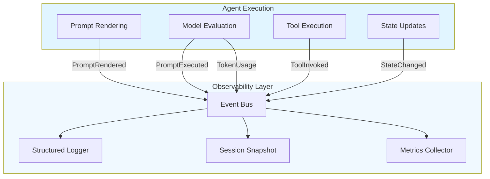
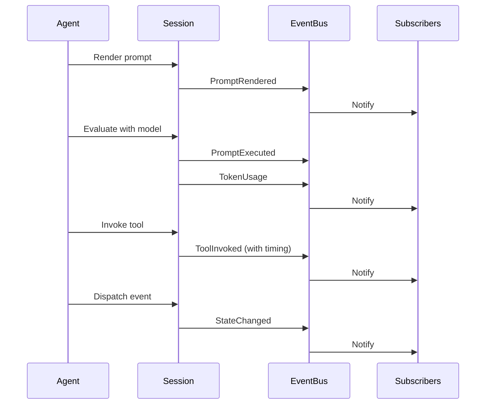
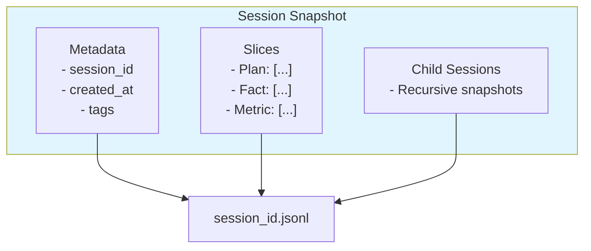
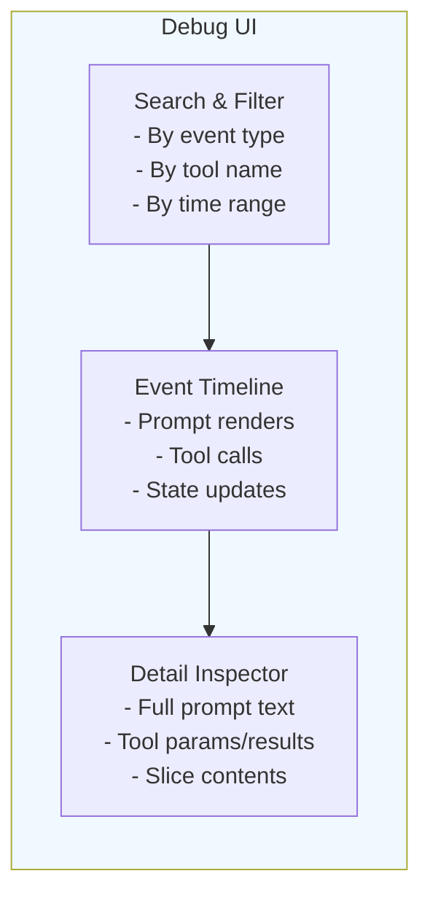

# Chapter 13: Debugging & Observability

> **Canonical References**: See [specs/LOGGING.md](/specs/LOGGING.md) and [specs/WINK_DEBUG.md](/specs/WINK_DEBUG.md) for complete specifications.

## Introduction

Debugging agent systems is fundamentally different from debugging traditional applications. Agent failures are often subtle—the model chose the wrong tool, misinterpreted context, or drifted off task. Traditional stack traces don't help when the "bug" is a semantic issue in how the agent reasoned about its task.

WINK provides observability tools designed for this reality:

- **Structured logging** with event-based routing
- **Session event streams** that capture every model interaction and tool call
- **JSONL snapshots** for complete session serialization
- **Debug UI** for visual inspection of execution timelines

This chapter shows you how to instrument your agents for production observability and how to diagnose issues when things go wrong.

## The Observability Philosophy

WINK's observability is built on three principles:

1. **Event-driven capture**: Everything goes through the event bus. Logging, metrics, and tracing all subscribe to the same stream.

2. **Deterministic replay**: Session snapshots include everything needed to reconstruct what happened—events, state transitions, tool calls, and model responses.

3. **Separation of concerns**: Logging happens at the infrastructure level. Your agent code stays clean and focused on business logic.



Your agent code dispatches events. The observability layer subscribes to them. This inversion of control means adding new monitoring doesn't require touching agent code.

## 13.1 Structured Logging

WINK uses structured logging with JSON output for machine-parseable logs. Configure logging once at application startup:

```python
from weakincentives.runtime import configure_logging, get_logger

# Configure once at startup
configure_logging(level="INFO", json_mode=True)

# Get logger in your modules
logger = get_logger(__name__)

# Log with structured fields
logger.info("hello", event="demo.hello", context={"foo": "bar"})
```

### Log Structure

When `json_mode=True`, logs are emitted as JSON objects:

```json
{
  "timestamp": "2025-01-09T12:34:56.789Z",
  "level": "INFO",
  "logger": "weakincentives.runtime.session",
  "message": "hello",
  "event": "demo.hello",
  "context": {
    "foo": "bar"
  }
}
```

### Key Fields

- **`event`**: A namespaced identifier like `"session.created"` or `"tool.invoked"`. Use dotted notation for hierarchical organization.
- **`context`**: Arbitrary structured data. Keep this JSON-serializable.
- **`level`**: Standard Python logging levels (`DEBUG`, `INFO`, `WARNING`, `ERROR`, `CRITICAL`)

### Routing Logs by Event

Structured events let you route logs to different backends:

```python
import logging
from weakincentives.runtime import get_logger

class EventRouter(logging.Handler):
    def emit(self, record):
        event = getattr(record, "event", None)
        if event and event.startswith("tool."):
            # Route tool events to tool-specific backend
            self.send_to_tool_backend(record)
        elif event and event.startswith("model."):
            # Route model events to LLM observability platform
            self.send_to_llm_platform(record)
        else:
            # Default handler
            self.send_to_default(record)

logger = get_logger(__name__)
logger.addHandler(EventRouter())
```

See [specs/LOGGING.md](/specs/LOGGING.md) for the full logging surface specification.

## 13.2 Session Events

Sessions subscribe to the event bus and capture telemetry events automatically. These events provide fine-grained insight into what happened during execution.

### Core Event Types



#### PromptRendered

Emitted when a prompt is rendered (before being sent to the model):

```python
@dataclass(frozen=True)
class PromptRendered:
    session_id: UUID
    prompt_key: str
    rendered_text: str
    timestamp: datetime
```

#### ToolInvoked

Emitted when a tool is called:

```python
@dataclass(frozen=True)
class ToolInvoked:
    session_id: UUID
    tool_name: str
    params: dict[str, object]
    result: ToolResult[object]
    duration_ms: float
    timestamp: datetime
```

The `duration_ms` field lets you track tool performance. Slow tools show up immediately in your metrics.

#### PromptExecuted

Emitted when a prompt evaluation completes:

```python
@dataclass(frozen=True)
class PromptExecuted:
    session_id: UUID
    prompt_key: str
    output: object  # Structured output
    duration_ms: float
    timestamp: datetime
```

#### TokenUsage

Emitted after model responses:

```python
@dataclass(frozen=True)
class TokenUsage:
    session_id: UUID
    prompt_tokens: int
    completion_tokens: int
    total_tokens: int
    timestamp: datetime
```

### Subscribing to Events

You can subscribe to the event bus to build custom observability:

```python
from weakincentives.runtime import InProcessDispatcher, Session
from weakincentives.runtime.events import ToolInvoked, TokenUsage

bus = InProcessDispatcher()

def log_tool_calls(event: ToolInvoked) -> None:
    print(f"Tool {event.tool_name} took {event.duration_ms}ms")

def track_token_usage(event: TokenUsage) -> None:
    print(f"Used {event.total_tokens} tokens")

# Subscribe to specific event types
bus.subscribe(ToolInvoked, log_tool_calls)
bus.subscribe(TokenUsage, track_token_usage)

session = Session(bus=bus)
```

This pattern lets you route events to external systems (Datadog, Honeycomb, Prometheus, etc.) without modifying agent code.

See [Chapter 5](05-sessions.md) for more on event dispatching and [Chapter 7](07-main-loop.md) for event loop integration.

## 13.3 Dumping Snapshots to JSONL

Session snapshots let you persist complete execution traces to disk. Each snapshot includes:

- All session metadata (ID, tags, timestamps)
- All slice contents (typed state)
- All child sessions (for hierarchical agents)
- Serialized in stable JSONL format

### Creating Snapshots

```python
from weakincentives.debug import dump_session

# Dump session to JSONL file
path = dump_session(session, target="snapshots/")
# Returns: snapshots/<session_id>.jsonl
```

The `target` parameter can be:
- A directory path (filename will be `<session_id>.jsonl`)
- A file path (used as-is)

### JSONL Format

Each line in the JSONL file is one serialized session:

```jsonl
{"session_id": "123e4567-e89b-12d3-a456-426614174000", "created_at": "2025-01-09T12:00:00Z", "tags": {}, "slices": {...}, "children": [...]}
```

The format is:
1. **Human-readable**: You can inspect snapshots with `jq` or text editors
2. **Stable**: Field order and structure are versioned
3. **Complete**: Everything needed to restore the session

### Snapshot Contents



### Restoring from Snapshots

```python
from weakincentives.debug import load_session

# Load session from JSONL
session = load_session("snapshots/123e4567-e89b-12d3-a456-426614174000.jsonl")

# Query restored state
plan = session[Plan].latest()
facts = session[Fact].all()
```

Restored sessions are fully functional. You can:
- Continue execution from the snapshot
- Re-run reducers to test changes
- Feed the session to evaluators

See [Chapter 8](08-evaluation.md) for how evaluators use snapshots to test against real execution traces.

## 13.4 The Debug UI

The debug UI provides visual inspection of session execution timelines. It's invaluable for understanding what the model saw, which tools it called, and how state evolved.

### Installation

The debug UI is part of the `wink` CLI extras:

```bash
pip install "weakincentives[wink]"
```

This installs the `wink` command-line tool with the `debug` subcommand.

### Running the Debug UI

```bash
wink debug snapshots/<session_id>.jsonl
```

This starts a local web server (default: `http://localhost:8080`) that renders an interactive timeline.

### UI Features



#### Event Timeline

The timeline shows every event in chronological order:

1. **Prompt renders**: See exactly what was sent to the model, including all sections and tool definitions
2. **Tool invocations**: Expand to see params, results, and execution time
3. **State changes**: See which reducers fired and how slices changed

#### Detail Inspector

Click any event to see full details:

- **Prompts**: Full markdown with syntax highlighting
- **Tools**: JSON-formatted params and results with schema validation
- **State**: Current slice contents at that point in time

#### Search & Filter

Filter the timeline by:
- Event type (`PromptRendered`, `ToolInvoked`, etc.)
- Tool name
- Time range
- Session tags

### Typical Workflow

When debugging an agent failure:

1. **Capture the snapshot** during or after the run:
   ```python
   dump_session(session, target="snapshots/")
   ```

2. **Open the debug UI**:
   ```bash
   wink debug snapshots/<session_id>.jsonl
   ```

3. **Navigate the timeline** to find where things went wrong:
   - Did the prompt include the right context?
   - Did the model call the expected tools?
   - Did reducers update state correctly?

4. **Iterate** on prompts, tools, or reducers based on findings

5. **Re-run** with fixes and compare new snapshots

The debug UI makes it easy to see what the model "thought" it was doing and why it made specific choices.

See [specs/WINK_DEBUG.md](/specs/WINK_DEBUG.md) for the complete debug UI specification.

## Observability in Production

For production deployments, combine all observability features:

```python
from weakincentives.runtime import (
    configure_logging,
    InProcessDispatcher,
    Session,
    LoopGroup,
)
from weakincentives.runtime.events import ToolInvoked, TokenUsage, PromptExecuted
from weakincentives.debug import dump_session

# 1. Configure structured logging
configure_logging(level="INFO", json_mode=True)

# 2. Set up event bus with subscribers
bus = InProcessDispatcher()

def track_tool_performance(event: ToolInvoked) -> None:
    # Send to metrics backend
    metrics.timing(f"tool.{event.tool_name}.duration", event.duration_ms)

def track_token_costs(event: TokenUsage) -> None:
    # Send to cost tracking
    cost_tracker.record(event.total_tokens)

def capture_failures(event: PromptExecuted) -> None:
    # Dump snapshot on error
    if hasattr(event.output, "error"):
        dump_session(session, target="failures/")

bus.subscribe(ToolInvoked, track_tool_performance)
bus.subscribe(TokenUsage, track_token_costs)
bus.subscribe(PromptExecuted, capture_failures)

# 3. Create session with instrumentation
session = Session(
    bus=bus,
    tags={"env": "prod", "user": "alice"},
)

# 4. Run with health checks (for Kubernetes)
group = LoopGroup(
    loops=[main_loop],
    health_port=8080,  # /health/live, /health/ready
)
group.run()
```

This gives you:
- **Structured logs** for grep/log aggregators
- **Real-time metrics** for dashboards
- **Automatic snapshots** on failures
- **Health endpoints** for orchestrators

See [Chapter 9](09-lifecycle.md) for production deployment patterns and [specs/HEALTH.md](/specs/HEALTH.md) for health check configuration.

## Debugging Checklist

When an agent misbehaves:

- [ ] **Check logs** for structured events (`event` field shows what happened)
- [ ] **Dump a snapshot** (`dump_session`) to capture the full state
- [ ] **Open debug UI** (`wink debug`) to inspect the timeline
- [ ] **Review prompt renders** to ensure the model saw the right context
- [ ] **Check tool calls** for incorrect params or unexpected results
- [ ] **Trace state changes** through reducers to find where state diverged
- [ ] **Compare with working runs** by diffing snapshots

## Cross-References

- [Chapter 5: Sessions](05-sessions.md) - Event dispatching and slice queries
- [Chapter 7: Main Loop](07-main-loop.md) - Event loop integration
- [Chapter 8: Evaluation](08-evaluation.md) - Using snapshots for testing
- [Chapter 9: Lifecycle Management](09-lifecycle.md) - Production deployment and health checks
- [specs/LOGGING.md](/specs/LOGGING.md) - Logging surface specification
- [specs/WINK_DEBUG.md](/specs/WINK_DEBUG.md) - Debug UI specification
- [specs/HEALTH.md](/specs/HEALTH.md) - Health check endpoints

## Summary

WINK's observability tools are designed for the unique challenges of debugging agent systems:

1. **Structured logging** provides machine-parseable event streams
2. **Session events** capture every model interaction and tool call
3. **JSONL snapshots** enable deterministic replay and inspection
4. **Debug UI** visualizes execution timelines for human understanding

Together, these tools let you instrument agents for production and diagnose issues when they arise. The key insight is that observability is built into the runtime—your agent code stays clean while the infrastructure handles capture and routing.

In the next chapter, we'll explore testing strategies that leverage these observability primitives to build reliable agents.
