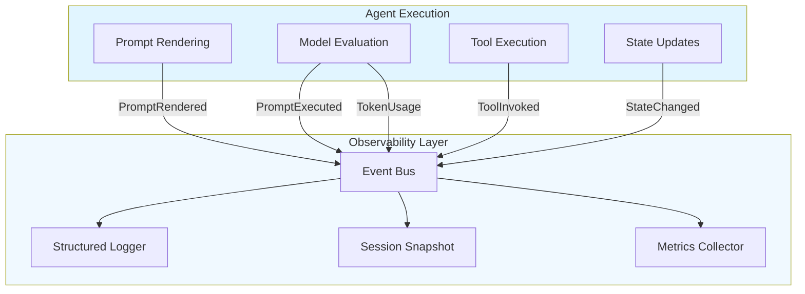
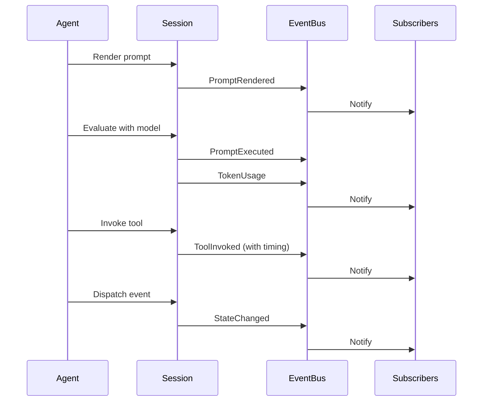
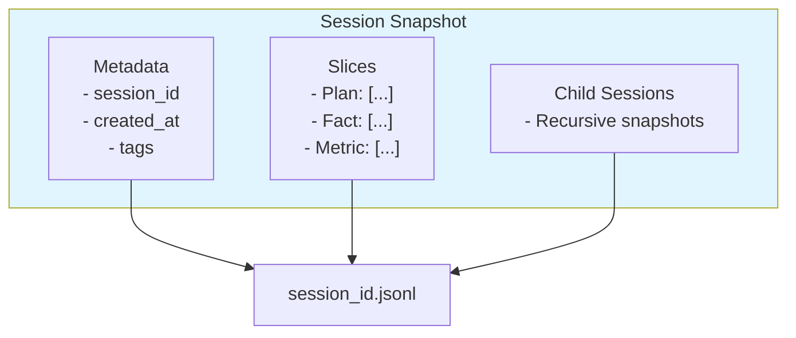
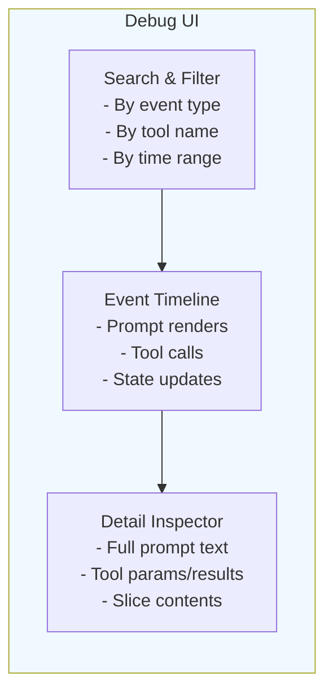
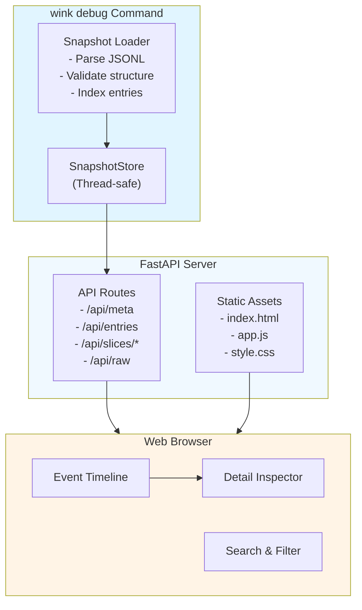
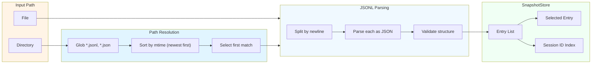
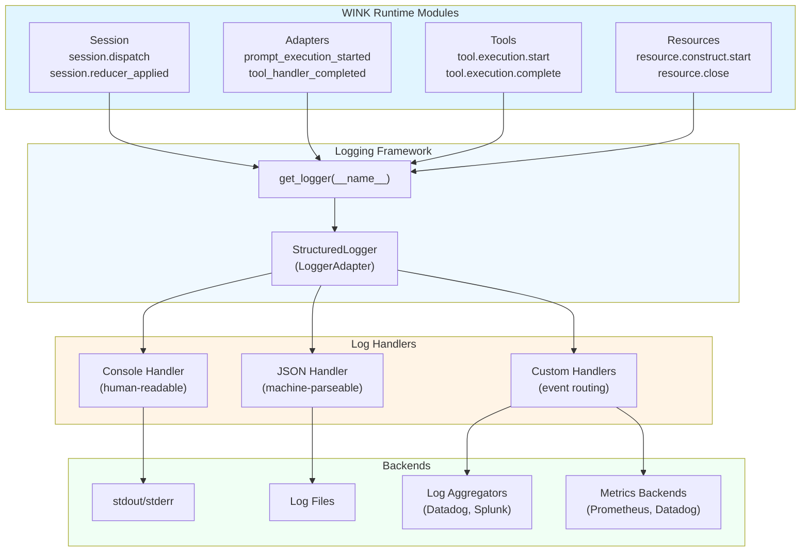
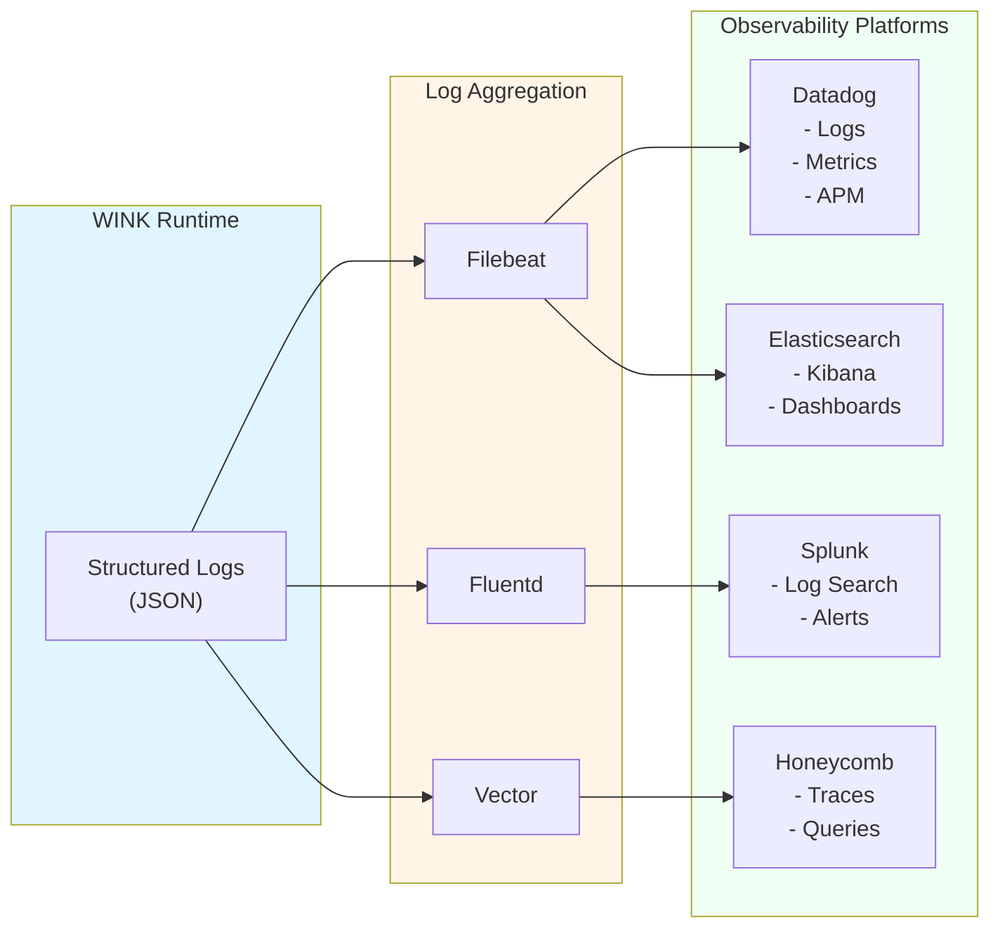

# Chapter 13: Debugging & Observability

> **Canonical References**: See [specs/LOGGING.md](../specs/LOGGING.md) and [specs/WINK_DEBUG.md](../specs/WINK_DEBUG.md) for complete specifications.

## Introduction

Debugging agent systems is fundamentally different from debugging traditional applications. Agent failures are often subtle—the model chose the wrong tool, misinterpreted context, or drifted off task. Traditional stack traces don't help when the "bug" is a semantic issue in how the agent reasoned about its task.

WINK provides observability tools designed for this reality:

- **Structured logging** with event-based routing
- **Session event streams** that capture every model interaction and tool call
- **JSONL snapshots** for complete session serialization
- **Debug UI** for visual inspection of execution timelines

This chapter shows you how to instrument your agents for production observability and how to diagnose issues when things go wrong.

## The Observability Philosophy

WINK's observability is built on three principles:

1. **Event-driven capture**: Everything goes through the event bus. Logging, metrics, and tracing all subscribe to the same stream.

2. **Deterministic replay**: Session snapshots include everything needed to reconstruct what happened—events, state transitions, tool calls, and model responses.

3. **Separation of concerns**: Logging happens at the infrastructure level. Your agent code stays clean and focused on business logic.



Your agent code dispatches events. The observability layer subscribes to them. This inversion of control means adding new monitoring doesn't require touching agent code.

## 13.1 Structured Logging

WINK uses structured logging with JSON output for machine-parseable logs. Configure logging once at application startup:

```python
from weakincentives.runtime import configure_logging, get_logger

# Configure once at startup
configure_logging(level="INFO", json_mode=True)

# Get logger in your modules
logger = get_logger(__name__)

# Log with structured fields
logger.info("hello", event="demo.hello", context={"foo": "bar"})
```

### Log Structure

When `json_mode=True`, logs are emitted as JSON objects:

```json
{
  "timestamp": "2025-01-09T12:34:56.789Z",
  "level": "INFO",
  "logger": "weakincentives.runtime.session",
  "message": "hello",
  "event": "demo.hello",
  "context": {
    "foo": "bar"
  }
}
```

### Key Fields

- **`event`**: A namespaced identifier like `"session.created"` or `"tool.invoked"`. Use dotted notation for hierarchical organization.
- **`context`**: Arbitrary structured data. Keep this JSON-serializable.
- **`level`**: Standard Python logging levels (`DEBUG`, `INFO`, `WARNING`, `ERROR`, `CRITICAL`)

### Routing Logs by Event

Structured events let you route logs to different backends:

```python
import logging
from weakincentives.runtime import get_logger

class EventRouter(logging.Handler):
    def emit(self, record):
        event = getattr(record, "event", None)
        if event and event.startswith("tool."):
            # Route tool events to tool-specific backend
            self.send_to_tool_backend(record)
        elif event and event.startswith("model."):
            # Route model events to LLM observability platform
            self.send_to_llm_platform(record)
        else:
            # Default handler
            self.send_to_default(record)

logger = get_logger(__name__)
logger.addHandler(EventRouter())
```

See [specs/LOGGING.md](../specs/LOGGING.md) for the full logging surface specification.

## 13.2 Session Events

Sessions subscribe to the event bus and capture telemetry events automatically. These events provide fine-grained insight into what happened during execution.

### Core Event Types



#### PromptRendered

Emitted when a prompt is rendered (before being sent to the model):

```python
@dataclass(frozen=True)
class PromptRendered:
    session_id: UUID
    prompt_key: str
    rendered_text: str
    timestamp: datetime
```

#### ToolInvoked

Emitted when a tool is called:

```python
@dataclass(frozen=True)
class ToolInvoked:
    session_id: UUID
    tool_name: str
    params: dict[str, object]
    result: ToolResult[object]
    duration_ms: float
    timestamp: datetime
```

The `duration_ms` field lets you track tool performance. Slow tools show up immediately in your metrics.

#### PromptExecuted

Emitted when a prompt evaluation completes:

```python
@dataclass(frozen=True)
class PromptExecuted:
    session_id: UUID
    prompt_key: str
    output: object  # Structured output
    duration_ms: float
    timestamp: datetime
```

#### TokenUsage

Emitted after model responses:

```python
@dataclass(frozen=True)
class TokenUsage:
    session_id: UUID
    prompt_tokens: int
    completion_tokens: int
    total_tokens: int
    timestamp: datetime
```

### Subscribing to Events

You can subscribe to the event bus to build custom observability:

```python
from weakincentives.runtime import InProcessDispatcher, Session
from weakincentives.runtime.events import ToolInvoked, TokenUsage

bus = InProcessDispatcher()

def log_tool_calls(event: ToolInvoked) -> None:
    print(f"Tool {event.tool_name} took {event.duration_ms}ms")

def track_token_usage(event: TokenUsage) -> None:
    print(f"Used {event.total_tokens} tokens")

# Subscribe to specific event types
bus.subscribe(ToolInvoked, log_tool_calls)
bus.subscribe(TokenUsage, track_token_usage)

session = Session(bus=bus)
```

This pattern lets you route events to external systems (Datadog, Honeycomb, Prometheus, etc.) without modifying agent code.

See [Chapter 5](05-sessions.md) for more on event dispatching and [Chapter 7](07-main-loop.md) for event loop integration.

## 13.3 Dumping Snapshots to JSONL

Session snapshots let you persist complete execution traces to disk. Each snapshot includes:

- All session metadata (ID, tags, timestamps)
- All slice contents (typed state)
- All child sessions (for hierarchical agents)
- Serialized in stable JSONL format

### Creating Snapshots

```python
from weakincentives.runtime.debug import dump_session

# Dump session to JSONL file
path = dump_session(session, target="snapshots/")
# Returns: snapshots/<session_id>.jsonl
```

The `target` parameter can be:
- A directory path (filename will be `<session_id>.jsonl`)
- A file path (used as-is)

### JSONL Format

Each line in the JSONL file is one serialized session:

```jsonl
{"session_id": "123e4567-e89b-12d3-a456-426614174000", "created_at": "2025-01-09T12:00:00Z", "tags": {}, "slices": {...}, "children": [...]}
```

The format is:
1. **Human-readable**: You can inspect snapshots with `jq` or text editors
2. **Stable**: Field order and structure are versioned
3. **Complete**: Everything needed to restore the session

### Snapshot Contents



### Restoring from Snapshots

```python
from weakincentives.runtime.debug import load_session

# Load session from JSONL
session = load_session("snapshots/123e4567-e89b-12d3-a456-426614174000.jsonl")

# Query restored state
plan = session[Plan].latest()
facts = session[Fact].all()
```

Restored sessions are fully functional. You can:
- Continue execution from the snapshot
- Re-run reducers to test changes
- Feed the session to evaluators

See [Chapter 8](08-evaluation.md) for how evaluators use snapshots to test against real execution traces.

## 13.4 The Debug UI

The debug UI provides visual inspection of session execution timelines. It's invaluable for understanding what the model saw, which tools it called, and how state evolved.

### Installation

The debug UI is part of the `wink` CLI extras:

```bash
pip install "weakincentives[wink]"
```

This installs the `wink` command-line tool with the `debug` subcommand.

### Running the Debug UI

```bash
wink debug snapshots/<session_id>.jsonl
```

This starts a local web server (default: `http://localhost:8080`) that renders an interactive timeline.

### UI Features



#### Event Timeline

The timeline shows every event in chronological order:

1. **Prompt renders**: See exactly what was sent to the model, including all sections and tool definitions
2. **Tool invocations**: Expand to see params, results, and execution time
3. **State changes**: See which reducers fired and how slices changed

#### Detail Inspector

Click any event to see full details:

- **Prompts**: Full markdown with syntax highlighting
- **Tools**: JSON-formatted params and results with schema validation
- **State**: Current slice contents at that point in time

#### Search & Filter

Filter the timeline by:
- Event type (`PromptRendered`, `ToolInvoked`, etc.)
- Tool name
- Time range
- Session tags

### Typical Workflow

When debugging an agent failure:

1. **Capture the snapshot** during or after the run:
   ```python
   dump_session(session, target="snapshots/")
   ```

2. **Open the debug UI**:
   ```bash
   wink debug snapshots/<session_id>.jsonl
   ```

3. **Navigate the timeline** to find where things went wrong:
   - Did the prompt include the right context?
   - Did the model call the expected tools?
   - Did reducers update state correctly?

4. **Iterate** on prompts, tools, or reducers based on findings

5. **Re-run** with fixes and compare new snapshots

The debug UI makes it easy to see what the model "thought" it was doing and why it made specific choices.

See [specs/WINK_DEBUG.md](../specs/WINK_DEBUG.md) for the complete debug UI specification.

## 13.5 The Debug UI

The WINK debug UI is a browser-based snapshot explorer that provides visual inspection of session execution traces. Unlike traditional debuggers that step through code, the debug UI lets you examine what the agent "thought" it was doing—what context it saw, which tools it called, how state evolved over time, and where semantic drift occurred.

### Why Visual Inspection Matters

Agent failures are often semantic rather than syntactic. The model might:
- Call the right tool with subtly wrong parameters
- Misinterpret context and make a reasonable but incorrect decision
- Drift off task after several successful turns
- Get stuck in a loop that passes all unit tests

Reading JSON logs or scanning JSONL files makes these patterns hard to spot. The debug UI provides timeline visualization, interactive filtering, and markdown rendering to help you see the execution flow as the agent experienced it.

### Architecture Overview

The debug server is a local web application that loads session snapshots and exposes them through both a web UI and a REST API:



The server runs entirely on your local machine. No data leaves your environment—snapshots stay on disk, and the browser connects to `localhost`.

### Installation and Startup

The debug UI requires the `wink` CLI with extras:

```bash
pip install "weakincentives[wink]"
```

This installs FastAPI, uvicorn, and markdown-it for rendering.

**Starting the server:**

```bash
# Load a specific snapshot file
wink debug snapshots/session_abc123.jsonl

# Load from a directory (uses most recent .jsonl or .json)
wink debug snapshots/

# Customize host and port
wink debug snapshots/ --host 0.0.0.0 --port 9000

# Disable automatic browser opening
wink debug snapshots/ --no-open-browser

# Control logging
wink debug snapshots/ --log-level DEBUG --json-logs
```

**What happens at startup:**

1. **Path resolution**: If you provide a directory, the server globs for `*.jsonl` and `*.json` files, sorts by modification time (newest first), and loads the most recent one.

2. **JSONL parsing**: Each line is parsed as JSON. Empty lines are skipped. Each non-empty line should be a complete session snapshot.

3. **Validation**: The loader validates the `SnapshotPayload` structure. If full restoration fails (e.g., missing dataclass types), the server logs a warning but continues—you can still inspect the raw payload.

4. **Server binding**: FastAPI binds to the specified host/port (default: `127.0.0.1:8000`).

5. **Browser launch**: After a 0.2-second delay (to avoid blocking server startup), the default browser opens to `http://localhost:8000`.

**Exit codes:**

| Code | Meaning |
|------|---------|
| `0` | Server stopped normally (Ctrl+C) |
| `2` | Snapshot validation failed at startup |
| `3` | Server failed to start (port in use, file not found) |

### Snapshot Loading Flow

Understanding how snapshots load helps you organize your debug workflow:



**Multi-entry snapshots:**

Each line in a JSONL file is a separate snapshot entry. You might have:
- Multiple sessions in one file (batch processing outputs)
- Checkpoints from a long-running session
- Before/after comparisons for A/B testing

The UI lets you switch between entries using the `/api/select` endpoint or the entry dropdown in the web interface.

### Web Interface Components

When you open the debug UI in your browser, you see three main areas:

**Screenshot description:**
> The UI has a dark header with "WINK Debug" on the left and session metadata (ID, created_at, tags) on the right. Below is a three-column layout: a narrow left sidebar with filters, a wide center timeline showing events chronologically, and a right detail pane that expands when you click an event.

#### Event Timeline (Center Pane)

The timeline shows every event in chronological order:

1. **Prompt renders** (`PromptRendered`):
   - Full prompt text with syntax-highlighted markdown
   - Tool definitions and schemas
   - Timestamp and prompt key

2. **Tool invocations** (`ToolInvoked`):
   - Tool name and call ID
   - Input parameters (JSON-formatted)
   - Output result (success/error)
   - Execution duration in milliseconds

3. **State changes** (`StateChanged`):
   - Which reducer fired
   - Slice type and operation (Append, Replace, Remove)
   - Before/after state comparison

4. **Token usage** (`TokenUsage`):
   - Input tokens
   - Output tokens
   - Cached tokens (if applicable)
   - Cumulative totals

Each event is a collapsible card. Click to expand and see full details in the right pane.

#### Detail Inspector (Right Pane)

When you click an event, the detail inspector shows:

**For prompts:**
- Full rendered markdown with syntax highlighting
- Section-by-section breakdown (if the prompt uses multiple sections)
- Tool definitions with JSON schemas
- Any overrides that were applied

**For tool calls:**
- Input parameters formatted as JSON
- Full result object (including `ToolResult.value` and `ToolResult.message`)
- Success/failure status
- Execution time with millisecond precision

**For state changes:**
- Current slice contents at that point in time
- The specific items that were added/removed/replaced
- Reducer name and policy (if registered)

**Markdown rendering:**

String values that look like markdown (headers, lists, code blocks, links) are automatically detected and rendered as HTML. This makes it easy to read plan steps, documentation, or agent-generated summaries without squinting at raw text.

The detection heuristic checks for:
- Headers (`#`, `##`, etc.)
- Lists (`-`, `*`, `+`, `1.`)
- Code spans (`` `code` ``)
- Links (`[text](url)`)
- Bold (`**text**`)
- Paragraph breaks (`\n\n`)

Minimum length for detection: 16 characters.

#### Search & Filter (Left Sidebar)

Filter the timeline by:

**Event type:**
- All events
- Prompts only
- Tools only
- State changes only
- Token usage only

**Tool name:**
- Dropdown showing all tools used in the session
- Select one to see only calls to that tool

**Time range:**
- Slider to narrow the timeline to a specific window
- Useful for long sessions with hundreds of events

**Session tags:**
- Filter by custom tags you added when creating the session
- Example: `env=prod`, `user=alice`, `experiment=v2`

**Search box:**
- Full-text search across event names, tool names, and result messages
- Case-insensitive
- Updates the timeline in real-time as you type

### API Endpoints for Power Users

The debug UI is built on a REST API that you can use directly for scripting or integration:

#### `GET /api/meta`

Returns metadata for the currently selected snapshot entry:

```json
{
  "version": "1",
  "created_at": "2025-01-09T10:30:00+00:00",
  "path": "/home/user/snapshots/session_abc123.jsonl",
  "session_id": "abc123",
  "line_number": 1,
  "tags": {
    "session_id": "abc123",
    "env": "prod",
    "user": "alice"
  },
  "validation_error": null,
  "slices": [
    {
      "slice_type": "mymodule.Plan",
      "item_type": "mymodule.Plan",
      "count": 5
    },
    {
      "slice_type": "mymodule.Fact",
      "item_type": "mymodule.Fact",
      "count": 12
    }
  ]
}
```

Use this to check which slices are available before fetching their contents.

#### `GET /api/entries`

Lists all snapshot entries in the current file:

```json
[
  {
    "session_id": "abc123",
    "name": "abc123 (line 1)",
    "path": "/home/user/snapshots/batch.jsonl",
    "line_number": 1,
    "created_at": "2025-01-09T10:30:00+00:00",
    "tags": {"session_id": "abc123", "env": "prod"},
    "selected": true
  },
  {
    "session_id": "def456",
    "name": "def456 (line 2)",
    "path": "/home/user/snapshots/batch.jsonl",
    "line_number": 2,
    "created_at": "2025-01-09T11:00:00+00:00",
    "tags": {"session_id": "def456", "env": "staging"},
    "selected": false
  }
]
```

Use this to see all sessions in a batch snapshot file.

#### `GET /api/slices/{encoded_slice_type}`

Returns items from a specific slice. URL-encode the slice type (e.g., `mymodule.Plan` → `mymodule.Plan`):

```bash
curl http://localhost:8000/api/slices/mymodule.Plan?offset=0&limit=10
```

Response:

```json
{
  "slice_type": "mymodule.Plan",
  "item_type": "mymodule.Plan",
  "items": [
    {
      "steps": ["step1", "step2"],
      "status": "active",
      "__markdown__": {
        "text": "# Plan\n\n- step1\n- step2",
        "html": "<h1>Plan</h1><ul><li>step1</li><li>step2</li></ul>"
      }
    }
  ]
}
```

The `__markdown__` field is automatically added for string values that look like markdown.

#### `POST /api/reload`

Reloads the current snapshot file from disk. Useful when you're actively debugging and want to refresh after dumping a new snapshot:

```bash
curl -X POST http://localhost:8000/api/reload
```

If the previously selected `session_id` still exists, it remains selected; otherwise, the first entry is selected.

#### `POST /api/select`

Selects a different entry within the current file:

```bash
# By session ID
curl -X POST http://localhost:8000/api/select \
  -H "Content-Type: application/json" \
  -d '{"session_id": "abc123"}'

# By line number
curl -X POST http://localhost:8000/api/select \
  -H "Content-Type: application/json" \
  -d '{"line_number": 2}'
```

#### `POST /api/switch`

Switches to a different snapshot file (must be under the same root directory):

```bash
curl -X POST http://localhost:8000/api/switch \
  -H "Content-Type: application/json" \
  -d '{
    "path": "/home/user/snapshots/other.jsonl",
    "session_id": "xyz789"
  }'
```

#### `GET /api/raw`

Returns the raw JSON payload of the current entry without transformation:

```bash
curl http://localhost:8000/api/raw | jq .
```

Use this for exporting to other tools or when validation errors prevent full restoration.

### Interactive Debugging Workflows

#### Workflow 1: Post-Mortem Analysis

When an agent fails in production:

1. **Capture the snapshot** in your error handler:
   ```python
   from weakincentives.runtime.debug import dump_session

   try:
       result = agent.run()
   except Exception as e:
       path = dump_session(session, target="failures/")
       logger.error("Agent failed", event="agent.failed", context={"snapshot": path})
       raise
   ```

2. **Start the debug UI**:
   ```bash
   wink debug failures/
   ```

3. **Navigate the timeline** to find the failure point:
   - Use the search box to find error messages
   - Filter by tool name if you suspect a specific tool
   - Expand events to see full context

4. **Inspect the prompt** that triggered the failure:
   - Was the right context included?
   - Were tool definitions clear?
   - Did the model have enough information to succeed?

5. **Check tool results** leading up to the failure:
   - Were there earlier errors that the agent ignored?
   - Did a tool return unexpected data that confused the model?

6. **Trace state evolution**:
   - Review state changes to see if reducers updated correctly
   - Look for missing data or incorrect transformations

7. **Compare with successful runs**:
   - Load a working snapshot
   - Diff the prompts and tool sequences
   - Identify where the failed run diverged

#### Workflow 2: Iterative Prompt Development

When refining prompts:

1. **Dump snapshots for each experiment**:
   ```python
   session = Session(tags={"experiment": "v2", "prompt": "clarified-instructions"})
   # ... run agent ...
   dump_session(session, target=f"experiments/experiment-v2-{session.session_id}.jsonl")
   ```

2. **Load the snapshot in the debug UI**:
   ```bash
   wink debug experiments/ --no-open-browser
   ```

3. **Use `/api/meta` to check slice counts**:
   - Did the agent produce more facts than the baseline?
   - Did it call tools more or fewer times?

4. **Compare prompts** across experiments:
   - Load experiment-v1 snapshot
   - Open experiment-v2 snapshot in a new browser tab
   - Use the detail inspector to diff the rendered prompts side-by-side

5. **Measure improvement**:
   - Count successful tool calls
   - Check if the agent completed the plan
   - Look at token usage to ensure efficiency

#### Workflow 3: Real-Time Debugging

When developing locally:

1. **Run the agent with periodic snapshots**:
   ```python
   for turn in range(max_turns):
       response = adapter.evaluate(prompt, session=session)
       if turn % 5 == 0:  # Snapshot every 5 turns
           dump_session(session, target=f"dev/checkpoint-{turn}.jsonl")
   ```

2. **Start the debug UI in a terminal pane**:
   ```bash
   wink debug dev/
   ```

3. **As the agent runs**, hit `/api/reload` to see new checkpoints:
   ```bash
   watch -n 5 'curl -X POST http://localhost:8000/api/reload'
   ```

4. **Monitor progress** in the browser:
   - Refresh to see new events
   - Check if the agent is on track
   - Stop early if you see it diverging

### Best Practices

**Organize snapshots by purpose:**

```
snapshots/
├── failures/          # Production failures (auto-captured)
├── experiments/       # Prompt experiments (tagged by version)
├── baselines/         # Known-good runs (for comparison)
└── dev/              # Local development checkpoints
```

**Tag sessions meaningfully:**

```python
session = Session(tags={
    "env": "prod",
    "user": user_id,
    "experiment": "v2-clarified-instructions",
    "git_sha": get_git_sha(),
})
```

Tags appear in the UI and let you filter/search across many snapshots.

**Capture snapshots at key points:**

- After each prompt evaluation (for debugging prompts)
- After tool calls (for debugging tool behavior)
- After state changes (for debugging reducers)
- On error (for post-mortem analysis)

**Use validation errors as hints:**

If a snapshot fails full validation, check `/api/meta` for the `validation_error` field. This often means:
- You changed a dataclass definition but kept old snapshots
- A custom serde handler is missing
- A reducer produced invalid data

You can still inspect the raw payload with `/api/raw` and manually reconstruct what happened.

**Integrate with CI/CD:**

```yaml
# .github/workflows/test.yml
- name: Run agent tests
  run: pytest --snapshot-dir=test-snapshots/

- name: Upload snapshots on failure
  if: failure()
  uses: actions/upload-artifact@v3
  with:
    name: test-snapshots
    path: test-snapshots/
```

Download the artifact and use `wink debug` to inspect failures without local reproduction.

**Performance considerations:**

- Snapshots can get large (MBs) for long sessions with many tool calls
- The debug UI loads the entire file into memory
- For huge sessions (1000+ events), consider splitting into multiple snapshots or using pagination via the API

### Cross-References

- [Chapter 5: Sessions](05-sessions.md) - Event dispatching and snapshot creation
- [Chapter 8: Evaluation](08-evaluation.md) - Using snapshots for evaluation
- [specs/WINK_DEBUG.md](../specs/WINK_DEBUG.md) - Complete debug UI specification
- [specs/SLICES.md](../specs/SLICES.md) - Slice storage and JSONL format

---

## 13.6 Structured Logging

WINK's logging framework provides structured, event-driven logging across all runtime modules. Unlike traditional logging that emits human-readable strings, structured logging emits machine-parseable JSON records with stable event names and typed context fields. This makes WINK agents observable at scale—you can route logs to different backends, build dashboards, set up alerts, and correlate events across distributed systems.

### Design Philosophy

The logging framework is built on three principles:

**1. Event-driven taxonomy:**

Every log record carries an `event` field that categorizes the record. Instead of searching log messages for keywords, you filter by event type:

```python
# Traditional logging
logger.info(f"Tool {tool_name} completed in {duration}ms")

# Structured logging
logger.info(
    "Tool execution completed",
    event="tool.execution.complete",
    context={"tool_name": tool_name, "duration_ms": duration}
)
```

Downstream consumers (log aggregators, dashboards, alerting) can subscribe to specific events without fragile regex parsing.

**2. Module isolation:**

Each module owns its logger instance via `get_logger(__name__)`. This keeps loggers scoped to their module without a global registry:

```python
from weakincentives.runtime.logging import get_logger

logger = get_logger(__name__)
```

The logger name appears in every record, making it easy to trace logs back to their source.

**3. Structured-first payloads:**

Log records favor key/value pairs (`extra`) over message formatting. Messages can change without breaking observability pipelines:

```python
# Message can evolve ("completed" → "finished" → "succeeded")
logger.info(
    "Tool execution completed",
    event="tool.execution.complete",
    context={
        "tool_name": tool_name,
        "duration_ms": duration,
        "success": True,
    }
)
```

Consumers filter on `event="tool.execution.complete"` and extract `context.duration_ms`, ignoring the message text.

### Logging Architecture



### Configuration and Setup

Configure logging once at application startup:

```python
from weakincentives.runtime import configure_logging, get_logger

# Configure with JSON output for production
configure_logging(level="INFO", json_mode=True)

# Get a logger in your modules
logger = get_logger(__name__)

# Log with structured fields
logger.info(
    "Agent initialized",
    event="agent.init",
    context={"model": "gpt-4o", "max_turns": 10}
)
```

**Arguments to `configure_logging`:**

| Argument | Type | Default | Description |
|----------|------|---------|-------------|
| `level` | `str \| int` | `"INFO"` | Log level (`DEBUG`, `INFO`, `WARNING`, `ERROR`, `CRITICAL`) |
| `json_mode` | `bool` | `False` | Emit JSON records instead of human-readable strings |
| `format` | `str \| None` | `None` | Custom format string (only used when `json_mode=False`) |

**Environment variable overrides:**

```bash
# Override log level
WEAKINCENTIVES_LOG_LEVEL=DEBUG python my_agent.py

# Force JSON mode
WEAKINCENTIVES_JSON_LOGS=1 python my_agent.py
```

### Log Schema

**JSON mode output:**

When `json_mode=True`, every log record is a single JSON object:

```json
{
  "timestamp": "2025-01-09T12:34:56.789Z",
  "level": "INFO",
  "logger": "weakincentives.runtime.session",
  "message": "Session dispatch completed",
  "event": "session.dispatch",
  "context": {
    "session_id": "abc123",
    "event_type": "AddStep",
    "reducer_count": 3
  }
}
```

**Field descriptions:**

| Field | Type | Description |
|-------|------|-------------|
| `timestamp` | `string` | ISO 8601 timestamp with timezone |
| `level` | `string` | Log level (`DEBUG`, `INFO`, `WARNING`, `ERROR`, `CRITICAL`) |
| `logger` | `string` | Logger name (module path) |
| `message` | `string` | Human-readable message |
| `event` | `string` | Event identifier (dotted notation) |
| `context` | `object` | Structured context fields (varies by event) |

**Human-readable mode output:**

When `json_mode=False` (default for local development):

```
2025-01-09 12:34:56 INFO weakincentives.runtime.session: Session dispatch completed [event=session.dispatch session_id=abc123 event_type=AddStep reducer_count=3]
```

This is easier to read during development but harder to parse in production.

### Logging Surfaces

WINK emits structured logs from all runtime modules. The tables below document the complete logging surface area—these are the events you can subscribe to, filter, and route.

#### Runtime Events

Core session and event bus operations:

| Module | Event | Level | Context Fields |
|--------|-------|-------|----------------|
| `runtime/events/__init__.py` | `event_delivery_failed` | `ERROR` | `event_type`, `handler` |
| `runtime/session/session.py` | `session_reducer_failed` | `ERROR` | `reducer`, `data_type`, `slice_type` |
| `runtime/session/session.py` | `session_observer_failed` | `ERROR` | `observer`, `slice_type` |

#### Session Dispatch (DEBUG)

Detailed session state mutation tracking (only visible with `DEBUG` level):

| Event | Context Fields |
|-------|----------------|
| `session.dispatch` | `session_id`, `event_type` |
| `session.dispatch_data_event` | `session_id`, `data_type`, `reducer_count` |
| `session.reducer_applied` | `session_id`, `reducer`, `slice_type`, `operation` |
| `session.register_reducer` | `session_id`, `data_type`, `slice_type`, `reducer`, `policy` |
| `session.initialize_slice` | `session_id`, `slice_type`, `value_count` |
| `session.clear_slice` | `session_id`, `slice_type`, `has_predicate` |
| `session.reset` | `session_id`, `slice_count`, `slice_types` |
| `session.restore` | `session_id`, `preserve_logs`, `snapshot_slice_count`, `registered_slice_count` |

Use these events to debug reducer behavior and state mutations.

#### Adapter Logging

Shared adapter events (all adapters):

| Event | Level | Context Fields |
|-------|-------|----------------|
| `prompt_execution_started` | `INFO` | `tool_count` |
| `prompt_execution_succeeded` | `INFO` | `tool_count`, `has_output`, `text_length`, `structured_output`, `handler_count` |
| `prompt_execution_publish_failed` | `ERROR` | `failure_count`, `failed_handlers` |
| `prompt_rendered_published` | `DEBUG` | `handler_count` |
| `prompt_rendered_publish_failed` | `ERROR` | `failure_count`, `failed_handlers` |
| `prompt_tool_calls_detected` | `DEBUG` | `count` |
| `tool_handler_completed` | `INFO` | `success`, `has_value` |
| `tool_validation_failed` | `WARNING` | `reason` |
| `prompt_throttled` | `WARNING` | `kind`, `delay_seconds`, `attempt`, `retry_after_seconds` |
| `tool_handler_exception` | `ERROR` | `provider_payload` |

**Claude Agent SDK adapter (DEBUG):**

The Claude Agent SDK adapter provides extensive DEBUG logging due to its subprocess-based execution model:

| Event | Context Fields (subset—see specs/LOGGING.md for full list) |
|-------|-------------------------------------------------------------|
| `adapter.init` | `model`, `permission_mode`, `cwd`, `max_turns`, `max_budget_usd` |
| `evaluate.entry` | `prompt_name`, `has_deadline`, `deadline_remaining_seconds` |
| `evaluate.rendered` | `prompt_text_length`, `tool_count`, `tool_names`, `output_type` |
| `sdk_query.executing` | `prompt_name` |
| `sdk_query.message_received` | `role`, `content`, `usage`, `thinking_preview`, `cumulative_input_tokens` |
| `sdk_query.complete` | `message_count`, `stats_tool_count`, `stats_turn_count`, `stats_input_tokens` |
| `sdk_query.stderr` | `line` (captures Claude Code stderr output) |

The SDK adapter logs **full message content** (text, tool uses, results, structured output) without truncation, providing complete visibility into the conversation flow.

**OpenAI adapter (DEBUG):**

| Event | Context Fields |
|-------|----------------|
| `adapter.init` | `model`, `tool_choice`, `temperature`, `max_tokens` |
| `evaluate.entry` | `prompt_name`, `has_deadline`, `has_budget` |
| `provider.request` | `model`, `message_count`, `tool_count`, `tool_names` |
| `provider.response` | `response_type`, `has_output`, `has_usage` |
| `provider.error` | `error_type`, `error_message`, `status_code`, `code` |

**LiteLLM adapter (DEBUG):**

| Event | Context Fields |
|-------|----------------|
| `adapter.init` | `model`, `tool_choice`, `temperature`, `max_tokens` |
| `provider.request` | `model`, `message_count`, `tool_count` |
| `throttle.analyzing` | `error_type`, `error_message`, `status_code` |
| `throttle.detected` | `throttle_kind`, `retry_after_seconds` |

#### Tool Execution (DEBUG)

| Event | Context Fields |
|-------|----------------|
| `tool.execution.start` | `tool_name`, `call_id`, `prompt_name`, `arguments` |
| `tool.execution.complete` | `tool_name`, `success`, `message`, `value`, `value_type` |
| `tool_handler_completed` | `success`, `has_value` |
| `tool_event_dispatched` | `handler_count` |
| `tool_event_dispatch_failed` | `failure_count`, `failed_handlers` |

#### Resource Lifecycle (DEBUG)

| Event | Context Fields |
|-------|----------------|
| `resource.construct.start` | `protocol`, `scope` |
| `resource.construct.complete` | `protocol`, `scope`, `instance_type` |
| `resource.close` | `protocol`, `scope` |
| `resource.context.close.start` | `resource_count` |
| `resource.tool_scope.enter` | (none) |
| `resource.tool_scope.exit` | `closed_count` |

#### Mailbox Operations (DEBUG)

| Event | Context Fields |
|-------|----------------|
| `mailbox.send` | `mailbox`, `message_id`, `reply_to`, `body_type` |
| `mailbox.receive` | `mailbox`, `message_count`, `message_ids` |
| `mailbox.acknowledge` | `mailbox`, `message_id`, `receipt_handle` |

#### Prompt Overrides

| Event | Level | Context Fields |
|-------|-------|----------------|
| `prompt_override_resolved` | `INFO` | `ns`, `prompt_key`, `tag` |
| `prompt_override_persisted` | `INFO` | `ns`, `prompt_key`, `tag` |
| `prompt_override_missing` | `DEBUG` | `ns`, `prompt_key`, `tag` |

### Event Routing

Route logs to different backends based on event type:

```python
import logging
from weakincentives.runtime import get_logger

class EventRouter(logging.Handler):
    def emit(self, record):
        event = getattr(record, "event", None)
        if not event:
            return

        if event.startswith("tool."):
            # Route tool events to tool-specific backend
            self.send_to_datadog(record, tags=["source:tools"])

        elif event.startswith("model.") or event.startswith("prompt_"):
            # Route model events to LLM observability platform
            self.send_to_langsmith(record)

        elif event.startswith("session."):
            # Route session events to metrics backend
            self.send_to_prometheus(record)

        else:
            # Default handler
            self.send_to_stdout(record)

    def send_to_datadog(self, record, tags=None):
        # Implementation for Datadog integration
        pass

    def send_to_langsmith(self, record):
        # Implementation for LangSmith integration
        pass

    def send_to_prometheus(self, record):
        # Implementation for Prometheus metrics
        pass

    def send_to_stdout(self, record):
        print(self.format(record))

# Register the custom handler
root_logger = logging.getLogger("weakincentives")
root_logger.addHandler(EventRouter())
```

### Integration with Observability Platforms



**Datadog integration example:**

```python
import logging
from datadog import statsd
from weakincentives.runtime import get_logger, configure_logging

configure_logging(level="INFO", json_mode=True)

class DatadogHandler(logging.Handler):
    def emit(self, record):
        event = getattr(record, "event", None)
        context = getattr(record, "context", {})

        # Send logs to Datadog
        if record.levelno >= logging.ERROR:
            statsd.increment(f"wink.errors.{event}", tags=[f"logger:{record.name}"])

        # Extract metrics from context
        if "duration_ms" in context:
            statsd.histogram(f"wink.{event}.duration", context["duration_ms"])

        if "tool_count" in context:
            statsd.gauge(f"wink.{event}.tool_count", context["tool_count"])

# Register handler
logger = get_logger("weakincentives")
logger.addHandler(DatadogHandler())
```

### Production Patterns

#### Pattern 1: Correlation IDs

Track requests across distributed systems:

```python
import contextvars
from weakincentives.runtime import get_logger

correlation_id = contextvars.ContextVar("correlation_id", default=None)

class CorrelationFilter(logging.Filter):
    def filter(self, record):
        cid = correlation_id.get()
        if cid:
            record.correlation_id = cid
        return True

logger = get_logger(__name__)
logger.addFilter(CorrelationFilter())

# In your request handler
def handle_request(request):
    correlation_id.set(request.headers.get("X-Correlation-ID"))
    # All logs from this request will include correlation_id
    logger.info("Processing request", event="request.start")
```

#### Pattern 2: Sampling and Rate Limiting

Reduce log volume in production:

```python
import random
from weakincentives.runtime import get_logger

class SamplingHandler(logging.Handler):
    def __init__(self, sample_rate=0.1):
        super().__init__()
        self.sample_rate = sample_rate

    def emit(self, record):
        # Always log errors
        if record.levelno >= logging.ERROR:
            self.forward(record)
            return

        # Sample INFO/DEBUG logs
        if random.random() < self.sample_rate:
            self.forward(record)

    def forward(self, record):
        # Send to actual backend
        pass

logger = get_logger("weakincentives")
logger.addHandler(SamplingHandler(sample_rate=0.1))  # Keep 10% of INFO/DEBUG logs
```

#### Pattern 3: Error Tracking

Send errors to Sentry:

```python
import sentry_sdk
from weakincentives.runtime import get_logger

sentry_sdk.init(dsn="https://...")

class SentryHandler(logging.Handler):
    def emit(self, record):
        if record.levelno >= logging.ERROR:
            event = getattr(record, "event", None)
            context = getattr(record, "context", {})

            with sentry_sdk.push_scope() as scope:
                scope.set_tag("event", event)
                scope.set_context("wink", context)
                sentry_sdk.capture_exception(record.exc_info)

logger = get_logger("weakincentives")
logger.addHandler(SentryHandler())
```

### Performance Considerations

**DEBUG logging overhead:**

DEBUG logs are verbose (full message content, arguments, state). Enable only during development or troubleshooting:

```python
# Production: INFO level (fewer logs)
configure_logging(level="INFO", json_mode=True)

# Development: DEBUG level (all logs)
configure_logging(level="DEBUG", json_mode=False)
```

**Conditional logging:**

Avoid expensive operations when DEBUG is disabled:

```python
logger = get_logger(__name__)

# Bad: always serializes state (even when DEBUG is off)
logger.debug(f"State: {json.dumps(state)}")

# Good: only serializes when DEBUG is enabled
if logger.isEnabledFor(logging.DEBUG):
    logger.debug("State updated", event="state.update", context={"state": state})
```

**Async handlers:**

For high-throughput systems, use async handlers to avoid blocking:

```python
from logging.handlers import QueueHandler, QueueListener
import queue

log_queue = queue.Queue()
queue_handler = QueueHandler(log_queue)
listener = QueueListener(log_queue, DatadogHandler(), SentryHandler())

logger = get_logger("weakincentives")
logger.addHandler(queue_handler)

# Start listener in background thread
listener.start()

# Logs are queued and processed asynchronously
logger.info("Non-blocking log", event="async.log")
```

### Best Practices

**Use event names consistently:**

- Use dotted notation: `session.dispatch`, `tool.execution.complete`
- Namespace by module: `adapter.*`, `session.*`, `tool.*`
- Keep names stable across versions (consumers depend on them)

**Include relevant context:**

- Add `session_id` for correlating events within a session
- Add `tool_name` for tool-specific events
- Add `prompt_name` for prompt-specific events
- Add `duration_ms` for timing metrics

**Set appropriate log levels:**

| Level | Use For |
|-------|---------|
| `DEBUG` | Detailed diagnostics (state dumps, full messages) |
| `INFO` | High-level lifecycle events (session start, prompt execution) |
| `WARNING` | Recoverable issues (throttling, fallbacks) |
| `ERROR` | Unexpected failures (reducer errors, tool crashes) |
| `CRITICAL` | Unrecoverable failures (process termination) |

**Avoid logging secrets:**

- Redact API keys, tokens, passwords
- Sanitize user data (PII)
- Use `repr()` carefully (can expose internal state)

**Test log output:**

```python
import logging
from weakincentives.runtime import get_logger

def test_logging():
    with LogCapture() as logs:
        logger = get_logger(__name__)
        logger.info("Test", event="test.event", context={"foo": "bar"})

        assert logs.event == "test.event"
        assert logs.context["foo"] == "bar"
```

### Cross-References

- [Chapter 5: Sessions](05-sessions.md) - Session events and dispatching
- [Chapter 9: Lifecycle Management](09-lifecycle.md) - Production logging patterns
- [specs/LOGGING.md](../specs/LOGGING.md) - Complete logging specification
- [specs/HEALTH.md](../specs/HEALTH.md) - Health check logging

---

## Observability in Production

For production deployments, combine all observability features:

```python
from weakincentives.runtime import (
    configure_logging,
    InProcessDispatcher,
    Session,
    LoopGroup,
)
from weakincentives.runtime.events import ToolInvoked, TokenUsage, PromptExecuted
from weakincentives.runtime.debug import dump_session

# 1. Configure structured logging
configure_logging(level="INFO", json_mode=True)

# 2. Set up event bus with subscribers
bus = InProcessDispatcher()

def track_tool_performance(event: ToolInvoked) -> None:
    # Send to metrics backend
    metrics.timing(f"tool.{event.tool_name}.duration", event.duration_ms)

def track_token_costs(event: TokenUsage) -> None:
    # Send to cost tracking
    cost_tracker.record(event.total_tokens)

def capture_failures(event: PromptExecuted) -> None:
    # Dump snapshot on error
    if hasattr(event.output, "error"):
        dump_session(session, target="failures/")

bus.subscribe(ToolInvoked, track_tool_performance)
bus.subscribe(TokenUsage, track_token_costs)
bus.subscribe(PromptExecuted, capture_failures)

# 3. Create session with instrumentation
session = Session(
    bus=bus,
    tags={"env": "prod", "user": "alice"},
)

# 4. Run with health checks (for Kubernetes)
group = LoopGroup(
    loops=[main_loop],
    health_port=8080,  # /health/live, /health/ready
)
group.run()
```

This gives you:
- **Structured logs** for grep/log aggregators
- **Real-time metrics** for dashboards
- **Automatic snapshots** on failures
- **Health endpoints** for orchestrators

See [Chapter 9](09-lifecycle.md) for production deployment patterns and [specs/HEALTH.md](/specs/HEALTH.md) for health check configuration.

## Debugging Checklist

When an agent misbehaves:

- [ ] **Check logs** for structured events (`event` field shows what happened)
- [ ] **Dump a snapshot** (`dump_session`) to capture the full state
- [ ] **Open debug UI** (`wink debug`) to inspect the timeline
- [ ] **Review prompt renders** to ensure the model saw the right context
- [ ] **Check tool calls** for incorrect params or unexpected results
- [ ] **Trace state changes** through reducers to find where state diverged
- [ ] **Compare with working runs** by diffing snapshots

## Cross-References

- [Chapter 5: Sessions](05-sessions.md) - Event dispatching and slice queries
- [Chapter 7: Main Loop](07-main-loop.md) - Event loop integration
- [Chapter 8: Evaluation](08-evaluation.md) - Using snapshots for testing
- [Chapter 9: Lifecycle Management](09-lifecycle.md) - Production deployment and health checks
- [specs/LOGGING.md](../specs/LOGGING.md) - Logging surface specification
- [specs/WINK_DEBUG.md](../specs/WINK_DEBUG.md) - Debug UI specification
- [specs/HEALTH.md](../specs/HEALTH.md) - Health check endpoints

## Summary

WINK's observability tools are designed for the unique challenges of debugging agent systems:

1. **Structured logging** provides machine-parseable event streams
2. **Session events** capture every model interaction and tool call
3. **JSONL snapshots** enable deterministic replay and inspection
4. **Debug UI** visualizes execution timelines for human understanding

Together, these tools let you instrument agents for production and diagnose issues when they arise. The key insight is that observability is built into the runtime—your agent code stays clean while the infrastructure handles capture and routing.

In the next chapter, we'll explore testing strategies that leverage these observability primitives to build reliable agents.
