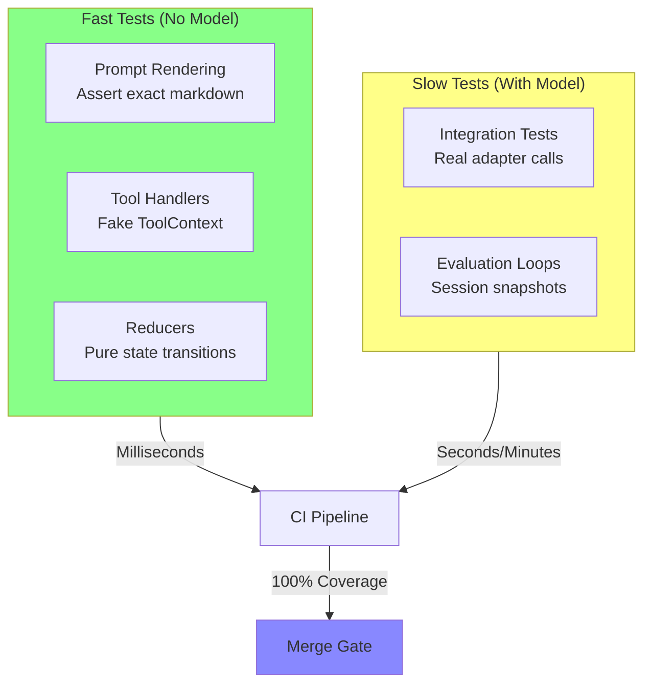
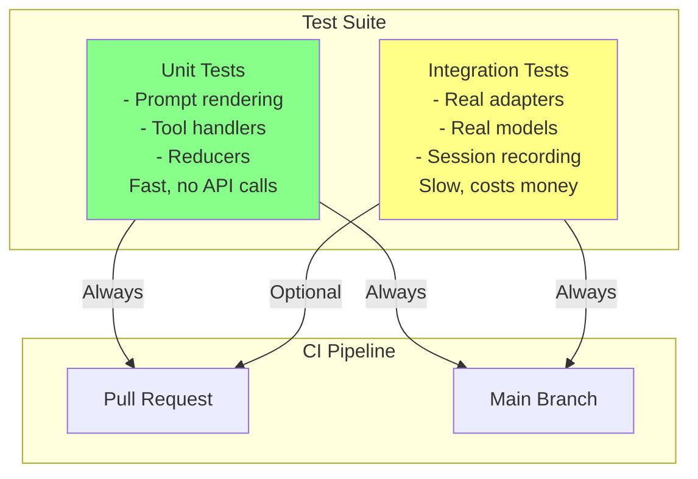
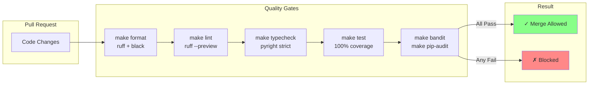

# Chapter 14: Testing & Reliability

> **Canonical Reference**: See [specs/TESTING.md](../specs/TESTING.md) and [specs/EVALS.md](../specs/EVALS.md) for complete specifications.

## Introduction

Testing agent systems presents unique challenges. Traditional unit tests verify that functions return expected values for given inputs. But agent behavior depends on:

- **Model responses** (non-deterministic and expensive)
- **Stateful interactions** (context accumulates across multiple turns)
- **Tool side effects** (filesystem, network, external APIs)
- **Prompt templates** (string manipulation with semantic implications)

WINK's architecture makes most agent logic testable **without calling a model**. By separating deterministic components (prompts, reducers, tool handlers) from non-deterministic ones (model evaluation), you can:

1. Test prompt rendering as pure string transformation
1. Test tool handlers in isolation with fake resources
1. Test state transitions as pure functions
1. Reserve expensive integration tests for end-to-end validation

This chapter covers WINK's testing philosophy and practical strategies for building reliable agent systems.

## The Testing Philosophy

WINK's testing approach follows three principles:

1. **Determinism first**: Most code should be pure functions testable without mocks
1. **Fast feedback**: Unit tests run in milliseconds; integration tests are opt-in
1. **100% coverage**: Every line and branch must be tested—no exceptions



The vast majority of your tests should be in the "Fast" category. Integration tests are important but should be selective—they cost money and time.

## 14.1 Prompt Rendering Tests

Prompts in WINK are deterministic templates. Given fixed parameters, they always render to the same markdown. This makes them testable without a model.

### Basic Rendering Test

````python nocheck
from dataclasses import dataclass
from typing import Any
from weakincentives.prompt import Prompt, PromptTemplate, MarkdownSection
from weakincentives.runtime import Session


@dataclass(frozen=True)
class ReviewParams:
    file_path: str
    diff: str


template = PromptTemplate[Any](
    ns="code-review",
    key="analyze-diff",
    name="analyze_diff",
    sections=[
        MarkdownSection(
            title="Task",
            key="task",
            template="Review changes to ${file_path}",
        ),
        MarkdownSection(
            title="Diff",
            key="diff",
            template="```diff\n${diff}\n```",
        ),
    ],
)

prompt = Prompt(template)


def test_prompt_renders_correctly() -> None:
    """Test that prompt renders with correct parameter substitution."""
    session = Session()
    params = ReviewParams(
        file_path="src/main.py",
        diff="+ print('hello')\n- print('goodbye')",
    )

    rendered = prompt.bind(params).render(session=session)

    assert "Review changes to src/main.py" in rendered.text
    assert "```diff" in rendered.text
    assert "+ print('hello')" in rendered.text
````

### Testing Tool Inclusion

Verify that tools are correctly included in prompt sections:

```python nocheck
from weakincentives.prompt import Tool, ToolContext, ToolResult


def approve_change(params: dict[str, object], *, context: ToolContext) -> ToolResult[bool]:
    return ToolResult.ok(True)


approve_tool = Tool(
    name="approve_change",
    description="Approve the changes",
    handler=approve_change,
    params_schema={"type": "object", "properties": {}},
)

template_with_tools = PromptTemplate[Any](
    ns="code-review",
    key="with-tools",
    name="with_tools",
    sections=[
        MarkdownSection(
            title="Actions",
            key="actions",
            template="Use the approve_change tool when ready",
            tools=(approve_tool,),
        ),
    ],
)


def test_tools_appear_in_rendered_prompt() -> None:
    """Test that tools are included in the rendered prompt."""
    session = Session()
    prompt = Prompt(template_with_tools)
    rendered = prompt.bind({}).render(session=session)

    # Tool name appears in the rendered output
    assert "approve_change" in rendered.text
    # Tool description appears
    assert "Approve the changes" in rendered.text
```

### Snapshot Testing

For complex prompts, use snapshot testing to catch regressions:

```python nocheck
def test_prompt_snapshot(snapshot) -> None:
    """Test that prompt renders match saved snapshot."""
    session = Session()
    params = ReviewParams(file_path="test.py", diff="+ added line")
    rendered = prompt.bind(params).render(session=session)

    # Compare against saved snapshot
    snapshot.assert_match(rendered.text, "review_prompt.txt")
```

Snapshot tests ensure that prompt changes are intentional. When you modify a template, the test fails until you update the snapshot.

See [Chapter 3](03-prompts.md) for more on prompt design and [Chapter 11](11-prompt-optimization.md) for hash-validated overrides.

## 14.2 Tool Handler Tests

Tool handlers contain your business logic. They're pure functions that:

- Take typed params and a `ToolContext`
- Return a `ToolResult[T]`
- May access resources through the context

Because handlers don't call the model, you can test them in isolation.

### Basic Handler Test

```python nocheck
from dataclasses import dataclass
from weakincentives.prompt import ToolContext, ToolResult
from weakincentives.filesystem import Filesystem, InMemoryFilesystem


@dataclass(frozen=True)
class ReadFileParams:
    path: str


def read_file_handler(
    params: ReadFileParams,
    *,
    context: ToolContext,
) -> ToolResult[str]:
    """Read a file from the filesystem."""
    fs = context.resources.get(Filesystem)

    try:
        content = fs.read_text(params.path)
        return ToolResult.ok(content, message=f"Read {len(content)} bytes")
    except FileNotFoundError:
        return ToolResult.error(f"File not found: {params.path}")


def test_read_file_success() -> None:
    """Test reading an existing file."""
    # Create fake filesystem
    fs = InMemoryFilesystem()
    fs.write_text("/test.txt", "hello world")

    # Create fake context with resources
    context = ToolContext.create(resources={Filesystem: fs})

    # Call handler
    result = read_file_handler(
        ReadFileParams(path="/test.txt"),
        context=context,
    )

    assert result.is_success
    assert result.value == "hello world"
    assert "11 bytes" in result.message


def test_read_file_not_found() -> None:
    """Test reading a non-existent file."""
    fs = InMemoryFilesystem()
    context = ToolContext.create(resources={Filesystem: fs})

    result = read_file_handler(
        ReadFileParams(path="/missing.txt"),
        context=context,
    )

    assert not result.is_success
    assert "File not found" in result.message
```

### Testing Resource Dependencies

Handlers that depend on multiple resources:

```python nocheck
from weakincentives.resources import ResourceRegistry, Binding


def test_handler_with_multiple_resources() -> None:
    """Test handler that uses multiple resources."""
    # Set up resource registry
    registry = ResourceRegistry.of(
        Binding(Filesystem, lambda r: InMemoryFilesystem()),
        Binding(Config, lambda r: Config(api_key="test")),
    )

    with registry.open() as resolver:
        context = ToolContext(resources=resolver, session=session)
        result = complex_handler(params, context=context)
        assert result.is_success
```

See [Chapter 4](04-tools.md) for tool design patterns and [specs/FILESYSTEM.md](../specs/FILESYSTEM.md) for filesystem testing.

## 14.3 Reducer Tests

Reducers are pure functions that transform session state. They take a `SliceView[T]` and an event, returning a `SliceOp[T]`.

### Testing Append Operations

```python nocheck
from dataclasses import dataclass, replace
from weakincentives.runtime.session import SliceView, Append, reducer


@dataclass(frozen=True)
class Step:
    id: int
    description: str
    completed: bool = False


@dataclass(frozen=True)
class AddStepEvent:
    description: str


def add_step_reducer(
    state: SliceView[Step],
    event: AddStepEvent,
) -> Append[Step]:
    """Add a new step to the plan."""
    next_id = len(state.all()) + 1
    new_step = Step(id=next_id, description=event.description)
    return Append(new_step)


def test_add_step_creates_new_step() -> None:
    """Test that AddStepEvent creates a new step."""
    from weakincentives.runtime import Session, InProcessDispatcher

    dispatcher = InProcessDispatcher()
    session = Session(dispatcher=dispatcher)

    # Register reducer
    session[Step].register(AddStepEvent, add_step_reducer)

    # Dispatch event
    session.dispatch(AddStepEvent(description="Write tests"))

    # Assert new state
    steps = session[Step].all()
    assert len(steps) == 1
    assert steps[0].description == "Write tests"
    assert steps[0].id == 1
```

### Testing Replace Operations

```python nocheck
from weakincentives.runtime.session import Replace


@dataclass(frozen=True)
class CompleteStepEvent:
    step_id: int


def complete_step_reducer(
    state: SliceView[Step],
    event: CompleteStepEvent,
) -> Replace[Step]:
    """Mark a step as completed."""
    updated_steps = tuple(
        replace(step, completed=True) if step.id == event.step_id else step
        for step in state.all()
    )
    return Replace(updated_steps)


def test_complete_step_updates_status() -> None:
    """Test that CompleteStepEvent marks step as completed."""
    session = Session(dispatcher=InProcessDispatcher())
    session[Step].register(AddStepEvent, add_step_reducer)
    session[Step].register(CompleteStepEvent, complete_step_reducer)

    # Add a step
    session.dispatch(AddStepEvent(description="Write tests"))

    # Complete it
    session.dispatch(CompleteStepEvent(step_id=1))

    # Assert completion
    step = session[Step].latest()
    assert step is not None
    assert step.completed is True
```

### Testing State Invariants

Use design-by-contract decorators to enforce invariants:

```python nocheck
from weakincentives.dbc import require, ensure


@require(lambda state, event: event.step_id > 0, "Step ID must be positive")
@ensure(lambda state, result: all(s.id > 0 for s in result.items), "All IDs must be positive")
def complete_step_reducer_with_contracts(
    state: SliceView[Step],
    event: CompleteStepEvent,
) -> Replace[Step]:
    """Mark a step as completed (with contracts)."""
    # Implementation...
    pass
```

See [Chapter 5](05-sessions.md) for session state management and [Chapter 15](15-code-quality.md) for design-by-contract.

## 14.4 Integration Tests

Integration tests call real adapters with real models. They're expensive and slow, so use them selectively.

### Basic Integration Test

```python nocheck
import os
import pytest
from weakincentives.adapters.openai import OpenAIAdapter


@pytest.mark.integration
@pytest.mark.skipif(
    not os.getenv("OPENAI_API_KEY"),
    reason="Requires OPENAI_API_KEY",
)
def test_code_review_integration() -> None:
    """Integration test for code review agent."""
    # Create real adapter
    adapter = OpenAIAdapter(model="gpt-4o-mini")

    # Create session
    session = Session(dispatcher=InProcessDispatcher())

    # Bind prompt
    bound_prompt = review_prompt.bind(
        ReviewParams(
            file_path="test.py",
            diff="+ print('hello')",
        )
    )

    # Evaluate with real model
    response = adapter.evaluate(bound_prompt, session=session)

    # Assert structured output
    assert response.output is not None
    assert hasattr(response.output, "approved")
```

### Recording Sessions for Later Analysis

```python nocheck
from weakincentives.runtime.debug import dump_session


@pytest.mark.integration
def test_complex_agent_flow() -> None:
    """Integration test that records session snapshot."""
    adapter = OpenAIAdapter(model="gpt-4o-mini")
    session = Session(dispatcher=InProcessDispatcher())

    # Run agent
    response = adapter.evaluate(prompt, session=session)

    # Dump snapshot for debugging
    snapshot_path = dump_session(session, target="test-snapshots/")
    print(f"Session snapshot: {snapshot_path}")

    # Can inspect with: wink debug {snapshot_path}
    assert response.output.task_completed
```

### Integration Test Organization



Run integration tests selectively:

- **Locally**: Behind a flag or environment variable
- **CI (PRs)**: Optional or on-demand
- **CI (main branch)**: Always run to catch regressions

See [Chapter 6](06-adapters.md) for adapter configuration and [Chapter 8](08-evaluation.md) for evaluation loops.

## 14.5 Coverage Requirements

WINK enforces **100% line and branch coverage** for `src/weakincentives/`. This is strict but intentional.

### Why 100%?

Agent systems have cascading failures. A single untested branch can cause:

1. Type mismatch in a tool param
1. Serialization error
1. Model confusion
1. Cascade of bad tool calls
1. Wasted tokens and incorrect behavior

100% coverage ensures every code path has a reason to exist and that reason is testable.

### Running Coverage Checks

```bash
# Run tests with coverage
make test

# View HTML coverage report
uv run pytest --cov --cov-report=html
open htmlcov/index.html
```

### Coverage Configuration

From `pyproject.toml`:

```toml
[tool.coverage.run]
branch = true
source = ["src/weakincentives"]

[tool.coverage.report]
fail_under = 100
exclude_lines = [
    "pragma: no cover",
    "if TYPE_CHECKING:",
    "@overload",
    "@abstractmethod",
    "^\\s*\\.\\.\\.\\s*$",
    ":\\s*\\.\\.\\.\\s*$",
]
```

### Handling Uncoverable Code

If you encounter code that "can't be tested":

1. **Remove it**: Trust type annotations and upstream validation
1. **Simplify it**: Refactor to eliminate the branch
1. **Test it**: Prove the branch can be reached
1. **Document it**: Use `pragma: no cover` only for genuine impossibilities

See [specs/TESTING.md](../specs/TESTING.md) for complete coverage policies.

## 14.6 Test Organization

WINK follows pytest conventions with additional structure:

```
tests/
├── unit/                  # Fast tests (no model calls)
│   ├── test_prompts.py
│   ├── test_tools.py
│   ├── test_reducers.py
│   └── test_sessions.py
├── integration/           # Slow tests (with model calls)
│   ├── test_openai.py
│   ├── test_litellm.py
│   └── test_claude_sdk.py
├── regression/            # Bug fix tests
│   └── test_issue_42.py
├── helpers/               # Test fixtures and utilities
│   ├── fixtures.py
│   └── factories.py
└── snapshots/             # Saved prompt snapshots
    └── review_prompt.txt
```

### Test Markers

Use pytest markers to organize tests:

```python nocheck
@pytest.mark.unit
def test_prompt_renders() -> None:
    """Fast unit test."""
    pass


@pytest.mark.integration
def test_with_real_model() -> None:
    """Slow integration test."""
    pass


@pytest.mark.regression
def test_regression_42_deadlock() -> None:
    """
    Regression for #42: Session deadlock.
    https://github.com/org/weakincentives/issues/42
    """
    pass
```

Run specific test categories:

```bash
# Only unit tests
uv run pytest -m unit

# Only integration tests
uv run pytest -m integration

# Exclude integration tests
uv run pytest -m "not integration"
```

## 14.7 Testing Best Practices

### Regression Test Policy

Every bug fix requires a regression test:

1. Test MUST fail before the fix, pass after
1. Test MUST be named `test_regression_<issue>_<description>`
1. Test MUST include docstring linking to the issue

```python nocheck
def test_regression_42_session_deadlock() -> None:
    """
    Regression for #42: Session deadlocks on concurrent broadcast.
    https://github.com/org/weakincentives/issues/42
    """
    # Reproduce exact conditions from bug report
    session = Session(dispatcher=InProcessDispatcher())
    # ... test setup that triggers the deadlock ...
    assert session.is_healthy()
```

### Snapshot Integrity Tests

Sessions support snapshotting and restoration. Test round-trip integrity:

```python nocheck
def test_snapshot_roundtrip_integrity() -> None:
    """Snapshot and rollback preserve exact state."""
    session = Session(dispatcher=InProcessDispatcher())
    session.dispatch(AddStepEvent(description="Step 1"))

    # Take snapshot
    snapshot1 = session.snapshot()

    # Mutate state
    session.dispatch(AddStepEvent(description="Step 2"))

    # Restore
    session.restore(snapshot1)

    # Take new snapshot
    snapshot2 = session.snapshot()

    # Snapshots should be identical
    assert snapshot1 == snapshot2
```

### Test Naming Conventions

Use descriptive test names that explain what's being tested:

- `test_<function>_<scenario>_<expected_outcome>`
- Example: `test_read_file_missing_path_returns_error`

Avoid generic names like `test_handler()` or `test_success()`.

## 14.8 Continuous Integration

WINK's CI pipeline enforces all quality gates:



All gates must pass before merging. Pre-commit hooks enforce this locally.

### Running All Checks

```bash
# Run all quality gates
make check

# Individual gates
make format      # Format code
make lint        # Lint with ruff
make typecheck   # Type check with pyright
make test        # Test with coverage
make bandit      # Security scan
make pip-audit   # Vulnerability scan
```

See [Chapter 15](15-code-quality.md) for details on each quality gate.

## Testing Checklist

When adding new functionality:

- [ ] **Unit tests** for prompt rendering (if templates changed)
- [ ] **Unit tests** for tool handlers (with fake resources)
- [ ] **Unit tests** for reducers (pure state transitions)
- [ ] **Integration test** (optional, for end-to-end validation)
- [ ] **100% coverage** (including branches)
- [ ] **Regression test** (if fixing a bug)
- [ ] **Snapshot integrity test** (if session state changed)

## Cross-References

- [Chapter 3: Prompts](03-prompts.md) - Prompt composition and templates
- [Chapter 4: Tools](04-tools.md) - Tool design and handlers
- [Chapter 5: Sessions](05-sessions.md) - State management and reducers
- [Chapter 6: Adapters](06-adapters.md) - Provider integrations
- [Chapter 8: Evaluation](08-evaluation.md) - Evaluation loops and session evaluators
- [Chapter 13: Debugging](13-debugging.md) - Session snapshots and debug UI
- [Chapter 15: Code Quality](15-code-quality.md) - Type checking and DbC
- [specs/TESTING.md](../specs/TESTING.md) - Testing specification
- [specs/EVALS.md](../specs/EVALS.md) - Evaluation framework

## Summary

WINK makes agent logic testable by design:

1. **Prompt rendering tests** verify templates without calling models
1. **Tool handler tests** use fake resources for isolation
1. **Reducer tests** validate state transitions as pure functions
1. **Integration tests** provide end-to-end validation (use sparingly)
1. **100% coverage** ensures every code path is tested

The testing pyramid is inverted from typical systems: most tests are fast, deterministic unit tests. Integration tests are rare and expensive.

This approach gives you fast feedback during development and confidence that your agent will behave correctly in production.

In the next chapter, we'll explore the quality gates that ensure code reliability: strict type checking, design-by-contract, and security scanning.
