# Chapter 15: Code Quality

> **Canonical References**: See [specs/DBC.md](../specs/DBC.md), [specs/TESTING.md](../specs/TESTING.md), and [specs/EXHAUSTIVENESS.md](../specs/EXHAUSTIVENESS.md) for complete specifications.

## Introduction

Agent systems have unusual failure modes. A type mismatch surfaces mid-conversation. A subtle bug cascades across tool calls. A security vulnerability in a tool handler exposes sensitive data. Traditional Python quality standards aren't enough.

WINK applies strict quality gates that go beyond typical projects:

- **Strict type checking** (pyright strict mode)
- **Design-by-contract** (preconditions, postconditions, invariants)
- **100% coverage** (line and branch)
- **Security scanning** (Bandit, pip-audit, deptry)
- **Quality gates** (all checks must pass before merging)

These aren't bureaucracy—they're aligned with the "weak incentives" philosophy. Just as we design prompts to make correct model behavior natural, we design the codebase to make correct code natural. Strict types catch errors at construction time. Contracts document and enforce invariants. Coverage ensures tests exercise all code paths.

This chapter explains WINK's approach to code quality and how to apply these standards to your own agent code.

## The Quality Philosophy

WINK's quality gates follow three principles:

1. **Fail fast**: Catch errors at the earliest possible stage (type check > test > runtime)
1. **Make correctness easy**: Tools should guide you toward correct code, not just flag errors
1. **Prevent cascading failures**: One small error shouldn't cascade into expensive model failures


Each gate catches different classes of errors. Type checking is fastest (milliseconds) but catches only type errors. Tests are slower (seconds) but catch logic errors. Security scanning (seconds) catches vulnerabilities.

The goal is to push errors left—catch them as early as possible.

## 15.1 Strict Type Checking

WINK enforces **pyright strict mode**. Type annotations are the source of truth. If the type checker is happy, the code is likely correct.

### Why Strict Mode Matters for Agents

Type mismatches in agent code have cascading consequences:

```mermaid
sequenceDiagram
    participant Code as Your Code
    participant Serializer as JSON Serializer
    participant Model as Language Model
    participant Runtime as Agent Runtime

    Code->>Serializer: Tool result with wrong type
    Serializer->>Serializer: ❌ Type mismatch
    Serializer->>Model: Invalid JSON schema
    Model->>Runtime: Confused response
    Runtime->>Model: Retry with bad assumptions
    Model->>Runtime: More confusion
    Runtime->>Runtime: Cascade of failures

    Note over Code,Runtime: Without strict types: 💸 Wasted tokens, incorrect behavior
```



With strict types:

```mermaid
sequenceDiagram
    participant Code as Your Code
    participant TypeChecker as Type Checker
    participant Developer as You

    Code->>TypeChecker: Type annotation check
    TypeChecker->>TypeChecker: ❌ Type mismatch detected
    TypeChecker->>Developer: Error at construction time
    Developer->>Code: Fix before commit

    Note over Code,Developer: With strict types: ✅ Caught at edit time, zero runtime cost
```



### Practical Implications

**Every function has type annotations:**

```python
# Good: Full type annotations
def process_review(
    file_path: str,
    diff: str,
    *,
    session: Session,
) -> ReviewResult:
    ...

# Bad: Missing return type
def process_review(file_path: str, diff: str, *, session: Session):
    ...
```

**Use `slots=True, frozen=True` dataclasses:**

```python
from dataclasses import dataclass

# Good: Immutable, efficient
@dataclass(slots=True, frozen=True)
class ReviewResult:
    approved: bool
    comments: tuple[str, ...]

# Bad: Mutable, no slots
@dataclass
class ReviewResult:
    approved: bool
    comments: list[str]
```

**Avoid `Any` except where truly necessary:**

```python
# Good: Specific types
def serialize_event(event: ToolInvoked | PromptExecuted) -> dict[str, object]:
    ...

# Bad: Too broad
def serialize_event(event: Any) -> Any:
    ...
```

### Type Checking Configuration

From `pyproject.toml`:

```toml
[tool.pyright]
typeCheckingMode = "strict"
pythonVersion = "3.12"
include = ["src"]
exclude = ["**/__pycache__"]

# Strict mode checks:
# - All functions must have type annotations
# - No implicit Optional
# - No implicit Any
# - Strict parameter checking
```

### Running Type Checks

```bash
# Run type checker
make typecheck

# Or directly
uv run pyright
```

### Common Type Errors and Fixes

**Error: "Return type is partially unknown"**

```python
# Bad: Implicit Any
def get_config():
    return {"key": "value"}

# Good: Explicit return type
def get_config() -> dict[str, str]:
    return {"key": "value"}
```

**Error: "Argument type is incompatible"**

```python
# Bad: Type mismatch
def process(steps: tuple[Step, ...]) -> None:
    steps.append(Step(...))  # Error: tuples are immutable

# Good: Correct type
def process(steps: tuple[Step, ...]) -> tuple[Step, ...]:
    return steps + (Step(...),)
```

**Error: "Type is not assignable"**

```python
# Bad: Optional not handled
def get_latest(session: Session) -> Step:
    return session[Step].latest()  # Error: returns Step | None

# Good: Handle None case
def get_latest(session: Session) -> Step | None:
    return session[Step].latest()
```

See [Chapter 5](05-sessions.md) for session type patterns and [specs/EXHAUSTIVENESS.md](../specs/EXHAUSTIVENESS.md) for exhaustive union handling.

## 15.2 Design-by-Contract

Design-by-contract (DbC) decorators document and enforce invariants that types can't express:

- **Preconditions** (`@require`): Validated on entry
- **Postconditions** (`@ensure`): Validated on exit
- **Invariants** (`@invariant`): Validated after each method
- **Purity** (`@pure`): Documents side-effect-free functions

### Why DbC Matters for Agents

Types tell you **what** a function accepts. Contracts tell you **how** it behaves:

```python
from weakincentives.dbc import require, ensure, pure

# Type says: "takes an int, returns int"
# Contract says: "input must be positive, output is non-negative"
@require(lambda x: x > 0, "x must be positive")
@ensure(lambda result: result >= 0, "result must be non-negative")
def compute_score(x: int) -> int:
    return x * 2 - 1
```

Contracts catch violations with clear diagnostics:

```python
compute_score(-5)
# ContractViolationError: Precondition failed in compute_score
# Predicate: x must be positive
# Arguments: x=-5
```

### Contract Decorators

#### `@require` (Preconditions)

Validates inputs before function execution:

```python
from weakincentives.dbc import require

@require(lambda path: len(path) > 0, "path must not be empty")
@require(lambda path: not path.startswith("/tmp"), "path must not be in /tmp")
def read_file(path: str) -> str:
    ...
```

Multiple `@require` decorators are AND-ed together. All must pass.

#### `@ensure` (Postconditions)

Validates outputs after function execution:

```python
from weakincentives.dbc import ensure

@ensure(lambda result: len(result) > 0, "must return non-empty result")
@ensure(lambda params, result: result.file_path == params.file_path, "file_path must match")
def review_code(params: ReviewParams) -> ReviewResult:
    ...
```

The `result` keyword gives access to the return value. Original arguments are also available.

#### `@invariant` (Class Invariants)

Validates class state after each method:

```python
from dataclasses import dataclass
from weakincentives.dbc import invariant

@invariant(lambda self: len(self.steps) > 0, "plan must have at least one step")
@invariant(lambda self: all(s.id > 0 for s in self.steps), "all step IDs must be positive")
@dataclass(slots=True, frozen=True)
class Plan:
    steps: tuple[Step, ...]

    def add_step(self, step: Step) -> "Plan":
        # Invariants checked after this method returns
        return Plan(steps=self.steps + (step,))
```

Invariants are checked:

- After `__init__`
- After each public method
- Not after private methods (those starting with `_`)

#### `@pure` (Purity Marker)

Documents side-effect-free functions:

```python nocheck
from weakincentives.dbc import pure

@pure
def render_template(template: str, params: dict[str, object]) -> str:
    """Render a template with parameter substitution."""
    # No side effects: no I/O, no mutation, just computation
    return template.replace("${key}", str(params.get("key", "")))
```

The `@pure` decorator:

- Documents that the function has no side effects
- Can verify purity in tests (future feature)
- Helps identify what can be snapshotted/replayed

### When to Use Contracts

Use contracts at:

1. **Public API boundaries**: Validate assumptions about external callers
1. **Tool handlers**: Validate params beyond type checking
1. **Reducers**: Enforce invariants on state transitions
1. **Critical paths**: Anywhere a comment would say "assumes X" or "requires Y"

Don't overuse contracts:

- Types already enforce most constraints
- Contracts add runtime overhead in tests
- Focus on invariants that types can't express

### DbC Runtime Behavior


Contracts are **disabled by default** in production (zero runtime cost). They activate in tests via:

```python
# Automatic activation in pytest
# No configuration needed

# Manual activation
from weakincentives.dbc import enable_dbc

with enable_dbc():
    # Contracts active in this block
    result = my_function(params)
```

See [specs/DBC.md](../specs/DBC.md) for the complete DbC specification.

## 15.3 Coverage Requirements

WINK enforces **100% line and branch coverage** for all code in `src/weakincentives/`.

### Why 100%?

The 100% requirement isn't arbitrary. It enforces a discipline:

> **Every line of code should have a reason to exist, and that reason should be testable.**

If a line can't be tested, ask:

1. Is it defensive code that "should never happen"? Remove it and trust types.
1. Is it a complex branch? Simplify the code.
1. Is it genuinely reachable? Write a test that proves it.

### Coverage Configuration

From `pyproject.toml`:

```toml
[tool.coverage.run]
branch = true          # Measure branch coverage, not just line coverage
source = ["src/weakincentives"]

[tool.coverage.report]
fail_under = 100       # Block merges if coverage < 100%
exclude_lines = [
    "pragma: no cover",        # Genuine impossibilities
    "if TYPE_CHECKING:",       # Type-only imports
    "@overload",               # Typing overloads
    "@abstractmethod",         # Abstract declarations
    "^\\s*\\.\\.\\.\\s*$",    # Protocol stubs
]
```

### Running Coverage Checks

```bash
# Run tests with coverage (fails if < 100%)
make test

# Generate HTML coverage report
uv run pytest --cov --cov-report=html
open htmlcov/index.html
```

### Handling "Uncoverable" Code

If you encounter code that seems untestable:

**Option 1: Remove it**

```python
# Bad: Defensive check that can't fail
def process(value: int) -> int:
    if not isinstance(value, int):  # Type checker already guarantees this
        raise TypeError("value must be int")
    return value * 2

# Good: Trust the type checker
def process(value: int) -> int:
    return value * 2
```

**Option 2: Simplify it**

```python
# Bad: Complex branch
def compute(x: int) -> int:
    if x > 0:
        if x < 10:
            return x * 2
        else:
            return x * 3
    else:
        return 0

# Good: Simpler logic
def compute(x: int) -> int:
    if x <= 0:
        return 0
    return x * 2 if x < 10 else x * 3
```

**Option 3: Test it**

```python
def process(value: str | None) -> str:
    if value is None:  # This branch IS reachable
        return "default"
    return value.upper()

# Test both branches
def test_process_with_value() -> None:
    assert process("hello") == "HELLO"

def test_process_with_none() -> None:
    assert process(None) == "default"
```

**Option 4: Use `pragma: no cover` (rare)**

```python
def impossible_case(value: Literal["a", "b"]) -> str:
    if value == "a":
        return "option_a"
    elif value == "b":
        return "option_b"
    else:  # pragma: no cover
        # Literally impossible due to Literal type
        assert False, "unreachable"
```

See [Chapter 14](14-testing.md) for testing strategies and [specs/TESTING.md](../specs/TESTING.md) for coverage policies.

## 15.4 Security Scanning

Agent code handles untrusted input (user requests, model outputs) and performs privileged operations (file access, command execution). Security scanning is mandatory.

### Security Tools

WINK uses three security scanners:


#### Bandit: Static Security Analysis

Bandit scans for common Python security issues:

- Shell injection (`os.system`, `subprocess` with `shell=True`)
- SQL injection (string concatenation in SQL)
- Hardcoded secrets (passwords, API keys)
- Unsafe deserialization (`pickle`, `yaml.load`)
- Path traversal vulnerabilities

**Run Bandit:**

```bash
make bandit

# Or directly
uv run bandit -r src/
```

**Common issues and fixes:**

```python
# Bad: Shell injection risk
import os
os.system(f"ls {user_input}")  # Bandit error: B605, B607

# Good: Use subprocess with list args
import subprocess
subprocess.run(["ls", user_input], check=True)

# Bad: Hardcoded secret
api_key = "sk-abc123"  # Bandit error: B105

# Good: Load from environment
import os
api_key = os.environ["API_KEY"]
```

#### Deptry: Dependency Hygiene

Deptry finds:

- **Unused dependencies**: Declared in `pyproject.toml` but not imported
- **Missing dependencies**: Imported but not declared
- **Misplaced dependencies**: Dev dependencies used in production code

**Run deptry:**

```bash
make deptry

# Or directly
uv run deptry src/
```

#### pip-audit: Vulnerability Scanning

pip-audit checks dependencies for known CVEs:

**Run pip-audit:**

```bash
make pip-audit

# Or directly
uv run pip-audit
```

**Example output:**

```
Found 2 known vulnerabilities in 1 package
┏━━━━━━━━━━━━━┳━━━━━━━━━┳━━━━━━━━━━━┳━━━━━━━━━━━━━┓
┃ Name        ┃ Version ┃ ID        ┃ Fix Version ┃
┡━━━━━━━━━━━━━╇━━━━━━━━━╇━━━━━━━━━━━╇━━━━━━━━━━━━━┩
│ httpx       │ 0.23.0  │ CVE-2021… │ 0.23.1      │
└─────────────┴─────────┴───────────┴─────────────┘
```

Fix by updating dependencies in `pyproject.toml`.

### Security Considerations for Tool Handlers

When writing tool handlers, follow these security practices:

**1. Never pass unsanitized model output to shell commands:**

```python
# Bad: Model controls command
def run_command(cmd: str, *, context: ToolContext) -> ToolResult[str]:
    result = subprocess.run(cmd, shell=True, capture_output=True)  # DANGEROUS
    return ToolResult.ok(result.stdout.decode())

# Good: Allowlist approach
ALLOWED_COMMANDS = {"ls", "pwd", "date"}

def run_command(cmd: str, *, context: ToolContext) -> ToolResult[str]:
    if cmd not in ALLOWED_COMMANDS:
        return ToolResult.error(f"Command not allowed: {cmd}")
    result = subprocess.run([cmd], capture_output=True, check=True)
    return ToolResult.ok(result.stdout.decode())
```

**2. Validate file paths against allowed roots:**

```python
from pathlib import Path

def read_file(path: str, *, context: ToolContext) -> ToolResult[str]:
    allowed_root = Path("/workspace")
    requested_path = Path(path).resolve()

    # Prevent path traversal
    if not requested_path.is_relative_to(allowed_root):
        return ToolResult.error(f"Path outside allowed root: {path}")

    content = requested_path.read_text()
    return ToolResult.ok(content)
```

**3. Use VFS or sandboxes for file operations:**

```python
from weakincentives.filesystem import Filesystem

def read_file(path: str, *, context: ToolContext) -> ToolResult[str]:
    # VFS enforces boundaries automatically
    fs = context.resources.get(Filesystem)
    try:
        content = fs.read_text(path)
        return ToolResult.ok(content)
    except FileNotFoundError:
        return ToolResult.error(f"File not found: {path}")
```

**4. Avoid pickle, eval, or exec on untrusted data:**

```python
# Bad: Arbitrary code execution
def evaluate(code: str, *, context: ToolContext) -> ToolResult[object]:
    result = eval(code)  # DANGEROUS
    return ToolResult.ok(result)

# Good: Use asteval for safe evaluation
from asteval import Interpreter

def evaluate(expr: str, *, context: ToolContext) -> ToolResult[object]:
    interpreter = Interpreter()
    try:
        result = interpreter(expr)
        return ToolResult.ok(result)
    except Exception as e:
        return ToolResult.error(f"Evaluation failed: {e}")
```

See [Chapter 4](04-tools.md) for tool design patterns and [Chapter 12](12-workspace-tools.md) for sandboxing tools.

## 15.5 Quality Gates in Practice

All quality gates are combined in `make check`:

```bash
make check  # Runs: format, lint, typecheck, test, bandit, deptry, pip-audit
```

### The Quality Pipeline

```mermaid
flowchart TB
    subgraph PreCommit["Pre-Commit Hook"]
        Start["git commit"]
        Format["make format
        ruff + black
        88-char lines"]
        Lint["make lint
        ruff --preview"]
        Type["make typecheck
        pyright strict"]
        Test["make test
        100% coverage"]
        Security["make bandit
        make deptry
        make pip-audit"]
        Commit["✓ Commit Allowed"]
        Block["✗ Commit Blocked"]
    end

    Start --> Format
    Format -->|Pass| Lint
    Format -->|Fail| Block
    Lint -->|Pass| Type
    Lint -->|Fail| Block
    Type -->|Pass| Test
    Type -->|Fail| Block
    Test -->|Pass| Security
    Test -->|Fail| Block
    Security -->|Pass| Commit
    Security -->|Fail| Block

    style Commit fill:#8f8
    style Block fill:#f88
```



### Installing Pre-Commit Hooks

Pre-commit hooks enforce quality gates automatically:

```bash
# Install hooks (run once after cloning)
./install-hooks.sh

# Now all commits are gated by `make check`
git commit -m "Add feature"
# → Runs format, lint, typecheck, test, security scans
# → Only commits if all pass
```

### The Quality Workflow

**Before every commit:**

1. **Write code** with type annotations
1. **Run `make check`** to validate all gates
1. **Fix any failures**:
   - Type errors: Add/fix type annotations
   - Test failures: Fix logic or tests
   - Coverage gaps: Add missing tests
   - Security issues: Fix vulnerabilities
1. **Commit only when clean**

**Why the gates are strict:**

Agent systems have compounding failure modes:


Catching errors early—at the type level, at the contract level, at the test level—prevents these cascades.

### Quality Gates Summary

| Gate | Tool | What It Catches | Speed |
|------|------|-----------------|-------|
| **Format** | ruff, black | Code style inconsistencies | Fast (~100ms) |
| **Lint** | ruff --preview | Code smells, unused imports | Fast (~200ms) |
| **Type Check** | pyright strict | Type mismatches, missing annotations | Fast (~1s) |
| **Test** | pytest + coverage | Logic errors, missing tests | Medium (~10s) |
| **Security** | bandit, pip-audit, deptry | Vulnerabilities, dependency issues | Medium (~5s) |

**Total runtime: ~15-20 seconds**

This is fast enough to run on every commit without breaking flow.

### Running Individual Gates

You can run gates individually during development:

```bash
# Fix formatting issues automatically
make format

# Check linting (no auto-fix)
make lint

# Check types
make typecheck

# Run tests with coverage
make test

# Check security
make bandit
make pip-audit
make deptry

# Run everything
make check
```

## 15.6 Concurrency and Thread Safety

> **Canonical Reference**: See [specs/THREAD_SAFETY.md](../specs/THREAD_SAFETY.md) for the complete thread safety specification.

### Introduction

Agent systems often need concurrency:

- **Tool adapters** may use thread pools for parallel I/O
- **Main loops** coordinate multiple subsystems (mailboxes, evaluators, health checks)
- **Distributed deployments** run multiple workers sharing state via databases or queues

Python's threading model makes concurrency straightforward, but it introduces data races, ordering issues, and subtle bugs that are hard to reproduce. Traditional thread-safety patterns don't always fit agent systems—sessions have complex state, reducers expect deterministic ordering, and prompt overrides involve file I/O.

WINK provides **thread-safe core components** with clear guarantees and non-guarantees. This section explains WINK's thread model, which components are safe, and how to write thread-safe agent code.

### Thread Safety Philosophy

WINK's thread safety follows three principles:

1. **Prefer deterministic delivery over opportunistic concurrency**: Keep locks localized so handler ordering is stable and testable
1. **Copy-on-write for state transitions**: Avoid leaking partially-mutated objects across reducer boundaries
1. **Single synchronization primitive per structure**: One lock per shared component (event bus, session, override store)


**Key insight**: Core components are thread-safe, but user code must add its own synchronization when publishing from multiple threads.

### Current Thread Model

WINK's threading assumptions:

- **Synchronous delivery**: Event bus delivers events on the publisher thread (no thread pools or async dispatchers)
- **Inline reducers**: Reducers are invoked synchronously during `publish()`—callers see updated state by the end of the call
- **Single-process file locking**: Prompt overrides use atomic writes within a process, but no inter-process coordination
- **Stress testing**: Components opt into threadstress plugin runs (`@pytest.mark.threadstress`) to prove behavior under contention

#### What This Means for Your Code

If you:

- **Call `session.dispatch()` from multiple threads**: Session state updates are atomic per event, but concurrent events may interleave
- **Subscribe handlers from multiple threads**: Safe—handler registration is protected
- **Access session state from outside reducers**: Use `session.lock` to coordinate with dispatch
- **Write custom handlers that mutate shared state**: Add your own locks

### Thread-Safe Components

#### InProcessDispatcher

The in-process event bus is fully thread-safe:

```python
from weakincentives.runtime import InProcessDispatcher

dispatcher = InProcessDispatcher()

# All operations are thread-safe
bus.subscribe(EventType, handler)  # Protected by RLock
bus.unsubscribe(handler)            # Protected by RLock
bus.publish(event)                  # Snapshots handlers under lock
```

**Guarantee**: Handler snapshots are taken under an `RLock` before delivery. The lock is **not** held during handler execution—this prevents deadlocks but allows concurrent publishes to interleave handler invocations.

**Non-guarantee**: Handler ordering across concurrent `publish()` calls is undefined. If thread A and thread B both publish, handlers may see interleaved events.

#### Session

Sessions protect reducer registration and state mutation with an `RLock`:

```python
from weakincentives.runtime import Session

session = Session(dispatcher=dispatcher)

# All operations are thread-safe
session.dispatch(event)                    # Protected by RLock
session[Plan].register(AddStep, reducer)   # Protected by RLock
snapshot = session.snapshot()              # Protected by RLock
session.restore(snapshot)                  # Protected by RLock
```

**Guarantee**: Each reducer application is atomic. Copy-on-write happens inside the critical section, so reducers never see partially-updated state.

**Non-guarantee**: If multiple threads dispatch events concurrently, reducer execution order is determined by lock acquisition order (not guaranteed FIFO).

#### Session Lock Access

For advanced use cases, access the session lock directly:

```python
# Coordinate with session dispatch
with session.lock:
    # Session state is stable here
    current_plan = session[Plan].latest()
    # Perform multi-step logic atomically
    if current_plan is not None:
        session.dispatch(CompleteStep(step_id=current_plan.steps[0].id))
```

Use this pattern when you need **atomic read-modify-write** sequences that span multiple session operations.

#### LocalPromptOverridesStore

The file-backed override store is thread-safe within a single process:

```python
from weakincentives.prompt import LocalPromptOverridesStore

store = LocalPromptOverridesStore()

# Thread-safe operations
store.read_override(descriptor)   # Per-file lock
store.write_override(descriptor, text)  # Atomic write (temp + rename)
store.delete_override(descriptor)       # Per-file lock
```

**Guarantee**:

- Git root discovery is protected by a lock (runs once)
- Per-file locks serialize operations on the same override
- Atomic writes use temporary files with rename for consistency

**Non-guarantee**: No inter-process locking. Concurrent writers from multiple processes can race.

#### Copy-on-Write Pattern

Session reducers use copy-on-write to avoid leaking mutable references:

```python
def reducer(
    view: SliceView[Plan],
    event: AddStep,
    *,
    context: ReducerContext,
) -> Replace[Plan]:
    # Load current state
    current = view.latest()

    # Create new state (frozen dataclass)
    new_plan = replace(current, steps=(*current.steps, event.step))

    # Session copies tuple inside critical section
    return Replace((new_plan,))
```

The session implementation:

```python
def _apply_slice_op(self, op: SliceOp[S], slice: Slice[S]) -> None:
    """Apply under lock—mutations are atomic."""
    with self._lock:
        match op:
            case Replace(items=items):
                # Copy inside critical section
                slice.replace(items)
            case Append(item=item):
                slice.append(item)
```

This pattern ensures reducers never observe intermediate states.

### Not Thread-Safe by Default

#### User Event Handlers

Custom event handlers are invoked on the publisher thread without additional synchronization:

```python
from weakincentives.runtime import InProcessDispatcher

dispatcher = InProcessDispatcher()
shared_list = []

def handler(event: MyEvent) -> None:
    # NOT thread-safe if multiple threads publish
    shared_list.append(event.data)

bus.subscribe(MyEvent, handler)

# Concurrent publishes will race
thread_a = Thread(target=lambda: bus.publish(MyEvent(data="A")))
thread_b = Thread(target=lambda: bus.publish(MyEvent(data="B")))
```

**Solution**: Add your own lock or use thread-safe collections:

```python
from threading import Lock

handler_lock = Lock()

def safe_handler(event: MyEvent) -> None:
    with handler_lock:
        shared_list.append(event.data)
```

#### Tool Handlers

Tool handlers receive `ToolContext` which includes a session reference. If tools call `session.dispatch()`, those operations are thread-safe. But if tools maintain **their own state**, you must synchronize:

```python
# Example: tool with internal state (NOT thread-safe)
call_count = 0

def my_tool(params: Params, *, context: ToolContext) -> ToolResult:
    global call_count
    call_count += 1  # Race condition
    return ToolResult.ok(count=call_count)
```

**Solution**: Move state to session or add synchronization:

```python
# Use session state (thread-safe via session lock)
@dataclass(frozen=True)
class CallCount:
    count: int = 0

def my_tool(params: Params, *, context: ToolContext) -> ToolResult:
    context.session[CallCount].register(CallCount, replace_latest)
    current = context.session[CallCount].latest() or CallCount()
    context.session.dispatch(CallCount(count=current.count + 1))
    return ToolResult.ok(count=current.count + 1)
```

#### Example Orchestration Code

Code in `examples/` and agent scaffolding often keeps mutable state:

```python
class CodeReviewSession:
    def __init__(self):
        self._history: list[str] = []  # NOT thread-safe

    def on_tool_invoked(self, event: ToolInvoked) -> None:
        self._history.append(event.tool_name)  # Race condition
```

**Solution**: If examples publish from multiple threads, add locks:

```python
from threading import Lock

class CodeReviewSession:
    def __init__(self):
        self._history: list[str] = []
        self._lock = Lock()

    def on_tool_invoked(self, event: ToolInvoked) -> None:
        with self._lock:
            self._history.append(event.tool_name)
```

Or better: use session state exclusively:

```python
@dataclass(frozen=True)
class ReviewHistory:
    tools: tuple[str, ...]

# Store in session instead of instance variable
# Session handles synchronization
```

### Immutability as Thread Safety

WINK's immutable-by-default design provides natural thread safety:

#### Frozen Dataclasses

All state containers are frozen:

```python
@dataclass(frozen=True, slots=True)
class Plan:
    steps: tuple[Step, ...]
    active: bool

# Frozen = immutable after construction
# Safe to share across threads without locks
plan = Plan(steps=(step1, step2), active=True)

# This fails at construction
plan.steps = (step3,)  # ❌ FrozenInstanceError
```

**Benefit**: Once constructed, dataclasses can be shared freely. No defensive copying needed.

#### Tuple-Based Slices

Session slices are tuples, not lists:

```python
# Session slice is tuple (immutable)
plans = session[Plan].all()  # tuple[Plan, ...]

# Safe to iterate without locks
for plan in plans:
    process(plan)

# Concurrent dispatch creates new tuple
# Old tuple remains valid
```

**Benefit**: Snapshots and queries see consistent state. No "concurrent modification" errors.

#### Copy-on-Write Events

Events are frozen dataclasses:

```python
@dataclass(frozen=True)
class ToolInvoked:
    tool_name: str
    params: dict[str, object]
    result: object

# Once created, event is immutable
event = ToolInvoked(tool_name="search", params={}, result="...")

# Safe to pass to multiple handlers concurrently
bus.publish(event)
```

**Benefit**: No worries about handlers mutating event objects.

### Testing Thread Safety

WINK provides a `threadstress` pytest plugin for testing under contention:

```python
import pytest

@pytest.mark.threadstress(threads=4, iterations=100)
def test_concurrent_dispatch():
    """Test session dispatch from multiple threads."""
    dispatcher = InProcessDispatcher()
    session = Session(dispatcher=dispatcher)
    session[CallCount].register(CallCount, replace_latest)

    def worker():
        for _ in range(100):
            current = session[CallCount].latest() or CallCount(count=0)
            session.dispatch(CallCount(count=current.count + 1))

    threads = [Thread(target=worker) for _ in range(4)]
    for t in threads:
        t.start()
    for t in threads:
        t.join()

    # Should see 400 increments (4 threads × 100 iterations)
    final = session[CallCount].latest()
    assert final is not None
    # Due to race conditions, count may be less than 400
    # This test would fail without proper locking
```

The plugin reruns tests with varying thread pool sizes to expose race conditions.

#### Opting Out

If a component is explicitly single-threaded, document it and skip threadstress:

```python
@pytest.mark.skip_threadstress(reason="Single-threaded component")
def test_my_feature():
    ...
```

### Best Practices

#### 1. Favor Immutability

Use frozen dataclasses and tuples by default. Mutation requires explicit opt-in:

```python
# Good: Immutable state
@dataclass(frozen=True)
class AgentConfig:
    max_steps: int

# Avoid: Mutable state shared across threads
class AgentConfig:
    def __init__(self):
        self.max_steps = 10  # Tempting to mutate
```

#### 2. Store State in Session

Session state is synchronized automatically:

```python
# Good: Session state
context.session[Progress].append(Progress(step="done"))

# Avoid: Instance variables
self.progress.append("done")  # Requires manual locking
```

#### 3. Minimize Critical Sections

Hold locks for the shortest time possible:

```python
# Good: Short critical section
with lock:
    state = copy.copy(shared_state)
# Process outside lock
result = expensive_operation(state)

# Avoid: Long critical section
with lock:
    state = copy.copy(shared_state)
    result = expensive_operation(state)  # Blocks other threads
```

#### 4. Document Threading Assumptions

If a component is single-threaded, say so:

```python
class SingleThreadedOrchestrator:
    """Orchestrates agent execution.

    Thread safety: This class assumes single-threaded use.
    Callers must serialize access if using from multiple threads.
    """
```

#### 5. Test with Threadstress

Add `threadstress` markers to integration tests:

```python
@pytest.mark.threadstress(threads=8, iterations=50)
def test_concurrent_main_loop():
    """Test main loop with concurrent mailbox and eval workers."""
    # ...
```

### Known Limitations

#### No Async Support

WINK's synchronization is thread-based. Mixing `asyncio` with threaded components requires careful coordination:

```python
# This pattern is NOT supported
async def async_handler(event: MyEvent) -> None:
    await some_async_call()
    session.dispatch(event)  # Session expects sync context
```

**Workaround**: Use `asyncio.to_thread()` or run session operations in a dedicated thread.

#### No Cross-Process Locking

File-based prompt overrides use `fcntl.flock()` or atomic rename, but no distributed locking:

```python
# Multiple processes writing overrides can race
# Process A: writes override
# Process B: writes override simultaneously
# Result: last write wins (no conflict detection)
```

**Workaround**: Coordinate override writes at the process level (e.g., use a coordinator process).

#### Handler Ordering Not Guaranteed

Concurrent `publish()` calls may interleave:


**Workaround**: If order matters, serialize publishes or use versioning in events.

### Debugging Race Conditions

#### Use Logging

Structured logging helps identify interleaving:

```python
import logging

logger = logging.getLogger(__name__)

def handler(event: MyEvent) -> None:
    logger.info("Handler started", extra={"thread": threading.current_thread().name})
    # ...
    logger.info("Handler finished", extra={"thread": threading.current_thread().name})
```

#### Thread Sanitizer

Python 3.13+ includes experimental thread sanitizer:

```bash
# Run with thread sanitizer
PYTHONTHREADSAFETY=1 pytest tests/
```

#### pytest-threadstress

The threadstress plugin exposes races by running tests repeatedly with varying concurrency:

```bash
# Run with high thread counts
pytest tests/ --threadstress-threads=16 --threadstress-iterations=200
```

### Migration Guide

If you have existing single-threaded agent code and need concurrency:

#### Step 1: Identify Shared State

List all state accessed from multiple threads:

- Instance variables
- Global variables
- Session slices
- File-backed state

#### Step 2: Move to Session or Add Locks

For each item:

- **Session state**: Already thread-safe, no changes needed
- **Instance variables**: Move to session or add locks
- **Global variables**: Move to session or use thread-safe collections

#### Step 3: Test with Threadstress

Add threadstress markers to tests:

```python
@pytest.mark.threadstress(threads=4, iterations=50)
def test_my_feature():
    # Run test with concurrent access
    ...
```

#### Step 4: Document Guarantees

Update docstrings:

```python
class MyComponent:
    """Component that orchestrates agent tasks.

    Thread safety: All public methods are thread-safe. Internal
    state is protected by self._lock.
    """
```

### Summary

WINK provides thread-safe core components with clear contracts:

| Component | Thread-Safe | Guarantees |
|-----------|-------------|------------|
| `InProcessDispatcher` | ✅ Yes | Handler registration, snapshot before delivery |
| `Session` | ✅ Yes | Atomic dispatch, snapshot, restore |
| `LocalPromptOverridesStore` | ✅ Yes (single-process) | Per-file locks, atomic writes |
| User handlers | ❌ No | Must synchronize manually |
| Tool handlers | ⚠️ Partial | Session operations safe, tool state not |
| Example code | ❌ No | Explicitly single-threaded |

**Key principles**:

1. Immutability by default (frozen dataclasses, tuples)
1. Session state synchronized automatically
1. User code must add locks when maintaining its own state
1. Test with threadstress plugin

For most use cases, relying on session state and frozen dataclasses provides sufficient thread safety without explicit locks. When you need more, WINK's patterns (copy-on-write, atomic file writes) are proven and battle-tested.

## 15.7 Exhaustive Type Checking

> **Canonical Reference**: See [specs/EXHAUSTIVENESS.md](../specs/EXHAUSTIVENESS.md) for the complete specification.

When you add a new variant to a union type, every match statement handling that union must be updated. Without exhaustiveness checking, missing handlers are discovered at runtime—often after expensive model calls or in production. The `assert_never` pattern catches them at type-check time, **before any code runs**.

### The Problem: Silent Union Extensions

Consider a session operation type:

```python
from typing import Literal

OpType = Literal["append", "extend", "replace"]

def apply_operation(op_type: OpType, data: list[str]) -> None:
    if op_type == "append":
        data.append("item")
    elif op_type == "extend":
        data.extend(["a", "b"])
    elif op_type == "replace":
        data.clear()
        data.extend(["new"])
```

Later, a developer adds a new operation:

```python
OpType = Literal["append", "extend", "replace", "clear"]  # Added "clear"
```

**The problem**: The `apply_operation` function still compiles. It runs without errors. But when `op_type == "clear"`, it silently does nothing—it falls through to the end with no handler.


### The Solution: `assert_never` Pattern

End match statements on union types with an `assert_never` sentinel:

```python
from typing import assert_never

def apply_operation(op_type: OpType, data: list[str]) -> None:
    if op_type == "append":
        data.append("item")
    elif op_type == "extend":
        data.extend(["a", "b"])
    elif op_type == "replace":
        data.clear()
        data.extend(["new"])
    else:  # pragma: no cover - exhaustiveness sentinel
        assert_never(op_type)  # pyright: ignore[reportUnreachable]
```

Now when `"clear"` is added to the union:

```mermaid
sequenceDiagram
    participant Code as Your Code
    participant TypeChecker as Type Checker (pyright)
    participant Developer as You

    Note over Code: Developer adds "clear" to union
    Code->>TypeChecker: Type check
    TypeChecker->>TypeChecker: ❌ Type error at assert_never
    TypeChecker->>Developer: Error: Argument of type "Literal['clear']" is not assignable to "Never"

    Note over Developer: Fix before commit ✓
```



**The type checker immediately reports**:

```
Argument of type "Literal['clear']" is not assignable to parameter of type "Never"
```

This forces you to add a handler for `"clear"` before the code can be committed.

### The Pattern in Practice

#### With Match Statements

Match statements on union types benefit most from this pattern:

```python
from typing import assert_never
from weakincentives.runtime.session import SliceOp, Append, Extend, Replace, Clear

def apply_slice_op[T](slice: Slice[T], op: SliceOp[T]) -> None:
    match op:
        case Append(item=item):
            slice.append(item)
        case Extend(items=items):
            slice.extend(items)
        case Replace(items=items):
            slice.clear()
            slice.extend(items)
        case Clear(predicate=pred):
            slice.clear(pred)
        case _ as unreachable:  # pragma: no cover - exhaustiveness sentinel
            assert_never(unreachable)  # pyright: ignore[reportUnreachable]
```

If a new variant (e.g., `Insert`) is added to `SliceOp`, pyright immediately reports a type error at the `assert_never` call.

#### With If-Elif Chains

The pattern works equally well with if-elif chains:

```python
from typing import Literal, assert_never

Status = Literal["pending", "running", "completed", "failed"]

def handle_status(status: Status) -> str:
    if status == "pending":
        return "Waiting to start"
    elif status == "running":
        return "In progress"
    elif status == "completed":
        return "Done"
    elif status == "failed":
        return "Error occurred"
    else:  # pragma: no cover
        assert_never(status)  # pyright: ignore[reportUnreachable]
```

#### Union Types as Algebraic Data Types

The pattern shines with dataclass-based union types:

```python
from dataclasses import dataclass
from typing import assert_never

@dataclass(frozen=True)
class ToolSuccess:
    result: str

@dataclass(frozen=True)
class ToolFailure:
    error: str

@dataclass(frozen=True)
class ToolPending:
    task_id: str

ToolStatus = ToolSuccess | ToolFailure | ToolPending

def render_status(status: ToolStatus) -> str:
    match status:
        case ToolSuccess(result=r):
            return f"✓ Success: {r}"
        case ToolFailure(error=e):
            return f"✗ Error: {e}"
        case ToolPending(task_id=tid):
            return f"⏳ Pending: {tid}"
        case _ as unreachable:  # pragma: no cover
            assert_never(unreachable)  # pyright: ignore[reportUnreachable]
```

If you later add `ToolCancelled`, pyright forces you to handle it.

### Pyright Integration

The sentinel is intentionally unreachable when all cases are covered. Suppress the strict mode warnings with inline comments:

```python nocheck
case _ as unreachable:  # pragma: no cover - exhaustiveness sentinel
    assert_never(unreachable)  # pyright: ignore[reportUnreachable]
```

**Why these comments?**

1. **`# pragma: no cover`**: Excludes from coverage requirements (since it's unreachable when exhaustive)
1. **`# pyright: ignore[reportUnreachable]`**: Suppresses pyright's "unreachable code" error (since we want it to be unreachable)

### When to Use `assert_never`

**Use `assert_never` for:**

✅ **Match statements on union types**

```python nocheck
match event:
    case ToolInvoked(...): ...
    case PromptExecuted(...): ...
    case _ as unreachable:
        assert_never(unreachable)
```

✅ **If-elif chains on Literal types**

```python nocheck
if status == "pending": ...
elif status == "running": ...
else:
    assert_never(status)
```

✅ **Algebraic data type handlers**

```python nocheck
match op:
    case Append(...): ...
    case Replace(...): ...
    case _ as unreachable:
        assert_never(unreachable)
```

**Skip `assert_never` for:**

❌ **isinstance chains** (pyright's type narrowing already handles exhaustiveness):

```python
# Pyright narrows types automatically
if isinstance(override, SectionOverride):
    ...
elif isinstance(override, ToolOverride):
    ...
else:
    # Pyright knows: must be TaskExampleOverride
    # Adding a 4th type would change the narrowed type
    assert isinstance(override, TaskExampleOverride)
```

❌ **Simple boolean checks**

```python
if condition:
    ...
else:
    # No need for assert_never
    ...
```

❌ **Open-ended branches** (where exhaustiveness isn't expected)

```python
# Parser might encounter unknown token types
if token.type == "identifier":
    ...
else:
    # OK to have catch-all
    raise ParseError(f"Unexpected token: {token.type}")
```

### Critical Union Types in WINK

These union types in WINK use `assert_never` for exhaustiveness:

#### `SliceOp[T]`

Session slice operations in `weakincentives.runtime.session`:

```python
from weakincentives.runtime.session import SliceOp, Append, Extend, Replace, Clear

def _apply_slice_op[T](slice: Slice[T], op: SliceOp[T]) -> None:
    match op:
        case Append(item=item):
            slice.append(item)
        case Extend(items=items):
            slice.extend(items)
        case Replace(items=items):
            slice.clear()
            slice.extend(items)
        case Clear(predicate=pred):
            slice.clear(pred)
        case _ as unreachable:  # pragma: no cover
            assert_never(unreachable)  # pyright: ignore[reportUnreachable]
```

If a new operation (e.g., `Insert`, `Upsert`) is added, type checking fails until handlers are updated.

#### `DataEvent`

Subscription routing for session events relies on explicit subscriptions rather than match statements, so `assert_never` isn't used here. But the pattern could apply if routing logic becomes centralized.

### Practical Workflow

**Step 1: Write exhaustive handler**

```python
from typing import Literal, assert_never

Color = Literal["red", "green", "blue"]

def render_color(color: Color) -> str:
    if color == "red":
        return "#FF0000"
    elif color == "green":
        return "#00FF00"
    elif color == "blue":
        return "#0000FF"
    else:  # pragma: no cover
        assert_never(color)  # pyright: ignore[reportUnreachable]
```

**Step 2: Run type checker**

```bash
make typecheck
# ✓ All checks pass
```

**Step 3: Extend union**

```python
Color = Literal["red", "green", "blue", "yellow"]  # Added "yellow"
```

**Step 4: Type checker catches missing handler**

```bash
make typecheck
# Error: Argument of type "Literal['yellow']" is not assignable to "Never"
#   File "colors.py", line 12, in render_color
#     assert_never(color)
```

**Step 5: Add handler before commit**

```python
def render_color(color: Color) -> str:
    if color == "red":
        return "#FF0000"
    elif color == "green":
        return "#00FF00"
    elif color == "blue":
        return "#0000FF"
    elif color == "yellow":  # New handler
        return "#FFFF00"
    else:  # pragma: no cover
        assert_never(color)  # pyright: ignore[reportUnreachable]
```

**Step 6: Type checker passes**

```bash
make typecheck
# ✓ All checks pass
```

### Benefits

**1. Catch errors at type-check time (milliseconds), not runtime (after expensive operations):**

```mermaid
graph LR
    subgraph Without["Without assert_never"]
        Write1["Write Code"] --> Commit1["Commit"]
        Commit1 --> Deploy1["Deploy"]
        Deploy1 --> Bug["💸 Bug in Production"]
    end

    subgraph With["With assert_never"]
        Write2["Write Code"] --> TypeCheck["Type Check"]
        TypeCheck -->|Fail| Fix["Fix Handlers"]
        Fix --> TypeCheck
        TypeCheck -->|Pass| Commit2["Commit"]
        Commit2 --> Deploy2["Deploy"]
        Deploy2 --> Safe["✓ Exhaustive"]
    end

    style Bug fill:#f88
    style Safe fill:#8f8
```



**2. Force explicit handling of all cases:**

Every variant gets a deliberate handler. No silent fall-throughs.

**3. Enable safe refactoring:**

When refactoring union types (splitting, merging, renaming), type checker guides you to all usage sites.

**4. Document completeness:**

The `assert_never` sentinel serves as documentation: "This match is exhaustive."

### Configuration

Pyright strict mode (already enforced in WINK) is required for effective exhaustiveness checking:

```toml
# pyproject.toml
[tool.pyright]
typeCheckingMode = "strict"
```

Strict mode ensures:

- All code paths are analyzed
- Type narrowing is precise
- `assert_never` type errors are reported

### Common Pitfalls

**Pitfall 1: Forgetting `# pragma: no cover`**

```python nocheck
else:
    assert_never(status)  # Coverage complains: line not covered
```

**Fix:** Add `# pragma: no cover` to exclude from coverage (it's intentionally unreachable):

```python nocheck
else:  # pragma: no cover
    assert_never(status)
```

**Pitfall 2: Forgetting `# pyright: ignore[reportUnreachable]`**

```python nocheck
else:  # pragma: no cover
    assert_never(status)  # Pyright complains: code is unreachable
```

**Fix:** Add `# pyright: ignore[reportUnreachable]` to suppress the error:

```python nocheck
else:  # pragma: no cover
    assert_never(status)  # pyright: ignore[reportUnreachable]
```

**Pitfall 3: Using `assert_never` in non-exhaustive contexts**

```python
# Bad: Open-ended token parsing
if token.type in ["identifier", "number"]:
    ...
else:
    assert_never(token.type)  # Error: token.type could be anything
```

**Fix:** Use `assert_never` only on closed union types where exhaustiveness is intended.

**Pitfall 4: Not binding the unreachable value**

```python nocheck
match status:
    case "pending": ...
    case "running": ...
    case _:  # Bad: unbound
        assert_never(???)  # What do we pass?
```

**Fix:** Bind the unreachable value with `as`:

```python
match status:
    case "pending": ...
    case "running": ...
    case _ as unreachable:  # Good: bound
        assert_never(unreachable)
```

### Real-World Example: Session Slice Operations

WINK's session slice operations demonstrate the pattern in production code:

```python
# From weakincentives/runtime/session.py

from dataclasses import dataclass
from typing import assert_never

@dataclass(frozen=True)
class Append[T]:
    item: T

@dataclass(frozen=True)
class Extend[T]:
    items: tuple[T, ...]

@dataclass(frozen=True)
class Replace[T]:
    items: tuple[T, ...]

@dataclass(frozen=True)
class Clear[T]:
    predicate: Callable[[T], bool] | None = None

SliceOp = Append[T] | Extend[T] | Replace[T] | Clear[T]

def _apply_slice_op[T](slice: Slice[T], op: SliceOp[T]) -> None:
    """Apply a slice operation to a mutable slice."""
    match op:
        case Append(item=item):
            slice.append(item)
        case Extend(items=items):
            slice.extend(items)
        case Replace(items=items):
            slice.clear()
            slice.extend(items)
        case Clear(predicate=pred):
            slice.clear(pred)
        case _ as unreachable:  # pragma: no cover - exhaustiveness sentinel
            assert_never(unreachable)  # pyright: ignore[reportUnreachable]
```

**Why this matters:**

- `SliceOp` is a critical type used throughout session state management
- If a developer adds a new operation (e.g., `Insert`, `Upsert`), the type checker immediately identifies all locations that need updates
- Without `assert_never`, the new operation would silently fall through, causing subtle state corruption

### Integration with Tests

Exhaustiveness checking complements test coverage:

```python
# Test all variants
def test_render_status_success():
    assert render_status(ToolSuccess(result="OK")) == "✓ Success: OK"

def test_render_status_failure():
    assert render_status(ToolFailure(error="timeout")) == "✗ Error: timeout"

def test_render_status_pending():
    assert render_status(ToolPending(task_id="123")) == "⏳ Pending: 123"

# No need to test the assert_never branch (it's unreachable)
```

**Coverage of the `assert_never` branch**: Excluded via `# pragma: no cover`, since it's intentionally unreachable when exhaustive.

### Summary

Exhaustive type checking with `assert_never`:

1. **Forces explicit handling** of all union variants
1. **Catches missing handlers at type-check time**, before any code runs
1. **Enables safe refactoring** of union types
1. **Documents completeness** in code

**The pattern:**

```python nocheck
from typing import assert_never

match value:
    case VariantA(...): ...
    case VariantB(...): ...
    case _ as unreachable:  # pragma: no cover
        assert_never(unreachable)  # pyright: ignore[reportUnreachable]
```

**When to use:**

- Match statements on union types
- If-elif chains on Literal types
- Algebraic data type handlers

**When to skip:**

- isinstance chains (pyright narrows types automatically)
- Open-ended branches (where exhaustiveness isn't expected)

## Quality Checklist

Before every commit:

- [ ] All functions have type annotations
- [ ] Pyright strict mode passes (`make typecheck`)
- [ ] DbC decorators used at public boundaries
- [ ] 100% line and branch coverage (`make test`)
- [ ] No security issues (`make bandit`, `make pip-audit`)
- [ ] No dependency hygiene issues (`make deptry`)
- [ ] All quality gates pass (`make check`)

## Cross-References

- [Chapter 3: Prompts](03-prompts.md) - Type-safe prompt composition
- [Chapter 4: Tools](04-tools.md) - Tool handler security
- [Chapter 5: Sessions](05-sessions.md) - Type-safe state management
- [Chapter 12: Workspace Tools](12-workspace-tools.md) - Sandboxed execution
- [Chapter 14: Testing](14-testing.md) - Testing strategies and coverage
- [specs/DBC.md](../specs/DBC.md) - Design-by-contract specification
- [specs/TESTING.md](../specs/TESTING.md) - Testing and coverage requirements
- [specs/EXHAUSTIVENESS.md](../specs/EXHAUSTIVENESS.md) - Exhaustive union handling

## Summary

WINK's quality gates ensure reliable agent systems:

1. **Strict type checking** catches errors at construction time (pyright strict)
1. **Design-by-contract** documents and enforces invariants beyond types
1. **100% coverage** ensures every code path is tested
1. **Security scanning** prevents vulnerabilities (Bandit, pip-audit, deptry)
1. **Quality gates** (`make check`) enforce all standards before commits

The philosophy: make correct code easy and incorrect code hard. Types guide you toward valid structures. Contracts document expectations. Coverage ensures tests exist. Security scanners catch vulnerabilities.

These gates aren't obstacles—they're guardrails that prevent cascading failures in production. A type mismatch caught at edit time saves wasted tokens, confused models, and incorrect behavior at runtime.

In the next chapter, we'll explore practical recipes for building complete agent systems using these quality standards.
