# Chapter 15: Code Quality

> **Canonical References**: See [specs/DBC.md](/specs/DBC.md), [specs/TESTING.md](/specs/TESTING.md), and [specs/EXHAUSTIVENESS.md](/specs/EXHAUSTIVENESS.md) for complete specifications.

## Introduction

Agent systems have unusual failure modes. A type mismatch surfaces mid-conversation. A subtle bug cascades across tool calls. A security vulnerability in a tool handler exposes sensitive data. Traditional Python quality standards aren't enough.

WINK applies strict quality gates that go beyond typical projects:

- **Strict type checking** (pyright strict mode)
- **Design-by-contract** (preconditions, postconditions, invariants)
- **100% coverage** (line and branch)
- **Security scanning** (Bandit, pip-audit, deptry)
- **Quality gates** (all checks must pass before merging)

These aren't bureaucracy—they're aligned with the "weak incentives" philosophy. Just as we design prompts to make correct model behavior natural, we design the codebase to make correct code natural. Strict types catch errors at construction time. Contracts document and enforce invariants. Coverage ensures tests exercise all code paths.

This chapter explains WINK's approach to code quality and how to apply these standards to your own agent code.

## The Quality Philosophy

WINK's quality gates follow three principles:

1. **Fail fast**: Catch errors at the earliest possible stage (type check > test > runtime)
2. **Make correctness easy**: Tools should guide you toward correct code, not just flag errors
3. **Prevent cascading failures**: One small error shouldn't cascade into expensive model failures


Each gate catches different classes of errors. Type checking is fastest (milliseconds) but catches only type errors. Tests are slower (seconds) but catch logic errors. Security scanning (seconds) catches vulnerabilities.

The goal is to push errors left—catch them as early as possible.

## 15.1 Strict Type Checking

WINK enforces **pyright strict mode**. Type annotations are the source of truth. If the type checker is happy, the code is likely correct.

### Why Strict Mode Matters for Agents

Type mismatches in agent code have cascading consequences:

```mermaid
sequenceDiagram
    participant Code as Your Code
    participant Serializer as JSON Serializer
    participant Model as Language Model
    participant Runtime as Agent Runtime

    Code->>Serializer: Tool result with wrong type
    Serializer->>Serializer: ❌ Type mismatch
    Serializer->>Model: Invalid JSON schema
    Model->>Runtime: Confused response
    Runtime->>Model: Retry with bad assumptions
    Model->>Runtime: More confusion
    Runtime->>Runtime: Cascade of failures

    Note over Code,Runtime: Without strict types: 💸 Wasted tokens, incorrect behavior
```



With strict types:

```mermaid
sequenceDiagram
    participant Code as Your Code
    participant TypeChecker as Type Checker
    participant Developer as You

    Code->>TypeChecker: Type annotation check
    TypeChecker->>TypeChecker: ❌ Type mismatch detected
    TypeChecker->>Developer: Error at construction time
    Developer->>Code: Fix before commit

    Note over Code,Developer: With strict types: ✅ Caught at edit time, zero runtime cost
```



### Practical Implications

**Every function has type annotations:**

```python
# Good: Full type annotations
def process_review(
    file_path: str,
    diff: str,
    *,
    session: Session,
) -> ReviewResult:
    ...

# Bad: Missing return type
def process_review(file_path: str, diff: str, *, session: Session):
    ...
```

**Use `slots=True, frozen=True` dataclasses:**

```python
from dataclasses import dataclass

# Good: Immutable, efficient
@dataclass(slots=True, frozen=True)
class ReviewResult:
    approved: bool
    comments: tuple[str, ...]

# Bad: Mutable, no slots
@dataclass
class ReviewResult:
    approved: bool
    comments: list[str]
```

**Avoid `Any` except where truly necessary:**

```python
# Good: Specific types
def serialize_event(event: ToolInvoked | PromptExecuted) -> dict[str, object]:
    ...

# Bad: Too broad
def serialize_event(event: Any) -> Any:
    ...
```

### Type Checking Configuration

From `pyproject.toml`:

```toml
[tool.pyright]
typeCheckingMode = "strict"
pythonVersion = "3.12"
include = ["src"]
exclude = ["**/__pycache__"]

# Strict mode checks:
# - All functions must have type annotations
# - No implicit Optional
# - No implicit Any
# - Strict parameter checking
```

### Running Type Checks

```bash
# Run type checker
make typecheck

# Or directly
uv run pyright
```

### Common Type Errors and Fixes

**Error: "Return type is partially unknown"**

```python
# Bad: Implicit Any
def get_config():
    return {"key": "value"}

# Good: Explicit return type
def get_config() -> dict[str, str]:
    return {"key": "value"}
```

**Error: "Argument type is incompatible"**

```python
# Bad: Type mismatch
def process(steps: tuple[Step, ...]) -> None:
    steps.append(Step(...))  # Error: tuples are immutable

# Good: Correct type
def process(steps: tuple[Step, ...]) -> tuple[Step, ...]:
    return steps + (Step(...),)
```

**Error: "Type is not assignable"**

```python
# Bad: Optional not handled
def get_latest(session: Session) -> Step:
    return session[Step].latest()  # Error: returns Step | None

# Good: Handle None case
def get_latest(session: Session) -> Step | None:
    return session[Step].latest()
```

See [Chapter 5](05-sessions.md) for session type patterns and [specs/EXHAUSTIVENESS.md](/specs/EXHAUSTIVENESS.md) for exhaustive union handling.

## 15.2 Design-by-Contract

Design-by-contract (DbC) decorators document and enforce invariants that types can't express:

- **Preconditions** (`@require`): Validated on entry
- **Postconditions** (`@ensure`): Validated on exit
- **Invariants** (`@invariant`): Validated after each method
- **Purity** (`@pure`): Documents side-effect-free functions

### Why DbC Matters for Agents

Types tell you **what** a function accepts. Contracts tell you **how** it behaves:

```python
from weakincentives.dbc import require, ensure, pure

# Type says: "takes an int, returns int"
# Contract says: "input must be positive, output is non-negative"
@require(lambda x: x > 0, "x must be positive")
@ensure(lambda result: result >= 0, "result must be non-negative")
def compute_score(x: int) -> int:
    return x * 2 - 1
```

Contracts catch violations with clear diagnostics:

```python
compute_score(-5)
# ContractViolationError: Precondition failed in compute_score
# Predicate: x must be positive
# Arguments: x=-5
```

### Contract Decorators

#### `@require` (Preconditions)

Validates inputs before function execution:

```python
from weakincentives.dbc import require

@require(lambda path: len(path) > 0, "path must not be empty")
@require(lambda path: not path.startswith("/tmp"), "path must not be in /tmp")
def read_file(path: str) -> str:
    ...
```

Multiple `@require` decorators are AND-ed together. All must pass.

#### `@ensure` (Postconditions)

Validates outputs after function execution:

```python
from weakincentives.dbc import ensure

@ensure(lambda result: len(result) > 0, "must return non-empty result")
@ensure(lambda params, result: result.file_path == params.file_path, "file_path must match")
def review_code(params: ReviewParams) -> ReviewResult:
    ...
```

The `result` keyword gives access to the return value. Original arguments are also available.

#### `@invariant` (Class Invariants)

Validates class state after each method:

```python
from dataclasses import dataclass
from weakincentives.dbc import invariant

@invariant(lambda self: len(self.steps) > 0, "plan must have at least one step")
@invariant(lambda self: all(s.id > 0 for s in self.steps), "all step IDs must be positive")
@dataclass(slots=True, frozen=True)
class Plan:
    steps: tuple[Step, ...]

    def add_step(self, step: Step) -> "Plan":
        # Invariants checked after this method returns
        return Plan(steps=self.steps + (step,))
```

Invariants are checked:
- After `__init__`
- After each public method
- Not after private methods (those starting with `_`)

#### `@pure` (Purity Marker)

Documents side-effect-free functions:

```python nocheck
from weakincentives.dbc import pure

@pure
def render_template(template: str, params: dict[str, object]) -> str:
    """Render a template with parameter substitution."""
    # No side effects: no I/O, no mutation, just computation
    return template.replace("${key}", str(params.get("key", "")))
```

The `@pure` decorator:
- Documents that the function has no side effects
- Can verify purity in tests (future feature)
- Helps identify what can be snapshotted/replayed

### When to Use Contracts

Use contracts at:

1. **Public API boundaries**: Validate assumptions about external callers
2. **Tool handlers**: Validate params beyond type checking
3. **Reducers**: Enforce invariants on state transitions
4. **Critical paths**: Anywhere a comment would say "assumes X" or "requires Y"

Don't overuse contracts:
- Types already enforce most constraints
- Contracts add runtime overhead in tests
- Focus on invariants that types can't express

### DbC Runtime Behavior


Contracts are **disabled by default** in production (zero runtime cost). They activate in tests via:

```python
# Automatic activation in pytest
# No configuration needed

# Manual activation
from weakincentives.dbc import enable_dbc

with enable_dbc():
    # Contracts active in this block
    result = my_function(params)
```

See [specs/DBC.md](/specs/DBC.md) for the complete DbC specification.

## 15.3 Coverage Requirements

WINK enforces **100% line and branch coverage** for all code in `src/weakincentives/`.

### Why 100%?

The 100% requirement isn't arbitrary. It enforces a discipline:

> **Every line of code should have a reason to exist, and that reason should be testable.**

If a line can't be tested, ask:
1. Is it defensive code that "should never happen"? Remove it and trust types.
2. Is it a complex branch? Simplify the code.
3. Is it genuinely reachable? Write a test that proves it.

### Coverage Configuration

From `pyproject.toml`:

```toml
[tool.coverage.run]
branch = true          # Measure branch coverage, not just line coverage
source = ["src/weakincentives"]

[tool.coverage.report]
fail_under = 100       # Block merges if coverage < 100%
exclude_lines = [
    "pragma: no cover",        # Genuine impossibilities
    "if TYPE_CHECKING:",       # Type-only imports
    "@overload",               # Typing overloads
    "@abstractmethod",         # Abstract declarations
    "^\\s*\\.\\.\\.\\s*$",    # Protocol stubs
]
```

### Running Coverage Checks

```bash
# Run tests with coverage (fails if < 100%)
make test

# Generate HTML coverage report
uv run pytest --cov --cov-report=html
open htmlcov/index.html
```

### Handling "Uncoverable" Code

If you encounter code that seems untestable:

**Option 1: Remove it**

```python
# Bad: Defensive check that can't fail
def process(value: int) -> int:
    if not isinstance(value, int):  # Type checker already guarantees this
        raise TypeError("value must be int")
    return value * 2

# Good: Trust the type checker
def process(value: int) -> int:
    return value * 2
```

**Option 2: Simplify it**

```python
# Bad: Complex branch
def compute(x: int) -> int:
    if x > 0:
        if x < 10:
            return x * 2
        else:
            return x * 3
    else:
        return 0

# Good: Simpler logic
def compute(x: int) -> int:
    if x <= 0:
        return 0
    return x * 2 if x < 10 else x * 3
```

**Option 3: Test it**

```python
def process(value: str | None) -> str:
    if value is None:  # This branch IS reachable
        return "default"
    return value.upper()

# Test both branches
def test_process_with_value() -> None:
    assert process("hello") == "HELLO"

def test_process_with_none() -> None:
    assert process(None) == "default"
```

**Option 4: Use `pragma: no cover` (rare)**

```python
def impossible_case(value: Literal["a", "b"]) -> str:
    if value == "a":
        return "option_a"
    elif value == "b":
        return "option_b"
    else:  # pragma: no cover
        # Literally impossible due to Literal type
        assert False, "unreachable"
```

See [Chapter 14](14-testing.md) for testing strategies and [specs/TESTING.md](/specs/TESTING.md) for coverage policies.

## 15.4 Security Scanning

Agent code handles untrusted input (user requests, model outputs) and performs privileged operations (file access, command execution). Security scanning is mandatory.

### Security Tools

WINK uses three security scanners:


#### Bandit: Static Security Analysis

Bandit scans for common Python security issues:

- Shell injection (`os.system`, `subprocess` with `shell=True`)
- SQL injection (string concatenation in SQL)
- Hardcoded secrets (passwords, API keys)
- Unsafe deserialization (`pickle`, `yaml.load`)
- Path traversal vulnerabilities

**Run Bandit:**

```bash
make bandit

# Or directly
uv run bandit -r src/
```

**Common issues and fixes:**

```python
# Bad: Shell injection risk
import os
os.system(f"ls {user_input}")  # Bandit error: B605, B607

# Good: Use subprocess with list args
import subprocess
subprocess.run(["ls", user_input], check=True)

# Bad: Hardcoded secret
api_key = "sk-abc123"  # Bandit error: B105

# Good: Load from environment
import os
api_key = os.environ["API_KEY"]
```

#### Deptry: Dependency Hygiene

Deptry finds:
- **Unused dependencies**: Declared in `pyproject.toml` but not imported
- **Missing dependencies**: Imported but not declared
- **Misplaced dependencies**: Dev dependencies used in production code

**Run deptry:**

```bash
make deptry

# Or directly
uv run deptry src/
```

#### pip-audit: Vulnerability Scanning

pip-audit checks dependencies for known CVEs:

**Run pip-audit:**

```bash
make pip-audit

# Or directly
uv run pip-audit
```

**Example output:**

```
Found 2 known vulnerabilities in 1 package
┏━━━━━━━━━━━━━┳━━━━━━━━━┳━━━━━━━━━━━┳━━━━━━━━━━━━━┓
┃ Name        ┃ Version ┃ ID        ┃ Fix Version ┃
┡━━━━━━━━━━━━━╇━━━━━━━━━╇━━━━━━━━━━━╇━━━━━━━━━━━━━┩
│ httpx       │ 0.23.0  │ CVE-2021… │ 0.23.1      │
└─────────────┴─────────┴───────────┴─────────────┘
```

Fix by updating dependencies in `pyproject.toml`.

### Security Considerations for Tool Handlers

When writing tool handlers, follow these security practices:

**1. Never pass unsanitized model output to shell commands:**

```python
# Bad: Model controls command
def run_command(cmd: str, *, context: ToolContext) -> ToolResult[str]:
    result = subprocess.run(cmd, shell=True, capture_output=True)  # DANGEROUS
    return ToolResult.ok(result.stdout.decode())

# Good: Allowlist approach
ALLOWED_COMMANDS = {"ls", "pwd", "date"}

def run_command(cmd: str, *, context: ToolContext) -> ToolResult[str]:
    if cmd not in ALLOWED_COMMANDS:
        return ToolResult.error(f"Command not allowed: {cmd}")
    result = subprocess.run([cmd], capture_output=True, check=True)
    return ToolResult.ok(result.stdout.decode())
```

**2. Validate file paths against allowed roots:**

```python
from pathlib import Path

def read_file(path: str, *, context: ToolContext) -> ToolResult[str]:
    allowed_root = Path("/workspace")
    requested_path = Path(path).resolve()

    # Prevent path traversal
    if not requested_path.is_relative_to(allowed_root):
        return ToolResult.error(f"Path outside allowed root: {path}")

    content = requested_path.read_text()
    return ToolResult.ok(content)
```

**3. Use VFS or sandboxes for file operations:**

```python
from weakincentives.filesystem import Filesystem

def read_file(path: str, *, context: ToolContext) -> ToolResult[str]:
    # VFS enforces boundaries automatically
    fs = context.resources.get(Filesystem)
    try:
        content = fs.read_text(path)
        return ToolResult.ok(content)
    except FileNotFoundError:
        return ToolResult.error(f"File not found: {path}")
```

**4. Avoid pickle, eval, or exec on untrusted data:**

```python
# Bad: Arbitrary code execution
def evaluate(code: str, *, context: ToolContext) -> ToolResult[object]:
    result = eval(code)  # DANGEROUS
    return ToolResult.ok(result)

# Good: Use asteval for safe evaluation
from asteval import Interpreter

def evaluate(expr: str, *, context: ToolContext) -> ToolResult[object]:
    interpreter = Interpreter()
    try:
        result = interpreter(expr)
        return ToolResult.ok(result)
    except Exception as e:
        return ToolResult.error(f"Evaluation failed: {e}")
```

See [Chapter 4](04-tools.md) for tool design patterns and [Chapter 12](12-workspace-tools.md) for sandboxing tools.

## 15.5 Quality Gates in Practice

All quality gates are combined in `make check`:

```bash
make check  # Runs: format, lint, typecheck, test, bandit, deptry, pip-audit
```

### The Quality Pipeline

```mermaid
flowchart TB
    subgraph PreCommit["Pre-Commit Hook"]
        Start["git commit"]
        Format["make format
        ruff + black
        88-char lines"]
        Lint["make lint
        ruff --preview"]
        Type["make typecheck
        pyright strict"]
        Test["make test
        100% coverage"]
        Security["make bandit
        make deptry
        make pip-audit"]
        Commit["✓ Commit Allowed"]
        Block["✗ Commit Blocked"]
    end

    Start --> Format
    Format -->|Pass| Lint
    Format -->|Fail| Block
    Lint -->|Pass| Type
    Lint -->|Fail| Block
    Type -->|Pass| Test
    Type -->|Fail| Block
    Test -->|Pass| Security
    Test -->|Fail| Block
    Security -->|Pass| Commit
    Security -->|Fail| Block

    style Commit fill:#8f8
    style Block fill:#f88
```



### Installing Pre-Commit Hooks

Pre-commit hooks enforce quality gates automatically:

```bash
# Install hooks (run once after cloning)
./install-hooks.sh

# Now all commits are gated by `make check`
git commit -m "Add feature"
# → Runs format, lint, typecheck, test, security scans
# → Only commits if all pass
```

### The Quality Workflow

**Before every commit:**

1. **Write code** with type annotations
2. **Run `make check`** to validate all gates
3. **Fix any failures**:
   - Type errors: Add/fix type annotations
   - Test failures: Fix logic or tests
   - Coverage gaps: Add missing tests
   - Security issues: Fix vulnerabilities
4. **Commit only when clean**

**Why the gates are strict:**

Agent systems have compounding failure modes:


Catching errors early—at the type level, at the contract level, at the test level—prevents these cascades.

### Quality Gates Summary

| Gate | Tool | What It Catches | Speed |
|------|------|-----------------|-------|
| **Format** | ruff, black | Code style inconsistencies | Fast (~100ms) |
| **Lint** | ruff --preview | Code smells, unused imports | Fast (~200ms) |
| **Type Check** | pyright strict | Type mismatches, missing annotations | Fast (~1s) |
| **Test** | pytest + coverage | Logic errors, missing tests | Medium (~10s) |
| **Security** | bandit, pip-audit, deptry | Vulnerabilities, dependency issues | Medium (~5s) |

**Total runtime: ~15-20 seconds**

This is fast enough to run on every commit without breaking flow.

### Running Individual Gates

You can run gates individually during development:

```bash
# Fix formatting issues automatically
make format

# Check linting (no auto-fix)
make lint

# Check types
make typecheck

# Run tests with coverage
make test

# Check security
make bandit
make pip-audit
make deptry

# Run everything
make check
```

## Quality Checklist

Before every commit:

- [ ] All functions have type annotations
- [ ] Pyright strict mode passes (`make typecheck`)
- [ ] DbC decorators used at public boundaries
- [ ] 100% line and branch coverage (`make test`)
- [ ] No security issues (`make bandit`, `make pip-audit`)
- [ ] No dependency hygiene issues (`make deptry`)
- [ ] All quality gates pass (`make check`)

## Cross-References

- [Chapter 3: Prompts](03-prompts.md) - Type-safe prompt composition
- [Chapter 4: Tools](04-tools.md) - Tool handler security
- [Chapter 5: Sessions](05-sessions.md) - Type-safe state management
- [Chapter 12: Workspace Tools](12-workspace-tools.md) - Sandboxed execution
- [Chapter 14: Testing](14-testing.md) - Testing strategies and coverage
- [specs/DBC.md](/specs/DBC.md) - Design-by-contract specification
- [specs/TESTING.md](/specs/TESTING.md) - Testing and coverage requirements
- [specs/EXHAUSTIVENESS.md](/specs/EXHAUSTIVENESS.md) - Exhaustive union handling

## Summary

WINK's quality gates ensure reliable agent systems:

1. **Strict type checking** catches errors at construction time (pyright strict)
2. **Design-by-contract** documents and enforces invariants beyond types
3. **100% coverage** ensures every code path is tested
4. **Security scanning** prevents vulnerabilities (Bandit, pip-audit, deptry)
5. **Quality gates** (`make check`) enforce all standards before commits

The philosophy: make correct code easy and incorrect code hard. Types guide you toward valid structures. Contracts document expectations. Coverage ensures tests exist. Security scanners catch vulnerabilities.

These gates aren't obstacles—they're guardrails that prevent cascading failures in production. A type mismatch caught at edit time saves wasted tokens, confused models, and incorrect behavior at runtime.

In the next chapter, we'll explore practical recipes for building complete agent systems using these quality standards.
