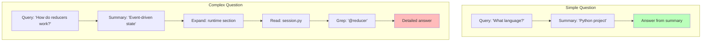

# Chapter 16: Recipes

This chapter provides opinionated, production-ready patterns for building common agent types with WINK. Each recipe demonstrates how to combine the primitives you've learned—prompts, tools, sessions, and progressive disclosure—into cohesive agent architectures.

These recipes reflect the "weak incentives" philosophy: reduce surprise, keep state explicit, and make side effects auditable. They're meant to be adapted to your specific needs rather than used as rigid templates.

---

## Overview: Four Agent Patterns

This chapter covers four distinct agent patterns:

1. **Code Review Agent** - Comprehensive example combining workspace digest, planning, sandboxing, and structured output
2. **Repository Q&A Agent** - Efficient knowledge extraction with progressive disclosure
3. **Safe Patch Agent** - Experimental editing with VFS isolation and human-in-the-loop approval
4. **Research Agent** - Deep investigation with progressive source disclosure

Each recipe includes:
- Architecture diagrams showing data flow
- Complete working code examples
- Best practices and pitfalls to avoid
- Cross-references to relevant chapters for deeper learning

---

## 16.1 Code Review Agent

**Goal**: Automatically review code changes in a pull request, providing structured feedback with safety guarantees.

**Key Features**:
- Workspace digest for efficient codebase context
- Planning tools for multi-step review workflow
- Sandbox execution for safe exploration
- Structured output for consistent review format
- Prompt overrides for iterative refinement

### Architecture


### Complete Implementation

See `code_reviewer_example.py` in the repository for a full, runnable example. Here's the core structure:

```python nocheck
from dataclasses import dataclass
from pathlib import Path

from weakincentives.prompt import (
    Prompt, PromptTemplate, MarkdownSection, SectionVisibility
)
from weakincentives.contrib.tools import (
    WorkspaceDigestSection,
    PlanningToolsSection,
    VfsToolsSection,
    PodmanSandboxSection,
    Plan,
)
from weakincentives.runtime import Session, MainLoop, MainLoopRequest
from weakincentives.adapters.openai import OpenAIAdapter

# Define structured output for reviews
@dataclass(slots=True, frozen=True)
class ReviewComment:
    file: str
    line: int
    severity: str  # "info", "warning", "error"
    message: str

@dataclass(slots=True, frozen=True)
class CodeReview:
    summary: str
    comments: tuple[ReviewComment, ...]
    recommendation: str  # "approve", "request_changes", "comment"

# Define input parameters
@dataclass(slots=True, frozen=True)
class ReviewRequest:
    repo_path: str
    changed_files: tuple[str, ...]

# Build the review prompt
template = PromptTemplate[CodeReview](
    ns="code-review",
    key="review-pr",
    name="Code Review Agent",
    sections=(
        MarkdownSection(
            title="Role",
            key="role",
            template=(
                "You are an experienced code reviewer. Your goal is to "
                "identify bugs, security issues, performance problems, "
                "and style violations.\n\n"
                "Follow the plan-based workflow:\n"
                "1. Review the workspace digest to understand the codebase\n"
                "2. Create a plan for reviewing each changed file\n"
                "3. Use VFS tools to read and analyze files\n"
                "4. Optionally run tests in the sandbox\n"
                "5. Provide structured feedback"
            ),
        ),

        # Progressive disclosure: workspace context
        WorkspaceDigestSection(
            key="workspace",
            visibility=SectionVisibility.COLLAPSED,  # Summary by default
        ),

        # Planning tools for structured workflow
        PlanningToolsSection(
            key="planning",
            strategy=PlanningStrategy.LINEAR,
        ),

        # VFS for safe file exploration
        VfsToolsSection(
            key="vfs",
            allow_write=False,  # Read-only for review
        ),

        # Sandbox for test execution
        PodmanSandboxSection(
            key="sandbox",
            config=PodmanSandboxConfig(
                image="python:3.12-slim",
                timeout_seconds=300,
            ),
        ),

        MarkdownSection(
            title="Changed Files",
            key="changed_files",
            template="Files modified in this PR:\n${files_list}",
        ),
    ),
)

def run_review(repo_path: Path, changed_files: list[str]) -> CodeReview:
    """Run code review on changed files."""
    session = Session()

    # Bind parameters
    files_list = "\n".join(f"- {f}" for f in changed_files)
    prompt = Prompt(template).bind(
        ReviewRequest(
            repo_path=str(repo_path),
            changed_files=tuple(changed_files),
        )
    ).bind_singleton("files_list", files_list)

    # Configure adapter
    adapter = OpenAIAdapter(model="gpt-4o")

    # Evaluate
    with prompt.resources:
        response = adapter.evaluate(prompt, session=session)

    if response.output is None:
        raise ValueError("No review output generated")

    return response.output
```

### Execution Flow


### Best Practices

**1. Use Progressive Disclosure**

Don't dump the entire codebase into the prompt. Let the workspace digest provide a summary, and allow the model to expand sections as needed:

```python
WorkspaceDigestSection(
    key="workspace",
    visibility=SectionVisibility.COLLAPSED,
)
```

See [Chapter 10: Progressive Disclosure](10-progressive-disclosure.md) for details.

**2. Enforce Read-Only Access**

For review agents, prevent accidental modifications:

```python
VfsToolsSection(
    key="vfs",
    allow_write=False,  # Critical for safety
)
```

Tool policies are covered in [specs/TOOL_POLICIES.md](../specs/TOOL_POLICIES.md).

**3. Use Planning for Complex Workflows**

Planning tools help the model break down the review into steps:

```python
PlanningToolsSection(
    key="planning",
    strategy=PlanningStrategy.LINEAR,
)
```

See [Chapter 4: Tools](04-tools.md) for planning tool usage.

**4. Sandbox Untrusted Code**

If you need to run code, always use a sandbox:

```python
PodmanSandboxSection(
    key="sandbox",
    config=PodmanSandboxConfig(
        image="python:3.12-slim",
        timeout_seconds=300,
        network_policy=NetworkPolicy.ISOLATED,  # No internet access
    ),
)
```

Sandboxing is detailed in [Chapter 12: Workspace Tools](12-workspace-tools.md).

**5. Iterate with Prompt Overrides**

Use overrides to refine review quality without changing code:

```python
from weakincentives.prompt.overrides import LocalPromptOverridesStore

store = LocalPromptOverridesStore(overrides_dir=Path(".wink/overrides"))
prompt = Prompt(template, overrides_store=store, overrides_tag="latest")
```

See [Chapter 11: Prompt Optimization](11-prompt-optimization.md) for override workflows.

### Common Pitfalls

**Pitfall 1: Too Much Context**

Don't include the entire repository in the prompt. Use workspace digest and let the model request details.

**Pitfall 2: Missing Safety Boundaries**

Always sandbox code execution and disable VFS writes for review-only agents.

**Pitfall 3: Unstructured Output**

Use typed output schemas to ensure consistent review format:

```python
template = PromptTemplate[CodeReview](...)  # Enforces structure
```

---

## 16.2 Repository Q&A Agent

**Goal**: Answer questions about a codebase quickly and accurately without loading the entire repository.

**Key Features**:
- Workspace digest with automatic summarization
- Progressive section expansion
- VFS tools for verification
- Low token usage for simple queries

### Architecture


### Implementation

```python nocheck
from dataclasses import dataclass

from weakincentives.prompt import (
    Prompt, PromptTemplate, MarkdownSection, SectionVisibility
)
from weakincentives.contrib.tools import (
    WorkspaceDigestSection,
    VfsToolsSection,
)
from weakincentives.runtime import Session
from weakincentives.adapters.openai import OpenAIAdapter

@dataclass(slots=True, frozen=True)
class Question:
    query: str
    context: str = ""  # Optional additional context

@dataclass(slots=True, frozen=True)
class Citation:
    file_path: str
    line_number: int | None
    snippet: str

@dataclass(slots=True, frozen=True)
class Answer:
    summary: str
    explanation: str
    citations: tuple[Citation, ...]
    confidence: str  # "high", "medium", "low"

template = PromptTemplate[Answer](
    ns="repo-qa",
    key="answer-question",
    name="Repository Q&A",
    sections=(
        MarkdownSection(
            title="Role",
            key="role",
            template=(
                "You are a repository expert. Answer questions about this "
                "codebase accurately and cite your sources.\n\n"
                "Workflow:\n"
                "1. Start with the workspace digest summary\n"
                "2. Use read_section to explore relevant areas\n"
                "3. Use grep to find specific implementations\n"
                "4. Use read_file to verify details\n"
                "5. Provide answer with file/line citations"
            ),
        ),

        # Workspace context - collapsed by default
        WorkspaceDigestSection(
            key="workspace",
            visibility=SectionVisibility.COLLAPSED,
        ),

        # VFS tools for verification
        VfsToolsSection(
            key="vfs",
            allow_write=False,
        ),

        MarkdownSection(
            title="Question",
            key="question",
            template="**Query**: ${query}\n\n${context}",
        ),
    ),
)

def answer_question(repo_path: str, query: str, context: str = "") -> Answer:
    """Answer a question about the repository."""
    session = Session()

    prompt = Prompt(template).bind(Question(query=query, context=context))

    adapter = OpenAIAdapter(model="gpt-4o-mini")

    with prompt.resources:
        response = adapter.evaluate(prompt, session=session)

    if response.output is None:
        raise ValueError("No answer generated")

    return response.output

# Example usage
if __name__ == "__main__":
    answer = answer_question(
        repo_path="/path/to/repo",
        query="How does the session state management work?",
        context="I'm particularly interested in reducers and events",
    )

    print(f"Summary: {answer.summary}")
    print(f"Confidence: {answer.confidence}")
    print(f"\nExplanation:\n{answer.explanation}")
    print(f"\nCitations:")
    for cite in answer.citations:
        print(f"- {cite.file_path}:{cite.line_number or '?'}")
```

### Token Efficiency

The key to efficiency is progressive disclosure:



Simple questions are answered from the summary alone (low tokens). Complex questions trigger progressive expansion (higher tokens, but still efficient).

### Best Practices

**1. Collapsed Workspace by Default**

```python
WorkspaceDigestSection(
    key="workspace",
    visibility=SectionVisibility.COLLAPSED,
)
```

This shows a summary initially. The model can call `read_section` to expand areas of interest.

**2. Read-Only Access**

Q&A agents should never modify files:

```python
VfsToolsSection(
    key="vfs",
    allow_write=False,
)
```

**3. Require Citations**

Force the model to cite sources in the output schema:

```python
@dataclass(slots=True, frozen=True)
class Answer:
    citations: tuple[Citation, ...]  # Required field
```

**4. Confidence Scoring**

Include a confidence field to help users assess answer reliability:

```python
confidence: str  # "high", "medium", "low"
```

### Example Session Flow


For more on progressive disclosure patterns, see [Chapter 10](10-progressive-disclosure.md).

---

## 16.3 Safe Patch Agent

**Goal**: Generate code patches without risk of uncontrolled writes to the host filesystem.

**Key Features**:
- VFS for isolated experimentation
- Diff generation as structured output
- Optional sandbox testing before approval
- Human-in-the-loop review

### Architecture


### Implementation

```python nocheck
from dataclasses import dataclass
from pathlib import Path

from weakincentives.prompt import (
    Prompt, PromptTemplate, MarkdownSection
)
from weakincentives.contrib.tools import (
    VfsToolsSection,
    PodmanSandboxSection,
    PlanningToolsSection,
    PlanningStrategy,
    PodmanSandboxConfig,
)
from weakincentives.runtime import Session
from weakincentives.adapters.openai import OpenAIAdapter

@dataclass(slots=True, frozen=True)
class PatchRequest:
    issue_description: str
    target_files: tuple[str, ...]

@dataclass(slots=True, frozen=True)
class FileChange:
    path: str
    diff: str  # Unified diff format
    reason: str

@dataclass(slots=True, frozen=True)
class Patch:
    summary: str
    changes: tuple[FileChange, ...]
    test_results: str
    safety_notes: str

template = PromptTemplate[Patch](
    ns="patch-gen",
    key="safe-patch",
    name="Safe Patch Generator",
    sections=(
        MarkdownSection(
            title="Role",
            key="role",
            template=(
                "You are a careful code editor. Generate patches to fix issues.\n\n"
                "CRITICAL: All edits happen in the VFS (virtual filesystem). "
                "Your edits do NOT affect the host filesystem.\n\n"
                "Workflow:\n"
                "1. Create a plan\n"
                "2. Read relevant files from VFS\n"
                "3. Make edits using VFS write_file\n"
                "4. Run tests in the sandbox\n"
                "5. Generate unified diffs for each change\n"
                "6. Output structured patch for human review"
            ),
        ),

        PlanningToolsSection(
            key="planning",
            strategy=PlanningStrategy.LINEAR,
        ),

        # VFS with write enabled (safe because it's isolated)
        VfsToolsSection(
            key="vfs",
            allow_write=True,  # OK because VFS is isolated
        ),

        # Sandbox for testing
        PodmanSandboxSection(
            key="sandbox",
            config=PodmanSandboxConfig(
                image="python:3.12-slim",
                timeout_seconds=300,
            ),
        ),

        MarkdownSection(
            title="Issue",
            key="issue",
            template=(
                "**Issue**: ${issue_description}\n\n"
                "**Target Files**: ${target_files_list}"
            ),
        ),
    ),
)

def generate_patch(
    repo_path: Path,
    issue: str,
    target_files: list[str],
) -> Patch:
    """Generate a safe patch for the issue."""
    session = Session()

    files_list = "\n".join(f"- {f}" for f in target_files)

    prompt = Prompt(template).bind(
        PatchRequest(
            issue_description=issue,
            target_files=tuple(target_files),
        )
    ).bind_singleton("target_files_list", files_list)

    adapter = OpenAIAdapter(model="gpt-4o")

    with prompt.resources:
        response = adapter.evaluate(prompt, session=session)

    if response.output is None:
        raise ValueError("No patch generated")

    return response.output

def apply_patch_with_review(patch: Patch, repo_path: Path) -> None:
    """Apply patch after human review."""
    print(f"Patch Summary: {patch.summary}\n")
    print(f"Test Results: {patch.test_results}\n")
    print(f"Safety Notes: {patch.safety_notes}\n")

    for change in patch.changes:
        print(f"\n=== {change.path} ===")
        print(f"Reason: {change.reason}")
        print(f"\n{change.diff}")

    response = input("\nApply this patch? [y/N]: ")

    if response.lower() == 'y':
        # Apply diffs to actual files
        for change in patch.changes:
            target = repo_path / change.path
            # Use `patch` command or git apply
            print(f"Applied {change.path}")
    else:
        print("Patch rejected")

# Example usage
if __name__ == "__main__":
    patch = generate_patch(
        repo_path=Path("/path/to/repo"),
        issue="Fix type hint in Session.dispatch method",
        target_files=["src/weakincentives/runtime/session.py"],
    )

    apply_patch_with_review(patch, Path("/path/to/repo"))
```

### Safety Guarantees


The key safety property: **the agent can never directly modify host files**. All edits happen in the VFS, and humans review diffs before applying them.

### Best Practices

**1. Enable VFS Writes Safely**

VFS writes are safe because the VFS is isolated:

```python
VfsToolsSection(
    key="vfs",
    allow_write=True,  # Safe in VFS
)
```

See [Chapter 12: Workspace Tools](12-workspace-tools.md) for VFS details.

**2. Always Test Before Output**

Run tests in the sandbox before generating the patch:

```python
PodmanSandboxSection(
    key="sandbox",
    config=PodmanSandboxConfig(
        image="python:3.12-slim",
        timeout_seconds=300,
    ),
)
```

**3. Require Unified Diffs**

Include diffs in the output schema:

```python
@dataclass(slots=True, frozen=True)
class FileChange:
    diff: str  # Unified diff format required
```

**4. Human-in-the-Loop**

Never auto-apply patches. Always show diffs to humans first:

```python
def apply_patch_with_review(patch: Patch, repo_path: Path) -> None:
    # Show diffs
    # Request approval
    # Apply only if approved
```

---

## 16.4 Research Agent with Progressive Disclosure

**Goal**: Answer deep questions by progressively exploring sources without overwhelming the context window.

**Key Features**:
- Sources stored as summarized sections
- On-demand expansion via `read_section`
- Automatic citation tracking
- Session audit trail

### Architecture


### Implementation

```python nocheck
from dataclasses import dataclass
from pathlib import Path

from weakincentives.prompt import (
    Prompt, PromptTemplate, MarkdownSection, SectionVisibility, Section
)
from weakincentives.runtime import Session
from weakincentives.adapters.openai import OpenAIAdapter

@dataclass(slots=True, frozen=True)
class ResearchQuery:
    question: str
    focus_areas: tuple[str, ...] = ()

@dataclass(slots=True, frozen=True)
class SourceCitation:
    source_id: str
    source_title: str
    relevant_excerpt: str

@dataclass(slots=True, frozen=True)
class ResearchAnswer:
    answer: str
    key_findings: tuple[str, ...]
    citations: tuple[SourceCitation, ...]
    confidence: str

def create_source_section(
    source_id: str,
    title: str,
    summary: str,
    full_text: str,
) -> Section:
    """Create a collapsible section for one source."""
    return MarkdownSection(
        title=f"Source: {title}",
        key=f"source-{source_id}",
        template=(
            f"**Summary**: {summary}\n\n"
            f"<details>\n<summary>Full Text</summary>\n\n"
            f"{full_text}\n\n</details>"
        ),
        visibility=SectionVisibility.COLLAPSED,
    )

def build_research_prompt(
    query: str,
    sources: list[dict[str, str]],
) -> PromptTemplate[ResearchAnswer]:
    """Build a prompt with progressive source disclosure."""

    # Create a section for each source
    source_sections = tuple(
        create_source_section(
            source_id=s["id"],
            title=s["title"],
            summary=s["summary"],
            full_text=s["full_text"],
        )
        for s in sources
    )

    template = PromptTemplate[ResearchAnswer](
        ns="research",
        key="deep-research",
        name="Research Agent",
        sections=(
            MarkdownSection(
                title="Role",
                key="role",
                template=(
                    "You are a research assistant. Answer questions by "
                    "synthesizing information from multiple sources.\n\n"
                    "Workflow:\n"
                    "1. Review source summaries\n"
                    "2. Use read_section to expand relevant sources\n"
                    "3. Synthesize findings\n"
                    "4. Cite sources with specific excerpts"
                ),
            ),

            MarkdownSection(
                title="Sources",
                key="sources-intro",
                template=(
                    f"You have {len(sources)} sources available. "
                    "Each shows a summary by default. Use read_section to "
                    "expand sources that seem relevant."
                ),
            ),

            # Add all source sections (collapsed by default)
            *source_sections,

            MarkdownSection(
                title="Research Query",
                key="query",
                template="**Question**: ${question}",
            ),
        ),
    )

    return template

def research_question(
    question: str,
    sources: list[dict[str, str]],
) -> ResearchAnswer:
    """Research a question using progressive source disclosure."""
    session = Session()

    template = build_research_prompt(question, sources)
    prompt = Prompt(template).bind(ResearchQuery(question=question))

    adapter = OpenAIAdapter(model="gpt-4o")

    with prompt.resources:
        response = adapter.evaluate(prompt, session=session)

    if response.output is None:
        raise ValueError("No answer generated")

    # Session log shows which sources were expanded
    return response.output

# Example usage
if __name__ == "__main__":
    sources = [
        {
            "id": "paper-1",
            "title": "Attention Is All You Need",
            "summary": "Introduces the Transformer architecture for NLP",
            "full_text": "... (full paper text) ...",
        },
        {
            "id": "paper-2",
            "title": "BERT: Pre-training of Deep Bidirectional Transformers",
            "summary": "Bidirectional pre-training for language understanding",
            "full_text": "... (full paper text) ...",
        },
        # ... more sources
    ]

    answer = research_question(
        question="How does self-attention differ from traditional attention mechanisms?",
        sources=sources,
    )

    print(f"Answer: {answer.answer}\n")
    print("Key Findings:")
    for finding in answer.key_findings:
        print(f"- {finding}")
    print("\nCitations:")
    for cite in answer.citations:
        print(f"- {cite.source_title}: {cite.relevant_excerpt[:100]}...")
```

### Progressive Disclosure in Action


The session log shows exactly which sources were consulted, making the research process auditable.

### Token Efficiency Comparison


Progressive disclosure can reduce token usage by 50-90% while maintaining answer quality.

### Best Practices

**1. Meaningful Summaries**

Write summaries that help the model decide which sources to expand:

```python
summary="Introduces the Transformer architecture for NLP"  # Good
summary="A paper about transformers"  # Too vague
```

**2. Collapsed by Default**

```python
visibility=SectionVisibility.COLLAPSED
```

This ensures sources start as summaries.

**3. Audit Trail**

The session log automatically tracks which sources were expanded:

```python
# Later, inspect session
expanded_sources = [
    event for event in session.events
    if event.type == "SectionExpanded"
]
```

**4. Citation Requirements**

Force specific citations in the output:

```python
@dataclass(slots=True, frozen=True)
class SourceCitation:
    source_id: str  # Required
    relevant_excerpt: str  # Must include excerpt
```

For more on progressive disclosure patterns, see [Chapter 10](10-progressive-disclosure.md).

---

## Summary

These four recipes demonstrate core WINK patterns:

| Recipe | Key Pattern | Chapter Reference |
|--------|-------------|-------------------|
| Code Review | Planning + Workspace Digest + Sandboxing | [Ch 4](04-tools.md), [Ch 10](10-progressive-disclosure.md), [Ch 12](12-workspace-tools.md) |
| Repo Q&A | Progressive Disclosure + VFS Search | [Ch 10](10-progressive-disclosure.md), [Ch 12](12-workspace-tools.md) |
| Safe Patch | VFS Isolation + Human Review | [Ch 12](12-workspace-tools.md) |
| Research | Progressive Source Expansion + Citations | [Ch 10](10-progressive-disclosure.md) |

All recipes share these principles:

- **Typed contracts** for inputs and outputs
- **Explicit state** via sessions
- **Progressive disclosure** for efficiency
- **Safety boundaries** at tool/execution layers
- **Auditability** through event logs

Adapt these patterns to your specific needs. The goal is to demonstrate composable building blocks, not rigid templates.

---

**Next**, [Chapter 17: Troubleshooting](17-troubleshooting.md) covers common errors and how to diagnose them systematically.
