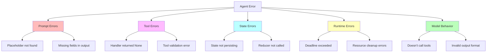
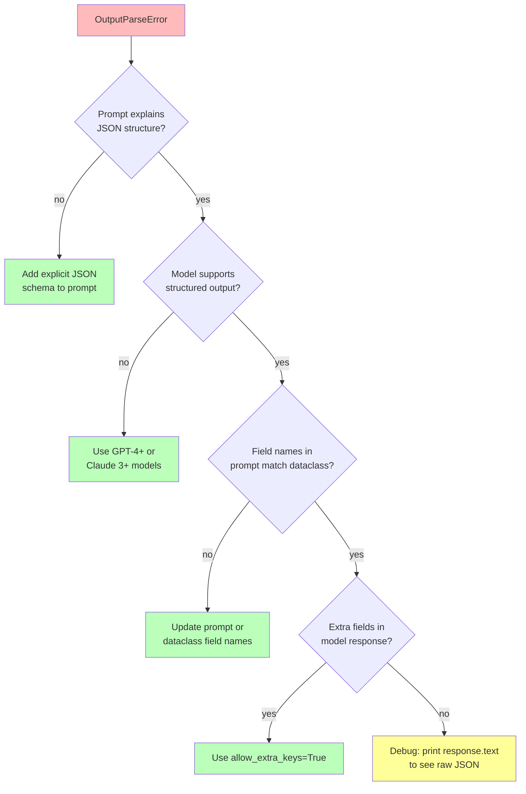
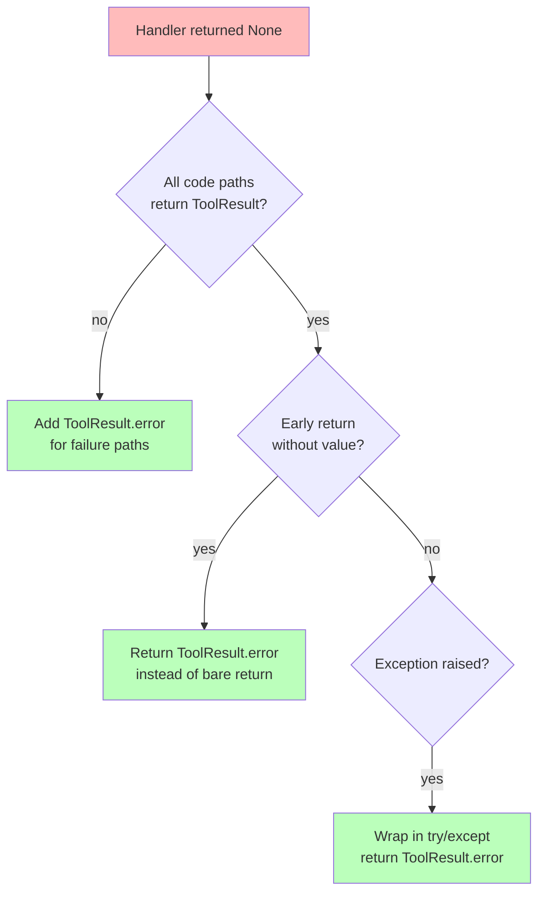
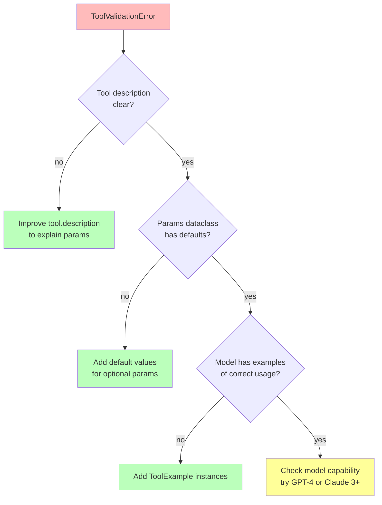
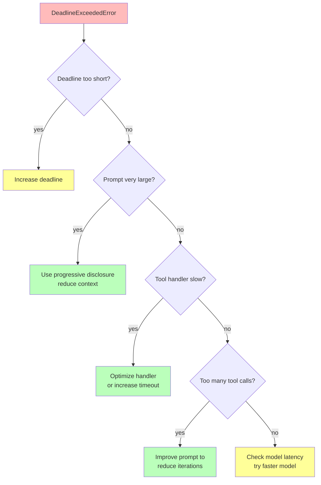
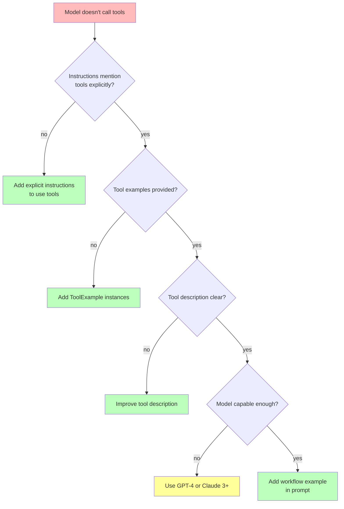
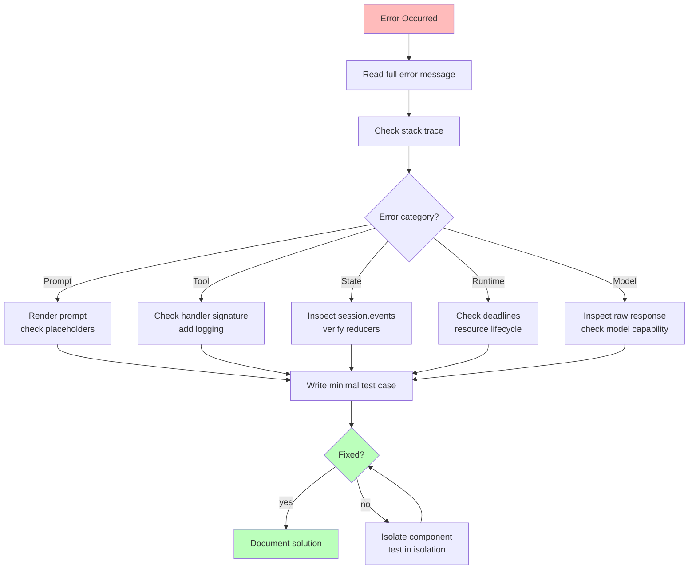

# Chapter 17: Troubleshooting

This chapter covers common errors you'll encounter when building WINK agents and provides systematic approaches to diagnosing and fixing them. Each issue includes diagnostic flowcharts, concrete solutions, and references to relevant chapters for deeper understanding.

The goal is to help you move from "it's broken" to "I know exactly what's wrong and how to fix it" as quickly as possible.

______________________________________________________________________

## Overview: Common Error Categories

WINK errors typically fall into these categories:



Let's address each category systematically.

______________________________________________________________________

## Prompt Errors

### "PromptValidationError: placeholder not found"

**Symptom**: You get an error that a placeholder like `${foo}` wasn't found during prompt rendering.

**Root Cause**: Your template uses `${foo}` but no bound dataclass has a `foo` field.

#### Diagnostic Flowchart

```mermaid
graph TB
    Start[PromptValidationError]
    Start --> Check1{Template has ${foo}?}

    Check1 -->|yes| Check2{Dataclass has 'foo' field?}
    Check1 -->|no| Fix1[Remove placeholder<br/>from template]

    Check2 -->|yes| Check3{Dataclass is bound?}
    Check2 -->|no| Fix2[Add 'foo: str' field<br/>to dataclass]

    Check3 -->|yes| Check4{Field name matches exactly?}
    Check3 -->|no| Fix3[Call prompt.bind]

    Check4 -->|yes| Fix4[Check for typos<br/>placeholders are case-sensitive]
    Check4 -->|no| Fix5[Rename field to match<br/>placeholder exactly]

    style Start fill:#fbb
    style Fix1 fill:#bfb
    style Fix2 fill:#bfb
    style Fix3 fill:#bfb
    style Fix4 fill:#ff9
    style Fix5 fill:#bfb
```

#### Solution: Match Field Names to Placeholders

Placeholders are case-sensitive and must match field names exactly:

```python
# Wrong: placeholder is ${query}, field is question
@dataclass(slots=True, frozen=True)
class Params:
    question: str  # Field name doesn't match placeholder

template = PromptTemplate[Output](
    sections=(
        MarkdownSection(
            template="Answer this: ${query}",  # Placeholder: query
        ),
    ),
)
```

**Fix**: Rename the field to match:

```python
# Right: field name matches placeholder
@dataclass(slots=True, frozen=True)
class Params:
    query: str  # Now matches ${query}

prompt = Prompt(template).bind(Params(query="What is WINK?"))
```

#### Prevention

Use consistent naming conventions:

```python
# Good pattern: name dataclass fields after their semantic meaning
@dataclass(slots=True, frozen=True)
class SummarizeRequest:
    document: str  # Template uses ${document}
    max_bullets: int  # Template uses ${max_bullets}
```

See [Chapter 3: Prompts](03-prompts.md) for parameter binding details.

______________________________________________________________________

### "OutputParseError: missing required field"

**Symptom**: The model's JSON response doesn't match your output dataclass.

**Root Cause**: The model didn't return all required fields, or field names don't match.

#### Diagnostic Flowchart



#### Solution 1: Explicit JSON Instructions

Make sure your prompt clearly describes the expected JSON structure:

```python
@dataclass(slots=True, frozen=True)
class Summary:
    title: str
    bullets: tuple[str, ...]
    word_count: int

template = PromptTemplate[Summary](
    sections=(
        MarkdownSection(
            template=(
                "Summarize the document.\n\n"
                "Return JSON with exactly these fields:\n"
                "- title: string (short title)\n"
                "- bullets: array of strings (3-7 items)\n"
                "- word_count: number (estimated word count)\n"
            ),
        ),
    ),
)
```

The adapter automatically adds JSON schema, but explicit instructions help.

#### Solution 2: Allow Extra Keys

If the model returns extra fields you don't care about:

```python
template = PromptTemplate[Summary](
    ns="docs",
    key="summarize",
    allow_extra_keys=True,  # Ignore extra fields
    sections=(...),
)
```

#### Solution 3: Debug Raw Response

See what the model actually returned:

```python
response = adapter.evaluate(prompt, session=session)

# If parsing failed, response.output is None
if response.output is None:
    print("Raw response:", response.text)
    # Inspect what the model returned
```

#### Prevention

Use clear, explicit field descriptions in your prompt:

```python
template=(
    "Return JSON with:\n"
    "- summary: string (1-2 sentences)\n"
    "- confidence: string (must be 'high', 'medium', or 'low')\n"
    "- sources: array of strings (file paths)\n"
)
```

See [Chapter 3: Prompts](03-prompts.md) for structured output patterns.

______________________________________________________________________

## Tool Errors

### "Tool handler returned None"

**Symptom**: You get an error that a tool handler returned `None`.

**Root Cause**: Tool handlers must return `ToolResult`, not `None`.

#### Solution: Always Return ToolResult

```python
# Wrong: returns None implicitly
def bad_handler(params: Params, *, context: ToolContext) -> ToolResult[Result]:
    if params.value < 0:
        return  # Implicitly returns None - ERROR!

    return ToolResult.ok(Result(...))
```

**Fix**: Always return `ToolResult`, even for errors:

```python
# Right: always returns ToolResult
def good_handler(params: Params, *, context: ToolContext) -> ToolResult[Result]:
    if params.value < 0:
        return ToolResult.error("Value must be non-negative")

    return ToolResult.ok(Result(...), message="Success")
```

#### Diagnostic Checklist



#### Prevention Pattern

Use a consistent handler structure:

```python
def my_handler(params: ParamsType, *, context: ToolContext) -> ToolResult[ResultType]:
    """Tool handler template."""
    try:
        # Validate params
        if not params.is_valid():
            return ToolResult.error("Invalid parameters")

        # Do work
        result = do_work(params)

        # Always return success
        return ToolResult.ok(result, message="Completed successfully")

    except Exception as e:
        # Catch unexpected errors
        return ToolResult.error(f"Unexpected error: {e}")
```

See [Chapter 4: Tools](04-tools.md) for tool handler patterns.

______________________________________________________________________

### "ToolValidationError: schema mismatch"

**Symptom**: The model's tool call parameters don't match your `Params` dataclass.

**Root Cause**: The model called the tool with incorrect parameter types or names.

#### Diagnostic Flowchart



#### Solution: Add Tool Examples

Examples show the model exactly how to call the tool:

```python
from weakincentives.prompt import ToolExample

search_tool = Tool[SearchParams, SearchResult](
    name="search",
    description="Search for files matching a pattern.",
    handler=search_handler,
    examples=(
        ToolExample(
            description="Search for Python files",
            input=SearchParams(pattern="*.py", max_results=10),
            output=SearchResult(files=("main.py", "test.py")),
        ),
        ToolExample(
            description="Search for README files",
            input=SearchParams(pattern="README*", max_results=5),
            output=SearchResult(files=("README.md",)),
        ),
    ),
)
```

#### Solution: Clearer Descriptions

Include parameter details in the description:

```python
Tool[Params, Result](
    name="grep",
    description=(
        "Search file contents for a regex pattern.\n\n"
        "Parameters:\n"
        "- pattern: regex pattern to search for (string)\n"
        "- path: directory to search in (string, optional, defaults to '.')\n"
        "- max_matches: maximum results to return (int, default 100)"
    ),
    handler=grep_handler,
)
```

See [Chapter 4: Tools](04-tools.md) for tool documentation best practices.

______________________________________________________________________

## State Errors

### Session state not persisting

**Symptom**: You dispatch events but the state doesn't change, or changes aren't visible in subsequent queries.

**Root Cause**: Either you're creating multiple session instances, or reducers aren't registered.

#### Diagnostic Flowchart

```mermaid
graph TB
    Start[State not persisting]
    Start --> Check1{Using same<br/>Session instance?}

    Check1 -->|no| Fix1[Store session in variable<br/>reuse for all calls]
    Check1 -->|yes| Check2{Reducer registered?}

    Check2 -->|no| Fix2[Call session[Slice].register]
    Check2 -->|yes| Check3{Reducer returns<br/>SliceOp?}

    Check3 -->|no| Fix3[Return Append or Replace]
    Check3 -->|yes| Check4{Event type matches<br/>reducer signature?}

    Check4 -->|no| Fix4[Fix @reducer decorator<br/>or register call]
    Check4 -->|yes| Fix5[Debug: check session.events]

    style Start fill:#fbb
    style Fix1 fill:#bfb
    style Fix2 fill:#bfb
    style Fix3 fill:#bfb
    style Fix4 fill:#bfb
    style Fix5 fill:#ff9
```

#### Solution 1: Reuse Session Instance

```python
# Wrong: creates new session each time
def process_request(data):
    session = Session()  # New session!
    session.dispatch(AddItem(data))
    # State lost when function returns

# Right: reuse session
session = Session()  # Created once

def process_request(data):
    session.dispatch(AddItem(data))  # Updates shared session
    # State persists
```

#### Solution 2: Register Reducers

Reducers must be registered before dispatching events:

```python
from weakincentives.runtime.session import Append, Replace

@dataclass(frozen=True)
class Item:
    name: str

@dataclass(frozen=True)
class AddItem:
    name: str

# Define reducer
def add_item_reducer(state: SliceView[Item], event: AddItem) -> Append[Item]:
    return Append(Item(name=event.name))

# Register reducer BEFORE dispatching
session[Item].register(AddItem, add_item_reducer)

# Now dispatch works
session.dispatch(AddItem(name="example"))

# Query state
items = session[Item].all()  # Returns tuple of Items
```

#### Solution 3: Use Declarative Reducers

For dataclass-based state, use the `@reducer` decorator:

```python
from weakincentives.runtime.session import reducer, Replace
from dataclasses import replace

@dataclass(frozen=True)
class Counter:
    count: int = 0

    @reducer(on=Increment)
    def increment(self, event: Increment) -> Replace["Counter"]:
        return Replace((replace(self, count=self.count + 1),))

# Initialize
session[Counter].seed(Counter(count=0))

# Dispatch
session.dispatch(Increment())

# Query
counter = session[Counter].latest()
print(counter.count)  # 1
```

#### Debug: Inspect Events

See what events are in the session:

```python
for event in session.events:
    print(f"{event.type}: {event}")

# Or filter by type
add_events = [e for e in session.events if isinstance(e, AddItem)]
```

See [Chapter 5: Sessions](05-sessions.md) for session state management details.

______________________________________________________________________

## Runtime Errors

### "DeadlineExceededError"

**Symptom**: The agent ran past its deadline and was terminated.

**Root Cause**: The agent took longer than the configured deadline, often due to large prompts, slow tool handlers, or too many tool calls.

#### Diagnostic Flowchart



#### Solution 1: Increase Deadline

If the task legitimately needs more time:

```python
from weakincentives.deadlines import Deadline
from datetime import timedelta

deadline = Deadline.from_now(timedelta(minutes=10))  # Increased from 5

response = adapter.evaluate(prompt, session=session, deadline=deadline)
```

#### Solution 2: Reduce Prompt Size

Use progressive disclosure to avoid loading everything upfront:

```python
# Before: everything expanded
WorkspaceDigestSection(
    key="workspace",
    visibility=SectionVisibility.VISIBLE,  # All details upfront
)

# After: collapsed by default
WorkspaceDigestSection(
    key="workspace",
    visibility=SectionVisibility.COLLAPSED,  # Summary only
)
```

See [Chapter 10: Progressive Disclosure](10-progressive-disclosure.md).

#### Solution 3: Optimize Tool Handlers

Profile slow handlers:

```python
import time

def slow_handler(params, *, context):
    start = time.time()

    # Do work
    result = expensive_operation()

    elapsed = time.time() - start
    print(f"Handler took {elapsed:.2f}s")

    return ToolResult.ok(result)
```

Consider:

- Caching repeated operations
- Reducing I/O
- Using async operations (if supported by your adapter)

#### Solution 4: Reduce Tool Iterations

If the model is calling too many tools, improve the prompt:

```python
template=(
    "Plan your approach before acting. Use tools efficiently.\n\n"
    "Bad: Call grep 20 times with different patterns\n"
    "Good: Call grep once with a broad pattern, filter results\n"
)
```

#### Prevention

Set reasonable deadlines based on task complexity:

```python
# Simple Q&A: 1-2 minutes
simple_deadline = Deadline.from_now(timedelta(minutes=2))

# Code review: 5-10 minutes
review_deadline = Deadline.from_now(timedelta(minutes=10))

# Deep research: 15-30 minutes
research_deadline = Deadline.from_now(timedelta(minutes=30))
```

______________________________________________________________________

### Resource cleanup errors

**Symptom**: Errors like "Resource already closed" or "Context manager exited early."

**Root Cause**: Resources weren't properly managed through context managers.

#### Solution: Use Context Managers

Always use `with prompt.resources:` when evaluating prompts that use resources:

```python
# Wrong: resources not managed
prompt = Prompt(template)
response = adapter.evaluate(prompt, session=session)  # May fail

# Right: resources managed
prompt = Prompt(template)
with prompt.resources:
    response = adapter.evaluate(prompt, session=session)  # Resources cleaned up
```

#### For Long-Running Agents

Use the MainLoop, which handles resource lifecycle:

```python
from weakincentives.runtime import MainLoop, MainLoopConfig

config = MainLoopConfig(
    prompt=prompt,
    adapter=adapter,
    # ... other config
)

loop = MainLoop(config, session=session)
loop.run()  # Handles resources automatically
```

See [Chapter 7: Main Loop](07-main-loop.md) for orchestration patterns.

______________________________________________________________________

## Model Behavior Issues

### Model doesn't call tools

**Symptom**: The model sees tools but chooses not to use them, even when they're necessary.

**Root Cause**: Instructions aren't clear enough, or the model doesn't understand when to use tools.

#### Diagnostic Flowchart



#### Solution 1: Explicit Instructions

Tell the model explicitly when and how to use tools:

```python
template=(
    "You are a code reviewer.\n\n"
    "REQUIRED: Use the search tool to find relevant code before reviewing.\n"
    "REQUIRED: Use the read_file tool to see full implementations.\n\n"
    "Workflow:\n"
    "1. Call search to find files related to the change\n"
    "2. Call read_file on each relevant file\n"
    "3. Provide your review\n"
)
```

#### Solution 2: Add Tool Examples

Show the model successful tool usage:

```python
search_tool = Tool[SearchParams, SearchResult](
    name="search",
    description="Find files in the repository",
    handler=search_handler,
    examples=(
        ToolExample(
            description="Find all Python test files",
            input=SearchParams(pattern="test_*.py"),
            output=SearchResult(files=("test_main.py", "test_utils.py")),
        ),
    ),
)
```

#### Solution 3: Show a Complete Example

Include a full example in your prompt:

```python
MarkdownSection(
    title="Example Workflow",
    key="example",
    template=(
        "Example interaction:\n\n"
        "User: Review changes to auth.py\n\n"
        "Assistant:\n"
        "1. I'll search for related files:\n"
        "   [calls search(pattern='auth*.py')]\n"
        "2. I'll read the changed file:\n"
        "   [calls read_file(path='auth.py')]\n"
        "3. Here's my review: ..."
    ),
)
```

#### Prevention

Design prompts with clear tool expectations:

```python
template=(
    "You have access to these tools:\n"
    "- search: Find files (use this FIRST)\n"
    "- read_file: Read file contents (use AFTER search)\n"
    "- grep: Search file contents (use for specific queries)\n\n"
    "Always search before reading. Always verify with grep when unsure."
)
```

See [Chapter 4: Tools](04-tools.md) for tool design patterns.

______________________________________________________________________

### Model returns invalid output format

**Symptom**: The model returns text instead of JSON, or JSON with wrong structure.

**Root Cause**: The model doesn't support structured output, or the schema isn't clear.

#### Solution 1: Verify Model Capability

Use models that support structured output:

```python
# Good: supports structured output
adapter = OpenAIAdapter(model="gpt-4o")

# Bad: older models may not follow schemas
adapter = OpenAIAdapter(model="gpt-3.5-turbo")  # May have issues
```

#### Solution 2: Explicit Schema in Prompt

Even though adapters send JSON schemas, include explicit instructions:

```python
@dataclass(slots=True, frozen=True)
class Review:
    summary: str
    score: int

template = PromptTemplate[Review](
    sections=(
        MarkdownSection(
            template=(
                "Review the code and return JSON.\n\n"
                "Required format:\n"
                "{\n"
                '  "summary": "Brief review summary",\n'
                '  "score": 1-10 (integer)\n'
                "}\n"
            ),
        ),
    ),
)
```

#### Solution 3: Debug Raw Response

Check what the model actually returned:

```python
response = adapter.evaluate(prompt, session=session)

if response.output is None:
    print("Failed to parse. Raw response:")
    print(response.text)
    # Adjust prompt based on what you see
```

______________________________________________________________________

## Debugging Workflows

### Seeing exactly what's in the prompt

Use `prompt.render()` to inspect the final prompt:

```python
prompt = Prompt(template).bind(params)

with prompt.resources:
    rendered = prompt.render(session=session)

print("=== Prompt Text ===")
print(rendered.text)

print("\n=== Tools ===")
for tool in rendered.tools:
    print(f"- {tool.name}: {tool.description}")

print("\n=== Sections ===")
for section in rendered.sections:
    print(f"- {section.title} ({section.visibility})")
```

See [Chapter 3: Prompts](03-prompts.md) for rendering details.

______________________________________________________________________

### Inspecting session state

Query the session to see what happened:

```python
# See all events
for event in session.events:
    print(event)

# Query specific state slice
plans = session[Plan].all()
for plan in plans:
    print(f"Plan: {plan.steps}")

# Check if state exists
if session[Plan].exists():
    latest = session[Plan].latest()
    print(f"Current plan: {latest}")
```

See [Chapter 5: Sessions](05-sessions.md) for session querying.

______________________________________________________________________

### Using the debug UI

For complex debugging, use the WINK debug UI:

```bash
# Install wink CLI
pip install "weakincentives[wink]"

# Save session snapshot
from weakincentives.runtime.debug import dump_session

dump_session(session, path="snapshots/debug.jsonl")

# Launch debug UI
wink debug snapshots/debug.jsonl
```

The debug UI shows:

- Full prompt text
- Tool calls with parameters and results
- Session state over time
- Event timeline

See [specs/WINK_DEBUG.md](../specs/WINK_DEBUG.md) for debug UI details.

______________________________________________________________________

## Quick Reference: Error to Solution

| Error | Quick Fix | Chapter |
|-------|-----------|---------|
| `placeholder not found` | Add matching field to dataclass | [Ch 3](03-prompts.md) |
| `OutputParseError` | Add clear JSON instructions to prompt | [Ch 3](03-prompts.md) |
| `handler returned None` | Always return `ToolResult.ok()` or `.error()` | [Ch 4](04-tools.md) |
| `ToolValidationError` | Add `ToolExample` instances | [Ch 4](04-tools.md) |
| State not persisting | Register reducers before dispatching | [Ch 5](05-sessions.md) |
| `DeadlineExceededError` | Use progressive disclosure, increase deadline | [Ch 10](10-progressive-disclosure.md) |
| Model doesn't call tools | Add explicit instructions, examples | [Ch 4](04-tools.md) |
| Resource cleanup error | Use `with prompt.resources:` | [Ch 5](05-sessions.md) |

______________________________________________________________________

## Systematic Debugging Approach

When you encounter an unfamiliar error, follow this process:



### Key Debugging Tools

**1. Minimal Test Cases**

Isolate the problem:

```python
# Minimal prompt test
def test_prompt_rendering():
    template = PromptTemplate[Output](...)
    prompt = Prompt(template).bind(Params(...))

    with prompt.resources:
        rendered = prompt.render()
        print(rendered.text)  # Inspect output

# Minimal tool test
def test_tool_handler():
    result = my_handler(TestParams(...), context=mock_context)
    assert isinstance(result, ToolResult)
    print(result)
```

**2. Logging**

Enable debug logging:

```python
import logging

logging.basicConfig(level=logging.DEBUG)
logger = logging.getLogger("weakincentives")
logger.setLevel(logging.DEBUG)
```

See [specs/LOGGING.md](../specs/LOGGING.md) for logging configuration.

**3. Session Snapshots**

Save and inspect session state:

```python
from weakincentives.runtime.debug import dump_session, load_session

# Save
dump_session(session, "debug.jsonl")

# Load and inspect
loaded = load_session("debug.jsonl")
print(loaded.events)
```

**4. Interactive Debugging**

Use Python's debugger:

```python
# In your code
import pdb; pdb.set_trace()

# Or use ipdb for better experience
import ipdb; ipdb.set_trace()
```

______________________________________________________________________

## Getting Help

If you're still stuck after trying these solutions:

### Check the Specs

The `specs/` directory has detailed specifications:

- [specs/PROMPTS.md](../specs/PROMPTS.md) - Prompt system details
- [specs/TOOLS.md](../specs/TOOLS.md) - Tool handler contracts
- [specs/SESSIONS.md](../specs/SESSIONS.md) - Session state management
- [specs/MAIN_LOOP.md](../specs/MAIN_LOOP.md) - Main loop orchestration

See [AGENTS.md](../AGENTS.md) for the full spec index.

### Read the Tests

The test suite has examples of correct usage:

```bash
# Find relevant tests
find tests -name "test_*.py" | xargs grep -l "your_topic"

# Read test examples
cat tests/test_prompt.py
```

### File an Issue

If you've found a bug or unclear behavior:

1. Create a minimal reproduction case
1. Include the full error message
1. Share relevant code snippets
1. Describe expected vs actual behavior

______________________________________________________________________

## Summary

Common errors and their solutions:

**Prompt Errors**:

- Match placeholder names to dataclass fields exactly
- Add clear JSON schema descriptions for structured output
- Use `allow_extra_keys=True` if the model adds extra fields

**Tool Errors**:

- Always return `ToolResult`, never `None`
- Add `ToolExample` instances to show correct usage
- Use clear, detailed tool descriptions

**State Errors**:

- Reuse the same `Session` instance
- Register reducers before dispatching events
- Return `Append` or `Replace` from reducers

**Runtime Errors**:

- Use progressive disclosure to reduce token count and latency
- Set appropriate deadlines for task complexity
- Use `with prompt.resources:` for resource management

**Model Behavior**:

- Add explicit instructions to use tools
- Include complete workflow examples
- Use models that support structured output (GPT-4+, Claude 3+)

Remember: most errors are fixable by inspecting the rendered prompt, checking session events, and ensuring type signatures match.

When in doubt, start with a minimal test case and build up complexity incrementally.

______________________________________________________________________

**Congratulations!** You now have a comprehensive guide to building, debugging, and troubleshooting WINK agents. Use this book as a reference as you build real-world agent systems.

For API details, see the complete [API Reference](../llms.md) and the [spec documents](../AGENTS.md) for deep dives into specific subsystems.
