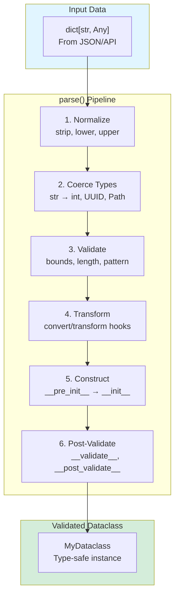

# Chapter 18: API Reference

This is a curated reference of the APIs you'll touch most often. For complete details, read module docstrings and the specs.

## 18.1 Top-level exports

Import from `weakincentives` when you want the "90% API":

**Budgets/time:**

- `Deadline`, `DeadlineExceededError`
- `Budget`, `BudgetTracker`, `BudgetExceededError`

**Prompt primitives:**

- `PromptTemplate`, `Prompt`, `RenderedPrompt`
- `Section`, `MarkdownSection`
- `Tool`, `ToolContext`, `ToolResult`, `ResourceRegistry`
- `SectionVisibility`
- `parse_structured_output`, `OutputParseError`

**Runtime primitives:**

- `Session`, `InProcessDispatcher`
- `MainLoop`, `MainLoopConfig` and loop events (`MainLoopRequest`, `MainLoopCompleted`, `MainLoopFailed`)
- Reducer helpers (`append_all`, `replace_latest`, `upsert_by`, ...)
- Logging helpers (`configure_logging`, `get_logger`)

**Errors:**

- `WinkError`, `ToolValidationError`, snapshot/restore errors

## 18.2 weakincentives.prompt

```python
PromptTemplate[OutputT](ns, key, name=None, sections=..., allow_extra_keys=False)
Prompt(template, overrides_store=None, overrides_tag="latest")
    .bind(*params)
    .render(session=None)
    .find_section(SectionType)

MarkdownSection(title, key, template, summary=None, visibility=..., tools=..., policies=...)
Tool(name, description, handler, examples=...)
ToolResult.ok(value, message="OK")      # success case
ToolResult.error(message)               # failure case
```

**Tool policies:**

- `ToolPolicy`: Protocol for tool invocation constraints
- `SequentialDependencyPolicy(dependencies)`: Enforce tool ordering
- `ReadBeforeWritePolicy()`: Prevent overwrites without reading first

**Progressive disclosure:**

- `VisibilityExpansionRequired`

For detailed explanations of prompt composition and overrides, see:
- [Chapter 2: Prompts](02-prompts.md)
- [Chapter 3: Tools](03-tools.md)
- [Chapter 15: Prompt Optimization](15-prompt-optimization.md)

## 18.3 weakincentives.runtime

```python
Session(bus, tags=None, parent=None)
SessionView(session)                    # Read-only wrapper for reducer contexts
session[Type].all() / latest() / where()
session.dispatch(event)                 # All mutations go through dispatch

# Convenience methods (dispatch events internally)
session[Type].seed(value)               # → InitializeSlice
session[Type].clear()                   # → ClearSlice

# Visibility overrides (in runtime.session)
VisibilityOverrides, SetVisibilityOverride, ClearVisibilityOverride
session.snapshot(include_all=False)
session.restore(snapshot, preserve_logs=True)

# MainLoop configuration
MainLoopConfig(deadline=..., budget=..., resources=...)
MainLoop.execute(request, deadline=..., budget=..., resources=...)
```

**Slice storage (in runtime.session):**

- `SliceView[T]`: Read-only protocol for reducer input
- `Slice[T]`: Mutable protocol for storage operations
- `SliceOp`: Algebraic type (`Append | Extend | Replace | Clear`)
- `InitializeSlice[T]`, `ClearSlice[T]`: System events for slice mutations
- `MemorySlice` / `JsonlSlice`: In-memory and JSONL backends

**Reducers:**

- `append_all`, `replace_latest`, `replace_latest_by`, `upsert_by`
- Reducers receive `SliceView[S]` and return `SliceOp[S]`

**Event bus:**

- `InProcessDispatcher`
- Telemetry events (`PromptRendered`, `ToolInvoked`, `PromptExecuted`, `TokenUsage`)

**Lifecycle management:**

- `Runnable`: Protocol for loops with graceful shutdown (`run()`, `shutdown()`, `running`, `heartbeat`)
- `ShutdownCoordinator.install()`: Singleton for SIGTERM/SIGINT handling
- `LoopGroup(loops, health_port=..., watchdog_threshold=...)`: Run multiple loops with coordinated shutdown, health endpoints, and watchdog monitoring
- `Heartbeat`: Thread-safe timestamp tracker for worker liveness
- `Watchdog`: Daemon thread that monitors heartbeats and terminates on stall
- `HealthServer`: Minimal HTTP server for `/health/live` and `/health/ready`
- `wait_until(predicate, timeout=...)`: Poll predicate with timeout

For detailed explanations of sessions and state management, see:
- [Chapter 4: Sessions](04-sessions.md)
- [Chapter 7: MainLoop](07-main-loop.md)
- [Chapter 12: Lifecycle Management](12-lifecycle.md)

## 18.4 weakincentives.adapters

```python
ProviderAdapter.evaluate(prompt, session=..., deadline=..., budget=..., budget_tracker=...)
PromptResponse(prompt_name, text, output)
PromptEvaluationError
```

**Configs:**

- `OpenAIClientConfig`, `OpenAIModelConfig`
- `LiteLLMClientConfig`, `LiteLLMModelConfig`

**Resources (weakincentives.resources):**

- `Binding[T](protocol, provider, scope=Scope.SINGLETON, eager=False)`
- `Binding.instance(protocol, value)` - bind pre-constructed instance
- `Scope` enum: `SINGLETON`, `TOOL_CALL`, `PROTOTYPE`
- `ResourceRegistry.of(*bindings)` - build registry from bindings
- `ResourceRegistry.merge(base, override)` - combine registries (override wins)
- `ResourceRegistry.conflicts(other)` - return protocols bound in both
- `ResourceRegistry.open()` - context manager for resource lifecycle
- `ScopedResourceContext` - resolution context with lifecycle management
- `Closeable`, `PostConstruct` - lifecycle protocols
- `CircularDependencyError`, `DuplicateBindingError`, `ProviderError`, `UnboundResourceError` - dependency injection errors

**Throttling:**

- `ThrottlePolicy`, `new_throttle_policy`, `ThrottleError`

For detailed explanations of adapters and resources, see:
- [Chapter 5: Provider Adapters](05-adapters.md)
- [Chapter 6: Resource Registry](06-resources.md)

## 18.5 weakincentives.contrib.tools

**Planning:**

- `PlanningToolsSection(session, strategy=..., accepts_overrides=False)`

**Workspace:**

- `VfsToolsSection(session, config=VfsConfig(...), accepts_overrides=False)`
- `HostMount(host_path, mount_path=None, include_glob=(), exclude_glob=())`
- `WorkspaceDigestSection(session, title="Workspace Digest", key="workspace-digest")`

**Sandboxes:**

- `AstevalSection(session, accepts_overrides=False)`
- `PodmanSandboxSection(session, config=PodmanSandboxConfig(...))` (extra)

For detailed explanations of tools, see:
- [Chapter 8: Workspace Tools](08-workspace.md)
- [Chapter 9: Planning Tools](09-planning.md)

## 18.6 weakincentives.optimizers

- `PromptOptimizer` protocol and `BasePromptOptimizer`
- `OptimizationContext`, `OptimizationResult`

**Contrib:**

- `WorkspaceDigestOptimizer`

For detailed explanations of optimization, see:
- [Chapter 15: Prompt Optimization](15-prompt-optimization.md)

## 18.7 weakincentives.serde

Dataclass serialization utilities (no Pydantic required):

```python
from weakincentives.serde import dump, parse, schema, clone

# Serialize a dataclass to a JSON-compatible dict
data = dump(my_dataclass)

# Parse a dict back into a dataclass (with validation)
obj = parse(MyDataclass, {"field": "value"})

# Generate JSON schema for a dataclass
json_schema = schema(MyDataclass)

# Deep copy a frozen dataclass
copy = clone(my_dataclass)
```

**Key behaviors:**

- `parse()` validates required fields and rejects unknown keys by default
- Nested dataclasses are recursively parsed
- `tuple`, `frozenset`, and other immutable collections are handled
- `schema()` produces OpenAI-compatible JSON schemas for structured output

For detailed explanations, see:
- [Chapter 2: Prompts](02-prompts.md) (structured output section)

## 18.8 weakincentives.evals

**Core types:**

```python
Sample[InputT, ExpectedT](id, input, expected)
Dataset[InputT, ExpectedT](samples)
Dataset.load(path, input_type, expected_type)

Score(value, passed, reason="")
EvalResult(sample_id, score, latency_ms, error=None)
EvalReport(results)
    .pass_rate / .mean_score / .mean_latency_ms / .failed_samples()
```

**Evaluators:**

```python
exact_match(output, expected) -> Score
contains(output, expected) -> Score
all_of(*evaluators) -> Evaluator
any_of(*evaluators) -> Evaluator
llm_judge(adapter, criterion) -> Evaluator
adapt(evaluator) -> SessionEvaluator  # Convert standard to session-aware
```

**Session evaluators:**

```text
tool_called(name) -> SessionEvaluator
tool_not_called(name) -> SessionEvaluator
tool_call_count(name, min_count, max_count) -> SessionEvaluator
all_tools_succeeded() -> SessionEvaluator
token_usage_under(max_tokens) -> SessionEvaluator
slice_contains(T, predicate) -> SessionEvaluator
```

**Loop and helpers:**

```text
EvalLoop(loop, evaluator, requests)
    .run(max_iterations=None)

submit_dataset(dataset, requests)
collect_results(results, expected_count, timeout_seconds=300)
```

For detailed explanations of evaluation, see:
- [Chapter 10: Evaluation Framework](10-evals.md)

## 18.9 weakincentives.skills

Agent Skills specification support (following https://agentskills.io):

```python
from weakincentives.skills import (
    Skill,
    SkillMount,
    SkillConfig,
    validate_skill,
    validate_skill_name,
    resolve_skill_name,
    MAX_SKILL_FILE_BYTES,      # 1 MiB
    MAX_SKILL_TOTAL_BYTES,     # 10 MiB
)

# Mount skills for Claude Agent SDK isolation
config = SkillConfig(
    skills=(
        SkillMount(source=Path("./skills/code-review")),
        SkillMount(source=Path("./skills/testing"), enabled=False),
    ),
    validate_on_mount=True,  # Default: validate before copying
)

# Validation functions
validate_skill(Path("./skills/my-skill"))  # Raises SkillValidationError
name = resolve_skill_name(mount)           # Derive name from path
```

**Errors:**

- `SkillError` (base), `SkillValidationError`, `SkillNotFoundError`, `SkillMountError`

For detailed explanations of skills, see:
- [Chapter 11: Agent Skills](11-skills.md)

## 18.10 weakincentives.filesystem

Filesystem protocol and implementations:

```python
from weakincentives.filesystem import (
    Filesystem,                # Protocol for file operations
    SnapshotableFilesystem,    # Extended protocol with snapshot/restore
    HostFilesystem,            # Host filesystem with git-based snapshots
)
# InMemoryFilesystem is in contrib:
# from weakincentives.contrib.tools import InMemoryFilesystem

# Binary operations (new in v0.19.0)
content = fs.read_bytes("image.png", offset=0, limit=1024)
fs.write_bytes("output.bin", b"\x00\x01\x02", mode="overwrite")

# Text operations
result = fs.read("config.json")
fs.write("output.txt", "content", mode="overwrite")

# Search operations
matches = fs.glob("**/*.py")
grep_result = fs.grep("TODO", path="src/", glob="*.py")
```

**Key behaviors:**

- `read_bytes()` supports offset and limit for partial reads
- `write_bytes()` supports "overwrite" and "append" modes
- `read()` raises `ValueError` with actionable message for binary content
- `grep()` silently skips non-UTF-8 files
- UTF-8 paths are now allowed (ASCII-only restriction removed)

For detailed explanations, see:
- [Chapter 8: Workspace Tools](08-workspace.md)

## 18.11 CLI

Installed via the `wink` extra:

```bash
pip install "weakincentives[wink]"
```

**Commands:**

```bash
# Start the debug UI server
wink debug <snapshot_path> [options]

# Access bundled documentation
wink docs --guide       # Print WINK_GUIDE.md
wink docs --reference   # Print llms.md (API reference)
wink docs --specs       # Print all spec files concatenated
wink docs --changelog   # Print CHANGELOG.md
```

**Debug options:**

| Option | Default | Description |
| ------------------- | ----------- | -------------------------------------- |
| `--host` | `127.0.0.1` | Host interface to bind |
| `--port` | `8000` | Port to bind |
| `--open-browser` | `true` | Open browser automatically |
| `--no-open-browser` | - | Disable auto-open |
| `--log-level` | `INFO` | Log verbosity (DEBUG, INFO, etc.) |
| `--json-logs` | `true` | Emit structured JSON logs |
| `--no-json-logs` | - | Emit plain text logs |

**Exit codes:**

- `0`: Success
- `2`: Invalid input (missing file, parse error)
- `3`: Server failed to start

For detailed explanations of debugging, see:
- [Chapter 13: Debugging](13-debugging.md)

## 18.12 Dataclass Utilities and Serialization

> **Canonical Reference**: See [specs/DATACLASSES.md](/specs/DATACLASSES.md) for the complete specification.

WINK provides dependency-free dataclass utilities for serialization, validation, and immutable patterns. These utilities bridge stdlib `dataclasses` with validation without runtime decorators or third-party packages like Pydantic.

### Overview

The dataclass utilities provide three core capabilities:

1. **Serde API** (`parse`, `dump`, `clone`, `schema`) - Serialization and deserialization with validation
2. **FrozenDataclass decorator** - Lightweight immutable dataclasses with pre-construction hooks
3. **Constraint metadata** - Field-level validation via `Annotated` and `field(metadata=...)`



### The Serde API

Import from `weakincentives.serde`:

```python
from weakincentives.serde import parse, dump, clone, schema
```

#### `parse()` - Deserialize with Validation

Parse a dictionary into a dataclass with automatic validation:

```python
from dataclasses import dataclass, field
from typing import Annotated
from uuid import UUID
from weakincentives.serde import parse

@dataclass(slots=True, frozen=True)
class User:
    user_id: UUID = field(metadata={"alias": "id"})
    name: Annotated[str, {"min_length": 1, "strip": True}]
    age: Annotated[int, {"ge": 0, "le": 150}]

# Parse with validation
user = parse(
    User,
    {"id": "a9f95576-8c4a-4b5f-8e5f-9c0d1e2f3a4b", "name": "  Ada  ", "age": 36},
)

# user.name == "Ada" (stripped)
# user.user_id is a UUID instance
```

**Signature:**

```python
parse(
    cls: type[T] | None,
    data: dict[str, Any] | object,
    *,
    extra: Literal["ignore", "forbid", "allow"] = "ignore",
    coerce: bool = True,
    case_insensitive: bool = False,
    alias_generator: Callable[[str], str] | None = None,
    aliases: dict[str, str] | None = None,
    allow_dataclass_type: bool = False,
    type_key: str = "__type__",
) -> T
```

**Key behaviors:**

- **Missing required fields** raise `ValueError("Missing required field: 'field'")`
- **Extras handling**:
  - `"ignore"` (default): Drop unknown keys
  - `"forbid"`: Raise on unknown keys
  - `"allow"`: Attach to `__extras__` dict (or fall back if `slots=True`)
- **Coercion** (enabled by default): Converts strings to numerics, UUID, paths, enums, datetime
- **Alias resolution**: `aliases` arg > `field(metadata={"alias": ...})` > `alias_generator`
- **Validation order**: Normalizers → numeric constraints → length → pattern → membership → validators → `convert`/`transform`
- **Error paths**: Use dotted notation: `"address.street"`, `"items[0].price"`

**Example with nested dataclasses:**

```python
@dataclass(slots=True, frozen=True)
class Address:
    street: str
    city: str
    zipcode: Annotated[str, {"pattern": r"^\d{5}$"}]

@dataclass(slots=True, frozen=True)
class Customer:
    name: str
    address: Address

customer = parse(
    Customer,
    {
        "name": "Alice",
        "address": {
            "street": "123 Main St",
            "city": "Springfield",
            "zipcode": "12345",
        },
    },
)
# Nested dataclasses are recursively parsed
```

#### `dump()` - Serialize to JSON-Safe Dicts

Convert dataclass instances to JSON-compatible dictionaries:

```python
from weakincentives.serde import dump

data = dump(user)
# {"id": "a9f95576-8c4a-4b5f-8e5f-9c0d1e2f3a4b", "name": "Ada", "age": 36}
```

**Signature:**

```python
dump(
    obj: object,
    *,
    by_alias: bool = True,
    exclude_none: bool = False,
    computed: bool = False,
    include_dataclass_type: bool = False,
    type_key: str = "__type__",
    alias_generator: Callable[[str], str] | None = None,
) -> dict[str, Any]
```

**Key behaviors:**

- **Recursion**: Nested dataclasses are recursively serialized
- **Type conversions**:
  - Enums emit values (`.value`)
  - `datetime` uses ISO format (`.isoformat()`)
  - `UUID`, `Decimal`, `Path` stringify
- **Computed properties**: With `computed=True`, materializes `__computed__` properties

**Example with computed properties:**

```python
@dataclass(slots=True, frozen=True)
class Invoice:
    subtotal: int
    tax: int

    @property
    def total(self) -> int:
        return self.subtotal + self.tax

    __computed__ = ("total",)

invoice = Invoice(subtotal=100, tax=10)
dump(invoice, computed=True)
# {"subtotal": 100, "tax": 10, "total": 110}
```

#### `clone()` - Immutable Update Pattern

Wrap `dataclasses.replace` while preserving extras and re-running validation:

```python
from weakincentives.serde import clone

updated_user = clone(user, age=37)
# Returns a new User instance with age=37, re-validates constraints
```

**Use cases:**

- Update frozen dataclasses
- Re-run validation after field changes
- Preserve `__extras__` from `parse(extra="allow")`

#### `schema()` - Generate JSON Schema

Emit JSON Schema for dataclass types:

```python
from weakincentives.serde import schema

user_schema = schema(User)
# Returns JSON Schema dict with inlined nested dataclasses (no $ref)
```

**Key behaviors:**

- Mirrors alias resolution (respects `alias_generator`, field metadata)
- Propagates constraint metadata (`min_length`, `pattern`, etc.)
- Nested dataclasses are inlined (not referenced via `$ref`)

**Example output:**

```python
{
    "type": "object",
    "properties": {
        "id": {"type": "string", "format": "uuid"},
        "name": {"type": "string", "minLength": 1},
        "age": {"type": "integer", "minimum": 0, "maximum": 150},
    },
    "required": ["id", "name", "age"],
}
```

### Constraints and Transforms

Merge keys from `Annotated[..., {...}]` and `field(metadata=...)`:

| Key | Description | Example |
|-----|-------------|---------|
| `ge`, `gt`, `le`, `lt` | Numeric bounds | `Annotated[int, {"ge": 0}]` |
| `minimum`, `maximum` | Alias for `ge`, `le` | `{"minimum": 0}` |
| `exclusiveMinimum`, `exclusiveMaximum` | Alias for `gt`, `lt` | `{"exclusiveMinimum": 0}` |
| `min_length`, `max_length` | String/collection length | `{"min_length": 1}` |
| `minLength`, `maxLength` | Alias for length constraints | `{"minLength": 1}` |
| `pattern`, `regex` | Regex validation | `{"pattern": r"^\d+$"}` |
| `strip`, `lower`, `upper` | String normalizers | `{"strip": True}` |
| `lowercase`, `uppercase` | Alias for `lower`, `upper` | `{"lowercase": True}` |
| `in`, `enum` | Membership inclusion | `{"in": ["a", "b"]}` |
| `not_in` | Membership exclusion | `{"not_in": ["x"]}` |
| `validate` | Single validation callable | `{"validate": lambda x: x > 0}` |
| `validators` | Iterable of validators | `{"validators": [check_email]}` |
| `convert`, `transform` | Final value transformation | `{"convert": str.upper}` |

**Example with multiple constraints:**

```python
@dataclass(slots=True, frozen=True)
class Product:
    sku: Annotated[str, {"pattern": r"^[A-Z]{3}-\d{6}$", "upper": True}]
    price: Annotated[int, {"ge": 0}]
    tags: Annotated[tuple[str, ...], {"min_length": 1}]

product = parse(
    Product,
    {"sku": "abc-123456", "price": 999, "tags": ["electronics"]},
)
# product.sku == "ABC-123456" (uppercased)
```

### Validation Hooks

Dataclasses may define lifecycle hooks:

```python
@dataclass(slots=True, frozen=True)
class Order:
    subtotal: int
    tax: int
    total: int

    def __validate__(self) -> None:
        """Post-construction validation (called after __init__)."""
        if self.total != self.subtotal + self.tax:
            raise ValueError("Total must equal subtotal + tax")

    def __post_validate__(self) -> None:
        """After all fields validated (called by parse)."""
        if self.subtotal < 0:
            raise ValueError("Subtotal must be non-negative")
```

**Hook execution order:**

1. Field normalization (strip, lower, upper)
2. Field coercion (str → int, UUID, etc.)
3. Field validation (bounds, length, pattern)
4. Field transforms (convert/transform)
5. `__pre_init__` (if using `FrozenDataclass`)
6. `__init__`
7. `__validate__` (if defined)
8. `__post_validate__` (if defined by `parse`)

### FrozenDataclass Decorator

Lightweight decorator for immutable dataclasses:

```python
from weakincentives.dataclasses import FrozenDataclass

@FrozenDataclass()
class Config:
    host: str
    port: int = 8080

config = Config(host="localhost")
# config.port = 9000  # Error: frozen dataclass
```

**Defaults applied:**

- `frozen=True` (immutable)
- `slots=True` (memory-efficient)
- `kw_only=False`, `order=False`, `eq=True`, `repr=True`
- `match_args=True`, `unsafe_hash=False`

#### Pre-Construction Hook: `__pre_init__`

Derive fields before `__init__` without mutation:

```python
from weakincentives.dataclasses import FrozenDataclass

@FrozenDataclass()
class Invoice:
    subtotal: int
    tax: int
    total: int

    @classmethod
    def __pre_init__(cls, *, subtotal: int, tax_rate: float = 0.1, **_):
        """Derive fields before __init__."""
        tax = int(subtotal * tax_rate)
        return {
            "subtotal": subtotal,
            "tax": tax,
            "total": subtotal + tax,
        }

    def __post_init__(self) -> None:
        """Validate invariants after __init__."""
        if self.total != self.subtotal + self.tax:
            raise ValueError("Total mismatch")

invoice = Invoice(subtotal=1000, tax_rate=0.24)
# invoice.total == 1240 (derived)
```

**Key behaviors:**

- Runs before `__init__`
- Returns mapping with all required fields
- Enables derivation without `__post_init__` mutation
- Takes `**kwargs` to accept extra parameters (like `tax_rate`)

#### Copy Helpers

Immutable update patterns:

```python
# update(**changes) - Apply field changes
updated = invoice.update(subtotal=1200)

# merge(mapping_or_obj) - Merge from dict or object
merged = invoice.merge({"subtotal": 1200})

# map(transform) - Transform via callable
remapped = invoice.map(lambda f: {"tax": f["subtotal"] * 0.24})
```

**All helpers:**

- Return new instances (immutable)
- Re-run `__post_init__` for invariants
- Raise `TypeError` for unknown fields
- Invoke `__pre_init__` when the class defines non-init fields (so derived fields stay consistent); skip `__pre_init__` for simple all-init dataclasses

**Example:**

```python
@FrozenDataclass()
class Point:
    x: int
    y: int

    def distance_from_origin(self) -> float:
        return (self.x**2 + self.y**2) ** 0.5

p1 = Point(x=3, y=4)
p2 = p1.update(x=5)  # Point(x=5, y=4)
p3 = p1.map(lambda f: {"x": f["x"] * 2, "y": f["y"] * 2})  # Point(x=6, y=8)
```

### Supported Types

The serde utilities support:

- **Dataclasses** (including nested)
- **Primitives**: `str`, `int`, `float`, `bool`, `None`
- **Standard types**: `Enum`, `UUID`, `Path`, `Decimal`
- **Datetime types**: `datetime`, `date`, `time`
- **Collections**: `list`, `set`, `tuple`, `dict`
- **Type hints**: `Literal`, `Union`, `Optional`

**Type coercion examples:**

```python
@dataclass
class Example:
    user_id: UUID
    path: Path
    created_at: datetime
    status: Literal["active", "inactive"]

example = parse(
    Example,
    {
        "user_id": "a9f95576-8c4a-4b5f-8e5f-9c0d1e2f3a4b",  # str → UUID
        "path": "/tmp/file.txt",  # str → Path
        "created_at": "2025-01-09T12:00:00",  # str → datetime
        "status": "active",  # Literal validation
    },
)
```

### Edge Cases and Limitations

**Slots vs extras:**

With `slots=True`, extras fall back to `__extras__` dict:

```python
@dataclass(slots=True, frozen=True)
class Config:
    host: str

config = parse(Config, {"host": "localhost", "port": 8080}, extra="allow")
# config.__extras__ == {"port": 8080}
```

**Empty strings:**

With coercion, empty strings are treated as missing for optional fields:

```python
@dataclass
class User:
    name: str
    email: str | None = None

user = parse(User, {"name": "Alice", "email": ""})
# user.email == None (empty string coerced to None)
```

**Union errors:**

Only the final branch error is surfaced:

```python
@dataclass
class Message:
    payload: int | str

# If "abc" fails int parsing, tries str (succeeds)
msg = parse(Message, {"payload": "abc"})  # OK

# If both fail, only last error shown
msg = parse(Message, {"payload": []})  # Error from str coercion
```

**Datetime parsing:**

Uses `fromisoformat` without timezone coercion. Ensure ISO format:

```python
parse(MyClass, {"created": "2025-01-09T12:00:00"})  # OK
parse(MyClass, {"created": "Jan 9, 2025"})  # Error
```

**Schema reuse:**

Nested dataclasses are inlined, no `$ref`:

```python
@dataclass
class Address:
    street: str

@dataclass
class User:
    address: Address

schema(User)
# Address schema inlined in User schema, not referenced via "$ref"
```

### Limitations

- **No discriminated unions**: Cannot parse union types based on a discriminator field
- **No `$ref` schema components**: Nested schemas are always inlined
- **No assignment-time validation**: Validation only occurs during `parse()`
- **No external parsers**: No support for `dateutil`, `pytz`, etc.
- **Validators may mutate**: Ensure validators return transformed values

### Practical Patterns

**Tool parameters with validation:**

```python
from dataclasses import dataclass
from typing import Annotated
from weakincentives import Tool, ToolContext, ToolResult
from weakincentives.serde import parse

@dataclass(slots=True, frozen=True)
class SearchParams:
    query: Annotated[str, {"min_length": 1, "strip": True}]
    limit: Annotated[int, {"ge": 1, "le": 100}] = 10

def search_handler(params: dict[str, object], *, context: ToolContext) -> ToolResult[list[str]]:
    validated = parse(SearchParams, params)
    results = perform_search(validated.query, limit=validated.limit)
    return ToolResult.ok(results)

search_tool = Tool(
    name="search",
    description="Search the knowledge base",
    handler=search_handler,
)
```

**Session state with immutable updates:**

```python
from weakincentives.dataclasses import FrozenDataclass

@FrozenDataclass()
class AgentState:
    step_count: int = 0
    last_action: str | None = None

# Update immutably
state = AgentState()
state = state.update(step_count=1, last_action="search")
state = state.update(step_count=state.step_count + 1)
```

**Structured output parsing:**

```python
from weakincentives import parse_structured_output

@dataclass(slots=True, frozen=True)
class CodeReview:
    approved: bool
    comments: tuple[str, ...]
    confidence: Annotated[float, {"ge": 0.0, "le": 1.0}]

# Parse model output
response = adapter.evaluate(prompt, session=session)
review = parse_structured_output(CodeReview, response.output)
# Automatic validation via parse()
```

### Cross-References

- [Chapter 3: Prompts](03-prompts.md) - Structured output with prompts
- [Chapter 4: Tools](04-tools.md) - Tool parameter validation
- [Chapter 5: Sessions](05-sessions.md) - Immutable state patterns
- [specs/DATACLASSES.md](/specs/DATACLASSES.md) - Complete specification

---

## Where to go deeper

- **Prompts**: [specs/PROMPTS.md](../specs/PROMPTS.md)
- **Tools**: [specs/TOOLS.md](../specs/TOOLS.md)
- **Tool Policies**: [specs/TOOL_POLICIES.md](../specs/TOOL_POLICIES.md)
- **Sessions**: [specs/SESSIONS.md](../specs/SESSIONS.md)
- **MainLoop**: [specs/MAIN_LOOP.md](../specs/MAIN_LOOP.md)
- **Evals**: [specs/EVALS.md](../specs/EVALS.md)
- **Health & Lifecycle**: [specs/HEALTH.md](../specs/HEALTH.md)
- **Resources**: [specs/RESOURCE_REGISTRY.md](../specs/RESOURCE_REGISTRY.md)
- **Skills**: [specs/SKILLS.md](../specs/SKILLS.md)
- **Filesystem**: [specs/FILESYSTEM.md](../specs/FILESYSTEM.md)
- **Workspace**: [specs/WORKSPACE.md](../specs/WORKSPACE.md)
- **Overrides & optimization**: [specs/PROMPT_OPTIMIZATION.md](../specs/PROMPT_OPTIMIZATION.md)
- **Exhaustiveness checking**: [specs/EXHAUSTIVENESS.md](../specs/EXHAUSTIVENESS.md)
- **Formal verification**: [specs/FORMAL_VERIFICATION.md](../specs/FORMAL_VERIFICATION.md) (embedding TLA+ specs in Python)
- **Code review example**: [guides/code-review-agent.md](../guides/code-review-agent.md)
- **Contributor guide**: [AGENTS.md](../AGENTS.md)
