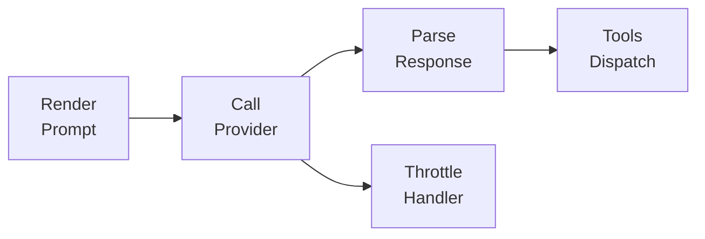
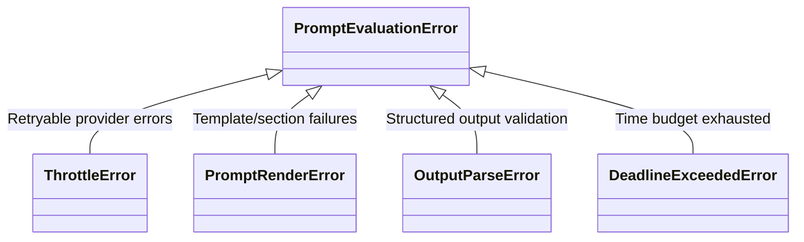

# Provider Adapters Specification

## Purpose

Provider adapters bridge the prompt abstraction and external LLM services. They
handle request formatting, response parsing, rate limiting, and error recovery
so orchestration code remains provider-agnostic. This specification covers the
shared adapter protocol, provider-specific implementations, structured output
handling, and throttling behavior.

## Guiding Principles

- **Provider-agnostic orchestration**: Callers interact with a uniform protocol;
  provider differences stay encapsulated in adapter implementations.
- **Prompt-owned resources**: Adapters access resources via the prompt's
  resource context; no separate resource parameter.
- **Fail predictable**: Errors surface as typed exceptions with enough context
  for callers to retry, degrade, or abort gracefully.
- **Observable by default**: Adapters emit structured events and logs at each
  decision point so operators can trace requests, retries, and failures.
- **Protect upstream health**: Rate limiting is reactive rather than
  pre-emptive; adapters respect provider signals and avoid amplifying overload.

## Adapter Protocol

All adapters implement `ProviderAdapter[ConfigT]`:

```python
class ProviderAdapter(ABC):
    @abstractmethod
    def evaluate(
        self,
        prompt: Prompt[OutputT],
        *,
        session: SessionProtocol,
        deadline: Deadline | None = None,
        budget: Budget | None = None,
        budget_tracker: BudgetTracker | None = None,
    ) -> PromptResponse[OutputT]: ...
```

**Parameters:**

- `prompt` - The prompt to evaluate (must be within context manager)
- `session` - Session for state management
- `deadline` - Optional wall-clock deadline
- `budget` - Optional token/time budget limits
- `budget_tracker` - Optional shared tracker for budget consumption

**Notes:**

- Telemetry is published via `session.dispatcher`.
- Visibility overrides are managed via session state (`VisibilityOverrides`),
  not passed to adapters directly.
- Resources are accessed via `prompt.resources`; the prompt must be within its
  context manager.

### Configuration

Adapters use frozen dataclass configurations for type-safe instantiation:

```python
@FrozenDataclass()
class LLMConfig:
    """Base configuration for LLM model parameters."""
    temperature: float | None = None
    max_tokens: int | None = None
    top_p: float | None = None
    presence_penalty: float | None = None
    frequency_penalty: float | None = None
    stop: tuple[str, ...] | None = None
    seed: int | None = None
```

Provider-specific configs extend this base with additional fields. Only non-None
fields are included in request payloads.

### Lifecycle

1. **Validate context** - Verify prompt is within its context manager
1. **Render** - Call `prompt.render()` to produce a `RenderedPrompt` with
   markdown text, tools, and structured output metadata.
1. **Format** - Convert the rendered prompt into the provider wire format.
1. **Call** - Issue the provider request with throttle protection and deadline
   checks.
1. **Parse** - Extract assistant content and dispatch tool calls.
1. **Emit** - Publish `PromptRendered` and `PromptExecuted` events to
   `session.dispatcher`.

## Resource Access

Adapters access resources through the prompt's resource context:

```python
def evaluate(
    self,
    prompt: Prompt[OutputT],
    *,
    session: SessionProtocol,
    deadline: Deadline | None = None,
    budget_tracker: BudgetTracker | None = None,
) -> PromptResponse[OutputT]:
    # Access resources via prompt
    fs = prompt.resources.get(Filesystem)

    # Build tool context with prompt's resources
    tool_context = ToolContext(
        prompt=prompt,
        rendered_prompt=rendered,
        adapter=self,
        session=session,
        deadline=deadline,
        budget_tracker=budget_tracker,
    )
```

The prompt must be within its context manager when `evaluate()` is called.
Accessing `prompt.resources` outside the context raises `RuntimeError`.

## Provider Implementations

### OpenAI Adapter

`OpenAIAdapter` targets the OpenAI Responses API via the official SDK.

```python
from weakincentives.adapters.openai import OpenAIAdapter, OpenAIClientConfig, OpenAIModelConfig

client_config = OpenAIClientConfig(api_key="sk-...", timeout=30.0)
model_config = OpenAIModelConfig(temperature=0.7, max_tokens=1024)

adapter = OpenAIAdapter(
    model="gpt-4o",
    client_config=client_config,
    model_config=model_config,
)
```

**Configuration:**

| Field | Type | Description |
| -------------- | --------------- | --------------------------- |
| `api_key` | `str \| None` | API key (falls back to env) |
| `base_url` | `str \| None` | Custom API endpoint |
| `organization` | `str \| None` | Organization ID |
| `timeout` | `float \| None` | Request timeout seconds |
| `max_retries` | `int \| None` | SDK-level retries |

**Model Parameters (OpenAIModelConfig):**

| Field | Type | Description |
| --------------------- | -------------- | ------------------------- |
| `logprobs` | `bool \| None` | Return log probabilities |
| `top_logprobs` | `int \| None` | Number of top logprobs |
| `parallel_tool_calls` | `bool \| None` | Allow parallel tool calls |
| `store` | `bool \| None` | Store conversation |
| `user` | `str \| None` | End-user identifier |

**Constructor Parameters:**

| Parameter | Type | Default | Description |
| --------------- | ---------------------------- | ---------- | ---------------- |
| `model` | `str` | required | Model identifier |
| `client_config` | `OpenAIClientConfig \| None` | `None` | Client settings |
| `model_config` | `OpenAIModelConfig \| None` | `None` | Model parameters |

Note: `max_tokens` is renamed to `max_output_tokens` for Responses API. The
Responses API does not accept `seed`, `stop`, `presence_penalty`, or
`frequency_penalty`; supplying these raises `ValueError` at construction.

**Structured Output:**

When a prompt declares structured output, the adapter uses OpenAI's native
JSON schema response format. The adapter sets `response_format.type = "json_schema"`
with the dataclass schema. The provider enforces structure at generation time
and returns a `.parsed` payload.

### LiteLLM Adapter

`LiteLLMAdapter` provides access to 100+ providers through LiteLLM.

```python
from weakincentives.adapters.litellm import LiteLLMAdapter, LiteLLMClientConfig, LiteLLMModelConfig

completion_config = LiteLLMClientConfig(api_key="...", timeout=60.0)
model_config = LiteLLMModelConfig(temperature=0.5, max_tokens=2048)

adapter = LiteLLMAdapter(
    model="anthropic/claude-3-opus",
    completion_config=completion_config,
    model_config=model_config,
)
```

**Constructor Parameters:**

| Parameter | Type | Default | Description |
| -------------------- | ----------------------------- | ---------- | ------------------------- |
| `model` | `str` | required | Model identifier |
| `completion_config` | `LiteLLMClientConfig \| None` | `None` | Client settings |
| `model_config` | `LiteLLMModelConfig \| None` | `None` | Model parameters |
| `completion` | `LiteLLMCompletion \| None` | `None` | Pre-configured completion |
| `completion_factory` | `Callable \| None` | `None` | Factory for completions |
| `completion_kwargs` | `Mapping \| None` | `None` | Extra completion kwargs |

**Configuration:**

| Field | Type | Description |
| ------------- | --------------- | ----------------------- |
| `api_key` | `str \| None` | Provider API key |
| `api_base` | `str \| None` | Custom API endpoint |
| `timeout` | `float \| None` | Request timeout seconds |
| `num_retries` | `int \| None` | LiteLLM-level retries |

**Constraints and Caveats:**

- Tool calling, structured output, and streaming support varies by underlying
  provider.
- LiteLLM exceptions are normalized to `ThrottleError` or
  `PromptEvaluationError`.
- Token counting uses LiteLLM's estimation which may differ from actuals.
- Structured outputs always set `require_structured_output_text=True` because
  LiteLLM does not return structured `.parsed` payloads.

## Rate Limiting and Throttling

Adapters implement reactive throttling to protect upstream services.

### Throttle Policy

```python
from weakincentives.adapters.shared import ThrottlePolicy, new_throttle_policy
from datetime import timedelta

policy = new_throttle_policy(
    max_attempts=5,
    base_delay=timedelta(milliseconds=500),
    max_delay=timedelta(seconds=8),
    max_total_delay=timedelta(seconds=30),
)
```

| Field | Default | Description |
| ----------------- | ------- | ------------------------ |
| `max_attempts` | `5` | Maximum retry attempts |
| `base_delay` | `500ms` | Initial backoff delay |
| `max_delay` | `8s` | Cap on individual delays |
| `max_total_delay` | `30s` | Total time budget |

### Signal Classification

| Signal | Examples | Behavior |
| ------------------ | -------------------------- | ------------------------- |
| **Rate limit** | HTTP 429, `RateLimitError` | Retry with backoff |
| **Quota exhaustion** | `insufficient_quota` | Longer backoff, alerting |
| **Timeout** | Connection/read timeout | Retry if deadline permits |
| **Server error** | HTTP 500-503 | Retry with backoff |

### Backoff Strategy

- **Exponential with jitter**: Delays double from base, capped at max, with full
  jitter to avoid thundering herd.
- **Retry-After respect**: Provider-supplied values set the minimum delay.
- **Deadline awareness**: Retries abort early if remaining time is insufficient.
- **No pre-send shaping**: Requests are never altered before hitting the
  provider; all mitigation is reactive.

### ThrottleError

```python
@dataclass(slots=True)
class ThrottleDetails:
    kind: ThrottleKind  # rate_limit, quota_exhausted, timeout, unknown
    retry_after: timedelta | None
    attempts: int
    retry_safe: bool
    provider_payload: dict[str, Any] | None

@dataclass(slots=True)
class ThrottleError(PromptEvaluationError):
    details: ThrottleDetails

    # Properties provide access to details fields
    @property
    def kind(self) -> ThrottleKind: ...
    @property
    def retry_after(self) -> timedelta | None: ...
    @property
    def attempts(self) -> int: ...
    @property
    def retry_safe(self) -> bool: ...
```

## Inner Loop Architecture

The shared `InnerLoop` drives the request/response cycle:



1. **Render** - Produce `RenderedPrompt` from prompt + params.
1. **Publish `PromptRendered`** - Emit event with namespace, key, adapter label,
   and rendered markdown.
1. **Prepare tools** - Convert tools to provider-agnostic JSON schemas via
   `tool_to_spec`.
1. **Call provider** - Build chat payload and invoke provider callable. Failures
   wrap in `PromptEvaluationError` with `phase="request"`.
1. **Handle tool calls** - Execute handlers via `ToolExecutor`, emit
   `ToolInvoked` events, collect results.
1. **Loop** - Repeat until a message arrives without tool calls.
1. **Parse output** - Extract structured output from `.parsed` or text.
1. **Publish `PromptExecuted`** - Emit final response event.

### Tool Execution

`ToolExecutor` owns tool scheduling, argument parsing, and event publication:

- Arguments are decoded via `parse_tool_arguments` (JSON objects with string
  keys).
- Dataclass parsing uses `serde.parse`. Validation errors produce
  `ToolResult(success=False)` rather than raising.
- `ToolContext` exposes prompt, adapter, session, and deadline. Tool handlers
  access resources via `context.prompt.resources`.
- Handlers run synchronously. Exceptions are logged and converted to failed
  results.
- Before tool execution, the adapter captures snapshots of both session and
  prompt resources. On failure, both are restored.

### Transactional Tool Execution

Tool execution is transactional. Failed or aborted tools leave no trace in
mutable state. The `runtime.transactions` module provides the snapshot/restore
primitives:

```python
from weakincentives.runtime.transactions import (
    create_snapshot,
    restore_snapshot,
    tool_transaction,
)

def _execute_tool(
    self,
    tool: Tool,
    params: dict,
    *,
    prompt: Prompt,
    session: Session,
) -> ToolResult:
    # Snapshot both session and resources before execution
    snapshot = create_snapshot(session, prompt.resources.context, tag=tool.name)

    try:
        context = ToolContext(
            prompt=prompt,
            rendered_prompt=self._rendered,
            adapter=self,
            session=session,
            deadline=self._deadline,
            budget_tracker=self._budget_tracker,
        )
        result = tool.handler(params, context=context)

        if not result.success:
            # Restore on failure
            restore_snapshot(session, prompt.resources.context, snapshot)

        return result

    except VisibilityExpansionRequired:
        # Restore and re-raise for retry
        restore_snapshot(session, prompt.resources.context, snapshot)
        raise

    except Exception as e:
        # Restore on exception
        restore_snapshot(session, prompt.resources.context, snapshot)
        return ToolResult(message=str(e), value=None, success=False)
```

Alternatively, use the `tool_transaction` context manager for simpler cases:

```python
with tool_transaction(session, prompt.resources.context, tag=tool.name) as snapshot:
    result = tool.handler(params, context=context)
    if not result.success:
        restore_snapshot(session, prompt.resources.context, snapshot)
```

## Error Handling

### Exception Hierarchy



### Error Propagation

- **Tool failures** - Wrapped in `ToolResult(success=False)` and returned to the
  model; never abort evaluation.
- **Parse failures** - Raise `OutputParseError` with raw response attached.
- **Throttle exhaustion** - Raise `ThrottleError` with `retry_safe=False`.
- **Deadline exceeded** - Raise `DeadlineExceededError` immediately.

## Budget Tracking

Adapters integrate with the budget system for token and time limits:

```python
from weakincentives.budget import Budget, BudgetTracker

budget = Budget(
    deadline=Deadline(expires_at=...),
    max_total_tokens=10000,
    max_input_tokens=8000,
    max_output_tokens=2000,
)

tracker = BudgetTracker(budget)

with prompt.resources:
    response = adapter.evaluate(
        prompt,
        session=session,
        budget=budget,
        budget_tracker=tracker,
    )
```

The adapter records token usage after each provider response and checks limits
at defined checkpoints. Budget tracking is thread-safe for concurrent execution.

## Telemetry

Adapters emit events through `session.dispatcher`:

| Event | When | Payload |
| ---------------- | -------------- | ------------------------ |
| `PromptRendered` | After render | Text, tools, metadata |
| `PromptExecuted` | After parse | Response, tokens, timing |
| `ToolInvoked` | After dispatch | Name, params, result |

Structured logs include:

- `prompt.render.start` / `prompt.render.complete`
- `prompt.call.start` / `prompt.call.complete`
- `prompt.throttled` (on retry)
- `prompt.error` (on failure)

## Implementing New Adapters

1. **Define configuration** - Create `ClientConfig` and `ModelConfig` frozen
   dataclasses extending `LLMConfig`.
1. **Instantiate client** - Accept either concrete client or config so tests can
   inject fakes.
1. **Render prompt** - Call `prompt.render` once, respecting overrides and
   instruction toggles.
1. **Access resources** - Use `prompt.resources` to access the resource context.
1. **Delegate to `run_inner_loop`** - Supply provider-specific `call_provider`
   and `select_choice` functions.
1. **Wrap SDK failures** - Catch exceptions and re-raise
   `PromptEvaluationError`.
1. **Expose extras** - Raise helpful `RuntimeError` when optional dependencies
   are missing.

## Testing

### Unit Tests

- Mock provider responses for success, throttle, and error paths.
- Verify backoff calculations respect policy and jitter bounds.
- Test structured output parsing for valid and malformed payloads.
- Confirm deadline checks abort before provider calls when expired.

### Integration Tests

- Use provider test endpoints or sandboxed accounts.
- Verify tool dispatch round-trips through the full stack.
- Test throttle recovery with artificial 429 responses.

### Fixtures

- `tests/helpers/adapters.py` provides `MockAdapter` for prompt tests.
- `tests/fixtures/responses/` contains sample provider payloads.
