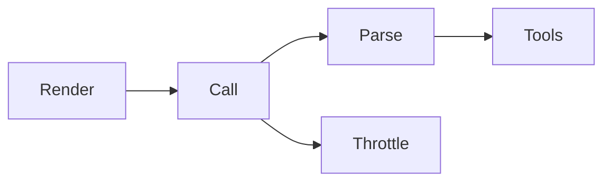
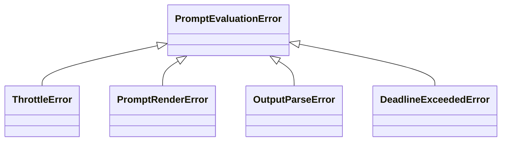

# Provider Adapters Specification

Bridge between prompt abstraction and LLM services. Handles request formatting,
response parsing, rate limiting, and error recovery.

**Source:** `src/weakincentives/adapters/`

## Principles

- **Provider-agnostic**: Uniform protocol; differences encapsulated in implementations
- **Prompt-owned resources**: Access via `prompt.resources`
- **Predictable failures**: Typed exceptions with retry/degrade/abort context
- **Observable**: Structured events and logs at each decision point
- **Protect upstream**: Reactive rate limiting respects provider signals

## Adapter Protocol

**Definition:** `adapters/core.py:ProviderAdapter`

```python
def evaluate(
    self,
    prompt: Prompt[OutputT],
    *,
    session: SessionProtocol,
    deadline: Deadline | None = None,
    budget: Budget | None = None,
    budget_tracker: BudgetTracker | None = None,
) -> PromptResponse[OutputT]: ...
```

Prompt must be within context manager. Resources accessed via `prompt.resources`.

### Lifecycle

1. Validate context (prompt in context manager)
2. Render → `RenderedPrompt`
3. Format for provider wire format
4. Call with throttle protection
5. Parse response, dispatch tools
6. Emit `PromptRendered`, `PromptExecuted` events

## Implementations

### OpenAIAdapter

**Definition:** `adapters/openai.py`

```python
adapter = OpenAIAdapter(
    model="gpt-4o",
    client_config=OpenAIClientConfig(api_key="sk-...", timeout=30.0),
    model_config=OpenAIModelConfig(temperature=0.7),
)
```

Uses Responses API. `max_tokens` renamed to `max_output_tokens`.

### LiteLLMAdapter

**Definition:** `adapters/litellm.py`

```python
adapter = LiteLLMAdapter(
    model="anthropic/claude-3-opus",
    completion_config=LiteLLMClientConfig(api_key="..."),
)
```

100+ providers via LiteLLM. Tool calling/structured output support varies by
provider. Always sets `require_structured_output_text=True`.

## Throttling

**Definition:** `adapters/throttle.py`

```python
policy = new_throttle_policy(
    max_attempts=5,
    base_delay=timedelta(milliseconds=500),
    max_delay=timedelta(seconds=8),
    max_total_delay=timedelta(seconds=30),
)
```

| Signal | Behavior |
|--------|----------|
| HTTP 429 / `RateLimitError` | Retry with backoff |
| `insufficient_quota` | Longer backoff, alerting |
| Timeout | Retry if deadline permits |
| HTTP 500-503 | Retry with backoff |

**Strategy:** Exponential with jitter, respects Retry-After, deadline-aware.

## Inner Loop

**Definition:** `adapters/inner_loop.py`



1. Render → emit `PromptRendered`
2. Prepare tools → JSON schemas via `tool_to_spec`
3. Call provider (failures → `PromptEvaluationError`)
4. Handle tool calls via `ToolExecutor`
5. Loop until no tool calls
6. Parse output → emit `PromptExecuted`

### Tool Execution

**Definition:** `adapters/tool_executor.py`

- Arguments via `serde.parse`; validation errors → `ToolResult(success=False)`
- `ToolContext` exposes prompt, adapter, session, deadline
- Handlers synchronous; exceptions → failed results
- Snapshots captured before execution; restored on failure

## Errors



| Path | Handling |
|------|----------|
| Tool failures | `ToolResult(success=False)` returned to model |
| Parse failures | `OutputParseError` with raw response |
| Throttle exhaustion | `ThrottleError(retry_safe=False)` |
| Deadline exceeded | `DeadlineExceededError` |

## Budget Tracking

Adapters record token usage after each response. `BudgetTracker` is thread-safe.

```python
budget = Budget(deadline=..., max_total_tokens=10000)
tracker = BudgetTracker(budget)
response = adapter.evaluate(prompt, session=session, budget_tracker=tracker)
```

## Telemetry

Events via `session.dispatcher`:

| Event | When |
|-------|------|
| `PromptRendered` | After render |
| `PromptExecuted` | After parse |
| `ToolInvoked` | After dispatch |

Structured logs: `prompt.render.start/complete`, `prompt.call.start/complete`,
`prompt.throttled`, `prompt.error`.

## New Adapter Checklist

1. Define `ClientConfig` and `ModelConfig` frozen dataclasses
2. Accept concrete client or config (tests inject fakes)
3. Render via `prompt.render()` once
4. Access resources via `prompt.resources`
5. Delegate to `run_inner_loop` with provider callables
6. Wrap SDK failures → `PromptEvaluationError`
7. Raise `RuntimeError` when optional deps missing
