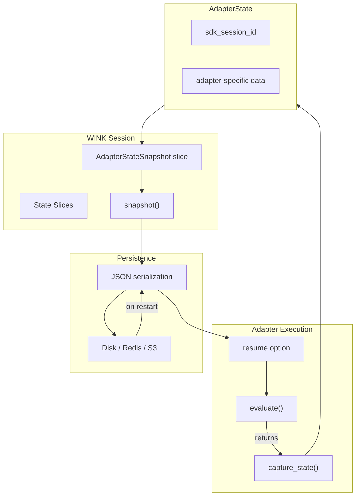
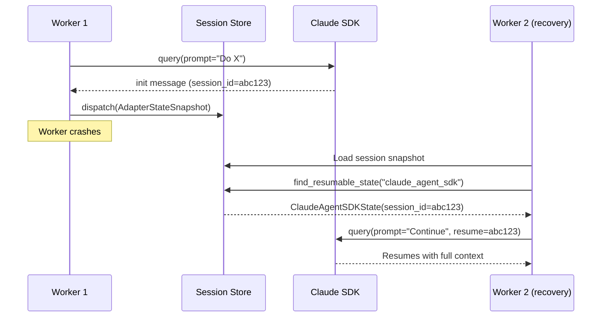

# Adapter State Specification

## Purpose

This specification defines an `AdapterState` protocol for capturing and
restoring adapter-specific state that exists outside the WINK session. The
primary use case is enabling worker crash recovery by resuming Claude Agent SDK
sessions from their internal conversation state.

## Problem Statement

Currently, WINK adapters are stateless - they don't maintain state between
`evaluate()` calls. All orchestration state lives in the `Session`. However,
some adapters (particularly Claude Agent SDK) maintain their own internal state:

- **Claude Agent SDK**: Maintains conversation history, session IDs, and
  context in `~/.claude/projects/`. This state is essential for resuming
  multi-turn agentic sessions.

When a worker crashes mid-execution:

1. The WINK session can be restored from a snapshot
2. But the underlying Claude session cannot be resumed because:
   - The SDK's `session_id` was never captured
   - The ephemeral HOME directory was cleaned up
   - There's no record of which SDK session to resume

## Guiding Principles

- **Adapter autonomy**: Each adapter defines what state it needs to persist
- **Explicit capture**: State capture happens at well-defined points (not
  implicitly)
- **Serializable state**: Adapter state must be JSON-serializable for
  persistence
- **Optional participation**: Adapters without resumable state return `None`
- **Session integration**: Adapter state can be included in WINK session
  snapshots

## Architecture Overview



## Protocol Definition

### AdapterState Protocol

```python
from typing import Protocol, Any, runtime_checkable
from dataclasses import dataclass

@runtime_checkable
class AdapterState(Protocol):
    """Protocol for adapter-specific resumable state.

    Implementations must be frozen dataclasses that serialize cleanly
    via weakincentives.serde. Each adapter type defines its own state
    schema.
    """

    @property
    def adapter_type(self) -> str:
        """Return the adapter type identifier (e.g., 'claude_agent_sdk')."""
        ...

    @property
    def resumable(self) -> bool:
        """Return True if this state can be used to resume execution."""
        ...
```

### Claude Agent SDK State

```python
from dataclasses import dataclass
from datetime import datetime

@dataclass(slots=True, frozen=True)
class ClaudeAgentSDKState:
    """Captured state from a Claude Agent SDK execution.

    This state enables resuming an SDK session after a worker crash.
    The session_id is obtained from the SDK's init message and can be
    passed to subsequent query() calls via the 'resume' option.

    Attributes:
        session_id: The SDK-generated session identifier. Used with
            the 'resume' option to continue a conversation.
        created_at: When the session was created.
        last_activity_at: When the last message was received.
        workspace_path: The cwd used during execution (for context).
        prompt_name: The WINK prompt that started this session.
        message_count: Number of messages in the session (for validation).
        is_complete: Whether the session completed normally vs crashed.
    """

    session_id: str
    created_at: datetime
    last_activity_at: datetime
    workspace_path: str | None
    prompt_name: str
    message_count: int = 0
    is_complete: bool = False

    @property
    def adapter_type(self) -> str:
        return "claude_agent_sdk"

    @property
    def resumable(self) -> bool:
        """A session is resumable if it has a valid session_id and didn't complete."""
        return bool(self.session_id) and not self.is_complete
```

### StatefulAdapter Protocol Extension

```python
from typing import Protocol

class StatefulAdapter[OutputT](ProviderAdapter[OutputT], Protocol):
    """Extended adapter protocol for adapters with resumable state.

    Adapters implementing this protocol can capture their internal state
    for persistence and accept state for resumption.
    """

    def evaluate_with_state(
        self,
        prompt: Prompt[OutputT],
        *,
        session: SessionProtocol,
        resume_from: AdapterState | None = None,
        deadline: Deadline | None = None,
        budget: Budget | None = None,
        budget_tracker: BudgetTracker | None = None,
    ) -> tuple[PromptResponse[OutputT], AdapterState | None]:
        """Evaluate prompt with optional state capture and resumption.

        Args:
            prompt: The prompt to evaluate.
            session: Session for state management.
            resume_from: Optional state to resume from.
            deadline: Optional execution deadline.
            budget: Optional token budget.
            budget_tracker: Optional budget tracker.

        Returns:
            Tuple of (response, captured_state). The captured_state is
            None if the adapter doesn't support state capture or if
            capture failed.
        """
        ...
```

## Session Integration

### AdapterStateSnapshot Slice

Adapter state is stored in a dedicated session slice:

```python
from dataclasses import dataclass
from datetime import datetime
from weakincentives.runtime.session import SlicePolicy

@dataclass(slots=True, frozen=True)
class AdapterStateSnapshot:
    """Snapshot of adapter state at a point in time.

    Stored in a LOG slice so it's preserved across session restores.
    Multiple snapshots may exist if state is captured at different points.

    Attributes:
        state: The adapter-specific state (must implement AdapterState).
        captured_at: When this snapshot was taken.
        evaluation_id: Unique identifier for the evaluation that produced this.
        supersedes: ID of the previous snapshot this one replaces (if any).
    """

    state: AdapterState
    captured_at: datetime
    evaluation_id: str
    supersedes: str | None = None

# Register with LOG policy - preserved during session restore
session._slice_policies[AdapterStateSnapshot] = SlicePolicy.LOG
```

### Capturing State

State capture happens at the end of `evaluate()` (success or failure):

```python
# In ClaudeAgentSDKAdapter._run_sdk_query()
async def _run_sdk_query(self, ...) -> tuple[list[Any], str | None]:
    """Execute SDK query and return (messages, session_id)."""
    session_id: str | None = None

    async for message in sdk.query(prompt=stream_prompt(), options=options):
        messages.append(message)

        # Capture session_id from init message
        if (hasattr(message, 'subtype') and message.subtype == 'init'):
            session_id = getattr(message, 'session_id', None)
            if not session_id:
                # Try data dict format
                data = getattr(message, 'data', {})
                session_id = data.get('session_id')

    return messages, session_id
```

### State Dispatch

After evaluation, dispatch the state to the session:

```python
# In ClaudeAgentSDKAdapter.evaluate()
response, sdk_state = await self._evaluate_with_capture(...)

if sdk_state is not None:
    snapshot = AdapterStateSnapshot(
        state=sdk_state,
        captured_at=_utcnow(),
        evaluation_id=str(uuid4()),
    )
    session.dispatch(snapshot)  # Uses append_all reducer by default
```

## Resumption Flow

### Finding Resumable State

```python
def find_resumable_state(
    session: SessionProtocol,
    adapter_type: str,
) -> AdapterState | None:
    """Find the most recent resumable state for an adapter type.

    Args:
        session: The session to search.
        adapter_type: The adapter type to find state for.

    Returns:
        The most recent resumable AdapterState, or None if not found.
    """
    snapshots = session[AdapterStateSnapshot].all()

    # Filter to matching adapter type and resumable state
    candidates = [
        s for s in reversed(snapshots)
        if s.state.adapter_type == adapter_type and s.state.resumable
    ]

    return candidates[0].state if candidates else None
```

### Using Resumed State

```python
# In ClaudeAgentSDKAdapter - resume from captured state
async def _run_sdk_query_with_resume(
    self,
    *,
    sdk: Any,
    prompt_text: str,
    resume_session_id: str | None,
    ...
) -> list[Any]:
    """Execute SDK query, optionally resuming from a previous session."""

    options_kwargs: dict[str, Any] = {
        "model": self._model,
        ...
    }

    # Add resume option if we have a session to resume
    if resume_session_id:
        options_kwargs["resume"] = resume_session_id
        logger.info(
            "claude_agent_sdk.resuming_session",
            event="sdk.resuming_session",
            context={"session_id": resume_session_id},
        )

    options = ClaudeAgentOptions(**options_kwargs)
    # ... rest of execution
```

## Configuration

### ClaudeAgentSDKClientConfig Extension

```python
@dataclass(slots=True, frozen=True)
class ClaudeAgentSDKClientConfig:
    """Configuration for Claude Agent SDK adapter."""

    # ... existing fields ...

    capture_state: bool = True
    """Whether to capture SDK session state for potential resumption."""

    auto_resume: bool = False
    """Whether to automatically resume from the last session if available.
    When True, evaluate() checks for resumable state before starting fresh.
    When False, resume must be explicitly requested via evaluate_with_state().
    """

    resume_validation: ResumeValidation = ResumeValidation.STRICT
    """How to validate session state before resuming."""


class ResumeValidation(Enum):
    """Validation mode for session resumption."""

    STRICT = "strict"
    """Validate workspace path, prompt name, and recency."""

    RELAXED = "relaxed"
    """Only validate that session_id exists and is resumable."""

    NONE = "none"
    """No validation - attempt resume with any state."""
```

## Crash Recovery Workflow

### Worker Crash Detection



### MainLoop Integration

```python
# In MainLoop or LoopGroup crash recovery

async def recover_session(
    session_data: bytes,
    adapter: ClaudeAgentSDKAdapter,
) -> None:
    """Recover a session after worker crash."""
    # Restore WINK session
    snapshot = Snapshot.from_json(session_data.decode())
    session = Session(bus=bus, slice_config=config)
    session.restore(snapshot)

    # Find resumable adapter state
    state = find_resumable_state(session, "claude_agent_sdk")

    if state and isinstance(state, ClaudeAgentSDKState):
        # Resume the SDK session
        response = adapter.evaluate_with_state(
            prompt=original_prompt,
            session=session,
            resume_from=state,
        )
    else:
        # No resumable state - start fresh
        response = adapter.evaluate(prompt=original_prompt, session=session)
```

## Limitations and Considerations

### SDK Session Persistence Location

The Claude Agent SDK stores sessions in `~/.claude/projects/`. With ephemeral
HOME isolation:

1. **Option A: Persistent HOME for resumable sessions**
   - Use a persistent directory instead of ephemeral for sessions that need
     crash recovery
   - Trade-off: Less isolation, potential credential exposure

2. **Option B: Copy session data before cleanup**
   - Before cleaning up ephemeral HOME, copy the session data to persistent
     storage
   - Trade-off: More complex, may miss data on hard crashes

3. **Option C: Rely on SDK's server-side state** (recommended)
   - The SDK may store conversation state server-side
   - Only the session_id is needed to resume
   - Trade-off: Requires SDK support for server-side session storage

### Session Expiry

SDK sessions may expire after a period of inactivity. The adapter should:

1. Track `last_activity_at` in state
2. Validate session age before attempting resume
3. Handle `SessionExpired` errors gracefully

### Forking vs Continuing

When resuming, decide whether to:

- **Continue**: Append to the original session (modifies history)
- **Fork**: Create a new branch from the resume point (preserves original)

Default to forking for crash recovery to avoid corrupting the original session.

### State Size Limits

Adapter state should be minimal (IDs and metadata only). Large state should be
stored externally with references:

```python
@dataclass(slots=True, frozen=True)
class ClaudeAgentSDKState:
    session_id: str  # Reference to SDK's internal state
    # NOT: messages: list[Message]  # Don't embed conversation history
```

## Future Extensions

### Multi-Adapter State

For prompts that use multiple adapters, track state per-adapter:

```python
@dataclass(slots=True, frozen=True)
class CompositeAdapterState:
    """State from multiple adapters in a single evaluation."""
    states: Mapping[str, AdapterState]
```

### State Diffing

Track changes between state snapshots for debugging:

```python
def diff_states(
    before: AdapterStateSnapshot,
    after: AdapterStateSnapshot,
) -> StateDiff:
    """Compute differences between two state snapshots."""
    ...
```

### Checkpointing Frequency

Allow configuring how often state is captured:

```python
class CheckpointStrategy(Enum):
    ON_COMPLETE = "on_complete"      # Only when evaluation completes
    ON_TOOL_USE = "on_tool_use"      # After each tool execution
    PERIODIC = "periodic"             # Every N seconds
    ON_DEMAND = "on_demand"           # Only when explicitly requested
```

## Related Specifications

- `specs/SESSIONS.md` - Session lifecycle and snapshots
- `specs/CLAUDE_AGENT_SDK.md` - Claude Agent SDK adapter
- `specs/SLICES.md` - Slice storage backends
- `specs/MAIN_LOOP.md` - Worker orchestration and crash recovery
- `specs/MAILBOX.md` - Message handling and visibility for crash recovery

## References

- [Claude Agent SDK Session Management](https://platform.claude.com/docs/en/agent-sdk/sessions)
- [Session resumption GitHub issue](https://github.com/anthropics/claude-agent-sdk-python/issues/109)
