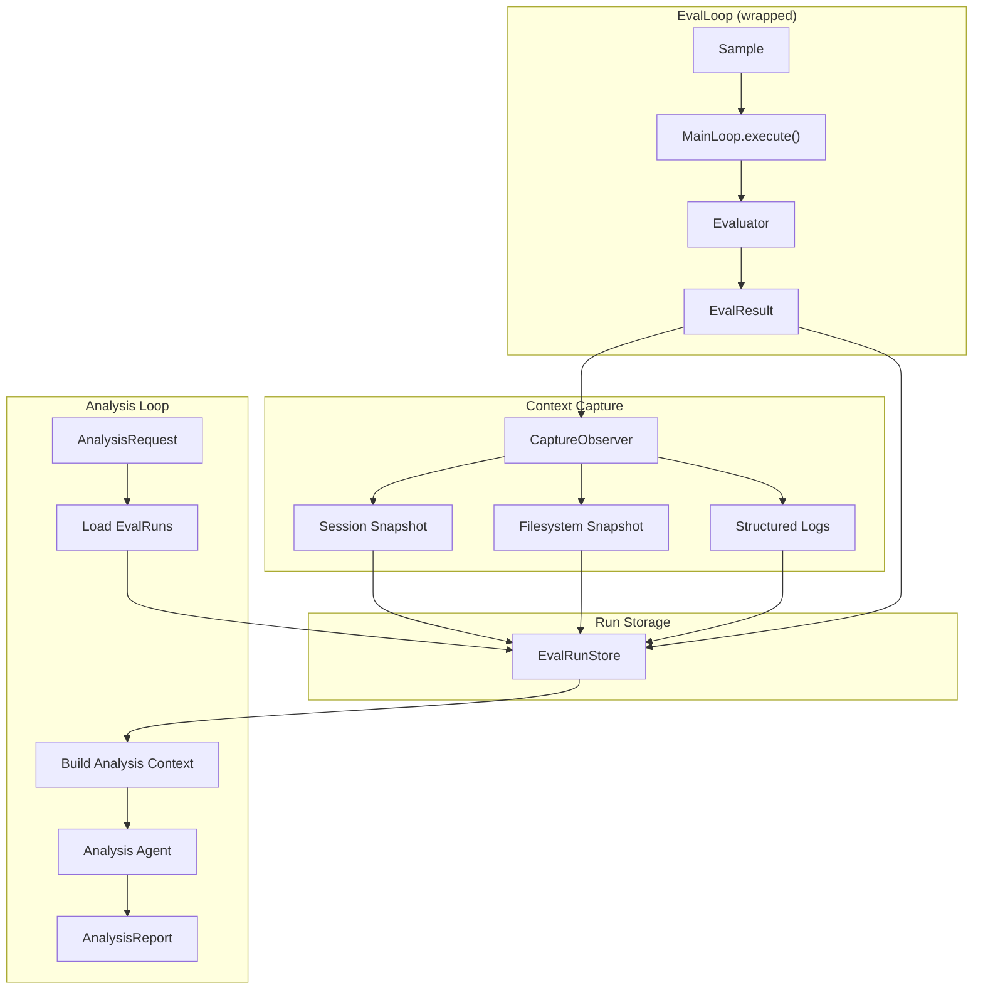

# Analysis Loop Specification

## Purpose

`AnalysisLoop` is a specialized abstraction that wraps `EvalLoop` to enable
meta-level debugging and improvement of agents in production. It captures the
complete execution context from each evaluation—session state, filesystem
snapshots, and structured logs—and runs an analysis agent over this context
to investigate failures, identify patterns, and suggest improvements.

```python
# Basic setup
analysis_loop = AnalysisLoop(
    eval_loop=eval_loop,
    analyzer=OpenAIAdapter(model="gpt-4o"),
    requests=analysis_requests,
)

# Dispatch analysis tasks
analysis_requests.send(AnalysisRequest(
    task=DiagnoseFailure(sample_ids=["eval-001", "eval-003"]),
    scope=AnalysisScope.FAILED_ONLY,
))
```

**Use AnalysisLoop for:** Debugging agent failures, identifying regression
patterns, comparing agent behavior across versions, suggesting prompt
improvements, validating fixes before deployment.

**Not for:** Real-time monitoring (use observability tooling), simple pass/fail
reporting (use EvalLoop directly), production traffic analysis (use sampling).

## Guiding Principles

- **Full context capture**: Every eval run preserves session snapshots, FS
  state, and structured logs for retrospective analysis.
- **Composition over extension**: AnalysisLoop wraps EvalLoop rather than
  extending it, maintaining separation of concerns.
- **Task-oriented analysis**: Analysis is driven by explicit tasks (diagnose,
  compare, suggest) rather than implicit heuristics.
- **Reproducible investigations**: Captured context enables deterministic
  replay and comparison across analysis runs.
- **Non-invasive**: Analysis runs do not modify the original eval artifacts;
  they produce separate analysis reports.

## Architecture



## Core Types

### EvalRun

Complete context captured from a single evaluation:

```python
@dataclass(slots=True, frozen=True)
class EvalRun[InputT, ExpectedT, OutputT]:
    """Complete context from a single evaluation execution."""

    # Identity
    run_id: UUID
    sample_id: str
    eval_loop_id: str
    created_at: datetime

    # Input/Output
    sample: Sample[InputT, ExpectedT]
    output: OutputT
    result: EvalResult

    # Captured State
    session_snapshot: Snapshot
    filesystem_snapshot: FilesystemSnapshot | None
    logs: tuple[StructuredLogEntry, ...]

    # Execution Metadata
    prompt_name: str
    adapter_name: str
    latency_ms: int
    token_usage: TokenUsage | None

    @property
    def passed(self) -> bool:
        """Whether the evaluation passed."""
        return self.result.score.passed

    @property
    def score(self) -> Score:
        """Evaluation score."""
        return self.result.score

    def tool_invocations(self) -> tuple[ToolInvoked, ...]:
        """Extract tool invocations from session snapshot."""
        return self.session_snapshot.slices.get(ToolInvoked, ())

    def prompt_executions(self) -> tuple[PromptExecuted, ...]:
        """Extract prompt executions from session snapshot."""
        return self.session_snapshot.slices.get(PromptExecuted, ())
```

### StructuredLogEntry

Log entries captured during evaluation:

```python
@dataclass(slots=True, frozen=True)
class StructuredLogEntry:
    """Structured log entry from evaluation execution."""

    timestamp: datetime
    level: Literal["debug", "info", "warning", "error"]
    message: str
    logger_name: str
    attributes: Mapping[str, Any] = field(default_factory=dict)
    exception: str | None = None

    @property
    def is_error(self) -> bool:
        return self.level == "error" or self.exception is not None
```

### EvalRunStore

Storage for captured evaluation runs:

```python
class EvalRunStore(Protocol[InputT, ExpectedT, OutputT]):
    """Storage for evaluation run contexts."""

    def store(self, run: EvalRun[InputT, ExpectedT, OutputT]) -> None:
        """Persist an evaluation run."""
        ...

    def load(self, run_id: UUID) -> EvalRun[InputT, ExpectedT, OutputT]:
        """Load a specific run by ID.

        Raises:
            KeyError: Run not found.
        """
        ...

    def query(
        self,
        *,
        sample_ids: Sequence[str] | None = None,
        passed: bool | None = None,
        since: datetime | None = None,
        until: datetime | None = None,
        limit: int | None = None,
    ) -> Sequence[EvalRun[InputT, ExpectedT, OutputT]]:
        """Query runs by criteria."""
        ...

    def list_sample_ids(self) -> Sequence[str]:
        """List all unique sample IDs in storage."""
        ...
```

### Analysis Tasks

Explicit task types for analysis requests:

```python
@dataclass(slots=True, frozen=True)
class DiagnoseFailure:
    """Diagnose why specific evaluations failed."""

    sample_ids: tuple[str, ...]
    """Sample IDs to diagnose. Empty means all failed samples."""

    focus_areas: tuple[str, ...] = ()
    """Optional focus areas: "tool_usage", "reasoning", "output_format", etc."""

    include_passing: bool = False
    """Include passing samples for comparison."""


@dataclass(slots=True, frozen=True)
class CompareRuns:
    """Compare behavior across evaluation runs."""

    baseline_run_ids: tuple[UUID, ...]
    """Run IDs representing baseline behavior."""

    comparison_run_ids: tuple[UUID, ...]
    """Run IDs to compare against baseline."""

    dimensions: tuple[str, ...] = ("tool_usage", "token_efficiency", "accuracy")
    """Comparison dimensions."""


@dataclass(slots=True, frozen=True)
class SuggestImprovements:
    """Suggest prompt or tool improvements based on failures."""

    sample_ids: tuple[str, ...] = ()
    """Sample IDs to analyze. Empty means all failed samples."""

    improvement_targets: tuple[str, ...] = ("prompt", "tools", "evaluator")
    """What to suggest improvements for."""


@dataclass(slots=True, frozen=True)
class IdentifyPatterns:
    """Identify failure patterns across evaluations."""

    min_occurrences: int = 2
    """Minimum occurrences to consider a pattern."""

    pattern_types: tuple[str, ...] = ("error_type", "tool_sequence", "output_shape")
    """Types of patterns to look for."""


@dataclass(slots=True, frozen=True)
class ValidateFix:
    """Validate that a fix addresses identified failures."""

    original_run_ids: tuple[UUID, ...]
    """Run IDs from before the fix."""

    fixed_run_ids: tuple[UUID, ...]
    """Run IDs from after the fix."""

    expected_improvements: tuple[str, ...] = ()
    """Specific improvements to verify."""


@dataclass(slots=True, frozen=True)
class CustomAnalysis:
    """Run a custom analysis with a user-provided prompt."""

    analysis_prompt: str
    """Custom analysis instructions."""

    sample_ids: tuple[str, ...] = ()
    """Sample IDs to include in context. Empty means use scope default."""


AnalysisTask = (
    DiagnoseFailure
    | CompareRuns
    | SuggestImprovements
    | IdentifyPatterns
    | ValidateFix
    | CustomAnalysis
)
```

### AnalysisScope

Scope for selecting which runs to analyze:

```python
class AnalysisScope(Enum):
    """Scope for selecting evaluation runs to analyze."""

    ALL = "all"
    """Include all runs in the query window."""

    FAILED_ONLY = "failed_only"
    """Include only failed evaluations."""

    PASSED_ONLY = "passed_only"
    """Include only passed evaluations."""

    EXPLICIT = "explicit"
    """Use only sample_ids specified in the task."""
```

### AnalysisRequest

Request to perform analysis:

```python
@dataclass(slots=True, frozen=True)
class AnalysisRequest:
    """Request to analyze evaluation runs."""

    task: AnalysisTask
    """The analysis task to perform."""

    scope: AnalysisScope = AnalysisScope.FAILED_ONLY
    """Scope for selecting runs."""

    max_runs: int = 50
    """Maximum runs to include in analysis context."""

    include_filesystem: bool = True
    """Whether to include filesystem snapshots in context."""

    include_logs: bool = True
    """Whether to include structured logs in context."""

    request_id: UUID = field(default_factory=uuid4)
    created_at: datetime = field(default_factory=lambda: datetime.now(UTC))
```

### AnalysisReport

Output from analysis:

```python
@dataclass(slots=True, frozen=True)
class AnalysisReport:
    """Report generated by analysis agent."""

    request_id: UUID
    """ID of the analysis request."""

    task_type: str
    """Type of analysis task performed."""

    summary: str
    """Executive summary of findings."""

    findings: tuple[Finding, ...]
    """Detailed findings from analysis."""

    recommendations: tuple[Recommendation, ...]
    """Actionable recommendations."""

    analyzed_runs: tuple[UUID, ...]
    """Run IDs that were analyzed."""

    created_at: datetime = field(default_factory=lambda: datetime.now(UTC))
    token_usage: TokenUsage | None = None


@dataclass(slots=True, frozen=True)
class Finding:
    """Individual finding from analysis."""

    category: str
    """Finding category: "failure_cause", "pattern", "regression", etc."""

    title: str
    """Brief title."""

    description: str
    """Detailed description."""

    severity: Literal["critical", "high", "medium", "low", "info"]
    """Severity level."""

    evidence: tuple[Evidence, ...]
    """Supporting evidence from runs."""

    affected_samples: tuple[str, ...] = ()
    """Sample IDs affected by this finding."""


@dataclass(slots=True, frozen=True)
class Evidence:
    """Evidence supporting a finding."""

    run_id: UUID
    """Run this evidence is from."""

    evidence_type: str
    """Type: "tool_call", "log_entry", "output_excerpt", "state_diff"."""

    content: str
    """The evidence content."""

    location: str | None = None
    """Location reference (e.g., "tool_call[3]", "log[15]")."""


@dataclass(slots=True, frozen=True)
class Recommendation:
    """Actionable recommendation from analysis."""

    category: str
    """Category: "prompt_change", "tool_fix", "evaluator_update", etc."""

    title: str
    """Brief title."""

    description: str
    """Detailed description."""

    priority: Literal["critical", "high", "medium", "low"]
    """Implementation priority."""

    implementation_hints: tuple[str, ...] = ()
    """Specific implementation guidance."""

    affected_samples: tuple[str, ...] = ()
    """Samples this would address."""
```

## AnalysisLoop

### Class Definition

```python
class AnalysisLoop[InputT, OutputT, ExpectedT]:
    """Loop for running analysis over evaluation results.

    Wraps EvalLoop to capture execution context and enable meta-level
    analysis of agent behavior.
    """

    def __init__(
        self,
        *,
        eval_loop: EvalLoop[InputT, OutputT, ExpectedT],
        analyzer: ProviderAdapter[AnalysisReport],
        run_store: EvalRunStore[InputT, ExpectedT, OutputT],
        requests: Mailbox[AnalysisRequest, AnalysisReport],
        config: AnalysisLoopConfig | None = None,
    ) -> None:
        """Initialize analysis loop.

        Args:
            eval_loop: The wrapped evaluation loop.
            analyzer: Adapter for running analysis prompts.
            run_store: Storage for captured evaluation runs.
            requests: Mailbox for analysis requests.
            config: Optional configuration.
        """
        ...

    def run(
        self,
        *,
        max_iterations: int | None = None,
        visibility_timeout: int = 600,
        wait_time_seconds: int = 20,
    ) -> None:
        """Process analysis requests from mailbox.

        Args:
            max_iterations: Maximum requests to process. None for unlimited.
            visibility_timeout: Message visibility timeout in seconds.
            wait_time_seconds: Long-poll wait time.
        """
        ...

    def analyze(self, request: AnalysisRequest) -> AnalysisReport:
        """Execute analysis directly without mailbox.

        Args:
            request: The analysis request.

        Returns:
            Analysis report with findings and recommendations.
        """
        ...

    def shutdown(self, *, timeout: float = 30.0) -> bool:
        """Request graceful shutdown."""
        ...

    # Context manager support
    def __enter__(self) -> Self: ...
    def __exit__(self, *args) -> None: ...
```

### Configuration

```python
@dataclass(slots=True, frozen=True)
class AnalysisLoopConfig:
    """Configuration for AnalysisLoop."""

    budget: Budget | None = None
    """Budget for analysis prompts."""

    deadline: Deadline | None = None
    """Deadline for analysis completion."""

    max_context_tokens: int = 100_000
    """Maximum tokens to include in analysis context."""

    truncate_logs: int = 1000
    """Maximum log entries per run to include."""

    truncate_tool_calls: int = 100
    """Maximum tool calls per run to include."""

    analysis_template: PromptTemplate[AnalysisReport] | None = None
    """Custom analysis prompt template. Uses default if None."""

    capture_config: CaptureConfig | None = None
    """Configuration for context capture during eval."""
```

### Capture Configuration

```python
@dataclass(slots=True, frozen=True)
class CaptureConfig:
    """Configuration for capturing evaluation context."""

    capture_session: bool = True
    """Capture session snapshots."""

    capture_filesystem: bool = True
    """Capture filesystem snapshots."""

    capture_logs: bool = True
    """Capture structured logs."""

    log_levels: frozenset[str] = frozenset({"info", "warning", "error"})
    """Log levels to capture."""

    filesystem_paths: tuple[str, ...] = ()
    """Specific paths to include in filesystem snapshot. Empty means all."""

    exclude_paths: tuple[str, ...] = ()
    """Paths to exclude from filesystem snapshot."""
```

## Context Capture

### CaptureObserver

Observer that captures context from eval executions:

```python
class CaptureObserver[InputT, OutputT, ExpectedT]:
    """Observer that captures evaluation context for analysis."""

    def __init__(
        self,
        *,
        run_store: EvalRunStore[InputT, ExpectedT, OutputT],
        config: CaptureConfig | None = None,
        eval_loop_id: str,
    ) -> None:
        self._run_store = run_store
        self._config = config or CaptureConfig()
        self._eval_loop_id = eval_loop_id
        self._log_buffer: list[StructuredLogEntry] = []

    def on_eval_complete(
        self,
        *,
        sample: Sample[InputT, ExpectedT],
        output: OutputT,
        result: EvalResult,
        session: Session,
        filesystem: SnapshotableFilesystem | None,
        prompt_name: str,
        adapter_name: str,
        latency_ms: int,
        token_usage: TokenUsage | None,
    ) -> None:
        """Called after each evaluation completes."""
        run = EvalRun(
            run_id=uuid4(),
            sample_id=sample.id,
            eval_loop_id=self._eval_loop_id,
            created_at=datetime.now(UTC),
            sample=sample,
            output=output,
            result=result,
            session_snapshot=session.snapshot() if self._config.capture_session else Snapshot.empty(),
            filesystem_snapshot=filesystem.snapshot() if filesystem and self._config.capture_filesystem else None,
            logs=tuple(self._log_buffer) if self._config.capture_logs else (),
            prompt_name=prompt_name,
            adapter_name=adapter_name,
            latency_ms=latency_ms,
            token_usage=token_usage,
        )
        self._run_store.store(run)
        self._log_buffer.clear()

    def capture_log(self, entry: StructuredLogEntry) -> None:
        """Capture a log entry for the current evaluation."""
        if entry.level in self._config.log_levels:
            self._log_buffer.append(entry)
```

### Log Capture Integration

The capture observer integrates with Python's logging system:

```python
class AnalysisLogHandler(logging.Handler):
    """Logging handler that routes to capture observer."""

    def __init__(self, observer: CaptureObserver[Any, Any, Any]) -> None:
        super().__init__()
        self._observer = observer

    def emit(self, record: logging.LogRecord) -> None:
        entry = StructuredLogEntry(
            timestamp=datetime.fromtimestamp(record.created, tz=UTC),
            level=record.levelname.lower(),
            message=record.getMessage(),
            logger_name=record.name,
            attributes=dict(getattr(record, "attributes", {})),
            exception=self.formatException(record.exc_info) if record.exc_info else None,
        )
        self._observer.capture_log(entry)
```

## Analysis Execution

### Context Building

The analysis loop builds context for the analysis agent:

```python
@dataclass(slots=True, frozen=True)
class AnalysisContext:
    """Context provided to the analysis agent."""

    task: AnalysisTask
    runs: tuple[EvalRunSummary, ...]
    aggregate_stats: AggregateStats
    prompt_template_source: str | None = None


@dataclass(slots=True, frozen=True)
class EvalRunSummary:
    """Summarized view of an eval run for context."""

    run_id: UUID
    sample_id: str
    passed: bool
    score_value: float
    score_reason: str

    # Input/Output
    input_summary: str
    expected_summary: str
    output_summary: str

    # Execution trace
    tool_calls: tuple[ToolCallSummary, ...]
    error_logs: tuple[str, ...]
    warnings: tuple[str, ...]

    # Metadata
    latency_ms: int
    token_usage: TokenUsage | None

    # Full state (loaded on demand)
    full_session_available: bool
    full_filesystem_available: bool


@dataclass(slots=True, frozen=True)
class ToolCallSummary:
    """Summary of a tool invocation."""

    index: int
    tool_name: str
    params_summary: str
    result_summary: str
    success: bool
    duration_ms: int | None = None


@dataclass(slots=True, frozen=True)
class AggregateStats:
    """Aggregate statistics across analyzed runs."""

    total_runs: int
    passed_count: int
    failed_count: int
    pass_rate: float
    mean_score: float
    mean_latency_ms: float
    total_tokens: int
    error_type_counts: Mapping[str, int]
    tool_usage_counts: Mapping[str, int]
```

### Analysis Prompt Template

Default prompt template for analysis:

```python
ANALYSIS_TEMPLATE = PromptTemplate[AnalysisReport](
    ns="wink/analysis",
    key="analyze-evals",
    name="analysis_prompt",
    sections=[
        MarkdownSection(
            title="Role",
            key="role",
            template="""
You are an expert AI agent debugger. Your task is to analyze evaluation
results and provide actionable insights to improve agent performance.

You have access to complete execution context including:
- Session state (tool calls, state transitions, token usage)
- Filesystem state (files read/written during execution)
- Structured logs (errors, warnings, debug information)
- Evaluation scores and reasons
""",
        ),
        MarkdownSection(
            title="Analysis Task",
            key="task",
            template="$task_description",
        ),
        MarkdownSection(
            title="Aggregate Statistics",
            key="stats",
            template="""
**Overall Performance:**
- Total runs: $total_runs
- Pass rate: $pass_rate
- Mean score: $mean_score
- Mean latency: $mean_latency_ms ms

**Error Distribution:**
$error_distribution

**Tool Usage:**
$tool_usage
""",
        ),
        MarkdownSection(
            title="Evaluation Runs",
            key="runs",
            template="$runs_context",
            visibility=SectionVisibility.FULL,
        ),
        MarkdownSection(
            title="Instructions",
            key="instructions",
            template="""
Analyze the evaluation runs and produce a report with:

1. **Summary**: Brief executive summary of findings
2. **Findings**: Detailed findings with evidence
3. **Recommendations**: Actionable recommendations

For each finding, cite specific evidence from the runs.
For each recommendation, explain the expected impact.

Be specific and actionable. Avoid vague observations.
""",
        ),
    ],
    output_schema=AnalysisReport,
)
```

### Execution Flow

```
AnalysisRequest received
        │
        ▼
Query EvalRunStore by scope
        │
        ▼
Build AnalysisContext
  ├─ Summarize runs (truncate for context window)
  ├─ Compute aggregate stats
  └─ Format task description
        │
        ▼
Render analysis prompt
        │
        ▼
Evaluate with analyzer adapter
        │
        ▼
Parse AnalysisReport
        │
        ▼
Return/Reply with report
```

## Storage Backends

### InMemoryEvalRunStore

For development and testing:

```python
@dataclass
class InMemoryEvalRunStore[InputT, ExpectedT, OutputT]:
    """In-memory storage for evaluation runs."""

    _runs: dict[UUID, EvalRun[InputT, ExpectedT, OutputT]] = field(default_factory=dict)
    _by_sample: dict[str, list[UUID]] = field(default_factory=lambda: defaultdict(list))

    def store(self, run: EvalRun[InputT, ExpectedT, OutputT]) -> None:
        self._runs[run.run_id] = run
        self._by_sample[run.sample_id].append(run.run_id)

    def load(self, run_id: UUID) -> EvalRun[InputT, ExpectedT, OutputT]:
        if run_id not in self._runs:
            raise KeyError(f"Run not found: {run_id}")
        return self._runs[run_id]

    def query(
        self,
        *,
        sample_ids: Sequence[str] | None = None,
        passed: bool | None = None,
        since: datetime | None = None,
        until: datetime | None = None,
        limit: int | None = None,
    ) -> Sequence[EvalRun[InputT, ExpectedT, OutputT]]:
        results: list[EvalRun[InputT, ExpectedT, OutputT]] = []

        for run in self._runs.values():
            if sample_ids and run.sample_id not in sample_ids:
                continue
            if passed is not None and run.passed != passed:
                continue
            if since and run.created_at < since:
                continue
            if until and run.created_at > until:
                continue
            results.append(run)

        results.sort(key=lambda r: r.created_at, reverse=True)
        if limit:
            results = results[:limit]
        return results

    def list_sample_ids(self) -> Sequence[str]:
        return list(self._by_sample.keys())
```

### JSONLEvalRunStore

For persistent storage:

```python
@dataclass
class JSONLEvalRunStore[InputT, ExpectedT, OutputT]:
    """JSONL-based persistent storage for evaluation runs.

    Stores runs as newline-delimited JSON. Session snapshots and
    filesystem snapshots are stored as separate files.
    """

    base_path: Path
    input_type: type[InputT]
    expected_type: type[ExpectedT]
    output_type: type[OutputT]

    def __post_init__(self) -> None:
        self.base_path.mkdir(parents=True, exist_ok=True)
        self._index_path = self.base_path / "index.jsonl"
        self._snapshots_path = self.base_path / "snapshots"
        self._snapshots_path.mkdir(exist_ok=True)

    def store(self, run: EvalRun[InputT, ExpectedT, OutputT]) -> None:
        # Store session snapshot separately
        if run.session_snapshot:
            snap_path = self._snapshots_path / f"{run.run_id}-session.json"
            snap_path.write_text(run.session_snapshot.to_json())

        # Store run index entry
        entry = self._serialize_index_entry(run)
        with self._index_path.open("a") as f:
            f.write(json.dumps(entry) + "\n")

    def load(self, run_id: UUID) -> EvalRun[InputT, ExpectedT, OutputT]:
        # Load from index
        for entry in self._iter_index():
            if entry["run_id"] == str(run_id):
                return self._deserialize_run(entry)
        raise KeyError(f"Run not found: {run_id}")

    # ... additional implementation
```

## Integration with EvalLoop

### Wrapping Pattern

AnalysisLoop wraps EvalLoop and installs capture observers:

```python
class AnalysisLoop[InputT, OutputT, ExpectedT]:
    def __init__(
        self,
        *,
        eval_loop: EvalLoop[InputT, OutputT, ExpectedT],
        analyzer: ProviderAdapter[AnalysisReport],
        run_store: EvalRunStore[InputT, ExpectedT, OutputT],
        requests: Mailbox[AnalysisRequest, AnalysisReport],
        config: AnalysisLoopConfig | None = None,
    ) -> None:
        self._eval_loop = eval_loop
        self._analyzer = analyzer
        self._run_store = run_store
        self._requests = requests
        self._config = config or AnalysisLoopConfig()

        # Install capture observer on eval loop
        self._observer = CaptureObserver(
            run_store=run_store,
            config=self._config.capture_config,
            eval_loop_id=str(id(eval_loop)),
        )
        eval_loop.add_observer(self._observer)

        # Install log handler
        self._log_handler = AnalysisLogHandler(self._observer)
        logging.getLogger("weakincentives").addHandler(self._log_handler)

    def __enter__(self) -> Self:
        return self

    def __exit__(self, *args: object) -> None:
        logging.getLogger("weakincentives").removeHandler(self._log_handler)
```

### Observer Protocol

EvalLoop exposes an observer protocol for context capture:

```python
class EvalLoopObserver(Protocol[InputT, OutputT, ExpectedT]):
    """Observer for EvalLoop execution events."""

    def on_eval_complete(
        self,
        *,
        sample: Sample[InputT, ExpectedT],
        output: OutputT,
        result: EvalResult,
        session: Session,
        filesystem: SnapshotableFilesystem | None,
        prompt_name: str,
        adapter_name: str,
        latency_ms: int,
        token_usage: TokenUsage | None,
    ) -> None:
        """Called after each evaluation completes."""
        ...


class EvalLoop[InputT, OutputT, ExpectedT]:
    def add_observer(self, observer: EvalLoopObserver[InputT, OutputT, ExpectedT]) -> None:
        """Add an observer for evaluation events."""
        self._observers.append(observer)

    def remove_observer(self, observer: EvalLoopObserver[InputT, OutputT, ExpectedT]) -> None:
        """Remove an observer."""
        self._observers.remove(observer)
```

## Usage Examples

### Basic Setup

```python
from weakincentives.evals import EvalLoop, Dataset, exact_match
from weakincentives.evals.analysis import (
    AnalysisLoop,
    AnalysisRequest,
    AnalysisScope,
    DiagnoseFailure,
    InMemoryEvalRunStore,
)
from weakincentives.adapters.openai import OpenAIAdapter
from weakincentives.contrib.mailbox import InMemoryMailbox

# Create base eval loop
main_loop = MyMainLoop(adapter=task_adapter, requests=task_requests)
eval_loop = EvalLoop(
    loop=main_loop,
    evaluator=exact_match,
    requests=eval_requests,
)

# Create analysis loop wrapping eval loop
run_store = InMemoryEvalRunStore()
analysis_requests = InMemoryMailbox(name="analysis-requests")

analysis_loop = AnalysisLoop(
    eval_loop=eval_loop,
    analyzer=OpenAIAdapter(model="gpt-4o"),
    run_store=run_store,
    requests=analysis_requests,
)

# Run evaluations (context is captured automatically)
dataset = Dataset.load(Path("samples.jsonl"), InputType, str)
submit_dataset(dataset, eval_requests)
eval_loop.run(max_iterations=len(dataset))

# Run analysis on failures
analysis_requests.send(AnalysisRequest(
    task=DiagnoseFailure(sample_ids=()),  # Empty means all failed
    scope=AnalysisScope.FAILED_ONLY,
))

report = analysis_loop.analyze(analysis_requests.receive()[0].body)
print(f"Summary: {report.summary}")
for finding in report.findings:
    print(f"- {finding.title}: {finding.description}")
```

### Comparing Agent Versions

```python
# Run evals with baseline version
baseline_runs = run_store.query(since=baseline_start, until=baseline_end)
baseline_ids = tuple(r.run_id for r in baseline_runs)

# Run evals with new version
new_runs = run_store.query(since=new_start, until=new_end)
new_ids = tuple(r.run_id for r in new_runs)

# Compare versions
report = analysis_loop.analyze(AnalysisRequest(
    task=CompareRuns(
        baseline_run_ids=baseline_ids,
        comparison_run_ids=new_ids,
        dimensions=("accuracy", "token_efficiency", "tool_usage"),
    ),
    scope=AnalysisScope.ALL,
))

for finding in report.findings:
    if finding.category == "regression":
        print(f"⚠️ Regression: {finding.title}")
    elif finding.category == "improvement":
        print(f"✓ Improvement: {finding.title}")
```

### Identifying Patterns

```python
# Find common failure patterns
report = analysis_loop.analyze(AnalysisRequest(
    task=IdentifyPatterns(
        min_occurrences=3,
        pattern_types=("error_type", "tool_sequence", "output_shape"),
    ),
    scope=AnalysisScope.FAILED_ONLY,
    max_runs=100,
))

for finding in report.findings:
    if finding.category == "pattern":
        print(f"Pattern: {finding.title}")
        print(f"  Affects: {len(finding.affected_samples)} samples")
        print(f"  Severity: {finding.severity}")
```

### Getting Improvement Suggestions

```python
# Get actionable improvement suggestions
report = analysis_loop.analyze(AnalysisRequest(
    task=SuggestImprovements(
        improvement_targets=("prompt", "tools"),
    ),
    scope=AnalysisScope.FAILED_ONLY,
))

for rec in report.recommendations:
    print(f"\n[{rec.priority}] {rec.title}")
    print(f"  {rec.description}")
    if rec.implementation_hints:
        print("  Implementation hints:")
        for hint in rec.implementation_hints:
            print(f"    - {hint}")
```

### Custom Analysis

```python
# Run custom analysis with specific questions
report = analysis_loop.analyze(AnalysisRequest(
    task=CustomAnalysis(
        analysis_prompt="""
        Analyze the tool usage patterns in these runs and answer:
        1. Are there any unnecessary tool calls?
        2. Could any sequences be optimized?
        3. Are there missing tool calls that would help?

        Focus particularly on the search and read_file tools.
        """,
        sample_ids=("sample-001", "sample-002", "sample-003"),
    ),
    scope=AnalysisScope.EXPLICIT,
))
```

### Validating a Fix

```python
# After implementing a fix, validate it addresses the issues
original_failures = run_store.query(passed=False, until=fix_deployed_at)
rerun_results = run_store.query(since=fix_deployed_at)

report = analysis_loop.analyze(AnalysisRequest(
    task=ValidateFix(
        original_run_ids=tuple(r.run_id for r in original_failures),
        fixed_run_ids=tuple(r.run_id for r in rerun_results),
        expected_improvements=("reduced_tool_errors", "correct_output_format"),
    ),
))

if report.findings:
    for finding in report.findings:
        if finding.severity in ("critical", "high"):
            print(f"⚠️ Fix may not fully address: {finding.title}")
else:
    print("✓ Fix appears to address all identified issues")
```

## LoopGroup Integration

AnalysisLoop can run alongside EvalLoop in a LoopGroup:

```python
from weakincentives.runtime import LoopGroup

group = LoopGroup(
    loops=[
        eval_loop,
        analysis_loop,
    ],
    health_port=8080,
    watchdog_threshold=720.0,
)

# In production, analysis requests come from monitoring or CI
group.run()
```

## DLQ Integration

AnalysisLoop supports dead letter queues for failed analysis requests:

```python
from weakincentives.runtime import DLQPolicy, DeadLetter

analysis_dlq: Mailbox[DeadLetter[AnalysisRequest], None] = RedisMailbox(
    name="analysis-dlq",
    client=redis,
)

analysis_loop = AnalysisLoop(
    eval_loop=eval_loop,
    analyzer=analyzer,
    run_store=run_store,
    requests=analysis_requests,
    dlq=DLQPolicy(
        mailbox=analysis_dlq,
        max_delivery_count=3,
    ),
)
```

## Observability

### Metrics

| Metric | Type | Description |
| ---------------------------------- | --------- | ------------------------------------- |
| `analysis.requests.total` | Counter | Total analysis requests received |
| `analysis.requests.completed` | Counter | Successfully completed analyses |
| `analysis.requests.failed` | Counter | Failed analysis requests |
| `analysis.runs.captured` | Counter | Eval runs captured for analysis |
| `analysis.runs.analyzed` | Counter | Runs included in analyses |
| `analysis.latency_ms` | Histogram | Analysis execution time |
| `analysis.context.tokens` | Histogram | Tokens used in analysis context |
| `analysis.findings.count` | Histogram | Findings per analysis |
| `analysis.recommendations.count` | Histogram | Recommendations per analysis |

### Structured Logging

```python
# On analysis start
log.info(
    "Starting analysis",
    request_id=str(request.request_id),
    task_type=type(request.task).__name__,
    scope=request.scope.value,
    max_runs=request.max_runs,
)

# On analysis complete
log.info(
    "Analysis completed",
    request_id=str(request.request_id),
    findings_count=len(report.findings),
    recommendations_count=len(report.recommendations),
    analyzed_runs=len(report.analyzed_runs),
    latency_ms=latency_ms,
)

# On critical finding
for finding in report.findings:
    if finding.severity == "critical":
        log.warning(
            "Critical finding identified",
            request_id=str(request.request_id),
            finding_title=finding.title,
            affected_samples=len(finding.affected_samples),
        )
```

## Best Practices

### Context Size Management

Analysis context can grow large. Use truncation and summarization:

```python
config = AnalysisLoopConfig(
    max_context_tokens=100_000,  # Stay within model limits
    truncate_logs=500,           # Most recent logs per run
    truncate_tool_calls=50,      # Most relevant tool calls
)
```

### Incremental Analysis

For large datasets, analyze incrementally:

```python
# Analyze in batches
all_failed = run_store.query(passed=False)
batch_size = 20

for i in range(0, len(all_failed), batch_size):
    batch_ids = tuple(r.sample_id for r in all_failed[i:i+batch_size])
    report = analysis_loop.analyze(AnalysisRequest(
        task=DiagnoseFailure(sample_ids=batch_ids),
        scope=AnalysisScope.EXPLICIT,
    ))
    # Process batch report
```

### Focus Analysis

Use focus areas to get targeted insights:

```python
# Focus on specific aspects
report = analysis_loop.analyze(AnalysisRequest(
    task=DiagnoseFailure(
        sample_ids=(),
        focus_areas=("tool_usage", "reasoning"),  # Ignore output format issues
    ),
))
```

### Preserve Analysis History

Store analysis reports for trend analysis:

```python
@dataclass(slots=True, frozen=True)
class AnalysisHistory:
    reports: tuple[AnalysisReport, ...]

    def trend(self, finding_category: str) -> Sequence[int]:
        """Count findings of category over time."""
        return [
            len([f for f in r.findings if f.category == finding_category])
            for r in self.reports
        ]
```

## Limitations

- **Context window**: Large eval runs may exceed analysis model context limits.
  Use truncation and summarization.
- **Latency**: Analysis runs are slower than evaluations due to context
  gathering and LLM reasoning.
- **Cost**: Analysis consumes additional tokens. Use appropriate triggers
  (e.g., only on failures, batch analysis).
- **Subjectivity**: Analysis findings are LLM-generated and may require human
  validation for critical decisions.
- **Storage**: Full context capture requires significant storage. Configure
  retention policies.

## Related Specifications

- `specs/EVALS.md` - EvalLoop and evaluation framework
- `specs/MAIN_LOOP.md` - MainLoop orchestration
- `specs/SESSIONS.md` - Session snapshots and state management
- `specs/FILESYSTEM.md` - Filesystem snapshots
- `specs/DLQ.md` - Dead letter queue integration
- `specs/LIFECYCLE.md` - LoopGroup coordination
- `specs/FEEDBACK_PROVIDERS.md` - Patterns for contextual guidance

## Public API

Exported from `weakincentives.evals.analysis`:

```python
from weakincentives.evals.analysis import (
    # Core loop
    AnalysisLoop,
    AnalysisLoopConfig,
    CaptureConfig,

    # Requests and reports
    AnalysisRequest,
    AnalysisReport,
    AnalysisScope,

    # Tasks
    DiagnoseFailure,
    CompareRuns,
    SuggestImprovements,
    IdentifyPatterns,
    ValidateFix,
    CustomAnalysis,
    AnalysisTask,

    # Report components
    Finding,
    Evidence,
    Recommendation,

    # Captured context
    EvalRun,
    EvalRunSummary,
    StructuredLogEntry,
    ToolCallSummary,
    AggregateStats,

    # Storage
    EvalRunStore,
    InMemoryEvalRunStore,
    JSONLEvalRunStore,

    # Observer
    CaptureObserver,
    EvalLoopObserver,
)
```
