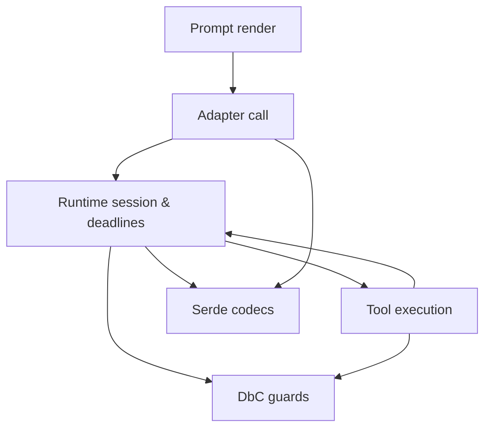

# Architecture Overview

This document sketches how the major packages in `src/weakincentives/` cooperate.
It summarizes responsibilities, data flows, and the specs that define contracts
for each layer.

## Roles and Dependencies

| Package | Core Responsibilities | Upstream Inputs | Downstream Dependencies | Key Specs |
| --- | --- | --- | --- | --- |
| `prompt/` | Defines `Prompt`, `Section`, and `Chapter` primitives; renders markdown and tool descriptors; injects structured-output instructions. | Dataclass parameters; tool definitions; override payloads. | Adapters request renders; runtime publishes `PromptRendered`; tools contributed via sections. | [Prompt Overview](PROMPTS.md), [Prompt Composition](PROMPTS_COMPOSITION.md), [Chapters](CHAPTERS.md), [Structured Output](STRUCTURED_OUTPUT.md), [Prompt Overrides](PROMPT_OVERRIDES.md) |
| `runtime/` | Owns sessions, event bus, scheduling, and deadline enforcement so runs are observable and cancellable. | Rendered prompts; tool invocations; adapter responses. | `Session` slices feed tool/state selectors; adapters consume event hooks; serde converts payloads. | [Sessions](SESSIONS.md), [Events](EVENTS.md), [Deadlines](DEADLINES.md), [Logging](LOGGING.md), [Thread Safety](THREAD_SAFETY.md) |
| `tools/` | Built-in, typed tool suites (planning, VFS, asteval) plus helpers for registering reducers and prompts. | `Session` for telemetry; runtime bus; prompt sections for tool exposure. | Adapters negotiate tool calls; serde encodes tool schemas; runtime records `ToolInvoked`. | [Tools](TOOLS.md), [Planning Tools](PLANNING_TOOL.md), [VFS Tools](VFS_TOOLS.md), [Asteval](ASTEVAL.md), [Workspace Digests](WORKSPACE_DIGEST.md) |
| `adapters/` | Provider bridges that translate prompts and tool contracts into API calls, normalize responses, and emit events. | Rendered prompts; tool schemas; runtime configuration (deadlines, logging). | Publish `PromptExecuted`/`ToolInvoked`; rely on serde for schema building; leverage dbc for contract checks. | [Adapter Spec](ADAPTERS.md), [LiteLLM Adapter](LITE_LLM_ADAPTER.md), [Native OpenAI Structured Outputs](NATIVE_OPENAI_STRUCTURED_OUTPUTS.md) |
| `dbc/` | Contract decorators (`@require`, `@ensure`, `@invariant`, `@pure`) and enforcement helpers that keep APIs defensive. | Function/class definitions across all packages. | Fail fast during prompt/render/tool/runtime execution; tests assert on contract behavior. | [Design by Contract](DBC.md) |
| `serde/` | Serialization helpers for dataclasses, structured tool params/results, and prompt descriptors. | Dataclasses from prompt, tools, runtime events. | Adapters use codecs when forming payloads; runtime/session snapshots rely on serde; tooling uses descriptors for overrides. | [Dataclass Serde](DATACLASS_SERDE.md), [Structured Output](STRUCTURED_OUTPUT.md), [Native OpenAI Structured Outputs](NATIVE_OPENAI_STRUCTURED_OUTPUTS.md) |

### High-Level Flow

- **Prompts** render markdown plus tool descriptors that adapters pass to model
  providers. Chapters and overrides gate visibility without changing code
  paths.
- **Runtime** orchestrates the event bus and sessions so prompt renders,
  tool calls, and final responses emit `PromptRendered`, `ToolInvoked`, and
  `PromptExecuted` events for reducers and observers.
- **Tools** register reducers with the runtime session and surface
  `Tool` definitions through prompt sections, keeping telemetry and VFS state in
  sync.
- **Adapters** apply provider-specific negotiation (tool schemas, response
  formats), enforce deadlines/logging, and translate results back into runtime
  events and structured outputs.
- **Serde** builds JSON schemas and encodes/decodes dataclasses for tool params,
  structured outputs, session snapshots, and prompt descriptors.
- **DbC** wraps public APIs with pre/post/invariant checks so invalid inputs are
  rejected early across prompt, runtime, tool, adapter, and serde layers.

## Key Interactions

- **Tool exposure**: Tool suites supply prompt sections that inject tool
  descriptors; adapters use those descriptors during tool negotiation. See
  [Tools](TOOLS.md) and [Adapter Spec](ADAPTERS.md).
- **Structured outputs**: Prompts attach response-format sections; adapters
  request JSON/typed responses; serde parses payloads back into output
  dataclasses. Contracts live in [Structured Output](STRUCTURED_OUTPUT.md) and
  [Native OpenAI Structured Outputs](NATIVE_OPENAI_STRUCTURED_OUTPUTS.md).
- **State and telemetry**: Runtime sessions listen for prompt execution events
  and tool invocations emitted by adapters and tools. Reducers keep slices
  immutable and rollback-ready per [Sessions](SESSIONS.md) and [Events](EVENTS.md).
- **Contracts everywhere**: DbC decorators guard public entrypoints while tests
  and tooling rely on predictable assertion errors; guidance lives in [DBC](DBC.md).
- **Serialization**: Serde codecs convert session snapshots, prompt descriptors,
  and tool params/results into stable JSON for overrides, caching, and replay as
  defined in [Dataclass Serde](DATACLASS_SERDE.md).
