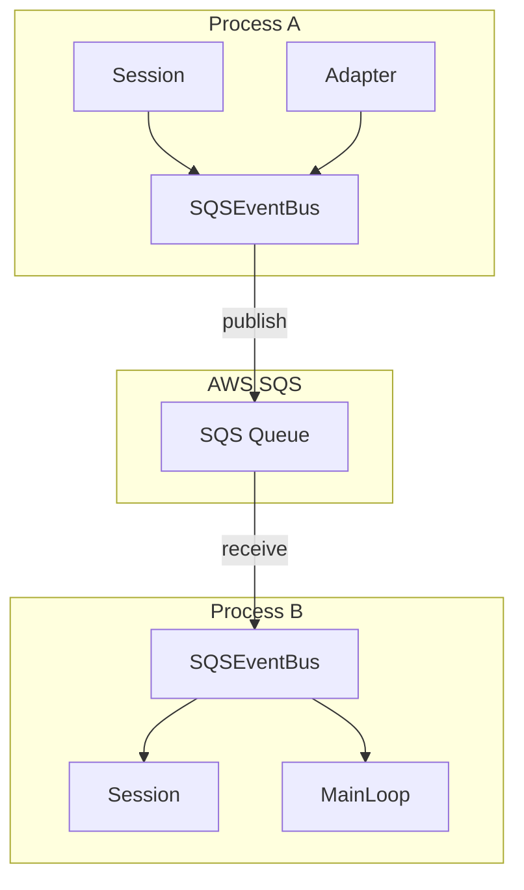
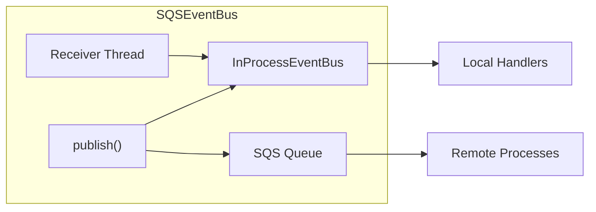
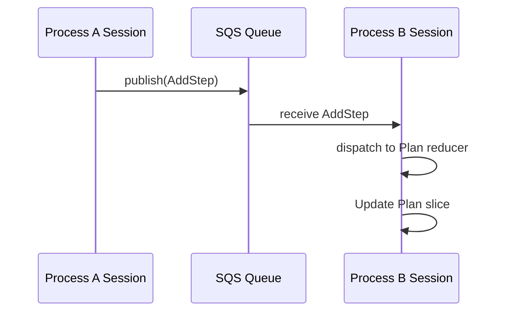
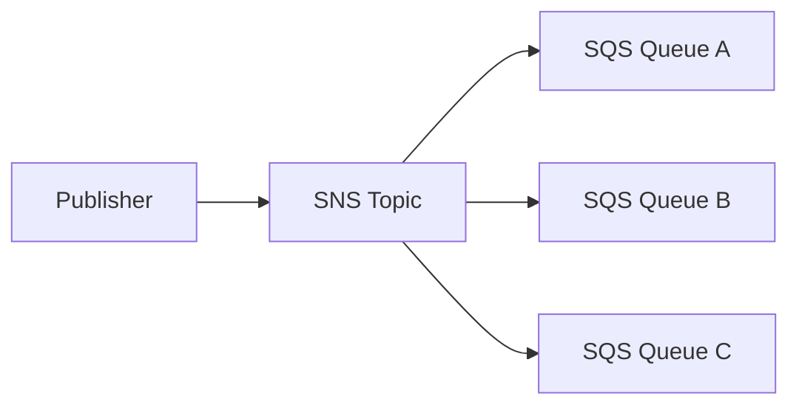

# AWS SQS Event Bus Specification

## Purpose

This specification defines how to integrate AWS SQS as an event bus backend for
cross-process event distribution. The `SQSEventBus` implementation enables
distributed agent orchestration where multiple processes can share session
telemetry and coordinate via control events. This extends the existing
`EventBus` protocol to support durable, distributed messaging while preserving
the synchronous publish semantics expected by adapters and sessions.

## Guiding Principles

- **Protocol compatibility**: `SQSEventBus` implements the `EventBus` protocol;
  callers remain unaware of the transport layer.
- **At-least-once delivery**: SQS guarantees at-least-once delivery; handlers
  must be idempotent or use deduplication.
- **Eventual consistency**: Cross-process events arrive asynchronously; local
  handlers still execute synchronously on the publisher thread.
- **Fail predictable**: Network errors surface as `PublishResult` failures, not
  silent drops. Handlers can check `result.ok` to detect issues.
- **Observable by default**: Publish and receive operations emit structured logs
  for tracing distributed event flows.



## Core Components

### SQSEventBus

```python
class SQSEventBus(EventBus):
    def __init__(
        self,
        *,
        queue_url: str,
        client: SQSClient | None = None,
        config: SQSEventBusConfig | None = None,
        local_bus: EventBus | None = None,
    ) -> None: ...

    def subscribe(self, event_type: type[object], handler: EventHandler) -> None: ...

    def unsubscribe(self, event_type: type[object], handler: EventHandler) -> bool: ...

    def publish(self, event: object) -> PublishResult: ...

    def start_receiver(self) -> None:
        """Start background thread that polls SQS and dispatches to local handlers."""

    def stop_receiver(self, *, timeout: float = 5.0) -> None:
        """Stop the receiver thread gracefully."""

    def receive_once(self) -> list[object]:
        """Poll SQS once and dispatch received events. For testing and manual control."""
```

### SQSEventBusConfig

```python
@FrozenDataclass()
class SQSEventBusConfig:
    """Configuration for SQS-backed event bus."""

    # Receive settings
    max_messages_per_poll: int = 10
    wait_time_seconds: int = 20  # Long polling (0-20)
    visibility_timeout_seconds: int = 30
    poll_interval_seconds: float = 0.1  # Delay between polls when queue is empty

    # Publish settings
    publish_timeout_seconds: float = 5.0
    publish_retries: int = 3
    publish_retry_delay_seconds: float = 0.5

    # Serialization
    message_group_id: str | None = None  # For FIFO queues

    # Filtering (optional)
    event_type_allowlist: frozenset[type[object]] | None = None
    event_type_blocklist: frozenset[type[object]] | None = None

    # Deduplication
    enable_deduplication: bool = True
    deduplication_window_seconds: int = 300  # 5 minutes
```

### SQSClient Protocol

```python
class SQSClient(Protocol):
    """Protocol for SQS client to enable testing with fakes."""

    def send_message(
        self,
        QueueUrl: str,
        MessageBody: str,
        MessageAttributes: dict[str, Any] | None = None,
        MessageGroupId: str | None = None,
        MessageDeduplicationId: str | None = None,
    ) -> dict[str, Any]: ...

    def receive_message(
        self,
        QueueUrl: str,
        MaxNumberOfMessages: int = 1,
        WaitTimeSeconds: int = 0,
        VisibilityTimeout: int = 30,
        MessageAttributeNames: list[str] | None = None,
    ) -> dict[str, Any]: ...

    def delete_message(
        self,
        QueueUrl: str,
        ReceiptHandle: str,
    ) -> dict[str, Any]: ...
```

## Architecture

### Dual-Bus Pattern

`SQSEventBus` wraps a local `InProcessEventBus` for synchronous handler
dispatch. Published events go to both the local bus (immediate) and SQS
(distributed). Received events from SQS dispatch through the local bus.



### Publish Flow

```python
def publish(self, event: object) -> PublishResult:
    # 1. Dispatch to local handlers synchronously
    local_result = self._local_bus.publish(event)

    # 2. Serialize and send to SQS
    try:
        message_body = self._serialize(event)
        self._client.send_message(
            QueueUrl=self._queue_url,
            MessageBody=message_body,
            MessageAttributes=self._build_attributes(event),
            MessageDeduplicationId=self._dedup_id(event) if self._config.enable_deduplication else None,
        )
    except Exception as e:
        # Return combined result with SQS failure
        return PublishResult(
            event=event,
            handlers_invoked=local_result.handlers_invoked,
            errors=local_result.errors + (HandlerFailure(handler=self._sqs_publish, error=e),),
        )

    return local_result
```

### Receive Flow

```python
def _receive_loop(self) -> None:
    while self._running:
        response = self._client.receive_message(
            QueueUrl=self._queue_url,
            MaxNumberOfMessages=self._config.max_messages_per_poll,
            WaitTimeSeconds=self._config.wait_time_seconds,
            VisibilityTimeout=self._config.visibility_timeout_seconds,
            MessageAttributeNames=["All"],
        )

        for message in response.get("Messages", []):
            try:
                event = self._deserialize(message["Body"])
                if self._should_dispatch(event):
                    self._local_bus.publish(event)
                self._client.delete_message(
                    QueueUrl=self._queue_url,
                    ReceiptHandle=message["ReceiptHandle"],
                )
            except Exception as e:
                logger.error("Failed to process SQS message", exc_info=e)
                # Message returns to queue after visibility timeout
```

## Message Serialization

Events are serialized using the existing `weakincentives.serde` module to
maintain consistency with session snapshots.

### Message Format

```json
{
  "event_type": "weakincentives.runtime.events:ToolInvoked",
  "event_id": "550e8400-e29b-41d4-a716-446655440000",
  "created_at": "2025-01-15T10:30:00.000000+00:00",
  "publisher_id": "process-abc-123",
  "payload": {
    "prompt_name": "code-review",
    "adapter": "openai",
    "name": "search_files",
    "params": {"pattern": "*.py"},
    "result": {"files": ["main.py"]},
    "session_id": "660e8400-e29b-41d4-a716-446655440001"
  }
}
```

### Message Attributes

SQS message attributes enable server-side filtering without deserializing:

| Attribute | Type | Description |
|-----------|------|-------------|
| `EventType` | String | Fully qualified event type name |
| `SessionId` | String | Session UUID for routing |
| `PublisherId` | String | Source process identifier |
| `CreatedAt` | String | ISO 8601 timestamp |

### Serialization Implementation

```python
def _serialize(self, event: object) -> str:
    return json.dumps({
        "event_type": fully_qualified_name(type(event)),
        "event_id": str(getattr(event, "event_id", uuid4())),
        "created_at": datetime.now(UTC).isoformat(),
        "publisher_id": self._publisher_id,
        "payload": serde.to_dict(event),
    })

def _deserialize(self, body: str) -> object:
    data = json.loads(body)
    event_cls = resolve_type(data["event_type"])
    return serde.from_dict(event_cls, data["payload"])
```

## Session Integration

### TelemetryBus Usage

Sessions accept `SQSEventBus` as their telemetry bus for distributed
observability:

```python
from weakincentives.runtime.events.sqs import SQSEventBus, SQSEventBusConfig
from weakincentives.runtime.session import Session

# Create distributed bus
config = SQSEventBusConfig(
    max_messages_per_poll=10,
    wait_time_seconds=20,
)
bus = SQSEventBus(
    queue_url="https://sqs.us-east-1.amazonaws.com/123456789/agent-events",
    config=config,
)
bus.start_receiver()

# Create session with distributed bus
session = Session(bus=bus)

# Events from adapter.evaluate() now broadcast to all processes
response = adapter.evaluate(prompt, session=session)

# Cleanup
bus.stop_receiver()
```

### Cross-Process Reducer Dispatch

When events arrive from SQS, they dispatch through the local bus to session
reducers. Sessions in different processes can maintain synchronized state slices
by registering identical reducers.



**Consistency caveat:** SQS provides at-least-once delivery with no ordering
guarantees (standard queues). For strict ordering, use FIFO queues with
`message_group_id`. Even with FIFO, cross-process state may diverge under
network partitions.

### Event Filtering

Sessions can filter which events propagate to SQS:

```python
config = SQSEventBusConfig(
    # Only send telemetry events, not data events
    event_type_allowlist=frozenset({PromptRendered, PromptExecuted, ToolInvoked}),
)
```

## MainLoop Integration

### ControlBus Usage

`MainLoop` uses the event bus for request/response orchestration. With
`SQSEventBus`, requests can be submitted from any process:

```python
from weakincentives.runtime import MainLoop
from weakincentives.runtime.events.sqs import SQSEventBus

# Worker process
control_bus = SQSEventBus(
    queue_url="https://sqs.us-east-1.amazonaws.com/123456789/mainloop-control",
)
control_bus.start_receiver()

loop = CodeReviewLoop(adapter=adapter, bus=control_bus)
# Loop now handles MainLoopRequest from any process

# Submitter process (separate)
submitter_bus = SQSEventBus(
    queue_url="https://sqs.us-east-1.amazonaws.com/123456789/mainloop-control",
)

def on_completed(event: object) -> None:
    if isinstance(event, MainLoopCompleted):
        print(f"Request {event.request_id} completed")

submitter_bus.subscribe(MainLoopCompleted, on_completed)
submitter_bus.start_receiver()

# Submit request
submitter_bus.publish(MainLoopRequest(request=ReviewRequest(...)))
```

### Request/Response Correlation

Since SQS is unidirectional, request/response correlation uses event IDs:

```python
@dataclass(frozen=True)
class PendingRequest:
    request_id: UUID
    future: Future[MainLoopCompleted]
    submitted_at: datetime

class SQSMainLoopClient:
    """Client for submitting requests to a remote MainLoop."""

    def __init__(self, *, request_bus: SQSEventBus, response_bus: SQSEventBus) -> None:
        self._request_bus = request_bus
        self._response_bus = response_bus
        self._pending: dict[UUID, PendingRequest] = {}
        self._lock = Lock()

        response_bus.subscribe(MainLoopCompleted, self._on_completed)
        response_bus.subscribe(MainLoopFailed, self._on_failed)

    def submit(
        self,
        request: UserRequestT,
        *,
        timeout: float = 300.0,
    ) -> MainLoopCompleted:
        request_event = MainLoopRequest(request=request)
        future: Future[MainLoopCompleted] = Future()

        with self._lock:
            self._pending[request_event.request_id] = PendingRequest(
                request_id=request_event.request_id,
                future=future,
                submitted_at=datetime.now(UTC),
            )

        self._request_bus.publish(request_event)
        return future.result(timeout=timeout)

    def _on_completed(self, event: object) -> None:
        completed = cast(MainLoopCompleted, event)
        with self._lock:
            pending = self._pending.pop(completed.request_id, None)
        if pending:
            pending.future.set_result(completed)
```

### Separate Queues Pattern

For production deployments, use separate queues for different event streams:

| Queue | Purpose | Events |
|-------|---------|--------|
| `agent-control` | MainLoop orchestration | `MainLoopRequest`, `MainLoopCompleted`, `MainLoopFailed` |
| `agent-telemetry` | Session observability | `PromptRendered`, `ToolInvoked`, `PromptExecuted` |
| `agent-state` | State synchronization | Reducer events (`AddStep`, `UpdateStep`, etc.) |

```python
control_bus = SQSEventBus(queue_url="https://.../agent-control")
telemetry_bus = SQSEventBus(queue_url="https://.../agent-telemetry")

loop = MyMainLoop(adapter=adapter, bus=control_bus)
session = Session(bus=telemetry_bus)
```

## Delivery Semantics

### At-Least-Once Delivery

SQS standard queues provide at-least-once delivery. Messages may be delivered
multiple times during retries or infrastructure issues. Handlers must be
idempotent.

**Idempotency strategies:**

1. **Event ID deduplication** - Track processed `event_id` values in a cache
   with TTL matching the deduplication window.

2. **Conditional updates** - Use version numbers or timestamps in reducer logic
   to ignore stale events.

3. **FIFO queues** - Enable content-based deduplication for exact-once delivery
   within the 5-minute window.

```python
class DeduplicatingEventBus:
    """Wrapper that deduplicates received events by event_id."""

    def __init__(self, *, inner: SQSEventBus, cache: DeduplicationCache) -> None:
        self._inner = inner
        self._cache = cache

    def _deduplicate_handler(self, handler: EventHandler) -> EventHandler:
        def wrapper(event: object) -> None:
            event_id = getattr(event, "event_id", None)
            if event_id and self._cache.seen(event_id):
                return
            handler(event)
            if event_id:
                self._cache.mark_seen(event_id)
        return wrapper
```

### Ordering Guarantees

| Queue Type | Ordering | Use Case |
|------------|----------|----------|
| Standard | Best-effort, no guarantee | Telemetry, independent events |
| FIFO | Strict per message group | State synchronization, control flow |

For FIFO queues, set `message_group_id` to the session ID for per-session
ordering:

```python
config = SQSEventBusConfig(
    message_group_id="${session_id}",  # Template replaced at publish time
)
```

### Visibility Timeout

Configure visibility timeout based on handler execution time:

```python
config = SQSEventBusConfig(
    visibility_timeout_seconds=60,  # Handlers have 60s to complete
)
```

If handlers exceed the timeout, the message returns to the queue and may be
processed again. Set visibility timeout to at least 2x the expected handler
duration.

## Error Handling

### Publish Failures

Publish failures are captured in `PublishResult`:

```python
result = bus.publish(event)
if not result.ok:
    for failure in result.errors:
        if isinstance(failure.error, BotoCoreError):
            # SQS connectivity issue
            logger.error("SQS publish failed", error=failure.error)
        else:
            # Local handler failure
            logger.error("Handler failed", handler=failure.handler, error=failure.error)
```

### Receive Failures

The receiver thread handles failures gracefully:

| Failure Type | Behavior |
|--------------|----------|
| Deserialization error | Log, delete message (poison pill) |
| Handler exception | Log, message returns to queue |
| Unknown event type | Log, delete message |
| SQS API error | Log, exponential backoff, retry |

### Dead Letter Queue

Configure a DLQ for messages that fail repeatedly:

```python
# AWS Console or IaC configuration
# After 3 receive attempts, move to DLQ
```

Monitor the DLQ for systemic issues like schema mismatches or broken handlers.

### Circuit Breaker

For high-volume deployments, implement circuit breaking:

```python
@FrozenDataclass()
class CircuitBreakerConfig:
    failure_threshold: int = 5
    recovery_timeout_seconds: float = 30.0
    half_open_requests: int = 1

class SQSEventBusWithCircuitBreaker(SQSEventBus):
    def publish(self, event: object) -> PublishResult:
        if self._circuit_breaker.is_open:
            return PublishResult(
                event=event,
                handlers_invoked=(),
                errors=(HandlerFailure(handler=self._sqs_publish, error=CircuitOpenError()),),
            )
        # ... normal publish
```

## Thread Safety

### Concurrency Model

`SQSEventBus` is thread-safe for concurrent publish and subscribe operations:

- Local bus operations protected by `RLock` (inherited from `InProcessEventBus`)
- SQS client calls are thread-safe (boto3 clients are thread-safe)
- Receiver thread runs independently, dispatching to local bus

### Receiver Thread Lifecycle

```python
def start_receiver(self) -> None:
    with self._lock:
        if self._receiver_thread is not None:
            raise RuntimeError("Receiver already started")
        self._running = True
        self._receiver_thread = Thread(target=self._receive_loop, daemon=True)
        self._receiver_thread.start()

def stop_receiver(self, *, timeout: float = 5.0) -> None:
    with self._lock:
        self._running = False
        thread = self._receiver_thread
        self._receiver_thread = None

    if thread:
        thread.join(timeout=timeout)
        if thread.is_alive():
            logger.warning("Receiver thread did not stop within timeout")
```

### Handler Execution Context

Handlers invoked by the receiver thread run on that thread, not the original
publisher thread. Session and reducer operations are thread-safe, but
user-provided handlers must handle their own synchronization if accessing shared
state.

## Configuration

### AWS Credentials

`SQSEventBus` uses the standard boto3 credential chain:

1. Environment variables (`AWS_ACCESS_KEY_ID`, `AWS_SECRET_ACCESS_KEY`)
2. Shared credentials file (`~/.aws/credentials`)
3. IAM role (EC2, ECS, Lambda)
4. Container credentials (ECS task role)

```python
import boto3

# Explicit credentials
client = boto3.client(
    "sqs",
    aws_access_key_id="...",
    aws_secret_access_key="...",
    region_name="us-east-1",
)
bus = SQSEventBus(queue_url="...", client=client)

# Default credential chain
bus = SQSEventBus(queue_url="...")  # Creates client internally
```

### IAM Permissions

Required permissions for `SQSEventBus`:

```json
{
  "Version": "2012-10-17",
  "Statement": [
    {
      "Effect": "Allow",
      "Action": [
        "sqs:SendMessage",
        "sqs:ReceiveMessage",
        "sqs:DeleteMessage",
        "sqs:GetQueueAttributes"
      ],
      "Resource": "arn:aws:sqs:*:*:agent-*"
    }
  ]
}
```

### Queue Configuration

Recommended queue settings:

| Setting | Standard Queue | FIFO Queue |
|---------|----------------|------------|
| Visibility Timeout | 30-60 seconds | 30-60 seconds |
| Message Retention | 4-14 days | 4-14 days |
| Receive Wait Time | 20 seconds | 20 seconds |
| Content-Based Dedup | N/A | Enabled |
| Deduplication Scope | N/A | messageGroup |

### Environment Variables

| Variable | Description | Default |
|----------|-------------|---------|
| `WINK_SQS_QUEUE_URL` | Default queue URL | None |
| `WINK_SQS_POLL_INTERVAL` | Seconds between polls | 0.1 |
| `WINK_SQS_VISIBILITY_TIMEOUT` | Visibility timeout | 30 |
| `WINK_SQS_PUBLISHER_ID` | Process identifier | Auto-generated UUID |

## Testing

### Unit Tests

Use the `SQSClient` protocol to inject fakes:

```python
class FakeSQSClient:
    def __init__(self) -> None:
        self.messages: list[dict[str, Any]] = []
        self.deleted: list[str] = []

    def send_message(self, **kwargs: Any) -> dict[str, Any]:
        message_id = str(uuid4())
        self.messages.append({
            "MessageId": message_id,
            "Body": kwargs["MessageBody"],
            "ReceiptHandle": f"handle-{message_id}",
        })
        return {"MessageId": message_id}

    def receive_message(self, **kwargs: Any) -> dict[str, Any]:
        if not self.messages:
            return {"Messages": []}
        return {"Messages": [self.messages.pop(0)]}

    def delete_message(self, **kwargs: Any) -> dict[str, Any]:
        self.deleted.append(kwargs["ReceiptHandle"])
        return {}


def test_publish_sends_to_sqs() -> None:
    fake_client = FakeSQSClient()
    bus = SQSEventBus(queue_url="http://fake", client=fake_client)

    event = PromptExecuted(prompt_name="test", ...)
    result = bus.publish(event)

    assert result.ok
    assert len(fake_client.messages) == 1
    assert "PromptExecuted" in fake_client.messages[0]["Body"]
```

### Integration Tests

Test against LocalStack or real SQS:

```python
import pytest
import boto3

@pytest.fixture
def sqs_queue() -> str:
    client = boto3.client("sqs", endpoint_url="http://localhost:4566")
    response = client.create_queue(QueueName=f"test-{uuid4()}")
    yield response["QueueUrl"]
    client.delete_queue(QueueUrl=response["QueueUrl"])


def test_round_trip(sqs_queue: str) -> None:
    bus = SQSEventBus(queue_url=sqs_queue)
    received: list[object] = []

    bus.subscribe(PromptExecuted, received.append)
    bus.start_receiver()

    try:
        event = PromptExecuted(prompt_name="test", ...)
        bus.publish(event)

        # Wait for async receive
        for _ in range(50):
            if received:
                break
            time.sleep(0.1)

        assert len(received) == 1
        assert received[0].prompt_name == "test"
    finally:
        bus.stop_receiver()
```

### Stress Tests

Verify thread safety under concurrent publishes:

```python
@pytest.mark.threadstress
def test_concurrent_publishes(sqs_queue: str) -> None:
    bus = SQSEventBus(queue_url=sqs_queue)
    errors: list[Exception] = []

    def publisher(n: int) -> None:
        for i in range(100):
            try:
                bus.publish(PromptExecuted(prompt_name=f"test-{n}-{i}", ...))
            except Exception as e:
                errors.append(e)

    threads = [Thread(target=publisher, args=(i,)) for i in range(10)]
    for t in threads:
        t.start()
    for t in threads:
        t.join()

    assert not errors
```

## Usage Examples

### Distributed Code Review

```python
# Worker process (handles requests)
control_bus = SQSEventBus(queue_url=os.environ["CONTROL_QUEUE_URL"])
telemetry_bus = SQSEventBus(queue_url=os.environ["TELEMETRY_QUEUE_URL"])

control_bus.start_receiver()
telemetry_bus.start_receiver()

loop = CodeReviewLoop(adapter=adapter, bus=control_bus)

# Keep worker alive
try:
    while True:
        time.sleep(1)
except KeyboardInterrupt:
    control_bus.stop_receiver()
    telemetry_bus.stop_receiver()
```

```python
# API process (submits requests)
control_bus = SQSEventBus(queue_url=os.environ["CONTROL_QUEUE_URL"])

@app.post("/reviews")
async def create_review(request: ReviewRequest) -> dict[str, str]:
    request_event = MainLoopRequest(request=request)
    result = control_bus.publish(request_event)
    if not result.ok:
        raise HTTPException(status_code=503, detail="Failed to queue request")
    return {"request_id": str(request_event.request_id)}
```

### Telemetry Aggregation

```python
# Aggregator process (collects telemetry from all workers)
telemetry_bus = SQSEventBus(queue_url=os.environ["TELEMETRY_QUEUE_URL"])

metrics = MetricsCollector()

telemetry_bus.subscribe(PromptExecuted, metrics.record_prompt)
telemetry_bus.subscribe(ToolInvoked, metrics.record_tool)
telemetry_bus.start_receiver()

# Metrics now aggregate across all worker processes
```

### Session State Synchronization

```python
# Two processes maintaining synchronized plan state
@dataclass(frozen=True)
class Plan:
    steps: tuple[str, ...]

    @reducer(on=AddStep)
    def add_step(self, event: AddStep) -> Plan:
        return replace(self, steps=self.steps + (event.step,))

# Process A
bus_a = SQSEventBus(queue_url=os.environ["STATE_QUEUE_URL"])
bus_a.start_receiver()
session_a = Session(bus=bus_a)
session_a.install(Plan)
session_a[Plan].seed(Plan(steps=()))

# Process B
bus_b = SQSEventBus(queue_url=os.environ["STATE_QUEUE_URL"])
bus_b.start_receiver()
session_b = Session(bus=bus_b)
session_b.install(Plan)
session_b[Plan].seed(Plan(steps=()))

# When A broadcasts AddStep, both sessions update
session_a.broadcast(AddStep(step="Research"))
# After SQS propagation, session_b[Plan].latest() also has "Research"
```

## Limitations

- **Async gap**: The receiver thread introduces async behavior; local handlers
  run synchronously but cross-process delivery is eventually consistent.
- **No transactions**: Publishing to SQS and local bus are not atomic; one may
  succeed while the other fails.
- **Message size**: SQS limits messages to 256 KB; large events require S3
  extended client pattern.
- **Latency**: SQS adds network latency; not suitable for sub-millisecond
  requirements.
- **Cost**: High-volume telemetry incurs SQS charges; consider batching or
  sampling.
- **FIFO throughput**: FIFO queues limited to 300 messages/second per message
  group (3000 with high throughput mode).
- **No message filtering**: All subscribers receive all messages; filtering
  happens after deserialization (use SNS+SQS for server-side filtering).
- **Clock skew**: Event timestamps use publisher clock; cross-process ordering
  depends on synchronized clocks.

## Future Considerations

### SNS Fan-Out

For true pub/sub with multiple subscriber queues:



### Kinesis for High Volume

For high-throughput telemetry with ordering:

- Kinesis Data Streams for ordered, high-volume event streams
- Kinesis Data Firehose for S3/Redshift delivery
- Maintain EventBus protocol compatibility via `KinesisEventBus`

### EventBridge Integration

For event routing and transformation:

- EventBridge rules for content-based routing
- Schema registry for event validation
- Archive and replay for debugging
