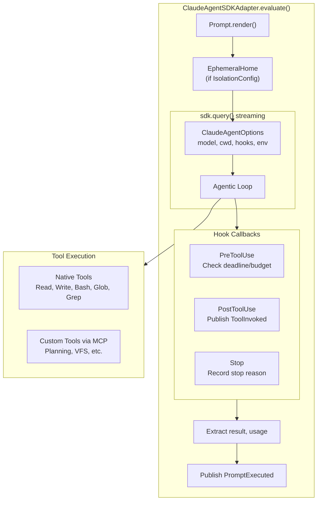
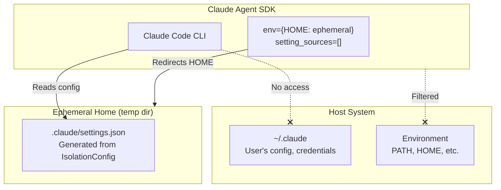
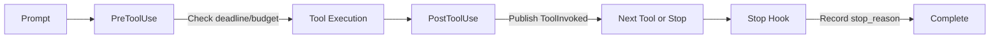

# Claude Agent SDK Adapter Specification

> **SDK Version**: `claude-agent-sdk>=0.1.15`

## User Stories

This section provides practical examples for common use cases. Each story shows
a complete, working code snippet you can adapt for your application.

### Story 1: Secure Code Review with Network-Isolated Sandbox

Review code in a fully isolated environment with no network access except to
the Anthropic API. The agent cannot leak data or access external services.

```python
import os
from weakincentives import Prompt, MarkdownSection, PromptTemplate
from weakincentives.runtime import Session, InProcessEventBus
from weakincentives.adapters.claude_agent_sdk import (
    ClaudeAgentSDKAdapter,
    ClaudeAgentSDKClientConfig,
    ClaudeAgentWorkspaceSection,
    HostMount,
    IsolationConfig,
    NetworkPolicy,
    SandboxConfig,
)

# Create session
bus = InProcessEventBus()
session = Session(bus=bus)

# Mount your codebase into a temporary workspace
workspace = ClaudeAgentWorkspaceSection(
    session=session,
    mounts=[
        HostMount(
            host_path="/path/to/your/project",
            mount_path="project",
            exclude_glob=("*.pyc", "__pycache__/*", ".git/*"),
            max_bytes=5_000_000,  # 5MB limit
        ),
    ],
    allowed_host_roots=["/path/to/your"],
)

# Configure hermetic isolation with API-only network access
adapter = ClaudeAgentSDKAdapter(
    model="claude-sonnet-4-5-20250929",
    client_config=ClaudeAgentSDKClientConfig(
        permission_mode="bypassPermissions",
        cwd=str(workspace.temp_dir),
        isolation=IsolationConfig(
            network_policy=NetworkPolicy.api_only(),
            sandbox=SandboxConfig(
                enabled=True,
                readable_paths=(str(workspace.temp_dir),),
            ),
        ),
    ),
)

# Build and run the prompt
template = PromptTemplate[dict](
    ns="review",
    key="security",
    sections=[
        MarkdownSection(
            title="Task",
            key="task",
            template="Review the code in project/ for security vulnerabilities.",
        ),
        workspace,
    ],
)
prompt = Prompt(template)
response = adapter.evaluate(prompt, session=session)

print(response.text)
workspace.cleanup()
```

### Story 2: Documentation Assistant with Web Access

Build an assistant that can fetch Python documentation to answer questions
accurately. Allows access to specific documentation domains.

```python
from weakincentives.adapters.claude_agent_sdk import (
    ClaudeAgentSDKAdapter,
    ClaudeAgentSDKClientConfig,
    IsolationConfig,
    NetworkPolicy,
    SandboxConfig,
)

# Define allowed documentation domains
DOCS_DOMAINS = (
    "api.anthropic.com",      # Required for API
    "docs.python.org",        # Python docs
    "peps.python.org",        # PEP documents
    "typing.readthedocs.io",  # Typing docs
    "pypi.org",               # Package info
)

adapter = ClaudeAgentSDKAdapter(
    client_config=ClaudeAgentSDKClientConfig(
        isolation=IsolationConfig(
            network_policy=NetworkPolicy(allowed_domains=DOCS_DOMAINS),
            sandbox=SandboxConfig(enabled=True, bash_auto_allow=True),
        ),
    ),
)
```

### Story 3: Local Development with Full Access

For development and testing, run with minimal restrictions while still
protecting your Claude Code configuration.

```python
from weakincentives.adapters.claude_agent_sdk import (
    ClaudeAgentSDKAdapter,
    ClaudeAgentSDKClientConfig,
    IsolationConfig,
    NetworkPolicy,
    SandboxConfig,
)

adapter = ClaudeAgentSDKAdapter(
    client_config=ClaudeAgentSDKClientConfig(
        isolation=IsolationConfig(
            # Allow all network access (development only!)
            network_policy=NetworkPolicy(
                allowed_domains=("*",),
                allow_localhost=True,  # For local services
            ),
            # Disable sandbox for full filesystem access
            sandbox=SandboxConfig(enabled=False),
            # Inherit PATH and other environment variables
            include_host_env=True,
        ),
    ),
)
```

### Story 4: CI/CD Pipeline Agent

Run automated tasks in CI with explicit API key management and no host
environment leakage.

```python
import os
from weakincentives.adapters.claude_agent_sdk import (
    ClaudeAgentSDKAdapter,
    ClaudeAgentSDKClientConfig,
    IsolationConfig,
    NetworkPolicy,
    SandboxConfig,
)

adapter = ClaudeAgentSDKAdapter(
    client_config=ClaudeAgentSDKClientConfig(
        cwd="/workspace",
        isolation=IsolationConfig(
            # Only API access
            network_policy=NetworkPolicy.api_only(),
            sandbox=SandboxConfig(
                enabled=True,
                writable_paths=("/workspace/output",),
            ),
            # Explicit API key from secret manager
            api_key=os.environ["ANTHROPIC_API_KEY"],
            # Don't inherit any host environment
            include_host_env=False,
        ),
    ),
)
```

### Story 5: Multi-Service Integration

Allow the agent to interact with specific internal services while blocking
everything else.

```python
from weakincentives.adapters.claude_agent_sdk import (
    ClaudeAgentSDKAdapter,
    ClaudeAgentSDKClientConfig,
    IsolationConfig,
    NetworkPolicy,
    SandboxConfig,
)

adapter = ClaudeAgentSDKAdapter(
    client_config=ClaudeAgentSDKClientConfig(
        isolation=IsolationConfig(
            network_policy=NetworkPolicy(
                allowed_domains=(
                    "api.anthropic.com",
                    "api.github.com",
                    "registry.npmjs.org",
                    "internal-api.company.com",
                ),
                allow_localhost=True,  # For local MCP servers
            ),
            sandbox=SandboxConfig(
                enabled=True,
                excluded_commands=("docker",),  # Allow docker commands
            ),
        ),
    ),
)
```

### Story 6: Completely Offline Agent

Run the agent with no network access at all. Useful for processing sensitive
data that must never leave the machine.

```python
from weakincentives.adapters.claude_agent_sdk import (
    ClaudeAgentSDKAdapter,
    ClaudeAgentSDKClientConfig,
    IsolationConfig,
    NetworkPolicy,
    SandboxConfig,
)

# Note: This requires a cached model or will fail
adapter = ClaudeAgentSDKAdapter(
    client_config=ClaudeAgentSDKClientConfig(
        isolation=IsolationConfig(
            network_policy=NetworkPolicy.no_network(),
            sandbox=SandboxConfig(enabled=True),
        ),
    ),
)
```

## Purpose

The Claude Agent SDK adapter enables weakincentives prompts to leverage Claude's
full agentic capabilities through the official `claude-agent-sdk` Python
package. The adapter uses SDK hooks to synchronize state between SDK execution
and the weakincentives Session, publishing events while delegating tool
execution to Claude Code's native tools.

## Architecture Overview



## Hermetic Isolation

When `IsolationConfig` is provided, the adapter creates an ephemeral home
directory that completely isolates SDK execution from the host's Claude Code
installation.



### What Isolation Guarantees

| Guarantee | Mechanism |
| ------------------------ | -------------------------------------------------- |
| No access to `~/.claude` | HOME redirected to ephemeral directory |
| No host credentials | `setting_sources=[]` prevents config file loading |
| Network restrictions | OS sandbox enforces domain allowlist |
| Filesystem isolation | Sandbox restricts access to workspace only |
| Clean environment | Sensitive env vars filtered by default |

### What Isolation Does NOT Guarantee

| Risk | Mitigation |
| ----------------------------- | ---------------------------------------------- |
| Process can see host PIDs | Use container isolation for full PID namespace |
| Shared /tmp (if not sandboxed)| Enable sandbox for temp directory isolation |
| API key visible in memory | Unavoidable—key must be passed to subprocess |

## Configuration Reference

### IsolationConfig

Controls hermetic isolation of SDK execution:

```python
@FrozenDataclass()
class IsolationConfig:
    network_policy: NetworkPolicy | None = None  # Network constraints
    sandbox: SandboxConfig | None = None         # OS-level sandbox
    env: Mapping[str, str] | None = None         # Extra env vars
    api_key: str | None = None                   # Explicit API key
    include_host_env: bool = False               # Inherit host env
```

### NetworkPolicy

Controls network access within the sandbox:

```python
@FrozenDataclass()
class NetworkPolicy:
    allowed_domains: tuple[str, ...] = ()        # Accessible domains
    allow_localhost: bool = False                # Allow 127.0.0.1
    allow_unix_sockets: bool = False             # Allow Unix sockets
    allowed_ports: tuple[int, ...] | None = None # Port restrictions

    @classmethod
    def no_network(cls) -> NetworkPolicy: ...    # Block all network
    @classmethod
    def api_only(cls) -> NetworkPolicy: ...      # Only api.anthropic.com
    @classmethod
    def with_domains(cls, *domains) -> NetworkPolicy: ...
```

### SandboxConfig

Controls OS-level sandboxing (bubblewrap on Linux, seatbelt on macOS):

```python
@FrozenDataclass()
class SandboxConfig:
    enabled: bool = True                         # Enable sandbox
    writable_paths: tuple[str, ...] = ()         # Extra writable paths
    readable_paths: tuple[str, ...] = ()         # Extra readable paths
    excluded_commands: tuple[str, ...] = ()      # Commands that bypass sandbox
    allow_unsandboxed_commands: bool = False     # Enable excluded_commands
    bash_auto_allow: bool = True                 # Auto-approve bash in sandbox
```

### ClaudeAgentSDKClientConfig

Client-level SDK configuration:

```python
@FrozenDataclass()
class ClaudeAgentSDKClientConfig:
    permission_mode: PermissionMode = "bypassPermissions"
    cwd: str | None = None
    max_turns: int | None = None
    suppress_stderr: bool = True
    stop_on_structured_output: bool = True
    isolation: IsolationConfig | None = None
```

### PermissionMode

```python
PermissionMode = Literal["default", "acceptEdits", "plan", "bypassPermissions"]
```

- `"bypassPermissions"`: Allow all tool use without prompts (recommended for
  automation)
- `"acceptEdits"`: Auto-accept file edits
- `"plan"`: Planning mode only
- `"default"`: Interactive permission prompts

## SDK API Integration

The adapter uses `sdk.query()` in **streaming mode** to enable hook support.
Prompts are converted to an async iterable format:

```python
async def stream_prompt():
    yield {
        "type": "user",
        "message": {"role": "user", "content": prompt_text},
        "parent_tool_use_id": None,
        "session_id": prompt_name,
    }

messages = [msg async for msg in sdk.query(prompt=stream_prompt(), options=options)]
```

## Hook Integration



### HookContext

Shared context passed to all hooks:

```python
class HookContext:
    session: SessionProtocol
    adapter_name: str = "claude_agent_sdk"
    prompt_name: str
    deadline: Deadline | None
    budget_tracker: BudgetTracker | None
    stop_reason: str | None  # Set by Stop hook
```

### PreToolUse Hook

Enforces deadline and budget constraints before each tool execution:

```python
async def pre_tool_use_hook(input_data, tool_use_id, sdk_context):
    if deadline and deadline.remaining().total_seconds() <= 0:
        return {"hookSpecificOutput": {
            "permissionDecision": "deny",
            "permissionDecisionReason": "Deadline exceeded",
        }}
    return {}  # Allow
```

### PostToolUse Hook

Records tool execution by publishing `ToolInvoked` events:

```python
async def post_tool_use_hook(input_data, tool_use_id, sdk_context):
    event = ToolInvoked(
        name=input_data.get("tool_name"),
        params=input_data.get("tool_input"),
        result=input_data.get("tool_response"),
        call_id=tool_use_id,
    )
    session.event_bus.publish(event)
    return {}
```

## Custom Tool Bridging

Weakincentives tools with handlers are bridged to the SDK via MCP servers:

```python
if bridged_tools:
    options_kwargs["mcp_servers"] = {
        "wink": create_mcp_server(bridged_tools),
    }
```

Each tool handler is wrapped to:

1. Parse arguments via `serde.parse()`
1. Build `ToolContext` with session/deadline/budget
1. Execute handler and call `result.render()` for output
1. Return MCP-format result

## Structured Output

The SDK supports JSON schema validation:

```python
output_format = {
    "type": "json_schema",
    "schema": schema(output_type),
}
```

Output is extracted from `ResultMessage.structured_output` and parsed via
`serde.parse()`.

## Error Handling

SDK exceptions are normalized to weakincentives error types:

| SDK Exception | weakincentives Error |
| ----------------------- | ----------------------- |
| `CLINotFoundError` | `PromptEvaluationError` |
| `CLIConnectionError` | `ThrottleError` |
| `ProcessError` | `PromptEvaluationError` |
| `MaxTurnsExceededError` | `PromptEvaluationError` |

## Events Published

| Event | When | Data |
| ---------------- | ----------------------- | ------------------------- |
| `PromptRendered` | After prompt render | Rendered text, tools |
| `ToolInvoked` | Each SDK tool execution | Tool name, params, result |
| `PromptExecuted` | After SDK completion | Output, usage, duration |

## File Structure

```
src/weakincentives/adapters/claude_agent_sdk/
├── __init__.py           # Public exports
├── adapter.py            # ClaudeAgentSDKAdapter
├── config.py             # ClaudeAgentSDKClientConfig, ModelConfig
├── isolation.py          # IsolationConfig, NetworkPolicy, SandboxConfig
├── workspace.py          # ClaudeAgentWorkspaceSection, HostMount
├── _hooks.py             # Hook implementations
├── _bridge.py            # MCP tool bridge
├── _async_utils.py       # Async/sync bridging
└── _errors.py            # Error normalization
```

## Dependencies

```toml
[project.optional-dependencies]
claude-agent-sdk = ["claude-agent-sdk>=0.1.15"]
```

Requires Claude Code CLI: `npm install -g @anthropic-ai/claude-code`

## Limitations

- **CLI dependency**: Requires Claude Code CLI installation
- **Async overhead**: `asyncio.run()` creates new event loop per call
- **Hook latency**: Each tool call incurs hook overhead
- **Sandbox platform support**:
  - Linux: bubblewrap (`bwrap`) must be installed
  - macOS: seatbelt (built-in, but limited vs Linux)
  - Windows: No sandbox support (isolation still redirects HOME)
- **Cleanup**: Abnormal termination may leave temp directories behind
