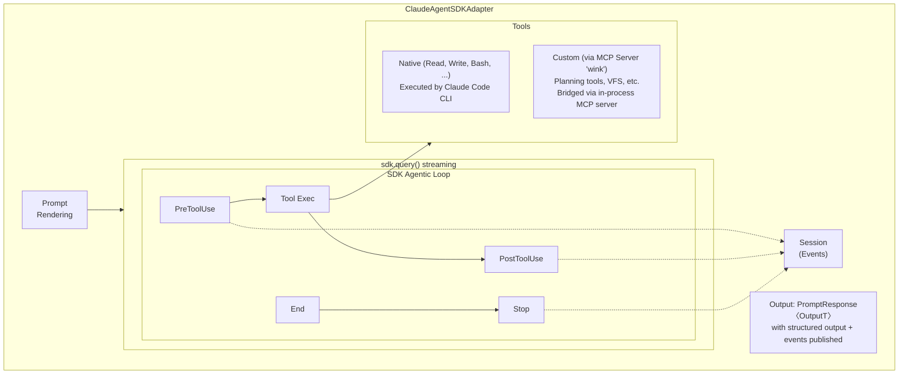
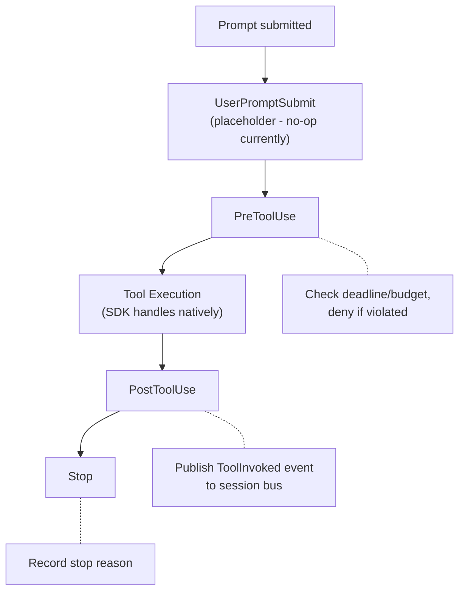
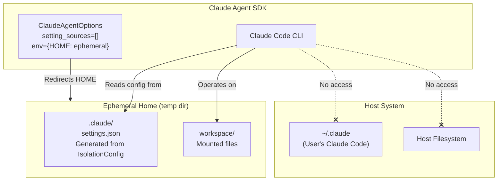

# Claude Agent SDK Adapter Specification

> **SDK Version**: `claude-agent-sdk>=0.1.15`

## Purpose

The Claude Agent SDK adapter enables weakincentives prompts to leverage Claude's
full agentic capabilities through the official `claude-agent-sdk` Python package.
The adapter uses SDK hooks to synchronize state between SDK execution and the
weakincentives Session, publishing events while delegating tool execution to
Claude Code's native tools.

## Architecture Overview



## SDK API Selection

The adapter uses `sdk.query()` in **streaming mode** for hook support. The SDK's
`query()` function only initializes hooks when `is_streaming_mode=True`, which
requires passing an `AsyncIterable` prompt instead of a string.

| Feature | `query()` (string) | `query()` (streaming) |
| -------------------- | ------------------ | --------------------- |
| Hooks | ❌ | ✅ |
| Custom Tools via MCP | ✅ | ✅ |
| One-shot queries | ✅ | ✅ |
| Lifecycle management | Automatic | Automatic |

The adapter converts prompts to streaming format:

```python
async def stream_prompt() -> AsyncIterator[dict[str, Any]]:
    yield {
        "type": "user",
        "message": {"role": "user", "content": prompt_text},
        "parent_tool_use_id": None,
        "session_id": prompt_name,
    }

messages = [msg async for msg in sdk.query(prompt=stream_prompt(), options=options)]
```

## Hook Integration

### Hook Event Flow



### HookContext

Shared context passed to all hooks:

```python
class HookContext:
    session: SessionProtocol      # Session for event publishing
    adapter_name: str             # "claude_agent_sdk"
    prompt_name: str              # For event attribution
    deadline: Deadline | None     # For deadline enforcement
    budget_tracker: BudgetTracker | None  # For budget enforcement
    stop_reason: str | None       # Set by Stop hook
```

### PreToolUse Hook

Enforces deadline and budget constraints before tool execution:

```python
async def pre_tool_use_hook(input_data, tool_use_id, sdk_context):
    # Check deadline
    if deadline and deadline.remaining().total_seconds() <= 0:
        return {
            "hookSpecificOutput": {
                "hookEventName": "PreToolUse",
                "permissionDecision": "deny",
                "permissionDecisionReason": "Deadline exceeded",
            }
        }

    # Check budget
    if budget_tracker and budget_tracker.consumed >= budget.max_total_tokens:
        return {
            "hookSpecificOutput": {
                "hookEventName": "PreToolUse",
                "permissionDecision": "deny",
                "permissionDecisionReason": "Token budget exhausted",
            }
        }

    return {}  # Allow tool execution
```

### PostToolUse Hook

Records tool execution by publishing `ToolInvoked` events:

```python
async def post_tool_use_hook(input_data, tool_use_id, sdk_context):
    # SDK provides tool_response, not tool_output
    # tool_response has keys: stdout, stderr, interrupted, isImage
    event = ToolInvoked(
        prompt_name=hook_context.prompt_name,
        adapter=hook_context.adapter_name,
        name=input_data.get("tool_name", ""),
        params=input_data.get("tool_input", {}),
        result=input_data.get("tool_response", {}),
        call_id=tool_use_id,
        # ... other fields
    )
    session.event_bus.publish(event)
    return {}
```

### Stop Hook

Records the stop reason for result construction:

```python
async def stop_hook(input_data, tool_use_id, sdk_context):
    hook_context.stop_reason = input_data.get("stopReason", "end_turn")
    return {}
```

## Configuration

### ClaudeAgentSDKClientConfig

```python
@FrozenDataclass()
class ClaudeAgentSDKClientConfig:
    permission_mode: PermissionMode = "bypassPermissions"
    cwd: str | None = None
    max_turns: int | None = None
    suppress_stderr: bool = True
    stop_on_structured_output: bool = True
```

| Field | Default | Description |
| -------------------------- | --------------------- | ----------------------------------------- |
| `permission_mode` | `"bypassPermissions"` | Tool permission handling |
| `cwd` | `None` | Working directory for SDK ops |
| `max_turns` | `None` | Maximum conversation turns |
| `suppress_stderr` | `True` | Suppress CLI stderr (hides bun errors) |
| `stop_on_structured_output` | `True` | End turn after StructuredOutput tool call |

### PermissionMode

```python
PermissionMode = Literal["default", "acceptEdits", "plan", "bypassPermissions"]
```

- `"bypassPermissions"`: Allow all tool use without prompts (recommended for automation)
- `"acceptEdits"`: Auto-accept file edits
- `"plan"`: Planning mode only
- `"default"`: Interactive permission prompts

### Sandboxing

The Claude Agent SDK supports OS-level sandboxing (Linux bubblewrap, macOS seatbelt)
that isolates filesystem and network access. Sandboxing is configured externally
via Claude Code settings, not via the Python SDK options.

**Configuration** (in `~/.claude/settings.json` or project `.claude/settings.json`):

```json
{
  "sandbox": {
    "enabled": true,
    "network": {
      "allowedDomains": []
    }
  }
}
```

**Key settings**:

| Setting | Description |
| ---------------------------------- | ------------------------------------------- |
| `sandbox.enabled` | Enable OS-level sandboxing |
| `sandbox.network.allowedDomains` | Domains accessible (empty = no internet) |
| `sandbox.allowUnixSockets` | Allow Unix socket access (security risk) |
| `sandbox.allowUnsandboxedCommands` | Allow escape hatch for specific commands |
| `sandbox.excludedCommands` | Commands that bypass sandbox (e.g., docker) |

**Autonomous sandbox mode**: For fully autonomous operation within a
network-restricted sandbox:

1. Configure sandbox with `enabled: true` and `allowedDomains: []`
1. Use `permission_mode="bypassPermissions"` in the adapter
1. Claude Code can execute any operation without permission prompts, but cannot
   access the network or files outside the working directory

This reduces permission prompts by ~84% while maintaining security boundaries.

## Hermetic Isolation

The adapter supports fully hermetic execution that isolates SDK operations from
the host's Claude Code installation. This prevents interference with the user's
`~/.claude` configuration, credentials, and session state.

### Isolation Architecture



### IsolationConfig

Controls how the SDK loads settings and manages state:

```python
@FrozenDataclass()
class IsolationConfig:
    """Configuration for hermetic SDK isolation.

    When provided, creates an ephemeral home directory with generated settings,
    preventing any interaction with the host's ~/.claude configuration.

    Attributes:
        network_policy: Network access constraints. None means no network access.
        sandbox: Sandbox configuration. None uses defaults.
        env: Additional environment variables for the SDK subprocess.
        api_key: Anthropic API key. If None, uses ANTHROPIC_API_KEY from env.
        include_host_env: If True, inherit non-sensitive host env vars.
            Sensitive vars (HOME, CLAUDE_*, credentials) are always excluded.
    """

    network_policy: NetworkPolicy | None = None
    sandbox: SandboxConfig | None = None
    env: Mapping[str, str] | None = None
    api_key: str | None = None
    include_host_env: bool = False
```

When `IsolationConfig` is provided to the adapter:

1. A temporary directory is created as the ephemeral home
2. Settings are generated from `network_policy` and `sandbox` configs
3. The SDK subprocess runs with `HOME` pointing to the ephemeral directory
4. `setting_sources=[]` prevents loading any filesystem-based settings
5. Cleanup removes the ephemeral home after execution

### NetworkPolicy

Defines network access constraints for sandboxed execution:

```python
@FrozenDataclass()
class NetworkPolicy:
    """Network access policy for Claude Agent SDK sandbox.

    Controls which network resources the SDK can access during execution.
    All constraints are enforced at the OS level via bubblewrap (Linux) or
    seatbelt (macOS).

    Attributes:
        allowed_domains: Domains the SDK can access. Empty tuple means no
            network access. Use ("*",) for unrestricted access (not recommended).
        allow_localhost: If True, allow connections to localhost/127.0.0.1.
            Required for local MCP servers or development APIs.
        allow_unix_sockets: If True, allow Unix domain socket connections.
            Security risk—enables Docker socket access if available.
        allowed_ports: Specific ports allowed for outbound connections.
            None means all ports on allowed domains. Empty tuple blocks all.
    """

    allowed_domains: tuple[str, ...] = ()
    allow_localhost: bool = False
    allow_unix_sockets: bool = False
    allowed_ports: tuple[int, ...] | None = None

    @classmethod
    def no_network(cls) -> NetworkPolicy:
        """Create a policy that blocks all network access."""
        return cls(allowed_domains=())

    @classmethod
    def api_only(cls) -> NetworkPolicy:
        """Create a policy allowing only Anthropic API access."""
        return cls(allowed_domains=("api.anthropic.com",))

    @classmethod
    def with_domains(cls, *domains: str) -> NetworkPolicy:
        """Create a policy allowing specific domains."""
        return cls(allowed_domains=domains)
```

### SandboxConfig

Programmatic sandbox configuration (replaces settings.json):

```python
@FrozenDataclass()
class SandboxConfig:
    """Sandbox configuration for Claude Agent SDK.

    Provides programmatic control over OS-level sandboxing that would otherwise
    require manual settings.json configuration.

    Attributes:
        enabled: Enable OS-level sandboxing. Defaults to True for isolation.
        writable_paths: Paths the SDK can write to beyond the workspace.
            Relative paths are resolved against the workspace root.
        readable_paths: Additional paths the SDK can read (beyond workspace).
        excluded_commands: Commands that bypass the sandbox (e.g., "docker").
            Use sparingly—each exclusion is a potential security hole.
        allow_unsandboxed_commands: If True, allow specific commands to run
            outside the sandbox. Requires excluded_commands to be set.
        bash_auto_allow: If True, auto-approve Bash commands in sandbox mode.
            Only safe when network_policy blocks external access.
    """

    enabled: bool = True
    writable_paths: tuple[str, ...] = ()
    readable_paths: tuple[str, ...] = ()
    excluded_commands: tuple[str, ...] = ()
    allow_unsandboxed_commands: bool = False
    bash_auto_allow: bool = True
```

### Ephemeral Home Lifecycle

The ephemeral home directory is managed automatically:

```python
# Internal implementation sketch
class EphemeralHome:
    """Manages temporary home directory for hermetic isolation."""

    def __init__(
        self,
        isolation: IsolationConfig,
        workspace_path: str | None = None,
    ) -> None:
        self._temp_dir = tempfile.mkdtemp(prefix="claude-agent-")
        self._claude_dir = Path(self._temp_dir) / ".claude"
        self._claude_dir.mkdir()
        self._generate_settings(isolation)

    def _generate_settings(self, isolation: IsolationConfig) -> None:
        """Generate settings.json from IsolationConfig."""
        settings: dict[str, Any] = {}

        # Sandbox settings
        sandbox = isolation.sandbox or SandboxConfig()
        settings["sandbox"] = {
            "enabled": sandbox.enabled,
            "autoAllowBashIfSandboxed": sandbox.bash_auto_allow,
        }

        if sandbox.excluded_commands:
            settings["sandbox"]["excludedCommands"] = list(sandbox.excluded_commands)
        if sandbox.allow_unsandboxed_commands:
            settings["sandbox"]["allowUnsandboxedCommands"] = True

        # Network settings
        network = isolation.network_policy or NetworkPolicy.no_network()
        settings["sandbox"]["network"] = {
            "allowedDomains": list(network.allowed_domains),
        }
        if network.allow_localhost:
            settings["sandbox"]["network"]["allowLocalBinding"] = True
        if network.allow_unix_sockets:
            settings["sandbox"]["allowUnixSockets"] = True

        # Write settings
        settings_path = self._claude_dir / "settings.json"
        settings_path.write_text(json.dumps(settings, indent=2))

    def get_env(self, isolation: IsolationConfig) -> dict[str, str]:
        """Build environment variables for SDK subprocess."""
        env: dict[str, str] = {}

        if isolation.include_host_env:
            # Copy non-sensitive host env vars
            sensitive_prefixes = ("HOME", "CLAUDE_", "ANTHROPIC_", "AWS_", "GOOGLE_")
            env.update({
                k: v for k, v in os.environ.items()
                if not any(k.startswith(p) for p in sensitive_prefixes)
            })

        # Override HOME to ephemeral directory
        env["HOME"] = self._temp_dir

        # Set API key
        if isolation.api_key:
            env["ANTHROPIC_API_KEY"] = isolation.api_key
        elif "ANTHROPIC_API_KEY" in os.environ:
            env["ANTHROPIC_API_KEY"] = os.environ["ANTHROPIC_API_KEY"]

        # Merge user-provided env vars (highest priority)
        if isolation.env:
            env.update(isolation.env)

        return env

    def cleanup(self) -> None:
        """Remove ephemeral home directory."""
        shutil.rmtree(self._temp_dir, ignore_errors=True)

    @property
    def home_path(self) -> str:
        return self._temp_dir

    @property
    def claude_dir(self) -> Path:
        return self._claude_dir
```

### Updated ClaudeAgentSDKClientConfig

With isolation support:

```python
@FrozenDataclass()
class ClaudeAgentSDKClientConfig:
    """Client-level configuration for Claude Agent SDK.

    Attributes:
        permission_mode: Tool permission handling mode.
        cwd: Working directory for SDK operations.
        max_turns: Maximum number of conversation turns.
        suppress_stderr: Suppress stderr from Claude Code CLI.
        stop_on_structured_output: Stop after StructuredOutput tool call.
        isolation: Hermetic isolation configuration. When provided, creates
            an ephemeral home directory and prevents access to host config.
    """

    permission_mode: PermissionMode = "bypassPermissions"
    cwd: str | None = None
    max_turns: int | None = None
    suppress_stderr: bool = True
    stop_on_structured_output: bool = True
    isolation: IsolationConfig | None = None
```

### Usage Examples

**Fully hermetic, no network access:**

```python
from weakincentives.adapters.claude_agent_sdk import (
    ClaudeAgentSDKAdapter,
    ClaudeAgentSDKClientConfig,
    IsolationConfig,
    NetworkPolicy,
    SandboxConfig,
)

adapter = ClaudeAgentSDKAdapter(
    client_config=ClaudeAgentSDKClientConfig(
        isolation=IsolationConfig(
            network_policy=NetworkPolicy.no_network(),
            sandbox=SandboxConfig(enabled=True),
            api_key=os.environ["ANTHROPIC_API_KEY"],
        ),
    ),
)

# Executes in isolated environment:
# - HOME points to temp directory
# - No access to ~/.claude
# - No network access
# - Sandbox enforced at OS level
response = adapter.evaluate(prompt, session=session)
```

**API-only network access:**

```python
adapter = ClaudeAgentSDKAdapter(
    client_config=ClaudeAgentSDKClientConfig(
        isolation=IsolationConfig(
            network_policy=NetworkPolicy.api_only(),
            api_key=api_key,
        ),
    ),
)
```

**Custom domain allowlist:**

```python
adapter = ClaudeAgentSDKAdapter(
    client_config=ClaudeAgentSDKClientConfig(
        isolation=IsolationConfig(
            network_policy=NetworkPolicy(
                allowed_domains=(
                    "api.anthropic.com",
                    "api.github.com",
                    "pypi.org",
                ),
                allow_localhost=True,  # For local MCP servers
            ),
            sandbox=SandboxConfig(
                enabled=True,
                excluded_commands=("docker",),  # Allow docker commands
            ),
        ),
    ),
)
```

**Development mode (less restrictive):**

```python
adapter = ClaudeAgentSDKAdapter(
    client_config=ClaudeAgentSDKClientConfig(
        isolation=IsolationConfig(
            network_policy=NetworkPolicy(
                allowed_domains=("*",),  # Unrestricted (dev only!)
                allow_localhost=True,
            ),
            sandbox=SandboxConfig(enabled=False),  # No sandbox (dev only!)
            include_host_env=True,  # Inherit PATH, etc.
        ),
    ),
)
```

### Isolation Security Considerations

**What isolation guarantees:**

| Guarantee | Mechanism |
|-----------|-----------|
| No access to `~/.claude` | HOME redirected to ephemeral directory |
| No host credentials | setting_sources=[] prevents filesystem config loading |
| Network restrictions | OS sandbox enforces domain allowlist |
| Filesystem isolation | Sandbox restricts access to workspace only |

**What isolation does NOT guarantee:**

| Risk | Mitigation |
|------|------------|
| Process can still see host PIDs | Use container isolation for full PID namespace |
| Shared /tmp (if not sandboxed) | Enable sandbox for temp directory isolation |
| Host environment leakage | Set `include_host_env=False` (default) |
| API key in memory | Unavoidable—key must be passed to subprocess |

**Recommended production configuration:**

```python
IsolationConfig(
    network_policy=NetworkPolicy.api_only(),  # Minimal network
    sandbox=SandboxConfig(enabled=True),       # OS-level isolation
    api_key=get_secret("ANTHROPIC_API_KEY"),   # From secret manager
    include_host_env=False,                    # No host env leakage
)
```

**For maximum isolation**, combine with container orchestration:

```python
# Run the entire adapter in a container with:
# - Read-only root filesystem
# - No host network
# - Dropped capabilities
# - Resource limits (CPU, memory)
# - Ephemeral storage only

# The IsolationConfig then provides defense-in-depth:
# - Even if container escapes, sandbox blocks host access
# - Network policy limits blast radius
# - No persistent state survives container termination
```

### ClaudeAgentSDKModelConfig

```python
@FrozenDataclass()
class ClaudeAgentSDKModelConfig(LLMConfig):
    model: str = "claude-sonnet-4-5-20250929"
```

Unsupported LLMConfig fields (`seed`, `stop`, `presence_penalty`, `frequency_penalty`)
raise `ValueError` if provided.

## ClaudeAgentWorkspaceSection

A prompt section that manages a temporary workspace directory for SDK operations.
Copies host files into a temp directory and renders workspace information for the
prompt. The SDK's native tools (Read, Write, Edit, Glob, Grep, Bash) operate
directly on this temp directory.

### HostMount

Configuration for mounting host files:

```python
@FrozenDataclass()
class HostMount:
    host_path: str                    # Path on host
    mount_path: str | None = None     # Path in temp dir (default: basename)
    include_glob: tuple[str, ...] = () # Patterns to include
    exclude_glob: tuple[str, ...] = () # Patterns to exclude
    max_bytes: int | None = None       # Byte budget
    follow_symlinks: bool = False
```

### Usage

```python
from weakincentives.adapters.claude_agent_sdk import (
    ClaudeAgentSDKAdapter,
    ClaudeAgentSDKClientConfig,
    ClaudeAgentWorkspaceSection,
    HostMount,
)

# Create workspace section with host mounts
workspace = ClaudeAgentWorkspaceSection(
    session=session,
    mounts=[
        HostMount(
            host_path="src",
            mount_path="project/src",
            exclude_glob=("*.pyc", "__pycache__/*"),
            max_bytes=1_000_000,
        ),
    ],
    allowed_host_roots=["/home/user/myproject"],
)

# Configure adapter to use workspace temp_dir
adapter = ClaudeAgentSDKAdapter(
    model="claude-sonnet-4-5-20250929",
    client_config=ClaudeAgentSDKClientConfig(
        cwd=str(workspace.temp_dir),
    ),
)

# Include workspace in prompt sections
prompt = Prompt[ReviewResult](
    ns="review",
    key="code",
    sections=[
        MarkdownSection(title="Task", key="task", template="Review the code"),
        workspace,
    ],
)

response = adapter.evaluate(prompt, session=session)

# Cleanup when done
workspace.cleanup()
```

### Security

- `allowed_host_roots` restricts which host paths can be mounted
- Paths outside allowed roots raise `WorkspaceSecurityError`
- `max_bytes` prevents excessive copying

## Custom Tool Bridging

Weakincentives tools with handlers are bridged to the SDK via MCP servers:

```python
def create_mcp_server(bridged_tools: tuple[BridgedTool, ...]) -> McpSdkServerConfig:
    """Create MCP server config exposing tools to the SDK."""
```

Tools are registered with the SDK via `mcp_servers` option:

```python
options_kwargs["mcp_servers"] = {
    "wink": create_mcp_server(bridged_tools),
}
```

Each tool handler is wrapped to:

1. Parse arguments via `serde.parse()`
1. Build `ToolContext` with session/deadline/budget
1. Execute handler and call `result.render()` for output
1. Return MCP-format result with rendered text

The bridge uses `ToolResult.render()` to produce output text, mirroring the OpenAI
adapter's behavior. This calls `render_tool_payload()` on the result value, which:

- Invokes the value's `render()` method if defined (for custom formatting)
- Falls back to JSON serialization for dataclasses without `render()`
- Falls back to `result.message` if render returns empty

## Structured Output

The SDK supports JSON schema validation via `output_format`:

```python
def _build_output_format(rendered: RenderedPrompt[OutputT]) -> dict | None:
    if output_type is None or output_type is type(None):
        return None
    return {
        "type": "json_schema",
        "schema": schema(output_type),
    }
```

Output is extracted from `ResultMessage.structured_output` and parsed via
`serde.parse()`.

## Error Handling

SDK exceptions are normalized to weakincentives error types:

| SDK Exception | weakincentives Error |
| ----------------------- | ----------------------- |
| `CLINotFoundError` | `PromptEvaluationError` |
| `CLIConnectionError` | `ThrottleError` |
| `ProcessError` | `PromptEvaluationError` |
| `CLIJSONDecodeError` | `PromptEvaluationError` |
| `MaxTurnsExceededError` | `PromptEvaluationError` |

## Events Published

| Event | When | Data |
| ---------------- | ----------------------- | ------------------------- |
| `PromptRendered` | After prompt render | Rendered text, tools |
| `ToolInvoked` | Each SDK tool execution | Tool name, params, result |
| `PromptExecuted` | After SDK completion | Output, usage, duration |

## File Structure

```
src/weakincentives/adapters/claude_agent_sdk/
├── __init__.py           # Public exports
├── adapter.py            # ClaudeAgentSDKAdapter
├── config.py             # Configuration dataclasses
├── isolation.py          # IsolationConfig, NetworkPolicy, SandboxConfig, EphemeralHome
├── workspace.py          # ClaudeAgentWorkspaceSection, HostMount
├── _hooks.py             # Hook implementations
├── _bridge.py            # MCP tool bridge
├── _async_utils.py       # Async/sync bridging (run_async)
└── _errors.py            # Error normalization
```

## Dependencies

```toml
[project.optional-dependencies]
claude-agent-sdk = ["claude-agent-sdk>=0.1.15"]
```

Requires Claude Code CLI: `npm install -g @anthropic-ai/claude-code`

## Limitations

- **CLI dependency**: Requires Claude Code CLI installation
- **Async overhead**: `asyncio.run()` creates new event loop per call
- **Hook latency**: Each tool call incurs hook overhead
- **No streaming in evaluate()**: Results collected after completion
- **Sandbox platform support**: OS-level sandboxing requires:
  - Linux: bubblewrap (`bwrap`) must be installed
  - macOS: seatbelt (built-in, but limited compared to Linux)
  - Windows: No sandbox support (isolation config still redirects HOME)
- **Isolation cleanup**: Ephemeral home directories are cleaned up on adapter
  disposal or explicit `cleanup()` call. Abnormal termination may leave temp
  directories behind.

## Testing

Unit tests mock SDK types to test:

- Hook wiring and responses
- Error normalization
- Tool bridging
- Config validation

Integration tests require Claude Code CLI and test:

- Full prompt evaluation flow
- Structured output parsing
- Tool invocation events
