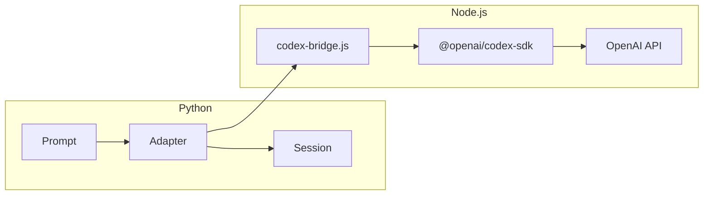

# Codex SDK Adapter Specification

> **SDK**: `@openai/codex-sdk>=1.0.0` (TypeScript)

## Purpose

`CodexSDKAdapter` evaluates a `weakincentives.prompt.Prompt` via OpenAI's Codex
SDK, while keeping orchestration state in a `weakincentives.runtime.Session`.

It provides:

- Codex native tools (file read/write, bash execution, web search)
- weakincentives `Tool` handlers bridged as MCP tools
- Structured output via JSON Schema enforcement
- Thread management for session continuity
- Sandbox modes for isolated execution

## Requirements

- Python: `pip install 'weakincentives[codex-sdk]'`
- Node.js: v18+ with `npm install @openai/codex-sdk`
- Codex CLI (optional): `npm install -g @openai/codex`

## Architecture

The adapter bridges Python and the TypeScript Codex SDK via subprocess
communication. This design mirrors the Claude Agent SDK adapter pattern while
accommodating Codex's TypeScript-first architecture.



### Bridge Protocol

The Python adapter spawns a Node.js subprocess running `codex-bridge.js`.
Communication uses JSON Lines over stdin/stdout:

- **Request**: Prompt text, output schema, tool definitions, configuration
- **Response**: Streamed events (thread.started, turn.completed, item.*)
- **Result**: Final message with structured output and usage statistics

## Models

| Model | Description |
|-------|-------------|
| `gpt-5.1-codex-max` | Optimized for long-horizon, agentic coding tasks |
| `gpt-5.1-codex` | Balanced performance and capability |
| `gpt-5.1-codex-mini` | Cost-effective, lighter workloads |

The adapter defaults to `gpt-5.1-codex` for balanced performance.

## Configuration

### `CodexSDKClientConfig`

| Field | Type | Default | Description |
|-------|------|---------|-------------|
| `api_key` | `str \| None` | `None` | OpenAI API key (falls back to `CODEX_API_KEY` or `OPENAI_API_KEY`) |
| `cwd` | `str \| None` | `None` | Working directory for agent operations |
| `sandbox` | `SandboxMode` | `"workspace-write"` | Sandbox isolation level |
| `max_turns` | `int \| None` | `None` | Maximum conversation turns |
| `suppress_stderr` | `bool` | `True` | Suppress Node.js subprocess stderr |
| `timeout` | `float \| None` | `None` | Request timeout in seconds |
| `effort` | `EffortLevel` | `"medium"` | Resource intensity for task execution |
| `node_path` | `str \| None` | `None` | Path to Node.js binary (auto-detected if None) |

### `CodexSDKModelConfig`

| Field | Type | Default | Description |
|-------|------|---------|-------------|
| `model` | `str` | `"gpt-5.1-codex"` | Codex model identifier |
| `temperature` | `float \| None` | `None` | Sampling temperature |
| `max_tokens` | `int \| None` | `None` | Maximum output tokens |
| `reasoning_effort` | `ReasoningEffort \| None` | `None` | Reasoning intensity level |

### `SandboxMode`

```python
SandboxMode = Literal[
    "read-only",           # No file or network modifications
    "workspace-write",     # File edits within cwd only
    "danger-full-access",  # Full system access (use with caution)
]
```

### `EffortLevel`

```python
EffortLevel = Literal["low", "medium", "high"]
```

## Tool Bridging (MCP)

Any `Tool` attached to rendered sections is exposed to Codex via MCP. The
adapter runs an in-process MCP server that the Codex bridge connects to.

```python
from weakincentives.prompt import Tool, ToolContext, ToolResult

@dataclass(frozen=True)
class QueryParams:
    query: str

@dataclass(frozen=True)
class QueryResult:
    matches: list[str]

def search_codebase(
    params: QueryParams, *, context: ToolContext
) -> ToolResult[QueryResult]:
    # Implementation
    return ToolResult(
        message="Found matches",
        value=QueryResult(matches=["file1.py", "file2.py"]),
    )

search_tool = Tool[QueryParams, QueryResult](
    name="search_codebase",
    description="Search the codebase for patterns",
    handler=search_codebase,
)
```

Tool calls publish `ToolInvoked` events to the session's event bus.

## Structured Output

When a prompt declares structured output via `PromptTemplate[T]`, the adapter
enforces the schema using Codex's `--output-schema` mechanism:

1. Generate JSON Schema from the output dataclass
2. Pass schema to Codex bridge
3. Parse and validate returned JSON against the schema
4. Deserialize to the target dataclass

## Thread Management

Codex supports thread-based sessions for multi-turn interactions:

```python
# First interaction
response1 = adapter.evaluate(prompt1, session=session)
thread_id = response1.metadata.get("thread_id")

# Resume with context
config = CodexSDKClientConfig(resume_thread=thread_id)
adapter2 = CodexSDKAdapter(client_config=config)
response2 = adapter2.evaluate(prompt2, session=session)
```

Thread state is managed by Codex; the adapter stores `thread_id` in response
metadata for resumption.

## Events

The adapter emits standard weakincentives events:

| Event | When | Payload |
|-------|------|---------|
| `PromptRendered` | After prompt render | Text, tools, metadata |
| `ToolInvoked` | Each tool call | Name, params, result |
| `PromptExecuted` | Completion | Response, tokens, timing |

### Codex-Specific Events

The adapter also captures Codex's internal events for debugging:

| Codex Event | Description |
|-------------|-------------|
| `thread.started` | Session initialization |
| `turn.started` | Interaction begins |
| `turn.completed` | Interaction ends |
| `turn.failed` | Error occurred |
| `item.message` | Text response |
| `item.command` | Bash command execution |
| `item.file_change` | File modification |
| `item.mcp_call` | MCP tool invocation |

## User Stories

### Story 1: Minimal structured output

As a developer, I want a simple call that returns a typed dataclass.

```python
from dataclasses import dataclass

from weakincentives.adapters.codex_sdk import CodexSDKAdapter
from weakincentives.prompt import MarkdownSection, Prompt, PromptTemplate
from weakincentives.runtime import InProcessEventBus, Session


@dataclass(frozen=True)
class CodeReview:
    summary: str
    issues: list[str]


session = Session(bus=InProcessEventBus())

template = PromptTemplate[CodeReview](
    ns="review",
    key="basic",
    sections=[
        MarkdownSection(
            title="Task",
            key="task",
            template="Review the Python code in ./src for issues.",
        ),
    ],
)

response = CodexSDKAdapter().evaluate(Prompt(template), session=session)
print(response.output)  # CodeReview(summary="...", issues=[...])
```

### Story 2: Sandboxed code generation

As a platform team, I want Codex to generate code in an isolated workspace
without network access or system modifications.

```python
from weakincentives.adapters.codex_sdk import (
    CodexSDKAdapter,
    CodexSDKClientConfig,
)
from weakincentives.prompt import MarkdownSection, Prompt, PromptTemplate
from weakincentives.runtime import InProcessEventBus, Session


@dataclass(frozen=True)
class GeneratedCode:
    filepath: str
    content: str


session = Session(bus=InProcessEventBus())

adapter = CodexSDKAdapter(
    client_config=CodexSDKClientConfig(
        cwd="/tmp/codegen-sandbox",
        sandbox="read-only",  # No writes allowed
    ),
)

template = PromptTemplate[GeneratedCode](
    ns="codegen",
    key="safe",
    sections=[
        MarkdownSection(
            title="Task",
            key="task",
            template="Generate a Python function that calculates fibonacci.",
        ),
    ],
)

response = adapter.evaluate(Prompt(template), session=session)
```

### Story 3: Long-running agentic task with max model

As a developer, I want to run a complex refactoring task using the most
capable Codex model with full workspace access.

```python
from weakincentives.adapters.codex_sdk import (
    CodexSDKAdapter,
    CodexSDKClientConfig,
    CodexSDKModelConfig,
)


adapter = CodexSDKAdapter(
    model="gpt-5.1-codex-max",
    client_config=CodexSDKClientConfig(
        cwd="/home/user/project",
        sandbox="workspace-write",
        max_turns=50,
        effort="high",
    ),
    model_config=CodexSDKModelConfig(
        model="gpt-5.1-codex-max",
        reasoning_effort="high",
    ),
)

template = PromptTemplate[RefactorResult](
    ns="refactor",
    key="large",
    sections=[
        MarkdownSection(
            title="Task",
            key="task",
            template="""
            Refactor the authentication module to use JWT tokens.
            Update all dependent code and tests.
            """,
        ),
    ],
)

response = adapter.evaluate(Prompt(template), session=session)
```

### Story 4: Custom tool integration

As a platform team, I want to expose internal tools to Codex while keeping
business logic in Python.

```python
from dataclasses import dataclass

from weakincentives.adapters.codex_sdk import CodexSDKAdapter
from weakincentives.prompt import (
    MarkdownSection,
    Prompt,
    PromptTemplate,
    Tool,
    ToolContext,
    ToolResult,
)
from weakincentives.runtime import InProcessEventBus, Session


@dataclass(frozen=True)
class DeployParams:
    service: str
    version: str


@dataclass(frozen=True)
class DeployResult:
    status: str
    url: str


def deploy_service(
    params: DeployParams, *, context: ToolContext
) -> ToolResult[DeployResult]:
    # Actual deployment logic
    return ToolResult(
        message=f"Deployed {params.service}",
        value=DeployResult(
            status="success",
            url=f"https://{params.service}.example.com",
        ),
    )


deploy_tool = Tool[DeployParams, DeployResult](
    name="deploy_service",
    description="Deploy a service to production",
    handler=deploy_service,
)

session = Session(bus=InProcessEventBus())

template = PromptTemplate[None](
    ns="deploy",
    key="with-tool",
    sections=[
        MarkdownSection(
            title="Task",
            key="task",
            template="Deploy the auth-service at version 2.1.0",
            tools=(deploy_tool,),
        ),
    ],
)

response = CodexSDKAdapter().evaluate(Prompt(template), session=session)
```

### Story 5: Thread resumption for iterative tasks

As a developer, I want to continue a previous Codex conversation to iterate
on generated code.

```python
from weakincentives.adapters.codex_sdk import (
    CodexSDKAdapter,
    CodexSDKClientConfig,
)


# First interaction
adapter1 = CodexSDKAdapter()
response1 = adapter1.evaluate(initial_prompt, session=session)

# Extract thread ID from response metadata
thread_id = response1.metadata["thread_id"]

# Resume the thread
adapter2 = CodexSDKAdapter(
    client_config=CodexSDKClientConfig(resume_thread=thread_id),
)

followup_template = PromptTemplate[None](
    ns="iterate",
    key="followup",
    sections=[
        MarkdownSection(
            title="Task",
            key="task",
            template="Add error handling to the code you just generated.",
        ),
    ],
)

response2 = adapter2.evaluate(Prompt(followup_template), session=session)
```

## Error Handling

### Exception Hierarchy

```python
CodexSDKError(PromptEvaluationError)
├── CodexAuthenticationError    # API key invalid or missing
├── CodexRateLimitError         # Rate limit exceeded
├── CodexTimeoutError           # Request timeout
├── CodexSandboxViolation       # Attempted forbidden operation
└── CodexBridgeError            # Node.js subprocess failure
```

### Error Propagation

- **Tool failures**: Wrapped in `ToolResult(success=False)` and returned to
  the model; never abort evaluation.
- **Sandbox violations**: Raise `CodexSandboxViolation` with attempted
  operation details.
- **Authentication errors**: Raise `CodexAuthenticationError` immediately.
- **Rate limits**: Raise `CodexRateLimitError` with retry-after if available.
- **Bridge failures**: Raise `CodexBridgeError` with subprocess exit code and
  stderr.

## Security Considerations

### Sandbox Modes

| Mode | File Access | Network | Bash |
|------|-------------|---------|------|
| `read-only` | Read only | Blocked | Limited |
| `workspace-write` | cwd write | Blocked | Limited |
| `danger-full-access` | Full | Full | Full |

**Recommendation**: Use `workspace-write` for most programmatic use cases.
Only use `danger-full-access` when absolutely necessary and with trusted
prompts.

### API Key Handling

- Never log or emit API keys in events
- Support environment variable fallback: `CODEX_API_KEY` → `OPENAI_API_KEY`
- Clear keys from subprocess environment after initialization

### Subprocess Isolation

The Node.js bridge runs in a separate process with:

- Inherited file descriptors for stdin/stdout/stderr only
- Controlled environment variables
- Working directory restricted to configured `cwd`

## Operational Notes

### Token Tracking

Budget tracking works via the `BudgetTracker` passed to `evaluate()`:

```python
from weakincentives.budget import Budget, BudgetTracker

budget = Budget(max_total_tokens=50000)
tracker = BudgetTracker(budget)

response = adapter.evaluate(
    prompt,
    session=session,
    budget=budget,
    budget_tracker=tracker,
)

print(tracker.consumed)  # TokenUsage with totals
```

### Timeout Configuration

- **Per-request timeout**: Set via `CodexSDKClientConfig.timeout`
- **Deadline integration**: Pass `deadline=Deadline(...)` to `evaluate()`
- **Turn timeout**: Codex enforces internal turn timeouts

### Logging

The adapter logs structured events at these points:

| Event | Level | Context |
|-------|-------|---------|
| `codex_sdk.evaluate.start` | INFO | prompt_name, model, config |
| `codex_sdk.bridge.spawn` | DEBUG | node_path, args |
| `codex_sdk.tool.invoked` | INFO | tool_name, duration_ms |
| `codex_sdk.evaluate.complete` | INFO | duration_ms, tokens |
| `codex_sdk.error` | ERROR | error_type, message |

## Testing

### Unit Tests

- Mock the Node.js bridge with canned responses
- Verify structured output parsing for valid and malformed payloads
- Test sandbox mode enforcement at the configuration level
- Confirm deadline checks abort before bridge invocation when expired

### Integration Tests

Integration tests require a valid `OPENAI_API_KEY`:

```bash
OPENAI_API_KEY=sk-... make integration-tests
```

Test categories:

- Basic prompt evaluation with structured output
- Tool bridging round-trips
- Thread resumption
- Sandbox violation detection
- Error recovery and timeout handling

### Fixtures

- `tests/helpers/codex_sdk.py`: Mock bridge and response builders
- `tests/fixtures/codex/`: Sample Codex event streams

## Implementation Roadmap

### Phase 1: Core Adapter

1. Define configuration dataclasses (`CodexSDKClientConfig`, `CodexSDKModelConfig`)
2. Implement Node.js bridge protocol
3. Basic `evaluate()` with structured output
4. Event publication (`PromptRendered`, `PromptExecuted`)

### Phase 2: Tool Bridging

1. MCP server for weakincentives tools
2. Tool call dispatch and `ToolInvoked` events
3. Error handling for tool failures

### Phase 3: Advanced Features

1. Thread management and resumption
2. Sandbox mode enforcement
3. Budget tracking integration
4. Workspace mounting (similar to `ClaudeAgentWorkspaceSection`)

### Phase 4: Production Hardening

1. Comprehensive error handling
2. Retry logic with backoff
3. Telemetry and observability
4. Documentation and examples

## Comparison with Claude Agent SDK

| Feature | Claude Agent SDK | Codex SDK |
|---------|------------------|-----------|
| Runtime | Python native | Node.js subprocess |
| Sandbox | bubblewrap | Built-in modes |
| Models | Claude family | GPT-5 Codex family |
| Tools | MCP via SDK | MCP via bridge |
| Threads | Session-based | Thread resumption |
| Auth | Anthropic API | OpenAI API |

Both adapters share the same `ProviderAdapter` protocol, making them
interchangeable for prompt evaluation while using different underlying
providers.
