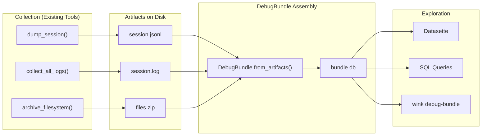

# Debug Bundle Specification

## Purpose

A DebugBundle is a self-contained SQLite database assembled from existing
debugging artifacts into a single queryable file. It consolidates session
snapshots, log files, and filesystem archives produced by the existing
`weakincentives.debug` tools into a format explorable via Datasette.

This specification complements `specs/DEBUGGING.md` by defining how to transform
existing artifacts into one queryable, shareable package.

## Guiding Principles

- **Build on existing tools**: Collection uses `dump_session`, `collect_all_logs`,
  and `archive_filesystem`—DebugBundle only handles assembly and exploration
- **Post-hoc assembly**: Bundles are created after task completion from artifacts
  on disk, not during execution
- **SQL-first exploration**: The primary interface is SQL queries via Datasette,
  not custom APIs
- **Lossless import**: All data from source artifacts is preserved and queryable

## Workflow



## Recommended Debug Capture Pattern

Use the existing debugging tools during execution:

```python
from weakincentives.debug import (
    archive_filesystem,
    collect_all_logs,
    dump_session,
)

debug_dir = Path(f"./debug/{session.session_id}")

# Capture logs during evaluation
with collect_all_logs(debug_dir / "session.log"):
    response = adapter.evaluate(prompt, session=session)

# Dump session state
dump_session(session, debug_dir)

# Archive filesystem contents
if fs := prompt.resources.get(Filesystem, None):
    archive_filesystem(fs, debug_dir)

# Debug directory now contains:
# - session.log (JSONL logs)
# - <session_id>.jsonl (session snapshots)
# - <uuid>.zip (filesystem archive)
```

Then assemble into a bundle for exploration:

```python
from weakincentives.debug import DebugBundle

bundle = DebugBundle.from_directory(debug_dir)
bundle.serve()  # Launch Datasette
```

## Database Schema

### `bundle_meta`

Bundle-level metadata (single row):

```sql
CREATE TABLE bundle_meta (
    id INTEGER PRIMARY KEY CHECK (id = 1),
    bundle_id TEXT NOT NULL,           -- UUID
    created_at TEXT NOT NULL,          -- ISO 8601
    wink_version TEXT NOT NULL,        -- e.g., "0.1.0"
    schema_version INTEGER NOT NULL,   -- Schema version for migrations
    root_session_id TEXT,              -- Root session UUID
    source_directory TEXT,             -- Original artifact directory
    description TEXT,                  -- User-provided description
    tags TEXT                          -- JSON object of custom tags
);
```

### `sessions`

Session metadata extracted from snapshots:

```sql
CREATE TABLE sessions (
    session_id TEXT PRIMARY KEY,
    parent_session_id TEXT REFERENCES sessions(session_id),
    created_at TEXT NOT NULL,          -- ISO 8601
    tags TEXT                          -- JSON object of session tags
);

CREATE INDEX idx_sessions_parent ON sessions(parent_session_id);
```

### `logs`

Structured log records imported from JSONL log files:

```sql
CREATE TABLE logs (
    id INTEGER PRIMARY KEY AUTOINCREMENT,
    session_id TEXT REFERENCES sessions(session_id),
    timestamp TEXT NOT NULL,           -- ISO 8601
    level TEXT NOT NULL,               -- DEBUG, INFO, WARNING, ERROR, CRITICAL
    logger TEXT NOT NULL,              -- Logger name
    event TEXT,                        -- Structured event name
    message TEXT NOT NULL,             -- Log message
    context TEXT                       -- JSON context payload
);

CREATE INDEX idx_logs_session ON logs(session_id);
CREATE INDEX idx_logs_level ON logs(level);
CREATE INDEX idx_logs_event ON logs(event);
CREATE INDEX idx_logs_timestamp ON logs(timestamp);
```

### `slice_items`

All items from session slices, denormalized for querying:

```sql
CREATE TABLE slice_items (
    id INTEGER PRIMARY KEY AUTOINCREMENT,
    session_id TEXT NOT NULL REFERENCES sessions(session_id),
    slice_type TEXT NOT NULL,          -- Qualified class name
    item_index INTEGER NOT NULL,       -- Position in slice
    item_type TEXT NOT NULL,           -- Qualified class name of item
    payload TEXT NOT NULL              -- JSON serialization
);

CREATE INDEX idx_slice_items_session ON slice_items(session_id);
CREATE INDEX idx_slice_items_type ON slice_items(slice_type);
CREATE INDEX idx_slice_items_item_type ON slice_items(item_type);
```

### `tool_invocations`

Tool calls extracted from ToolInvoked events in slices:

```sql
CREATE TABLE tool_invocations (
    event_id TEXT PRIMARY KEY,
    session_id TEXT NOT NULL REFERENCES sessions(session_id),
    prompt_name TEXT NOT NULL,
    adapter TEXT NOT NULL,
    tool_name TEXT NOT NULL,
    call_id TEXT,                      -- Provider's tool call ID
    timestamp TEXT NOT NULL,           -- ISO 8601
    params TEXT NOT NULL,              -- JSON params
    result_success INTEGER NOT NULL,   -- 0 or 1
    result_message TEXT,
    result_value TEXT,                 -- JSON if structured
    rendered_output TEXT,              -- Text returned to model
    input_tokens INTEGER,
    output_tokens INTEGER
);

CREATE INDEX idx_tools_session ON tool_invocations(session_id);
CREATE INDEX idx_tools_name ON tool_invocations(tool_name);
CREATE INDEX idx_tools_success ON tool_invocations(result_success);
CREATE INDEX idx_tools_timestamp ON tool_invocations(timestamp);
```

### `prompt_events`

Prompt lifecycle events extracted from slices:

```sql
CREATE TABLE prompt_events (
    event_id TEXT PRIMARY KEY,
    session_id TEXT NOT NULL REFERENCES sessions(session_id),
    event_type TEXT NOT NULL,          -- 'rendered' or 'executed'
    prompt_ns TEXT,
    prompt_key TEXT,
    prompt_name TEXT,
    adapter TEXT NOT NULL,
    timestamp TEXT NOT NULL,           -- ISO 8601
    -- PromptRendered fields
    rendered_text TEXT,
    char_count INTEGER,
    tool_count INTEGER,
    tool_names TEXT,                   -- JSON array
    -- PromptExecuted fields
    result TEXT,                       -- JSON serialized output
    input_tokens INTEGER,
    output_tokens INTEGER,
    total_tokens INTEGER
);

CREATE INDEX idx_prompt_events_session ON prompt_events(session_id);
CREATE INDEX idx_prompt_events_type ON prompt_events(event_type);
CREATE INDEX idx_prompt_events_timestamp ON prompt_events(timestamp);
```

### `files`

Files imported from filesystem archives:

```sql
CREATE TABLE files (
    id INTEGER PRIMARY KEY AUTOINCREMENT,
    archive_id TEXT NOT NULL,          -- UUID of source archive
    session_id TEXT REFERENCES sessions(session_id),
    path TEXT NOT NULL,
    size_bytes INTEGER NOT NULL,
    content TEXT,                      -- Text content (NULL for binary)
    is_binary INTEGER NOT NULL DEFAULT 0
);

CREATE INDEX idx_files_session ON files(session_id);
CREATE INDEX idx_files_path ON files(path);
CREATE INDEX idx_files_archive ON files(archive_id);
```

### Pre-Built Views

```sql
-- Execution timeline combining prompt and tool events
CREATE VIEW execution_timeline AS
SELECT
    timestamp,
    'prompt_rendered' as event_type,
    prompt_name as name,
    session_id,
    char_count as detail,
    NULL as success
FROM prompt_events WHERE event_type = 'rendered'
UNION ALL
SELECT
    timestamp,
    'tool_invoked' as event_type,
    tool_name as name,
    session_id,
    NULL as detail,
    result_success as success
FROM tool_invocations
UNION ALL
SELECT
    timestamp,
    'prompt_executed' as event_type,
    prompt_name as name,
    session_id,
    total_tokens as detail,
    CASE WHEN result IS NOT NULL THEN 1 ELSE 0 END as success
FROM prompt_events WHERE event_type = 'executed'
ORDER BY timestamp;

-- Token usage summary per session
CREATE VIEW token_summary AS
SELECT
    session_id,
    SUM(input_tokens) as total_input_tokens,
    SUM(output_tokens) as total_output_tokens,
    SUM(total_tokens) as total_tokens,
    COUNT(*) as prompt_count
FROM prompt_events
WHERE event_type = 'executed'
GROUP BY session_id;

-- Tool success rates
CREATE VIEW tool_summary AS
SELECT
    session_id,
    tool_name,
    COUNT(*) as call_count,
    SUM(result_success) as success_count,
    ROUND(100.0 * SUM(result_success) / COUNT(*), 1) as success_rate
FROM tool_invocations
GROUP BY session_id, tool_name;

-- Errors and warnings from logs
CREATE VIEW error_log AS
SELECT
    timestamp,
    level,
    logger,
    event,
    message,
    json_extract(context, '$.error') as error_detail,
    session_id
FROM logs
WHERE level IN ('ERROR', 'WARNING', 'CRITICAL')
ORDER BY timestamp;
```

## Core Types

### DebugBundle

```python
@dataclass(slots=True)
class DebugBundle:
    """SQLite database assembled from debugging artifacts.

    DebugBundle consolidates session snapshots, log files, and filesystem
    archives into a single queryable file. It does not capture data during
    execution—use the existing debugging tools for that.

    Usage::

        # Assemble from a debug directory
        bundle = DebugBundle.from_directory("./debug/abc123/")

        # Or from specific artifacts
        bundle = DebugBundle.from_artifacts(
            output="./bundle.db",
            session_snapshots=["./debug/session.jsonl"],
            log_files=["./debug/session.log"],
            filesystem_archives=["./debug/files.zip"],
        )

        # Explore with Datasette
        bundle.serve()

        # Or query directly
        for row in bundle.query("SELECT * FROM tool_invocations"):
            print(row)
    """

    path: Path
    _conn: sqlite3.Connection

    @classmethod
    def from_directory(
        cls,
        directory: str | Path,
        *,
        output: str | Path | None = None,
        description: str | None = None,
    ) -> "DebugBundle":
        """Assemble a bundle from all artifacts in a directory.

        Discovers and imports:
        - *.jsonl files as session snapshots
        - *.log files as log records
        - *.zip files as filesystem archives

        Args:
            directory: Directory containing debug artifacts.
            output: Output path for bundle. Defaults to <directory>/bundle.db.
            description: Optional description stored in bundle metadata.

        Returns:
            Assembled DebugBundle ready for exploration.
        """
        ...

    @classmethod
    def from_artifacts(
        cls,
        output: str | Path,
        *,
        session_snapshots: Sequence[str | Path] = (),
        log_files: Sequence[str | Path] = (),
        filesystem_archives: Sequence[str | Path] = (),
        description: str | None = None,
    ) -> "DebugBundle":
        """Assemble a bundle from specific artifact files.

        Args:
            output: Output path for the bundle database.
            session_snapshots: JSONL files from dump_session().
            log_files: JSONL files from collect_all_logs().
            filesystem_archives: ZIP files from archive_filesystem().
            description: Optional description stored in bundle metadata.

        Returns:
            Assembled DebugBundle ready for exploration.
        """
        ...

    @classmethod
    def open(cls, path: str | Path) -> "DebugBundle":
        """Open an existing bundle for exploration."""
        ...

    def serve(
        self,
        *,
        host: str = "127.0.0.1",
        port: int = 8001,
        open_browser: bool = True,
    ) -> None:
        """Launch Datasette to explore the bundle.

        Args:
            host: Host interface to bind.
            port: Port to bind.
            open_browser: Whether to open browser automatically.
        """
        ...

    def query(self, sql: str, params: tuple[object, ...] = ()) -> sqlite3.Cursor:
        """Execute a SQL query and return cursor."""
        return self._conn.execute(sql, params)

    def export_csv(self, table: str, output: str | Path) -> Path:
        """Export a table to CSV format."""
        ...

    def export_json(self, sql: str, output: str | Path) -> Path:
        """Export query results to JSON format."""
        ...

    @property
    def session_ids(self) -> list[str]:
        """List all session IDs in the bundle."""
        ...

    @property
    def statistics(self) -> BundleStatistics:
        """Get bundle statistics."""
        ...

    def close(self) -> None:
        """Close the database connection."""
        self._conn.close()

    def __enter__(self) -> "DebugBundle":
        return self

    def __exit__(self, *args: object) -> None:
        self.close()
```

### BundleStatistics

```python
@FrozenDataclass()
class BundleStatistics:
    """Summary statistics for a debug bundle."""

    session_count: int
    log_count: int
    tool_invocation_count: int
    prompt_event_count: int
    file_count: int
    total_input_tokens: int
    total_output_tokens: int
    size_bytes: int
```

## Import Procedures

### Session Snapshot Import

Session snapshots (from `dump_session`) are JSONL files where each line is a
serialized `Snapshot`. The import procedure:

1. Parse each line as JSON
2. Extract session metadata into `sessions` table
3. For each slice in the snapshot:
   - Insert items into `slice_items` table
   - If slice contains `ToolInvoked` events, also insert into `tool_invocations`
   - If slice contains `PromptRendered`/`PromptExecuted`, also insert into `prompt_events`

```python
def _import_session_snapshot(self, path: Path) -> None:
    """Import a session snapshot JSONL file."""
    with path.open() as f:
        for line in f:
            if not line.strip():
                continue
            payload = json.loads(line)
            session_id = payload["tags"]["session_id"]

            # Insert session
            self._conn.execute(
                "INSERT OR IGNORE INTO sessions (session_id, created_at, tags) VALUES (?, ?, ?)",
                (session_id, payload["created_at"], json.dumps(payload.get("tags", {}))),
            )

            # Insert slice items
            for slice_type, items in payload.get("slices", {}).items():
                for idx, item in enumerate(items):
                    self._insert_slice_item(session_id, slice_type, idx, item)
```

### Log File Import

Log files (from `collect_all_logs`) are JSONL files with structured log records:

```python
def _import_log_file(self, path: Path) -> None:
    """Import a log JSONL file."""
    session_id = self._infer_session_id(path)

    with path.open() as f:
        for line in f:
            if not line.strip():
                continue
            record = json.loads(line)
            self._conn.execute(
                """INSERT INTO logs
                   (session_id, timestamp, level, logger, event, message, context)
                   VALUES (?, ?, ?, ?, ?, ?, ?)""",
                (
                    session_id,
                    record["timestamp"],
                    record["level"],
                    record["logger"],
                    record.get("event"),
                    record["message"],
                    json.dumps(record.get("context", {})),
                ),
            )
```

### Filesystem Archive Import

Filesystem archives (from `archive_filesystem`) are ZIP files:

```python
def _import_filesystem_archive(self, path: Path) -> None:
    """Import a filesystem ZIP archive."""
    archive_id = path.stem  # UUID from archive_filesystem
    session_id = self._infer_session_id(path)

    with zipfile.ZipFile(path) as zf:
        for info in zf.infolist():
            if info.is_dir():
                continue

            content = None
            is_binary = 1

            # Attempt text decode for small files
            if info.file_size < 1024 * 1024:  # 1MB
                try:
                    raw = zf.read(info.filename)
                    content = raw.decode("utf-8")
                    is_binary = 0
                except UnicodeDecodeError:
                    pass

            self._conn.execute(
                """INSERT INTO files
                   (archive_id, session_id, path, size_bytes, content, is_binary)
                   VALUES (?, ?, ?, ?, ?, ?)""",
                (archive_id, session_id, info.filename, info.file_size, content, is_binary),
            )
```

## CLI Integration

### `wink debug-bundle` Command

```
wink debug-bundle <subcommand> [options]

Subcommands:
  create    Assemble a bundle from artifacts
  serve     Launch Datasette to explore a bundle
  info      Display bundle metadata and statistics
  query     Execute SQL query and print results
  export    Export table or query to CSV/JSON
```

### Create Bundle

```bash
# From a directory (auto-discovers artifacts)
wink debug-bundle create ./debug/abc123/

# From specific files
wink debug-bundle create \
    --output ./bundle.db \
    --session ./debug/session.jsonl \
    --logs ./debug/session.log \
    --files ./debug/files.zip \
    --description "Code review task"
```

### Serve Bundle

```bash
wink debug-bundle serve ./bundle.db
# Opens browser to http://127.0.0.1:8001
```

### Query Bundle

```bash
# Interactive query
wink debug-bundle query ./bundle.db \
    "SELECT tool_name, COUNT(*) FROM tool_invocations GROUP BY tool_name"

# Output as JSON
wink debug-bundle query ./bundle.db \
    --format json \
    "SELECT * FROM error_log LIMIT 10"
```

### Bundle Info

```bash
wink debug-bundle info ./bundle.db

# Output:
# Bundle: ./bundle.db (2.3 MB)
# Created: 2024-01-15T10:30:00+00:00
# Source: ./debug/abc123/
#
# Sessions: 1
#   - abc123-def456-... (root)
#
# Statistics:
#   Log records: 1,432
#   Tool invocations: 23
#   Prompt events: 10
#   Files: 12
#   Total tokens: 45,230
```

### Export Data

```bash
# Export table to CSV
wink debug-bundle export ./bundle.db tool_invocations --format csv

# Export query to JSON
wink debug-bundle export ./bundle.db \
    --format json \
    --query "SELECT * FROM error_log"
```

## Datasette Integration

### Automatic Metadata

The bundle generates Datasette metadata for better exploration:

```python
def _generate_datasette_metadata(self) -> dict:
    """Generate metadata.json for Datasette."""
    return {
        "title": f"Debug Bundle: {self._get_root_session_id()}",
        "description": self._get_description(),
        "databases": {
            "bundle": {
                "tables": {
                    "logs": {
                        "label_column": "event",
                        "description": "Structured log records from collect_all_logs()",
                    },
                    "tool_invocations": {
                        "label_column": "tool_name",
                        "description": "Tool calls with parameters and results",
                    },
                    "prompt_events": {
                        "label_column": "prompt_name",
                        "description": "Prompt render and execution events",
                    },
                    "files": {
                        "label_column": "path",
                        "description": "Files from archive_filesystem()",
                    },
                    "slice_items": {
                        "description": "Raw slice contents from session snapshots",
                    },
                },
            }
        },
    }
```

### Recommended Queries

Include as canned queries in Datasette:

```sql
-- What tools were called and how often did they succeed?
SELECT
    tool_name,
    call_count,
    success_count,
    success_rate || '%' as success_rate
FROM tool_summary
ORDER BY call_count DESC;

-- What errors occurred?
SELECT timestamp, level, event, message
FROM error_log
ORDER BY timestamp DESC
LIMIT 50;

-- Execution timeline
SELECT timestamp, event_type, name, success
FROM execution_timeline
ORDER BY timestamp;

-- Token usage by session
SELECT * FROM token_summary;

-- Files created by the agent
SELECT path, size_bytes, is_binary
FROM files
ORDER BY path;
```

## Error Handling

### Import Errors

Malformed artifacts log warnings but don't fail the bundle:

```python
def _import_log_file(self, path: Path) -> None:
    with path.open() as f:
        for line_num, line in enumerate(f, 1):
            try:
                record = json.loads(line)
                self._insert_log(record)
            except json.JSONDecodeError as e:
                logger.warning(
                    "Skipping malformed log line",
                    extra={"path": str(path), "line": line_num, "error": str(e)},
                )
```

### Missing Artifacts

`from_directory` skips missing artifact types gracefully:

```python
@classmethod
def from_directory(cls, directory: str | Path, ...) -> "DebugBundle":
    dir_path = Path(directory)

    session_snapshots = list(dir_path.glob("*.jsonl"))
    log_files = list(dir_path.glob("*.log"))
    archives = list(dir_path.glob("*.zip"))

    if not any([session_snapshots, log_files, archives]):
        raise BundleError(f"No artifacts found in {directory}")

    # Proceed with whatever artifacts exist
    ...
```

### Schema Migration

Bundles include schema version for forward compatibility:

```python
CURRENT_SCHEMA_VERSION = 1

def open(cls, path: str | Path) -> "DebugBundle":
    conn = sqlite3.connect(path)
    version = cls._get_schema_version(conn)

    if version > CURRENT_SCHEMA_VERSION:
        raise BundleVersionError(
            f"Bundle schema v{version} is newer than supported v{CURRENT_SCHEMA_VERSION}"
        )

    return cls(path=Path(path), _conn=conn)
```

## Logging Events

| Event | Level | Context |
| --------------------------------- | ----- | ------------------------------------------ |
| `debug_bundle.create` | INFO | `path`, `bundle_id`, `source_directory` |
| `debug_bundle.import_snapshot` | DEBUG | `path`, `session_count`, `slice_count` |
| `debug_bundle.import_logs` | DEBUG | `path`, `record_count` |
| `debug_bundle.import_archive` | DEBUG | `path`, `file_count` |
| `debug_bundle.import_error` | WARNING | `path`, `line`, `error` |
| `debug_bundle.serve` | INFO | `url` |
| `debug_bundle.open` | INFO | `path`, `schema_version` |

## Limitations

- **Post-hoc only**: DebugBundle does not capture data during execution; use
  `collect_all_logs`, `dump_session`, and `archive_filesystem` for that
- **SQLite size**: Bundles over 1GB may experience slower Datasette performance
- **Binary files**: Large binary files are stored without content (metadata only)
- **Session correlation**: Log files are correlated to sessions by filename
  heuristics; explicit session IDs in log context improve accuracy

## Example Workflow

Complete example of capturing and exploring debug data:

```python
from pathlib import Path
from weakincentives.debug import (
    DebugBundle,
    archive_filesystem,
    collect_all_logs,
    dump_session,
)

# 1. Capture during execution (existing tools)
debug_dir = Path(f"./debug/{session.session_id}")
debug_dir.mkdir(parents=True, exist_ok=True)

with collect_all_logs(debug_dir / "session.log"):
    response = adapter.evaluate(prompt, session=session)

dump_session(session, debug_dir)

if fs := prompt.resources.get(Filesystem, None):
    archive_filesystem(fs, debug_dir)

# 2. Assemble into bundle (new)
bundle = DebugBundle.from_directory(debug_dir)

# 3. Explore
print(bundle.statistics)
# BundleStatistics(session_count=1, log_count=1432, tool_invocation_count=23, ...)

# Query directly
for row in bundle.query("SELECT tool_name, COUNT(*) FROM tool_invocations GROUP BY tool_name"):
    print(row)

# Or launch Datasette
bundle.serve()
```

## Related Specifications

- `specs/DEBUGGING.md` - Source artifact tools (`dump_session`, `collect_all_logs`, `archive_filesystem`)
- `specs/WINK_DEBUG.md` - Alternative JSONL-based debug UI
- `specs/SESSIONS.md` - Session snapshot format
- `specs/LOGGING.md` - Log record schema
- `specs/SLICES.md` - Slice storage and JSONL format
