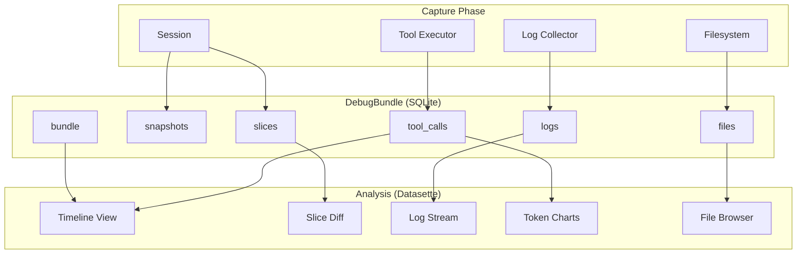

# Debug Bundle Specification

This document specifies the `DebugBundle` abstraction—a unified artifact that
captures all state necessary to understand what an agent did during execution
on a potentially long-running task. The bundle uses SQLite as its storage
format, enabling powerful SQL queries and seamless integration with
[Datasette](https://datasette.io/) for visualization and exploration.

## Overview

A debug bundle is a SQLite database (`.wink.db`) that consolidates all
debugging information into a single, queryable artifact:

| Component | SQLite Representation |
| ---------------------- | ------------------------------------------ |
| **Session Snapshots** | `snapshots` + `slices` tables |
| **Execution Logs** | `logs` table with full-text search |
| **Tool Invocations** | `tool_calls` table with timing and results |
| **Filesystem Archive** | `files` table with BLOB content |
| **Bundle Metadata** | `bundle` table (single row) |



## Design Goals

1. **Single artifact**: One `.wink.db` file captures everything needed for
   post-mortem analysis, shareable across teams and environments.

1. **Queryable**: Full SQL access to all debugging data. Find patterns, filter
   by criteria, aggregate statistics—all with standard SQL.

1. **Datasette-native**: Open any bundle with `datasette bundle.wink.db` for
   instant web-based exploration with zero configuration.

1. **Complete context**: The bundle contains sufficient information to
   reconstruct the agent's decision-making process, including:

   - What prompts were rendered and sent
   - What tools were invoked, their parameters, results, and timing
   - What files were read/written
   - What logs were emitted at each stage
   - Session state transitions over time
   - Token usage and cost tracking

1. **Streaming capture**: Bundles can be built incrementally during long
   executions using SQLite transactions.

## SQLite Schema

### Core Tables

#### `bundle` — Bundle Metadata

Single-row table containing bundle-level metadata:

```sql
CREATE TABLE bundle (
    bundle_id TEXT PRIMARY KEY,
    version TEXT NOT NULL DEFAULT '1',
    created_at TEXT NOT NULL,  -- ISO 8601 UTC
    session_id TEXT NOT NULL,

    -- Agent identification
    agent_name TEXT NOT NULL,
    agent_version TEXT,
    agent_adapter TEXT NOT NULL,  -- 'openai', 'litellm', 'claude-agent-sdk'
    agent_model TEXT NOT NULL,

    -- Execution summary
    started_at TEXT NOT NULL,
    ended_at TEXT,
    duration_seconds REAL,
    outcome TEXT NOT NULL DEFAULT 'in_progress',  -- 'success', 'failure', 'timeout', 'cancelled'
    error_type TEXT,
    error_message TEXT,

    -- Environment
    platform TEXT,
    python_version TEXT,
    weakincentives_version TEXT,

    -- Aggregated statistics (updated on finalize)
    total_tool_calls INTEGER DEFAULT 0,
    total_input_tokens INTEGER DEFAULT 0,
    total_output_tokens INTEGER DEFAULT 0,
    total_cost_usd REAL,

    -- User-provided metadata
    tags JSON  -- {"task_id": "PR-123", "repository": "acme/webapp"}
);
```

#### `tool_calls` — Tool Invocation Log

The heart of debugging—every tool call with full context:

```sql
CREATE TABLE tool_calls (
    id INTEGER PRIMARY KEY AUTOINCREMENT,
    call_id TEXT UNIQUE,           -- Provider-assigned call ID
    session_id TEXT NOT NULL,
    parent_call_id TEXT,           -- For nested/chained tool calls

    -- Timing
    started_at TEXT NOT NULL,      -- ISO 8601 UTC with microseconds
    ended_at TEXT,
    duration_ms REAL,

    -- Tool identification
    tool_name TEXT NOT NULL,
    prompt_name TEXT,

    -- Input/Output
    parameters JSON NOT NULL,      -- Tool input parameters
    result_success INTEGER,        -- 1 = success, 0 = failure
    result_message TEXT,
    result_value JSON,             -- Structured result value
    result_output TEXT,            -- Rendered output text

    -- Token usage for this call
    input_tokens INTEGER,
    output_tokens INTEGER,

    -- Snapshot references (state before/after)
    snapshot_before_id INTEGER REFERENCES snapshots(id),
    snapshot_after_id INTEGER REFERENCES snapshots(id),

    -- Error details if failed
    error_type TEXT,
    error_message TEXT,
    error_traceback TEXT,

    FOREIGN KEY (parent_call_id) REFERENCES tool_calls(call_id)
);

CREATE INDEX idx_tool_calls_session ON tool_calls(session_id);
CREATE INDEX idx_tool_calls_tool_name ON tool_calls(tool_name);
CREATE INDEX idx_tool_calls_started_at ON tool_calls(started_at);
CREATE INDEX idx_tool_calls_success ON tool_calls(result_success);
CREATE INDEX idx_tool_calls_parent ON tool_calls(parent_call_id);
```

#### `logs` — Structured Log Entries

All log records with full-text search:

```sql
CREATE TABLE logs (
    id INTEGER PRIMARY KEY AUTOINCREMENT,
    timestamp TEXT NOT NULL,       -- ISO 8601 UTC with microseconds
    level TEXT NOT NULL,           -- DEBUG, INFO, WARNING, ERROR, CRITICAL
    level_num INTEGER NOT NULL,    -- 10, 20, 30, 40, 50
    logger TEXT NOT NULL,          -- e.g., 'weakincentives.adapters.openai'
    event TEXT,                    -- Structured event name
    message TEXT NOT NULL,

    -- Context
    context JSON,                  -- Structured context payload
    session_id TEXT,
    tool_call_id TEXT,             -- Associated tool call if any

    -- Extracted fields for fast filtering
    prompt_name TEXT,
    adapter TEXT,

    FOREIGN KEY (tool_call_id) REFERENCES tool_calls(call_id)
);

CREATE INDEX idx_logs_timestamp ON logs(timestamp);
CREATE INDEX idx_logs_level ON logs(level_num);
CREATE INDEX idx_logs_event ON logs(event);
CREATE INDEX idx_logs_session ON logs(session_id);
CREATE INDEX idx_logs_tool_call ON logs(tool_call_id);

-- Full-text search on log messages and context
CREATE VIRTUAL TABLE logs_fts USING fts5(
    message,
    event,
    context,
    content='logs',
    content_rowid='id'
);

-- Triggers to keep FTS in sync
CREATE TRIGGER logs_ai AFTER INSERT ON logs BEGIN
    INSERT INTO logs_fts(rowid, message, event, context)
    VALUES (new.id, new.message, new.event, new.context);
END;
```

#### `snapshots` — Session State Snapshots

Point-in-time captures of session state:

```sql
CREATE TABLE snapshots (
    id INTEGER PRIMARY KEY AUTOINCREMENT,
    session_id TEXT NOT NULL,
    created_at TEXT NOT NULL,      -- ISO 8601 UTC
    trigger_event TEXT,            -- What triggered this snapshot
    trigger_tool_call_id TEXT,     -- Associated tool call if any

    -- Raw snapshot for full restoration
    payload JSON NOT NULL,

    -- Summary statistics
    slice_count INTEGER,
    total_items INTEGER,

    FOREIGN KEY (trigger_tool_call_id) REFERENCES tool_calls(call_id)
);

CREATE INDEX idx_snapshots_session ON snapshots(session_id);
CREATE INDEX idx_snapshots_created_at ON snapshots(created_at);
```

#### `slices` — Denormalized Slice Data

Individual slice items for querying without JSON parsing:

```sql
CREATE TABLE slices (
    id INTEGER PRIMARY KEY AUTOINCREMENT,
    snapshot_id INTEGER NOT NULL,
    session_id TEXT NOT NULL,

    -- Slice identification
    slice_type TEXT NOT NULL,      -- e.g., 'myapp.Plan'
    item_type TEXT NOT NULL,       -- e.g., 'myapp.PlanStep'
    item_index INTEGER NOT NULL,   -- Position in slice

    -- Item data
    item_json JSON NOT NULL,       -- Full serialized item

    -- Extracted common fields (for fast filtering)
    item_id TEXT,                  -- If item has an 'id' field
    item_name TEXT,                -- If item has a 'name' field
    item_status TEXT,              -- If item has a 'status' field

    FOREIGN KEY (snapshot_id) REFERENCES snapshots(id)
);

CREATE INDEX idx_slices_snapshot ON slices(snapshot_id);
CREATE INDEX idx_slices_type ON slices(slice_type);
CREATE INDEX idx_slices_session ON slices(session_id);
```

#### `files` — Filesystem Archive

Files created or modified during execution:

```sql
CREATE TABLE files (
    path TEXT PRIMARY KEY,         -- Relative path
    content BLOB,                  -- File content
    size_bytes INTEGER NOT NULL,
    mime_type TEXT,
    encoding TEXT,                 -- 'utf-8', 'binary', etc.

    -- Metadata
    source TEXT,                   -- 'workspace', 'artifacts', 'inputs'
    created_at TEXT,
    modified_at TEXT,

    -- For text files, store decoded content for FTS
    text_content TEXT
);

CREATE INDEX idx_files_source ON files(source);

-- Full-text search on text file contents
CREATE VIRTUAL TABLE files_fts USING fts5(
    path,
    text_content,
    content='files',
    content_rowid='rowid'
);
```

#### `prompt_renders` — Prompt Rendering Events

Track what was sent to the model:

```sql
CREATE TABLE prompt_renders (
    id INTEGER PRIMARY KEY AUTOINCREMENT,
    session_id TEXT NOT NULL,
    rendered_at TEXT NOT NULL,

    -- Prompt identification
    prompt_ns TEXT NOT NULL,
    prompt_key TEXT NOT NULL,
    prompt_name TEXT,

    -- Rendered content
    rendered_text TEXT NOT NULL,
    rendered_length INTEGER NOT NULL,
    tool_count INTEGER,
    tool_names JSON,               -- ["tool1", "tool2"]

    -- Associated tool call (if this render led to tool use)
    tool_call_id TEXT,

    FOREIGN KEY (tool_call_id) REFERENCES tool_calls(call_id)
);

CREATE INDEX idx_prompt_renders_session ON prompt_renders(session_id);
CREATE INDEX idx_prompt_renders_name ON prompt_renders(prompt_name);
```

### Materialized Views

Pre-computed aggregations for fast dashboard queries:

```sql
-- Tool call statistics by tool name
CREATE VIEW tool_stats AS
SELECT
    tool_name,
    COUNT(*) as call_count,
    SUM(CASE WHEN result_success = 1 THEN 1 ELSE 0 END) as success_count,
    SUM(CASE WHEN result_success = 0 THEN 1 ELSE 0 END) as failure_count,
    ROUND(AVG(duration_ms), 2) as avg_duration_ms,
    MIN(duration_ms) as min_duration_ms,
    MAX(duration_ms) as max_duration_ms,
    SUM(input_tokens) as total_input_tokens,
    SUM(output_tokens) as total_output_tokens
FROM tool_calls
GROUP BY tool_name;

-- Timeline of all events (tool calls + snapshots + key logs)
CREATE VIEW timeline AS
SELECT
    started_at as timestamp,
    'tool_call' as event_type,
    tool_name as event_name,
    call_id as event_id,
    json_object(
        'success', result_success,
        'duration_ms', duration_ms,
        'message', result_message
    ) as event_data
FROM tool_calls
UNION ALL
SELECT
    created_at as timestamp,
    'snapshot' as event_type,
    trigger_event as event_name,
    CAST(id AS TEXT) as event_id,
    json_object(
        'slice_count', slice_count,
        'total_items', total_items
    ) as event_data
FROM snapshots
UNION ALL
SELECT
    timestamp,
    'log' as event_type,
    event as event_name,
    CAST(id AS TEXT) as event_id,
    context as event_data
FROM logs
WHERE level_num >= 30  -- WARNING and above
ORDER BY timestamp;

-- Token usage over time
CREATE VIEW token_timeline AS
SELECT
    started_at as timestamp,
    tool_name,
    input_tokens,
    output_tokens,
    SUM(input_tokens) OVER (ORDER BY started_at) as cumulative_input,
    SUM(output_tokens) OVER (ORDER BY started_at) as cumulative_output
FROM tool_calls
WHERE input_tokens IS NOT NULL OR output_tokens IS NOT NULL
ORDER BY started_at;

-- Error summary
CREATE VIEW errors AS
SELECT
    'tool_call' as source,
    tool_name as context,
    error_type,
    error_message,
    started_at as timestamp,
    call_id as reference_id
FROM tool_calls
WHERE result_success = 0
UNION ALL
SELECT
    'log' as source,
    logger as context,
    json_extract(context, '$.error_type') as error_type,
    message as error_message,
    timestamp,
    CAST(id AS TEXT) as reference_id
FROM logs
WHERE level = 'ERROR' OR level = 'CRITICAL'
ORDER BY timestamp;

-- Slice evolution (track how a slice changed over time)
CREATE VIEW slice_evolution AS
SELECT
    s.slice_type,
    sn.created_at,
    sn.trigger_event,
    COUNT(*) as item_count,
    sn.id as snapshot_id
FROM slices s
JOIN snapshots sn ON s.snapshot_id = sn.id
GROUP BY s.slice_type, sn.id
ORDER BY s.slice_type, sn.created_at;
```

## Datasette Integration

### Built-in Datasette Features

With the schema above, Datasette provides out-of-the-box:

- **Faceted browsing**: Filter tool calls by name, success status, duration range
- **SQL editor**: Write custom queries against any table
- **JSON exploration**: Drill into JSON columns with tree view
- **Export**: Download query results as CSV, JSON, or API
- **Full-text search**: Search logs and file contents via `logs_fts` and `files_fts`

### Custom Datasette Plugins

For an outstanding tool tracing and analysis experience, the following custom
Datasette plugins are specified:

#### `datasette-wink-timeline`

Interactive timeline visualization of agent execution:

```python
# Plugin registration
@hookimpl
def register_routes():
    return [
        (r"^/(?P<database>[^/]+)/timeline$", timeline_view),
    ]
```

**Features:**

- Swimlane visualization with tool calls, snapshots, and errors
- Zoom/pan across execution timeline
- Click on any event to see full details
- Color coding: green (success), red (failure), blue (snapshot), yellow (warning)
- Duration bars showing relative time spent in each tool
- Vertical markers for snapshots showing state changes

**Screenshot mockup:**

```
┌─────────────────────────────────────────────────────────────────────┐
│  Timeline: bundle-abc123                              [Zoom] [Pan]  │
├─────────────────────────────────────────────────────────────────────┤
│ 10:30:00    10:30:15    10:30:30    10:30:45    10:31:00            │
│ ────┼──────────┼──────────┼──────────┼──────────┼────               │
│                                                                      │
│ Tools  ██read_file██  ████search████  ██write██  ███read███         │
│            250ms          800ms         150ms       300ms            │
│                  │                           │                       │
│ State           [S1]                        [S2]         [S3]       │
│                  │                           │             │         │
│ Logs    ·  ·  ·  ·  ⚠  ·  ·  ·  ·  ·  ·  ·  ·  ·  ❌  ·  ·         │
│                                                                      │
└─────────────────────────────────────────────────────────────────────┘
```

**Implementation:**

```python
from datasette import hookimpl
from datasette.utils.asgi import Response
import json

@hookimpl
def extra_js_urls(database, table, columns, view_name, datasette):
    if view_name == "timeline":
        return [
            {"url": "/-/static-plugins/wink-timeline/timeline.js"},
            {"url": "https://cdn.jsdelivr.net/npm/d3@7/dist/d3.min.js"},
        ]

async def timeline_view(scope, receive, send, datasette, request):
    db = datasette.get_database(request.url_vars["database"])

    # Fetch timeline data
    timeline_data = await db.execute(
        "SELECT * FROM timeline ORDER BY timestamp LIMIT 10000"
    )

    # Fetch tool stats for summary
    tool_stats = await db.execute("SELECT * FROM tool_stats")

    return Response.html(
        await datasette.render_template(
            "wink_timeline.html",
            {
                "timeline": list(timeline_data.rows),
                "tool_stats": list(tool_stats.rows),
            },
            request=request,
        )
    )
```

#### `datasette-wink-slice-diff`

Side-by-side comparison of slice state between snapshots:

**Features:**

- Select two snapshots to compare
- Tree diff view showing added/removed/changed items
- Syntax highlighting for JSON values
- Collapse/expand nested structures
- Filter to show only changes

**UI mockup:**

```
┌─────────────────────────────────────────────────────────────────────┐
│  Slice Diff: Plan                                                   │
│  Snapshot #3 (10:30:15) → Snapshot #4 (10:30:45)                   │
├─────────────────────────────────────────────────────────────────────┤
│                                                                      │
│  ┌─ Plan ──────────────────────────────────────────────────────┐   │
│  │  steps: [                                                    │   │
│  │    { step: "Research", status: "complete" },                 │   │
│  │  + { step: "Implement", status: "in_progress" },  ← ADDED   │   │
│  │  ]                                                           │   │
│  │  current_step: 0 → 1                              ← CHANGED │   │
│  └──────────────────────────────────────────────────────────────┘   │
│                                                                      │
│  ┌─ ToolInvoked (3 items → 5 items) ───────────────────────────┐   │
│  │  + [3] { name: "write_file", success: true }     ← ADDED    │   │
│  │  + [4] { name: "read_file", success: true }      ← ADDED    │   │
│  └──────────────────────────────────────────────────────────────┘   │
│                                                                      │
└─────────────────────────────────────────────────────────────────────┘
```

**Implementation:**

```python
@hookimpl
def register_routes():
    return [
        (r"^/(?P<database>[^/]+)/slice-diff$", slice_diff_view),
    ]

async def slice_diff_view(scope, receive, send, datasette, request):
    db = datasette.get_database(request.url_vars["database"])
    params = request.args

    snapshot_a = params.get("a")
    snapshot_b = params.get("b")

    # Fetch slices for both snapshots
    slices_a = await db.execute(
        "SELECT * FROM slices WHERE snapshot_id = ?", [snapshot_a]
    )
    slices_b = await db.execute(
        "SELECT * FROM slices WHERE snapshot_id = ?", [snapshot_b]
    )

    diff = compute_slice_diff(list(slices_a.rows), list(slices_b.rows))

    return Response.html(
        await datasette.render_template(
            "wink_slice_diff.html",
            {"diff": diff, "snapshot_a": snapshot_a, "snapshot_b": snapshot_b},
            request=request,
        )
    )
```

#### `datasette-wink-tool-inspector`

Deep-dive view for individual tool calls:

**Features:**

- Full parameter display with syntax highlighting
- Result value with expandable JSON tree
- Logs emitted during this tool call (filtered by `tool_call_id`)
- Session state before/after (links to slice diff)
- Token usage breakdown
- Timing waterfall if tool made sub-calls

**UI mockup:**

```
┌─────────────────────────────────────────────────────────────────────┐
│  Tool Call: search_code                                             │
│  ID: call_abc123  |  Duration: 847ms  |  ✓ Success                 │
├─────────────────────────────────────────────────────────────────────┤
│                                                                      │
│  ┌─ Parameters ────────────────────────────────────────────────┐   │
│  │  {                                                           │   │
│  │    "query": "def authenticate",                              │   │
│  │    "file_pattern": "**/*.py",                                │   │
│  │    "max_results": 10                                         │   │
│  │  }                                                           │   │
│  └──────────────────────────────────────────────────────────────┘   │
│                                                                      │
│  ┌─ Result ────────────────────────────────────────────────────┐   │
│  │  Message: Found 3 matches                                    │   │
│  │  Value: {                                                    │   │
│  │    "matches": [                                              │   │
│  │      {"file": "auth.py", "line": 42, "snippet": "..."},     │   │
│  │      ...                                                     │   │
│  │    ]                                                         │   │
│  │  }                                                           │   │
│  └──────────────────────────────────────────────────────────────┘   │
│                                                                      │
│  ┌─ Logs (12 entries) ─────────────────────────────────────────┐   │
│  │  10:30:15.123 DEBUG glob.search.start {"pattern": "**/*"}   │   │
│  │  10:30:15.456 DEBUG glob.search.match {"file": "auth.py"}   │   │
│  │  10:30:15.789 INFO  tool.complete {"matches": 3}            │   │
│  └──────────────────────────────────────────────────────────────┘   │
│                                                                      │
│  ┌─ State Change ──────────────────────────────────────────────┐   │
│  │  [View Diff: Snapshot #3 → #4]                              │   │
│  └──────────────────────────────────────────────────────────────┘   │
│                                                                      │
│  ┌─ Tokens ────────────────────────────────────────────────────┐   │
│  │  Input: 1,234  |  Output: 567  |  Cost: $0.0023             │   │
│  └──────────────────────────────────────────────────────────────┘   │
│                                                                      │
└─────────────────────────────────────────────────────────────────────┘
```

#### `datasette-wink-token-chart`

Token usage visualization over time:

**Features:**

- Stacked area chart: input vs output tokens
- Cumulative line showing total consumption
- Annotations for significant events (errors, large responses)
- Budget line if budget was configured
- Hover for per-tool-call breakdown

**Implementation uses Vega-Lite:**

```python
@hookimpl
def extra_body_script(database, table, columns, view_name, datasette):
    if table == "tool_calls":
        return """
        <script src="https://cdn.jsdelivr.net/npm/vega@5"></script>
        <script src="https://cdn.jsdelivr.net/npm/vega-lite@5"></script>
        <script src="https://cdn.jsdelivr.net/npm/vega-embed@6"></script>
        <script>
            const spec = {
                "$schema": "https://vega.github.io/schema/vega-lite/v5.json",
                "data": {"url": "/-/sql?sql=SELECT * FROM token_timeline&_shape=array"},
                "mark": "area",
                "encoding": {
                    "x": {"field": "timestamp", "type": "temporal"},
                    "y": {"field": "cumulative_output", "type": "quantitative"},
                    "color": {"field": "tool_name", "type": "nominal"}
                }
            };
            vegaEmbed('#token-chart', spec);
        </script>
        <div id="token-chart"></div>
        """
```

#### `datasette-wink-file-browser`

File explorer with syntax highlighting and diff view:

**Features:**

- Tree view of all captured files
- Syntax highlighting based on file extension
- Side-by-side diff if file was modified
- Search within file contents
- Download individual files

**Implementation:**

```python
@hookimpl
def register_routes():
    return [
        (r"^/(?P<database>[^/]+)/files/(?P<path>.+)$", file_view),
        (r"^/(?P<database>[^/]+)/files$", file_browser_view),
    ]

async def file_view(scope, receive, send, datasette, request):
    db = datasette.get_database(request.url_vars["database"])
    path = request.url_vars["path"]

    file_row = await db.execute(
        "SELECT * FROM files WHERE path = ?", [path]
    )

    if not file_row.rows:
        return Response.text("File not found", status=404)

    file_data = dict(file_row.rows[0])

    # Determine syntax highlighting language
    lang = get_language_for_path(path)

    return Response.html(
        await datasette.render_template(
            "wink_file_view.html",
            {"file": file_data, "language": lang},
            request=request,
        )
    )
```

#### `datasette-wink-log-stream`

Real-time-style log viewer with filtering:

**Features:**

- Infinite scroll through log entries
- Level filtering (checkboxes for DEBUG, INFO, WARNING, ERROR)
- Event name filtering with autocomplete
- Full-text search with highlighting
- Click to expand context JSON
- Link to associated tool call

**UI mockup:**

```
┌─────────────────────────────────────────────────────────────────────┐
│  Log Stream                                     [🔍 Search logs...] │
│  ☑ DEBUG  ☑ INFO  ☑ WARNING  ☑ ERROR           Event: [All     ▼] │
├─────────────────────────────────────────────────────────────────────┤
│                                                                      │
│  10:30:15.123  DEBUG  weakincentives.prompt                         │
│  prompt.render.start                                                 │
│  {"descriptor": "code-reviewer:analyze", "tool_count": 5}           │
│                                                                      │
│  10:30:15.456  INFO   weakincentives.adapters.openai                │
│  evaluate.entry                                                      │
│  {"prompt_name": "analyze", "has_deadline": true}                   │
│  → Tool Call: call_xyz789                                           │
│                                                                      │
│  10:30:16.789  WARNING  weakincentives.adapters.shared              │
│  prompt_throttled                                                    │
│  {"kind": "rate_limit", "delay_seconds": 2.5}                       │
│                                                                      │
│  10:30:19.012  ERROR  weakincentives.adapters.shared                │
│  tool_handler_exception                                              │
│  {"tool_name": "write_file", "error": "Permission denied"}          │
│  → Tool Call: call_abc123                                           │
│                                                                      │
│  [Load more...]                                                      │
└─────────────────────────────────────────────────────────────────────┘
```

#### `datasette-wink-dashboard`

Overview dashboard combining key metrics:

**Features:**

- Execution summary card (duration, outcome, token usage)
- Tool call success/failure pie chart
- Top 5 slowest tool calls
- Error summary with links
- Slice evolution sparklines

**Layout:**

```
┌─────────────────────────────────────────────────────────────────────┐
│  Debug Bundle: code-reviewer @ PR-123                               │
│  Executed: 2024-01-15 10:30:00 - 10:35:00 (5m 0s)  |  ✓ Success    │
├─────────────────────────────────────────────────────────────────────┤
│                                                                      │
│  ┌─ Summary ───────┐  ┌─ Tool Calls ────────┐  ┌─ Tokens ────────┐ │
│  │ Tools: 47       │  │      ████████ 42    │  │ Input:  12,345  │ │
│  │ Snapshots: 12   │  │ ✓    ██ 5           │  │ Output:  5,678  │ │
│  │ Log entries: 1k │  │ ✗                   │  │ Cost:   $0.23   │ │
│  │ Files: 8        │  │      Success  Fail  │  │                 │ │
│  └─────────────────┘  └─────────────────────┘  └─────────────────┘ │
│                                                                      │
│  ┌─ Slowest Tool Calls ────────────────────────────────────────────┐│
│  │ 1. search_code (847ms) - "def authenticate"                     ││
│  │ 2. read_file (523ms) - "src/auth/handler.py"                    ││
│  │ 3. write_file (412ms) - "src/auth/handler.py"                   ││
│  └─────────────────────────────────────────────────────────────────┘│
│                                                                      │
│  ┌─ Errors (2) ────────────────────────────────────────────────────┐│
│  │ ⚠ 10:32:15 tool_handler_exception in write_file                 ││
│  │ ⚠ 10:34:02 prompt_throttled (rate_limit, 2.5s delay)           ││
│  └─────────────────────────────────────────────────────────────────┘│
│                                                                      │
│  ┌─ Slice Evolution ───────────────────────────────────────────────┐│
│  │ Plan:        ▁▂▃▃▃▅▅▅▇▇▇█  (1 → 12 items)                      ││
│  │ ToolInvoked: ▁▁▂▃▄▅▅▆▇▇██  (0 → 47 items)                      ││
│  └─────────────────────────────────────────────────────────────────┘│
│                                                                      │
└─────────────────────────────────────────────────────────────────────┘
```

### Plugin Installation

The plugins are bundled with WINK and installed automatically:

```bash
# wink debug installs plugins into Datasette
wink debug ./bundle.wink.db

# Or manually install for standalone Datasette
pip install datasette-wink-timeline datasette-wink-slice-diff \
    datasette-wink-tool-inspector datasette-wink-token-chart \
    datasette-wink-file-browser datasette-wink-log-stream \
    datasette-wink-dashboard
```

### Datasette Metadata

Bundles include Datasette metadata for enhanced display:

```json
{
  "title": "Debug Bundle: code-reviewer @ PR-123",
  "description": "Agent execution capture from 2024-01-15",
  "databases": {
    "bundle": {
      "tables": {
        "tool_calls": {
          "label_column": "tool_name",
          "description": "All tool invocations with timing and results"
        },
        "logs": {
          "description": "Structured log entries with full-text search"
        }
      }
    }
  },
  "plugins": {
    "datasette-wink-dashboard": {
      "default_view": true
    }
  }
}
```

## Python API

### DebugBundle

```python
from dataclasses import dataclass, field
from datetime import datetime
from pathlib import Path
from typing import Iterator, Mapping
from uuid import UUID, uuid4
import sqlite3


@dataclass(slots=True)
class AgentInfo:
    """Metadata about the agent that produced the bundle."""

    name: str
    adapter: str
    model: str
    version: str | None = None


@dataclass(slots=True)
class ExecutionInfo:
    """Metadata about the execution captured in the bundle."""

    started_at: datetime
    ended_at: datetime | None = None
    outcome: str = "in_progress"
    error_type: str | None = None
    error_message: str | None = None

    @property
    def duration_seconds(self) -> float | None:
        if self.ended_at is None:
            return None
        return (self.ended_at - self.started_at).total_seconds()


@dataclass(slots=True)
class DebugBundle:
    """A SQLite-backed debug artifact for agent execution analysis.

    The bundle captures session state, logs, tool calls, and filesystem
    artifacts into a single queryable database.
    """

    path: Path
    session_id: UUID
    agent: AgentInfo
    execution: ExecutionInfo
    tags: Mapping[str, str] = field(default_factory=dict)
    bundle_id: UUID = field(default_factory=uuid4)

    _conn: sqlite3.Connection = field(default=None, repr=False)

    def query(self, sql: str, params: tuple = ()) -> list[sqlite3.Row]:
        """Execute a SQL query against the bundle."""
        self._conn.row_factory = sqlite3.Row
        return self._conn.execute(sql, params).fetchall()

    def tool_calls(
        self,
        *,
        tool_name: str | None = None,
        success: bool | None = None,
    ) -> Iterator[sqlite3.Row]:
        """Iterate over tool calls with optional filtering."""
        sql = "SELECT * FROM tool_calls WHERE 1=1"
        params: list = []

        if tool_name:
            sql += " AND tool_name = ?"
            params.append(tool_name)
        if success is not None:
            sql += " AND result_success = ?"
            params.append(1 if success else 0)

        sql += " ORDER BY started_at"

        for row in self._conn.execute(sql, params):
            yield row

    def logs(
        self,
        *,
        level: str | None = None,
        event: str | None = None,
        search: str | None = None,
    ) -> Iterator[sqlite3.Row]:
        """Iterate over log entries with optional filtering."""
        if search:
            sql = """
                SELECT logs.* FROM logs
                JOIN logs_fts ON logs.id = logs_fts.rowid
                WHERE logs_fts MATCH ?
            """
            params: list = [search]
        else:
            sql = "SELECT * FROM logs WHERE 1=1"
            params = []

        if level:
            sql += " AND level = ?"
            params.append(level)
        if event:
            sql += " AND event = ?"
            params.append(event)

        sql += " ORDER BY timestamp"

        for row in self._conn.execute(sql, params):
            yield row

    def snapshots(self) -> Iterator[sqlite3.Row]:
        """Iterate over snapshots in chronological order."""
        sql = "SELECT * FROM snapshots ORDER BY created_at"
        for row in self._conn.execute(sql):
            yield row

    def files(self) -> list[str]:
        """List all file paths in the bundle."""
        rows = self._conn.execute("SELECT path FROM files ORDER BY path")
        return [row[0] for row in rows]

    def read_file(self, path: str) -> bytes:
        """Read a file's content from the bundle."""
        row = self._conn.execute(
            "SELECT content FROM files WHERE path = ?", (path,)
        ).fetchone()
        if row is None:
            raise FileNotFoundError(f"File not found in bundle: {path}")
        return row[0]

    @classmethod
    def load(cls, path: str | Path) -> "DebugBundle":
        """Load a bundle from a .wink.db file."""
        path = Path(path)
        if not path.exists():
            raise DebugBundleError(f"Bundle not found: {path}")

        conn = sqlite3.connect(f"file:{path}?mode=ro", uri=True)
        conn.row_factory = sqlite3.Row

        # Load bundle metadata
        row = conn.execute("SELECT * FROM bundle").fetchone()
        if row is None:
            raise BundleCorruptedError("Missing bundle metadata")

        bundle = cls(
            path=path,
            session_id=UUID(row["session_id"]),
            agent=AgentInfo(
                name=row["agent_name"],
                adapter=row["agent_adapter"],
                model=row["agent_model"],
                version=row["agent_version"],
            ),
            execution=ExecutionInfo(
                started_at=datetime.fromisoformat(row["started_at"]),
                ended_at=(
                    datetime.fromisoformat(row["ended_at"])
                    if row["ended_at"]
                    else None
                ),
                outcome=row["outcome"],
                error_type=row["error_type"],
                error_message=row["error_message"],
            ),
            tags=json.loads(row["tags"]) if row["tags"] else {},
            bundle_id=UUID(row["bundle_id"]),
        )
        bundle._conn = conn
        return bundle

    def close(self) -> None:
        """Close the database connection."""
        if self._conn:
            self._conn.close()

    def __enter__(self) -> "DebugBundle":
        return self

    def __exit__(self, *args) -> None:
        self.close()
```

### DebugBundleBuilder

```python
class DebugBundleBuilder:
    """Incrementally build a debug bundle during agent execution.

    Example::

        builder = DebugBundleBuilder(
            path="./debug/task-123.wink.db",
            session=session,
            agent=AgentInfo(name="reviewer", adapter="openai", model="gpt-4o"),
        )

        with builder.capture():
            response = adapter.evaluate(prompt, session=session)

        bundle = builder.finalize()
    """

    def __init__(
        self,
        *,
        path: str | Path,
        session: Session,
        agent: AgentInfo,
        tags: Mapping[str, str] | None = None,
    ) -> None:
        self._path = Path(path)
        self._session = session
        self._agent = agent
        self._tags = dict(tags) if tags else {}
        self._bundle_id = uuid4()
        self._started_at = datetime.now(UTC)
        self._conn: sqlite3.Connection | None = None
        self._current_tool_call_id: str | None = None

    @contextmanager
    def capture(self) -> Iterator[None]:
        """Context manager that captures all debugging data during execution."""
        self._conn = sqlite3.connect(str(self._path))
        self._initialize_schema()
        self._write_bundle_metadata()

        # Attach log handler
        log_handler = _BundleLogHandler(self)
        logging.getLogger().addHandler(log_handler)

        # Subscribe to events
        self._session.dispatcher.subscribe(ToolInvoked, self._on_tool_invoked)
        self._session.dispatcher.subscribe(PromptRendered, self._on_prompt_rendered)

        # Initial snapshot
        self._add_snapshot("capture_start")

        try:
            yield
        finally:
            # Final snapshot
            self._add_snapshot("capture_end")

            # Remove handlers
            logging.getLogger().removeHandler(log_handler)
            self._conn.commit()

    def add_snapshot(self, trigger: str = "manual") -> None:
        """Manually add a session snapshot."""
        self._add_snapshot(trigger)

    def add_filesystem(
        self,
        fs: Filesystem,
        *,
        prefix: str = "workspace",
        max_file_size: int | None = None,
        exclude_patterns: list[str] | None = None,
    ) -> None:
        """Add filesystem contents to the bundle."""
        for file_path in self._collect_files(fs, "."):
            if exclude_patterns and self._matches_any(file_path, exclude_patterns):
                continue

            try:
                result = fs.read_bytes(file_path)
                if max_file_size and len(result.content) > max_file_size:
                    continue

                full_path = f"{prefix}/{file_path}"
                mime_type = mimetypes.guess_type(file_path)[0]
                encoding = "utf-8" if self._is_text(mime_type) else "binary"

                text_content = None
                if encoding == "utf-8":
                    try:
                        text_content = result.content.decode("utf-8")
                    except UnicodeDecodeError:
                        encoding = "binary"

                self._conn.execute(
                    """
                    INSERT INTO files (path, content, size_bytes, mime_type, encoding, source, text_content)
                    VALUES (?, ?, ?, ?, ?, ?, ?)
                    """,
                    (
                        full_path,
                        result.content,
                        len(result.content),
                        mime_type,
                        encoding,
                        prefix,
                        text_content,
                    ),
                )
            except (FileNotFoundError, PermissionError):
                continue

    def add_artifact(self, path: str, content: bytes) -> None:
        """Add an arbitrary artifact to the bundle."""
        full_path = f"artifacts/{path}"
        self._conn.execute(
            """
            INSERT INTO files (path, content, size_bytes, source)
            VALUES (?, ?, ?, 'artifacts')
            """,
            (full_path, content, len(content)),
        )

    def finalize(
        self,
        *,
        outcome: str = "success",
        error: Mapping[str, object] | None = None,
    ) -> DebugBundle:
        """Complete the bundle and return the finalized artifact."""
        ended_at = datetime.now(UTC)
        duration = (ended_at - self._started_at).total_seconds()

        # Update bundle metadata
        self._conn.execute(
            """
            UPDATE bundle SET
                ended_at = ?,
                duration_seconds = ?,
                outcome = ?,
                error_type = ?,
                error_message = ?,
                total_tool_calls = (SELECT COUNT(*) FROM tool_calls),
                total_input_tokens = (SELECT SUM(input_tokens) FROM tool_calls),
                total_output_tokens = (SELECT SUM(output_tokens) FROM tool_calls)
            """,
            (
                ended_at.isoformat(),
                duration,
                outcome,
                error.get("type") if error else None,
                error.get("message") if error else None,
            ),
        )

        self._conn.commit()
        self._conn.close()

        return DebugBundle.load(self._path)

    def _on_tool_invoked(self, event: ToolInvoked) -> None:
        """Handle tool invocation events."""
        # Take snapshot before (if not already taken)
        snapshot_before_id = self._add_snapshot(f"before_{event.name}")

        self._conn.execute(
            """
            INSERT INTO tool_calls (
                call_id, session_id, started_at, ended_at, duration_ms,
                tool_name, prompt_name, parameters, result_success,
                result_message, result_value, result_output,
                input_tokens, output_tokens, snapshot_before_id
            ) VALUES (?, ?, ?, ?, ?, ?, ?, ?, ?, ?, ?, ?, ?, ?, ?)
            """,
            (
                event.call_id,
                str(event.session_id),
                event.created_at.isoformat(),
                event.created_at.isoformat(),  # Same for now
                0,  # Duration calculated elsewhere
                event.name,
                event.prompt_name,
                json.dumps(event.params),
                1 if event.result.success else 0,
                event.result.message,
                json.dumps(event.result.value) if event.result.value else None,
                event.rendered_output,
                event.usage.input_tokens if event.usage else None,
                event.usage.output_tokens if event.usage else None,
                snapshot_before_id,
            ),
        )

        # Take snapshot after
        snapshot_after_id = self._add_snapshot(f"after_{event.name}")
        self._conn.execute(
            "UPDATE tool_calls SET snapshot_after_id = ? WHERE call_id = ?",
            (snapshot_after_id, event.call_id),
        )

    def _add_snapshot(self, trigger: str) -> int:
        """Add a session snapshot and return its ID."""
        snapshot = self._session.snapshot(include_all=True)
        payload = snapshot.to_json()

        cursor = self._conn.execute(
            """
            INSERT INTO snapshots (session_id, created_at, trigger_event, payload, slice_count, total_items)
            VALUES (?, ?, ?, ?, ?, ?)
            """,
            (
                str(self._session.session_id),
                datetime.now(UTC).isoformat(),
                trigger,
                payload,
                len(snapshot.slices),
                sum(len(items) for items in snapshot.slices.values()),
            ),
        )
        snapshot_id = cursor.lastrowid

        # Denormalize slices for querying
        for slice_type, items in snapshot.slices.items():
            for idx, item in enumerate(items):
                item_json = json.dumps(dump(item))
                self._conn.execute(
                    """
                    INSERT INTO slices (snapshot_id, session_id, slice_type, item_type, item_index, item_json)
                    VALUES (?, ?, ?, ?, ?, ?)
                    """,
                    (
                        snapshot_id,
                        str(self._session.session_id),
                        str(slice_type),
                        type(item).__name__,
                        idx,
                        item_json,
                    ),
                )

        return snapshot_id
```

## CLI Integration

### `wink debug` Command

```bash
# Open bundle in Datasette (default behavior)
wink debug ./bundle.wink.db

# Open with specific view
wink debug ./bundle.wink.db --view dashboard
wink debug ./bundle.wink.db --view timeline
wink debug ./bundle.wink.db --view tool-calls

# Export to different format
wink debug ./bundle.wink.db --export-logs ./logs.jsonl
wink debug ./bundle.wink.db --export-csv ./tool_calls.csv

# Query mode (no web UI)
wink debug ./bundle.wink.db --query "SELECT * FROM tool_calls WHERE result_success = 0"

# Start Datasette with custom port
wink debug ./bundle.wink.db --port 8001
```

### Path Resolution

The `wink debug` command accepts:

1. **Bundle files** (`.wink.db`): Load directly
1. **Directories**: Search for most recent `.wink.db` file

```bash
wink debug ./debug/bundle.wink.db
wink debug ./debug/  # Finds most recent .wink.db
```

## Usage Patterns

### Basic Capture

```python
from weakincentives.debug import DebugBundleBuilder, AgentInfo

builder = DebugBundleBuilder(
    path="./debug/task-123.wink.db",
    session=session,
    agent=AgentInfo(
        name="code-reviewer",
        adapter="claude-agent-sdk",
        model="claude-sonnet-4-20250514",
    ),
    tags={"pr_number": "123", "repository": "acme/webapp"},
)

with builder.capture():
    response = adapter.evaluate(prompt, session=session)

bundle = builder.finalize()
# Bundle ready at ./debug/task-123.wink.db
```

### Querying a Bundle

```python
from weakincentives.debug import DebugBundle

with DebugBundle.load("./debug/task-123.wink.db") as bundle:
    # Find all failed tool calls
    failures = bundle.query("""
        SELECT tool_name, error_message, started_at
        FROM tool_calls
        WHERE result_success = 0
        ORDER BY started_at
    """)

    for row in failures:
        print(f"{row['started_at']}: {row['tool_name']} - {row['error_message']}")

    # Search logs for specific errors
    for log in bundle.logs(search="permission denied"):
        print(f"{log['timestamp']}: {log['message']}")

    # Get token usage summary
    stats = bundle.query("SELECT * FROM tool_stats")
    for row in stats:
        print(f"{row['tool_name']}: {row['total_input_tokens']} in, {row['total_output_tokens']} out")
```

### Analysis with Datasette

```bash
# Start Datasette server
wink debug ./debug/task-123.wink.db

# Or use datasette directly with plugins
datasette ./debug/task-123.wink.db \
    --plugins-dir ~/.wink/datasette-plugins \
    --metadata ./debug/metadata.json
```

Then open http://localhost:8001 for:

- Dashboard overview at `/bundle/dashboard`
- Timeline at `/bundle/timeline`
- Full SQL access at `/bundle`
- Tool call inspector at `/bundle/tool_calls/[id]`

## Error Handling

```python
class DebugBundleError(WinkError, RuntimeError):
    """Base error for debug bundle operations."""


class BundleCorruptedError(DebugBundleError):
    """Bundle database is corrupted or invalid."""


class BundleVersionError(DebugBundleError):
    """Bundle schema version is not supported."""
```

## Thread Safety

- `DebugBundleBuilder` is **not** thread-safe; use one builder per execution
- `DebugBundle` (loaded) uses SQLite's thread-safe read mode
- Log capture uses Python's logging infrastructure, which is thread-safe
- SQLite writes use `IMMEDIATE` transaction mode to prevent conflicts

## Implementation Notes

- Bundle files use SQLite 3 with WAL mode for concurrent reads during capture
- Full-text search uses SQLite FTS5 extension
- Schema version stored in `bundle.version` for future migrations
- Datasette plugins are pure Python with no native dependencies
- The `.wink.db` extension signals SQLite format while avoiding conflicts

## Related Specifications

- `specs/WINK_DEBUG.md` - Debug web UI specification (to be updated for Datasette)
- `specs/SESSIONS.md` - Session lifecycle and snapshots
- `specs/SLICES.md` - Slice storage backends
- `specs/LOGGING.md` - Structured logging schema
- `specs/FILESYSTEM.md` - Filesystem protocol
