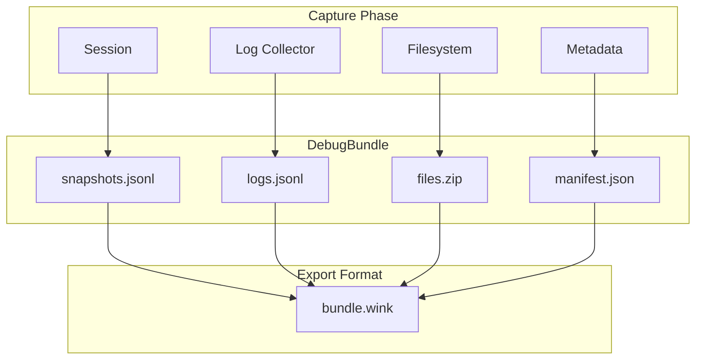

# Debug Bundle Specification

This document specifies the `DebugBundle` abstraction—a unified artifact that
captures all state necessary to understand what an agent did during execution
on a potentially long-running task.

## Overview

A debug bundle consolidates multiple debugging surfaces into a single,
self-contained artifact:

| Component | Source | Purpose |
| -------------------- | ---------------------- | -------------------------------------------- |
| **Session Snapshots** | `dump_session` | Complete session state, events, and slices |
| **Execution Logs** | `collect_all_logs` | Structured log timeline with full context |
| **Filesystem Archive** | `archive_filesystem` | Files created/modified during execution |
| **Bundle Metadata** | `DebugBundle` | Timing, configuration, environment context |



## Design Goals

1. **Single artifact**: One file captures everything needed for post-mortem
   analysis, shareable across teams and environments.

2. **Complete context**: The bundle contains sufficient information to
   reconstruct the agent's decision-making process, including:
   - What prompts were rendered and sent
   - What tools were invoked and their results
   - What files were read/written
   - What logs were emitted at each stage
   - Session state transitions over time

3. **Offline analysis**: Bundles can be loaded into `wink debug` without
   requiring the original codebase, runtime, or provider access.

4. **Streaming capture**: Bundles can be built incrementally during long
   executions without requiring full in-memory state.

## Bundle Format

### File Structure

A debug bundle is a zip archive with the `.wink` extension:

```
bundle.wink
├── manifest.json       # Bundle metadata and component index
├── snapshots.jsonl     # Session state snapshots (one JSON object per line)
├── logs.jsonl          # Structured log records (one JSON object per line)
└── files/              # Filesystem archive contents (optional)
    ├── workspace/      # Files from agent workspace
    │   └── ...
    └── artifacts/      # Generated outputs
        └── ...
```

### Manifest Schema

```json
{
  "version": "1",
  "bundle_id": "uuid",
  "created_at": "2024-01-15T10:30:00+00:00",
  "session_id": "uuid",
  "agent": {
    "name": "code-reviewer",
    "version": "1.0.0",
    "adapter": "claude-agent-sdk",
    "model": "claude-sonnet-4-20250514"
  },
  "execution": {
    "started_at": "2024-01-15T10:30:00+00:00",
    "ended_at": "2024-01-15T10:35:00+00:00",
    "duration_seconds": 300.0,
    "outcome": "success",
    "error": null
  },
  "environment": {
    "platform": "linux",
    "python_version": "3.12.0",
    "weakincentives_version": "0.1.0"
  },
  "components": {
    "snapshots": {
      "path": "snapshots.jsonl",
      "entry_count": 5,
      "size_bytes": 12345
    },
    "logs": {
      "path": "logs.jsonl",
      "entry_count": 1234,
      "size_bytes": 98765
    },
    "files": {
      "path": "files/",
      "file_count": 10,
      "total_size_bytes": 54321
    }
  },
  "tags": {
    "task_id": "PR-123",
    "repository": "acme/webapp"
  }
}
```

### Manifest Fields

| Field | Type | Description |
| --------------------- | -------- | ---------------------------------------------------- |
| `version` | `string` | Bundle format version (currently `"1"`) |
| `bundle_id` | `string` | Unique identifier for this bundle |
| `created_at` | `string` | ISO 8601 timestamp when bundle was finalized |
| `session_id` | `string` | Root session ID for the captured execution |
| `agent.name` | `string` | Agent identifier or prompt namespace |
| `agent.version` | `string` | Agent version (optional) |
| `agent.adapter` | `string` | Provider adapter used (`openai`, `litellm`, `claude-agent-sdk`) |
| `agent.model` | `string` | Model identifier |
| `execution.started_at` | `string` | When execution began |
| `execution.ended_at` | `string` | When execution completed |
| `execution.duration_seconds` | `number` | Wall-clock execution time |
| `execution.outcome` | `string` | `"success"`, `"failure"`, `"timeout"`, `"cancelled"` |
| `execution.error` | `object` | Error details if outcome is not success |
| `environment.*` | `string` | Runtime environment metadata |
| `components.*` | `object` | Index of bundle contents with sizes |
| `tags` | `object` | User-provided key-value metadata |

### Snapshots Format

The `snapshots.jsonl` file contains session snapshots in the existing format
used by `dump_session`. Each line is a complete `SnapshotPayload`:

```jsonl
{"version":"1","created_at":"...","tags":{"session_id":"..."},"slices":[...]}
{"version":"1","created_at":"...","tags":{"session_id":"..."},"slices":[...]}
```

Snapshots are written chronologically. For multi-session hierarchies, parent
sessions appear before their children.

### Logs Format

The `logs.jsonl` file contains structured log records in the format produced
by `collect_all_logs`:

```jsonl
{"timestamp":"2024-01-15T10:30:00+00:00","level":"INFO","logger":"weakincentives.adapters.openai","event":"evaluate.entry","message":"...","context":{...}}
{"timestamp":"2024-01-15T10:30:01+00:00","level":"DEBUG","logger":"weakincentives.prompt","event":"prompt.render.complete","message":"...","context":{...}}
```

Logs are written chronologically with microsecond precision timestamps.

### Files Directory

The `files/` directory contains filesystem artifacts organized by source:

- `files/workspace/` - Working directory contents (from VFS or real filesystem)
- `files/artifacts/` - Generated outputs (reports, diffs, etc.)
- `files/inputs/` - Input files provided to the agent (optional)

File paths are preserved relative to their original location.

## API

### DebugBundle

```python
from dataclasses import dataclass, field
from datetime import datetime
from pathlib import Path
from typing import Mapping
from uuid import UUID

@dataclass(slots=True)
class AgentInfo:
    """Metadata about the agent that produced the bundle."""
    name: str
    adapter: str
    model: str
    version: str | None = None


@dataclass(slots=True)
class ExecutionInfo:
    """Metadata about the execution captured in the bundle."""
    started_at: datetime
    ended_at: datetime | None = None
    outcome: str = "in_progress"
    error: Mapping[str, object] | None = None

    @property
    def duration_seconds(self) -> float | None:
        if self.ended_at is None:
            return None
        return (self.ended_at - self.started_at).total_seconds()


@dataclass(slots=True)
class DebugBundle:
    """A self-contained debug artifact for agent execution analysis.

    The bundle captures session state, logs, and filesystem artifacts
    into a single exportable archive.
    """

    session_id: UUID
    agent: AgentInfo
    execution: ExecutionInfo
    tags: Mapping[str, str] = field(default_factory=dict)
    bundle_id: UUID = field(default_factory=uuid4)

    # Internal state (populated during capture)
    _snapshots: list[str] = field(default_factory=list, repr=False)
    _logs: list[str] = field(default_factory=list, repr=False)
    _files: dict[str, bytes] = field(default_factory=dict, repr=False)
```

### DebugBundleBuilder

```python
from contextlib import contextmanager
from weakincentives.debug import DebugBundle
from weakincentives.runtime.session import Session
from weakincentives.filesystem import Filesystem

class DebugBundleBuilder:
    """Incrementally build a debug bundle during agent execution.

    Example::

        builder = DebugBundleBuilder(
            session=session,
            agent=AgentInfo(name="reviewer", adapter="openai", model="gpt-4o"),
        )

        with builder.capture():
            response = adapter.evaluate(prompt, session=session)

        bundle = builder.finalize()
        bundle.export("./debug/task-123.wink")
    """

    def __init__(
        self,
        *,
        session: Session,
        agent: AgentInfo,
        tags: Mapping[str, str] | None = None,
    ) -> None: ...

    @contextmanager
    def capture(self) -> Iterator[DebugBundle]:
        """Context manager that captures logs and snapshots during execution.

        Yields the in-progress bundle for inspection. Call `finalize()` after
        the context exits to complete the bundle.
        """
        ...

    def add_snapshot(self) -> None:
        """Manually add a session snapshot to the bundle.

        Called automatically at key lifecycle points, but can be invoked
        manually for finer-grained capture.
        """
        ...

    def add_filesystem(self, fs: Filesystem, *, prefix: str = "workspace") -> None:
        """Add filesystem contents to the bundle.

        Args:
            fs: Filesystem instance to archive.
            prefix: Directory prefix within the bundle's files directory.
        """
        ...

    def add_artifact(self, path: str, content: bytes) -> None:
        """Add an arbitrary artifact to the bundle.

        Args:
            path: Relative path within the files/artifacts directory.
            content: Raw file content.
        """
        ...

    def finalize(
        self,
        *,
        outcome: str = "success",
        error: Mapping[str, object] | None = None,
    ) -> DebugBundle:
        """Complete the bundle and return the finalized artifact.

        Args:
            outcome: Execution outcome (success, failure, timeout, cancelled).
            error: Error details if outcome is not success.

        Returns:
            The completed DebugBundle ready for export.
        """
        ...
```

### Export and Import

```python
class DebugBundle:
    # ... (fields from above)

    def export(self, target: str | Path) -> Path:
        """Export the bundle to a .wink file.

        Args:
            target: Destination path. If a directory, uses bundle_id.wink.

        Returns:
            Path to the created bundle file.
        """
        ...

    @classmethod
    def load(cls, path: str | Path) -> "DebugBundle":
        """Load a bundle from a .wink file.

        Args:
            path: Path to the bundle file.

        Returns:
            The loaded DebugBundle with all components accessible.

        Raises:
            DebugBundleError: If the bundle is invalid or corrupted.
        """
        ...

    @property
    def snapshots(self) -> Iterator[SnapshotPayload]:
        """Iterate over session snapshots in chronological order."""
        ...

    @property
    def logs(self) -> Iterator[LogEntry]:
        """Iterate over log entries in chronological order."""
        ...

    def list_files(self) -> list[str]:
        """List all files in the bundle's files directory."""
        ...

    def read_file(self, path: str) -> bytes:
        """Read a file from the bundle.

        Args:
            path: Relative path within the files directory.

        Returns:
            Raw file content.

        Raises:
            FileNotFoundError: If the file doesn't exist in the bundle.
        """
        ...
```

## Usage Patterns

### Basic Capture

```python
from weakincentives.debug import DebugBundleBuilder, AgentInfo

builder = DebugBundleBuilder(
    session=session,
    agent=AgentInfo(
        name="code-reviewer",
        adapter="claude-agent-sdk",
        model="claude-sonnet-4-20250514",
    ),
    tags={"pr_number": "123", "repository": "acme/webapp"},
)

with builder.capture():
    response = adapter.evaluate(prompt, session=session)

bundle = builder.finalize()
bundle.export("./debug/")
# Creates: ./debug/<bundle_id>.wink
```

### Capture with Filesystem

```python
from weakincentives.contrib.tools import VirtualFilesystem

vfs = VirtualFilesystem()

builder = DebugBundleBuilder(session=session, agent=agent_info)

with builder.capture():
    # Bind VFS to prompt resources
    with prompt.resources:
        response = adapter.evaluate(prompt, session=session)

    # Add VFS contents to bundle
    builder.add_filesystem(vfs)

bundle = builder.finalize()
```

### Capture with Error Handling

```python
builder = DebugBundleBuilder(session=session, agent=agent_info)

try:
    with builder.capture():
        response = adapter.evaluate(prompt, session=session)
    bundle = builder.finalize(outcome="success")
except DeadlineExceededError as e:
    bundle = builder.finalize(
        outcome="timeout",
        error={"type": "DeadlineExceededError", "message": str(e)},
    )
except Exception as e:
    bundle = builder.finalize(
        outcome="failure",
        error={"type": type(e).__name__, "message": str(e)},
    )
finally:
    bundle.export("./debug/")
```

### Periodic Snapshots for Long Tasks

```python
from weakincentives.adapters.claude_agent_sdk import ClaudeAgentSDKAdapter

builder = DebugBundleBuilder(session=session, agent=agent_info)

# Register snapshot callback for tool invocations
def on_tool_invoked(event: ToolInvoked) -> None:
    builder.add_snapshot()

dispatcher.subscribe(ToolInvoked, on_tool_invoked)

with builder.capture():
    # Long-running execution with periodic snapshots
    response = adapter.evaluate(prompt, session=session)

bundle = builder.finalize()
```

### Loading and Inspecting Bundles

```python
from weakincentives.debug import DebugBundle

bundle = DebugBundle.load("./debug/abc123.wink")

# Inspect metadata
print(f"Session: {bundle.session_id}")
print(f"Duration: {bundle.execution.duration_seconds}s")
print(f"Outcome: {bundle.execution.outcome}")

# Iterate snapshots
for snapshot in bundle.snapshots:
    print(f"Snapshot at {snapshot.created_at}: {len(snapshot.slices)} slices")

# Iterate logs
for log in bundle.logs:
    if log.level == "ERROR":
        print(f"[{log.timestamp}] {log.event}: {log.message}")

# Access files
for path in bundle.list_files():
    print(f"File: {path}")
    if path.endswith(".py"):
        content = bundle.read_file(path)
        print(content.decode("utf-8")[:200])
```

## CLI Integration

### `wink debug` Enhancement

The `wink debug` command is enhanced to accept debug bundles as input:

```bash
# Load a debug bundle
wink debug ./debug/abc123.wink

# Load with specific component focus
wink debug ./debug/abc123.wink --view snapshots
wink debug ./debug/abc123.wink --view logs
wink debug ./debug/abc123.wink --view files

# Export bundle components
wink debug ./debug/abc123.wink --export-logs ./logs.jsonl
wink debug ./debug/abc123.wink --export-files ./files/
```

### Path Resolution

The `wink debug` command accepts:

1. **Bundle files** (`.wink`): Load the complete bundle
2. **JSONL files** (`.jsonl`): Load as snapshots (backward compatible)
3. **Directories**: Search for most recent `.wink` or `.jsonl` file

```bash
# All equivalent for bundle loading
wink debug ./debug/abc123.wink
wink debug ./debug/  # Finds most recent .wink or .jsonl
```

### Web UI Enhancements

The debug web UI gains new capabilities for bundle inspection:

| Tab | Purpose |
| ------------ | ------------------------------------------- |
| **Snapshots** | Existing slice/event browser |
| **Logs** | Filterable log timeline with search |
| **Files** | File browser with preview |
| **Metadata** | Bundle info, agent config, execution summary |

## Automatic Snapshot Points

The `DebugBundleBuilder.capture()` context manager automatically takes
snapshots at key lifecycle points:

| Event | Snapshot Timing |
| -------------------- | ----------------------------------- |
| `capture()` entry | Initial state before execution |
| `PromptRendered` | After prompt rendering, before send |
| `ToolInvoked` | After each tool execution |
| `PromptExecuted` | After evaluation completes |
| `capture()` exit | Final state after execution |

Additional snapshots can be triggered manually via `builder.add_snapshot()`.

## Error Handling

### DebugBundleError

```python
class DebugBundleError(WinkError, RuntimeError):
    """Base error for debug bundle operations."""


class BundleCorruptedError(DebugBundleError):
    """Bundle file is corrupted or invalid."""


class BundleVersionError(DebugBundleError):
    """Bundle version is not supported."""


class BundleComponentMissingError(DebugBundleError):
    """Required bundle component is missing."""
```

### Resilient Loading

Bundle loading is resilient to partial corruption:

- Missing optional components (files) don't prevent loading
- Malformed log entries are skipped with warnings
- Invalid snapshot entries are marked with validation errors
- Manifest parsing failures raise `BundleCorruptedError`

## Size Management

### Streaming Export

Large bundles are written incrementally to avoid memory exhaustion:

```python
def export(self, target: str | Path) -> Path:
    """Export streams components directly to the zip file."""
    with zipfile.ZipFile(target, "w", zipfile.ZIP_DEFLATED) as zf:
        # Stream snapshots
        with zf.open("snapshots.jsonl", "w") as f:
            for snapshot in self._snapshots:
                f.write((snapshot + "\n").encode())

        # Stream logs
        with zf.open("logs.jsonl", "w") as f:
            for log in self._logs:
                f.write((log + "\n").encode())

        # Add files
        for path, content in self._files.items():
            zf.writestr(f"files/{path}", content)

        # Write manifest last
        zf.writestr("manifest.json", self._build_manifest())
```

### Log Rotation

For very long executions, logs can be rotated to prevent unbounded growth:

```python
builder = DebugBundleBuilder(
    session=session,
    agent=agent_info,
    log_rotation=LogRotationConfig(
        max_entries=100_000,      # Rotate after 100k entries
        max_bytes=50_000_000,     # Rotate after 50MB
        keep_rotations=3,         # Keep 3 rotated segments
    ),
)
```

### File Size Limits

Large files can be truncated or excluded:

```python
builder.add_filesystem(
    vfs,
    max_file_size=1_000_000,  # Skip files > 1MB
    exclude_patterns=["*.bin", "node_modules/**"],
)
```

## Relationship to Existing APIs

The `DebugBundle` abstraction builds on existing functions:

| Existing Function | Bundle Usage |
| --------------------- | ------------------------------------------------- |
| `collect_all_logs()` | Powers log capture within `capture()` context |
| `dump_session()` | Called by `add_snapshot()` to serialize state |
| `archive_filesystem()` | Called by `add_filesystem()` to archive VFS |

The bundle provides a unified interface while preserving the ability to use
these functions independently for simpler use cases.

## Thread Safety

- `DebugBundleBuilder` is **not** thread-safe; use one builder per execution
- `DebugBundle` (loaded) is immutable and safe to share across threads
- Log capture uses Python's logging infrastructure, which is thread-safe

## Implementation Notes

- Bundle files use ZIP with DEFLATED compression for portability
- Manifest is written last to ensure component sizes are accurate
- Timestamps use UTC with ISO 8601 format throughout
- File paths use forward slashes regardless of platform
- The `.wink` extension is chosen to avoid conflicts with common formats

## Migration Path

### From Existing Debug Utilities

Applications using the existing debug utilities can migrate incrementally:

```python
# Before: Manual coordination of debug outputs
debug_dir = f"./debug/{session.session_id}"
with collect_all_logs(f"{debug_dir}/prompt.log"):
    response = adapter.evaluate(prompt, session=session)
dump_session(session, debug_dir)
archive_filesystem(fs, debug_dir)

# After: Unified bundle capture
builder = DebugBundleBuilder(session=session, agent=agent_info)
with builder.capture():
    response = adapter.evaluate(prompt, session=session)
builder.add_filesystem(fs)
builder.finalize().export("./debug/")
```

### Backward Compatibility

- `wink debug` continues to accept JSONL snapshot files
- Existing `collect_all_logs`, `dump_session`, and `archive_filesystem`
  remain available for standalone use
- Bundle format version in manifest enables future evolution

## Related Specifications

- `specs/DEBUGGING.md` - Original debugging surfaces (superseded by this spec)
- `specs/WINK_DEBUG.md` - Debug web UI specification
- `specs/SESSIONS.md` - Session lifecycle and snapshots
- `specs/SLICES.md` - Slice storage backends
- `specs/LOGGING.md` - Structured logging schema
- `specs/FILESYSTEM.md` - Filesystem protocol
