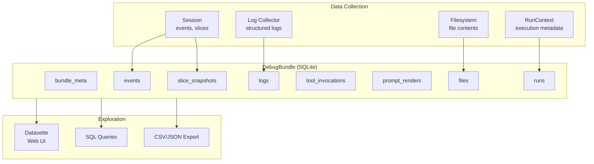

# Debug Bundle Specification

## Purpose

A DebugBundle is a self-contained SQLite database that captures all debugging
information from a long-running agent task into a single portable artifact.
Backed by Datasette for interactive exploration, it consolidates session events,
logs, tool invocations, file artifacts, and execution metadata that would
otherwise be scattered across multiple files and formats.

This specification complements `specs/DEBUGGING.md` by defining how to aggregate
all debugging surfaces into one queryable, shareable package.

## Motivation

Long-running agent tasks generate debugging data across multiple surfaces:

| Surface | Current Format | Location |
| ----------------- | -------------- | -------------------------------- |
| Session events | JSONL | `<session_id>.jsonl` |
| Log messages | JSONL | `<session_id>.log` |
| Filesystem state | ZIP | `<uuid>.zip` |
| Tool invocations | Session slice | In-memory or JSONL slice |
| Prompt renders | Session slice | In-memory or JSONL slice |
| Token usage | Event fields | Scattered across events |
| Run context | Event fields | Scattered across events |

**Problems with the current approach:**

1. **Fragmentation**: Debugging data is split across 3+ files per task
2. **Correlation**: Joining data across files requires custom scripts
3. **Querying**: JSONL files don't support SQL-style queries
4. **Sharing**: Multiple files are awkward to share or archive
5. **Exploration**: No unified interface for browsing all data

**DebugBundle solves these by:**

1. **Consolidation**: Single SQLite file with all data
2. **Correlation**: Foreign keys link related records
3. **Querying**: Full SQL support via SQLite
4. **Sharing**: One file to transfer or archive
5. **Exploration**: Datasette provides immediate web UI

## Architecture



## Database Schema

### `bundle_meta`

Bundle-level metadata (single row):

```sql
CREATE TABLE bundle_meta (
    id INTEGER PRIMARY KEY CHECK (id = 1),
    bundle_id TEXT NOT NULL,           -- UUID
    created_at TEXT NOT NULL,          -- ISO 8601
    wink_version TEXT NOT NULL,        -- e.g., "0.1.0"
    schema_version INTEGER NOT NULL,   -- Schema version for migrations
    root_session_id TEXT,              -- Root session UUID
    experiment_name TEXT,              -- Experiment name if applicable
    experiment_tag TEXT,               -- Overrides tag if applicable
    description TEXT,                  -- User-provided description
    tags TEXT                          -- JSON object of custom tags
);
```

### `runs`

Execution runs with RunContext metadata:

```sql
CREATE TABLE runs (
    run_id TEXT PRIMARY KEY,           -- UUID
    request_id TEXT NOT NULL,          -- Correlates retries
    session_id TEXT,                   -- Session UUID
    attempt INTEGER NOT NULL DEFAULT 1,
    worker_id TEXT,
    trace_id TEXT,                     -- OpenTelemetry trace
    span_id TEXT,                      -- OpenTelemetry span
    started_at TEXT NOT NULL,          -- ISO 8601
    ended_at TEXT,                     -- ISO 8601, NULL if incomplete
    status TEXT NOT NULL,              -- 'running', 'completed', 'failed'
    error_type TEXT,                   -- Exception class if failed
    error_message TEXT                 -- Exception message if failed
);

CREATE INDEX idx_runs_session ON runs(session_id);
CREATE INDEX idx_runs_request ON runs(request_id);
CREATE INDEX idx_runs_trace ON runs(trace_id);
```

### `events`

Session events (dispatched dataclass instances):

```sql
CREATE TABLE events (
    event_id TEXT PRIMARY KEY,         -- UUID
    run_id TEXT REFERENCES runs(run_id),
    session_id TEXT NOT NULL,
    event_type TEXT NOT NULL,          -- Qualified class name
    timestamp TEXT NOT NULL,           -- ISO 8601
    sequence INTEGER NOT NULL,         -- Order within session
    payload TEXT NOT NULL              -- JSON serialization
);

CREATE INDEX idx_events_session ON events(session_id);
CREATE INDEX idx_events_type ON events(event_type);
CREATE INDEX idx_events_run ON events(run_id);
CREATE INDEX idx_events_timestamp ON events(timestamp);
```

### `logs`

Structured log records:

```sql
CREATE TABLE logs (
    id INTEGER PRIMARY KEY AUTOINCREMENT,
    run_id TEXT REFERENCES runs(run_id),
    session_id TEXT,
    timestamp TEXT NOT NULL,           -- ISO 8601
    level TEXT NOT NULL,               -- DEBUG, INFO, WARNING, ERROR, CRITICAL
    logger TEXT NOT NULL,              -- Logger name
    event TEXT,                        -- Structured event name
    message TEXT NOT NULL,             -- Log message
    context TEXT                       -- JSON context payload
);

CREATE INDEX idx_logs_session ON logs(session_id);
CREATE INDEX idx_logs_level ON logs(level);
CREATE INDEX idx_logs_event ON logs(event);
CREATE INDEX idx_logs_run ON logs(run_id);
CREATE INDEX idx_logs_timestamp ON logs(timestamp);
```

### `tool_invocations`

Tool calls with params and results:

```sql
CREATE TABLE tool_invocations (
    invocation_id TEXT PRIMARY KEY,    -- UUID (event_id from ToolInvoked)
    run_id TEXT REFERENCES runs(run_id),
    session_id TEXT NOT NULL,
    prompt_name TEXT NOT NULL,
    tool_name TEXT NOT NULL,
    call_id TEXT,                      -- Provider's tool call ID
    timestamp TEXT NOT NULL,           -- ISO 8601
    duration_ms INTEGER,               -- Execution duration
    params TEXT NOT NULL,              -- JSON params
    result_success INTEGER NOT NULL,   -- 0 or 1
    result_message TEXT,
    result_value TEXT,                 -- JSON if structured
    rendered_output TEXT,              -- Text returned to model
    input_tokens INTEGER,
    output_tokens INTEGER
);

CREATE INDEX idx_tools_session ON tool_invocations(session_id);
CREATE INDEX idx_tools_name ON tool_invocations(tool_name);
CREATE INDEX idx_tools_run ON tool_invocations(run_id);
CREATE INDEX idx_tools_success ON tool_invocations(result_success);
```

### `prompt_renders`

Prompt rendering events:

```sql
CREATE TABLE prompt_renders (
    render_id TEXT PRIMARY KEY,        -- UUID (event_id from PromptRendered)
    run_id TEXT REFERENCES runs(run_id),
    session_id TEXT NOT NULL,
    prompt_ns TEXT NOT NULL,
    prompt_key TEXT NOT NULL,
    prompt_name TEXT,
    adapter TEXT NOT NULL,
    timestamp TEXT NOT NULL,           -- ISO 8601
    rendered_text TEXT NOT NULL,       -- Full rendered prompt
    char_count INTEGER NOT NULL,
    tool_count INTEGER NOT NULL,
    tool_names TEXT,                   -- JSON array
    has_structured_output INTEGER,     -- 0 or 1
    output_type TEXT,                  -- Qualified class name
    override_tag TEXT                  -- Overrides tag used
);

CREATE INDEX idx_renders_session ON prompt_renders(session_id);
CREATE INDEX idx_renders_prompt ON prompt_renders(prompt_ns, prompt_key);
CREATE INDEX idx_renders_run ON prompt_renders(run_id);
```

### `prompt_executions`

Prompt execution results:

```sql
CREATE TABLE prompt_executions (
    execution_id TEXT PRIMARY KEY,     -- UUID (event_id from PromptExecuted)
    run_id TEXT REFERENCES runs(run_id),
    session_id TEXT NOT NULL,
    prompt_name TEXT NOT NULL,
    adapter TEXT NOT NULL,
    timestamp TEXT NOT NULL,           -- ISO 8601
    duration_ms INTEGER,
    result_type TEXT,                  -- 'success', 'error', 'timeout'
    output TEXT,                       -- JSON serialized output
    error_type TEXT,
    error_message TEXT,
    input_tokens INTEGER,
    output_tokens INTEGER,
    total_tokens INTEGER,
    cache_read_tokens INTEGER,
    cache_write_tokens INTEGER
);

CREATE INDEX idx_executions_session ON prompt_executions(session_id);
CREATE INDEX idx_executions_run ON prompt_executions(run_id);
CREATE INDEX idx_executions_result ON prompt_executions(result_type);
```

### `files`

Filesystem contents at capture time:

```sql
CREATE TABLE files (
    id INTEGER PRIMARY KEY AUTOINCREMENT,
    session_id TEXT NOT NULL,
    run_id TEXT REFERENCES runs(run_id),
    path TEXT NOT NULL,
    size_bytes INTEGER NOT NULL,
    content_type TEXT,                 -- MIME type or 'binary'
    content TEXT,                      -- Text content (NULL for binary)
    content_hash TEXT,                 -- SHA-256 for deduplication
    captured_at TEXT NOT NULL          -- ISO 8601
);

CREATE INDEX idx_files_session ON files(session_id);
CREATE INDEX idx_files_path ON files(path);
CREATE INDEX idx_files_run ON files(run_id);
CREATE UNIQUE INDEX idx_files_dedup ON files(session_id, path, content_hash);
```

### `slice_snapshots`

Session slice state at various points:

```sql
CREATE TABLE slice_snapshots (
    id INTEGER PRIMARY KEY AUTOINCREMENT,
    session_id TEXT NOT NULL,
    run_id TEXT REFERENCES runs(run_id),
    snapshot_at TEXT NOT NULL,         -- ISO 8601
    slice_type TEXT NOT NULL,          -- Qualified class name
    item_count INTEGER NOT NULL,
    items TEXT NOT NULL,               -- JSON array of serialized items
    trigger TEXT                       -- What caused the snapshot
);

CREATE INDEX idx_slices_session ON slice_snapshots(session_id);
CREATE INDEX idx_slices_type ON slice_snapshots(slice_type);
CREATE INDEX idx_slices_run ON slice_snapshots(run_id);
```

### `token_usage`

Aggregated token usage per run:

```sql
CREATE TABLE token_usage (
    run_id TEXT PRIMARY KEY REFERENCES runs(run_id),
    total_input_tokens INTEGER NOT NULL DEFAULT 0,
    total_output_tokens INTEGER NOT NULL DEFAULT 0,
    total_tokens INTEGER NOT NULL DEFAULT 0,
    cache_read_tokens INTEGER NOT NULL DEFAULT 0,
    cache_write_tokens INTEGER NOT NULL DEFAULT 0,
    prompt_count INTEGER NOT NULL DEFAULT 0,
    tool_count INTEGER NOT NULL DEFAULT 0
);
```

## Core Types

### DebugBundle

```python
@dataclass(slots=True)
class DebugBundle:
    """Self-contained debugging artifact backed by SQLite.

    A DebugBundle consolidates all debugging data from a long-running agent
    task into a single queryable file. It can be created during execution
    (live capture) or assembled post-hoc from existing artifacts.

    Usage::

        # Create during execution
        with DebugBundle.create("./debug/task-001.db") as bundle:
            bundle.bind_session(session)
            bundle.bind_logs(log_collector)
            # ... run agent ...

        # Open for exploration
        bundle = DebugBundle.open("./debug/task-001.db")
        bundle.serve()  # Launch Datasette
    """

    path: Path
    _conn: sqlite3.Connection
    _session: Session | None = None
    _run_context: RunContext | None = None

    @classmethod
    def create(
        cls,
        path: str | Path,
        *,
        description: str | None = None,
        tags: Mapping[str, str] | None = None,
    ) -> "DebugBundle":
        """Create a new debug bundle at the given path."""
        ...

    @classmethod
    def open(cls, path: str | Path) -> "DebugBundle":
        """Open an existing debug bundle for reading or appending."""
        ...

    def bind_session(self, session: Session) -> None:
        """Bind a session for automatic event capture.

        Events dispatched to the session are automatically recorded to
        the bundle. Call this before starting agent execution.
        """
        ...

    def bind_run_context(self, run_context: RunContext) -> None:
        """Bind run context for correlation metadata."""
        ...

    def record_log(self, record: logging.LogRecord) -> None:
        """Record a log entry to the bundle."""
        ...

    def record_file(
        self,
        path: str,
        content: bytes | str,
        *,
        content_type: str | None = None,
    ) -> None:
        """Record a file to the bundle."""
        ...

    def snapshot_slices(self, trigger: str = "manual") -> None:
        """Capture current state of all session slices."""
        ...

    def finalize(
        self,
        *,
        status: Literal["completed", "failed"] = "completed",
        error: Exception | None = None,
    ) -> None:
        """Finalize the bundle, recording end state."""
        ...

    def serve(
        self,
        *,
        host: str = "127.0.0.1",
        port: int = 8001,
        open_browser: bool = True,
    ) -> None:
        """Launch Datasette to explore the bundle."""
        ...

    def close(self) -> None:
        """Close the database connection."""
        ...

    def __enter__(self) -> "DebugBundle":
        return self

    def __exit__(self, *args: object) -> None:
        self.close()
```

### BundleConfig

```python
@FrozenDataclass()
class BundleConfig:
    """Configuration for debug bundle capture.

    Controls what data is captured and how. Useful for reducing bundle
    size in production or enabling verbose capture for debugging.
    """

    capture_logs: bool = True
    capture_files: bool = True
    capture_slice_snapshots: bool = True
    log_level: int = logging.DEBUG
    max_file_size_bytes: int = 10 * 1024 * 1024  # 10MB
    snapshot_interval_events: int | None = None  # Auto-snapshot every N events
    exclude_log_events: frozenset[str] = frozenset()
    exclude_slice_types: frozenset[str] = frozenset()
```

## Collection Patterns

### Live Capture

Capture data during agent execution:

```python
from weakincentives.debug import DebugBundle, BundleConfig

config = BundleConfig(
    capture_logs=True,
    capture_files=True,
    snapshot_interval_events=100,
)

with DebugBundle.create(
    f"./debug/{session.session_id}.db",
    description="Code review task",
    tags={"task": "review", "pr": "123"},
) as bundle:
    # Bind session for automatic event capture
    bundle.bind_session(session)
    bundle.bind_run_context(run_context)

    # Capture logs during execution
    with bundle.capture_logs():
        response = adapter.evaluate(prompt, session=session)

    # Capture filesystem state
    if fs := prompt.resources.get(Filesystem, None):
        bundle.capture_filesystem(fs)

    # Finalize with status
    bundle.finalize(status="completed")

# Bundle is now ready for exploration
print(f"Debug bundle: {bundle.path}")
```

### Post-Hoc Assembly

Assemble a bundle from existing artifacts:

```python
from weakincentives.debug import DebugBundle

# Create bundle from existing files
bundle = DebugBundle.from_artifacts(
    output_path="./debug/assembled.db",
    session_snapshot="./debug/session.jsonl",
    log_file="./debug/session.log",
    filesystem_archive="./debug/files.zip",
    description="Assembled from artifacts",
)

# Or assemble incrementally
with DebugBundle.create("./debug/assembled.db") as bundle:
    bundle.import_session_snapshot(Path("./debug/session.jsonl"))
    bundle.import_logs(Path("./debug/session.log"))
    bundle.import_filesystem_archive(Path("./debug/files.zip"))
```

### Context Manager Protocol

The bundle supports context manager protocol for automatic cleanup:

```python
with DebugBundle.create("./debug/task.db") as bundle:
    bundle.bind_session(session)
    try:
        response = adapter.evaluate(prompt, session=session)
        bundle.finalize(status="completed")
    except Exception as e:
        bundle.finalize(status="failed", error=e)
        raise
# Connection closed automatically
```

## Log Integration

### Automatic Log Capture

The bundle provides a logging handler for automatic capture:

```python
with DebugBundle.create("./debug/task.db") as bundle:
    bundle.bind_session(session)

    # Capture logs automatically
    with bundle.capture_logs(level=logging.DEBUG):
        response = adapter.evaluate(prompt, session=session)
```

### Manual Log Recording

For custom logging pipelines:

```python
bundle = DebugBundle.open("./debug/task.db")

# Record individual log entries
bundle.record_log(log_record)

# Import from existing JSONL file
bundle.import_logs(Path("./logs/session.log"))
```

### Log Queries

Common log queries via Datasette or SQL:

```sql
-- Errors and warnings
SELECT timestamp, level, event, message
FROM logs
WHERE level IN ('ERROR', 'WARNING')
ORDER BY timestamp;

-- Tool execution timeline
SELECT timestamp, event, json_extract(context, '$.tool_name') as tool
FROM logs
WHERE event LIKE 'tool.%'
ORDER BY timestamp;

-- Log frequency by event
SELECT event, COUNT(*) as count
FROM logs
GROUP BY event
ORDER BY count DESC;
```

## Session Integration

### Event Subscription

The bundle subscribes to session events for automatic capture:

```python
def bind_session(self, session: Session) -> None:
    """Bind session for automatic event capture."""
    self._session = session
    self._record_meta(session)

    # Subscribe to all dispatched events
    session.dispatcher.subscribe_all(self._on_event)

    # Subscribe to specific event types for structured capture
    session.dispatcher.subscribe(PromptRendered, self._on_prompt_rendered)
    session.dispatcher.subscribe(ToolInvoked, self._on_tool_invoked)
    session.dispatcher.subscribe(PromptExecuted, self._on_prompt_executed)
```

### Slice Snapshots

Capture slice state at key points:

```python
# Manual snapshot
bundle.snapshot_slices(trigger="before_tool_call")

# Auto-snapshot every N events
config = BundleConfig(snapshot_interval_events=100)

# Snapshot specific slices
bundle.snapshot_slice(Plan, trigger="plan_updated")
```

### Session Queries

```sql
-- All events for a session
SELECT event_type, timestamp, payload
FROM events
WHERE session_id = ?
ORDER BY sequence;

-- Tool invocation summary
SELECT tool_name,
       COUNT(*) as calls,
       SUM(CASE WHEN result_success THEN 1 ELSE 0 END) as successes,
       AVG(duration_ms) as avg_duration_ms
FROM tool_invocations
WHERE session_id = ?
GROUP BY tool_name;

-- Slice evolution over time
SELECT snapshot_at, item_count, items
FROM slice_snapshots
WHERE session_id = ? AND slice_type = ?
ORDER BY snapshot_at;
```

## Filesystem Integration

### Capture Patterns

```python
# Capture entire filesystem
bundle.capture_filesystem(fs)

# Capture specific paths
bundle.capture_file(fs, "/workspace/output.json")

# Capture with filters
bundle.capture_filesystem(
    fs,
    include_patterns=["*.py", "*.json"],
    exclude_patterns=["__pycache__/*", "*.pyc"],
    max_file_size=1024 * 1024,  # 1MB
)
```

### Import from Archive

```python
# Import from existing zip archive
bundle.import_filesystem_archive(Path("./debug/files.zip"))
```

### File Queries

```sql
-- All files in a session
SELECT path, size_bytes, content_type
FROM files
WHERE session_id = ?
ORDER BY path;

-- Large files
SELECT path, size_bytes
FROM files
WHERE size_bytes > 100000
ORDER BY size_bytes DESC;

-- File contents (text files only)
SELECT path, content
FROM files
WHERE session_id = ? AND content IS NOT NULL;
```

## Datasette Integration

### Launching Datasette

```python
# From bundle instance
bundle = DebugBundle.open("./debug/task.db")
bundle.serve(port=8001, open_browser=True)

# From CLI
# wink debug-bundle serve ./debug/task.db --port 8001
```

### Datasette Configuration

The bundle generates a `metadata.json` for Datasette:

```json
{
  "title": "Debug Bundle: task-001",
  "description": "Code review task for PR #123",
  "databases": {
    "bundle": {
      "tables": {
        "tool_invocations": {
          "label_column": "tool_name",
          "description": "Tool calls with parameters and results"
        },
        "logs": {
          "label_column": "event",
          "description": "Structured log records"
        }
      }
    }
  }
}
```

### Pre-Built Views

The bundle includes SQL views for common queries:

```sql
-- Execution timeline
CREATE VIEW execution_timeline AS
SELECT
    timestamp,
    'prompt_render' as event_type,
    prompt_name as name,
    NULL as success,
    char_count as detail
FROM prompt_renders
UNION ALL
SELECT
    timestamp,
    'tool_call' as event_type,
    tool_name as name,
    result_success as success,
    duration_ms as detail
FROM tool_invocations
UNION ALL
SELECT
    timestamp,
    'prompt_execute' as event_type,
    prompt_name as name,
    CASE result_type WHEN 'success' THEN 1 ELSE 0 END as success,
    duration_ms as detail
FROM prompt_executions
ORDER BY timestamp;

-- Token usage summary
CREATE VIEW token_summary AS
SELECT
    r.run_id,
    r.request_id,
    r.status,
    t.total_input_tokens,
    t.total_output_tokens,
    t.total_tokens,
    t.prompt_count,
    t.tool_count
FROM runs r
LEFT JOIN token_usage t ON r.run_id = t.run_id;

-- Error summary
CREATE VIEW error_summary AS
SELECT
    run_id,
    timestamp,
    level,
    event,
    message,
    json_extract(context, '$.error_type') as error_type
FROM logs
WHERE level IN ('ERROR', 'CRITICAL')
ORDER BY timestamp;
```

## CLI Integration

### `wink debug-bundle` Command

```
wink debug-bundle <subcommand> [options]

Subcommands:
  create    Create a new debug bundle from artifacts
  serve     Launch Datasette to explore a bundle
  export    Export bundle data to CSV/JSON
  info      Display bundle metadata and statistics
  merge     Merge multiple bundles into one
```

### Create from Artifacts

```bash
wink debug-bundle create \
    --output ./debug/bundle.db \
    --session ./debug/session.jsonl \
    --logs ./debug/session.log \
    --files ./debug/files.zip \
    --description "Task execution debug data"
```

### Serve Bundle

```bash
wink debug-bundle serve ./debug/bundle.db --port 8001
# Opens browser to http://127.0.0.1:8001
```

### Export Data

```bash
# Export to CSV
wink debug-bundle export ./debug/bundle.db \
    --format csv \
    --tables tool_invocations,logs \
    --output ./export/

# Export to JSON
wink debug-bundle export ./debug/bundle.db \
    --format json \
    --query "SELECT * FROM tool_invocations WHERE result_success = 0"
```

### Bundle Info

```bash
wink debug-bundle info ./debug/bundle.db

# Output:
# Bundle: ./debug/bundle.db
# Created: 2024-01-15T10:30:00+00:00
# Session: abc123-def456
# Description: Code review task
#
# Statistics:
#   Runs: 1
#   Events: 247
#   Logs: 1,432
#   Tool invocations: 23
#   Prompt renders: 5
#   Files: 12
#   Total size: 2.3 MB
```

## Performance Considerations

### Write Performance

- Uses WAL mode for concurrent reads during writes
- Batches inserts in transactions (configurable batch size)
- Defers index creation until finalization for large imports

```python
config = BundleConfig(
    write_batch_size=1000,  # Commit every 1000 records
    defer_indexes=True,      # Create indexes at finalization
)
```

### Read Performance

- Indexes on all foreign keys and common query columns
- Pre-built views for common queries
- Datasette caching for repeated queries

### Size Management

- Text content stored as-is; binary content excluded by default
- File deduplication via content hash
- Configurable max file size limits
- Optional compression for large text fields

```python
config = BundleConfig(
    max_file_size_bytes=10 * 1024 * 1024,  # 10MB
    compress_content=True,                   # gzip text > 10KB
    exclude_binary_files=True,               # Skip binary files
)
```

## Error Handling

### Collection Errors

Errors during data collection are logged but don't fail the bundle:

```python
def record_file(self, path: str, content: bytes | str, ...) -> None:
    try:
        self._insert_file(path, content, ...)
    except sqlite3.Error as e:
        logger.warning(
            "Failed to record file to bundle",
            extra={"path": path, "error": str(e)},
        )
        # Continue without failing
```

### Corrupt Bundles

Opening a corrupt bundle raises `BundleCorruptError`:

```python
try:
    bundle = DebugBundle.open("./debug/corrupt.db")
except BundleCorruptError as e:
    print(f"Bundle corrupt: {e.reason}")
    # Attempt recovery or report
```

### Schema Migration

Bundles include schema version for forward compatibility:

```python
def open(cls, path: str | Path) -> "DebugBundle":
    conn = sqlite3.connect(path)
    version = cls._get_schema_version(conn)

    if version < CURRENT_SCHEMA_VERSION:
        cls._migrate_schema(conn, version, CURRENT_SCHEMA_VERSION)
    elif version > CURRENT_SCHEMA_VERSION:
        raise BundleVersionError(
            f"Bundle schema v{version} is newer than supported v{CURRENT_SCHEMA_VERSION}"
        )

    return cls(path=Path(path), _conn=conn)
```

## Thread Safety

### Single-Writer Model

DebugBundle uses SQLite's WAL mode with a single-writer model:

- One thread writes to the bundle (typically the main execution thread)
- Multiple threads can read concurrently (Datasette, queries)
- Event subscription callbacks are queued and processed by the writer thread

```python
class DebugBundle:
    _write_queue: queue.Queue[Callable[[], None]]
    _writer_thread: threading.Thread

    def _on_event(self, event: object) -> None:
        # Queue write operation for writer thread
        self._write_queue.put(lambda: self._record_event(event))
```

### Read-Only Access

For pure exploration, open in read-only mode:

```python
bundle = DebugBundle.open("./debug/task.db", mode="ro")
# Only read operations allowed; safe for concurrent access
```

## Integration with Existing Tools

### Log Collector Integration

```python
from weakincentives.debug import collect_all_logs, DebugBundle

# Use both for maximum flexibility
with DebugBundle.create("./debug/task.db") as bundle:
    with collect_all_logs("./debug/task.log") as collector:
        with bundle.capture_logs():
            response = adapter.evaluate(prompt, session=session)

# Now have both:
# - ./debug/task.db (queryable bundle)
# - ./debug/task.log (raw JSONL for other tools)
```

### Session Dump Integration

```python
from weakincentives.debug import dump_session, DebugBundle

# Dump session to JSONL (for wink debug compatibility)
dump_session(session, "./debug/")

# Also create bundle (for SQL queries)
bundle = DebugBundle.from_artifacts(
    output_path="./debug/bundle.db",
    session_snapshot=f"./debug/{session.session_id}.jsonl",
)
```

### Archive Integration

```python
from weakincentives.debug import archive_filesystem, DebugBundle

# Archive to ZIP (for sharing)
archive_path = archive_filesystem(fs, "./debug/")

# Import into bundle (for queries)
bundle.import_filesystem_archive(archive_path)
```

## Logging Events

| Event | Level | Context |
| ------------------------------ | ----- | ---------------------------------------- |
| `debug_bundle.create` | INFO | `path`, `bundle_id` |
| `debug_bundle.open` | INFO | `path`, `schema_version` |
| `debug_bundle.bind_session` | DEBUG | `session_id` |
| `debug_bundle.record_event` | DEBUG | `event_type`, `event_id` |
| `debug_bundle.record_log` | DEBUG | `level`, `event` |
| `debug_bundle.record_file` | DEBUG | `path`, `size_bytes` |
| `debug_bundle.snapshot_slices` | DEBUG | `slice_count`, `trigger` |
| `debug_bundle.finalize` | INFO | `status`, `event_count`, `log_count` |
| `debug_bundle.serve` | INFO | `url` |
| `debug_bundle.migrate` | INFO | `from_version`, `to_version` |
| `debug_bundle.error` | ERROR | `operation`, `error` |

## Limitations

- **SQLite size limits**: Bundles over 1GB may experience slower queries
- **Binary content**: Large binary files excluded by default to manage size
- **Real-time updates**: Datasette doesn't auto-refresh; manual reload needed
- **No remote storage**: Bundles are local files; use separate tools for S3/GCS
- **Single writer**: Concurrent writes from multiple processes not supported

## Related Specifications

- `specs/DEBUGGING.md` - Individual debugging surfaces this consolidates
- `specs/WINK_DEBUG.md` - Debug web UI for JSONL snapshots
- `specs/SESSIONS.md` - Session events captured in bundles
- `specs/LOGGING.md` - Log schema stored in bundles
- `specs/RUN_CONTEXT.md` - Execution metadata for correlation
- `specs/SLICES.md` - Slice storage captured in snapshots
