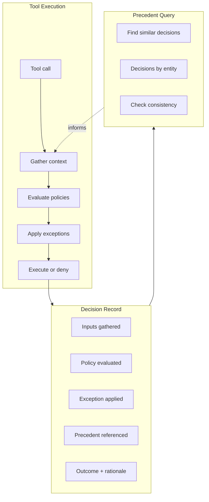

# Decision Lineage Specification

## Purpose

Decision lineage captures the reasoning behind agent actions — not just what
happened, but why it was allowed. For unattended agents, this reasoning must be
entirely policy-driven: the agent cannot pause for human approval. Instead,
decisions are governed by versioned policies, standing exceptions, and
queryable precedent.

This specification defines how WINK agents record structured decision traces
that explain context gathered, policies evaluated, exceptions applied, and
precedents referenced.

## Motivating Example: The Data Science Agent

A CEO asks an unattended agent: "What's our customer retention rate?"

This simple question forces dozens of implicit decisions:

| Decision Point | Options | Business Impact |
|----------------|---------|-----------------|
| Retention definition | Logo retention vs. revenue retention vs. cohort-based | Could vary from 72% to 94% |
| Time period | TTM, calendar year, fiscal year, quarter | Seasonal effects change story |
| Customer inclusion | All customers, exclude pilots, exclude acquisitions | Pilots churn at 3x rate |
| Data source | Finance system (authoritative, 2-day lag) vs. CRM (real-time, approximate) | Could differ by 2-3% |
| Edge cases | Payment pause = churned or active? Contract amendment = new customer? | Edge cases are 8% of base |

Without decision lineage, the CEO receives "87%" with no way to know:
- Is this comparable to the "91%" from last quarter? (Maybe different definition)
- Why did it drop? (Maybe we started including pilots)
- Can I quote this to the board? (Maybe it's from stale data)

With decision lineage, each decision is recorded:

```
Decision: select_retention_metric
├── Inputs:
│   ├── query_context: "retention rate" (no qualifier)
│   ├── audience: "ceo" (implies board-level precision)
│   └── prior_reports: ["Q3 Board Deck used revenue_retention"]
├── Policy: MetricSelectionPolicy v2.1.0
│   ├── Condition: audience in ["ceo", "board", "investor"] → require revenue_retention
│   └── Result: ALLOW revenue_retention
├── Precedent: Decision abc-123 (Q3 report, similarity=0.94)
│   └── Used: revenue_retention, ttm, exclude_pilots
├── Outcome: revenue_retention selected
└── Rationale: "Board-level query requires revenue retention per policy v2.1.0,
                consistent with Q3 board deck methodology"
```

The CEO now receives: "87% (revenue retention, TTM, excluding pilots, from
finance system as of Jan 6)" — and can trace exactly why each choice was made.

## Guiding Principles

- **Policy-driven**: All decisions derive from declared policies and standing
  exceptions. No human-in-the-loop blocking.
- **Deterministic**: Given the same inputs and policy version, the same
  decision results. Precedent informs but does not override policy.
- **Auditable**: Every decision records sufficient context to explain and
  replay the reasoning.
- **Queryable**: Past decisions become searchable precedent for consistency
  and learning.



## Core Types

### Decision

A structured record of a decision point:

```python
@FrozenDataclass()
class Decision:
    """Structured record of a policy decision."""

    decision_id: UUID
    tool_name: str
    params_digest: str  # Hash of parameters for deduplication

    # Context: what inputs were considered
    inputs: DecisionInputs

    # Policy: what rules governed
    policy_evaluation: PolicyEvaluation

    # Exception: any standing exception that applied
    exception_applied: ExceptionApplication | None

    # Precedent: similar past decisions referenced
    precedent_refs: tuple[PrecedentRef, ...] = ()

    # Outcome
    outcome: Literal["allowed", "denied", "allowed_by_exception"]
    rationale: str

    # Metadata
    session_id: UUID | None = None
    timestamp: datetime = field(default_factory=lambda: datetime.now(UTC))
```

### DecisionInputs

Captures context gathered before the decision:

```python
@FrozenDataclass()
class DecisionInputs:
    """Context gathered for a decision."""

    # Structured inputs by source
    sources: Mapping[str, InputSource]

    # Entity references (for graph linkage)
    entity_refs: tuple[EntityRef, ...] = ()


@FrozenDataclass()
class InputSource:
    """Input gathered from a specific source."""

    source_type: str  # "session_state", "resource", "external"
    source_name: str  # "Plan", "Filesystem", "customer_tier"
    keys_accessed: tuple[str, ...]  # What was read
    digest: str  # Hash of values for change detection


@FrozenDataclass()
class EntityRef:
    """Reference to a domain entity involved in the decision."""

    entity_type: str  # "customer", "ticket", "file"
    entity_id: str
```

### PolicyEvaluation

Records which policy was evaluated and how:

```python
@FrozenDataclass()
class PolicyEvaluation:
    """Record of policy evaluation."""

    policy_name: str
    policy_version: str  # Semantic version or commit hash
    policy_hash: str  # Content hash for exact reproducibility

    # Evaluation details
    conditions_checked: tuple[ConditionResult, ...] = ()
    base_decision: Literal["allow", "deny"]
    denial_reason: str | None = None


@FrozenDataclass()
class ConditionResult:
    """Result of evaluating a single policy condition."""

    condition_name: str
    expression: str  # Human-readable condition
    result: bool
    inputs_used: tuple[str, ...]  # Which inputs influenced this
```

### ExceptionApplication

Records when a standing exception overrode base policy:

```python
@FrozenDataclass()
class ExceptionApplication:
    """Record of an exception being applied."""

    exception_name: str
    exception_version: str
    condition_matched: str  # Which condition triggered
    override_action: Literal["allow", "modify_params"]
    rationale: str
    expires_at: datetime | None = None
```

### PrecedentRef

Links to similar past decisions:

```python
@FrozenDataclass()
class PrecedentRef:
    """Reference to a prior decision used as precedent."""

    decision_id: UUID
    similarity_score: float  # 0.0-1.0
    match_reason: str  # Why this was considered similar
    outcome_matched: bool  # Did we follow or deviate from precedent
```

## Standing Exceptions

Standing exceptions are pre-declared policy overrides that activate when
conditions match. They replace human approval with deterministic rules.

### StandingException

```python
@FrozenDataclass()
class StandingException:
    """A named exception that can override policy decisions."""

    name: str
    version: str
    description: str

    # Which policies this can override
    applies_to_policies: frozenset[str]

    # When this exception activates
    condition: ExceptionCondition

    # What happens when it activates
    override: ExceptionOverride

    # Lifecycle
    effective_from: datetime
    expires_at: datetime | None = None
    max_applications: int | None = None  # None = unlimited


@FrozenDataclass()
class ExceptionCondition:
    """Condition for exception activation."""

    # Predicate receives DecisionInputs, returns bool
    predicate: Callable[[DecisionInputs], bool]
    description: str  # Human-readable condition


@FrozenDataclass()
class ExceptionOverride:
    """Action taken when exception applies."""

    action: Literal["allow", "allow_with_warning", "modify_params"]
    rationale_template: str  # Template for decision rationale
    param_modifications: Mapping[str, Any] | None = None
```

### ExceptionRegistry

```python
class ExceptionRegistry:
    """Registry of standing exceptions."""

    def register(self, exception: StandingException) -> None:
        """Register a standing exception."""
        ...

    def find_applicable(
        self,
        policy_name: str,
        inputs: DecisionInputs,
        *,
        now: datetime | None = None,
    ) -> StandingException | None:
        """Find first applicable exception, if any.

        Returns None if no exception applies. Exceptions are evaluated
        in registration order; first match wins.
        """
        ...

    def all_for_policy(self, policy_name: str) -> Sequence[StandingException]:
        """List all exceptions that could apply to a policy."""
        ...
```

### Example: Data Science Agent Exceptions

Consider a data science agent answering executive queries. Standing exceptions
encode business rules that override default metric policies:

```python
# Exception 1: Acquired companies use post-acquisition data only
#
# Problem: A company acquired 6 months ago would show artificially low YoY
# growth because pre-acquisition revenue wasn't in our systems.
#
# Policy override: For acquired entities, use post-acquisition period only.

acquired_company_exception = StandingException(
    name="acquired_company_growth_calculation",
    version="1.0.0",
    description="Use post-acquisition period for acquired company metrics",
    applies_to_policies=frozenset({"growth_rate_calculation"}),
    condition=ExceptionCondition(
        predicate=lambda inputs: any(
            ref.entity_type == "company"
            and inputs.sources.get("company_metadata", {}).get("acquired_date")
            for ref in inputs.entity_refs
        ),
        description="Company was acquired within calculation period",
    ),
    override=ExceptionOverride(
        action="modify_params",
        rationale_template=(
            "Company acquired {acquired_date}; using post-acquisition period "
            "per acquired_company_growth_calculation v1.0.0"
        ),
        param_modifications={"period_start": "acquisition_date"},
    ),
    effective_from=datetime(2024, 1, 1, tzinfo=UTC),
)


# Exception 2: Exclude pilot customers from churn metrics
#
# Problem: Pilot customers churn at 3x the rate of paying customers because
# pilots are exploratory. Including them skews retention metrics.
#
# Policy override: Exclude pilot-tagged accounts from retention calculations.

exclude_pilots_exception = StandingException(
    name="exclude_pilots_from_retention",
    version="2.0.0",
    description="Exclude pilot customers from retention/churn metrics",
    applies_to_policies=frozenset({"retention_calculation", "churn_calculation"}),
    condition=ExceptionCondition(
        predicate=lambda inputs: inputs.sources.get("query_context", {}).get(
            "metric_type"
        ) in ["retention", "churn"],
        description="Query involves retention or churn metrics",
    ),
    override=ExceptionOverride(
        action="modify_params",
        rationale_template=(
            "Excluding pilot accounts per exclude_pilots_from_retention v2.0.0 "
            "(pilots churn at 3x rate, excluded from board metrics since Q2 2024)"
        ),
        param_modifications={"exclude_customer_tags": ["pilot", "trial"]},
    ),
    effective_from=datetime(2024, 4, 1, tzinfo=UTC),
)


# Exception 3: Use CRM data during month-end close
#
# Problem: Finance system has 2-3 day lag during month-end close. Real-time
# queries during this window would show stale data.
#
# Policy override: During close period, allow CRM as primary source with
# explicit staleness warning.

month_end_close_exception = StandingException(
    name="crm_during_close",
    version="1.1.0",
    description="Allow CRM as primary source during finance close period",
    applies_to_policies=frozenset({"data_source_authority"}),
    condition=ExceptionCondition(
        predicate=lambda inputs: (
            inputs.sources.get("calendar", {}).get("is_close_period", False)
            and inputs.sources.get("query_context", {}).get("requires_realtime", False)
        ),
        description="Query requires real-time data during finance close period",
    ),
    override=ExceptionOverride(
        action="allow_with_warning",
        rationale_template=(
            "Using CRM data (real-time) instead of finance system (in close period). "
            "Values may differ from final close by ±2%. Per crm_during_close v1.1.0"
        ),
        param_modifications={"primary_source": "crm", "add_staleness_warning": True},
    ),
    effective_from=datetime(2024, 1, 1, tzinfo=UTC),
    # This exception only applies during close periods (roughly 3 days/month)
)


# Register exceptions for the data science agent
registry = ExceptionRegistry()
registry.register(acquired_company_exception)
registry.register(exclude_pilots_exception)
registry.register(month_end_close_exception)
```

These exceptions encode institutional knowledge that would otherwise live in
analysts' heads: "we always exclude pilots," "acquired companies are special,"
"don't trust finance data during close." With decision lineage, this knowledge
becomes versioned, auditable policy.

## Versioned Policies

Policies must declare versions for reproducibility:

```python
@dataclass(frozen=True)
class VersionedPolicy:
    """Policy with version tracking."""

    policy: ToolPolicy
    version: str  # Semantic version
    effective_from: datetime

    @property
    def policy_hash(self) -> str:
        """Content hash for exact match verification."""
        # Hash of policy configuration
        ...
```

Policy version is recorded in every decision. When replaying or auditing,
the exact policy version can be reconstructed.

## Precedent Store

The precedent store enables querying past decisions:

### Protocol

```python
class PrecedentStore(Protocol):
    """Storage and retrieval of decision precedents."""

    def record(self, decision: Decision) -> None:
        """Store a decision for future lookup."""
        ...

    def find_by_id(self, decision_id: UUID) -> Decision | None:
        """Retrieve a specific decision."""
        ...

    def find_similar(
        self,
        *,
        tool_name: str,
        inputs: DecisionInputs,
        limit: int = 5,
        min_similarity: float = 0.7,
    ) -> Sequence[tuple[Decision, float]]:
        """Find similar past decisions with similarity scores.

        Similarity is computed over:
        - Entity refs (same entities = higher similarity)
        - Input sources accessed (same sources = higher similarity)
        - Parameter patterns (similar params = higher similarity)
        """
        ...

    def find_by_entity(
        self,
        entity_type: str,
        entity_id: str,
        *,
        limit: int = 100,
    ) -> Sequence[Decision]:
        """All decisions involving an entity."""
        ...

    def find_by_policy(
        self,
        policy_name: str,
        *,
        outcome: Literal["allowed", "denied", "allowed_by_exception"] | None = None,
        since: datetime | None = None,
        limit: int = 100,
    ) -> Sequence[Decision]:
        """Decisions evaluated by a specific policy."""
        ...
```

### Session Integration

Decisions are stored in the session and optionally persisted:

```python
# Decisions accumulate in session (LOG policy)
session[Decision].all()  # All decisions in this session

# Optional: persist to external store
precedent_store.record(decision)
```

## Decision Flow

### Extended Policy Check

The policy check flow is extended to capture decision context:

```python
def check_with_lineage(
    tool: Tool[Any, Any],
    params: SupportsDataclass | None,
    *,
    context: ToolContext,
    policies: Sequence[VersionedPolicy],
    exception_registry: ExceptionRegistry,
    precedent_store: PrecedentStore | None = None,
) -> tuple[PolicyDecision, Decision]:
    """Evaluate policies and produce decision record."""

    # 1. Gather inputs
    inputs = gather_decision_inputs(tool, params, context=context)

    # 2. Find precedents (informational, does not change decision)
    precedent_refs: tuple[PrecedentRef, ...] = ()
    if precedent_store:
        similar = precedent_store.find_similar(
            tool_name=tool.name,
            inputs=inputs,
            limit=3,
        )
        precedent_refs = tuple(
            PrecedentRef(
                decision_id=d.decision_id,
                similarity_score=score,
                match_reason=f"Similar {tool.name} call",
                outcome_matched=True,  # Updated after decision
            )
            for d, score in similar
        )

    # 3. Evaluate policies
    for versioned_policy in policies:
        policy = versioned_policy.policy
        base_decision = policy.check(tool, params, context=context)

        if base_decision.allowed:
            # Policy allows, record and continue
            evaluation = PolicyEvaluation(
                policy_name=policy.name,
                policy_version=versioned_policy.version,
                policy_hash=versioned_policy.policy_hash,
                base_decision="allow",
            )
            decision = Decision(
                decision_id=uuid4(),
                tool_name=tool.name,
                params_digest=hash_params(params),
                inputs=inputs,
                policy_evaluation=evaluation,
                exception_applied=None,
                precedent_refs=precedent_refs,
                outcome="allowed",
                rationale=f"Allowed by {policy.name} v{versioned_policy.version}",
                session_id=context.session.session_id,
            )
            return base_decision, decision

        # Policy denies, check for exceptions
        exception = exception_registry.find_applicable(
            policy_name=policy.name,
            inputs=inputs,
        )

        evaluation = PolicyEvaluation(
            policy_name=policy.name,
            policy_version=versioned_policy.version,
            policy_hash=versioned_policy.policy_hash,
            base_decision="deny",
            denial_reason=base_decision.reason,
        )

        if exception:
            # Exception overrides denial
            application = ExceptionApplication(
                exception_name=exception.name,
                exception_version=exception.version,
                condition_matched=exception.condition.description,
                override_action=exception.override.action,
                rationale=exception.override.rationale_template,
                expires_at=exception.expires_at,
            )
            decision = Decision(
                decision_id=uuid4(),
                tool_name=tool.name,
                params_digest=hash_params(params),
                inputs=inputs,
                policy_evaluation=evaluation,
                exception_applied=application,
                precedent_refs=precedent_refs,
                outcome="allowed_by_exception",
                rationale=exception.override.rationale_template,
                session_id=context.session.session_id,
            )
            return PolicyDecision.allow(), decision

        # No exception, denial stands
        decision = Decision(
            decision_id=uuid4(),
            tool_name=tool.name,
            params_digest=hash_params(params),
            inputs=inputs,
            policy_evaluation=evaluation,
            exception_applied=None,
            precedent_refs=update_precedent_match(precedent_refs, outcome="denied"),
            outcome="denied",
            rationale=base_decision.reason or "Policy denied",
            session_id=context.session.session_id,
        )
        return base_decision, decision

    # No policies, allow by default
    decision = Decision(
        decision_id=uuid4(),
        tool_name=tool.name,
        params_digest=hash_params(params),
        inputs=inputs,
        policy_evaluation=PolicyEvaluation(
            policy_name="none",
            policy_version="0.0.0",
            policy_hash="",
            base_decision="allow",
        ),
        exception_applied=None,
        precedent_refs=precedent_refs,
        outcome="allowed",
        rationale="No policy constraints",
        session_id=context.session.session_id,
    )
    return PolicyDecision.allow(), decision
```

### Input Gathering

```python
def gather_decision_inputs(
    tool: Tool[Any, Any],
    params: SupportsDataclass | None,
    *,
    context: ToolContext,
) -> DecisionInputs:
    """Gather context that will inform the decision."""

    sources: dict[str, InputSource] = {}

    # Session state accessed
    # (In practice, policies declare what state they read)
    sources["session"] = InputSource(
        source_type="session_state",
        source_name="Session",
        keys_accessed=("PolicyState", "Plan"),
        digest=hash_session_state(context.session),
    )

    # Tool parameters
    if params:
        sources["params"] = InputSource(
            source_type="params",
            source_name=tool.name,
            keys_accessed=tuple(field.name for field in fields(params)),
            digest=hash_params(params),
        )

    # Resources (filesystem state, etc.)
    if context.filesystem:
        sources["filesystem"] = InputSource(
            source_type="resource",
            source_name="Filesystem",
            keys_accessed=(),  # Populated by policy during check
            digest="",  # Computed lazily
        )

    return DecisionInputs(sources=MappingProxyType(sources))
```

## Prompt Integration

Decision lineage is configured at the prompt level. For the data science agent:

```python
template = PromptTemplate[QueryResponse](
    ns="data-science-agent",
    key="executive-query",
    name="executive_query_handler",
    sections=[
        MarkdownSection(
            title="Role",
            template=(
                "You are a data analyst answering questions for $audience. "
                "All metric calculations must follow declared policies and "
                "record decision lineage for auditability."
            ),
            key="role",
        ),
        # ... other sections
    ],
    policies=[
        VersionedPolicy(
            policy=MetricSelectionPolicy(),
            version="2.1.0",
            effective_from=datetime(2024, 6, 1, tzinfo=UTC),
        ),
        VersionedPolicy(
            policy=TimePeriodPolicy(),
            version="1.0.0",
            effective_from=datetime(2024, 1, 1, tzinfo=UTC),
        ),
        VersionedPolicy(
            policy=CustomerInclusionPolicy(),
            version="3.0.0",
            effective_from=datetime(2024, 9, 1, tzinfo=UTC),
        ),
        VersionedPolicy(
            policy=DataSourceAuthorityPolicy(),
            version="1.5.0",
            effective_from=datetime(2024, 3, 1, tzinfo=UTC),
        ),
    ],
    exception_registry=ExceptionRegistry.of(
        acquired_company_exception,
        exclude_pilots_exception,
        month_end_close_exception,
    ),
    decision_lineage=DecisionLineageConfig(
        enabled=True,
        store_precedents=True,
        max_precedent_refs=3,
        include_in_response=True,  # Append methodology to output
    ),
)
```

## Session State

Decisions are stored in the session with LOG policy:

```python
# Decisions use ledger semantics (append-only, never replaced)
session[Decision].all()  # Full decision history

# Query recent decisions
session[Decision].where(lambda d: d.outcome == "denied")

# Snapshot includes decisions
snapshot = session.snapshot()  # Decisions preserved
```

## Precedent Consistency

Precedent is informational — it aids consistency but does not override policy.
The agent can note when its decision differs from precedent:

```python
@FrozenDataclass()
class PrecedentDeviation:
    """Records when a decision deviates from precedent."""

    decision_id: UUID
    precedent_id: UUID
    deviation_type: Literal["outcome_differs", "rationale_differs"]
    explanation: str
```

Trajectory observers can flag precedent deviations:

```python
class PrecedentConsistencyObserver:
    """Flag decisions that deviate from precedent."""

    def observe(self, session: Session, *, context: ObserverContext) -> Assessment:
        recent_decisions = session[Decision].all()[-5:]
        deviations = [
            d for d in recent_decisions
            if any(not ref.outcome_matched for ref in d.precedent_refs)
        ]

        if deviations:
            return Assessment(
                observer_name="PrecedentConsistency",
                summary=f"{len(deviations)} decisions deviated from precedent",
                severity="caution",
                suggestions=(
                    "Review whether deviation is intentional",
                    "Consider updating policy if new pattern is correct",
                ),
            )
        ...
```

## Contrib: Precedent Store Implementations

### InMemoryPrecedentStore

For testing and single-session use:

```python
class InMemoryPrecedentStore:
    """In-memory precedent store for testing."""

    def __init__(self) -> None:
        self._decisions: dict[UUID, Decision] = {}
        self._by_entity: dict[tuple[str, str], list[UUID]] = defaultdict(list)
        self._by_policy: dict[str, list[UUID]] = defaultdict(list)

    def record(self, decision: Decision) -> None:
        self._decisions[decision.decision_id] = decision
        for ref in decision.inputs.entity_refs:
            self._by_entity[(ref.entity_type, ref.entity_id)].append(
                decision.decision_id
            )
        self._by_policy[decision.policy_evaluation.policy_name].append(
            decision.decision_id
        )

    def find_similar(
        self,
        *,
        tool_name: str,
        inputs: DecisionInputs,
        limit: int = 5,
        min_similarity: float = 0.7,
    ) -> Sequence[tuple[Decision, float]]:
        # Simple similarity: entity overlap + source overlap
        candidates = []
        input_entities = set(
            (r.entity_type, r.entity_id) for r in inputs.entity_refs
        )
        input_sources = set(inputs.sources.keys())

        for decision in self._decisions.values():
            if decision.tool_name != tool_name:
                continue

            decision_entities = set(
                (r.entity_type, r.entity_id)
                for r in decision.inputs.entity_refs
            )
            decision_sources = set(decision.inputs.sources.keys())

            entity_overlap = len(input_entities & decision_entities)
            source_overlap = len(input_sources & decision_sources)

            # Simple Jaccard-like similarity
            total = len(input_entities | decision_entities) + len(
                input_sources | decision_sources
            )
            if total == 0:
                continue

            similarity = (entity_overlap + source_overlap) / total
            if similarity >= min_similarity:
                candidates.append((decision, similarity))

        candidates.sort(key=lambda x: x[1], reverse=True)
        return candidates[:limit]
```

### RedisPrecedentStore

For production use with persistence:

```python
class RedisPrecedentStore:
    """Redis-backed precedent store with TTL."""

    def __init__(
        self,
        redis: Redis,
        *,
        key_prefix: str = "wink:precedent:",
        ttl_days: int = 90,
    ) -> None:
        self._redis = redis
        self._prefix = key_prefix
        self._ttl = timedelta(days=ttl_days)

    # Implementation uses Redis sorted sets for entity/policy indexes
    # and JSON serialization for decision records
    ...
```

## Worked Example: Complete Decision Trace

The CEO asks: "How did Enterprise segment retention change vs last quarter?"

The agent produces four decisions to answer this query:

### Decision 1: Metric Selection

```python
Decision(
    decision_id=UUID("d1-..."),
    tool_name="select_metric",
    inputs=DecisionInputs(
        sources={
            "query": InputSource(
                source_type="params",
                source_name="query",
                keys_accessed=("text", "audience", "entities"),
                digest="sha256:abc...",
            ),
            "prior_reports": InputSource(
                source_type="external",
                source_name="report_history",
                keys_accessed=("Q3_board_deck", "Q2_board_deck"),
                digest="sha256:def...",
            ),
        },
        entity_refs=(EntityRef("segment", "enterprise"),),
    ),
    policy_evaluation=PolicyEvaluation(
        policy_name="MetricSelectionPolicy",
        policy_version="2.1.0",
        policy_hash="sha256:789...",
        conditions_checked=(
            ConditionResult(
                condition_name="audience_requires_revenue_retention",
                expression="audience in ['ceo', 'board'] → revenue_retention",
                result=True,
                inputs_used=("query.audience",),
            ),
        ),
        base_decision="allow",
    ),
    exception_applied=None,
    precedent_refs=(
        PrecedentRef(
            decision_id=UUID("prev-q3-..."),
            similarity_score=0.91,
            match_reason="Same segment, same audience, quarterly comparison",
            outcome_matched=True,
        ),
    ),
    outcome="allowed",
    rationale=(
        "Selected revenue_retention: CEO audience requires revenue-based metrics "
        "per MetricSelectionPolicy v2.1.0. Consistent with Q3 board methodology."
    ),
)
```

### Decision 2: Time Period Selection

```python
Decision(
    decision_id=UUID("d2-..."),
    tool_name="select_time_period",
    inputs=DecisionInputs(
        sources={
            "query": InputSource(...),  # "vs last quarter" implies QoQ
            "calendar": InputSource(
                source_type="external",
                source_name="fiscal_calendar",
                keys_accessed=("current_quarter", "quarter_boundaries"),
                digest="sha256:...",
            ),
        },
        entity_refs=(EntityRef("segment", "enterprise"),),
    ),
    policy_evaluation=PolicyEvaluation(
        policy_name="TimePeriodPolicy",
        policy_version="1.0.0",
        policy_hash="sha256:...",
        conditions_checked=(
            ConditionResult(
                condition_name="quarterly_comparison_uses_fiscal",
                expression="'quarter' in query → fiscal_quarter boundaries",
                result=True,
                inputs_used=("query.text", "calendar.fiscal_year_start"),
            ),
        ),
        base_decision="allow",
    ),
    exception_applied=None,
    precedent_refs=(),
    outcome="allowed",
    rationale=(
        "Using fiscal quarters (Q4: Oct-Dec, Q3: Jul-Sep) per TimePeriodPolicy v1.0.0. "
        "Fiscal year starts October 1."
    ),
)
```

### Decision 3: Customer Inclusion

```python
Decision(
    decision_id=UUID("d3-..."),
    tool_name="filter_customers",
    inputs=DecisionInputs(
        sources={
            "segment_definition": InputSource(
                source_type="external",
                source_name="segment_rules",
                keys_accessed=("enterprise_arr_threshold", "enterprise_employee_count"),
                digest="sha256:...",
            ),
            "customer_metadata": InputSource(
                source_type="external",
                source_name="crm",
                keys_accessed=("customer_tags", "acquisition_dates"),
                digest="sha256:...",
            ),
        },
        entity_refs=(EntityRef("segment", "enterprise"),),
    ),
    policy_evaluation=PolicyEvaluation(
        policy_name="CustomerInclusionPolicy",
        policy_version="3.0.0",
        policy_hash="sha256:...",
        base_decision="deny",  # Default would include all customers
        denial_reason="Retention metrics require pilot exclusion",
    ),
    exception_applied=ExceptionApplication(
        exception_name="exclude_pilots_from_retention",
        exception_version="2.0.0",
        condition_matched="Query involves retention metrics",
        override_action="modify_params",
        rationale=(
            "Excluding pilot accounts per exclude_pilots_from_retention v2.0.0 "
            "(pilots churn at 3x rate, excluded from board metrics since Q2 2024)"
        ),
    ),
    precedent_refs=(
        PrecedentRef(
            decision_id=UUID("prev-q3-..."),
            similarity_score=0.91,
            match_reason="Same segment retention query",
            outcome_matched=True,  # Q3 also excluded pilots
        ),
    ),
    outcome="allowed_by_exception",
    rationale=(
        "Enterprise segment: ARR ≥ $100K or employees ≥ 1000. "
        "Excluding 12 pilot accounts per standing exception. "
        "Final cohort: 847 customers."
    ),
)
```

### Decision 4: Data Source Selection

```python
Decision(
    decision_id=UUID("d4-..."),
    tool_name="select_data_source",
    inputs=DecisionInputs(
        sources={
            "calendar": InputSource(
                source_type="external",
                source_name="fiscal_calendar",
                keys_accessed=("is_close_period", "close_end_date"),
                digest="sha256:...",
            ),
            "source_freshness": InputSource(
                source_type="external",
                source_name="data_catalog",
                keys_accessed=("finance_last_sync", "crm_last_sync"),
                digest="sha256:...",
            ),
        },
    ),
    policy_evaluation=PolicyEvaluation(
        policy_name="DataSourceAuthorityPolicy",
        policy_version="1.5.0",
        policy_hash="sha256:...",
        conditions_checked=(
            ConditionResult(
                condition_name="finance_is_authoritative",
                expression="revenue metrics → finance system",
                result=True,
                inputs_used=(),
            ),
            ConditionResult(
                condition_name="not_in_close_period",
                expression="calendar.is_close_period == False",
                result=True,  # Not in close period, so finance is fine
                inputs_used=("calendar.is_close_period",),
            ),
        ),
        base_decision="allow",
    ),
    exception_applied=None,  # Would apply if is_close_period=True
    precedent_refs=(),
    outcome="allowed",
    rationale=(
        "Using finance system (authoritative for revenue). "
        "Last sync: Jan 6 2025 02:00 UTC. Not in close period."
    ),
)
```

### Final Output

The agent returns to the CEO:

```
Enterprise segment retention: 87.2% (Q4) vs 89.1% (Q3), down 1.9pp

Methodology:
- Metric: Revenue retention (net dollar retention)
- Period: Fiscal Q4 (Oct 1 - Dec 31) vs Fiscal Q3 (Jul 1 - Sep 30)
- Cohort: 847 Enterprise customers (ARR ≥$100K or 1000+ employees)
- Exclusions: 12 pilot accounts excluded per board-metric policy
- Source: Finance system (synced Jan 6, 2025 02:00 UTC)

[Decision trace: d1-..., d2-..., d3-..., d4-...]
```

Each decision ID links to the full trace. If the CFO later asks "why did
retention drop?" — the agent can query the decision trace and precedent store
to identify what changed (e.g., "Q3 used calendar quarters, Q4 used fiscal;
recommend re-running Q3 with fiscal for apples-to-apples comparison").

## Limitations

- **No blocking approval**: Decisions are immediate; no human-in-the-loop
- **Precedent is advisory**: Does not override policy; informs consistency
- **Similarity is heuristic**: Entity/source overlap, not semantic similarity
- **Storage growth**: Decisions accumulate; implement retention policies

## Future Extensions

- **Semantic similarity**: Embed decision context for vector search
- **Policy learning**: Surface common exception patterns for policy updates
- **Cross-session consistency**: Query precedent across agent instances
- **Audit reports**: Generate decision lineage reports for compliance
