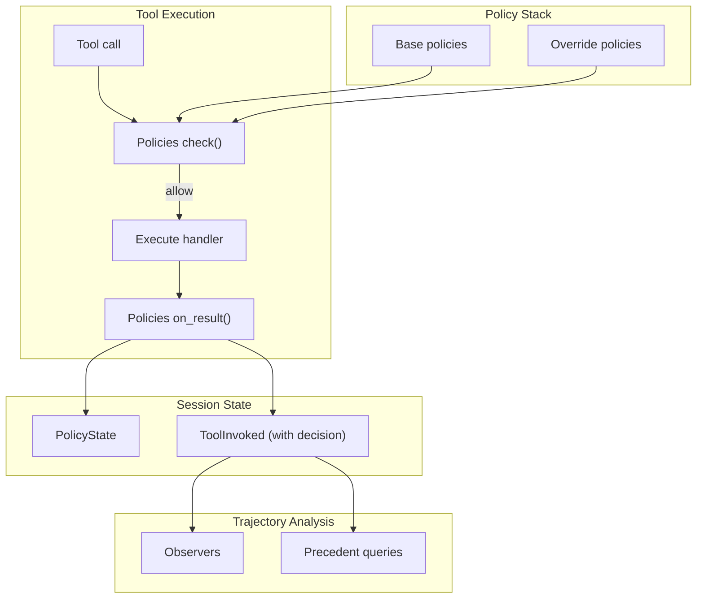

# Decision Lineage Specification

## Purpose

Decision lineage captures the reasoning behind agent actions — not just what
happened, but why it was allowed. This specification unifies decision recording
with the existing policy framework, extending rather than replacing it.

## Motivating Example: The Data Science Agent

A CEO asks an unattended agent: "What's our customer retention rate?"

This simple question forces dozens of implicit decisions:

| Decision Point | Options | Business Impact |
|----------------|---------|-----------------|
| Retention definition | Logo vs. revenue vs. cohort-based | 72% to 94% range |
| Time period | TTM, calendar year, fiscal year | Seasonal effects |
| Customer inclusion | All, exclude pilots, exclude acquisitions | Pilots churn 3x faster |
| Data source | Finance (authoritative, 2-day lag) vs. CRM (real-time) | ±2-3% variance |

Without lineage, the CEO receives "87%" with no way to know if it's comparable
to last quarter's "91%" or quotable to the board.

With lineage, each decision is recorded:

```
PolicyDecision: select_retention_metric
├── allowed: true
├── reason: "Revenue retention required for CEO audience"
├── lineage:
│   ├── inputs: {query.audience: "ceo", prior_reports: ["Q3 used revenue_retention"]}
│   ├── policy: MetricSelectionPolicy v2.1.0
│   ├── conditions: [(audience_check, true)]
│   └── precedent: Decision abc-123 (similarity=0.94)
└── outcome: revenue_retention selected
```

## Design Principles

### Extend, Don't Replace

Decision lineage enriches `PolicyDecision`, not replaces it. Simple policies
return `PolicyDecision.allow()`. Rich policies add lineage fields. The type
is the same; the detail varies by need.

### Exceptions Are Policies

Standing exceptions are policies with special characteristics:
- Run after base policies (lower priority by default)
- Can override denials from specific policies
- Activate conditionally

This keeps the policy framework unified rather than adding parallel machinery.

### Observers Consume Decisions

Trajectory observers already analyze session state. With richer decisions in
the session, observers automatically gain access to lineage without API changes.

## Unified Model



## Core Types

### PolicyDecision (Extended)

The existing `PolicyDecision` gains optional lineage fields:

```python
@dataclass(slots=True, frozen=True)
class PolicyDecision:
    """Result of a policy check, optionally with rich lineage."""

    # Core (always present) - unchanged from current API
    allowed: bool
    reason: str | None = None

    # Lineage (optional, for auditability)
    lineage: DecisionLineage | None = None

    @classmethod
    def allow(cls, reason: str | None = None) -> PolicyDecision:
        """Permit the tool call."""
        return cls(allowed=True, reason=reason)

    @classmethod
    def deny(cls, reason: str) -> PolicyDecision:
        """Block the tool call with an explanation."""
        return cls(allowed=False, reason=reason)

    @classmethod
    def allow_with_lineage(
        cls,
        *,
        reason: str,
        lineage: DecisionLineage,
    ) -> PolicyDecision:
        """Permit with full decision trace."""
        return cls(allowed=True, reason=reason, lineage=lineage)

    def with_override(
        self,
        *,
        overriding_policy: str,
        reason: str,
    ) -> PolicyDecision:
        """Create allowed decision that records the override."""
        override = OverrideApplication(
            overriding_policy=overriding_policy,
            original_decision=self,
            reason=reason,
        )
        lineage = (self.lineage or DecisionLineage()).with_override(override)
        return PolicyDecision(allowed=True, reason=reason, lineage=lineage)
```

### DecisionLineage

Rich context attached to a decision:

```python
@FrozenDataclass()
class DecisionLineage:
    """Structured context for a policy decision."""

    # What was considered
    inputs: Mapping[str, InputRecord] = field(default_factory=dict)

    # What policy evaluated
    policy_name: str | None = None
    policy_version: str | None = None
    conditions: tuple[ConditionResult, ...] = ()

    # If an override policy flipped the decision
    override: OverrideApplication | None = None

    # Links to similar past decisions
    precedents: tuple[PrecedentRef, ...] = ()

    def with_input(self, name: str, record: InputRecord) -> DecisionLineage:
        """Add an input record."""
        return replace(self, inputs={**self.inputs, name: record})

    def with_override(self, override: OverrideApplication) -> DecisionLineage:
        """Record that an override policy was applied."""
        return replace(self, override=override)

    def with_precedent(self, ref: PrecedentRef) -> DecisionLineage:
        """Add a precedent reference."""
        return replace(self, precedents=(*self.precedents, ref))
```

### Supporting Types

```python
@FrozenDataclass()
class InputRecord:
    """Record of an input consulted during decision."""

    source: str  # "session", "resource", "external"
    keys: tuple[str, ...] = ()  # What was accessed
    digest: str | None = None  # Hash for change detection


@FrozenDataclass()
class ConditionResult:
    """Result of evaluating a policy condition."""

    name: str
    expression: str  # Human-readable
    result: bool


@FrozenDataclass()
class OverrideApplication:
    """Record of an override policy flipping a denial."""

    overriding_policy: str
    original_decision: PolicyDecision
    reason: str


@FrozenDataclass()
class PrecedentRef:
    """Reference to a similar past decision."""

    tool_invoked_id: UUID  # Links to ToolInvoked in session
    similarity: float
    match_reason: str
```

## Override Policies

Override policies can flip denials from other policies. They're just policies
with additional metadata:

```python
class OverridePolicy(Protocol):
    """A policy that can override denials from other policies."""

    @property
    def name(self) -> str: ...

    @property
    def overrides(self) -> frozenset[str]:
        """Names of policies this can override."""
        ...

    @property
    def priority(self) -> int:
        """Lower priority = runs later. Override policies typically use -1."""
        return -1

    def should_override(
        self,
        tool: Tool[Any, Any],
        params: SupportsDataclass | None,
        denial: PolicyDecision,
        *,
        context: ToolContext,
    ) -> PolicyDecision | None:
        """Return overriding decision, or None to let denial stand."""
        ...
```

### Example: Data Science Agent Overrides

```python
@dataclass(frozen=True)
class ExcludePilotsOverride:
    """Override inclusion policies to exclude pilots from retention metrics.

    Problem: Pilot customers churn at 3x the rate of paying customers.
    Including them skews retention metrics for board reporting.

    This override activates when:
    1. A metric policy denies (e.g., "must specify inclusion criteria")
    2. The query involves retention/churn metrics

    Effect: Allows the query with pilot exclusion applied.
    """

    @property
    def name(self) -> str:
        return "exclude_pilots_from_retention"

    @property
    def overrides(self) -> frozenset[str]:
        return frozenset({"customer_inclusion"})

    @property
    def priority(self) -> int:
        return -1  # Run after base policies

    def should_override(
        self,
        tool: Tool[Any, Any],
        params: SupportsDataclass | None,
        denial: PolicyDecision,
        *,
        context: ToolContext,
    ) -> PolicyDecision | None:
        # Only override for retention-related queries
        query_context = context.session[QueryContext].latest()
        if query_context is None:
            return None
        if query_context.metric_type not in ("retention", "churn"):
            return None

        # Override with lineage
        lineage = DecisionLineage(
            inputs={
                "query_context": InputRecord(
                    source="session",
                    keys=("metric_type",),
                ),
            },
            policy_name=self.name,
            policy_version="2.0.0",
            conditions=(
                ConditionResult(
                    name="metric_type_check",
                    expression="metric_type in ['retention', 'churn']",
                    result=True,
                ),
            ),
        )

        return denial.with_override(
            overriding_policy=self.name,
            reason=(
                "Excluding pilot accounts (churn at 3x rate, excluded from "
                "board metrics since Q2 2024)"
            ),
        )


@dataclass(frozen=True)
class AcquiredCompanyOverride:
    """Use post-acquisition period for acquired company metrics.

    Problem: Companies acquired within the calculation period show
    artificially low YoY growth because pre-acquisition revenue
    wasn't in our systems.
    """

    @property
    def name(self) -> str:
        return "acquired_company_adjustment"

    @property
    def overrides(self) -> frozenset[str]:
        return frozenset({"time_period_selection"})

    @property
    def priority(self) -> int:
        return -1

    def should_override(
        self,
        tool: Tool[Any, Any],
        params: SupportsDataclass | None,
        denial: PolicyDecision,
        *,
        context: ToolContext,
    ) -> PolicyDecision | None:
        # Check if any referenced company was acquired recently
        entities = context.session[EntityContext].latest()
        if entities is None:
            return None

        acquired = [
            e for e in entities.companies
            if e.acquired_date and e.acquired_date > context.period_start
        ]
        if not acquired:
            return None

        return denial.with_override(
            overriding_policy=self.name,
            reason=(
                f"Using post-acquisition period for {acquired[0].name} "
                f"(acquired {acquired[0].acquired_date})"
            ),
        )
```

## Policy Execution Flow

The executor runs policies in priority order, with override handling:

```python
def check_policies(
    tool: Tool[Any, Any],
    params: SupportsDataclass | None,
    *,
    context: ToolContext,
    policies: Sequence[ToolPolicy],
) -> PolicyDecision:
    """Evaluate policies with override support."""

    # Sort by priority (higher first, overrides last)
    sorted_policies = sorted(policies, key=lambda p: getattr(p, "priority", 0), reverse=True)

    # Separate base policies from overrides
    base_policies = [p for p in sorted_policies if not hasattr(p, "overrides")]
    override_policies = [p for p in sorted_policies if hasattr(p, "overrides")]

    # Check base policies
    for policy in base_policies:
        decision = policy.check(tool, params, context=context)
        if not decision.allowed:
            # Try override policies
            for override in override_policies:
                if policy.name not in override.overrides:
                    continue
                override_decision = override.should_override(
                    tool, params, decision, context=context
                )
                if override_decision is not None:
                    return override_decision

            # No override applied
            return decision

    return PolicyDecision.allow()
```

## Session Integration

Decisions are recorded in `ToolInvoked` events:

```python
@FrozenDataclass()
class ToolInvoked:
    """Event recording a tool invocation."""

    tool_name: str
    params: Mapping[str, Any]
    result: ToolResult[Any]
    timestamp: datetime

    # Policy decision that allowed this call
    decision: PolicyDecision | None = None
```

This means:
- All tool invocations record their gating decision
- Observers can access decision lineage via `ToolInvoked.decision.lineage`
- Precedent queries can search by policy, outcome, or inputs

## Precedent Queries

Precedent lookup is a query over session history:

```python
def find_precedents(
    session: Session,
    *,
    tool_name: str,
    entity_refs: Sequence[tuple[str, str]] | None = None,
    policy_name: str | None = None,
    limit: int = 5,
) -> Sequence[tuple[ToolInvoked, float]]:
    """Find similar past decisions in session history.

    Returns (ToolInvoked, similarity_score) pairs.
    """
    candidates = []

    for invoked in session[ToolInvoked].all():
        if invoked.tool_name != tool_name:
            continue
        if invoked.decision is None:
            continue

        score = _compute_similarity(
            invoked,
            entity_refs=entity_refs,
            policy_name=policy_name,
        )
        if score > 0.5:
            candidates.append((invoked, score))

    candidates.sort(key=lambda x: x[1], reverse=True)
    return candidates[:limit]
```

For cross-session precedent, use an external `PrecedentStore`:

```python
class PrecedentStore(Protocol):
    """External storage for cross-session precedent queries."""

    def record(self, invoked: ToolInvoked, session_id: UUID) -> None:
        """Persist a tool invocation for future lookup."""
        ...

    def find_similar(
        self,
        *,
        tool_name: str,
        inputs: Mapping[str, InputRecord],
        limit: int = 5,
    ) -> Sequence[tuple[ToolInvoked, float]]:
        """Find similar decisions across sessions."""
        ...
```

## Trajectory Observer Integration

Observers automatically benefit from richer decisions:

```python
class PrecedentConsistencyObserver:
    """Flag when decisions deviate from precedent."""

    @property
    def name(self) -> str:
        return "precedent_consistency"

    def observe(
        self,
        session: Session,
        *,
        context: ObserverContext,
    ) -> Assessment | None:
        recent = session[ToolInvoked].all()[-10:]

        deviations = []
        for invoked in recent:
            if invoked.decision is None or invoked.decision.lineage is None:
                continue

            lineage = invoked.decision.lineage
            for ref in lineage.precedents:
                prior = session[ToolInvoked].where(
                    lambda t: t.id == ref.tool_invoked_id
                )
                if prior and prior[0].decision:
                    if prior[0].decision.allowed != invoked.decision.allowed:
                        deviations.append((invoked, prior[0], ref))

        if not deviations:
            return None

        return Assessment(
            observer_name=self.name,
            summary=f"{len(deviations)} decisions differ from precedent",
            severity="caution",
            suggestions=(
                "Verify methodology is consistent with prior reports",
                "Document rationale if intentional change",
            ),
        )
```

## Prompt Configuration

```python
template = PromptTemplate[QueryResponse](
    ns="data-science-agent",
    key="executive-query",
    sections=[...],
    policies=[
        # Base policies
        MetricSelectionPolicy(version="2.1.0"),
        TimePeriodPolicy(version="1.0.0"),
        CustomerInclusionPolicy(version="3.0.0"),
        DataSourcePolicy(version="1.5.0"),
        # Override policies (run after base, can flip denials)
        ExcludePilotsOverride(),
        AcquiredCompanyOverride(),
        MonthEndCloseOverride(),
    ],
    observers=[
        ObserverConfig(
            observer=PrecedentConsistencyObserver(),
            trigger=ObserverTrigger(every_n_calls=5),
        ),
    ],
)
```

## Worked Example

CEO asks: "How did Enterprise segment retention change vs last quarter?"

### Step 1: Metric Selection

```python
# MetricSelectionPolicy checks
decision = MetricSelectionPolicy.check(
    tool=select_metric,
    params=MetricParams(name="retention"),
    context=context,
)
# Returns:
PolicyDecision(
    allowed=True,
    reason="Revenue retention required for CEO audience",
    lineage=DecisionLineage(
        inputs={
            "query": InputRecord(source="params", keys=("audience",)),
            "prior_reports": InputRecord(source="external", keys=("Q3_board_deck",)),
        },
        policy_name="metric_selection",
        policy_version="2.1.0",
        conditions=(
            ConditionResult("audience_check", "audience == 'ceo'", True),
        ),
        precedents=(
            PrecedentRef(tool_invoked_id=UUID("..."), similarity=0.91, match_reason="Same segment"),
        ),
    ),
)
```

### Step 2: Customer Filter (with Override)

```python
# CustomerInclusionPolicy denies (requires explicit filter)
denial = PolicyDecision.deny("Must specify customer filter criteria")

# ExcludePilotsOverride checks and overrides
override_decision = ExcludePilotsOverride.should_override(
    tool=filter_customers,
    params=FilterParams(segment="enterprise"),
    denial=denial,
    context=context,
)
# Returns:
PolicyDecision(
    allowed=True,
    reason="Excluding pilot accounts (churn at 3x rate)",
    lineage=DecisionLineage(
        policy_name="exclude_pilots_from_retention",
        policy_version="2.0.0",
        override=OverrideApplication(
            overriding_policy="exclude_pilots_from_retention",
            original_decision=denial,
            reason="Pilots excluded from board metrics since Q2 2024",
        ),
    ),
)
```

### Final Output

```
Enterprise segment retention: 87.2% (Q4) vs 89.1% (Q3), down 1.9pp

Methodology:
- Metric: Revenue retention (per MetricSelectionPolicy v2.1.0)
- Period: Fiscal quarters (per TimePeriodPolicy v1.0.0)
- Cohort: 847 Enterprise customers, 12 pilots excluded
  (per ExcludePilotsOverride, consistent with Q3)
- Source: Finance system, synced Jan 6 2025

[4 decisions recorded in session]
```

## Migration

Existing code continues to work unchanged:

```python
# Before: simple policy (still works)
return PolicyDecision.allow()
return PolicyDecision.deny("reason")

# After: rich policy (opt-in)
return PolicyDecision.allow_with_lineage(
    reason="...",
    lineage=DecisionLineage(...),
)
```

The `lineage` field is optional. Policies that don't need rich tracing
continue to return simple `PolicyDecision.allow()` or `deny()`.

## Summary

| Concept | Before | After |
|---------|--------|-------|
| Policy outcome | `PolicyDecision` (allowed + reason) | Same, with optional `lineage` field |
| Exceptions | None | Override policies (same protocol, special behavior) |
| Decision history | `PolicyState` + `ToolInvoked` | `ToolInvoked.decision` includes lineage |
| Precedent | None | Query over `ToolInvoked` or external store |
| Observers | Analyze `ToolInvoked` | Same, now have access to `decision.lineage` |

This unified model:
1. **Extends** `PolicyDecision` rather than adding new types
2. **Makes overrides policies** rather than separate exception machinery
3. **Records decisions in existing events** rather than new slices
4. **Enables observers** to consume richer data automatically
