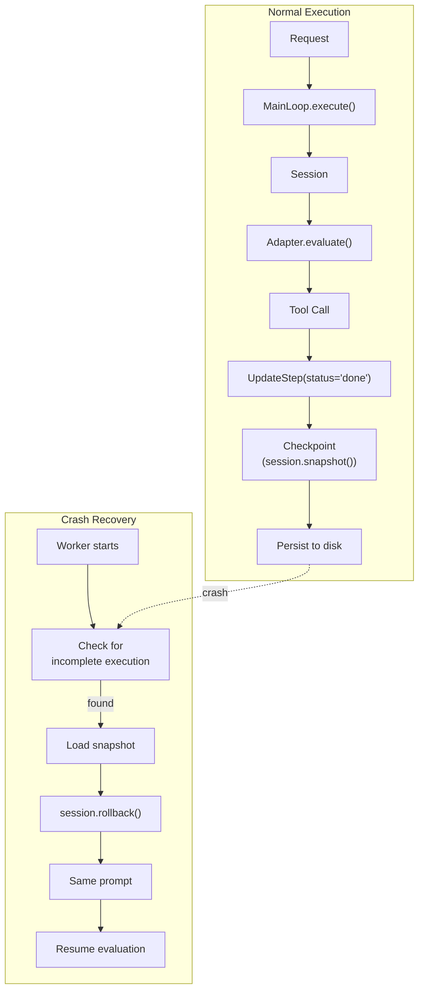

# Durable Execution Specification

## Purpose

Durable execution enables agents to survive crashes and resume from meaningful
checkpoints. This specification covers checkpoint triggers, session persistence,
and MainLoop integration for automatic recovery based on stable worker identity.

## Guiding Principles

- **Agent-driven milestones**: Checkpoints occur implicitly when the agent
  signals meaningful progress through planning tools, not on arbitrary events.
- **Session is truth**: The checkpoint is a `Session.snapshot()`; recovery
  restores this snapshot and re-evaluates the same prompt.
- **Prompt surfaces context**: The `PromptTemplate` is responsible for querying
  session state and rendering appropriate context on resume.
- **Planning enables recovery**: Planning tools become critical infrastructure
  for recoverability; instruct models to use them for non-trivial work.
- **Deadline bounds attempts**: Retry attempts are limited only by the overall
  deadline, not a separate retry counter.



## Core Concepts

### Checkpoint Trigger

A checkpoint occurs when specific event types are dispatched to the session.
The default trigger is `UpdateStep` with `status="done"`, making plan step
completion the natural checkpoint boundary.

```python
@dataclass(frozen=True, slots=True)
class CheckpointTrigger:
    """Predicate that determines when to checkpoint."""

    event_types: frozenset[type] = frozenset({UpdateStep})

    def should_checkpoint(self, event: object) -> bool:
        """Return True if this event should trigger a checkpoint."""
        if not isinstance(event, tuple(self.event_types)):
            return False
        # For UpdateStep, only checkpoint when marking done
        if isinstance(event, UpdateStep):
            return event.status == "done"
        return True
```

Developers can customize triggers for domain-specific events:

```python
# Checkpoint on any plan mutation
trigger = CheckpointTrigger(event_types=frozenset({SetupPlan, AddStep, UpdateStep}))

# Checkpoint only on custom milestone event
trigger = CheckpointTrigger(event_types=frozenset({MilestoneReached}))
```

### Checkpoint Content

A checkpoint is a `Session.snapshot()` serialized to JSON. The snapshot captures
all session slices (Plan, domain dataclasses, etc.) in their current state.

```python
# Capture checkpoint
snapshot = session.snapshot()
checkpoint_json = snapshot.to_json()

# Restore checkpoint
loaded = Snapshot.from_json(checkpoint_json)
session.mutate().rollback(loaded)
```

The checkpoint includes:
- All registered slice values (Plan, custom domain types)
- Session metadata (id, created_at, tags)
- Parent/child relationships (if hierarchical sessions)

The checkpoint does **not** include:
- Event history (not needed; state is fully captured)
- Reducer registrations (re-registered by MainLoop)
- Observer subscriptions (re-registered by MainLoop)

### Incomplete Execution Detection

An execution is incomplete if there is a persisted checkpoint but no
`PromptExecuted` event indicating successful completion of the main prompt.

```python
def is_execution_incomplete(checkpoint_dir: Path) -> bool:
    """Check if worker has incomplete execution to resume."""
    checkpoint_path = checkpoint_dir / "checkpoint.json"
    completed_path = checkpoint_dir / "completed"

    if not checkpoint_path.exists():
        return False  # No checkpoint, nothing to resume

    if completed_path.exists():
        return False  # Completed marker present

    return True  # Checkpoint exists but not completed
```

## MainLoop Integration

### DurableMainLoop

Extends `MainLoop` with automatic checkpoint and resume capabilities:

```python
class DurableMainLoop(MainLoop[UserRequestT, OutputT]):
    def __init__(
        self,
        *,
        adapter: ProviderAdapter[OutputT],
        bus: EventBus,
        checkpoint_dir: Path,
        checkpoint_trigger: CheckpointTrigger | None = None,
        config: MainLoopConfig | None = None,
    ) -> None:
        super().__init__(adapter=adapter, bus=bus, config=config)
        self._checkpoint_dir = checkpoint_dir
        self._checkpoint_trigger = checkpoint_trigger or CheckpointTrigger()

    def execute(self, request: UserRequestT) -> PromptResponse[OutputT]:
        # Check for incomplete execution from previous run
        if self._has_incomplete_execution():
            return self._resume_execution(request)

        # Fresh execution
        return self._fresh_execution(request)
```

### Fresh Execution Flow

```python
def _fresh_execution(self, request: UserRequestT) -> PromptResponse[OutputT]:
    session = self.create_session()
    prompt = self.create_prompt(request)

    # Subscribe to checkpoint triggers
    self._setup_checkpoint_observer(session)

    # Clear any stale state
    self._clear_checkpoint()

    # Persist request for resume context
    self._persist_request(request)

    try:
        response = self._evaluate_with_checkpointing(prompt, session)
        self._mark_completed()
        return response
    except Exception:
        # Checkpoint persisted; can resume on restart
        raise
```

### Resume Execution Flow

```python
def _resume_execution(self, request: UserRequestT) -> PromptResponse[OutputT]:
    # Load checkpoint
    snapshot = self._load_checkpoint()

    # Create session and restore state
    session = self.create_session()
    session.mutate().rollback(snapshot)

    # Same prompt - template queries session for context
    prompt = self.create_prompt(request)

    # Continue with checkpointing
    self._setup_checkpoint_observer(session)

    try:
        response = self._evaluate_with_checkpointing(prompt, session)
        self._mark_completed()
        return response
    except Exception:
        raise
```

### Checkpoint Observer

```python
def _setup_checkpoint_observer(self, session: Session) -> None:
    """Subscribe to checkpoint trigger events."""

    def on_tool_invoked(event: ToolInvoked) -> None:
        if event.value is None:
            return
        if self._checkpoint_trigger.should_checkpoint(event.value):
            self._persist_checkpoint(session)

    self._bus.subscribe(ToolInvoked, on_tool_invoked)
```

## Prompt Design for Recovery

The `PromptTemplate` must query session state to surface relevant context.
On resume, the session contains completed work; the prompt should render this.

### Example: Recovery-Aware Prompt

```python
class TaskPromptTemplate(PromptTemplate[TaskOutput]):
    def __init__(self, session: Session) -> None:
        self._session = session
        super().__init__(
            ns="tasks",
            key="execute",
            sections=[
                MarkdownSection(
                    title="Objective",
                    key="objective",
                    template="$objective",
                ),
                # Dynamic section that renders completed work from session
                MarkdownSection(
                    title="Progress",
                    key="progress",
                    template=self._render_progress,
                    visibility=SectionVisibility.FULL,
                ),
                PlanningToolsSection(
                    session=session,
                    strategy=PlanningStrategy.PLAN_ACT_REFLECT,
                ),
            ],
        )

    def _render_progress(self, params: TaskParams) -> str:
        plan = self._session.query(Plan).latest()
        if plan is None:
            return "No progress yet. Create a plan to get started."

        lines = [f"**Objective**: {plan.objective}", ""]
        completed = [s for s in plan.steps if s.status == "done"]
        pending = [s for s in plan.steps if s.status != "done"]

        if completed:
            lines.append("**Completed:**")
            for step in completed:
                lines.append(f"- ✓ {step.title}")
            lines.append("")

        if pending:
            lines.append("**Remaining:**")
            for step in pending:
                lines.append(f"- {step.title} ({step.status})")

        return "\n".join(lines)
```

### Key Pattern: Session-Driven Rendering

The prompt does not receive special "resume" parameters. It queries session
state and renders appropriately. This unifies fresh and resume paths:

- **Fresh start**: Session is empty, progress section shows "No progress yet"
- **Resume**: Session has Plan with completed steps, progress section lists them

The agent sees what was accomplished and continues naturally.

## Planning Tools: Critical for Recovery

When durable execution is enabled, planning tools become critical
infrastructure. Without a plan, there are no meaningful checkpoints.

### Instructional Guidance

Prompts should instruct models to use planning for anything non-trivial:

```markdown
## Planning Requirement

For tasks with multiple steps or any complexity:
1. Always start with `planning_setup_plan` to define the objective
2. Break work into discrete steps
3. Mark steps as `done` when complete
4. Progress is saved automatically when steps complete

Skipping planning means progress cannot be saved if interrupted.
```

### Checkpoint Granularity

Each step marked `done` triggers a checkpoint. Design steps to be:

- **Meaningful**: Each step represents real progress worth preserving
- **Resumable**: The next step can proceed without the previous step's artifacts
  being in memory (they should be in session state or referenced by path)
- **Atomic**: A step is either fully done or not done; no partial completion

## Storage Model (MVP)

For the MVP, each worker has a dedicated directory on disk:

```
/var/wink/workers/
├── worker-001/
│   ├── request.json      # Original request (for resume)
│   ├── checkpoint.json   # Latest session snapshot
│   └── completed         # Marker file when done
├── worker-002/
│   ├── request.json
│   └── checkpoint.json   # No completed marker = incomplete
```

### Persistence Operations

```python
class CheckpointStore:
    """Simple file-based checkpoint storage."""

    def __init__(self, checkpoint_dir: Path) -> None:
        self._dir = checkpoint_dir
        self._dir.mkdir(parents=True, exist_ok=True)

    def persist_request(self, request: object) -> None:
        path = self._dir / "request.json"
        path.write_text(dump(request))

    def load_request[T](self, request_type: type[T]) -> T:
        path = self._dir / "request.json"
        return parse(request_type, path.read_text())

    def persist_checkpoint(self, session: Session) -> None:
        snapshot = session.snapshot()
        path = self._dir / "checkpoint.json"
        # Atomic write via rename
        tmp = path.with_suffix(".tmp")
        tmp.write_text(snapshot.to_json())
        tmp.rename(path)

    def load_checkpoint(self) -> Snapshot:
        path = self._dir / "checkpoint.json"
        return Snapshot.from_json(path.read_text())

    def has_incomplete(self) -> bool:
        checkpoint = self._dir / "checkpoint.json"
        completed = self._dir / "completed"
        return checkpoint.exists() and not completed.exists()

    def mark_completed(self) -> None:
        (self._dir / "completed").touch()

    def clear(self) -> None:
        for path in self._dir.iterdir():
            path.unlink()
```

## Workspace Considerations

The filesystem workspace resets on recovery. Any state that must survive:

1. **Must be in session state**: Store results, summaries, decisions as
   dataclasses in session slices
2. **Or referenced externally**: Store in database, object storage, etc.

The agent should not assume files created in previous runs still exist.

### Example: Preserving Computation Results

```python
@FrozenDataclass()
class AnalysisResult:
    """Stored in session to survive restart."""
    file_path: str
    summary: str
    metrics: dict[str, float]

# In tool handler
def analyze_file(params: AnalyzeParams, *, context: ToolContext) -> ToolResult[AnalysisResult]:
    # Do analysis...
    result = AnalysisResult(
        file_path=params.path,
        summary="Found 3 issues...",
        metrics={"complexity": 4.2, "coverage": 0.85},
    )
    # Result stored in session via ToolInvoked event routing
    return ToolResult(message="Analysis complete", value=result)
```

On resume, the prompt template can query `session.query(AnalysisResult).all()`
to show previously computed results.

## Deadline as Retry Bound

There is no separate retry counter. The overall deadline controls how many
resume attempts can occur:

```python
# In DurableMainLoop
def execute(self, request: UserRequestT) -> PromptResponse[OutputT]:
    deadline = self._effective_deadline()

    while True:
        if deadline and deadline.remaining() <= timedelta(0):
            raise DeadlineExceededError(...)

        try:
            if self._has_incomplete_execution():
                return self._resume_execution(request)
            return self._fresh_execution(request)
        except Exception as e:
            if not self._has_incomplete_execution():
                raise  # No checkpoint, can't retry
            # Loop will attempt resume on next iteration
            # (In practice, worker process restarts externally)
            raise
```

In practice, the worker process crashes and restarts externally. The deadline
is checked on each restart; if exceeded, the execution fails without retry.

## Error Handling

### Checkpoint Failures

If checkpoint persistence fails, the execution continues but won't be
resumable from that point. Log the failure but don't abort:

```python
def _persist_checkpoint(self, session: Session) -> None:
    try:
        self._store.persist_checkpoint(session)
    except Exception:
        logger.warning("Checkpoint persistence failed", exc_info=True)
        # Continue execution; next checkpoint may succeed
```

### Corrupted Checkpoints

If a checkpoint cannot be loaded, start fresh:

```python
def _resume_execution(self, request: UserRequestT) -> PromptResponse[OutputT]:
    try:
        snapshot = self._store.load_checkpoint()
    except (SnapshotRestoreError, FileNotFoundError, json.JSONDecodeError):
        logger.warning("Checkpoint corrupted, starting fresh", exc_info=True)
        self._store.clear()
        return self._fresh_execution(request)
    # ... continue with valid snapshot
```

### Schema Evolution

If session slice types change between deployments, `Snapshot.from_json()` may
fail with `SnapshotRestoreError`. Handle by starting fresh or migrating:

```python
try:
    snapshot = Snapshot.from_json(checkpoint_json)
except SnapshotRestoreError as e:
    if "unknown type" in str(e):
        logger.warning("Schema changed, starting fresh")
        return self._fresh_execution(request)
    raise
```

## Limitations

- **Single worker per directory**: Each checkpoint directory serves one worker
- **No concurrent executions**: One execution per worker at a time
- **Filesystem only (MVP)**: No distributed storage in initial implementation
- **No partial step recovery**: Crashes mid-step restart the step
- **Workspace not preserved**: Only session state survives restart
- **Synchronous checkpointing**: Checkpoint write blocks execution

## Future Considerations

- **Distributed storage**: Redis, PostgreSQL, or object storage backends
- **Checkpoint compression**: Reduce storage for large session states
- **Incremental checkpoints**: Only persist changed slices
- **Async checkpointing**: Background persistence without blocking
- **Multi-worker coordination**: Lease-based task claiming for work queues
