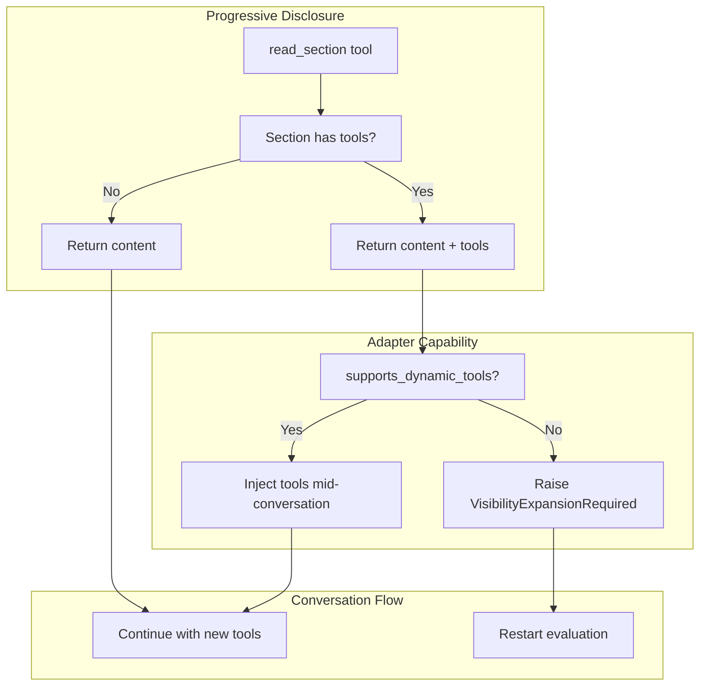

# Dynamic Tool Registration Specification

## Purpose

This specification defines the protocol for dynamically adding tools to an
ongoing conversation without restarting prompt evaluation. It introduces a
capability-based approach where adapters declare their support for dynamic
tools, and progressive disclosure behavior adapts accordingly.

## Guiding Principles

- **Capability-Driven Behavior**: Adapters declare what they support; the
  framework adapts rather than forcing a single approach.
- **Unified Tool Interface**: A single `read_section` tool replaces the
  split between `open_sections` and `read_section`.
- **Graceful Degradation**: Adapters without dynamic tool support fall back
  to restart-based expansion.
- **Preserve Conversation Context**: When supported, tool expansion preserves
  message history and avoids redundant model invocations.



## Adapter Capability Protocol

### Capability Declaration

Adapters declare dynamic tool support via a property on `ProviderAdapter`:

```python
class ProviderAdapter(ABC, Generic[OutputT]):
    @property
    def supports_dynamic_tools(self) -> bool:
        """Return True if adapter can add tools mid-conversation.

        Adapters that return True must implement tool injection when
        read_section returns expanded tools. Adapters that return False
        will trigger a restart via VisibilityExpansionRequired.
        """
        return False

    @abstractmethod
    def evaluate(
        self,
        prompt: Prompt[OutputT],
        *,
        session: SessionProtocol,
        ...
    ) -> PromptResponse[OutputT]: ...
```

### Adapter Support Matrix

| Adapter | `supports_dynamic_tools` | Rationale |
|---------|--------------------------|-----------|
| `OpenAIAdapter` | `True` | Stateless API; tools can change per request |
| `LiteLLMAdapter` | `True` | Stateless API; tools can change per request |
| `ClaudeAgentSDKAdapter` | `False` | MCP server configured once before `sdk.query()` |

Future adapters must evaluate their provider's capability to accept different
tool sets across conversation turns.

## Unified read_section Tool

### Removal of open_sections

The `open_sections` tool is removed. All progressive disclosure uses
`read_section`, which returns content and optionally signals tool expansion.

**Rationale:**

- Eliminates user-facing complexity of two disclosure tools
- Single mental model: "read a section to see its content"
- Tool availability is an implementation detail handled by the framework

### ReadSectionResult with Tools

The `read_section` handler returns expanded tools when a section contains them:

```python
@dataclass(slots=True, frozen=True)
class ReadSectionResult:
    """Result of reading a summarized section."""

    content: str
    """Rendered markdown content of the section."""

    expanded_tools: tuple[Tool[Any, Any], ...] = ()
    """Tools from the expanded section, if any.

    Non-empty when the section (or its descendants) had tools attached.
    The adapter uses this to inject tools into the conversation.
    """
```

### Handler Behavior

The `read_section` handler:

1. Validates the section key exists and is currently summarized
2. Renders the section with `FULL` visibility
3. Collects tools from the section and its descendants
4. Returns `ReadSectionResult` with content and collected tools

```python
def create_read_section_handler(
    *,
    registry: SectionRegistry,
    current_visibility: VisibilityOverrides,
    param_lookup: Mapping[type, object],
    session: SessionProtocol,
) -> Tool[ReadSectionParams, ReadSectionResult]:
    """Create read_section tool with tool collection."""

    def handler(
        params: ReadSectionParams,
        *,
        context: ToolContext,
    ) -> ToolResult[ReadSectionResult]:
        # Validate and locate section
        section_path = _parse_section_key(params.section_key)
        section = registry.get(section_path)
        if section is None:
            return ToolResult(
                message=f"Unknown section: {params.section_key}",
                value=None,
                success=False,
            )

        # Render section content
        rendered_content = _render_section_full(
            section,
            param_lookup=param_lookup,
            session=session,
        )

        # Collect tools from section tree
        expanded_tools = _collect_section_tools(section)

        return ToolResult(
            message=f"Content of section '{params.section_key}':",
            value=ReadSectionResult(
                content=rendered_content,
                expanded_tools=expanded_tools,
            ),
            success=True,
        )

    return Tool(
        name="read_section",
        description="Read the full content of a summarized section.",
        params_type=ReadSectionParams,
        handler=handler,
    )
```

### Summary Suffix

All summarized sections use the same suffix, regardless of whether they have
tools:

```
---
[This section is summarized. To view full content, call `read_section` with key "context".]
```

The presence of tools is not exposed to the model in the suffix.

## InnerLoop Tool Injection

### Protocol for Dynamic Tools

The `InnerLoop` class handles tool injection when `read_section` returns
expanded tools. This requires extending the tool execution result handling.

### ToolExecutionOutcome

Extend the outcome to include expanded tools:

```python
@dataclass(slots=True, frozen=True)
class ToolExecutionOutcome:
    """Outcome of executing a single tool call."""

    tool_call_id: str
    message: dict[str, Any]  # Tool result message for conversation
    success: bool
    expanded_tools: tuple[Tool[Any, Any], ...] = ()
    """Tools to add to the conversation, if any."""
```

### InnerLoop Tool Registry Update

When tool execution yields expanded tools, the inner loop updates its state:

```python
class InnerLoop:
    def _handle_tool_calls(
        self,
        message: ProviderMessage,
        tool_calls: Sequence[ProviderToolCall],
    ) -> None:
        """Execute tool calls and optionally expand tool registry."""
        # ... existing message handling ...

        outcomes = self._tool_executor.execute_all(tool_calls, ...)

        # Check for expanded tools
        for outcome in outcomes:
            if outcome.expanded_tools:
                self._inject_tools(outcome.expanded_tools)

        # ... rest of handling ...

    def _inject_tools(
        self,
        new_tools: tuple[Tool[Any, Any], ...],
    ) -> None:
        """Add new tools to the conversation.

        Updates both the tool specs (for provider calls) and the tool
        registry (for execution). Duplicate tool names are skipped.
        """
        for tool in new_tools:
            if tool.name in self._tool_registry:
                continue  # Already registered

            # Add to registry for execution
            self._tool_registry[tool.name] = tool

            # Add to specs for provider calls
            self._tool_specs.append(tool_to_spec(tool))

        # Log tool injection event
        self._log_tools_injected(new_tools)
```

### InnerLoopConfig Extension

The config includes a flag derived from adapter capability:

```python
@dataclass(slots=True, frozen=True)
class InnerLoopConfig:
    # ... existing fields ...

    supports_dynamic_tools: bool = False
    """Whether the adapter supports mid-conversation tool injection.

    When True, read_section results with expanded_tools trigger injection.
    When False, expanded_tools trigger VisibilityExpansionRequired.
    """
```

### ToolExecutor Behavior

The `ToolExecutor` checks the capability flag when processing results:

```python
class ToolExecutor:
    def _process_read_section_result(
        self,
        result: ToolResult[ReadSectionResult],
        *,
        supports_dynamic_tools: bool,
    ) -> ToolExecutionOutcome:
        """Process read_section result, handling tool expansion."""
        if not result.value.expanded_tools:
            # No tools to expand
            return ToolExecutionOutcome(
                tool_call_id=...,
                message=...,
                success=True,
            )

        if supports_dynamic_tools:
            # Return tools for injection
            return ToolExecutionOutcome(
                tool_call_id=...,
                message=...,
                success=True,
                expanded_tools=result.value.expanded_tools,
            )
        else:
            # Trigger restart
            raise VisibilityExpansionRequired(
                f"Section expansion requires restart",
                requested_overrides=_compute_overrides(...),
                reason="Adapter does not support dynamic tools",
                section_keys=(...,),
            )
```

## Claude Agent SDK Fallback

### Restart Behavior

The `ClaudeAgentSDKAdapter` returns `supports_dynamic_tools = False`, causing
`read_section` with tools to raise `VisibilityExpansionRequired`. The
`MainLoop` catches this and restarts evaluation.

### Future Enhancement Path

If the Claude Agent SDK adds support for dynamic MCP tool registration, the
adapter can be updated:

```python
class ClaudeAgentSDKAdapter(ProviderAdapter[OutputT]):
    @property
    def supports_dynamic_tools(self) -> bool:
        # Future: check SDK version for dynamic tool support
        return False
```

### Visibility Override Persistence

When restart occurs, visibility overrides are persisted in session state:

```python
# In MainLoop.execute()
except VisibilityExpansionRequired as e:
    for path, visibility in e.requested_overrides.items():
        session.dispatch(
            SetVisibilityOverride(path=path, visibility=visibility)
        )
    # Loop continues with updated visibility
```

The re-rendered prompt includes the previously summarized section's tools.

## Session State Changes

### VisibilityOverrides Slice

When tools are dynamically injected, visibility overrides are updated to
reflect the expansion:

```python
def _inject_tools(self, new_tools: tuple[Tool[Any, Any], ...]) -> None:
    # ... tool injection ...

    # Update visibility state so prompt reflects expansion
    for tool in new_tools:
        section_path = self._tool_to_section.get(tool.name)
        if section_path:
            self._session.dispatch(
                SetVisibilityOverride(
                    path=section_path,
                    visibility=SectionVisibility.FULL,
                )
            )
```

This ensures consistency if the conversation is serialized and resumed.

## Error Handling

### Unknown Section Key

```python
return ToolResult(
    message=f"Unknown section key: '{params.section_key}'",
    value=None,
    success=False,
)
```

### Already Expanded Section

Sections already at `FULL` visibility return their content without tools:

```python
if current_visibility.get(section_path) == SectionVisibility.FULL:
    return ToolResult(
        message="Section is already expanded.",
        value=ReadSectionResult(content=rendered, expanded_tools=()),
        success=True,
    )
```

### Tool Name Collision

If an expanded tool has the same name as an existing tool, it is skipped with
a warning:

```python
if tool.name in self._tool_registry:
    logger.warning(
        "Skipping duplicate tool during injection",
        tool_name=tool.name,
    )
    continue
```

## Migration

### Removing open_sections

1. Delete `OpenSectionsParams` dataclass
2. Delete `create_open_sections_handler()` function
3. Remove `open_sections` injection logic from renderer
4. Update `build_summary_suffix()` to always reference `read_section`
5. Remove `has_summarized_with_tools` tracking in renderer

### Updating read_section

1. Add `expanded_tools` field to `ReadSectionResult`
2. Add tool collection logic to handler
3. Update renderer to inject `read_section` for all summarized sections

### Updating Adapters

1. Add `supports_dynamic_tools` property to `ProviderAdapter`
2. Override to `True` in `OpenAIAdapter` and `LiteLLMAdapter`
3. Add `supports_dynamic_tools` field to `InnerLoopConfig`
4. Add tool injection logic to `InnerLoop._handle_tool_calls()`
5. Update `ToolExecutor` to handle `expanded_tools`

### Updating Tests

1. Remove `open_sections` test cases
2. Add `read_section` with tools test cases
3. Add dynamic tool injection test cases
4. Add capability-based fallback test cases

## Usage Example

### Basic Progressive Disclosure

```python
template = PromptTemplate[Answer](
    ns="example",
    key="research",
    sections=[
        MarkdownSection(
            title="Context",
            key="context",
            template="Detailed research context...",
            summary="Research context available.",
            visibility=SectionVisibility.SUMMARY,
            tools=(search_tool, cite_tool),  # Tools in summarized section
        ),
    ],
)

# With OpenAI adapter (supports dynamic tools)
adapter = OpenAIAdapter(model="gpt-4o")
response = adapter.evaluate(prompt, session=session)
# Model calls read_section("context")
# Tools injected mid-conversation
# No restart needed

# With Claude Agent SDK (no dynamic tool support)
adapter = ClaudeAgentSDKAdapter(...)
# Model calls read_section("context")
# VisibilityExpansionRequired raised
# MainLoop restarts with expanded visibility
```

### Checking Adapter Capability

```python
adapter = get_adapter(config)

if adapter.supports_dynamic_tools:
    # Expect seamless tool expansion
    logger.info("Using dynamic tool injection")
else:
    # Expect potential restarts
    logger.info("Using restart-based tool expansion")

response = main_loop.execute(prompt, session=session, adapter=adapter)
```

## Observability

### Events

Tool injection emits a structured event:

```python
@dataclass(slots=True, frozen=True)
class ToolsInjected:
    """Emitted when tools are dynamically added to a conversation."""

    tool_names: tuple[str, ...]
    section_key: str
    timestamp: float = field(default_factory=time.time)
```

### Logging

```python
logger.info(
    "Injected tools from section expansion",
    section_key=section_key,
    tool_count=len(new_tools),
    tool_names=[t.name for t in new_tools],
)
```

### Metrics

- `wink.tools.injected` - Counter of dynamically injected tools
- `wink.disclosure.restarts` - Counter of restart-based expansions
- `wink.disclosure.dynamic` - Counter of dynamic expansions

## Compatibility Notes

### Backward Compatibility

This is a breaking change. The `open_sections` tool is removed entirely.
Prompts using progressive disclosure will automatically use the new unified
`read_section` behavior.

### Provider API Requirements

Dynamic tool injection requires providers that accept tool definitions on each
request independently. Most modern LLM APIs (OpenAI, Anthropic, etc.) support
this pattern. Providers with stateful tool registration may need adapter-level
workarounds or must use restart-based expansion.

## Summary

| Aspect | Before | After |
|--------|--------|-------|
| Disclosure tools | `open_sections` + `read_section` | `read_section` only |
| Sections with tools | Always restart | Dynamic if supported |
| Sections without tools | Return content | Return content |
| Adapter interface | No capability declaration | `supports_dynamic_tools` property |
| User mental model | Two tools, different behaviors | One tool, consistent behavior |
