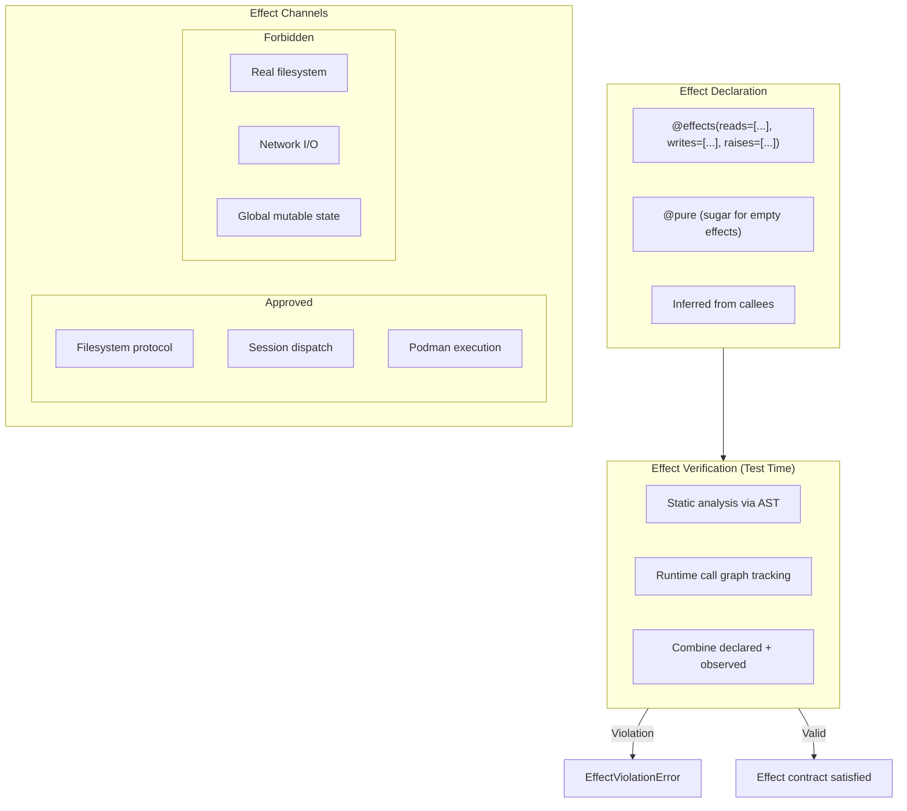
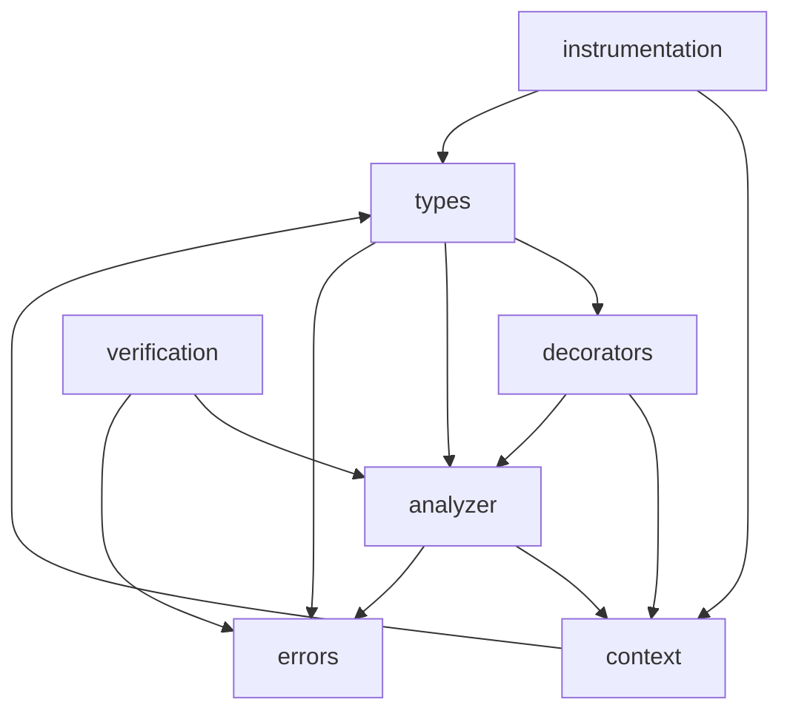

# Effect Tracking Specification

## Purpose

This specification defines an effect tracking system for `weakincentives` that
annotates functions with their side effects and verifies that callers properly
account for those effects. The system enforces that tool handlers only perform
effects through approved channels (VFS, sandboxed execution, session dispatch)
rather than accidentally accessing real filesystems or networks.

Effect tracking extends the existing Design-by-Contract (DBC) framework with
effect-aware decorators that catch:

- **Impure function called from pure context** - A `@pure` function calling
  something with declared effects
- **Undocumented side effects** - Functions performing effects not declared in
  their signature
- **Effect leakage through abstraction boundaries** - Effects escaping through
  helper functions that hide their true nature

For WINK's emphasis on "deterministic, side-effect-free background agents,"
effect tracking provides compile-time-like guarantees that agent code remains
predictable and auditable.

## Guiding Principles

- **Declarative over imperative**: Effects are declared as metadata, not
  enforced through runtime wrappers that alter control flow.
- **Composable effects**: Effect sets combine naturally; a function's effects
  are the union of its declared effects and its callees' effects.
- **Approved channels**: Rather than banning all I/O, the system distinguishes
  between approved (sandboxed) and forbidden (ambient) effect targets.
- **Test-time enforcement**: Like DBC, effect checking activates during tests
  and opt-in flows, not production runtime.
- **Gradual adoption**: Unannotated functions are treated as having unknown
  effects; the system degrades gracefully in mixed codebases.
- **Clear diagnostics**: Violations name the function, the forbidden effect,
  and the call site to minimize debugging time.



## Effect Types

### Effect Categories

Effects are organized into categories that model different kinds of side
effects:

```python
from enum import Enum, auto
from typing import Literal

class EffectCategory(Enum):
    """Broad classification of effect types."""

    READ = auto()      # Reading from external state
    WRITE = auto()     # Writing to external state
    RAISE = auto()     # May raise specific exceptions
    CALL = auto()      # Invokes external systems (network, subprocess)
    TIME = auto()      # Depends on or modifies time
    RANDOM = auto()    # Non-deterministic behavior
```

### Effect Targets

Effect targets identify the specific resources or systems affected:

```python
from dataclasses import dataclass
from typing import Protocol, runtime_checkable

@runtime_checkable
class EffectTarget(Protocol):
    """Protocol for effect target types."""

    @property
    def name(self) -> str:
        """Human-readable name for diagnostics."""
        ...

    @property
    def category(self) -> EffectCategory:
        """The category of effect this target represents."""
        ...

    @property
    def approved(self) -> bool:
        """Whether this target is an approved channel."""
        ...


@dataclass(slots=True, frozen=True)
class BuiltinTarget:
    """Built-in effect target for common cases."""

    name: str
    category: EffectCategory
    approved: bool = False


# Standard effect targets
class Targets:
    """Predefined effect targets."""

    # Approved channels (sandboxed)
    FILESYSTEM = BuiltinTarget("Filesystem", EffectCategory.WRITE, approved=True)
    SESSION = BuiltinTarget("Session", EffectCategory.WRITE, approved=True)
    SANDBOX_EXEC = BuiltinTarget("SandboxExec", EffectCategory.CALL, approved=True)
    LOGGER = BuiltinTarget("Logger", EffectCategory.WRITE, approved=True)

    # Forbidden channels (ambient)
    REAL_FS = BuiltinTarget("RealFilesystem", EffectCategory.WRITE, approved=False)
    NETWORK = BuiltinTarget("Network", EffectCategory.CALL, approved=False)
    SUBPROCESS = BuiltinTarget("Subprocess", EffectCategory.CALL, approved=False)
    ENV_VARS = BuiltinTarget("EnvironmentVariables", EffectCategory.READ, approved=False)
    GLOBAL_STATE = BuiltinTarget("GlobalState", EffectCategory.WRITE, approved=False)
    CLOCK = BuiltinTarget("SystemClock", EffectCategory.TIME, approved=False)
    RANDOM_SOURCE = BuiltinTarget("RandomSource", EffectCategory.RANDOM, approved=False)
```

### EffectSet

An `EffectSet` describes the complete effect signature of a function:

```python
@dataclass(slots=True, frozen=True)
class EffectSet:
    """Immutable set of declared effects for a function."""

    reads: frozenset[EffectTarget] = frozenset()
    writes: frozenset[EffectTarget] = frozenset()
    raises: frozenset[type[BaseException]] = frozenset()
    calls: frozenset[EffectTarget] = frozenset()

    @staticmethod
    def pure() -> EffectSet:
        """Return an empty effect set (pure function)."""
        return EffectSet()

    @staticmethod
    def unknown() -> EffectSet:
        """Return a sentinel indicating unknown effects."""
        return _UNKNOWN_EFFECTS

    def is_pure(self) -> bool:
        """Return True if this represents zero effects."""
        return not (self.reads or self.writes or self.raises or self.calls)

    def is_unknown(self) -> bool:
        """Return True if effects are not yet determined."""
        return self is _UNKNOWN_EFFECTS

    def union(self, other: EffectSet) -> EffectSet:
        """Combine two effect sets."""
        if self.is_unknown() or other.is_unknown():
            return EffectSet.unknown()
        return EffectSet(
            reads=self.reads | other.reads,
            writes=self.writes | other.writes,
            raises=self.raises | other.raises,
            calls=self.calls | other.calls,
        )

    def forbidden_effects(self) -> frozenset[EffectTarget]:
        """Return effects targeting non-approved channels."""
        all_targets = self.reads | self.writes | self.calls
        return frozenset(t for t in all_targets if not t.approved)

    def __contains__(self, target: EffectTarget) -> bool:
        """Check if this effect set includes the given target."""
        return target in self.reads or target in self.writes or target in self.calls


_UNKNOWN_EFFECTS = EffectSet.__new__(EffectSet)
```

## Decorators

### `@effects`

The primary decorator for declaring function effects:

```python
def effects(
    *,
    reads: Sequence[EffectTarget] = (),
    writes: Sequence[EffectTarget] = (),
    raises: Sequence[type[BaseException]] = (),
    calls: Sequence[EffectTarget] = (),
) -> Callable[[Callable[P, R]], Callable[P, R]]:
    """Declare the effects of a function.

    Args:
        reads: Effect targets this function reads from.
        writes: Effect targets this function writes to.
        raises: Exception types this function may raise.
        calls: External systems this function invokes.

    Example:
        @effects(reads=[Targets.SESSION], writes=[Targets.FILESYSTEM])
        def save_state(session: Session, fs: Filesystem) -> None:
            content = session[Plan].latest()
            fs.write("state.json", serialize(content))
    """
    ...
```

### `@pure` Enhancement

The existing `@pure` decorator is extended to integrate with effect tracking:

```python
def pure(func: Callable[P, R]) -> Callable[P, R]:
    """Declare that a function has no effects.

    This is sugar for @effects() with empty effect sets. When effect
    tracking is active, calling a function with declared effects from
    a @pure function raises EffectViolationError.

    The decorator also retains the existing DBC behavior:
    - Validates arguments are not mutated
    - Blocks common side-effect primitives (open, Path.write_*, logging)
    """
    ...
```

### `@effectful`

Mark a function as having effects without specifying them (opt-out of
verification):

```python
def effectful(func: Callable[P, R]) -> Callable[P, R]:
    """Mark a function as having unknown/untracked effects.

    Use this to suppress effect verification warnings for functions
    that intentionally perform ambient effects (e.g., CLI entry points,
    test fixtures).

    The function is excluded from effect analysis and callers are warned
    that its effect signature is unknown.
    """
    ...
```

### `@sandbox_boundary`

Mark a function as an approved boundary for otherwise-forbidden effects:

```python
def sandbox_boundary(
    *,
    permits: Sequence[EffectTarget],
) -> Callable[[Callable[P, R]], Callable[P, R]]:
    """Declare that a function provides a sandbox boundary.

    Functions marked with @sandbox_boundary are allowed to use forbidden
    effect targets listed in `permits`, and callees within that boundary
    inherit the permission.

    This is how VFS tools are allowed to use host filesystem operations
    internally while presenting a sandboxed interface.

    Args:
        permits: Forbidden effect targets that are permitted within
            this boundary.

    Example:
        @sandbox_boundary(permits=[Targets.REAL_FS])
        def vfs_write(path: str, content: str) -> WriteResult:
            # This function may access real filesystem because it
            # provides the sandboxing boundary
            ...
    """
    ...
```

## Effect Propagation

### Call Graph Analysis

During test execution, the effect tracker builds a call graph and propagates
effects from callees to callers:

```python
@dataclass(slots=True)
class EffectAnalyzer:
    """Analyzes and propagates effects through call graphs."""

    _declared: dict[Callable[..., object], EffectSet]
    _observed: dict[Callable[..., object], EffectSet]
    _call_graph: dict[Callable[..., object], set[Callable[..., object]]]

    def effective_effects(self, func: Callable[..., object]) -> EffectSet:
        """Compute the effective effect set including callee effects.

        Returns the union of:
        1. Declared effects via @effects decorator
        2. Observed effects from runtime instrumentation
        3. Propagated effects from callees
        """
        declared = self._declared.get(func, EffectSet.unknown())
        observed = self._observed.get(func, EffectSet.pure())

        callee_effects = EffectSet.pure()
        for callee in self._call_graph.get(func, set()):
            callee_effects = callee_effects.union(self.effective_effects(callee))

        return declared.union(observed).union(callee_effects)

    def verify_pure(self, func: Callable[..., object]) -> list[EffectViolation]:
        """Verify that a @pure function has no effective effects."""
        if not _is_pure_annotated(func):
            return []

        effective = self.effective_effects(func)
        if effective.is_pure():
            return []

        return [
            EffectViolation(
                func=func,
                kind=ViolationKind.IMPURE_IN_PURE_CONTEXT,
                message=f"@pure function {_qualname(func)} has effects: {effective}",
                effects=effective,
            )
        ]
```

### Effect Context

Effect permissions flow through an `EffectContext` that tracks allowed effects:

```python
from contextvars import ContextVar

@dataclass(slots=True)
class EffectContext:
    """Tracks permitted effects for the current execution context."""

    permitted: frozenset[EffectTarget]
    boundary_func: Callable[..., object] | None

    def permits(self, target: EffectTarget) -> bool:
        """Check if an effect target is permitted in this context."""
        return target.approved or target in self.permitted


_EFFECT_CONTEXT: ContextVar[EffectContext] = ContextVar(
    "weakincentives_effect_context",
    default=EffectContext(permitted=frozenset(), boundary_func=None),
)


@contextmanager
def effect_boundary(
    permits: Sequence[EffectTarget],
    boundary_func: Callable[..., object],
) -> Iterator[None]:
    """Enter an effect boundary that permits additional effects."""
    current = _EFFECT_CONTEXT.get()
    new_context = EffectContext(
        permitted=current.permitted | frozenset(permits),
        boundary_func=boundary_func,
    )
    token = _EFFECT_CONTEXT.set(new_context)
    try:
        yield
    finally:
        _EFFECT_CONTEXT.reset(token)
```

## Tool Handler Integration

### ToolContext Effect Enforcement

Tool handlers receive effects through `ToolContext`, which provides approved
channels for all necessary operations:

```python
@dataclass(slots=True, frozen=True)
class ToolContext:
    """Immutable container exposing prompt execution state to handlers."""

    prompt: PromptProtocol[Any]
    rendered_prompt: RenderedPromptProtocol[Any] | None
    adapter: ProviderAdapterProtocol[Any]
    session: SessionProtocol
    deadline: Deadline | None = None
    budget_tracker: BudgetTracker | None = None

    @property
    def resources(self) -> ScopedResourceContext:
        """Access resources from the prompt's resource context."""
        return self.prompt.resources

    @property
    def filesystem(self) -> Filesystem | None:
        """Shortcut for accessing the Filesystem resource (approved channel)."""
        return self.resources.get_optional(Filesystem)


# Tool handlers should use approved channels
@effects(reads=[Targets.SESSION], writes=[Targets.FILESYSTEM])
def write_file_handler(
    params: WriteFileParams,
    *,
    context: ToolContext,
) -> ToolResult[WriteFileResult]:
    """Write file using the approved Filesystem channel."""
    fs = context.filesystem
    if fs is None:
        return ToolResult.error("No filesystem available")

    # This uses the approved Filesystem protocol, not real filesystem
    result = fs.write(params.path, params.content)
    return ToolResult.ok(WriteFileResult(path=result.path))
```

### Handler Effect Verification

The tool runtime verifies handler effect declarations:

```python
def verify_handler_effects(
    handler: ToolHandler[ParamsT, ResultT],
) -> list[EffectViolation]:
    """Verify that a tool handler only uses approved effect channels.

    Tool handlers are implicitly sandboxed - they may only perform effects
    through approved channels (Filesystem, Session, etc.) accessed via
    ToolContext. Direct access to forbidden channels (real filesystem,
    network) is a violation.
    """
    effects = get_effective_effects(handler)
    forbidden = effects.forbidden_effects()

    if not forbidden:
        return []

    return [
        EffectViolation(
            func=handler,
            kind=ViolationKind.FORBIDDEN_EFFECT_IN_HANDLER,
            message=(
                f"Tool handler {_qualname(handler)} uses forbidden effects: "
                f"{', '.join(t.name for t in forbidden)}. "
                f"Use ToolContext.filesystem or ToolContext.session instead."
            ),
            effects=effects,
        )
    ]
```

## Error Types

```python
class EffectError(WinkError, RuntimeError):
    """Base class for effect tracking errors."""


@dataclass(slots=True)
class EffectViolation:
    """Description of an effect contract violation."""

    func: Callable[..., object]
    kind: ViolationKind
    message: str
    effects: EffectSet
    call_site: str | None = None


class ViolationKind(Enum):
    """Types of effect violations."""

    IMPURE_IN_PURE_CONTEXT = auto()
    UNDECLARED_EFFECT = auto()
    FORBIDDEN_EFFECT_IN_HANDLER = auto()
    EFFECT_LEAKAGE = auto()


class EffectViolationError(EffectError):
    """Raised when effect verification fails."""

    def __init__(self, violations: Sequence[EffectViolation]) -> None:
        self.violations = tuple(violations)
        messages = [v.message for v in violations]
        super().__init__(f"Effect violations: {'; '.join(messages)}")


class UndeclaredEffectError(EffectError):
    """Raised when a function performs effects not in its declaration."""

    def __init__(
        self,
        func: Callable[..., object],
        declared: EffectSet,
        observed: EffectSet,
    ) -> None:
        self.func = func
        self.declared = declared
        self.observed = observed
        undeclared = observed.forbidden_effects() - declared.forbidden_effects()
        super().__init__(
            f"Function {_qualname(func)} performed undeclared effects: "
            f"{', '.join(t.name for t in undeclared)}"
        )
```

## Runtime Behavior

### Activation

Effect tracking follows the same activation pattern as DBC:

```python
_ENV_FLAG = "WEAKINCENTIVES_EFFECTS"
_forced_state: bool | None = None


def effects_active() -> bool:
    """Return True when effect tracking should run."""
    if _forced_state is not None:
        return _forced_state
    # Effect tracking requires DBC to be active
    if not dbc_active():
        return False
    return _coerce_flag(os.getenv(_ENV_FLAG))


def enable_effects() -> None:
    """Force effect tracking on."""
    global _forced_state
    _forced_state = True


def disable_effects() -> None:
    """Force effect tracking off."""
    global _forced_state
    _forced_state = False


@contextmanager
def effects_enabled(active: bool = True) -> Iterator[None]:
    """Temporarily set effect tracking within a scope."""
    global _forced_state
    previous = _forced_state
    _forced_state = active
    try:
        yield
    finally:
        _forced_state = previous
```

### Instrumentation

When active, effect tracking instruments common side-effect primitives:

```python
_INSTRUMENTED_TARGETS: dict[str, EffectTarget] = {
    "builtins.open": Targets.REAL_FS,
    "pathlib.Path.write_text": Targets.REAL_FS,
    "pathlib.Path.write_bytes": Targets.REAL_FS,
    "pathlib.Path.read_text": Targets.REAL_FS,
    "pathlib.Path.read_bytes": Targets.REAL_FS,
    "pathlib.Path.unlink": Targets.REAL_FS,
    "pathlib.Path.mkdir": Targets.REAL_FS,
    "os.remove": Targets.REAL_FS,
    "os.unlink": Targets.REAL_FS,
    "os.makedirs": Targets.REAL_FS,
    "os.getenv": Targets.ENV_VARS,
    "os.environ.__getitem__": Targets.ENV_VARS,
    "socket.socket": Targets.NETWORK,
    "urllib.request.urlopen": Targets.NETWORK,
    "subprocess.run": Targets.SUBPROCESS,
    "subprocess.Popen": Targets.SUBPROCESS,
    "time.time": Targets.CLOCK,
    "time.monotonic": Targets.CLOCK,
    "datetime.datetime.now": Targets.CLOCK,
    "random.random": Targets.RANDOM_SOURCE,
    "random.randint": Targets.RANDOM_SOURCE,
}
```

### Integration with `@pure`

The enhanced `@pure` decorator integrates with effect tracking:

```python
def pure(func: Callable[P, R]) -> Callable[P, R]:
    """Validate that the wrapped callable behaves like a pure function."""

    # Register as having empty effects
    _register_effects(func, EffectSet.pure())

    @wraps(func)
    def wrapped(*args: P.args, **kwargs: P.kwargs) -> R:
        if not dbc_active():
            return func(*args, **kwargs)

        # Existing DBC pure checks (mutation detection, primitive blocking)
        snapshot_args = tuple(_snapshot(arg) for arg in args)
        snapshot_kwargs = {k: _snapshot(v) for k, v in kwargs.items()}

        # Effect tracking: verify no effectful callees
        if effects_active():
            _verify_pure_context(func)

        with _pure_environment(func):
            result = func(*args, **kwargs)

        _compare_snapshots(
            func=func,
            args=tuple(args),
            kwargs=dict(kwargs),
            snap_args=snapshot_args,
            snap_kwargs=snapshot_kwargs,
        )
        return result

    return wrapped
```

## Example Use Cases

### Pure Utility Functions

```python
from weakincentives.dbc import pure, effects
from weakincentives.effects import EffectSet, Targets

@pure
def compute_hash(data: bytes) -> str:
    """Pure computation with no effects."""
    import hashlib
    return hashlib.sha256(data).hexdigest()


@effects(reads=[Targets.SESSION])
def get_current_plan(session: Session) -> Plan | None:
    """Read-only access to session state."""
    return session[Plan].latest()
```

### Tool Handlers with Declared Effects

```python
@effects(
    reads=[Targets.FILESYSTEM, Targets.SESSION],
    writes=[Targets.FILESYSTEM],
    raises=[FileNotFoundError, PermissionError],
)
def edit_file_handler(
    params: EditFileParams,
    *,
    context: ToolContext,
) -> ToolResult[EditFileResult]:
    """Edit a file through the approved Filesystem channel."""
    fs = context.filesystem
    if fs is None:
        return ToolResult.error("No filesystem available")

    try:
        content = fs.read(params.path).content
        new_content = apply_edit(content, params.old_text, params.new_text)
        fs.write(params.path, new_content, mode="overwrite")
        return ToolResult.ok(EditFileResult(path=params.path))
    except FileNotFoundError:
        return ToolResult.error(f"File not found: {params.path}")
```

### Sandbox Boundaries

```python
@sandbox_boundary(permits=[Targets.REAL_FS])
def host_filesystem_read(path: str) -> str:
    """Read from host filesystem within a sandboxed boundary.

    This function is the approved channel for VFS hydration.
    External callers cannot bypass the sandbox.
    """
    with open(path) as f:  # Permitted within boundary
        return f.read()


class VfsToolsSection:
    """Section providing sandboxed filesystem tools."""

    def hydrate_from_host(self, mount: HostMount) -> None:
        """Hydrate VFS from host files (approved boundary operation)."""
        for pattern in mount.include_glob:
            for path in glob.glob(pattern):
                # Uses the sandbox boundary function
                content = host_filesystem_read(path)
                self._filesystem.write(path, content)
```

### Reducers as Pure Functions

```python
from weakincentives.dbc import pure
from weakincentives.runtime.session import SliceView, Replace

@pure
def plan_reducer(
    view: SliceView[Plan],
    event: UpdatePlan,
) -> Replace[Plan]:
    """Pure reducer that transforms state without effects."""
    current = view.latest()
    if current is None:
        return Replace((Plan(steps=event.steps),))

    updated = replace(current, steps=current.steps + event.steps)
    return Replace((updated,))
```

## Testing Strategy

### Unit Tests

```python
def test_pure_function_with_effectful_callee():
    """Verify that @pure functions cannot call effectful functions."""

    @effects(writes=[Targets.FILESYSTEM])
    def effectful_helper(fs: Filesystem) -> None:
        fs.write("test.txt", "data")

    @pure
    def should_fail() -> None:
        effectful_helper(mock_fs)  # Should raise

    with effects_enabled():
        with pytest.raises(EffectViolationError) as exc:
            should_fail()
        assert ViolationKind.IMPURE_IN_PURE_CONTEXT in [
            v.kind for v in exc.value.violations
        ]


def test_handler_forbidden_effects():
    """Verify that handlers cannot use forbidden effect channels."""

    def bad_handler(
        params: Params,
        *,
        context: ToolContext,
    ) -> ToolResult[Result]:
        # Directly accessing real filesystem is forbidden
        with open("/etc/passwd") as f:
            return ToolResult.ok(Result(data=f.read()))

    with effects_enabled():
        violations = verify_handler_effects(bad_handler)
        assert any(v.kind == ViolationKind.FORBIDDEN_EFFECT_IN_HANDLER for v in violations)


def test_sandbox_boundary_permits_effects():
    """Verify that sandbox boundaries permit specified effects."""

    @sandbox_boundary(permits=[Targets.REAL_FS])
    def allowed_fs_access() -> str:
        with open("test.txt") as f:
            return f.read()

    with effects_enabled():
        # Should not raise - boundary permits REAL_FS
        result = allowed_fs_access()
```

### Integration with Pytest

```python
# tests/plugins/effects.py

def pytest_configure(config: pytest.Config) -> None:
    """Enable effect tracking during test runs."""
    enable_effects()


def pytest_unconfigure(config: pytest.Config) -> None:
    """Disable effect tracking after tests."""
    disable_effects()


@pytest.fixture
def effects_disabled():
    """Temporarily disable effect tracking for a test."""
    with effects_enabled(False):
        yield
```

### Property-Based Testing

```python
from hypothesis import given, strategies as st

@given(st.lists(st.text()))
def test_pure_functions_are_deterministic(inputs: list[str]):
    """Verify that @pure functions produce consistent results."""

    @pure
    def process(data: list[str]) -> str:
        return ",".join(sorted(data))

    # Multiple calls with same input should produce same output
    result1 = process(inputs.copy())
    result2 = process(inputs.copy())
    assert result1 == result2
```

## Implementation Sketch

```
src/weakincentives/effects/
├── __init__.py          # Public API exports
├── types.py             # EffectCategory, EffectTarget, EffectSet
├── decorators.py        # @effects, @effectful, @sandbox_boundary
├── analyzer.py          # EffectAnalyzer, call graph analysis
├── context.py           # EffectContext, effect_boundary
├── instrumentation.py   # Runtime instrumentation of primitives
├── verification.py      # verify_pure, verify_handler_effects
└── errors.py            # EffectError hierarchy
```

### Module Dependencies



## Integration Points

### With DBC Module

Effect tracking extends `@pure` and shares the activation mechanism:

- `effects_active()` requires `dbc_active()` to be true
- `@pure` automatically registers as `EffectSet.pure()`
- Same pytest plugin pattern for activation

### With Tool Runtime

Tool handlers are verified at registration time:

```python
class Tool(Generic[ParamsT, ResultT]):
    def __post_init__(self) -> None:
        if self.handler is not None and effects_active():
            violations = verify_handler_effects(self.handler)
            if violations:
                raise EffectViolationError(violations)
```

### With Resource Registry

Resources can declare their effect signatures:

```python
@effects(writes=[Targets.FILESYSTEM])
class InMemoryFilesystem:
    """In-memory filesystem - writes are contained."""
    ...


@sandbox_boundary(permits=[Targets.REAL_FS])
class HostFilesystem:
    """Host filesystem provides the sandbox boundary."""
    ...
```

## Limitations

- **Dynamic dispatch**: Effect analysis is primarily static; dynamic dispatch
  through protocols may miss effects.
- **Third-party code**: Effects in external libraries are not tracked unless
  instrumented.
- **Async functions**: Initial implementation focuses on synchronous code;
  async requires additional context propagation.
- **Performance**: Runtime instrumentation adds overhead; test-only activation
  mitigates this.
- **Gradual adoption**: Mixed codebases with unannotated functions may have
  incomplete analysis.

## Future Considerations

The following are explicitly out of scope but may be added later:

- **IDE integration**: Language server support for effect annotations
- **Static analysis**: Standalone checker without runtime execution
- **Effect polymorphism**: Generic effects parameterized by caller
- **Async effects**: Full support for async/await effect propagation
- **Effect inference**: Automatic effect detection for unannotated code
