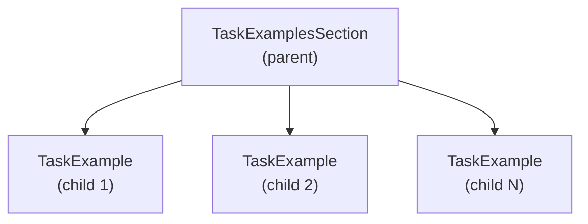

# Task Examples Specification

## Purpose

The `TaskExamplesSection` provides trajectory-based examples that demonstrate
multi-step agent behavior. While `ToolExample` shows single-tool invocations,
`TaskExample` captures complete sequences: an objective, an ordered list
of tool calls, and an expected outcome. These examples serve as few-shot
demonstrations for complex agent workflows.

## Guiding Principles

- **Compositional hierarchy**: `TaskExample` instances are child sections
  of `TaskExamplesSection`, benefiting from standard section features.
- **Type-safe at construction**: All validation happens when the prompt template
  is built, not at render time.
- **Tool coherence**: Each step references a tool by name and must match that
  tool's parameter and result types.
- **Deterministic ordering**: Steps execute in declaration order; the sequence
  matters for trajectory learning.

## Core Schemas

### TaskStep

`TaskStep[ParamsT, ResultT]` represents a single tool invocation within a
trajectory:

```python
@dataclass(slots=True, frozen=True)
class TaskStep(Generic[ParamsT, ResultT]):
    """Single tool invocation in a task trajectory."""

    tool_name: str
    example: ToolExample[ParamsT, ResultT]
```

**Fields:**

| Field | Type | Description |
|-------|------|-------------|
| `tool_name` | `str` | Name of the tool being invoked (must match `^[a-z0-9_-]{1,64}$`) |
| `example` | `ToolExample[ParamsT, ResultT]` | The invocation details (description, input, output) |

The `example.description` field describes the reasoning or purpose for this
specific step within the trajectory (e.g., "Fetch user profile to check
permissions").

### TaskExample

`TaskExample` is a `Section` that captures a complete trajectory from
objective to outcome. As a section, it participates in the standard hierarchy
and supports all section features (visibility, enabled predicates, cloning).

```python
class TaskExample(Section[TaskExampleParamsT]):
    """Section representing a single task trajectory example."""

    def __init__(
        self,
        *,
        key: str,
        objective: str,
        outcome: str,
        steps: Sequence[TaskStep[Any, Any]],
        title: str | None = None,
        **kwargs: object,
    ) -> None: ...
```

**Constructor Arguments:**

| Argument | Required | Description |
|----------|----------|-------------|
| `key` | Yes | Section identifier (e.g., `"example-auth-review"`) |
| `objective` | Yes | The task goal (1-500 ASCII chars) |
| `outcome` | Yes | The expected result (1-500 ASCII chars) |
| `steps` | Yes | Non-empty ordered sequence of `TaskStep` instances |
| `title` | No | Display title; defaults to truncated objective |

**Section Properties:**

- `objective: str` - The task goal
- `outcome: str` - The expected result
- `steps: tuple[TaskStep, ...]` - Ordered tool invocation sequence

### TaskExamplesSection

`TaskExamplesSection` is a container section that renders its
`TaskExample` children with consistent formatting:

```python
class TaskExamplesSection(Section[TaskExamplesParamsT]):
    """Container section for task example children."""

    def __init__(
        self,
        *,
        key: str = "task-examples",
        title: str = "Task Examples",
        examples: Sequence[TaskExample[Any]],
        **kwargs: object,
    ) -> None: ...
```

**Constructor Arguments:**

| Argument | Required | Description |
|----------|----------|-------------|
| `key` | No | Section identifier (default: `"task-examples"`) |
| `title` | No | Display title (default: `"Task Examples"`) |
| `examples` | Yes | One or more `TaskExample` instances |

The `examples` argument is **required** and must contain only
`TaskExample` instances. These are registered as `Section.children`.

## Section Hierarchy

`TaskExample` instances register as children of `TaskExamplesSection`,
creating a two-level hierarchy:



This hierarchy enables:

- **Per-example visibility**: Individual examples can be summarized or expanded
- **Conditional rendering**: Examples can use `enabled` predicates
- **Section paths**: Examples are addressable via dot notation
  (e.g., `"task-examples.example-auth-review"`)
- **Cloning**: Examples clone correctly with session/bus rewiring

### Child Section Registration

When constructing `TaskExamplesSection`, the provided `TaskExample`
instances are registered as children:

```python
auth_example = TaskExample(
    key="auth-review",
    objective="Review authentication for vulnerabilities",
    outcome="Identified SQL injection issue",
    steps=[...],
)

perf_example = TaskExample(
    key="perf-audit",
    objective="Audit database queries for N+1 issues",
    outcome="Found 3 N+1 query patterns",
    steps=[...],
)

examples_section = TaskExamplesSection(
    key="examples",
    title="Workflow Examples",
    examples=[auth_example, perf_example],
)

# Children are accessible via standard section traversal
assert examples_section.children == (auth_example, perf_example)
```

## Validation Rules

All validation occurs at `PromptTemplate` construction time. Invalid examples
raise `PromptValidationError` immediately.

### Objective and Outcome Validation

- Must be 1-500 ASCII characters (same rules as `ToolExample.description` but
  with extended limit for richer context)
- Must not be blank after stripping whitespace
- Must contain only printable ASCII characters

```python
# Valid
TaskExample(
    key="security-review",
    objective="Review the authentication module for security issues",
    outcome="Identified 3 vulnerabilities with remediation steps",
    steps=[...],
)

# Invalid: empty objective
TaskExample(
    key="bad-example",
    objective="",  # PromptValidationError
    outcome="Done",
    steps=[...],
)
```

### Steps Validation

- `steps` must be non-empty (at least one step required)
- Steps are validated in declaration order

```python
# Invalid: empty steps
TaskExample(
    key="empty-steps",
    objective="Do something",
    outcome="Done",
    steps=[],  # PromptValidationError: "steps must not be empty"
)
```

### Tool Name Resolution

Each `TaskStep.tool_name` must reference a tool registered elsewhere in the
prompt. Validation occurs during `PromptTemplate` construction by resolving
tool names against the prompt's complete tool registry:

```python
lookup_tool = Tool[LookupParams, LookupResult](name="lookup", ...)
search_tool = Tool[SearchParams, SearchResult](name="search", ...)

# Tools are registered in a separate section
tools_section = MarkdownSection(
    key="tools",
    title="Available Tools",
    template="Use these tools to complete tasks.",
    tools=[lookup_tool, search_tool],
)

# Task examples reference tools by name
example = TaskExample(
    key="valid-example",
    objective="Find information",
    outcome="Found results",
    steps=[
        TaskStep(tool_name="lookup", example=...),  # Resolved from prompt
        TaskStep(tool_name="search", example=...),  # Resolved from prompt
    ],
)

# Valid: tool names resolve against prompt's tools
template = PromptTemplate(
    ns="test",
    key="valid",
    sections=[
        tools_section,
        TaskExamplesSection(key="examples", examples=[example]),
    ],
)

# Invalid: "unknown" not found in prompt's tool registry
bad_example = TaskExample(
    key="bad-tool",
    objective="Find information",
    outcome="Found results",
    steps=[
        TaskStep(tool_name="unknown", example=...),  # PromptValidationError
    ],
)
```

Error message format:

```
PromptValidationError: Unknown tool "unknown" in task example step 0.
Available tools: lookup, search.
Section path: ("task-examples", "bad-tool")
```

### Type Coherence

Each step's `ToolExample` must match the referenced tool's parameter and result
types. Validation reuses the existing `Tool._validate_examples` logic:

```python
@dataclass
class LookupParams:
    entity_id: str

@dataclass
class LookupResult:
    url: str

lookup_tool = Tool[LookupParams, LookupResult](name="lookup", ...)

# Valid: types match
TaskStep(
    tool_name="lookup",
    example=ToolExample(
        description="Fetch entity",
        input=LookupParams(entity_id="abc"),
        output=LookupResult(url="https://..."),
    ),
)

# Invalid: wrong input type
TaskStep(
    tool_name="lookup",
    example=ToolExample(
        description="Fetch entity",
        input=SearchParams(query="abc"),  # PromptValidationError: type mismatch
        output=LookupResult(url="https://..."),
    ),
)
```

Error message format:

```
PromptValidationError: Task example step 1 input type mismatch for tool "lookup".
Expected: LookupParams, got: SearchParams.
Section path: ("task-examples", "example-key")
```

### Examples Type Validation

`TaskExamplesSection` validates that all examples are `TaskExample`
instances:

```python
# Invalid: wrong example type
TaskExamplesSection(
    examples=[
        MarkdownSection(key="wrong", ...),  # PromptValidationError
    ],
)
```

Error message:

```
PromptValidationError: TaskExamplesSection examples must be TaskExample instances.
Got: MarkdownSection at index 0.
```

## Rendering

### Markdown Structure

The container section renders a heading, then delegates to child sections.
Each `TaskExample` renders its trajectory:

````markdown
## 3. Task Examples

### 3.1. Review authentication module

**Objective:** Review the authentication module for security vulnerabilities.

**Steps:**

1. **read_file** - Read the auth module source
   - input:
     ```json
     {"path": "src/auth.py"}
     ```
   - output:
     ```
     {"content": "def authenticate(user, password): ..."}
     ```

2. **search_patterns** - Search for common vulnerability patterns
   - input:
     ```json
     {"pattern": "sql.*\\+.*user", "path": "src/"}
     ```
   - output:
     ```
     {"matches": [{"file": "src/auth.py", "line": 42}]}
     ```

3. **report_issue** - Report the SQL injection vulnerability
   - input:
     ```json
     {"severity": "high", "title": "SQL injection in auth module"}
     ```
   - output:
     ```
     {"issue_id": "SEC-123"}
     ```

**Outcome:** Identified SQL injection vulnerability and created issue SEC-123.

### 3.2. Audit database queries

**Objective:** Audit database queries for N+1 issues.

...
````

### Rendering Rules

- Container section renders its title as the parent heading
- Child sections use standard nested numbering (3.1, 3.2, etc.)
- Example titles derive from objective (truncated to 60 characters if needed)
- Steps render in declaration order with 1-based numbering
- Input/output use fenced code blocks (JSON for input, plain for output)
- Step descriptions appear after the tool name in bold

## Integration

### With PromptTemplate

```python
from weakincentives.prompt import (
    PromptTemplate,
    MarkdownSection,
    TaskExamplesSection,
    TaskExample,
    TaskStep,
    Tool,
    ToolExample,
)

# Define tools
read_tool = Tool[ReadParams, ReadResult](
    name="read_file",
    description="Read a file from the workspace.",
    handler=read_handler,
)

search_tool = Tool[SearchParams, SearchResult](
    name="search",
    description="Search for patterns in files.",
    handler=search_handler,
)

# Define task example sections
review_example = TaskExample(
    key="security-review",
    objective="Review src/auth.py for security issues",
    outcome="Identified 2 vulnerabilities with severity ratings",
    steps=[
        TaskStep(
            tool_name="read_file",
            example=ToolExample(
                description="Read the target file",
                input=ReadParams(path="src/auth.py"),
                output=ReadResult(content="def authenticate(): ..."),
            ),
        ),
        TaskStep(
            tool_name="search",
            example=ToolExample(
                description="Search for SQL patterns",
                input=SearchParams(pattern="SELECT.*%s"),
                output=SearchResult(matches=[Match(line=42)]),
            ),
        ),
    ],
)

# Build prompt with task examples as child sections
template = PromptTemplate(
    ns="agents/reviewer",
    key="code-review",
    sections=[
        MarkdownSection(
            title="Instructions",
            key="instructions",
            template="Review code for security issues.",
            tools=[read_tool, search_tool],
        ),
        TaskExamplesSection(
            title="Example Workflows",
            key="example-workflows",
            examples=[review_example],
        ),
    ],
)
```

### Tool Resolution

`TaskExample` sections reference tools by name. The tools themselves are
registered in other sections (e.g., `MarkdownSection`). During prompt
construction, tool names in `TaskStep` instances are resolved against the
prompt's complete tool registry:

```python
template = PromptTemplate(
    ns="test",
    key="with-examples",
    sections=[
        MarkdownSection(
            key="tools",
            title="Tools",
            template="Use these tools.",
            tools=[Tool(name="read_file", ...)],  # Tool registered here
        ),
        TaskExamplesSection(
            key="examples",
            examples=[
                TaskExample(
                    key="example-1",
                    objective="...",
                    outcome="...",
                    steps=[
                        TaskStep(tool_name="read_file", example=...),  # Resolved
                    ],
                ),
            ],
        ),
    ],
)
```

### Progressive Disclosure

Both container and child sections support summary visibility:

```python
# Summarize the entire examples section
TaskExamplesSection(
    examples=[...],
    visibility=SectionVisibility.SUMMARY,
    summary="Example workflows available for review tasks.",
)

# Summarize individual examples
TaskExample(
    key="complex-example",
    objective="...",
    outcome="...",
    steps=[...],
    visibility=SectionVisibility.SUMMARY,
    summary="Complex multi-step workflow example.",
)
```

When a `TaskExample` is summarized, it renders only its summary text.
When expanded, it renders the full trajectory.

### Conditional Rendering

Individual examples can be conditionally enabled:

```python
@dataclass
class ExampleParams:
    show_advanced: bool = False

advanced_example = TaskExample[ExampleParams](
    key="advanced-workflow",
    objective="Complex multi-tool orchestration",
    outcome="...",
    steps=[...],
    enabled=lambda params: params.show_advanced,
)
```

### Cloning

Both section types support cloning with session/bus rewiring:

```python
cloned_examples = examples_section.clone(session=new_session, bus=new_bus)

# Children are recursively cloned
assert cloned_examples.children[0] is not examples_section.children[0]
```

## Error Handling

### Exception Types

All validation errors raise `PromptValidationError` with:

- `message`: Human-readable description
- `section_path`: Path to the section (e.g., `("task-examples", "example-1")`)
- `placeholder`: Field name when applicable (e.g., `"objective"`, `"steps"`)

### Error Scenarios

| Scenario | Error Message |
|----------|---------------|
| Empty objective | `"objective must not be empty"` |
| Objective too long | `"objective must be <= 500 characters"` |
| Empty outcome | `"outcome must not be empty"` |
| Outcome too long | `"outcome must be <= 500 characters"` |
| Empty steps | `"steps must not be empty"` |
| Unknown tool name | `"Unknown tool \"X\" in task example step N"` |
| Input type mismatch | `"Task example step N input type mismatch for tool \"X\""` |
| Output type mismatch | `"Task example step N output type mismatch for tool \"X\""` |
| Wrong example type | `"TaskExamplesSection examples must be TaskExample instances"` |

## Usage Example

Complete example demonstrating a multi-tool workflow with child sections:

```python
from dataclasses import dataclass, field
from weakincentives.prompt import (
    PromptTemplate,
    MarkdownSection,
    TaskExamplesSection,
    TaskExample,
    TaskStep,
    Tool,
    ToolExample,
)

# Parameter and result types
@dataclass(slots=True, frozen=True)
class FetchParams:
    url: str = field(metadata={"description": "URL to fetch"})

@dataclass(slots=True, frozen=True)
class FetchResult:
    status: int
    body: str

@dataclass(slots=True, frozen=True)
class ParseParams:
    content: str = field(metadata={"description": "Content to parse"})
    format: str = field(metadata={"description": "Expected format (json, xml)"})

@dataclass(slots=True, frozen=True)
class ParseResult:
    data: dict[str, str]

@dataclass(slots=True, frozen=True)
class StoreParams:
    key: str = field(metadata={"description": "Storage key"})
    value: str = field(metadata={"description": "Value to store"})

@dataclass(slots=True, frozen=True)
class StoreResult:
    stored: bool

# Tool definitions
fetch_tool = Tool[FetchParams, FetchResult](
    name="fetch_url",
    description="Fetch content from a URL.",
    handler=fetch_handler,
)

parse_tool = Tool[ParseParams, ParseResult](
    name="parse_content",
    description="Parse structured content.",
    handler=parse_handler,
)

store_tool = Tool[StoreParams, StoreResult](
    name="store_data",
    description="Store data in the session.",
    handler=store_handler,
)

# Task example sections
etl_example = TaskExample(
    key="etl-workflow",
    objective="Fetch API data, parse the JSON response, and store the result",
    outcome="Successfully fetched, parsed, and stored user data",
    steps=[
        TaskStep(
            tool_name="fetch_url",
            example=ToolExample(
                description="Fetch the user API endpoint",
                input=FetchParams(url="https://api.example.com/users/123"),
                output=FetchResult(status=200, body='{"name": "Alice"}'),
            ),
        ),
        TaskStep(
            tool_name="parse_content",
            example=ToolExample(
                description="Parse the JSON response",
                input=ParseParams(content='{"name": "Alice"}', format="json"),
                output=ParseResult(data={"name": "Alice"}),
            ),
        ),
        TaskStep(
            tool_name="store_data",
            example=ToolExample(
                description="Store the parsed user data",
                input=StoreParams(key="user:123", value="Alice"),
                output=StoreResult(stored=True),
            ),
        ),
    ],
)

error_handling_example = TaskExample(
    key="error-handling",
    objective="Handle API errors gracefully",
    outcome="Detected 404 error and logged appropriate message",
    steps=[
        TaskStep(
            tool_name="fetch_url",
            example=ToolExample(
                description="Attempt to fetch non-existent resource",
                input=FetchParams(url="https://api.example.com/users/999"),
                output=FetchResult(status=404, body='{"error": "Not found"}'),
            ),
        ),
    ],
)

# Build prompt with task examples as child sections
template = PromptTemplate(
    ns="agents/etl",
    key="data-pipeline",
    sections=[
        MarkdownSection(
            title="Instructions",
            key="instructions",
            template="Process data using the available tools.",
            tools=[fetch_tool, parse_tool, store_tool],
        ),
        TaskExamplesSection(
            title="Workflow Examples",
            key="workflow-examples",
            examples=[etl_example, error_handling_example],
        ),
    ],
)
```

## Implementation Checklist

- [ ] `TaskStep` frozen dataclass with `tool_name` and `example` fields
- [ ] `TaskExample` extending `Section` with validation in `__init__`
- [ ] `TaskExamplesSection` extending `Section` with examples validation
- [ ] Objective/outcome validation (1-500 ASCII chars, non-blank)
- [ ] Steps non-empty validation
- [ ] Tool name resolution against prompt's tool registry
- [ ] Type coherence validation reusing `Tool._validate_examples` logic
- [ ] Examples type validation (must be `TaskExample`)
- [ ] Markdown rendering with nested section numbering
- [ ] Progressive disclosure support for both section types
- [ ] Conditional rendering via `enabled` predicate
- [ ] `clone()` implementation with recursive child cloning
- [ ] Integration tests for validation error messages
- [ ] Unit tests for rendering output format
- [ ] Unit tests for section hierarchy traversal

## Limitations

- **No branching**: Steps form a linear sequence; conditional paths are not
  supported.
- **No intermediate state**: Examples don't capture session state between steps.
- **Static tools**: Tool references are resolved at construction; dynamic tool
  registration is not supported.
- **No step dependencies**: Steps cannot reference outputs from previous steps
  in their inputs (the example is illustrative, not executable).
- **Homogeneous children**: `TaskExamplesSection` only accepts
  `TaskExample` children, not arbitrary section types.
