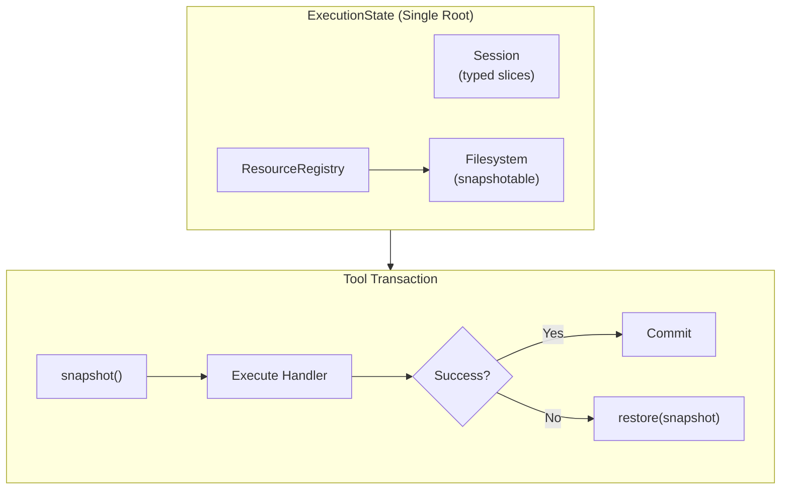
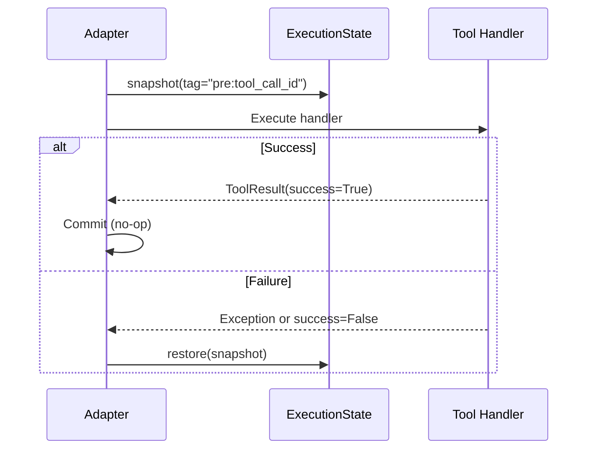

# Execution State Specification

## Purpose

This specification defines `ExecutionState`, a unified root for all mutable
runtime state during prompt evaluation. It establishes transactional semantics
at tool invocation boundaries, ensuring that failed or aborted tool calls leave
no trace in mutable state.

## Guiding Principles

- **Hermetic run state**: All state that can affect prompt evaluation is either
  immutable configuration or explicitly owned mutable state reachable from a
  single root object.
- **Tool invocation is atomic**: Each tool call is a transaction—on failure,
  all state changes are rolled back.
- **Consistent semantics across adapters**: OpenAI/LiteLLM and Claude Agent SDK
  execute tools under identical transaction semantics.
- **State vs. history distinction**: Mutable working state is rolled back by
  default; append-only logs are preserved.



## ExecutionState

`ExecutionState` is the single owner of all mutable state used during prompt
evaluation:

```python
@dataclass(slots=True)
class ExecutionState:
    """Unified root for all mutable runtime state during evaluation."""

    session: Session
    resources: ResourceRegistry

    def snapshot(self, *, tag: str | None = None) -> CompositeSnapshot:
        """Capture consistent snapshot of session and all snapshotable resources."""
        resource_snapshots: dict[type[object], object] = {}

        # Use get_all() with a predicate to find Snapshotable resources
        snapshotable = self.resources.get_all(
            lambda x: isinstance(x, Snapshotable)
        )
        for resource_type, resource in snapshotable.items():
            resource_snapshots[resource_type] = resource.snapshot(tag=tag)

        return CompositeSnapshot(
            snapshot_id=uuid4(),
            created_at=datetime.now(UTC),
            session=self.session.snapshot(),
            resources=types.MappingProxyType(resource_snapshots),
            metadata=SnapshotMetadata(tag=tag),
        )

    def restore(self, snapshot: CompositeSnapshot) -> None:
        """Restore session and all snapshotable resources from a composite snapshot."""
        self.session.restore(snapshot.session)

        for resource_type, resource_snapshot in snapshot.resources.items():
            resource = self.resources.get(resource_type)
            if resource is not None and isinstance(resource, Snapshotable):
                resource.restore(resource_snapshot)
```

### Ownership

- `MainLoop.execute()` creates an `ExecutionState`.
- Adapters accept `ExecutionState` instead of individual parameters.
- `ToolContext` carries `ExecutionState`.
- Snapshotable resources (filesystem) are registered in `resources`.

### ResourceRegistry

See `specs/RESOURCE_REGISTRY.md` for full documentation. Key methods for ExecutionState:

```python
class ResourceRegistry:
    def get[T](self, protocol: type[T], default: T | None = None) -> T | None:
        """Return resource for protocol, or default if absent."""
        ...

    def get_all[T](self, predicate: Callable[[object], bool]) -> Mapping[type[T], T]:
        """Return all resolved instances matching a predicate."""
        ...

    @staticmethod
    def build(mapping: Mapping[type[object], object]) -> ResourceRegistry:
        """Create registry from pre-constructed instances."""
        ...
```

## Snapshotable Protocol

```python
class Snapshotable(Protocol[SnapshotT]):
    """Protocol for state containers that support snapshot and restore."""

    def snapshot(self, *, tag: str | None = None) -> SnapshotT:
        """Capture current state as an immutable snapshot."""
        ...

    def restore(self, snapshot: SnapshotT) -> None:
        """Restore state from a snapshot."""
        ...
```

### Implementations

| Component            | Snapshot Type        | Storage Strategy                 |
| -------------------- | -------------------- | -------------------------------- |
| `Session`            | `Snapshot`           | Slice values as frozen tuples    |
| `InMemoryFilesystem` | `FilesystemSnapshot` | Structural sharing of file dicts |
| `HostFilesystem`     | `FilesystemSnapshot` | Git commits                      |

## Session

`Session` implements `Snapshotable[Snapshot]`:

```python
class Session(Snapshotable[Snapshot]):
    def snapshot(
        self,
        *,
        tag: str | None = None,
        policies: frozenset[SlicePolicy] = frozenset({SlicePolicy.STATE}),
        include_all: bool = False,
    ) -> Snapshot:
        """Capture session state.

        Args:
            tag: Optional label for the snapshot.
            policies: Which slice policies to include (default: STATE only).
            include_all: If True, ignore policies and snapshot everything.
        """
        ...

    def restore(
        self,
        snapshot: Snapshot,
        *,
        preserve_logs: bool = True,
    ) -> None:
        """Restore session state from snapshot.

        Args:
            snapshot: The snapshot to restore.
            preserve_logs: If True, LOG slices are not modified.
        """
        ...
```

### Slice Policies

Not all session state should be rolled back on tool failure:

```python
class SlicePolicy(Enum):
    """Determines restore behavior for session slices."""

    STATE = "state"   # Restored on tool failure (default)
    LOG = "log"       # Preserved during restore (append-only)
```

Register slices with explicit policies:

```python
session[Plan].register(SetupPlan, plan_reducer, policy=SlicePolicy.STATE)
session[ToolInvoked].register(ToolInvoked, append_all, policy=SlicePolicy.LOG)
```

Default policies:

| Slice Type            | Policy | Rationale         |
| --------------------- | ------ | ----------------- |
| `Plan`                | STATE  | Working state     |
| `VisibilityOverrides` | STATE  | Working state     |
| `WorkspaceDigest`     | STATE  | Working state     |
| `ToolInvoked`         | LOG    | Historical record |
| `PromptRendered`      | LOG    | Historical record |
| `PromptExecuted`      | LOG    | Historical record |
| Custom slices         | STATE  | Safe default      |

### Snapshot

```python
@dataclass(slots=True, frozen=True)
class Snapshot:
    """Immutable capture of session slice state."""

    created_at: datetime
    slices: SnapshotState
    policies: Mapping[type[object], SlicePolicy]

    def to_json(self) -> str: ...

    @classmethod
    def from_json(cls, raw: str) -> Snapshot: ...
```

## Composite Snapshot

```python
@dataclass(slots=True, frozen=True)
class CompositeSnapshot:
    """Consistent snapshot of session and snapshotable resources."""

    snapshot_id: UUID
    created_at: datetime
    session: Snapshot
    resources: Mapping[type[object], object]  # Resource type -> snapshot
    metadata: SnapshotMetadata | None = None

    def to_json(self) -> str: ...

    @classmethod
    def from_json(cls, raw: str) -> CompositeSnapshot: ...


@dataclass(slots=True, frozen=True)
class SnapshotMetadata:
    """Context for when and why a snapshot was taken."""

    tag: str | None = None
    tool_call_id: str | None = None
    tool_name: str | None = None
    phase: Literal["pre_tool", "post_tool", "manual"] = "manual"
```

## Tool Transaction Semantics

Every tool invocation is wrapped in a transaction:



### Restore Triggers

| Condition                     | Behavior                                     |
| ----------------------------- | -------------------------------------------- |
| Handler raises exception      | Restore, wrap in `ToolResult(success=False)` |
| `ToolResult.success == False` | Restore, return result                       |
| `ToolValidationError`         | Restore, wrap in `ToolResult(success=False)` |
| `VisibilityExpansionRequired` | Restore, re-raise for retry                  |
| `DeadlineExceededError`       | Restore, convert to `PromptEvaluationError`  |

## Filesystem

`SnapshotableFilesystem` provides snapshot/restore for workspace state:

```python
fs = HostFilesystem(_root="/workspace")
fs.write("config.py", "DEBUG = True")

# Capture
fs_snapshot = fs.snapshot(tag="before-edit")

# Mutate
fs.write("config.py", "DEBUG = False")

# Restore
fs.restore(fs_snapshot)
```

Filesystem is registered as a snapshotable resource:

```python
resources = ResourceRegistry.build({Filesystem: fs})
state = ExecutionState(session=session, resources=resources)

# Composite snapshot includes session and filesystem
composite = state.snapshot(tag="pre:tool_call")

# Restore restores both
state.restore(composite)
```

## Error Handling

```python
class ExecutionStateError(WinkError, RuntimeError):
    """Base class for execution state errors."""


class SnapshotMismatchError(ExecutionStateError):
    """Snapshot does not match current state structure."""


class RestoreFailedError(ExecutionStateError):
    """Failed to restore from snapshot."""
```

Telemetry publish failures do not trigger restore:

```python
def _publish_tool_invocation(self, event: ToolInvoked, *, bus: Dispatcher) -> None:
    """Publish tool invocation event (best-effort)."""
    try:
        bus.dispatch(event)
    except Exception:
        log.warning("Failed to publish tool invocation event", exc_info=True)
        # State remains committed; telemetry is best-effort
```

## Acceptance Criteria

### Tool Failure Does Not Change State

```python
def test_tool_failure_restores_state(execution_state: ExecutionState):
    fs = execution_state.resources.get(Filesystem)
    session = execution_state.session

    fs.write("file.txt", "original")
    session[Plan].seed(Plan(objective="test", status="active"))

    result = execute_tool(mutating_tool, execution_state=execution_state)

    assert not result.success
    assert fs.read("file.txt").content == "original"
    assert session[Plan].latest().objective == "test"
```

### VisibilityExpansionRequired Restores State

```python
def test_visibility_expansion_restores_state(execution_state: ExecutionState):
    fs = execution_state.resources.get(Filesystem)
    fs.write("data.txt", "before")
    snapshot_before = execution_state.snapshot()

    with pytest.raises(VisibilityExpansionRequired):
        execute_tool(expanding_tool, execution_state=execution_state)

    snapshot_after = execution_state.snapshot()
    assert snapshots_equivalent(snapshot_before, snapshot_after)
```

### Adapter Parity

```python
def test_adapter_parity():
    state_openai = create_execution_state()
    state_claude = create_execution_state()

    result_openai = execute_via_openai(tool, state_openai)
    result_claude = execute_via_claude_sdk(tool, state_claude)

    assert snapshots_equivalent(state_openai.snapshot(), state_claude.snapshot())
```

## Limitations

- **Synchronous only**: Transactions assume single-threaded execution.
- **No partial restore**: Cannot restore specific slices independently.
- **Git dependency**: Disk-backed filesystem snapshots require git.
- **No network rollback**: External API calls cannot be undone.
