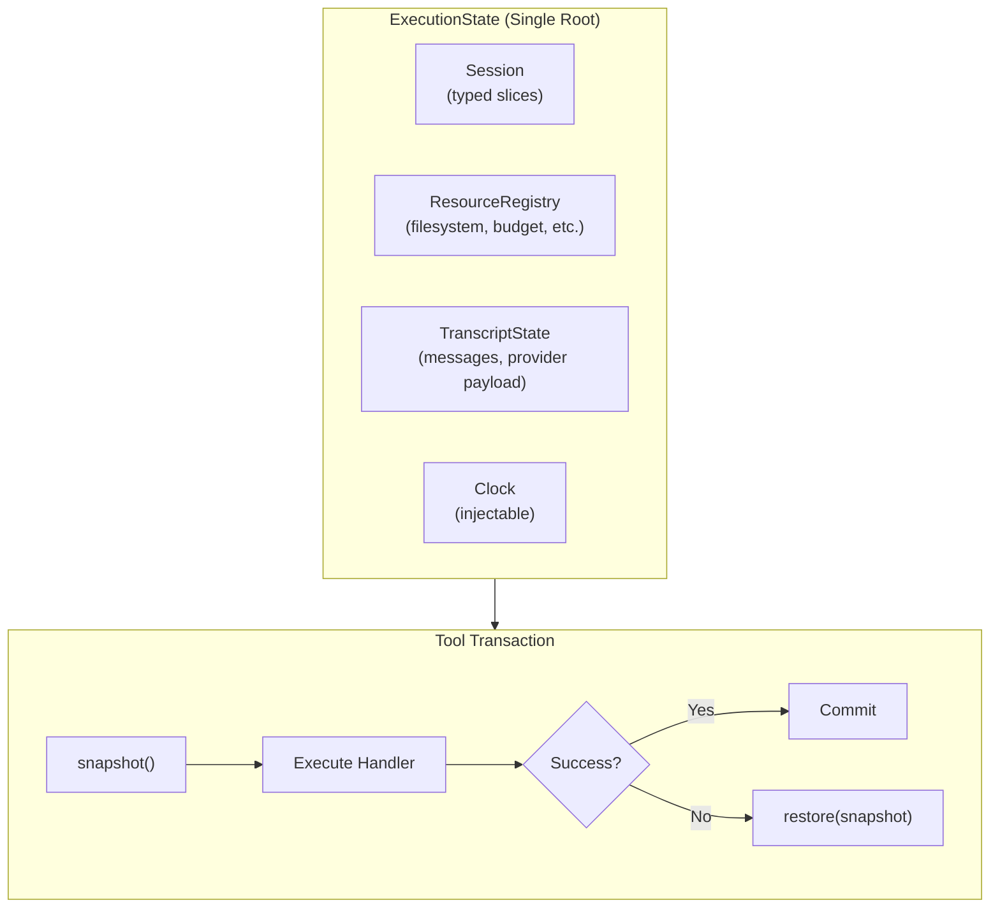
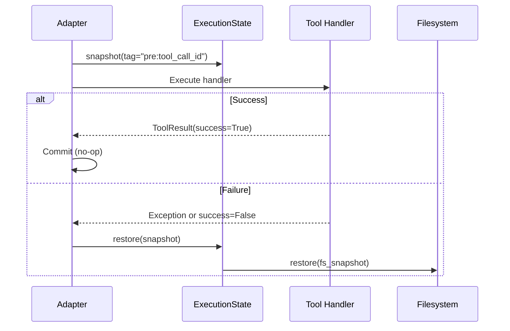

# Execution State Specification

## Purpose

This specification defines `ExecutionState`, a unified root for all mutable
runtime state during prompt evaluation. It establishes transactional semantics
at tool invocation boundaries, ensuring that failed or aborted tool calls leave
no trace in mutable state.

## Guiding Principles

- **Hermetic run state**: All state that can affect prompt evaluation is either
  immutable configuration or explicitly owned mutable state reachable from a
  single root object.
- **Tool invocation is atomic**: Each tool call is a transaction—on failure,
  all state changes are rolled back.
- **Rollback targets tool boundaries**: You can restore state to "before tool
  call X" or "after tool call X" without ad-hoc code.
- **Consistent semantics across adapters**: OpenAI/LiteLLM and Claude Agent SDK
  execute tools under identical transaction semantics.
- **State vs. history distinction**: Mutable working state is rolled back by
  default; append-only logs are preserved.



## ExecutionState

### Definition

`ExecutionState` is the single owner of all mutable state used during prompt
evaluation:

```python
@dataclass(slots=True)
class ExecutionState:
    """Unified root for all mutable runtime state during evaluation."""

    session: Session
    resources: ResourceRegistry
    clock: Clock = field(default_factory=SystemClock)
    rng: Random | None = None
    checkpoints: CheckpointStore | None = None

    def snapshot(self, *, tag: str | None = None) -> CompositeSnapshot:
        """Capture consistent snapshot of all snapshotable state."""
        ...

    def restore(self, snapshot: CompositeSnapshot) -> None:
        """Restore all state from a composite snapshot."""
        ...
```

### Ownership Semantics

- `MainLoop.execute()` creates or receives an `ExecutionState`.
- Adapters accept `ExecutionState` instead of individual `(session, budget_tracker, deadline, ...)` parameters.
- `ToolContext` carries `ExecutionState` (or a reference to it).
- Section runtime state is registered in `resources`, not hidden in section instances.

### Resource Registry Integration

The `ResourceRegistry` holds typed runtime resources that may be snapshotable:

```python
@dataclass(slots=True, frozen=True)
class ResourceRegistry:
    """Typed container for runtime resources."""

    _entries: Mapping[type[object], object]

    def get[T](self, resource_type: type[T]) -> T | None: ...
    def get[T](self, resource_type: type[T], default: T) -> T: ...

    def snapshotable_resources(self) -> Mapping[type[object], Snapshotable[object]]:
        """Return all resources that implement Snapshotable."""
        return {
            k: v for k, v in self._entries.items()
            if isinstance(v, Snapshotable)
        }
```

## Snapshotable Protocol

### Definition

Generalizes the snapshot/restore pattern across all state containers:

```python
class Snapshotable(Protocol[SnapshotT]):
    """Protocol for state containers that support snapshot and restore."""

    def snapshot(self, *, tag: str | None = None) -> SnapshotT:
        """Capture current state as an immutable snapshot."""
        ...

    def restore(self, snapshot: SnapshotT) -> None:
        """Restore state from a snapshot."""
        ...
```

### Implementations

| Component | Snapshot Type | Storage Strategy |
|-----------|--------------|------------------|
| `Session` | `Snapshot` | Slice values as frozen tuples |
| `InMemoryFilesystem` | `FilesystemSnapshot` | Structural sharing of file dicts |
| `HostFilesystem` | `FilesystemSnapshot` | Git commits |
| `BudgetTracker` | `BudgetSnapshot` | Token counts per evaluation |

### Session Adapter

`Session` already provides `snapshot()` and `rollback()`; we wrap it to fit the
`Snapshotable` protocol:

```python
class SessionSnapshotAdapter(Snapshotable[Snapshot]):
    """Adapts Session to the Snapshotable protocol."""

    def __init__(self, session: Session) -> None:
        self._session = session

    def snapshot(self, *, tag: str | None = None) -> Snapshot:
        return self._session.snapshot()

    def restore(self, snapshot: Snapshot) -> None:
        self._session.rollback(snapshot)
```

## Composite Snapshot

### Definition

A composite snapshot captures all snapshotable state atomically:

```python
@dataclass(slots=True, frozen=True)
class CompositeSnapshot:
    """Consistent snapshot of all execution state."""

    snapshot_id: UUID
    created_at: datetime
    session: Snapshot
    resources: Mapping[type[object], object]  # Resource type -> snapshot
    metadata: SnapshotMetadata

    def to_json(self) -> str:
        """Serialize to JSON for persistence."""
        ...

    @classmethod
    def from_json(cls, raw: str) -> CompositeSnapshot:
        """Deserialize from JSON."""
        ...


@dataclass(slots=True, frozen=True)
class SnapshotMetadata:
    """Context for when and why a snapshot was taken."""

    tag: str | None = None
    tool_call_id: str | None = None
    tool_name: str | None = None
    phase: Literal["pre_tool", "post_tool", "checkpoint", "manual"] = "manual"
```

### ExecutionState Snapshot Operations

```python
@dataclass(slots=True)
class ExecutionState:
    session: Session
    resources: ResourceRegistry
    clock: Clock = field(default_factory=SystemClock)

    def snapshot(self, *, tag: str | None = None) -> CompositeSnapshot:
        """Capture consistent snapshot of all snapshotable state."""
        resource_snapshots: dict[type[object], object] = {}

        for resource_type, resource in self.resources.snapshotable_resources().items():
            resource_snapshots[resource_type] = resource.snapshot(tag=tag)

        return CompositeSnapshot(
            snapshot_id=uuid4(),
            created_at=self.clock.now(),
            session=self.session.snapshot(),
            resources=types.MappingProxyType(resource_snapshots),
            metadata=SnapshotMetadata(tag=tag),
        )

    def restore(self, snapshot: CompositeSnapshot) -> None:
        """Restore all state from a composite snapshot."""
        self.session.rollback(snapshot.session)

        for resource_type, resource_snapshot in snapshot.resources.items():
            resource = self.resources.get(resource_type)
            if resource is not None and isinstance(resource, Snapshotable):
                resource.restore(resource_snapshot)
```

## Slice Policies

### Motivation

Not all session state should be rolled back on tool failure:

- **Working state** (Plan, VisibilityOverrides, workspace digests): should be
  restored to pre-tool state on failure.
- **History logs** (ToolInvoked, PromptRendered, PromptExecuted): should be
  preserved as a truthful record of what happened.
- **Caches** (computed digests, previews): can be rolled back or recomputed.

### Policy Enum

```python
class SlicePolicy(Enum):
    """Determines rollback behavior for session slices."""

    STATE = "state"   # Rolled back on tool failure (default)
    LOG = "log"       # Preserved during rollback (append-only)
    CACHE = "cache"   # Can be rolled back, can be recomputed
```

### Slice Registration

```python
# Register slice with explicit policy
session[Plan].register(
    SetupPlan,
    plan_reducer,
    policy=SlicePolicy.STATE,
)

# Log slices are preserved during transactions
session[ToolInvoked].register(
    ToolInvoked,
    append_all,
    policy=SlicePolicy.LOG,
)
```

### Default Policies

| Slice Type | Default Policy | Rationale |
|------------|---------------|-----------|
| `Plan` | STATE | Working state, should be restored |
| `VisibilityOverrides` | STATE | Working state |
| `WorkspaceDigest` | CACHE | Can be recomputed |
| `ToolInvoked` | LOG | Historical record |
| `PromptRendered` | LOG | Historical record |
| `PromptExecuted` | LOG | Historical record |
| Custom slices | STATE | Safe default |

### Scoped Snapshot

`Session.snapshot()` accepts a policy filter:

```python
class Session:
    def snapshot(
        self,
        *,
        policies: frozenset[SlicePolicy] = frozenset({SlicePolicy.STATE}),
        include_all: bool = False,
    ) -> Snapshot:
        """Capture session state.

        Args:
            policies: Which slice policies to include (default: STATE only).
            include_all: If True, ignore policies and snapshot everything.
        """
        ...

    def rollback(
        self,
        snapshot: Snapshot,
        *,
        preserve_logs: bool = True,
    ) -> None:
        """Restore session state from snapshot.

        Args:
            snapshot: The snapshot to restore.
            preserve_logs: If True, LOG slices are not modified.
        """
        ...
```

## Tool Transaction Semantics

### Transaction Boundary

Every tool invocation is wrapped in a transaction:



### Rollback Triggers

State is restored on any of these conditions:

| Condition | Behavior |
|-----------|----------|
| Handler raises exception | Rollback, wrap in `ToolResult(success=False)` |
| `ToolResult.success == False` | Rollback, return result |
| `ToolValidationError` | Rollback, wrap in `ToolResult(success=False)` |
| `VisibilityExpansionRequired` | Rollback, re-raise for retry |
| `DeadlineExceededError` | Rollback, convert to `PromptEvaluationError` |

### Implementation

The `tool_execution()` context manager in `adapters/shared.py` implements
transaction semantics:

```python
@contextmanager
def tool_execution(
    *,
    context: _ToolExecutionContext,
    tool_call: ProviderToolCall,
    execution_state: ExecutionState,
) -> Iterator[ToolExecutionOutcome]:
    """Context manager that executes a tool call with transaction semantics."""

    # Pre-tool snapshot (STATE slices + snapshotable resources)
    pre_snapshot = execution_state.snapshot(
        tag=f"pre:{tool_call.id}",
        metadata=SnapshotMetadata(
            tool_call_id=tool_call.id,
            tool_name=tool_call.name,
            phase="pre_tool",
        ),
    )

    outcome = ToolExecutionOutcome()
    try:
        # ... resolve tool, parse params, execute handler
        yield outcome
    except VisibilityExpansionRequired:
        # Rollback and re-raise for visibility expansion retry
        execution_state.restore(pre_snapshot)
        raise
    except (ToolValidationError, DeadlineExceededError, Exception) as e:
        # Rollback on any failure
        execution_state.restore(pre_snapshot)
        outcome.result = _wrap_exception_as_tool_result(e)
        return

    # Check result success
    if outcome.result is not None and not outcome.result.success:
        execution_state.restore(pre_snapshot)
```

### Adapter Unification

A shared `ToolRunner` component provides identical transaction semantics for
both adapter paths:

```python
@dataclass(slots=True)
class ToolRunner:
    """Unified tool execution with transaction semantics."""

    execution_state: ExecutionState
    tool_registry: Mapping[str, Tool[Any, Any]]
    prompt_name: str

    def execute(
        self,
        tool_call: ProviderToolCall,
        *,
        context: ToolContext,
    ) -> ToolResult[Any]:
        """Execute a tool call with transaction semantics."""
        ...
```

Used by:

- `ToolExecutor` in `adapters/shared.py` (OpenAI/LiteLLM path)
- `BridgedTool` in `adapters/claude_agent_sdk/_bridge.py` (Claude Agent SDK path)

## Session Snapshot Integration

### Current Behavior

Session already supports snapshot/rollback:

```python
session = Session(bus=bus)
session[Plan].seed(initial_plan)

# Capture state
snapshot = session.snapshot()

# Mutate state
session.broadcast(UpdateStep(...))

# Restore to captured state
session.rollback(snapshot)
```

### Enhanced Behavior

With slice policies, snapshots respect the STATE/LOG distinction:

```python
# Transaction snapshot: STATE slices only (default)
tx_snapshot = session.snapshot()

# Full snapshot: all slices including logs
full_snapshot = session.snapshot(include_all=True)

# Rollback preserves LOG slices by default
session.rollback(tx_snapshot)  # ToolInvoked entries preserved

# Force full rollback (testing/debugging)
session.rollback(full_snapshot, preserve_logs=False)
```

### Snapshot Serialization

The `Snapshot` dataclass supports JSON serialization with policy metadata:

```python
@dataclass(slots=True, frozen=True)
class Snapshot:
    created_at: datetime
    slices: SnapshotState
    policies: Mapping[type[object], SlicePolicy]  # Slice type -> policy
    parent_id: UUID | None = None
    children_ids: tuple[UUID, ...] = ()
    tags: Mapping[str, str] = field(default_factory=dict)

    def to_json(self) -> str: ...

    @classmethod
    def from_json(cls, raw: str) -> Snapshot: ...
```

## Filesystem Snapshot Integration

### Current Behavior

`SnapshotableFilesystem` provides snapshot/restore for workspace state:

```python
fs = HostFilesystem(_root="/workspace")
fs.write("config.py", "DEBUG = True")

# Capture filesystem state
fs_snapshot = fs.snapshot(tag="before-edit")

# Mutate
fs.write("config.py", "DEBUG = False")

# Restore
fs.restore(fs_snapshot)
```

### Transaction Integration

Filesystem snapshots are captured as part of `ExecutionState.snapshot()`:

```python
# Filesystem registered as snapshotable resource
resources = ResourceRegistry.build({
    Filesystem: fs,
    BudgetTracker: tracker,
})
state = ExecutionState(session=session, resources=resources)

# Composite snapshot includes filesystem
composite = state.snapshot(tag="pre:tool_call")

# Restore includes filesystem
state.restore(composite)
```

### Coordinated Rollback

For explicit rollback to a specific point:

```python
def rollback_to_tool(
    execution_state: ExecutionState,
    checkpoints: CheckpointStore,
    tool_call_id: str,
) -> None:
    """Restore state to before a specific tool call."""
    snapshot = checkpoints.get_pre_snapshot(tool_call_id)
    if snapshot is None:
        raise ValueError(f"No checkpoint for tool call: {tool_call_id}")
    execution_state.restore(snapshot)
```

## Checkpoint Store

### Definition

Optional component for recording snapshots at tool boundaries:

```python
@dataclass(slots=True)
class CheckpointStore:
    """Stores snapshots at tool invocation boundaries."""

    _checkpoints: dict[str, ToolCheckpoint] = field(default_factory=dict)
    _ring_buffer: deque[str] = field(default_factory=lambda: deque(maxlen=100))

    def record(
        self,
        tool_call_id: str,
        *,
        pre: CompositeSnapshot,
        post: CompositeSnapshot | None = None,
        result: ToolResult[Any] | None = None,
        elapsed: timedelta | None = None,
    ) -> None:
        """Record checkpoint for a tool invocation."""
        ...

    def get_pre_snapshot(self, tool_call_id: str) -> CompositeSnapshot | None:
        """Get pre-invocation snapshot for a tool call."""
        ...

    def get_post_snapshot(self, tool_call_id: str) -> CompositeSnapshot | None:
        """Get post-invocation snapshot for a tool call."""
        ...

    def list_checkpoints(self) -> Sequence[ToolCheckpoint]:
        """List all recorded checkpoints in order."""
        ...


@dataclass(slots=True, frozen=True)
class ToolCheckpoint:
    """Record of a tool invocation with snapshots."""

    tool_call_id: str
    tool_name: str
    pre_snapshot: CompositeSnapshot
    post_snapshot: CompositeSnapshot | None
    result_summary: str | None
    success: bool
    elapsed: timedelta | None
    recorded_at: datetime
```

### Usage

```python
# Enable checkpointing
checkpoints = CheckpointStore()
state = ExecutionState(
    session=session,
    resources=resources,
    checkpoints=checkpoints,
)

# After tool execution, checkpoints are recorded automatically
# by the tool execution context manager

# Query checkpoint history
for checkpoint in checkpoints.list_checkpoints():
    print(f"{checkpoint.tool_name}: {checkpoint.result_summary}")

# Rollback to specific tool boundary
state.restore(checkpoints.get_pre_snapshot("call_abc123"))
```

## Determinism Support

### Injected Clock

Replace `datetime.now()` calls with injected clock:

```python
class Clock(Protocol):
    """Protocol for time sources."""

    def now(self) -> datetime:
        """Return current time."""
        ...


@dataclass(slots=True, frozen=True)
class SystemClock:
    """Default clock using system time."""

    def now(self) -> datetime:
        return datetime.now(UTC)


@dataclass(slots=True, frozen=True)
class FixedClock:
    """Test clock returning a fixed time."""

    time: datetime

    def now(self) -> datetime:
        return self.time
```

### Injected RNG

Replace `random` calls with injected RNG:

```python
# ExecutionState with injected RNG
state = ExecutionState(
    session=session,
    resources=resources,
    rng=Random(seed=42),  # Deterministic for replay
)
```

## Error Handling

### Exception Types

```python
class ExecutionStateError(WinkError, RuntimeError):
    """Base class for execution state errors."""


class SnapshotMismatchError(ExecutionStateError):
    """Snapshot does not match current state structure."""


class RestoreFailedError(ExecutionStateError):
    """Failed to restore from snapshot."""
```

### Telemetry Isolation

Telemetry publish failures do not trigger rollback:

```python
def _publish_tool_invocation(
    self,
    event: ToolInvoked,
    *,
    bus: EventBus,
) -> None:
    """Publish tool invocation event (best-effort)."""
    try:
        bus.publish(event)
    except Exception:
        log.warning(
            "Failed to publish tool invocation event",
            event="telemetry_publish_failed",
            exc_info=True,
        )
        # State remains committed; telemetry is best-effort
```

## Migration Path

### Phase 1: Fix Correctness at Tool Boundaries

Upgrade `tool_execution()` to snapshot/rollback session alongside filesystem:

- Snapshot session before handler
- Rollback session + filesystem on all failures
- Rollback on `VisibilityExpansionRequired`

### Phase 2: Unify Tool Execution Across Adapters

Extract `ToolRunner` used by both `ToolExecutor` and Claude Agent SDK bridge.
Ensure identical rollback semantics everywhere.

### Phase 3: Introduce ExecutionState

- Create `ExecutionState` as the single root
- Migrate adapters to accept `ExecutionState`
- Update `MainLoop` to create/manage `ExecutionState`

### Phase 4: Slice Policies

- Implement slice policy registration
- Mark ToolInvoked/PromptRendered/PromptExecuted as LOG
- Update snapshot/rollback to respect policies

### Phase 5: Checkpointing

- Implement `CheckpointStore`
- Record checkpoints per tool invocation
- Expose rollback/fork APIs

## Acceptance Criteria

### Tool Failure Does Not Change State

A tool that writes to filesystem, broadcasts to session, and returns
`success=False` leaves state unchanged:

```python
def test_tool_failure_rollback(execution_state: ExecutionState):
    fs = execution_state.resources.get(Filesystem)
    session = execution_state.session

    # Initial state
    fs.write("file.txt", "original")
    session[Plan].seed(Plan(objective="test", status="active"))

    # Tool fails after mutations
    result = execute_tool(
        mutating_tool,
        execution_state=execution_state,
    )

    assert not result.success
    assert fs.read("file.txt").content == "original"
    assert session[Plan].latest().objective == "test"
```

### VisibilityExpansionRequired Is Clean

State is exactly as if the tool never ran:

```python
def test_visibility_expansion_rollback(execution_state: ExecutionState):
    fs = execution_state.resources.get(Filesystem)

    fs.write("data.txt", "before")
    snapshot_before = execution_state.snapshot()

    with pytest.raises(VisibilityExpansionRequired):
        execute_tool(
            expanding_tool,  # Mutates state then raises
            execution_state=execution_state,
        )

    snapshot_after = execution_state.snapshot()
    assert snapshots_equivalent(snapshot_before, snapshot_after)
```

### Adapter Parity

Same tool under both adapters yields identical state semantics:

```python
def test_adapter_parity():
    # Setup identical states
    state_openai = create_execution_state()
    state_claude = create_execution_state()

    # Same tool, same params
    result_openai = execute_via_openai(tool, state_openai)
    result_claude = execute_via_claude_sdk(tool, state_claude)

    # State changes are identical
    assert snapshots_equivalent(
        state_openai.snapshot(),
        state_claude.snapshot(),
    )
```

### Rollback to Tool Boundary Works

```python
def test_rollback_to_tool_boundary(execution_state: ExecutionState):
    checkpoints = execution_state.checkpoints

    # Run several tools
    execute_tool(tool_a, execution_state)  # call_a
    execute_tool(tool_b, execution_state)  # call_b
    execute_tool(tool_c, execution_state)  # call_c

    # Rollback to before tool_b
    pre_b = checkpoints.get_pre_snapshot("call_b")
    execution_state.restore(pre_b)

    # State matches exactly pre-tool_b
    assert execution_state.session[...] == ...
    assert execution_state.resources.get(Filesystem).read(...) == ...
```

## Limitations

- **Synchronous only**: Transactions assume single-threaded execution.
- **No partial rollback**: Cannot rollback specific slices independently within
  a transaction.
- **Git dependency**: Disk-backed filesystem snapshots require git.
- **Memory overhead**: Checkpointing increases memory usage proportional to
  state size and checkpoint count.
- **No network rollback**: External API calls cannot be undone.
